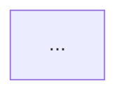

# BPMN 산출 컨벤션 (단일 진실 원천)

> 본 문서는 BPMN 2.0 파일 산출 시 모든 스킬/커맨드가 공통으로 따르는 규칙을 정의한다.
> 변경 시 본 문서만 수정하고 각 스킬은 본 문서를 참조하도록 유지한다.

---

## 1. 폴더 레이아웃 (V2 표준 — 필수)

분석 단위에 따라 산출 위치를 분리한다. BPA 마크다운(.md) 과 비즈니스 레벨 BPMN(.bpmn) 은 항상 **세트로 함께 산출** 한다.

| 분석 단위 | 마크다운 위치 | BPMN 위치 |
|---|---|---|
| **화면 (Screen, 단일 화면 BPA)** | `{MODULE}/{SCREEN-ID}/{SCREEN-ID}_bpa.md` | `{MODULE}/{SCREEN-ID}/{SCREEN-ID}.bpmn` |
| **프로세스 그룹 (PG, 복수 화면 통합)** | `{MODULE}/groups/PG-XX_{프로세스명}.md` | `{MODULE}/groups/PG-XX_{프로세스명}.bpmn` |
| **핸들러 레벨 (legacy2bpmn — 선택적)** | (해당 없음 — 별도 코드 분석용) | `{MODULE}/{SCREEN-ID}/{SCREEN-ID}_handler.bpmn` |

> V1 → V2 변경 요약:
> - 화면 BPA / BPMN 양분 폴더 (`bpa/` + `bpmn/`) 제거. 화면 폴더 안에 형제로 위치.
> - PG `bpa/groups/` → `groups/` 로 모듈 루트 승격.
> - Handler BPMN 위치 `service/ui/{SCREEN-ID}.bpmn` → `{SCREEN-ID}/{SCREEN-ID}_handler.bpmn` 으로 이동 + `_handler` suffix 로 비즈니스 BPMN 과 구분.

> 이유 (V2):
> - **화면 비즈니스 BPMN**: 화면 폴더 안에 `_bpa.md` + `.bpmn` + `_legacy_analysis.md` 가 형제로 위치하여 cross-reference 가 `./` 로 단순화.
> - **PG BPMN**: PG-md 와 PG-bpmn 은 한 쌍(같은 흐름의 두 표현). 같은 폴더 `groups/` 안에 둠.
> - **핸들러 레벨 BPMN**: `_handler` suffix 로 동일 폴더에서 비즈니스 BPMN 과 명확히 구분. 선택적 산출물로 격하.

`{MODULE}` 경로 prefix: `docs/external/SampleErp/orgErpReport/{MODULE-ID}/`

---

## 2. md ↔ bpmn 상호 링크 (필수)

마크다운의 워크플로우 다이어그램 섹션 상단에 BPMN 파일 링크를 명시한다.

**화면 BPA (`{SCREEN-ID}_bpa.md` §3 핵심 워크플로우, V2):**
```markdown
## 3. 핵심 워크플로우 (Mermaid)

> 📐 **BPMN 2.0 파일**: [./{SCREEN-ID}.bpmn](./{SCREEN-ID}.bpmn) — bpmn.io / Camunda Modeler / VS Code BPMN Editor 에서 DI 좌표 기반 다이어그램으로 렌더링. 아래 Mermaid 는 README 용 경량 시각화.


```

> V2: 동일 폴더이므로 `./` 경로 사용 (`../bpmn/` 아님).

**PG (`PG-XX_{프로세스명}.md` §2 End-to-End 프로세스 흐름):**
```markdown
## 2. End-to-End 프로세스 흐름

> 📐 **BPMN 2.0 파일**: [./PG-XX_{프로세스명}.bpmn](./PG-XX_{프로세스명}.bpmn) — bpmn.io / Camunda Modeler / VS Code BPMN Editor 에서 DI 좌표 기반 다이어그램으로 렌더링. 아래 Mermaid 는 README 용 경량 시각화.


```

---

## 3. Mermaid 노드 ↔ BPMN 요소 매핑

| Mermaid 노드 / classDef | BPMN 요소 | 비고 |
|---|---|---|
| 시작 (외부 트리거, `external`) | `bpmn:startEvent` | 36×36 |
| 핵심 처리 (`process`) | `bpmn:task` | 사용자 입력 → `userTask`, 시스템 → `serviceTask` 권장 |
| 분기/판별 (`decision`) | `bpmn:exclusiveGateway` | 마름모, `isMarkerVisible="true"` |
| sub-flow 묶음 | `bpmn:subProcess` | collapsed → `isExpanded="false"` |
| 종결 (정상) | `bpmn:endEvent` | 36×36 |
| 종결 (에러, `error`) | `bpmn:endEvent` + `errorEventDefinition` | 에러 종결 표시 |
| 환류 (loop back) | `bpmn:sequenceFlow` | waypoint 로 우회 경로 |

---

## 4. DI (Diagram Interchange) 좌표 — 절대 필수

`bpmn:process` 만 채우고 DI 를 빠뜨리면 BPMN 도구가 다이어그램을 그리지 못한다. **모든 visible element 에 `BPMNShape`, 모든 sequenceFlow 에 `BPMNEdge`** 를 1:1 대응.

### 4-1. 노드 표준 크기
| 요소 | width × height |
|---|---|
| startEvent / endEvent | 36 × 36 |
| task / userTask / serviceTask | 100~180 × 60~80 (텍스트 길이 따라) |
| exclusiveGateway | 50 × 50 |
| subProcess (collapsed) | 180~200 × 60~80 |
| subProcess (expanded) | 350 × 200 |

### 4-2. 좌표 간격
- 메인 흐름 수평 간격: X 축 200px (기본)
- 분기 후 수직 간격: ΔY = 120 (기본), 분기 수가 많으면 100px 까지 축소 허용
- 환류(loop) 화살표는 메인 흐름 가독성을 위해 메인 흐름과 다른 Y 축으로 분리

### 4-3. Waypoint
- 직선 흐름: 2개 (출발 → 도착)
- ㄱ자 (직각 꺾임): 4개
- 분기/머지 꺾임: 3~5개

### 4-4. 저장 전 체크리스트
- [ ] `bpmndi:BPMNDiagram` 루트 존재
- [ ] `BPMNPlane.bpmnElement` 가 `bpmn:process` id 와 일치
- [ ] 모든 visible element 의 `BPMNShape` 존재
- [ ] 모든 `sequenceFlow` 의 `BPMNEdge` 존재
- [ ] `exclusiveGateway` 에 `isMarkerVisible="true"`
- [ ] collapsed `subProcess` 에 `isExpanded="false"`
- [ ] sequenceFlow 분기 라벨이 있는 경우 `BPMNLabel` 좌표 지정

---

## 5. BPMN 파일 기본 골격

```xml
<?xml version="1.0" encoding="UTF-8"?>
<bpmn:definitions xmlns:bpmn="http://www.omg.org/spec/BPMN/20100524/MODEL"
                  xmlns:bpmndi="http://www.omg.org/spec/BPMN/20100524/DI"
                  xmlns:dc="http://www.omg.org/spec/DD/20100524/DC"
                  xmlns:di="http://www.omg.org/spec/DD/20100524/DI"
                  xmlns:xsi="http://www.w3.org/2001/XMLSchema-instance"
                  id="Definitions_{NAME}"
                  targetNamespace="http://ksm.co.kr/{module}/{scope}">

  <bpmn:process id="Process_{NAME}" name="{표시 이름}" isExecutable="false">
    <!-- elements + sequenceFlow -->
  </bpmn:process>

  <bpmndi:BPMNDiagram id="BPMNDiagram_{NAME}">
    <bpmndi:BPMNPlane id="BPMNPlane_{NAME}" bpmnElement="Process_{NAME}">
      <!-- BPMNShape × N, BPMNEdge × M -->
    </bpmndi:BPMNPlane>
  </bpmndi:BPMNDiagram>

</bpmn:definitions>
```

- `Process_*.isExecutable="false"` — 분석용/문서용 (실행 엔진 배포 아님)
- `targetNamespace` 의 `{scope}` 는 `screen` (화면) / `pg` (프로세스 그룹) / `legacy` (legacy2bpmn)
- 모든 element 의 `id` 는 영어 + 언더스코어. name 은 한글 허용.
- 각 element 의 `bpmn:documentation` 에 비즈니스 의미 + 관련 procedure/case 명시 (코드 레벨 아닌 BPA 수준)

---

## 6. 검증 (선택)

산출 후 `bpmn-validator` 가 있으면 검증 가능:
```bash
# bpmn.io 의 bpmn-js-cli 또는 Camunda Modeler 의 validate 기능
```

검증 없이도 다음을 만족하면 다이어그램이 정상 렌더됨:
- BPMNShape/BPMNEdge 1:1 대응
- waypoint 가 source/target shape 의 변에 닿거나 인접
- `bpmnElement` 참조 ID 가 실제 존재
