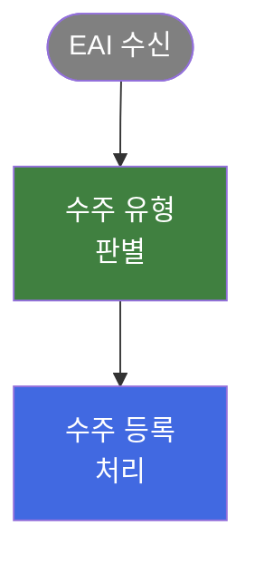

# 프로세스 그룹 통합 분석서 생성 (Phase 2)

> ⭐ **V4 (2026-05-13) — 영역 분리 폴더 구조 (필수)**
>
> 본 스킬의 모든 산출 경로는 V4 부터 **`{areaId}/{MODULE-ID}/...`** 로 해석 (root: `docs/external/SampleErp/orgErpReport/{areaId}/{MODULE-ID}/groups/PG-XX_{프로세스명}.{md,bpmn}`). 본문에 `{MODULE-ID}/` 로 적힌 경로는 자동으로 영역 prefix.
>
> **영역 매핑** (PLUGIN_USAGE.md §1.2.1 정본):
> - **품질**: QMA · QSA · QCA · QIA · QRG · QGA · QNA · QBA · QRA · RMA · GIA
> - **물류**: SFA · SFB · SOA · SOB · ITR · ICA · INV · MIM · STA · STB · STC · STD · MCC · IZA · IPA · IBA · BPG · BPM
> - **조업**: PMA · (향후 PCA · PFA · PGA · MAA · MCM · BOA · BOP)
> - 신규 모듈은 사용자에게 영역 결정 요청.
>
> 입력 모듈 INDEX 도 영역 prefix: `docs/external/SampleErp/orgErpReport/{areaId}/{MODULE-ID}/{MODULE-ID}_PROCESS_INDEX.md`. MODULE-ID 미지정 시 `docs/external/SampleErp/orgErpReport/*/*/{MODULE-ID}_PROCESS_INDEX.md` 로 자동 탐색.

모듈 진입점 `{MODULE-ID}_PROCESS_INDEX.md` 에서 지정된 프로세스 그룹의 화면 목록을 추출하고, 해당 화면들의 개별 BPA 를 읽어 **End-to-End 통합 프로세스 분석서** 를 생성한다.

> 산출물 템플릿(`templates/process_group_report_template.md`) 의 헤딩은 부산 시절 그대로 보존 — 산출물 동일성 우선. 본문 어휘는 [`_shared/vocabulary-mapping.md`](../_shared/vocabulary-mapping.md) 의 Java→C# / PL/SQL→T-SQL 매핑을 적용.

---

## 매개변수
- `PG-XX`: 프로세스 그룹 ID (예: PG-01)
- `MODULE-ID` (선택): 화면코드 prefix (SOA, QMA, HCA …). 생략 시 전체 모듈에서 검색.

---

## 절대 준수 규칙

### 규칙 1: 코드 레벨 상세 금지
C# 클래스명, procedure 이름, 메서드명, 컬럼명, 베이스 클래스명, 컨트롤명을 포함하지 않는다.

### 규칙 2: 업무 담당자 관점
기술 구현이 아닌 비즈니스 로직 중심으로 기술한다.

### 규칙 3: 중복 제거
여러 BPA 에서 반복되는 내용은 한 번만 기술한다. 개별 화면 나열이 아닌 통합 흐름으로 작성한다.

### 규칙 4: Mermaid 규칙
- 반드시 `flowchart TD` (세로) 사용. `flowchart LR` 금지
- 노드 내 줄바꿈은 `<br/>` 사용. `\n` 금지
- 한글 노드는 `["텍스트"]` 형식
- **색상 필수**: 모든 노드에 `classDef` + `class` 를 사용하여 역할별 색상을 지정한다
- 다이어그램 하단에 반드시 **범례** 섹션을 추가한다

#### Mermaid 색상 체계

노드의 업무 역할에 따라 아래 색상을 적용한다. 프로세스 특성에 맞게 조정 가능하나, 동일 분석서 내에서 일관성을 유지한다.

| classDef 이름 | 색상 | 용도 | 예시 |
|--------------|------|------|------|
| `external` | `fill:#808080,color:#fff` | 외부 시스템 | EAI, ERP, 관세청 |
| `trigger` | `fill:#4169E1,color:#fff` | 시작 트리거 | 이벤트 수신, 요청 접수 |
| `process` | `fill:#4169E1,color:#fff` | 핵심 처리 | 수주 등록, 매칭 처리 |
| `decision` | `fill:#408040,color:#fff` | 분기/판별 | 상태 판별, 유형 선별 |
| `sync` | `fill:#408080,color:#fff` | 동기화 | 데이터 동기화, 외부 연동 |
| `manual` | `fill:#005080,color:#fff` | 수동/보완 처리 | 수정 입력, 보완 처리 |
| `quality` | `fill:#408040,color:#fff` | 검수/품질 | 검수 관리, 품질 판정 |
| `query` | `fill:#808000,color:#fff` | 조회 화면 | 이력 조회, 현황 조회 |
| `error` | `fill:#C04040,color:#fff` | 오류/예외 | 에러 처리, 롤백 |

**적용 예시:**


### 규칙 5: 템플릿 준수
반드시 [templates/process_group_report_template.md](templates/process_group_report_template.md) 를 먼저 읽고, 섹션 구조를 정확히 따른다.

### 규칙 6: BPMN 2.0 파일 동시 산출 (세트 보장)

PG 분석서(.md) 와 동일 흐름의 BPMN 2.0 파일(.bpmn) 을 **항상 세트로 산출** 한다. Mermaid 가 렌더되지 않는 환경 + bpmn.io / Camunda Modeler / VS Code BPMN 확장 같은 정식 BPMN 도구에서 시각 확인하기 위함.

> 추가 예시·풀 골격은 [`../_shared/bpmn-output-convention.md`](../_shared/bpmn-output-convention.md) 정본 참조.

**6-1. 산출 위치 + PG 명명 규칙 (V3.1)**:

**규칙**:
- 단일/다중 화면 무관 → 모두 `{MODULE-ID}/groups/` 에 산출
- 단일 화면 PG 가 BPA 와 중복될 때만 산출 자체 스킵 (Step 1.5-b 휴리스틱)
- 파일명은 `PG-XX_{프로세스명}.md` — 단 `{프로세스명}` 은 **진입 화면군 공통명 + 통합 suffix** 권장

```
docs/external/SampleErp/orgErpReport/{MODULE-ID}/groups/PG-XX_{프로세스명}.md
docs/external/SampleErp/orgErpReport/{MODULE-ID}/groups/PG-XX_{프로세스명}.bpmn
```

### {프로세스명} 명명 규칙 (V3.1 — 진입 동선 기반)

사용자가 어떤 화면을 통해 본 PG 를 발견하는지를 기준으로 명명. 우선순위:

1. **다중 화면 PG + 공통 화면명**: 화면들이 공통 명사 (`품목미결처리`, `부적합검토` 등) 를 공유하면 그 공통명 + `(통합)` suffix
   - 예: GIA041~044K (생산/자재/구매/품질) → `PG-01_품목미결처리(통합)` (사용자가 `품목미결처리(품질)` 으로 진입해도 즉시 식별 가능)
   - 예: QMA010~013K (품질/기술/생기 부적합검토) → `PG-01_부적합검토(통합)`

2. **다중 화면 PG + 공통 명사 부재**: End-to-End 비즈니스 본질 + `(통합)` suffix
   - 예: SOA004K + SOA005K (Job 매칭) → `PG-01_{CLIENT}_Job_매칭(통합)`
   - 비즈니스 본질을 짧게 (15자 이내)

3. **단일 화면 PG**: 화면명 그대로 사용 (suffix 없음)
   - 예: SAA020K (수주등록Revision미결) → `PG-02_수주등록Revision미결`

### 파일명 sanitize
generate-bpa SKILL.md 의 화면명 sanitize 규칙을 동일 적용 (괄호 OK, 한글 OK, 슬래시/콜론 등 제거, 길이 60자 이내).

> **V3 → V3.1 변경**: 이전 V3 는 PG 명명을 "비즈니스 본질" 만 기준으로 했지만 (예: `신규품목등록`), 사용자가 진입한 화면과의 연관성이 약했다. V3.1 부터 진입 화면군 공통명을 우선해 식별성 향상.

> V2.1 → V3 변경: V2.1 의 단일 화면 PG → 화면 폴더 분기 정책 폐기. 화면 폴더 자체가 사라졌고 (`screens/` 평탄 구조), 모든 PG 산출물이 `groups/` 로 일원화.

**6-2. Mermaid 노드 ↔ BPMN 요소 매핑**:

| Mermaid 노드 / classDef | BPMN 요소 |
|---|---|
| 시작 (외부 트리거, `external`) | `bpmn:startEvent` |
| 핵심 처리 (`process`) | `bpmn:task` (사용자 입력이면 `userTask`, 시스템이면 `serviceTask`) |
| 분기 (`decision`) | `bpmn:exclusiveGateway` (마름모) |
| sub-flow 묶음 | `bpmn:subProcess` (collapsed — `isExpanded="false"`) |
| 종결 (정상) | `bpmn:endEvent` |
| 종결 (에러, `error`) | `bpmn:endEvent` + `errorEventDefinition` |
| 환류 (loop back) | `bpmn:sequenceFlow` (waypoint 로 우회) |

**6-3. DI 좌표 (BPMNDiagram) 절대 필수**:

`bpmn:process` 만 채우고 DI 를 빠뜨리면 BPMN 도구가 다이어그램을 그리지 못한다. **모든 visible element 에 `BPMNShape`, 모든 sequenceFlow 에 `BPMNEdge`** 를 1:1 대응.

좌표 산출 규칙:
- 노드 표준 크기: Event 36×36 / Task 100~180×60~80 / Gateway 50×50 / collapsed subProcess 180~200×60~80 / expanded subProcess 350×200
- 메인 흐름 수평 간격: X 축 200px
- 분기 후 수직 분배: ΔY = 100~120 (분기 수 많으면 100 까지)
- Waypoint: 직선 2개 / ㄱ자 4개 / 게이트웨이 분기 3~5개
- 환류(loop) 화살표는 메인 흐름과 다른 Y 축으로 분리 (가독성 우선)

저장 전 체크리스트:
- [ ] `bpmndi:BPMNDiagram` 루트 존재
- [ ] `BPMNPlane.bpmnElement` 가 process id 와 일치
- [ ] 모든 visible element 의 `BPMNShape` 존재
- [ ] 모든 `sequenceFlow` 의 `BPMNEdge` 존재
- [ ] `exclusiveGateway` 에 `isMarkerVisible="true"`
- [ ] collapsed subProcess 에 `isExpanded="false"`
- [ ] 분기 sequenceFlow 라벨 (있는 경우) `BPMNLabel` 좌표 지정

**6-4. md §2 본문 구성 (Mermaid 블록 바로 위에 BPMN 링크 명시)**:

```markdown
## 2. End-to-End 프로세스 흐름

> 📐 **BPMN 2.0 파일**: [./PG-XX_{프로세스명}.bpmn](./PG-XX_{프로세스명}.bpmn) — bpmn.io / Camunda Modeler / VS Code BPMN Editor 에서 DI 좌표 기반 다이어그램으로 렌더링. 아래 Mermaid 는 README 용 경량 시각화.

```mermaid
flowchart TD
... (Mermaid)
```
```

---

## 실행 절차

### Step 1: 프로세스 그룹 정보 확인

MODULE-ID 가 지정된 경우 (V3.2):
```
docs/external/SampleErp/orgErpReport/{MODULE-ID}/{MODULE-ID}_PROCESS_INDEX.md
```

미지정 시 Glob 으로 `docs/external/SampleErp/orgErpReport/*/*_PROCESS_INDEX.md` 검색 후 PG-XX 를 포함하는 파일 선택.

> V2 → V3 → V3.2 변경: `process_group_analysis.md` → `README.md` (V3, 진입점 승격) → `{MODULE-ID}_PROCESS_INDEX.md` (V3.2, 모듈별 README.md 동명 충돌 해소).

해당 파일에서 PG-XX 섹션을 찾아 아래 정보를 추출한다:
- 그룹 ID, 프로세스명, 화면 수
- 그룹 유형 (`통합` / `단일`)
- 포함 화면 목록 (SCREEN-ID, 업무명, 역할)
- 선행/후행 프로세스 관계
- (있으면) `PG 분류 정당화` 절의 자동 휴리스틱 점수

### Step 1.5: PG 유형 판정 + 단일 화면 PG 폐기 가능성 평가 (V2.2)

> **목적**: 단일 화면 PG 가 BPA 와 중복으로 양산되는 부작용을 차단. `define-process-groups` 단계에서 통합 PG 가능성을 놓쳤더라도 본 단계에서 재검증.

#### 1.5-a. 화면 수 ≥ 2 인 경우 (다중 화면 PG)

→ 그대로 통합 PG 분석서 생성 (Step 2 로 진행). 결과 산출 위치: `{MODULE-ID}/groups/PG-XX_*.md` + `.bpmn`

#### 1.5-b. 화면 수 = 1 인 경우 (단일 화면 PG 후보) — **재검증 필수**

다음 두 가지를 점검:

1. **인접 PG 와 통합 가능성 점검**:
   - `{MODULE-ID}_PROCESS_INDEX.md` 의 다른 PG 화면 중 본 화면과 동일 비즈니스 프로세스 / 같은 데이터 행 평행 update / 자매 procedure 동형 패턴이 있는지 Read 로 확인
   - 발견 시 → 사용자에게 "통합 PG 로 재분류 권장" 보고 후 종료 (정의 단계 재실행 권고)

2. **BPA 와의 중복 평가**:
   - 본 화면 BPA (`{MODULE-ID}/screens/{SCREEN-ID}.md`) 를 Read 하여 §3 ~ §11 의 정보가 단일 화면 PG 분석서에서 추가로 제공할 통합 시각 (cross-domain hand-off / 게이트 통합 / 도메인 분담 매트릭스) 이 있는지 평가
   - **있음** (외부 시스템 연동·다중 sub-flow·여러 도메인 cascade 등) → 단일 화면 PG 산출 계속 (Step 2 로 진행). 산출 위치: `{MODULE-ID}/groups/PG-XX_*.md` + `.bpmn`
   - **없음** (BPA + Legacy 와 사실상 같은 내용) → 단일 화면 PG 산출 안 함. 사용자에게 다음 메시지 보고:

     ```
     ⏭️ 단일 화면 PG 산출 스킵:
     - 그룹: PG-XX ({프로세스명})
     - 화면: {SCREEN-ID}
     - 사유: BPA + Legacy 와 중복 가능성 높음 — 통합 시각이 부재
     - 권고: `{MODULE-ID}_PROCESS_INDEX.md` 에서 본 PG 를 폐기하거나, 자매 화면을 추가 분석 후 통합 PG 로 재분류
     ```

#### 1.5-c. 산출 위치 결정 (재확인)

| 화면 수 | PG 유형 | 산출 위치 |
|---|---|---|
| ≥ 2 | 통합 | `{MODULE-ID}/groups/PG-XX_*.md` + `.bpmn` |
| = 1 + 통합 시각 있음 | 단일 | `{MODULE-ID}/groups/PG-XX_*.md` + `.bpmn` (V3 — `groups/` 로 통일) |
| = 1 + 통합 시각 없음 | (산출 스킵) | (없음) |

### Step 2: 개별 BPA 로드

해당 그룹의 모든 화면에 대해 BPA 문서를 읽는다 (V2):

```
docs/external/SampleErp/orgErpReport/{moduleId}/screens/{SCREEN-ID}.md
```

각 BPA 에서 추출할 핵심 정보:
- 섹션 2 (시스템 목적) → 프로세스 개요 입력
- 섹션 3~5 (워크플로우, 비즈니스 로직) → End-to-End 흐름 통합
- 섹션 7 (유즈케이스) → 비즈니스 규칙 추출
- 섹션 9 (관련 엔티티) → 데이터 모델 통합
- 섹션 11 (특이사항) → 예외 처리 및 설계 고려사항

### Step 3: 통합 분석서 작성

**반드시 [templates/process_group_report_template.md](templates/process_group_report_template.md) 를 먼저 읽고** 아래 8개 섹션 구조로 작성한다. 본문 어휘는 [`_shared/vocabulary-mapping.md`](../_shared/vocabulary-mapping.md) 적용:

1. **프로세스 개요** — 목적, 범위, 이해관계자, 비즈니스 가치
2. **End-to-End 프로세스 흐름** — 업무 단계(Step) 중심, Mermaid 다이어그램
3. **핵심 비즈니스 규칙** — 중복 제거 후 체계적 분류
4. **데이터 모델** — 핵심 테이블 통합 목록, 테이블 간 관계, **그룹 내 schema 통합 + hand-off 컬럼** (V2 표준화)
5. **외부 인터페이스** — 선행/후행 그룹 및 외부 시스템 연동
6. **예외 처리 및 오류 패턴** — 오류 유형, 레거시 처리 방식
7. **신규 시스템 설계 시 고려사항** — 한계점, 개선 기회, 도메인 경계
8. **용어 사전** — 도메인 용어 정의

#### Step 3.5: §4 데이터 모델 — schema 통합 + hand-off 표준화 (V2)

§4 (데이터 모델) 은 단순 테이블 목록을 넘어 다음 4개 하위 절을 포함한다:

##### 4-1. 그룹 내 핵심 테이블 (요약 표)
표 형태로 표시. PG 내 모든 화면이 참조하는 테이블의 통합 카탈로그.

##### 4-2. 테이블 간 관계 (Mermaid erDiagram 또는 텍스트 관계도)
N:1 / N:M 관계만 간략히. 컬럼 수준 ERD 는 생략하고 schema 분석 보고서로 위임.

##### 4-3. 그룹 내 화면이 공유하는 컬럼 lineage (V2 표준 — schema 통합)
한 그룹 내 여러 화면 (또는 한 화면 내 여러 partial class) 이 공유 컬럼을 어디서 갱신 / read 하는지의 매트릭스.

```markdown
> 본 그룹은 N개 화면으로 구성되나, 다음 컬럼들을 공유한다. 자세한 schema 분석은 [`../DBMS/tables/`](../DBMS/tables/).

| 컬럼 | 갱신 위치 | read 위치 | 갱신 procedure |
|---|---|---|---|
| **`{TABLE}.{STATUS_COL}`** | {Dialog-A} OnSave / {Dialog-B} OnSave | 메인 그리드 + {Dialog-A} Master | `{proc.case}` |
| ... | | | |
```

##### 4-4. PG-XX ↔ PG-YY hand-off 컬럼 (선행/후행 그룹과의 환류 컬럼)
선행 그룹이 본 그룹에 데이터를 넘기는 컬럼과, 본 그룹이 후행 그룹에 환류하는 컬럼을 각각 표로.

```markdown
#### PG-XX → PG-YY (상태 진입)
| 컬럼 | 트리거 시점 | 값 |
|---|---|---|
| `{TABLE}.{STATUS_COL}` = `'{초기 상태}'` | PG-XX 의 1차 등록 시 | `{값}` (다음 단계 대기) |

#### PG-YY → PG-XX (상태 전이 + 환류)
| 컬럼 | 트리거 시점 | 값 / 처리 |
|---|---|---|
| **`{TABLE}.{STATUS_COL}` = `'{종료 상태}'`** | PG-YY OnSave (검토 완료 시) | `{proc.case}` 갱신 → 판정 완료 |
```

##### 4-5. 트리거 hand-off (선택)
그룹 컨텍스트에서 영향을 받는 DB 트리거 (예: PG-01 의 DELETE 가 본 그룹에 영향). 트리거 분석 보고서로 링크.

##### 참조 사례
참조 형태: `{MODULE-ID}/groups/PG-XX_{프로세스명}.md` §4 데이터 모델. 4-1 ~ 4-5 모든 하위절이 채워진 형태.

### Step 4: BPMN 2.0 파일 동시 산출 (md 와 세트, DI 좌표 필수)

§2 의 Mermaid 와 의미적으로 동등한 BPMN 2.0 파일을 .md 와 같은 폴더에 산출. 규칙 6 의 매핑/좌표/체크리스트를 그대로 따른다 (정본: [`../_shared/bpmn-output-convention.md`](../_shared/bpmn-output-convention.md)).

**작업 순서:**

1. **요소 변환**: §2 Mermaid 의 각 노드를 규칙 6-2 매핑표대로 BPMN element 로 치환.
   - 한 화면 내의 여러 처리 단계가 묶이면 `bpmn:subProcess` (collapsed, `isExpanded="false"`) 로 응집
   - Mermaid arrow → `bpmn:sequenceFlow` (분기 라벨이 있으면 `name` 속성에 한글 그대로)
   - 각 element 에 `bpmn:documentation` 으로 비즈니스 의미 + 관련 procedure/case 요약 (BPA 수준 — 코드 식별자 아님)
2. **DI 좌표 계산**: 규칙 6-3 의 표준 크기/간격으로 배치.
   - 메인 흐름: X 축 좌→우, 200px 간격
   - 분기: Gw 에서 위/아래로 ΔY=100~120 으로 분배
   - 환류 sequenceFlow: 메인 Y 축 우회하여 별도 레인 (메인 흐름과 겹치지 않게)
3. **저장 전 체크리스트** (규칙 6-3 7항목) 전수 통과 확인.
4. **md ↔ bpmn 상호 링크**: PG md §2 (End-to-End 프로세스 흐름) Mermaid 블록 **바로 위** 에 규칙 6-4 형식대로 BPMN 파일 링크 명시.

저장 위치는 Step 5-2 규칙대로 단일/다중 화면 분기.

### Step 5: 저장 (V2.1 — 단일/다중 화면 분기)

**Step 5-1. 화면 수 확인**

`{MODULE-ID}_PROCESS_INDEX.md` 의 PG-XX 섹션에서 포함 화면 목록을 카운트.

**Step 5-2. 저장 위치 결정**

| 화면 수 | md 위치 | bpmn 위치 |
|---|---|---|
| **1개 + 통합 시각 있음** | `{MODULE-ID}/groups/PG-XX_{프로세스명}.md` | `{MODULE-ID}/groups/PG-XX_{프로세스명}.bpmn` |
| **1개 + 통합 시각 없음** | (산출 스킵 — BPA 중복) | (없음) |
| **2개 이상** | `{MODULE-ID}/groups/PG-XX_{프로세스명}.md` | `{MODULE-ID}/groups/PG-XX_{프로세스명}.bpmn` |

`groups/` 디렉토리가 없으면 생성한다 (다중 화면 PG 의 경우).

> V2 (이전 정책 — `bpa/groups/`) 는 더 이상 사용하지 않는다.

### Step 6: 완료 보고

```
프로세스 그룹 통합 분석서 생성 완료:
- 그룹: PG-XX ({프로세스명})
- 그룹 유형: 통합 (다중 화면 N개) 또는 단일 (1 화면)
- 모듈: {MODULE-ID}
- 통합 BPA 수: {N}건
- 핵심 비즈니스 규칙: {N}건
- 핵심 엔티티: {N}개
- 출력 (md):   docs/external/SampleErp/orgErpReport/{MODULE-ID}/{경로}/PG-XX_{프로세스명}.md
- 출력 (bpmn): docs/external/SampleErp/orgErpReport/{MODULE-ID}/{경로}/PG-XX_{프로세스명}.bpmn
```

또는 Step 1.5-b 에서 스킵 결정 시:

```
⏭️ 단일 화면 PG 산출 스킵:
- 그룹: PG-XX ({프로세스명})
- 화면: {SCREEN-ID}
- 사유: BPA + Legacy 와 중복 — 통합 시각 부재
- 다음 조치: {MODULE-ID}_PROCESS_INDEX.md 에서 본 PG 폐기 또는 자매 화면 추가 분석 후 통합 PG 로 재분류
```

---

## 품질 기준

| 항목 | 기준 |
|------|------|
| 완전성 | 모든 하위 BPA 의 핵심 내용이 반영되었는가 |
| 중복 제거 | 동일 내용이 반복 기술되지 않는가 |
| 흐름 일관성 | End-to-End 흐름이 논리적으로 연결되는가 |
| 추상화 수준 | 코드 레벨 상세 없이 비즈니스 로직만 기술되었는가 |
| 설계 유용성 | 신규 시스템 설계 시 참조 가능한 수준인가 |
| 용어 일관성 | 동일 개념에 동일 용어를 사용하는가, vocabulary-mapping.md 적용 |

---

## 실행 정책

- **세션 완수 정책 준수**: [`../_shared/session-completion-policy.md`](../_shared/session-completion-policy.md) — "다음 세션 산출 예정" / 단일 화면 PG 약식 금지. 한 응답에 다 안 들어가면 같은 세션 내 turn 분할로 §1~8 + BPMN 까지 완수.
- **{MODULE-ID}_PROCESS_INDEX.md 필수**: 이 문서가 없으면 `/define-process-groups {MODULE-ID}` 를 먼저 실행하도록 안내
- **항상 재생성**: 기존 그룹 분석서가 있어도 최신 BPA 기반으로 재생성
- **팀원 spawn 금지**: 직접 실행
