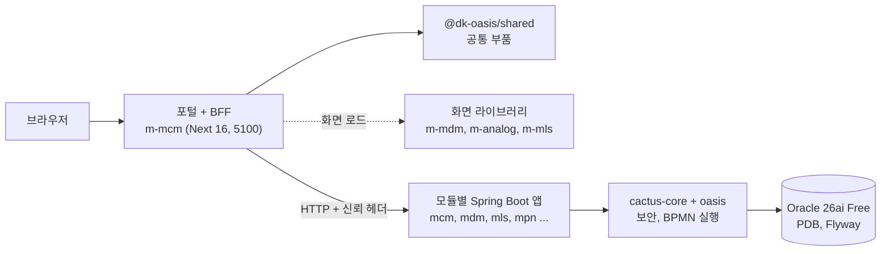
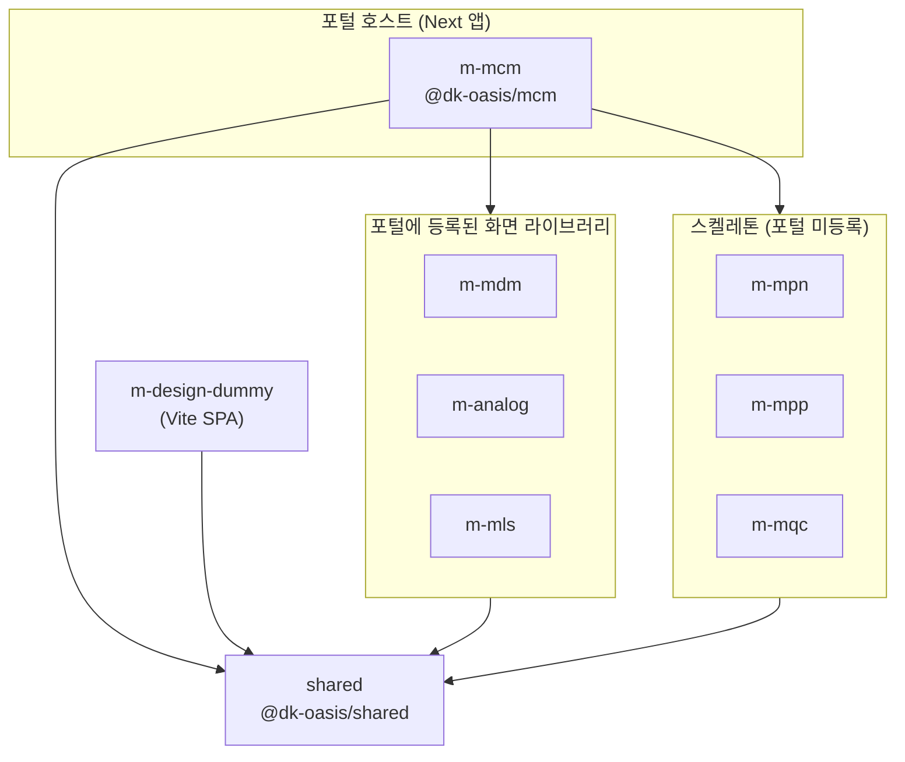
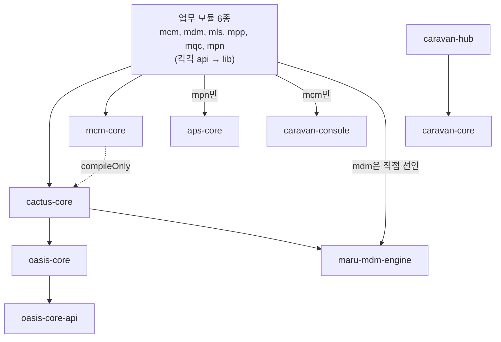
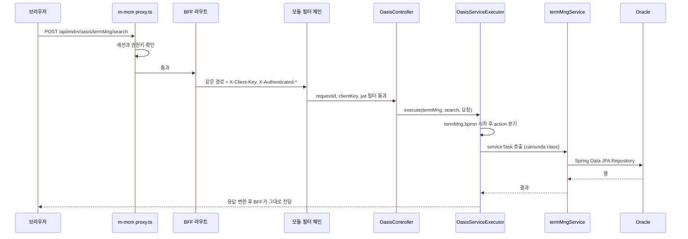

# DMES 아키텍처와 프로젝트 구조

이 문서는 DMES 저장소의 전체 구조를 처음 익히는 사람을 위한 학습용 입구 문서입니다.
무엇이 어디에 있고, 어떤 라이브러리를 쓰고, 부품끼리 어떻게 포함하고 의존하는지를 한 곳에 모았습니다.

- 마지막 확인: 2026-10-10, 커밋 `08453367b` 기준으로 코드와 대조했습니다.
- 사실은 코드에서 확인한 것만 적었습니다. 코드로 확인하지 못한 내용은 `(추정)`으로 표시했습니다.
- 규칙과 작업 분기의 정본은 [RULE.md](../RULE.md)입니다. 이 문서는 규칙을 정하지 않고 구조만 설명합니다.
- 프로젝트와 폴더를 부르는 이름(`*-core`, `*-lib`, `*-app`)의 규칙은 [Workspace-Structure.md](guide/Common/Workspace-Structure.md)가 정본입니다.

---

## 1. 한눈에 보기

### 1.1 시스템이 하는 일

- DMES는 고객사 ERP를 신규 APS(고급 계획·스케줄링)와 MES(제조 실행)로 옮겨 구축하는 프로젝트의 표준 템플릿입니다. 근거는 [README.md](../README.md) 첫 단락입니다.
- 사용자는 브라우저에서 포털(`http://localhost:5100`)에 로그인한 후 메뉴로 화면을 엽니다.
- 포털은 Next.js 앱 하나(`m-mcm`)이고, 업무 화면은 모듈별 라이브러리(`m-mdm`, `m-analog` 등)가 제공합니다. 포털이 이 화면을 불러와 탭에 올립니다.
- 백엔드는 모듈마다 따로 뜨는 Spring Boot 앱입니다. 업무 로직은 BPMN 서비스 흐름으로 정의하고 OASIS 엔진이 실행합니다.
- DB는 로컬, 시험, 운영 모두 Oracle 하나입니다(2026-10-07 전환). 이전 문서에 있던 SQLite, PostgreSQL, MSSQL 전제는 폐기됐습니다.
- 이 저장소는 템플릿이라서 `mcm`, `mdm`, `analog`만 실제로 동작하는 업무 코드가 있습니다. `mls`, `mpp`, `mqc`, `mpn`, `aps-core`는 `sample` 예시 한 벌만 있습니다([README.md](../README.md) "바로 동작하는 기반").

### 1.2 구조 개요

### 1.3 최상위 폴더

| 폴더 | 역할 | 더 보기 |
|---|---|---|
| `src/backend/` | Gradle 백엔드. 독립 빌드 15개를 `includeBuild`로 묶은 집합 | 3장 |
| `src/frontend/` | pnpm 모노레포. 포털, 공통 부품, 모듈별 화면 라이브러리 | 2장 |
| `docs/` | 설계, 개발 가이드, 결정 기록. 입구는 [docs/guide/README.md](guide/README.md) | 6장 |
| `scripts/` | 저장소 공용 도구: `oracle/`(PDB 관리), `db-snapshot/`, `perf/`, `build-verify/`, `mdm-meta/`, `lib/` | `scripts/oracle/README.md` |
| `tools/` | `oracle-free/docker-compose.yml`(로컬 Oracle 컨테이너), `bp-sync`(외부 설계 문서 동기화) | [BP-Workspace-Sync.md](guide/Common/BP-Workspace-Sync.md) |
| `db-snapshot/` | 템플릿 PDB에 넣는 시드 CSV. 스키마별 폴더 | `scripts/db-snapshot/` |
| `.claude/skills/` | 에이전트 스킬의 정본(`flyway-migration-add`, `mantine-aggrid-ui`, `oasis-contract-check` 등) | [RULE.md](../RULE.md) "로컬 스킬 라우팅" |
| 루트 스크립트 | `local-run.sh`(전체), `be-run.sh`(백엔드), `fe-run.sh`(프론트). Windows용 `.ps1`/`.cmd`도 있습니다 | [README.md](../README.md) "빌드·실행" |

---

## 2. 프론트엔드 (`src/frontend/`)

### 2.1 패키지 목록

`pnpm-workspace.yaml`에 등록된 패키지는 9개입니다. `e2e/`는 패키지가 아니고 루트의 Playwright 시험 폴더입니다.

| 폴더 | NPM 이름 | 종류 | 역할 | 주요 의존 |
|---|---|---|---|---|
| `shared` | `@dk-oasis/shared` | tsup 라이브러리 | 공통 UI, 그리드, 포털 셸, 인증, HTTP, OASIS 프록시, 위젯 | Mantine(peer), ag-grid(peer), tiptap, mermaid, react-grid-layout, next-auth |
| `m-mcm` | `@dk-oasis/mcm` | Next 16 앱 | 포털 호스트 + BFF + 공통관리 화면(마스터코드, 시스템관리, 업무기준, 위젯) | shared + `m-*` 전부(`workspace:*`) |
| `m-mdm` | `@dk-oasis/m-mdm` | tsup 라이브러리 | MDM 화면 19개(dma~dme: 용어, 도메인, 컬럼, 코드, 룰, 룰 세트) | shared, `@xyflow/react`, `@dagrejs/dagre` |
| `m-analog` | `@dk-oasis/m-analog` | tsup 라이브러리 | 로그 뷰어, DB 뷰어 | shared, `monaco-editor`, `react18-json-view` |
| `m-mls` | `@dk-oasis/m-mls` | tsup 라이브러리 | 물류. 현재 `sample` 화면 1개 | shared |
| `m-mpn` | `@dk-oasis/m-mpn` | tsup 라이브러리 | APS. `sample` 화면 1개 | shared |
| `m-mpp` | `@dk-oasis/m-mpp` | tsup 라이브러리 | 조업. `sample` 화면 1개 | shared |
| `m-mqc` | `@dk-oasis/m-mqc` | tsup 라이브러리 | 품질. `sample` 화면 1개 | shared |
| `m-design-dummy` | `@dk-oasis/m-design-dummy` | Vite 7 SPA | 디자인 검토용 샌드박스. 백엔드 없이 뜸 | shared, ag-grid, Mantine |

- 근거 파일: 각 폴더의 `package.json`, `tsup.config.ts`, `src/frontend/pnpm-workspace.yaml`.
- `m-mls`는 2026-10-07에 공지 화면(`lsh/noticeMgmt`)을 `m-mcm`으로 옮겼습니다. 그래서 지금은 `sample`만 있습니다.
- 모듈 라이브러리는 `src/`가 작고, 화면은 패키지 루트의 `pages/{그룹}/{화면}/page.tsx`에 있습니다. `m-mdm`은 `pages/` 아래 파일이 310개입니다.
- `m-mcm`에는 `src/`가 없습니다. `app/`(Next 라우트), `lib/`, `page-components/`(화면), `widgets/`와 `widget-types/`(위젯)이 패키지 루트에 있습니다.

### 2.2 `@dk-oasis/shared`의 진입점

`shared`는 하위 경로마다 진입점이 따로 있습니다. 각 진입점은 `tsup.config.ts`의 entry와 `package.json`의 `exports`에 1:1로 대응합니다.

| 분류 | 진입점 |
|---|---|
| 포털 | `./portal-shell`, `./portal-shell-core`, `./portal-menu`, `./layout` |
| 인증 | `./auth-server`, `./auth-proxy`, `./auth-routes`, `./auth-cookies`, `./auth-rbac-policy`, `./auth-login-*` |
| 통신 | `./http`, `./oasis`, `./oasis-proxy`, `./use-api-call` |
| UI 부품 | `./grid`, `./form`, `./tree`, `./tabs`, `./modal`, `./card`, `./charts`, `./lookup` 등 약 25개 |
| 편집기·위젯 | `./markdown-editor`, `./html-editor`, `./widget`, `./dashboard`, `./screen-context` |
| MDM 연계 | `./mdm-meta`(화면 캡션과 툴팁 메타), `./evalex`(EvalEx 식 평가기) |
| 공통·CSS | `./ui-provider`, `./message-provider`, `./utils`, `./lib`, `./*.css` 8개 |

- 새 부품을 만들면 진입점을 `tsup.config.ts`와 `package.json`의 `exports` 두 곳에 함께 적습니다.
- `evalex`는 원래 `m-mdm`에 있었지만, `shared`가 `m-mdm`을 가져오면 순환이 생겨서 `shared`로 옮겼습니다(`shared/src/evalex/index.ts` 머리 주석). `@dk-oasis/m-mdm/evalex`는 이를 다시 내보냅니다.

### 2.3 포함 관계

- 화살표는 `package.json`의 `workspace:*` 의존입니다. `m-mcm`은 `m-*` 7개를 모두 의존으로 선언합니다.
- 포털이 실제로 화면을 불러오는 모듈은 `mcm`, `analog`, `mls`, `mdm` 4개입니다(`m-mcm/app/portal/module-config.ts`의 `PORTAL_MODULE_CONFIG`).
- `mpn`, `mpp`, `mqc`는 의존만 선언돼 있고 `PORTAL_MODULE_CONFIG`에는 없습니다. 주석에 추가 예시만 있습니다.
- 페이지 레지스트리 생성기(`m-mcm/scripts/generate-page-registry.mjs`)는 `m-mpp`, `m-mls`, `m-mdm`의 `pages/`를 스캔합니다. 포털 등록은 별도 단계입니다.

### 2.4 포털이 모듈 화면을 불러오는 과정

1. 로그인한 사용자의 메뉴를 `/api/mcm/oasis/secUser/myMenusTree`로 가져옵니다. 각 메뉴 행에는 `sysCd`(모듈)와 `componentPath`(화면)가 있습니다.
2. 포털 셸(`shared/src/portal-shell`)이 `{moduleId}:{pageName}` 형태의 `pageId`를 만듭니다. `componentPath`가 없으면 `sysCd`와 경로로 조립합니다.
3. `m-mcm/app/portal/registered-modules.ts`의 `resolvePortalPage()`가 `pageId`를 풀어 `module-config.ts`의 모듈별 로더를 부릅니다.
4. 로더는 `lib/generated/page-registry.ts`의 `PAGE_REGISTRY`에서 키(`dma/termMng` 같은 `{그룹}/{화면}`)를 찾습니다. 값은 `() => import("@dk-oasis/m-mdm/pages/dma/termMng/page")` 형태입니다.
5. `m-mcm/next.config.ts`의 `transpilePackages`가 `shared`와 등록된 모듈 패키지를 변환합니다. 모듈 패키지는 소스가 아니라 `dist`를 `exports`로 소비합니다.

참고할 점은 다음과 같습니다.

- `PAGE_REGISTRY`는 생성 파일입니다. `predev`와 `prebuild` 훅이 `generate-page-registry.mjs`를 돌려 갱신합니다. 손으로 고치지 않습니다. 현재 44개 항목이 있습니다.
- `m-analog`는 레지스트리 대신 `ANALOG_STATIC_PAGES` 정적 매핑으로 불러옵니다. 화면 CSS를 JS와 함께 가져와야 하기 때문입니다.
- 팝업 전용 그룹(`ppz`, `lsz`, `cmz`)은 레지스트리에 올리지 않고 부모 화면이 모달로 직접 import합니다.

### 2.5 BFF와 API 경로

`m-mcm/app/api/`가 BFF(Backend For Frontend)입니다. 브라우저는 백엔드를 직접 부르지 않고 항상 포털을 거칩니다.

| 브라우저가 부르는 경로 | 처리 | 백엔드로 가는 경로 |
|---|---|---|
| `/api/{module}/oasis/{serviceId}/{action}` | `shared/oasis-proxy`의 `createOasisProxyHandler` | `{모듈 주소}/oasis/{serviceId}/{action}` 그대로 |
| `/api/{module}/rest/{objId}/{action}/...` | `m-mcm/lib/http/be-proxy.ts`의 `forwardToBackend` | `rest/` 조각만 빼고 전달 |
| `/api/auth/*` | next-auth 라우트(`auth/[...nextauth]`, `me`, `password`, `force-logout`) | 로그인만 BE `/api/auth/login` 호출 |
| `/api/{module}/service/...`, `/query/...`, `/lov/query/...` | proxy가 항상 403 | 직접 실행 경로는 막혀 있습니다 |

- `{module}`은 `mcm`, `mdm`, `mls`, `mpn`, `mpp`, `mqc`, `analog` 중 하나입니다. 모듈마다 UI와 서버를 따로 나눈 것은 의도입니다. 경로를 하나로 통일하지 않습니다.
- 백엔드 주소는 `{MODULE}_WAS_URL` 환경변수가 있으면 그 주소로 직접 갑니다(개발). 없으면 `BACKEND_API_URL`에 `/{module}`을 붙입니다(운영 Nginx 게이트웨이). 코드 기본값은 `http://localhost:8080`이고, `.env.example`은 `http://localhost:8100`으로 덮어씁니다(`be-proxy.ts`, `m-mcm/.env.example`).
- BFF가 BE로 보내는 헤더는 `X-Client-Key`, `X-Authenticated-User`, `X-Authenticated-Role` 3종입니다. 사용자 JWT와 쿠키는 BE로 넘기지 않습니다(`be-proxy.ts` 266~282행, [Portal 가이드](guide/FrontEnd/Portal-Development-Guide.md) 1-2절). `be-proxy.ts` 머리 주석에는 `Authorization: Bearer`도 적혀 있지만 코드는 보내지 않습니다.
- 경로 조각에 인코딩된 `/`, `\`, `.`, `;`가 있으면 권한 판정 전에 400으로 막습니다(`lib/http/path-guard.ts`).

### 2.6 인증과 권한

| 단계 | 위치 | 내용 |
|---|---|---|
| 로그인 | `shared/src/auth/server.ts`, `m-mcm/lib/auth/config.ts` | next-auth 4의 `CredentialsProvider`, 세션 전략은 `jwt`. 사용자 확인은 BE `mcm`의 `/api/auth/login`으로 합니다 |
| 세션 쿠키 | `m-mcm/lib/auth/session-cookie.ts` | 이름은 `AUTH_COOKIE_PREFIX`에서 만들고, `NEXTAUTH_URL`이 https면 `__Secure-`를 붙입니다 |
| 요청 가드 | `m-mcm/proxy.ts` | Next 16의 `proxy.ts`가 `middleware.ts` 역할을 합니다. `/portal/*`은 미인증이면 `/login`으로, `/api/*`는 세션과 RBAC 권한키를 검사합니다 |
| 권한 판정 | `shared/src/auth/rbac-policy.ts`(`evaluateApiPolicy`) | 사용자 권한키를 BE `/api/sec/perm-keys`에서 받아 BFF가 5분 캐시합니다 |

- 권한키는 `/api/{module}/{objId}/{action}`의 3개 조각에서 만듭니다. OASIS 경로의 `oasis` 조각은 키에 넣지 않습니다([BFF-RBAC 설계](framework/BFF-RBAC-상세설계-구현계획.md)).
- 초기 계정은 `admin`입니다. 비밀번호와 비밀값(`AUTH_SECRET`, `BACKEND_CLIENT_KEY`)은 [README.md](../README.md)의 안내대로 교체합니다.

### 2.7 빌드와 개발 서버

- 모듈 라이브러리는 모두 tsup(ESM, `target es2022`)으로 `dist/`를 만듭니다. `m-mcm`은 `next build`로 `output: "standalone"`을 만듭니다.
- `shared`와 `m-mdm`의 `.d.ts`는 tsup이 아니라 `tsc -p tsconfig.build.json`이 `dist/types/`에 만듭니다. tsup dts가 메모리 3GB 이상을 써서 OOM이 났기 때문입니다(`shared/tsup.config.ts` 주석).
- `src/frontend/scripts/lib-dev.mjs`가 라이브러리 개발 빌드를 맡습니다. `build`는 입력이 바뀐 패키지만 tsup으로 빌드하고, `watch`(패키지 `dev`)는 변경 시 JS만 약 1초에 다시 빌드하고, `pkg-build`(패키지 `build`)는 같은 패키지의 watch가 떠 있으면 watch에 위임합니다.
- 라이브러리의 tsup `clean`은 꺼져 있습니다. 호스트(`m-mcm`) dev 서버가 `dist`를 감시하므로, dist가 비면 번들러 캐시가 깨지기 때문입니다.
- 루트 `pnpm dev`는 라이브러리를 먼저 빌드한 뒤 라이브러리 watch와 `m-mcm` dev를 병렬로 띄웁니다. 보통은 저장소 루트의 `fe-run.sh`를 씁니다.

| 대상 | 포트 | 근거 |
|---|---|---|
| 포털 `m-mcm` | 5100 | `m-mcm/package.json` |
| `m-design-dummy` | 5175 | `m-design-dummy/package.json` |
| `m-mls`/`m-mpn`/`m-mpp`/`m-mqc`/`m-mdm`의 `dev:next` | 5004/5003/5006/5005/5007 | 각 `package.json`. 라이브러리에 `next.config`가 없어 남은 보조 스크립트로 보입니다 (추정) |

---

## 3. 백엔드 (`src/backend/`)

### 3.1 빌드 구조: 하나가 아니라 독립 빌드의 집합

- `src/backend/settings.gradle`의 `rootProject.name`은 `backend`이고, `dmesIncludeBuild(경로, 좌표)`를 15번 부릅니다. 이 도우미는 `includeBuild`와 `dependencySubstitution`(좌표를 그 빌드 루트로 치환)을 함께 합니다(`gradle/include-builds.settings.gradle`).
- 포함된 15개: `mpn`, `cactus-core`, `aps-core`, `mcm-core`, `caravan-console`, `mpp`, `mqc`, `mls`, `mcm`, `localKafka`, `caravan-core`, `caravan-hub`, `analog`, `mdm`, `maru-mdm-engine`.
- 루트에 없는 것: `oasis`(`cactus-core`가 `../oasis`를 끌어옴), `build-logic`(공통 규약 플러그인 빌드), `data-migration`(Gradle이 아닌 Node 이관 예시).
- 루트 `build.gradle`은 집계 태스크 `buildAll`, `testAll`, `cleanAll`만 둡니다. `testAll`은 `mpn`, `mpp`, `mqc`, `mcm`, `mls`, `analog`의 `lib`/`api` 하위 시험을 돌리지 않습니다. 이 모듈은 `../gradlew :mls:lib:test`처럼 직접 돌립니다.
- Gradle wrapper는 `src/backend` 한 벌(9.3.1)이고, 자바는 21 툴체인입니다. 예외로 `oasis-core`와 `oasis-core-api`는 Java 17로 컴파일하고, `analog`는 자기 카탈로그(Spring Boot 3.4.3)를 따로 씁니다.
- 버전 카탈로그는 `gradle/libs.versions.toml`이고, 각 모듈 `settings.gradle`이 `libs`로 가져옵니다.
- 공통 규약은 `build-logic/`(Groovy 플러그인)에 있습니다. `dmes.business-module`은 `mpn`, `mpp`, `mqc`, `mls`, `mcm` 루트에만 적용돼 하위 프로젝트에 `java-library`, Java 21, lombok, JUnit 5를 줍니다. `dmes.test-conventions`는 거의 모든 모듈에 적용돼 시험 JVM 설정과 시험용 PDB 복제(`-Pdmes.ora.test=clone`)를 맡습니다.

### 3.2 모듈 목록

| 경로 | 종류 | 역할 | 포트 |
|---|---|---|---|
| `oasis/oasis-core`, `oasis-core-api` | 라이브러리 | BPMN 2.0 실행 엔진. 버전 5.1.1, 그룹 `com.dongkuk` | - |
| `cactus-core` | 라이브러리 | 공통 플랫폼. 보안(ClientKey, JWT), 감사, 다중 DataSource와 트랜잭션, OASIS 연결 컨트롤러 | - |
| `maru-mdm-engine` | 라이브러리 | MDM 룰 평가 엔진. 의존은 EvalEx 하나. 그룹 `kr.dongkuk.maru.mdm` | - |
| `mcm-core` | 라이브러리 | 메뉴, 권한(RBAC), 마스터코드, 업무기준, 위젯, 예약 작업 | - |
| `aps-core` | 라이브러리 | APS 도메인 라이브러리. 다른 업무 모듈에 의존하지 않음. 현재 sample 엔티티 하나 | - |
| `mcm/{lib,api}` | WAR 앱 | 포털 백엔드. 로그인(`/api/auth`), 시드(`DataInitializer`), RBAC 필터, 공지 | 8100 |
| `mdm/{lib,api}` | WAR 앱 | 표준 용어, 도메인, 컬럼, 코드, 레이아웃, 룰, 룰 세트. BPMN 27개 | 8096 |
| `mls/{lib,api}` | WAR 앱 | 물류. sample | 8092 |
| `mqc/{lib,api}` | WAR 앱 | 품질. sample | 8093 |
| `mpp/{lib,api}` | WAR 앱 | 조업. sample | 8094 |
| `mpn/{lib,api}` | WAR 앱 | APS 런처. `aps-core`를 조립 | 8095 |
| `analog/{core,api}` | 부트 JAR 앱 | 서버 로그 검색과 DB 뷰어 | 8191 |
| `caravan-core` | 라이브러리 | Kafka 인터페이스 라이브러리 | - |
| `caravan-hub` | WAR 앱 | Camel 기반 시스템 간 인터페이스 허브 | 8200 |
| `caravan-console` | 라이브러리 | 카라반 운영 콘솔의 엔티티와 REST 클라이언트. `mcm/lib`에 포함됩니다 | - |
| `localKafka/api` | 부트 JAR 앱 | 로컬 임베디드 Kafka(KRaft) | 9092 |

- 포트의 근거는 각 `api/src/main/resources/application.yml`의 `server.port`입니다. 어떤 `application*.yml`에도 `context-path`는 없습니다.
- WAR 모듈은 운영에서 외부 WildFly에 올립니다(`bootWar`, tomcat-embed는 `providedRuntime`). 로컬은 `be-run.sh`가 `java`로 직접 띄웁니다.
- `RULE.md`가 `mas`를 언급하지만 `src/backend/mas`는 없습니다.

### 3.3 모듈 의존 관계

- 실선은 `build.gradle`의 `api`/`implementation` 의존이고, 점선은 `compileOnly`입니다. `mcm-core`는 `cactus-core`를 컴파일에만 쓰므로, 런타임에는 호스트 앱이 `cactus-core`를 제공합니다 (추정).
- `analog/api`는 `analog/core`에만 의존합니다. `localKafka`, `aps-core`, `caravan-core`, `caravan-console`은 다른 내부 모듈에 의존하지 않습니다.
- `mcm/api`는 게이트웨이가 아닙니다. 다른 모듈로 요청을 나눠 주지 않고, BFF가 모듈마다 자기 포트로 직접 부릅니다.
- `mcm-core`는 [Mcm-Core-Onboarding.md](guide/BackEnd/Mcm-Core-Onboarding.md)에 따라 cactus 없이도 쓸 수 있게 설계됐습니다(모드 B).
- `mcm-core`를 앱(`mcm`)과 나눈 이유는 [ADR-0003](guide/adr/0003-mcm-core-library-split.md)에 있고, MDM을 같은 방식으로 나누지 않은 이유도 그 문서에 있습니다. 새 코드를 둘 위치는 개발자용 [코드 배치 기준](guide/BackEnd/standard-v2/backend-standard/02-structure-naming-constraints.md#3-3-코드-배치-기준)을 따릅니다.

### 3.4 요청 흐름

화면에서 용어를 검색할 때(`mdm`의 `termMng` 화면, `search` 동작) 흐름입니다.

BFF가 세션과 RBAC를 확인한 후 모듈 주소(`MDM_WAS_URL`)로 넘긴 다음의 단계입니다.

| 단계 | 위치 | 내용 |
|---|---|---|
| 1. 필터 | `cactus-core/.../autoconfigure/CactusWebSecurityAutoConfiguration.java` | 기본 체인은 `RequestIdFilter`, `ClientKeyFilter`, `JwtAuthenticationFilter` 순입니다. `ClientKeyFilter`가 `X-Client-Key`를 확인하고 `X-Authenticated-*`로 사용자를 세웁니다 |
| 2. 컨트롤러 | `cactus-core/.../web/inbound/OasisController.java` | `/oasis`, `/{moduleId}/oasis`, `/api/{moduleId}/oasis` 아래 `POST /{serviceId}/{action}`을 받습니다 |
| 3. 실행기 | `cactus-core/.../oasis/OasisServiceExecutor.java` | txId와 MDC를 정하고, 감사 정보를 만들고, 요청을 변환한 후 `serviceStarter.start(serviceId, ctx)`를 부릅니다 |
| 4. BPMN | `mdm/api/src/main/resources/services/dma/termMng.bpmn` | 프로세스 id가 `serviceId`입니다. `exclusiveGateway`가 `action`으로 분기하고, 각 `serviceTask`가 `camunda:class="termMngService"`로 빈을 부릅니다 |
| 5. 서비스 | `mdm/lib/.../mdm/dma/termMng/service/TermMngService.java` | Spring `@Service` 빈입니다. 업무 로직을 수행합니다 |
| 6. 저장소 | `mdm/lib/.../mdm/repository/MdmTermRepository.java` | Spring Data JPA로 Oracle에 접근합니다 |

- BPMN 파일은 `<모듈>/api/src/main/resources/services/**.bpmn`에 있고, `cactus.oasis.service-path`(기본 `/services`)로 읽습니다. 개수는 `mcm/api` 40개, `mdm/api` 27개, `mcm-core` 3개입니다. `mls`, `mpn`, `mpp`, `mqc`에는 아직 없습니다.
- OASIS는 BPMN XML을 읽는 자체 엔진입니다. `camunda:` 접두는 확장 속성의 XML 이름공간일 뿐이고, Camunda나 Flowable 라이브러리는 의존하지 않습니다(`oasis-core/build.gradle`).
- OASIS 진입 서비스에는 `@Transactional`을 붙이지 않습니다. 프록시가 생기면 파라미터 이름이 사라져 바인딩이 실패하기 때문입니다([Backend-Implementation-Guide.md](guide/BackEnd/Backend-Implementation-Guide.md)). 트랜잭션은 실행기가 감쌉니다.

### 3.5 보안 계층

| 계층 | 위치 | 하는 일 |
|---|---|---|
| BFF | `m-mcm/proxy.ts` | 세션 확인, 직접 실행 경로 차단, 권한키 검사. 모든 모듈에 적용됩니다 |
| 모듈 공통 | `cactus-core`의 기본 체인 | `X-Client-Key` 확인, 선택적으로 JWT 검증 |
| `mcm`만 추가 | `mcm/api/.../config/SecurityConfig.java` | 체인 순서가 `requestId → clientKey → jwt → revokedToken → endpointPerm`입니다. `EndpointPermissionFilter`(`mcm-core`)가 URL을 `PermKey`로 풀어 사용자 권한 캐시와 대조하고, 없으면 403을 줍니다 |

- `EndpointPermissionFilter`를 체인에 넣는 곳은 `mcm/api`뿐입니다. `mdm`, `mls`, `mpn` 등은 BFF의 권한 검사에 의존합니다. 이 모듈들에 BE 권한 검사를 넣을 계획이 있는지는 확인하지 못했습니다.
- 로그인은 `mcm/lib`의 `McmAuthController`(`/api/auth`)가 받아 JWT를 발급합니다.
- 상세 정책은 [Security-Guide.md](guide/Security/Security-Guide.md)와 [RBAC-PATH-CONVENTION.md](guide/Security/RBAC-PATH-CONVENTION.md)를 봅니다.

### 3.6 DB 접근과 마이그레이션

| 항목 | 내용 |
|---|---|
| 주 접근 방식 | Spring Data JPA(Hibernate). `@Entity`는 `mcm-core` 48개, `mdm/lib` 32개 등 |
| 보조 방식 | MyBatis. XML 매퍼는 `cactus-core`(`persistence/dmom`), `mcm/api`(`persistence/query/cma`), `caravan-hub`(`mapper/{mst,if}`)에 몇 개 있습니다 |
| 드라이버 | `ojdbc11` 23.9.0.25.07(Spring Boot BOM이 정함) |
| 연결 | 로컬은 `jdbc:oracle:thin:@//localhost:1521/<PDB>`. 운영(WildFly)은 JNDI(`java:/jdbc/<모듈>/dsBiz`) |
| `mcm` 연결 | 한 PDB에 DataSource 4개: `MCMAPUSER`(biz, cmn), `EAIUSER`(if), `CARAVANUSER`(caravan) |

Flyway 위치는 모듈마다 다릅니다. 정본은 [schema-owners.md](oracle-1007/schema-owners.md)입니다.

| 모듈 | 마이그레이션 위치(`src/main/resources/db/migration/...`) | V 파일 수(최신) | 적용 방식 |
|---|---|---|---|
| `mcm-core` | `oracle/mcmapuser`, `oracle/mcaapuser`, `oracle/mcm_source`, `oracle/mcm_backup` | 12(V12) / 2 / 2 / 2 | `mcm/api`의 `McmFlywayConfig`가 스키마별 4개 Flyway를 돌립니다(`dmes.flyway.enabled=true`일 때) |
| `mdm` | `mdm/api/.../mdm/oracle` | 5(V5) | `application-local.yml`에 위치 설정, WildFly에서는 끔 |
| `mls`, `mpn`, `mpp`, `mqc` | `<모듈>/api/.../<모듈>` | 각 1(V1 baseline) | `spring.flyway.enabled: true` |
| `aps-core` | `aps-core/.../aps-core` | 1(V1) | 어느 호스트 앱이 적용하는지 확인하지 못했습니다 |
| `caravan-hub` | `caravanuser`, `ifuser` | 각 1 | `HubFlywayConfig` |

- 운영(WildFly)에서는 Flyway를 끄고 DBA가 같은 V 파일을 적용합니다.
- 머지된 V 파일은 주석 한 줄도 고치지 않습니다. 체크섬이 바뀌어 이미 적용한 PDB가 검증에서 실패합니다. 바꿀 일은 새 번호로 추가합니다.
- `mcm-core`의 옛 SQLite 마이그레이션은 `mcm-core/archive/db-migration/sqlite/`에 보관만 합니다.

### 3.7 Oracle과 PDB

- 로컬 DB는 Podman 컨테이너 `gvenzl/oracle-free:slim-faststart`(Oracle 26ai Free)입니다. 정의는 `tools/oracle-free/docker-compose.yml`입니다. 컨테이너 시간대는 `Asia/Seoul`입니다.
- 개발자와 작업마다 PDB(Pluggable Database)를 복제해 씁니다. 관리 도구는 `scripts/oracle/pdb.mjs`이고, 명령 표는 `scripts/oracle/README.md`에 있습니다.

| PDB | 용도 |
|---|---|
| `TPL_SCHEMA` / `TPL_EMPTY` | Flyway V 파일만 적용한 빈 템플릿. 문서마다 이름이 다릅니다. `pdb.mjs template-schema`는 `TPL_SCHEMA`를, 시험 복제 기본값(`dmes.test-conventions`)은 `TPL_EMPTY`를 씁니다 |
| `TPL_DATA` | 템플릿에 `db-snapshot/` CSV 시드까지 넣은 것 |
| `L_<레인>` | 작업(레인)별 개발 PDB. 템플릿에서 복제합니다. 메인 서버용은 `L_MAIN` |
| `T_<레인>` | 시험용 일회성 PDB. 시험이 끝나면 지웁니다 |

- 시험은 Testcontainers를 쓰지 않고 실제 Oracle PDB에 붙습니다. 도커 사용은 Oracle 컨테이너만 예외입니다.

---

## 4. 라이브러리 목록

버전은 `package.json`, `pnpm-lock.yaml`, `gradle/libs.versions.toml`, 각 `build.gradle`에서 읽은 값입니다. `^`는 범위 표기 그대로입니다.

### 4.1 프론트엔드

| 라이브러리 | 버전 | 쓰는 곳 | 이유 |
|---|---|---|---|
| Next.js | 16.3.8 | `m-mcm`, `shared`(peer 성격) | 포털 앱과 BFF 라우트 |
| React / React DOM | 19.2.4 (pnpm override) | 전체 | UI |
| Mantine (core, dates, hooks, modals, notifications) | ^9.6.0 | `shared`(peer), `m-mcm` | 공통 UI 기반. 화면(`m-*`)은 직접 import하지 않고 `shared` 래퍼를 씁니다 ([ADR-0001](guide/adr/0001-ui-library-mantine9-aggrid.md)) |
| ag-grid-community / ag-grid-react | ^33 (잠금 33.3.2) | `shared`의 grid 래퍼 | 데이터 그리드. Enterprise판은 쓰지 않습니다 |
| react-grid-layout | 2.2.4 | `shared/src/widget` | 위젯 보드 배치 |
| tiptap (react, starter-kit, markdown 등) | ^3.31.4 | `shared` | 마크다운, HTML 편집기 |
| marked, dompurify, mermaid | ^17.0.6 / ^3.2.7 / ^11.17.2 | `shared` | 마크다운 변환, HTML 정화, 다이어그램 |
| decimal.js, xlsx | ^10.6.0 / ^0.18.5 | `shared`, `m-mcm` | 정밀 수치 계산, 엑셀 입출력 |
| next-auth | ^4.24.13 | `shared`, `m-mcm` | 로그인과 세션 |
| @tabler/icons-react, dayjs, clsx | ^3.46.0 / ^1.11.23 / ^2.1.1 | 전체 | 아이콘, 날짜, 클래스 이름 |
| @xyflow/react, @dagrejs/dagre | ^12.12.0 / ^3.1.1 | `m-mdm` | 룰 세트 흐름도 캔버스 |
| monaco-editor, react18-json-view | ^0.55.1 / ^0.2.10 | `m-analog` | SQL 편집기, JSON 뷰어 |
| tailwindcss, postcss-preset-mantine | ^4.2.1 / ^1.18.0 | `m-mcm` | 스타일 |
| tsup, TypeScript | ^8.5.1 / ^5.9.3 | 모든 라이브러리 | 번들, 타입 |
| Vitest, Playwright | ^3.2.4 / ^1.58.2 | 단위 시험, 루트 `e2e/` | 시험. pnpm은 10.30.3 |
| Vite | ^7.3.1 | `m-design-dummy` | 디자인 샌드박스 |

- 데이터 호출용 라이브러리(react-query, swr, zustand)와 zod는 쓰지 않습니다. `shared`의 `use-api-call`, `oasis`, `http`와 각 화면의 `api.ts`를 씁니다.
- 차트는 외부 라이브러리 없이 `shared/src/components/charts`를 씁니다.

### 4.2 백엔드

| 라이브러리 | 버전 | 쓰는 곳 | 이유 |
|---|---|---|---|
| Java | 21 | 대부분(`oasis-core`는 17) | 언어 |
| Spring Boot | 4.0.6 (`analog`는 3.4.3) | 전 모듈 | 앱 골격. 버전 카탈로그 `gradle/libs.versions.toml` |
| Gradle | 9.3.1 (wrapper) | `src/backend` | 빌드. `oasis` 폴더 자체 wrapper는 9.4.1 |
| Spring Data JPA / Hibernate | Boot BOM | `cactus-core`, `mcm-core`, 업무 `lib` | 기본 DB 접근 |
| MyBatis Spring Boot Starter | 3.0.5 | `cactus-core`, `caravan-hub` | SQL 스크립트 태스크와 일부 조회 |
| Flyway (core, database-oracle, spring-boot-flyway) | Boot BOM | 업무 모듈 | 스키마 버전 관리. Boot 4에서 자동 설정이 `spring-boot-flyway`로 분리됐습니다 |
| Oracle JDBC (ojdbc11) | 23.9.0.25.07 | 전 모듈 | Oracle 접속 |
| jjwt | 0.12.5 | `cactus-core` | JWT 발급과 검증 (비밀번호 해시는 jbcrypt 0.4) |
| Spring Security | Boot BOM | `cactus-core`, `mcm` | 보안 체인 |
| springdoc-openapi, MapStruct | 2.8.14 / 1.6.3 | `mcm-core` | API 문서, 객체 매핑 |
| Apache Camel | 4.20.0 | `caravan-hub` | 인터페이스 라우팅 |
| spring-kafka, embedded-kafka | Boot BOM / 4.2.0 | `caravan-core`, `localKafka` | Kafka 연계, 로컬 브로커 |
| EvalEx | 3.7.0 | `maru-mdm-engine` | 룰 식 평가 |
| ONNX Runtime, DJL tokenizers, jsoup | 1.30.0 / 0.38.0 / 1.23.2 | `mdm/lib`, `mcm/lib` | 용어 임베딩, HTML 정화 |
| ArchUnit | 1.3.0 | 시험 | 구조 규칙 시험 |

- 확인한 범위에서 Redis, Camunda, Flowable, Testcontainers는 없습니다.
- `caravan-hub/README.md`의 Java 11, Spring Boot 2.7 표기는 오래된 값입니다. 현재 빌드는 Java 21, Boot 4.0.6입니다.

---

## 5. 실행과 시험

- 전체 실행은 저장소 루트의 `./local-run.sh`, 백엔드만은 `./be-run.sh --pdb=<PDB>`, 프론트만은 `./fe-run.sh --all -q`입니다. 처음 셋업(Podman, Oracle, PDB)은 [README.md](../README.md)를 따릅니다.
- 백엔드 시험은 모듈별로 `cd src/backend && ./gradlew :mls:lib:test`처럼 돌립니다. 프론트 단위 시험은 `cd src/frontend && pnpm test:unit`입니다.

---

## 6. 어디를 보면 되는가

| 하고 싶은 일 | 먼저 볼 곳 | 함정 |
|---|---|---|
| 작업 종류를 정한다 | [RULE.md](../RULE.md) "작업 분기", [docs/guide/README.md](guide/README.md) | MES 화면은 5종 설계 산출물이 먼저입니다 |
| 화면을 추가한다 | 화면 규칙 [FrontEnd 가이드](guide/FrontEnd/README.md), 골격 `.claude/skills/mantine-aggrid-ui/references/screen-patterns.md`, 포털 [Portal 가이드](guide/FrontEnd/Portal-Development-Guide.md) | `m-mcm` 자체 화면은 `page-components/{그룹}/{화면}/page.tsx`에 만듭니다. 모듈 화면은 `m-*/pages/{그룹}/{화면}/page.tsx`입니다. `m-mdm`은 `tsup.config.ts` entry와 `package.json` `exports`에 둘 다 적어야 하고(시험이 검사), 등록 후 `predev`가 `PAGE_REGISTRY`를 다시 만들어야 합니다 |
| API(서비스)를 추가한다 | [Backend-Implementation-Guide.md](guide/BackEnd/Backend-Implementation-Guide.md), [Business-Logic-Guide.md](guide/BackEnd/Business-Logic-Guide.md), 스킬 `oasis-project-support`, `oasis-contract-check` | BPMN id가 `serviceId`입니다. 서비스 빈 이름과 `camunda:class`가 같아야 합니다. 진입 서비스에 `@Transactional`을 붙이지 않습니다 |
| 권한(RBAC)을 붙인다 | [RBAC-PATH-CONVENTION.md](guide/Security/RBAC-PATH-CONVENTION.md), [Portal-Menu-Role-Policy.md](guide/FrontEnd/Portal-Menu-Role-Policy.md) | 권한키는 `{module}/{objId}/{action}` 3조각입니다. 메뉴·OBJECT 시드는 `mcm/api`의 `DataInitializer`입니다 |
| 공통 컴포넌트를 추가한다 | [Part B §18](guide/FrontEnd/standard-v2/part-b-shared-policy.md), 스킬 `mantine-aggrid-ui` | `shared`에 두고 진입점을 `tsup.config.ts`와 `exports`에 적습니다. 기존 공통 컴포넌트의 모양을 바꾸려면 승인을 받습니다 |
| DB 마이그레이션을 추가한다 | 스킬 `flyway-migration-add`, [schema-owners.md](oracle-1007/schema-owners.md), [Database 가이드](guide/Database/README.md) | 스키마 폴더마다 다음 번호를 씁니다. 머지된 V 파일은 고치지 않습니다 |
| SQL을 작성하고 PDB를 준비한다 | [oracle-sql-rules.md](guide/Database/oracle-sql-rules.md), `scripts/oracle/README.md`, [oracle-26ai-test-guide.md](guide/Database/oracle-26ai-test-guide.md) | Oracle 전용 문법을 쓸 수 있습니다. `L_MAIN`과 `TPL_*`에는 시험을 걸지 않습니다 |
| 배포하거나 패키지를 발행한다 | [DMES-Deployment-Guide.md](guide/Operations/DMES-Deployment-Guide.md), [패키지 발행·소비 가이드](guide/Operations/DMES-Module-Package-Publishing-and-Consumption-Guide.md) | 운영은 WildFly에 WAR, Next는 standalone입니다 |
| 기준정보(MDM)를 이해한다 | [docs/mdm/PRD.md](mdm/PRD.md), [TRD.md](mdm/TRD.md), [engine-contract.md](mdm/engine-contract.md) | |
| 인프라 설계 배경을 읽는다 | [docs/cactus/](cactus/), [docs/framework/](framework/) | 트랜잭션, 다중 DataSource, BFF-RBAC 설계 문서입니다 |
| 이름을 짓는다 | [Identifier-Glossary.md](guide/Common/Identifier-Glossary.md), [Workspace-Structure.md](guide/Common/Workspace-Structure.md) | |
| 2026-10 구조 정비의 근거를 본다 | [docs/refactor-2026-10/](refactor-2026-10/README.md) | `structure-*.md`는 2026-10-04 시점의 레인 기록입니다. 현재 코드와 다를 수 있어 이 문서를 먼저 봅니다 |

---

## 7. 용어집

코드나 문서에서 확인한 것만 적었습니다. 약어를 풀어 쓴 문서는 저장소에서 찾지 못했습니다.

| 용어 | 뜻 | 근거 |
|---|---|---|
| DMES | 이 저장소의 프로젝트 이름. 약자 풀이 문서 없음 | `README.md`, Gradle 그룹 `com.dongkuk.dmes` |
| APS | 고급 계획·스케줄링(Advanced Planning and Scheduling) | `README.md` |
| MES | 제조 실행 시스템(Manufacturing Execution System) | `README.md` |
| OASIS | BPMN 서비스 흐름 엔진(`oasis-core`)과 그 위의 서비스 방식. 약자 풀이 문서 없음 | `src/backend/oasis/README.md` |
| cactus | 보안, 다중 DataSource, OASIS 연결을 제공하는 공통 플랫폼 `cactus-core`. 옛 Nexacro 기반 CACTUS에서 OASIS로 전환했다는 문서만 있고 약자 풀이는 없음 | `cactus-core/docs/AS-IS/02-AS-IS-TO-BE-비교.md` |
| caravan | Kafka 기반 시스템 간 인터페이스 묶음(`caravan-core`, `-hub`, `-console`). 이름 유래 문서 없음 | 각 모듈 README |
| maru (마루) | MDM 시스템의 이름. 마루 코드, 마루 데이터, 마루 룰. 엔진은 `maru-mdm-engine` | `docs/mdm/dict-self/decisions.json` |
| MCM | 공통 관리 모듈. 메뉴, 권한, 마스터코드, 업무기준, 포털 호스트 | `README.md` "바로 동작하는 기반" |
| MDM | 마스터 데이터 관리. 시스템 간 용어, 코드, 업무기준을 일치시키는 표준 원장 | `docs/mdm/PRD.md` |
| MLS / MQC / MPP / MPN | 물류 / 품질 / 조업 / APS 런처 모듈 | `README.md`, `RULE.md` |
| MAS | `RULE.md`와 스킬에 이름만 나오고 소스 폴더가 없는 모듈 | `RULE.md` |
| BFF | Backend For Frontend. 포털 `m-mcm/app/api`가 하는 프록시 계층 | `Portal-Development-Guide.md` |
| OBJECT / PERMISSION / ROLE | 권한 모델의 단위. 화면(OBJECT)에 동작별 권한(PERMISSION)을 두고 역할(ROLE)에 묶습니다 | `Identifier-Glossary.md` |
| 권한키 (PermKey) | `{module}/{objId}/{action}` 3조각 문자열. BFF와 BE의 권한 검사 단위 | `mcm-core/.../PermKey.java` |
| pageId | `{moduleId}:{pageName}`. 포털이 화면을 찾는 키 | `shared/src/portal-shell` |
| 레인 (lane) | 작업 하나를 맡는 워크트리 단위. 레인마다 PDB(`L_<레인>`)를 복제해 씁니다 | `scripts/oracle/README.md` |
| D'Flow | 작업 관리 체계. `dflow-*` 에이전트 스킬이 연결합니다 | `RULE.md` "로컬 스킬 라우팅" |

---

## 8. 이 문서에서 확인하지 못한 것

- OASIS, CACTUS, DMES, caravan의 약자나 이름 유래. 문서에 없습니다.
- `aps-core`의 V1 마이그레이션을 어느 호스트 앱이 적용하는지.
- `mcm` 외 모듈에서 BE 권한 검사를 추가할 계획이 있는지.
- 라이브러리 패키지의 `dev:next` 스크립트가 실제로 쓰이는지.

관련 기록은 다음과 같습니다.

- 2026-10 구조 정비 레인 기록: [structure-build](refactor-2026-10/structure-build.md), [structure-framework](refactor-2026-10/structure-framework.md), [structure-frontend](refactor-2026-10/structure-frontend.md), [structure-mcm](refactor-2026-10/structure-mcm.md), [structure-mdm-backend](refactor-2026-10/structure-mdm-backend.md).
- 새 프로젝트에 `mcm-core`를 가져다 쓰는 방법: [Mcm-Core-Onboarding.md](guide/BackEnd/Mcm-Core-Onboarding.md). 이 문서에는 SQLite 시절 설명이 남아 있어 현재 DB(Oracle)와 맞지 않는 부분이 있습니다.
