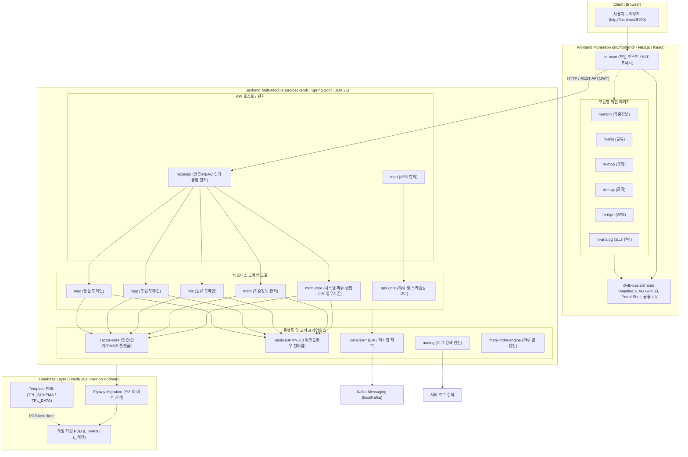

# DMES 아키텍처 및 시스템 구조도

본 문서는 **DMES(APS · MES) 표준 프로젝트 템플릿**의 전체 시스템 구조와 모듈 간의 연계 관계를 정리한 문서입니다.  
터미널 환경과 마크다운 렌더러(IDE/웹) 양쪽 모두에서 쉽게 확인할 수 있도록 텍스트 다이어그램과 Mermaid 다이어그램을 함께 수록했습니다.

---

## 1. 텍스트 구조도 (터미널 뷰)

```text
+===================================================================================+
|                              [ 클라이언트 브라우저 ]                              |
|                          http://localhost:5100 (포털)                             |
+===================================================================================+
                                         │
                                         ▼ (HTTP / React)
+===================================================================================+
|             프론트엔드 모노레포 (src/frontend/ - Next.js / React / pnpm)          |
|                                                                                   |
|  ┌─────────────────────────────────────────────────────────────────────────────┐  |
|  │                        m-mcm (포털 호스트 / BFF 프록시)                     │  |
|  └──────────────────────────────────────┬──────────────────────────────────────┘  |
|                                         │                                         |
|  ┌──────────────────────────────────────┴──────────────────────────────────────┐  |
|  │                  @dk-oasis/shared (공통 UI, Grid, HTTP, Shell)              │  |
|  └──────────────────────────────────────┬──────────────────────────────────────┘  |
|                                         │                                         |
|     ┌──────────────┬──────────────┬─────┴────────┬──────────────┬──────────────┐  |
|     ▼              ▼              ▼              ▼              ▼              ▼  |
|  [ m-mdm ]      [ m-mls ]      [ m-mpp ]      [ m-mqc ]      [ m-mpn ]    [ m-analog ]
|  (기준정보)      (물류)         (조업)         (품질)         (APS화면)     (로그뷰어) |
+===================================================================================+
                                         │
                                         ▼ HTTP REST API (JWT Bearer Token)
+===================================================================================+
|            백엔드 멀티 모듈 (src/backend/ - Spring Boot / JDK 21)                 |
|                                                                                   |
|  [ API 게이트웨이 & 런처 ]                                                        |
|    - mcm/api      : 포털 API 런처, 인증(JWT), RBAC 인가, 시드 데이터 초기화       |
|    - mpn          : APS 전용 런처 및 서비스 호스트                                |
|                                                                                   |
|  [ 비즈니스 도메인 모듈 ]                                                         |
|    - mcm-core     : 마스터코드(CMA), 업무기준(CMB), 시스템관리(CSA) [실동작]      |
|    - mdm          : 기준정보 관리 (용어, 도메인, 컬럼, 마루 코드)                 |
|    - mls          : 물류 관리 (Logistics)                                         |
|    - mpp          : 조업/공정 관리 (Production Process)                           |
|    - mqc          : 품질 관리 (Quality Control)                                   |
|    - aps-core     : 생산 계획 및 스케줄링 최적화 엔진                             |
|                                                                                   |
|  [ 플랫폼 및 코어 프레임워크 ]                                                    |
|    - cactus-core  : 인증/인가 공통 프레임워크, OASIS 코어 플랫폼                  |
|    - oasis        : BPMN 2.0 워크플로우 런타임 엔진                               |
|    - caravan-*    : EAI 인터페이스 및 Kafka 메시징 허브 (caravan-core/hub/console) |
|    - analog       : 서버 로그 수집, SQL 파라미터 바인딩 및 검색 엔진              |
|    - maru-mdm-*   : MDM 비즈니스 룰 엔진                                          |
+===================================================================================+
                                         │
                                         ▼ JDBC (Oracle Thin Driver)
+===================================================================================+
|               데이터베이스 계층 (Oracle 26ai Free on Podman Container)            |
|                                                                                   |
|  [ Flyway Migration ] : db/migration/** 모듈별 DDL 버전 관리                      |
|                                                                                   |
|  [ PDB 격리 아키텍처 ]                                                            |
|    - TPL_SCHEMA : DDL만 반영된 베이스 템플릿 PDB                                  |
|    - TPL_DATA   : db-snapshot CSV 시드 데이터까지 적재된 템플릿 PDB               |
|    - L_MAIN     : 메인 로컬 개발용 PDB (템플릿에서 복제)                          |
|    - L_<레인>   : 개발자/작업별 독립 작업용 PDB                                   |
+===================================================================================+
```

---

## 2. Mermaid 구조도 (IDE / 웹 뷰어)



---

## 3. 계층별 상세 역할

### (1) Frontend (`src/frontend/`)
- **포털 호스트 (`m-mcm`)**:
  - 사용자 접근 포털 셸(Shell), 메뉴 트리, 탭 브라우징, 즐겨찾기 지원.
  - 브라우저의 API 요청을 받아 백엔드로 중계하고 세션을 관리하는 BFF(Backend For Frontend) 프록시 역할 수행.
- **공통 컴포넌트 (`shared` / `@dk-oasis/shared`)**:
  - Mantine 9 기반 UI 부품, AG Grid 33 데이터 그리드 래퍼, 표준 HTTP 통신 모듈.
- **도메인 컴포넌트 (`m-*`)**:
  - 각 도메인 화면(`m-mls`, `m-mqc`, `m-mpp`, `m-mpn`, `m-mdm`, `m-analog`)이 독립된 컴포넌트로 분리되어 포털에 탑재.

### (2) Backend (`src/backend/`)
- **호스트 / 게이트웨이 (`mcm/api`)**:
  - 통합 스프링 부트 런처.
  - JWT 기반 인증 및 사용자 권한/메뉴 접근 인가(RBAC) 검증.
  - 멱등(idempotent)하게 작동하는 초기 시드 적재(`DataInitializer`).
- **도메인 모듈 (`mcm-core`, `mdm`, `mls`, `mpp`, `mqc`, `aps-core`, `mpn`)**:
  - `mcm-core`: 메뉴/권한, 마스터코드, 업무기준 등 즉시 사용 가능한 표준 공통 기능 제공.
    - 앱(`mcm`)과 나눈 이유와 코드를 둘 위치 기준: [ADR-0003](guide/adr/0003-mcm-core-library-split.md).
  - `mdm`, `mls`, `mpp`, `mqc`: 고객사 비즈니스 요구사항에 맞춰 확장/대체되는 업무 도메인 모듈.
  - `aps-core`, `mpn`: 생산 계획 수립 및 자원 스케줄링 코어 로직.
- **플랫폼 엔진 (`cactus-core`, `oasis`, `caravan-*`, `analog`)**:
  - `oasis`: BPMN 2.0 모델을 해석하여 비즈니스 서비스 흐름과 트랜잭션을 실행하는 엔진.
  - `caravan-*`: EAI 연계 및 메시징 처리.
  - `analog`: 애플리케이션 로그 검색 및 쿼리 파라미터 자동 바인딩 도구.

### (3) Database (`tools/oracle-free/`)
- **Oracle 26ai Free (Podman 컨테이너)**:
  - 개발자 간 DB 충돌을 방지하기 위해 Oracle PDB(Pluggable Database) 복제 기술 채택.
  - Flyway 마이그레이션을 통해 스키마 변경 사항을 코드로 버전 관리.
  - `TPL_SCHEMA` / `TPL_DATA` 템플릿을 기반으로 개발자별 전용 PDB(`L_<레인>`)를 신속하게 생성 및 초기화 가능.

---

> [!NOTE]
> 프로젝트 개발 규칙 및 작업 분기 기준은 [RULE.md](../RULE.md)를 참고하십시오.
