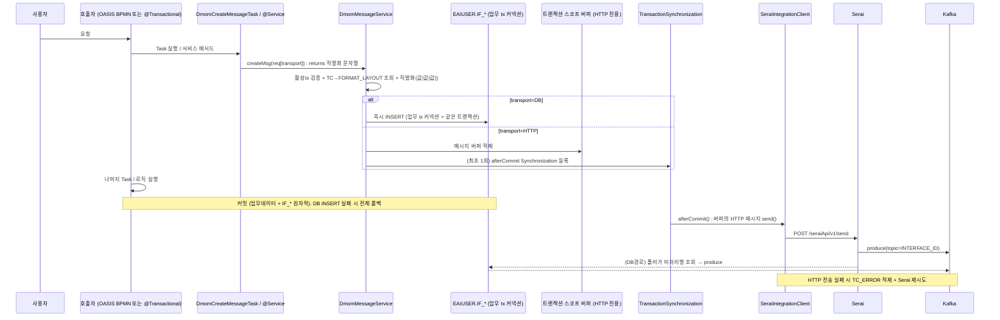

# 전문 송신(Outbound) 설계 — cactus-section dmom → dmes-aps + Kafka(Serai)

> 작성일: 2026-05-29
> 대상: dmes-aps `cactus-core` 공통 레이어
> 마이그레이션 원본: `D:\Framework\workspace-framework\cactus-section` (`com.dongkuk.cactus.dmom`)
> 설계 변경: **EAI(SAP_XI) → Kafka(Serai)**
> 범위: **송신(Outbound) 우선**. 수신(Inbound)은 후속 설계.

---

## 0. 결정 사항 (확정)

| # | 항목 | 결정 |
|---|---|---|
| D1 | DB 방식 INSERT 시점 | **`createMsg` 즉시 in-tx INSERT (원자적 아웃박스)** — 별도 EAIUSER DS 안 씀. **업무 tx 커넥션**으로 `EAIUSER.IF_*` schema-qualified INSERT → 업무데이터와 원자 커밋. (beforeCommit 동기화는 OASIS 멀티tx에서 타이밍 취약 → createMsg 즉시 INSERT로 확정, 검증 2026-05-29). 전제: 업무 USER에 **EAIUSER.IF_* INSERT GRANT** |
| D2 | HTTP 방식 전송 시점 | **`afterCommit`** — 커밋 성공 후에만 전송 |
| D3 | 파이프라인 배치 | **`cactus-core` 공통** (`com.dongkuk.dmes.cactus.dmom`) |
| D4 | 채널 선택 | `createMsg` 파라미터 `transport (HTTP | DB)` 로 호출자가 선택 |
| D5 | **Force send 제외** | 레거시 `momSendForcedList`(서비스 실패 시에도 전송) **미이식**. 모든 메시지는 **커밋 성공 시에만** 전송 |
| D6 | **OASIS 비의존** | 버퍼를 OASIS Context 대신 **트랜잭션 스코프 버퍼**로 분리. `createMsg`는 OASIS `ServiceContext` 불요. OASIS BPMN / 평범한 `@Transactional` 서비스 **양쪽에서 사용 가능** |
| D7 | **전제: 활성 Spring 트랜잭션** | `createMsg`는 활성 Spring 트랜잭션 필요. OASIS 경로는 `cactus.oasis.transactional: true` 필수(기본 false 주의). 트랜잭션 없으면 fail-fast |
| D8 | 버퍼 구현 | `TransactionSynchronizationManager.bindResource` 기반 트랜잭션 스코프 홀더, `afterCompletion`에서 unbind |
| D9 | `createMsg` 입력/반환 | `interfaceId`(=topicId) **명시 필수**, 반환 = **직렬화된 전문 문자열(String)** (레거시 동일) |
| D10 | `SQ_VAL` 채번 | **`SEQUENCE`** (`SEQ_MCM_MOM_TC_ERROR`, additive) |
| D11 | 직렬화 범위 | **전체 호환** — ITEM_TP `E/G/GE` + DATA_TP `1~5`, 레거시 출력 동등성 테스트 |

---

## 1. AS-IS (cactus-section) 요약

레거시 송신 파이프라인 7단계:

1. BPMN Task(`DMomCreateMessageTask`) → `DMomCreateMessage.msgCreate(context, momParam, bSendForced)`
2. `TB_MCM_MOM_TC_LIST → FORMAT_ID → TB_MCM_MOM_FORMAT_LAYOUT` 조회
3. Map → `|` 구분 문자열 직렬화 (ITEM_TP `E/G/GE`, DATA_TP `1~5`)
4. OASIS Context 버퍼(`momSendList` / `momSendForcedList`)에 적재
5. 서비스 종료 & DB 커밋
6. 컨트롤러가 `ServiceControllerUtil.httpMessageSender(context)` **수동 호출** (서비스 SUCCESS 시 normal, forced 는 항상) — ※ **forced 분기는 TO-BE 미이식 (D5)**
7. `DMomHttpSender.momSendTc()` 가 `INTERFACE_PROTOCOL` 로 분기:
   - `EAI_HTTP`/`DIRECT_HTTP` → XML 래핑 + HTTP POST
   - `LOCAL_HTTP`/`JCM` → form-encoded POST
   - `EAI_DB` → 큐테이블 INSERT
   - 실패 시 1회 재시도 → `TB_MCM_MOM_TC_ERROR` 적재

핵심 특성: **커밋 이후 동기 전송**, 실패해도 업무 트랜잭션은 롤백하지 않음.

---

## 2. TO-BE 변경점

| 구분 | AS-IS | TO-BE |
|---|---|---|
| 송신 트리거 | 컨트롤러 수동 호출 | **Spring `TransactionSynchronization`** |
| 채널 | EAI_HTTP / EAI_DB / LOCAL_HTTP / JCM | **Serai HTTP / Serai DB** (2종으로 단순화) |
| HTTP 전송 | `DMomHttpSender` 직접 HTTP | **기존 `SeraiIntegrationClient.send()`** 재사용 → `POST /seraiApi/v1/send` → Kafka |
| DB 전송 | `IF_*` 큐테이블 INSERT (post-commit) | **`EAIUSER.IF_*` INSERT (createMsg 즉시, 업무 tx 커넥션, 원자적)** → Serai DB-inbound 폴러가 Kafka 발행 |
| 채널 선택 | INTERFACE_PROTOCOL 상수 | **`createMsg(transport=HTTP|DB)`** |
| 직렬화 | `|` 구분 | 동일 (`@@|@@|@@|` = `값|값|값|`) |
| 버퍼 | `momSendList` (OASIS Context) | **트랜잭션 스코프 버퍼(HTTP 전용)** — OASIS 무관, D6 (DB는 버퍼 미경유) |
| 에러 | `TB_MCM_MOM_TC_ERROR` | 동일 (신규 `INTERFACE_PROTOCOL` 컬럼 포함) |

기존 자산 재사용:
- `cactus-core` `SeraiIntegrationClient.send(topicId, transactionCode, interfaceMsg)` — HTTP 채널
- Serai 서비스 `POST /seraiApi/v1/send` (HTTP 인입) + DB-inbound 폴러(`selectPendingMessages`) — 두 인입 경로 모두 존재
- `KafkaMessageProducer` (Caravan) — Kafka 발행

---

## 3. 송신 시퀀스



---

## 4. 트랜잭션 경계 설계 (핵심)

**확정(D1/D2): 채널별로 처리 시점 분리.** DB=원자적 아웃박스(**`createMsg` 즉시 in-tx INSERT**), HTTP=커밋 후 전송(`afterCommit`).
(토폴로지: 단일 DB `ksm_dmes`, 업무=모듈 스키마, IF_*=EAIUSER. **별도 EAIUSER DataSource를 쓰지 않고** 업무 tx 커넥션으로 `EAIUSER.IF_*` schema-qualified INSERT 하여 원자성 확보. 전제: cross-schema GRANT.)

> **왜 `beforeCommit` 동기화가 아니라 `createMsg` 즉시 INSERT 인가** (검증 결과): OASIS는 한 스레드에서 여러 PTM을 띄우고 `SpringTransactionHandler.commitAll()` 로 **역순 커밋**한다. Spring 동기화 리스트는 **첫 시작 tx가 단독 소유**하므로 `beforeCommit` 발동 시점이 "업무 tx"와 어긋날 수 있어(선언 순서 의존) 원자성이 취약. 반면 `createMsg` 시점에 업무 tx 커넥션으로 바로 INSERT하면 **그 자체가 업무 트랜잭션 내 INSERT**(= OASIS SQL ScriptTask와 동일한 검증된 패턴)라 동기화 타이밍과 무관하게 항상 원자적이다.

### 4.1 DB 방식 — `createMsg` 즉시 in-tx INSERT (원자적)
- `createMsg` 호출 시점에 **업무 트랜잭션 커넥션**(biz SqlSessionTemplate)으로 `EAIUSER.IF_*` schema-qualified INSERT. 곧 업무 트랜잭션 내 일반 INSERT → 서비스 종료 시 업무데이터와 **함께 커밋/롤백**(원자적).
- INSERT 실패 시 예외 전파 → **업무 트랜잭션 전체 롤백**(유령메시지/유실 없음). 별도 에러로그 불필요(호출자가 롤백 인지).
- 버퍼/동기화 **불필요**(즉시 INSERT). Serai DB-inbound 폴러는 **커밋된 행만** 조회 → 안전.
- 전제: 업무스키마 USER 에 `EAIUSER.IF_*` **INSERT GRANT** + (포맷조회용) `MCMAPUSER.*` **SELECT GRANT**.

### 4.2 HTTP 방식 — 버퍼 + `afterCommit` → `seraiClient.send()`
- HTTP 는 트랜잭션에 묶을 수 없음 → 버퍼에 적재 후 **커밋 성공 후에만** `seraiClient.send()`.
- 전송 실패 시: 업무 데이터는 이미 커밋됨 → `TB_MCM_MOM_TC_ERROR` 적재 + Serai 측 재시도(클라이언트 max-attempts)로 보완.
- (옵션) HTTP 실패분 재발행(폴백 아웃박스)은 후속 검토(§10).

### 4.3 통합
- **DB**: createMsg 즉시 INSERT (버퍼/동기화 무관). **HTTP**: 버퍼 적재 → `DmomDispatchSynchronization.afterCommit()` 에서 일괄 send.
- 동기화는 **`afterCommit`(HTTP) + `afterCompletion`(버퍼 unbind)** 만. `beforeCommit` 없음.
- 동기화 등록은 트랜잭션당 **1회** (HTTP 메시지 최초 적재 시), `TransactionSynchronizationManager.registerSynchronization`.
- 버퍼는 **HTTP 전용**(DB는 버퍼 미경유).

### 4.4 OASIS 비의존 — 범용 사용 (D6/D7)

**핵심: 커밋 후 전송은 OASIS가 아니라 Spring 트랜잭션 인프라에 의존한다.** dmes-aps의 OASIS는 이미 그 위에서 돈다.

- `OasisAutoConfiguration` 의 `serviceStarter()`: `cactus.oasis.transactional: true` → `SpringServiceStarterFactory` + Spring `PlatformTransactionManager`(`JpaTransactionManager` 또는 multi-tx). 즉 BPMN 실행이 Spring 트랜잭션 안에서 커밋 → `TransactionSynchronizationManager` 활성 → `afterCommit`(HTTP) 발동.
- 동일 인프라를 평범한 `@Transactional` Spring 서비스도 사용.
- 따라서 **단일 디스패치 훅**으로 OASIS / 비-OASIS 양쪽 균일 처리.

**버퍼 분리 (HTTP 전용):** OASIS Context 대신 **트랜잭션 스코프 버퍼**(`DmomSendBuffer`: `TransactionSynchronizationManager.bindResource` 기반 — 확정)에 **HTTP 메시지만** 적재(DB는 즉시 INSERT라 버퍼 미경유).
- **이 버퍼는 OASIS / 비-OASIS 양쪽 공용 — 단일 버퍼다.** OASIS Context 는 더 이상 버퍼로 쓰지 않으며, 분기되는 건 진입 어댑터뿐(이후 버퍼·동기화·디스패치는 완전 동일).
- HTTP 메시지 최초 적재 시 버퍼 bind + `DmomDispatchSynchronization` 등록(트랜잭션당 1회).
- `afterCompletion(status)` 에서 `unbindResource`(누수 방지).
- OASIS Context 와 무관하므로 `createMsg(req)` 시그니처에 `ServiceContext` 불필요.

**진입 어댑터 2종 (얇음):**
| 경로 | 어댑터 | 호출 |
|---|---|---|
| OASIS BPMN | `DmomCreateMessageTask` (Service Task, camunda:class) | task params + Map → `createMsg(req)` |
| 비-OASIS | 임의의 `@Transactional @Service` 가 `DmomMessageService` 주입 | 직접 `createMsg(req)` |

**전제(D7):** `createMsg` 는 활성 Spring 트랜잭션 필요(DB 즉시 INSERT의 원자성 + HTTP afterCommit 등록 모두 필요).
- 없으면 `isActualTransactionActive() == false` → **fail-fast**(명확한 예외).
- ⚠️ OASIS 경로는 모듈이 `cactus.oasis.transactional: true` 여야 함. **기본값 `false`**(`NonTransactionalServiceStarterFactory`)에서는 Spring 트랜잭션이 안 붙음 → 사용 전 모듈 설정 확인.

```java
// createMsg 내부
if (!TransactionSynchronizationManager.isActualTransactionActive()) {
    throw new DmomException("createMsg requires an active Spring transaction "
        + "(OASIS: cactus.oasis.transactional=true, or annotate caller with @Transactional)");
}
String msg = serializer.serialize(layout, req.data());
switch (req.transport()) {
    case DB -> dbWriter.insert(req, msg);          // 즉시 업무 tx 커넥션 INSERT (원자적)
    case HTTP -> {                                 // 버퍼 + afterCommit 등록
        boolean first = !DmomSendBuffer.isActive();
        List<DmomMessage> buffer = DmomSendBuffer.openIfAbsent();
        if (first) TransactionSynchronizationManager.registerSynchronization(
            new DmomDispatchSynchronization(buffer, httpSender, errorLogger));
        buffer.add(toMessage(req, msg));
    }
}
return msg;
```

```java
// 의사코드 — HTTP 전용 afterCommit (DB는 createMsg에서 이미 INSERT)
class DmomDispatchSynchronization implements TransactionSynchronization {
    private final List<DmomMessage> buffer;       // HTTP 메시지만
    private final DmomHttpSender httpSender;
    private final DmomErrorLogger errorLogger;    // 내부 REQUIRES_NEW (HTTP 실패 적재용)

    @Override public void afterCommit() {          // 커밋 성공 시에만
        for (DmomMessage m : buffer) {
            try { httpSender.send(m); }
            catch (Exception e) { errorLogger.log(m, e); }   // 커밋 후라 롤백 불가 → TC_ERROR
        }
    }
    @Override public void afterCompletion(int status) { DmomSendBuffer.close(); /* unbind */ }
}
```

---

## 5. 컴포넌트 설계 (`com.dongkuk.dmes.cactus.dmom`)

```
cactus-core/.../cactus/dmom/
├── message/
│   ├── DmomMessageService            (interface) — createMsg(req): String (직렬화 전문 반환)
│   ├── DefaultDmomMessageService
│   ├── DmomSendRequest               (record/builder) — TC, interfaceId(필수), transport, data  (KEY_DATA 미사용)
│   ├── DmomMessage                   (record) — 직렬화 완료된 HTTP 송신 단위(버퍼 요소)
│   └── MessageSerializer             — Map → "값|값|값|" (E/G/GE + DATA_TP 1~5 전체 호환)
├── format/
│   ├── DmomFormatRepository
│   ├── DmomFormatMapper              (MyBatis) — TC_LIST/FORMAT_LAYOUT 조회 (persistence/dmom/DmomMapper.xml)
│   ├── FormatLayout / FormatItem     (record)
├── context/
│   └── DmomSendBuffer                — 트랜잭션 스코프 버퍼(HTTP 전용) (bindResource, OASIS 무관)
├── transport/
│   └── SeraiTransport                (enum HTTP, DB)
├── dispatch/
│   ├── DmomDispatchSynchronization   (afterCommit=HTTP send / afterCompletion=unbind)
│   ├── DmomHttpSender                — SeraiIntegrationClient 위임
│   └── DmomDbOutboundWriter          — EAIUSER.IF_* INSERT (createMsg에서 즉시 호출, 업무 tx 커넥션, schema-qualified)
├── error/
│   ├── DmomErrorLogger (+매퍼)       — TB_MCM_MOM_TC_ERROR INSERT
└── task/
    └── DmomCreateMessageTask         — BPMN Service Task ↔ createMsg
```

| 클래스 | 책임 | 레거시 대응 |
|---|---|---|
| `DmomMessageService.createMsg(req)` | 활성tx검증→포맷조회→직렬화→(DB:즉시INSERT / HTTP:버퍼+Sync등록). **ServiceContext 불요(D6)** | `DMomCreateMessage.msgCreate` |
| `MessageSerializer` | ITEM_TP(E/G/GE)·DATA_TP(1~5) 변환/패딩 | `CreateBodyMessage`+`DMomSendUtil` |
| `DmomFormatRepository` | 유효일자 필터 포맷 조회 | `DMomMapper.getFormatLayout` |
| `DmomSendBuffer` | HTTP 전용 tx-스코프 버퍼 | `momSendList` |
| `DmomDispatchSynchronization` | afterCommit HTTP 디스패치 | `httpMessageSender`(개선) |
| `DmomHttpSender` | `seraiClient.send()` | `DMomHttpSender.sendToHttp` |
| `DmomDbOutboundWriter` | EAIUSER.`IF_*` INSERT (createMsg에서 즉시, 업무 tx 커넥션) | `DMomMapper.insert_EAI_DB` |
| `DmomErrorLogger` | `TC_ERROR` 적재 (HTTP 실패) | `DMomLogger.insertMomTcError` |

---

## 6. createMsg API

```java
public enum SeraiTransport { HTTP, DB }

// 반환: 직렬화된 전문 문자열 (로깅/검증용). 실제 전송결과는 커밋 후라 별도.
String interfaceMsg = dmomMessageService.createMsg(   // 활성 Spring 트랜잭션 내 호출 (OASIS Task 또는 @Transactional 서비스)
    DmomSendRequest.builder()
        .transactionCode("PQR02012")
        .interfaceId("MMPPMERPTT01")        // = Kafka topicId (필수)
        .transport(SeraiTransport.HTTP)     // ★ 호출자가 HTTP/DB 선택 (D4)
        .data(formatFieldMap)               // FORMAT 항목값 Map
        .build()
);
```

- `HTTP` → 버퍼 → `afterCommit` → `seraiClient.send(interfaceId, transactionCode, interfaceMsg)`
- `DB`   → **createMsg 즉시** 업무 tx 커넥션으로 EAIUSER.`IF_*` INSERT (원자적, target = `TB_MCM_MOM_INTERFACES.SEND_TABLE_ID`, 미지정 시 `IF_<INTERFACE_ID>` 관례)
- KEY_DATA1/2/3 **미사용**(요청 확정). KAFKA_KEYDATA 는 커밋 이후 생성값이라 업무 tx 에 저장 불가 → IF 행에 안 넣음(추적은 로그)
- 추적용 protocol 문자열: `SERAI_HTTP` / `SERAI_DB` (TC_ERROR.INTERFACE_PROTOCOL 에 기록)
- 반환값: **직렬화된 전문 문자열(String)** — 레거시 동일

---

## 7. 메시지 직렬화 규칙

- 구분자: `|` (각 항목값 뒤에 `|`). 사용자 표기 `@@|@@|@@|` = `값|값|값|`.
- ITEM_TP: `E`(단일), `G`(반복그룹 헤더, DATA_LEN=반복수), `GE`(그룹 내 항목). **전체 호환 — 확정.** 반복그룹 데이터는 `data` Map 에 `List<Map>` 형태로 전달.
- DATA_TP: `1`=String, `2`=Number(소수자리 zero-pad), `3`=Date(YYYYMMDDHHMMSS), `4`=String(trim), `5`=Number(원형).
- DATA_LEN/DATA_DECIMAL_PREC 로 길이·소수 정밀도 패딩.
- 레거시 `CreateBodyMessage`/`DMomSendUtil.getMsgFromSendFormat` 와 **출력 동등성**을 단위테스트로 검증.

---

## 8. 인프라/DDL 보완 (구현 전 선행)

1. **`TB_MCM_MOM_TC_ERROR.SQ_VAL` — `SEQUENCE` 채번 (확정)**. MSSQL:
   ```sql
   CREATE SEQUENCE MCMAPUSER.SEQ_MCM_MOM_TC_ERROR AS NUMERIC(19) START WITH 1 INCREMENT BY 1;
   -- INSERT 시: NEXT VALUE FOR MCMAPUSER.SEQ_MCM_MOM_TC_ERROR
   ```
2. **유효일자 함수** — `SYSDATE` → `GETDATE()` 로 매퍼 SQL 변환.
3. **DB 방식 타깃 테이블** — `TB_MCM_MOM_INTERFACES.SEND_TABLE_ID` 활용 + Serai DB-inbound config(`TB_MCM_MOM_KAFKA_SERAI_CONFIG`) 연계 확인.
4. **DataSource/GRANT 전제 (원자 아웃박스 필수조건)** — DB 방식은 **업무 tx 커넥션**으로 `EAIUSER.IF_*` INSERT 하므로, 업무스키마 USER(MCMAPUSER/APSAPUSER 등)에:
   - `EAIUSER.IF_*` **INSERT GRANT**
   - `MCMAPUSER.TB_MCM_MOM_*` **SELECT GRANT** (포맷 조회)
   - 별도 `extras.if` DataSource 는 DB 방식 전송에는 사용하지 않음(원자성 위해 업무 커넥션 사용). HTTP 방식은 DS 무관.
4. **포맷 캐싱** — FORMAT_LAYOUT 조회 빈도 높음 → 캐시 전략 검토(후속).

---

## 9. 구현 순서 (제안)

1. `format` (조회) → `MessageSerializer` (직렬화) — 단위 테스트로 레거시 출력과 동등성 검증
2. `DmomSendRequest` / `DmomSendBuffer` / `SeraiTransport`
3. `DmomDispatchSynchronization` + `DmomHttpSender`(기존 클라이언트 위임) + `DmomDbOutboundWriter`
4. `DmomErrorLogger` + DDL 보완(SQ_VAL)
5. `DmomMessageService.createMsg` 통합 + Sync 등록
6. `DmomCreateMessageTask` (BPMN 연동) + 통합 테스트

---

## 10. 미결/후속

- 수신(Inbound) 파이프라인 설계 (Kafka consume → 서비스 기동)
- HTTP 실패분 재발행(폴백 아웃박스) 도입 여부
- TC_SKIP 의 송신측 적용 여부 (레거시는 주로 수신측)
