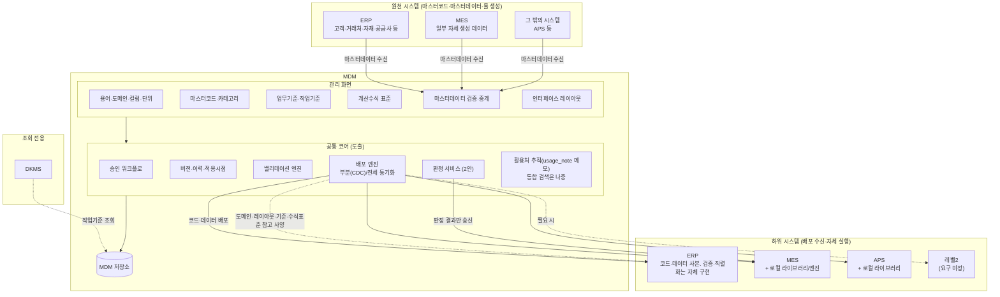
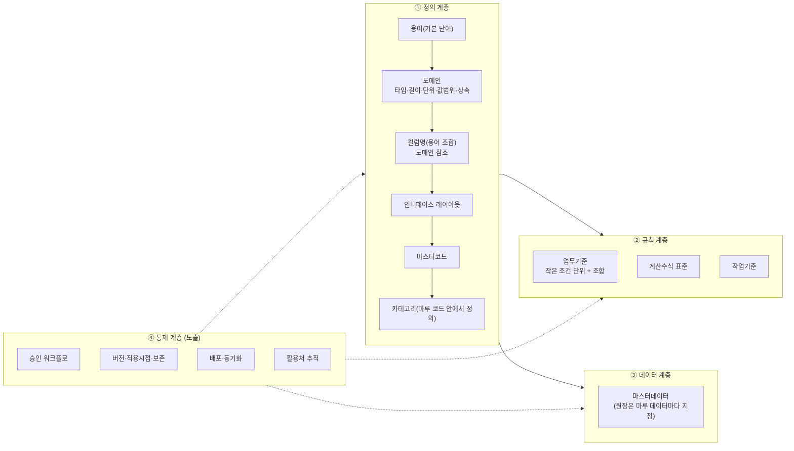
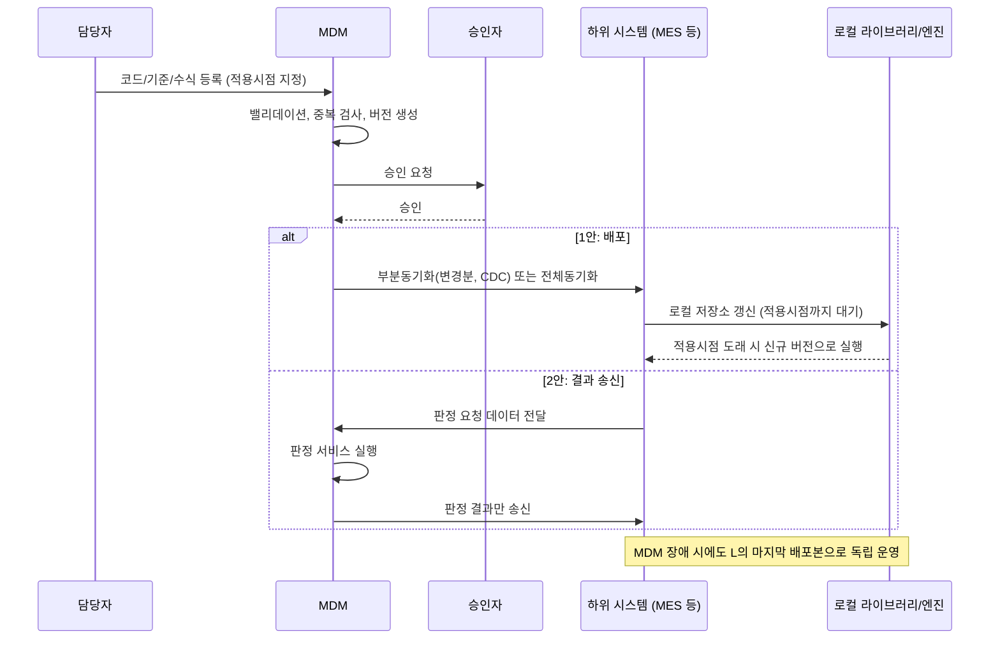
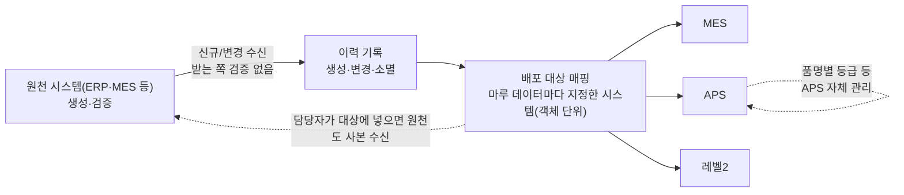

# 마루 MDM 설계: 공통 (역할·배포·화면 총괄·아키텍처)

> 분할 문서. 영역별 설계는 `02-term-domain-column.md`(용어·도메인·컬럼), `03-interface-layout.md`(인터페이스 레이아웃), `04-master-code.md`(마스터코드), `05-master-data.md`(마스터데이터), `06-business-rule.md`(업무기준·룰), `07-deploy.md`(배포), `08-approval.md`(결재) 참조. 작업기준 열 설계는 `workrule-column-design.md`, 표현식 엔진 지침은 `evalex-guide.md`. 이 문서와 02-08이 어긋나면 02-08이 우선한다(사용자 결정 2026-09-09).

## MDM의 역할

> 출처: 또박또박 회의 #144 「MDM 논의 20260813_130255」(2026-08-13)

### 한 줄 정의

- MDM은 **마스터코드의 생성·검증·버전관리·배포 주체**이자, 마스터데이터·업무기준·수식의 **표준 원장과 중계(통로) 역할**을 수행한다. 여기서 MDM은 정해진 시스템이 아니라 **역할**이다. 이 문서와 02-08에서 원장·원천을 MDM이라 적은 곳은 MDM 역할을 맡은 인스턴스(`MD_SYSTEM`의 자기 행)를 뜻하고, 인스턴스는 여럿일 수 있다(05 「그 밖의 규칙」 다중 인스턴스, 사용자 결정 2026-09-10).
- 궁극 목적: AI·빅데이터 분석을 위해 필드명·코드·용어의 의미를 시스템(ERP/MES/APS/DKMS 등) 간에 일치시키는 것.

### 마스터코드 vs 마스터데이터 구분 원칙

- 핵심 차이는 **버전관리 여부**: 코드는 버전관리가 철저해야 하고, 데이터는 이력관리(생성·변경·소멸) 위주로 충분하다.
- 코드 = MDM에서 생성·관리(원천이 다른 시스템일 수도 있다, 04). 데이터 = 마루 데이터마다 지정한 원천 시스템이 원장이고 기본은 MDM이다(05). 원천이 다른 시스템이면 MDM은 중계한다.
- 구조: `원천 시스템(생성·검증) → MDM(중계) → 지정한 배포 대상(원천 포함 가능)`
- 채번(고객마스터 등)은 MDM 기본설계 범위 밖이다. 따로 구현하고 방안은 향후 정한다(결정 2026-09-09).
- 마스터데이터에 딸린 세부(디테일) 항목(예: APS 공급사 품명별 등급)은 MDM이 전부 관리하지 않고, 관리 주체(ERP/APS)를 정하고 연계만 보장한다.
- 코드와 데이터 모두 **도메인과 무관하게** 쓴다. 도메인 없이 코드 사본·데이터 사본만 받아 쓰는 시스템이 있어도 된다. 도메인이 코드·데이터를 참조하는 것은 도메인 쪽 규칙이다(아키텍처 원칙 8).

### 배포 방식

**기본 원칙**: 기준정보는 MDM에서 등록·변경·**승인**을 거친 뒤 하위 시스템으로 배포한다. 방향은 탑다운(MDM → 하위 시스템)이며, 하위 시스템에서 수정한 내용을 MDM으로 역반영하는 구조는 아니다.

**검토된 3안** (품질설계키 등 업무기준을 예시로 논의했으나 수식·코드에도 같은 원칙을 적용)

| 안   | 방식                                                                | 판단        |
| --- | ----------------------------------------------------------------- | --------- |
| 1안  | MDM에서 관리하고, 하위 시스템(MES 등)이 동일한 기준 사본을 보유. 변경 시 부분동기화 또는 전체동기화로 배포 | **채택 후보** |
| 2안  | 배포 없이 MDM이 판정 결과까지 도출하고, 하위 시스템에는 결과값만 송신                         | **채택 후보** |
| 3안  | 하위 시스템이 MDM API를 실시간 호출                                           | **배제**    |

**3안(API 실시간 호출)을 배제한 이유**

- MDM이 전 시스템의 단일 장애점(Single Point of Failure)이 된다. MDM이 죽으면 ERP·MES 등 전체가 멈춘다.
- MDM이 상시 가용 상태여야 하고, 고성능 인프라와 대량 캐시가 필요해 운영 부담이 커진다.
- 따라서 MDM이 없어도 하위 시스템이 독립적으로 운영 가능한 구조여야 한다.

**하위 시스템 실행 방식**

- 각 하위 시스템은 배포받은 기준·로직을 라이브러리 또는 자체 엔진 형태로 보유하고 내부에서 실행한다.
- 배포 전달 수단(푸시, 하위 시스템 폴링, 캐시 갱신 등)은 구현 단계에서 결정한다.

**동기화 단위**

- 부분동기화: 변경된 레코드 또는 변경된 기준 세트만 전달한다. CDC(Change Data Capture) 개념으로 본다.
- 전체동기화: 모든 업무기준을 통째로 전달한다.
- 두 개념을 구분해서 대상 성격에 따라 적용한다.
- 각 하위 시스템은 자기가 필요한 항목만 수신한다. 예를 들어 ERP에서만 쓰는 항목을 MES가 들고 있을 필요는 없으며, 모든 항목을 전부 보유하는 것은 리스크로 본다.

**적용 시점 관리**

- 배포 즉시 전 시스템에 적용되는 방식은 곤란하다. 시스템마다 적용 시점이 어긋나면 값 불일치가 생긴다.
- 저장 시점에 **적용 시점(언제부터 유효한지)을 함께 지정**하고, MDM이 각 시스템에 동일한 기점을 내려준다.
- 이전 버전도 보존관리한다(예: 몇 월까지는 이전 계산식 적용). 수식·기준 변경 이력이 실적 데이터 해석과 연결된다.
- 현업이 수정하는 즉시 반영되는 구조는 배제한다.

**대상별 배포 방식**

| 대상            | 배포 방식                                                                    |
| ------------- | ------------------------------------------------------------------------ |
| 용어·동의어    | 배포 없음. MDM에서 조회·관리만                                                      |
| 도메인·컬럼 사전(서브셋)·단위 마스터·인터페이스 레이아웃 | 도메인·컬럼 사전·단위 마스터는 배포 대상이다(02 「배포」). 레이아웃도 배포 대상이다(03 「버전과 변경」). 도메인·컬럼·단위는 배포 순번 동기화, 레이아웃은 스냅샷 버전 |
| 계산수식          | 수식(파서) 자체는 배포하지 않고 계산 개념·표현형식(스탠다드)을 공유. 각 시스템이 자체 구현하고 결과값 일치 여부를 상호 검증 |
| 업무기준(단순 조건)   | 1안 또는 2안. 복잡 로직은 코드단에 남기고 배포 대상에서 제외                                     |
| 마스터코드         | MDM이 생성·밸리데이션 후 ERP·MES·APS에 배포. 레벨2는 요구사항 미정(73행, 07 「7. 남은 항목의 처리 방향」)         |
| 마스터데이터        | 마루 데이터마다 지정한 원천 시스템에서 생성·검증 → MDM이 수신 → 담당자가 지정한 배포 대상 시스템에 중계 배포(원천 포함 가능). 받는 쪽인 MDM은 검증하지 않는다(결정 2026-09-09)                     |
| 작업기준(라인스피드 등) | MDM에서 수식·업무기준 수준으로 관리 후 APS·ERP에 배포. DKMS에는 조회로 제공                                 |
| 레벨2           | 필요 항목이 있을 수 있으나 요구사항 미정. MDM이 API를 제공해야 할 가능성만 언급됨                       |

### 설계 시 유의사항 (회의에서 지적된 문제)

- 업무기준을 큰 덩어리 하나에 몰아넣는 구조가 관리 실패의 근본 원인이다. 작게 쪼개 조합하는 구조로 설계한다.
- 기존 기준의 등록 여부·활용처 추적이 어렵다. 등록 여부와 사용처를 추적 가능하게 설계한다.
- 카테고리를 FK 없이 임의 추가해 관리가 무너진다. 카테고리 설계 원칙을 재정립한다.
- 작업표준(라인스피드 등)은 표준과 실적을 지속 비교·업데이트하는 체계가 함께 필요하다.
- (장종익 첨언) **도메인 정의가 없다.** 용어와 함께 도메인(데이터 용도, 데이터 타입, 길이, 밸리데이션 규칙)도 정의해야 한다.

### 미결 사항

- MDM 추진 여부 및 담당 조직 미확정. 연내 결정해야 익년도 비용 산정에 반영 가능.
- 수식 표현형식 표준(LaTeX/JS 표현식/DMN 등) 회의에서는 유보. → 본 문서에서는 도메인 검증식·계산식 모두 **EvalEx 3** 표기로 가정(도메인 검증 규칙 표현 방식 참조). ERP 검증은 범위 제외.
- 마스터코드/마스터데이터 구분 기준은 05 「마스터코드와 마스터데이터의 구분」이 정했다(2026-09-09). 대상 목록은 미확정.
- 채번(고객마스터 등)은 따로 구현한다. 방안은 향후 정한다(결정 2026-09-09).

## 필요 화면 및 기능

> 회의 #144에서 언급된 요구·문제점에서 추출. (요구) = 명시적 요구, (문제) = 현행 문제점에서 도출한 기능

### 1. 용어·도메인 관리

| 화면     | 기능                                                                                                                      | 근거                             |
| ------ | ----------------------------------------------------------------------------------------------------------------------- | ------------------------------ |
| 용어 사전  | 기본 단어 등록. 표기 + 의미 번호로 식별, 정의·맥락·영문명·약어·동의어·표기 변형 관리. 도메인 없음                                                             | (요구) 단어 단위 관리, '배치' 동음이의어      |
| 도메인 사전 | 타입·길이·단위·마루 코드 속성 + EvalEx 검증식(예: 코일 두께 `value >= 0.1 && value <= 3.5`). 상속 등록(원재료 코일 두께, 식은 AND 누적), 상속 트리·유효 식·영향도 조회. 종류(QTY/CODE/ID/TEXT/DATE/FLAG) 지정, 테스트 케이스 실행. 기존 데이터 재검증 리포트는 미채택(2026-09-03, 데이터가 하위 시스템에 있어 MDM이 보지 않음) | (요구) 장종익 첨언: 도메인 정의            |
| 컬럼 사전  | 용어를 조합해 컬럼명 생성. **한국어 논리명 입력 → 단어 분해(최장 일치)·동의어 표준어 치환·미등록 용어 등록 유도 → 물리명 자동 생성·도메인 추천·중복 검사.** 역방향(물리명 → 논리명 분해) 지원                                                                | (요구) 용어/도메인/컬럼명 3계층            |
| 통합 조회  | 어떤 표기로 검색해도 표준어·동의어·동음이의어·사용 시스템·활용처를 한 화면에 표시                                                                          | (요구) 코일아이디/배치넘버, 수요가/고객사수요가 혼용 |
| 활용처 등록 | 시스템·필드명은 `MD_COLUMN_SYSTEM`, 화면·테이블은 `usage_note` 메모. 테이블 단위 역추적은 미채택(02 결정 2026-09-04). 필요해지면 공용 활용처 테이블로 승격한다(02 분리 후보) | (문제) 어디서 쓰는지 불명확 |

### 2. 마스터코드 관리

> 상세 모델은 `04-master-code.md`(승인 단위 버전 + 행 단위 from_ver-to_ver 선분 이력, 카테고리 LIST/REGEX/TABLE, 승인 검사, 배포 대상 지정(파생 아님)). 채번은 따로 구현하고 방안은 향후 정한다(결정 2026-09-09).

| 화면          | 기능                                                                | 근거                              |
| ----------- | ----------------------------------------------------------------- | ------------------------------- |
| 마스터코드 등록/편집 | 코드 생성, 밸리데이션(중복·형식·필수값), 승인 워크플로                                  | (요구) MDM에서 생성·검증·배포             |
| 마스터코드 등록/편집 | 버전 관리: 버전별 값 조회, 변경 diff, 적용 시점 지정                                | (요구) 코드는 버전관리가 철저해야 함           |
| 카테고리 관리 | 카테고리는 마루 코드 안에서만 정의하고 참조 무결성은 DB FK 대신 04의 세 장치로 지킨다. 신규 카테고리는 버전 승인으로 통제. 카테고리별 사용 현황 조회 화면은 두지 않는다(04. 코드 변경이 활용처에 미치는 영향은 업무 검토로 다룬다, 원칙 8) | (문제) FK 없이 임의 추가, 무엇을 쓰는지 판단 불가 |
| 카테고리 관리     | 컬럼별 의미 부여(다목적 분류). 대중소 계층은 카테고리가 아니라 코드 행의 계층 칸 lvl1-lvl5가 담는다(결정 2026-09-08, 04 「계층과 다목적 분류」) | (요구) 단순 필터로는 부족, 카테고리 자체에 의미 부여 |
| 수신 로그       | 수신 로그 조회(원천이 다른 시스템인 경우)                                       | (결정 2026-09-08)                 |

### 3. 마스터데이터 중계

| 화면         | 기능                                                      | 근거                                    |
| ---------- | ------------------------------------------------------- | ------------------------------------- |
| 수신 로그      | 원천 시스템(ERP·MES 등)에서 받은 요청과 처리 결과 조회. 검증은 원천이 생성·수정할 때 하고, 받는 쪽인 MDM은 검사 없이 저장·중계한다(결정 2026-09-09). 닫힘은 `closed` 플래그로만 받고 이름 문구로 판단하지 않는다. 사람이 개입하거나 다시 돌리는 기능은 없다(05 「화면」) | (문제) 영업사원 등록 시 밸리데이션 없음, 이름에 임시 삭제 표시. 원천 시스템이 생성 시 검증한다 |
| 이력 조회      | 생성·변경·소멸 이력 조회(버전이 아닌 타임라인)                             | (요구) 데이터는 이력관리 위주                     |
| 배포 대상 매핑 | 마루 데이터마다 배포 대상 시스템을 지정한다(`MD_DATA_SYSTEM`, 객체 단위). 컬럼 단위 서브셋은 두지 않는다(05 「두지 않는 것」). 컬럼 단위 매핑이 필요한 곳은 도메인·컬럼 사전 배포(02)와 인터페이스 레이아웃(03)이다(07 6-2) | (요구) 각 시스템은 필요한 항목만 수신                |
| 세부 항목 관리주체 | 미채택(2026-09-09, 01보다 05 우선). 05는 세부 항목 저장도 관리주체를 담을 자리도 두지 않는다(05 「두지 않는 것」). 관리 주체는 이 문서 「2. 관리 대상별 원장과 흐름」 표에 적는 데서 그친다 | (문제) 담당자 외 구조 인지 불가, 누락 발생            |

### 4. 업무기준 관리

| 화면           | 기능                                                                                            | 근거                                      |
| ------------ | --------------------------------------------------------------------------------------------- | --------------------------------------- |
| 기준 등록/편집     | 조건을 작은 단위로 등록하고 조합하는 구조(모듈화). 정규화로 2,000건 → 200건 수준 축소 목표                                     | (문제) 큰 덩어리 하나에 몰아넣어 관리 실패               |
| 기준 등록/편집     | 등록 전 중복 검사: 동일·유사 조건이 이미 있는지 표시                                                               | (문제) 이미 등록된 조건인지 확인 어려움                 |
| 기준 시각화 | 트리·의사결정나무 그림은 만들지 않는다(06 「화면」, 2026-09-09). 의사결정표 자체가 판정 경로이므로 행을 고르면 적중 조건을 열마다 강조하고, 겹침·빈틈·도달 불가 경고를 행 옆에 보인다 | (요구) 어느 조건에 걸리는지 파악 불가, 표현 방식 난해        |
| 값 테스트(시뮬레이션) | 입력값을 넣어 판정 결과와 매칭된 조건 경로 표시. 파라미터 항목별 설명·예시값·필수 여부 안내, 케이스 프리셋 저장                             | (문제) 파라미터 수십 개라 담당자도 헷갈림, 입력값 의미 표현 안 됨 |
| 활용처 조회 | 룰 화면의 활용처 카드. 활용처 메모(`MD_RULE.usage_note`)·배포 대상·담은 룰 세트를 보인다. 프로그램·화면 단위 역추적은 자유 텍스트 메모뿐이고 02의 공용 활용처 테이블이 생기면 옮긴다(06 「화면」) | (문제) 어디서 실제 쓰이는지 불명확                    |
| 도움말 | 별도 화면이 아니라 의사결정표 열 머리와 셀 편집기의 공통 기능. 변수 설명·도메인 정의·op-code 표를 보인다(06 「화면」) | (요구) 품질 담당자 요청                          |
| 화면 즉시 평가(JS) | 단순 연산자 셀(06의 op-code 셀과 같다)·적중 정책·겹침 검사는 화면 JS로 즉시 미리보기(십진 라이브러리 사용). 자유 표현식은 서버 EvalEx API로 평가. 정식 판정은 서버 단일 엔진 | (도출) 업무기준(룰) 관리 절                       |
| 수신 로그         | 수신 로그 조회(원천이 다른 시스템인 경우)                                                                       | (결정 2026-09-08)                            |

### 5. 계산수식 관리

| 화면        | 기능                                           | 근거                   |
| --------- | -------------------------------------------- | -------------------- |
| 수식 표준 정의  | 계산 개념, 입력 파라미터, 표현형식(스탠다드) 등록. 가독성 있는 수식 렌더링 | (요구) 파서가 아닌 스탠다드 공유  |
| 수식 표준 정의  | 적용 시점 지정과 이전 버전 보존(기간별 유효 수식)                | (요구) 보존관리            |
| 결과값 상호 검증 | 동일 입력에 대해 ERP·MES 각 시스템 결과값을 비교하고 불일치 목록 표시  | (요구) 결과값 일치 여부 상호 검증 |

### 6. 배포·동기화

| 화면         | 기능                                              | 근거                           |
| ---------- | ----------------------------------------------- | ---------------------------- |
| 승인 워크플로 | 등록 → 검토 → 승인 → 배포 단계. 승인 없이 즉시 반영 차단. 화면 상세는 08 「6. 결재 화면」 참고 | (요구) 승인 절차 후 배포, 현업 즉시 반영 배제 |
| 배포 관리 | 동기화 종류 선택은 두지 않는다. 초기 적재·따라잡기·변경 배포가 한 가지 동작이다(04·05, 07 6-3). 대상 시스템은 객체별 배포 대상 편집(`MD_CODE_SYSTEM`·`MD_DATA_SYSTEM`)으로 정한다. 적용 시점은 마스터코드와 업무기준(룰) 버전의 apply_from으로 두고, 그 값은 04·06의 버전 관리 화면에서 상신할 때 적는다 | (요구) 동기화 개념 구분               |
| 배포 이력·상태   | 시스템별 수신 상태, 실패·재시도, 현재 적용 버전 확인                 | (요구) 시스템 간 동기화 기점 일치         |
| 2안용 판정 서비스 | 배포 없이 MDM이 판정 결과를 산출해 결과만 송신하는 실행 화면·로그         | (요구) 업무기준 2안                 |

### 7. 작업기준(라인스피드 등)

| 화면          | 기능                                   | 근거                      |
| ----------- | ------------------------------------ | ----------------------- |
| 작업기준 테이블    | 폭·두께·설비 처리한계 등 조건별 라인스피드·온도 등 세팅값 관리 | (요구) 엑셀·암묵지를 시스템으로 표준화  |
| 표준 vs 실적 비교 | 표준값과 실제 조업 실적을 비교하고 편차를 표시, 표준 갱신 제안 | (요구) 표준과 실적을 지속 비교·업데이트 |
| DKMS 연계 조회  | DKMS에서 MDM 작업기준을 조회 전용으로 표시          | (요구) DKMS는 조회만          |

### 8. 인터페이스 레이아웃

| 화면          | 기능                                                                 | 근거                              |
| ----------- | ------------------------------------------------------------------ | ------------------------------- |
| EAI 정의      | EAI 등록: 인코딩·패딩 규칙, 표준 헤더 레이아웃 지정                                   | (도출) 인터페이스 레이아웃 관리 절            |
| 전문 레이아웃 등록  | EAI 선택 → 헤더 자동 부착(구성 잠김, 상수 기본값만 재정의). 본문 항목은 컬럼 사전 검색으로 추가. 전송 단위·숫자 표현 형식 지정. 오프셋·전문 총 길이 자동 계산 | (AS-IS) Gluemaster Interface Layout 계승 |
| 전문 미리보기·검증  | 예시 값을 고정 길이 문자열 한 줄로 렌더. 등록 거부 조건 검사(컬럼 미등재, CONST 도메인 위반, 단위 차원 불일치, 표현 자리 부족). 레이아웃 스냅샷 출력(AS-IS Export 대체) | (도출) 자동 계산과 등록 검증 절             |
| 전문 버전·영향도   | 버전 비교, FILLER 여분 잔량 표시, 참조 컬럼·도메인 변경 시 영향 전문 목록, 송수신 시스템별 적용 버전 확인 | (도출) 버전과 변경 절                    |

### 9. 공통

| 화면               | 기능                                                                    | 근거                |
| ---------------- | --------------------------------------------------------------------- | ----------------- |
| 시스템 마스터 관리 | 지금은 만들지 않는다(사용자 결정 2026-09-09). 시스템(ERP/MES/APS/DKMS/L2) 원장 `MD_SYSTEM`(02)은 초기 적재로 채운다. 나중에 필요해지면 02에 화면 절을 더해 만든다 | (도출) 공통 영역 분리     |
| 통합 검색 | 지금은 만들지 않는다(사용자 결정 2026-09-09). 용어·코드·기준·수식을 한 번에 찾는 영역 횡단 검색은 각 화면이 확정된 뒤 필요하면 따로 설계한다 | (요구) 검색 조건을 풍부하게  |
| 단위 마스터 관리 | 차원·기준 단위·환산 계수 등록. 같은 차원 안에서만 변환을 허용한다. 도메인 사전과 같은 배포 순번으로 함께 배포한다(02 「배포 순번」, 07) | (도출) 02 단위 마스터 |
| 결재 | 상신·승인·반려 공통 화면. 상세는 08 「6. 결재 화면」이 원장 | (도출) 08 결재 |
| 하위 시스템용 라이브러리/엔진 | MDM 배포본을 로컬에서 실행하는 클라이언트 모듈(MDM 장애 시 독립 운영). Java 시스템은 공통 엔진 모듈 `maru-mdm-engine`을 받는다(아키텍처 8절) | (요구) API 직접 호출 배제 |
| 제외 항목            | 화면메시지, DKMS 작업수행방법, 복잡 로직 판단기준, 품질설계키 주문 기반 테스트는 MDM 화면 범위에서 제외       | (결정) 회의 결론        |

## MDM 전체 아키텍처

> 회의 #144 결론을 구조화한 것. 회의에서 직접 언급되지 않았으나 결론을 구현하려면 필요한 요소는 (도출)로 표시.

### 1. 시스템 배치도

ERP는 배포 기전으로는 다른 하위 시스템과 같이 배포 대상으로 지정할 수 있다. 다만 실행 배포는 지정하지 않는다(02 운영 결정 2026-09-04, 2026-09-09 재확인). 그래서 ERP는 코드·데이터 사본만 받고, 도메인·레이아웃·기준·수식표준은 참고 사양으로 받아 자체 구현한다. 검증 라이브러리도 AST도 보내지 않는다.

### 2. 관리 대상별 원장과 흐름

원장(생성 주체) 열의 MDM은 MDM 역할을 맡은 인스턴스(`MD_SYSTEM`의 자기 행)를 뜻한다(「한 줄 정의」, 2026-09-10).

| 대상              | 원장(생성 주체)       | MDM 역할                 | 수신 시스템             | 버전/이력        |
| --------------- | --------------- | ---------------------- | ------------------ | ------------ |
| 용어·동의어         | MDM             | 정의·조회                  | 없음(조회 전용, 회의 #144)  | 이력           |
| 도메인·컬럼 사전(서브셋)·단위 마스터·인터페이스 레이아웃 | MDM | 정의·배포 | 사전은 `MD_DICT_SYSTEM`에 지정한 시스템이 전체를 받는다(07 「대상별 배포 기전 현황」). 레이아웃은 03 참조. ERP는 참고 사양만 받고 실행 배포는 지정하지 않는다(02 「배포」) | 도메인·컬럼은 원장 행마다 버전(02 「생명주기와 변경 관리」), 단위 마스터는 이력, 레이아웃은 03 「버전과 변경」. 도메인·컬럼·단위의 배포는 배포 순번 기준 동기화(02 「배포 순번」), 레이아웃은 스냅샷 버전(03) |
| 마스터코드           | MDM(기본) 또는 원천 시스템  | 생성·밸리데이션·승인·배포. 원천이 다른 시스템이면 수신·중계 배포(받는 쪽 검증 없음)         | ERP, MES, APS. 레벨2는 미정(73행, 07 「7. 남은 항목의 처리 방향」) | **버전**       |
| 마스터데이터          | MDM 또는 원천 시스템(ERP·MES 등) | MDM이 원천이면 화면·CSV로 입력·검증·배포. 원천이 다른 시스템이면 수신·중계 배포(받는 쪽 검증 없음) | `MD_DATA_SYSTEM`에 지정한 시스템(원천 포함 가능)         | 이력(생성·변경·소멸) |
| 업무기준(단순 조건)     | MDM(기본) 또는 원천 시스템  | 등록·승인·배포 또는 판정 결과 송신. 원천이 다른 시스템이면 수신·중계 배포(받는 쪽 검증 없음)   | MES 등              | 버전 + 적용시점    |
| 계산수식            | MDM(표준 정의)      | 표현형식·파라미터 정의, 결과 상호 검증 | 각 시스템이 자체 구현       | 버전 + 적용시점    |
| 작업기준(라인스피드 등)   | MDM             | 등록·배포, 표준 vs 실적 비교     | DKMS(조회), APS, ERP | 버전 + 적용시점    |
| 세부 항목(APS 등급 등) | 해당 시스템(APS/ERP) | 관리주체는 이 표에 적는 데서 그친다(05 「두지 않는 것」). 연계는 해당 시스템 몫 | -                  | -            |

### 3. 계층 구조

- ① 정의 계층: 용어(기본 단어)를 조합해 도메인·컬럼명을 만든다. 실제 타입·길이·값 범위는 도메인에 정의되고(코일 두께 0.1-3.5mm), 도메인은 상속된다(원재료 코일 두께). 컬럼명은 도메인을 참조할 뿐 값 정의를 직접 갖지 않는다. 코드는 마루 코드 안에서 정의한 카테고리에 속한다. DB FK는 걸지 않고 04의 세 장치로 참조 무결성을 지킨다.
- ② 규칙 계층: 정의 계층의 코드·도메인을 참조해 조건과 수식을 기술한다. 복잡 로직은 이 계층에 넣지 않고 각 시스템 코드단에 남긴다.
- ③ 데이터 계층: 원장은 마루 데이터마다 정한다(05). MDM이 원장이면 화면·CSV로 입력하고, 다른 시스템이 원장이면 MDM은 검사 없이 받아 중계한다. 코드 계층과의 연관(마스터데이터가 코드를 생성할지 여부)은 대상별로 정한다.
- ④ 통제 계층: 모든 계층에 공통 적용. 승인 없이 반영 불가(예외는 마스터데이터와 룰 세트, 05·06), 적용시점 지정, 이전 버전 보존, 사용처 추적.

### 4. 배포·실행 흐름

### 5. 마스터데이터 중계 흐름

- 채번(고객마스터 등)은 이 흐름에 없다. 따로 구현하고 방안은 향후 정한다(결정 2026-09-09).

### 6. 아키텍처 원칙 요약

1. **MDM은 단일 장애점이 되어서는 안 된다.** 실시간 API 의존 배제, 하위 시스템은 마지막 배포본으로 독립 운영.
2. **도메인·용어·컬럼 사전·레이아웃은 MDM이 원장이다.** 마스터코드·마스터데이터·룰은 원천 시스템이 원장이며 기본 원천은 MDM이다. 원천이 다른 시스템이면 MDM은 중계만 한다(결정 2026-09-08). 검증은 생성·수정하는 곳에서만 하고 받는 쪽은 하지 않는다. MDM 수신 API도, 사본을 받는 하위 시스템도, 전문을 받는 시스템도 같다(결정 2026-09-09). 여기서 MDM은 MDM 역할을 맡은 인스턴스다(「한 줄 정의」, 결정 2026-09-10).
3. **승인 후 배포, 적용시점 지정, 이전 버전 보존.** 즉시 반영 구조 배제. 원천이 다른 시스템인 마스터코드·마스터데이터·룰은 원천이 확정한 값이므로 MDM 승인 없이 수신 즉시 배포한다(결정 2026-09-08). 마스터데이터(05)와 룰 세트(06), 도메인·용어(02), 인터페이스 레이아웃(03)은 원천이 MDM이어도 승인 없이 저장 즉시 배포한다. 도메인·용어·레이아웃은 표준 관리자 역할만 고친다(결정 2026-09-09).
4. **수식은 파서가 아니라 표준을 배포.** 각 시스템이 자체 구현하고 결과값을 상호 검증.
5. **작게 쪼개 조합.** 업무기준·카테고리 모두 큰 덩어리 대신 정규화된 단위로 관리.
6. **필요한 것만 배포.** 시스템별 수신 항목 매핑, 전체 보유는 리스크.
7. **범위 절제.** 화면메시지·DKMS 작업수행방법·복잡 로직·설계 결합 테스트는 MDM 밖.
8. **마스터코드·마스터데이터는 도메인에 의존하지 않는다**(결정 2026-09-03). 둘은 도메인을 쓰지 않는 시스템에서도 그대로 쓰는 범용 자산이다. 의존은 한 방향뿐이다. 도메인(예: MES의 컬럼 검증)이 마스터코드·마스터데이터를 참조할 수는 있지만, 마스터코드·마스터데이터의 생성·버전·승인·배포·폐기 어디에도 도메인이 끼어들지 않는다. 코드 변경이 활용처에 미치는 영향은 업무 검토로 다룬다.

### 7. 미정 항목 (아키텍처에 영향)

- 업무기준 1안/2안 선택: 2안을 채택하면 판정 서비스가 상시 가용 컴포넌트가 되어 원칙 1과 긴장 관계. 대상별로 1안 기본, 2안은 예외 적용이 무난.
- 수식 표현형식(LaTeX/JS 표현식/DMN 등)과 결과 검증 방식.
- 레벨2 연계 여부와 방식(배포 수신 vs MDM API 제공).
- 마스터코드/마스터데이터 대상 목록(구분 기준은 05 「마스터코드와 마스터데이터의 구분」이 정했다).
- 통합 검색·시스템 마스터 관리 화면: 지금은 만들지 않는다(2026-09-09). 나중에 필요해지면 설계한다.
- 배포 전달 수단(푸시/폴링/캐시)과 CDC 구현 방식.

### 8. 공통 엔진 모듈 (도출)

도메인 검증식과 업무기준이 같은 EvalEx 엔진을 쓴다. MDM 서버도, Java 하위 시스템의 로컬 라이브러리도 같은 엔진을 돌려야 결과가 일치한다. 그래서 엔진을 서버 안의 패키지가 아니라 별도 모듈 `maru-mdm-engine`으로 빌드해서 배포한다(결정 2026-09-04). 배치도의 코어 "밸리데이션 엔진" 가운데 식 평가·도메인 검증·룰 판정 부분이 이 jar다. "판정 서비스"도 같은 jar로 판정한다. Java 하위 시스템의 "로컬 라이브러리/엔진" 중 평가 부분도 같은 jar다. 4절의 로컬 저장소 갱신과 도메인·룰 배포 스냅샷의 적용시점 선택은 jar 밖이다. 하위 시스템이 사본 구현체와 호출 코드로 맡는다. 마스터코드 사본에서 기준일로 버전을 고르는 일은 jar 안이다. 원천이 MDM인 마스터코드·마스터데이터의 중복·필수값·형식 검사는 서버에 남는다. 04가 정한 대로 이 검사는 식 엔진을 쓰지 않는다. 원천이 다른 시스템이면 MDM은 받는 쪽이라 이 검사를 하지 않는다(결정 2026-09-09).

모듈이 담는 것은 EvalEx 설정 고정, 칸별 허용 함수 집합, `MASTER` 같은 조회 함수, 04의 카테고리 해석기와 버전 선택, 저장 시 AST 생성, 의사결정표 엔진, 도메인 검증기다. 비즈니스 커스텀 함수는 별도 jar로 같이 배포한다. 모듈은 EvalEx 외에 의존하지 않고, DB와 네트워크를 직접 부르지 않는다. 모듈은 정의 조회와 로컬 사본 조회를 인터페이스로 받는다. 그 구현체는 서버와 하위 시스템이 각자 둔다. 패키지 구성과 의존성 규칙은 `06-business-rule.md` 엔진 모듈 절에 있다.
