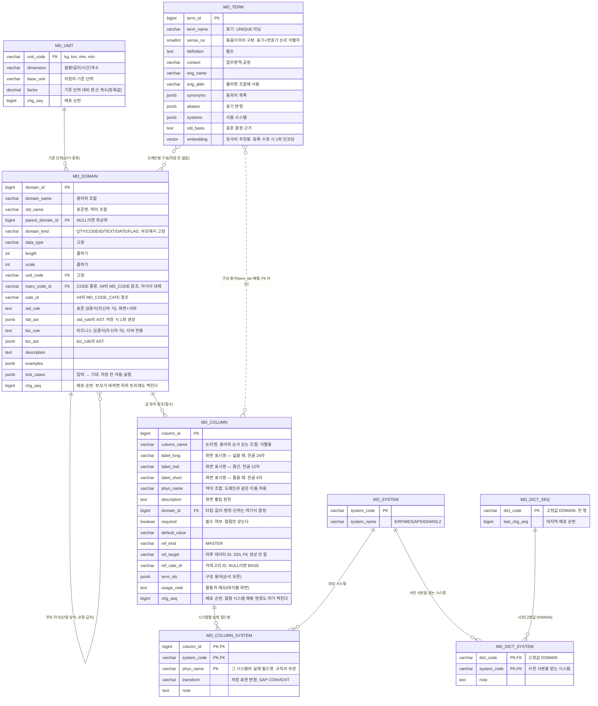
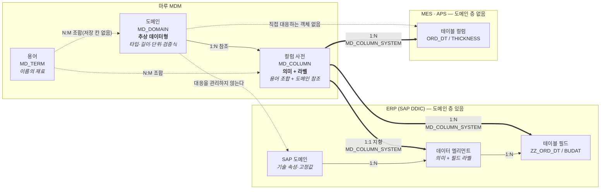
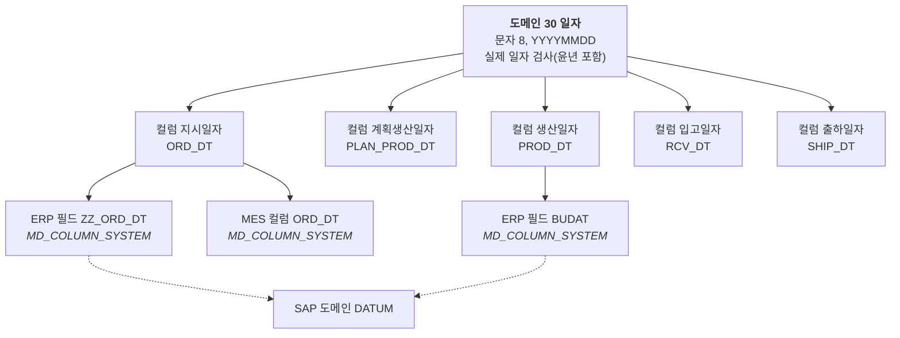

# 마루 MDM 설계: 용어·도메인·컬럼

> 분할 문서. 공통 원칙(역할·배포)은 `01-mdm-overview.md`, 표현식 엔진 지침은 `evalex-guide.md` 참조.

## 용어관리

- MES, ERP 에서 관리하는 용어를 단어 단위로 정의
- MES/ERP 등 그 외 시스템에 같은 의미이지만 다른 용어로 사용되는 것은 동의어로 관리
- (회의 #144) 기준은 ERP 용어. ERP가 변경 불가능한 용어는 억지로 맞추지 않고 공정용어↔ERP용어 동의어 매핑으로 처리
- 통일의 층 구분: **논리 용어(한글 명칭·의미)는 ERP 기준으로 통일**하고, **물리 약어(영문 컬럼명)는 ERP와 통일하지 않는다.** SAP 표준 필드명(`CHARG`, `MATNR`)은 독일어 약어에서 온 단축명이라 용어 조합·역분해가 불가능하므로, 물리 층은 표준 약어 체계 + 시스템별 매핑으로 연결한다(도메인 설계 절)
- (회의 #144) 용어집은 MDM에 저장하되 조회·참고용으로만 운영하고 별도 배포는 하지 않음

### 구조: 용어 → 도메인 → 컬럼명 3계층

- **용어**: 컬럼명을 이루는 기본 단어. 띄어쓰기 단위 최소 단위다. 예: 코일, 두께, 아이디, 원재료. 용어 자체는 단어의 설명이며 **도메인을 갖지 않는다**.
- **도메인**: 실제 데이터 타입·길이·단위·값 범위가 정의되는 곳. 예: 코일 두께(COIL_THK)는 숫자이고 0.1-3.5 mm 에 속한다 — 이것이 도메인이다. 값 범위를 포함한 검증 조건은 **EvalEx 검증식**으로 적는다(`value >= 0.1 && value <= 3.5`). 저장 칸은 실행 범위에 따라 표준 검증식(화면+서버)과 비즈니스 검증식(서버 전용) 둘이다(도메인 설계 절).
  - 도메인은 **상속**된다. 원재료 코일 두께(RMTL_COIL_THK)는 코일 두께를 상속받은 도메인이며, 필요하면 범위를 좁히거나 속성을 재정의한다. 명시하지 않은 속성은 부모 값을 그대로 따른다.
  - 도메인 이름도 용어의 조합으로 만든다: 코일 두께 = [코일] + [두께], 원재료 코일 두께 = [원재료] + [코일] + [두께].
- **컬럼명**: 용어의 순서 있는 조합이며 **도메인을 참조**한다. 타입·길이·범위를 직접 갖지 않고 참조한 도메인에서 가져온다. 예: 코일 아이디 = [코일] + [아이디] → COIL_ID.
- 영문 이름은 도메인과 컬럼 모두 용어별 영문 약어를 조합 규칙으로 자동 생성한다. MDM이 정한 이름을 도메인은 **표준명**, 컬럼은 **표준 물리명**이라 부르는데, 도메인 이름은 값 정의를 가리킬 뿐 실제 물리 컬럼이 아니기 때문이다(사용자 결정 2026-09-10). ERP·MES가 실제로 쓰는 이름은 컬럼 층이 **시스템별 실제 필드명**으로 담으며 시스템마다 따로 등록한다. 도메인 층에는 시스템 쪽 이름을 두지 않는다(사용자 결정 2026-09-10).
- 용어의 키는 표기가 아니라 **표기 + 의미 번호**다. 같은 표기가 다른 뜻으로 쓰이면 별도 용어로 등록한다.

### 용어(단어) 속성

| 구분  | 속성        | 설명                                 |
| --- | --------- | ---------------------------------- |
| 기본  | 표기(한글)    | 단어 표기                              |
| 기본  | 의미 번호     | 동음이의어 구분용. 표기 + 의미 번호가 식별자         |
| 기본  | 정의        | 뜻을 설명하는 문장. 의미가 다른 엔트리를 구별하는 근거    |
| 기본  | 맥락        | 업무영역·공정(소둔, 영업, 품질 등). 의미를 결정하는 조건 |
| 표기  | 영문명       | 영문 정식 명칭                           |
| 표기  | 영문 약어     | 물리명 조합에 사용                         |
| 사용  | 사용 시스템    | MES, ERP, APS, DKMS 등              |
| 표준  | 표준 결정 근거  | 원칙은 ERP 기준. 코일아이디처럼 예외를 둔 경우 이유 기록 |
| 관계  | 동의어       | 같은 뜻, 다른 이름 (ERP 배치 ↔ MES 코일)      |
| 관리  | 버전(승인·상태 없음)  | 표준 관리자가 저장하면 바로 배포                         |
| 관리  | 유효기간      | 시작·종료일                             |
| 관리  | 소유 부서·담당자 | 의미 결정 책임자                          |
| 관리  | 등록 출처     | 어느 시스템·문서에서 가져왔는지                  |

### 도메인 설계

도메인은 "값이 어떤 것이어야 하는가"를 한 번 정의해 여러 컬럼이 공유하는 **값 정의의 단위**다(ISO/IEC 11179의 value domain에 해당). 컬럼은 도메인을 참조만 하고, 검증은 도메인의 정의로 실행된다. 검증식의 표기·엔진·실행 지점은 다음 절(도메인 검증 규칙 표현 방식)에서 다루고, 여기서는 도메인 자체의 구조를 정한다.

| 도메인이 갖는 것 | 도메인이 갖지 않는 것(컬럼 속성) |
| --- | --- |
| 종류, 데이터 타입·길이·소수 자리, 단위, 값 집합(마루 코드), 검증식, 정의·예시·테스트 케이스 | 필수 여부(required), **화면 표시명 3종**, 마스터데이터 참조(ref_target·ref_cate_id), 기본값, 활용처 메모(`usage_note`) |

#### 도메인 종류

종류(domain_kind)는 필수 속성·검증식의 전형·화면 컨트롤·DDL 타입을 결정하는 분류다. 종류는 부모에서 고정되어 자식이 바꿀 수 없다.

| 종류 | 예 | 필수 속성 | 검증식 전형 | 화면 컨트롤 |
| --- | --- | --- | --- | --- |
| QTY 계량 | 코일 두께, 코일 중량, 라인스피드 | 숫자 타입·소수 자리·**단위** | `value >= 0.1 && value <= 3.5 && value % 0.1 == 0` | 숫자 입력 + 단위 표시 |
| CODE 코드 | 등급, 공정 코드, 강종 | **코드 참조**(마루 코드 `maru_code_id` + 카테고리 `cate_id`) | **검증식 없음.** 값 정의는 코드 참조 하나뿐이며 표준·비즈니스 검증식 칸은 비워 둔다. 시스템이 `MASTER("<마루 코드>", "<카테고리>", value)`를 자동 생성한다(시그니처와 평가 시각 규칙은 제약 관리 절). 자식이 값을 제한하려면 다른 카테고리(또는 마루 코드)를 참조한다(부모 참조 대체) | 콤보(배포된 코드 사본의 카테고리 목록) |
| ID 식별자 | 코일 아이디, 주문 번호 | 문자 길이·형식 | `STR_MATCHES(value, "^[A-Z0-9]{10,20}$")` | 텍스트, 대문자 강제 |
| TEXT 문자 | 고객명, 비고 | 길이 | 보통 없음. 필요 시 `STR_TRIM(value) != ""` | 텍스트 |
| DATE 날짜·시각 | 생산 일자, 출하 예정일 | 정밀도(일/초) | 교차 컬럼 위주: `value >= PROD_START_DT`. 현재 시각 함수는 결정성 위반이라 쓰지 않는다. 시각과 견줄 일은 교차 컬럼으로 적는다 | 날짜 선택 |
| FLAG 고정값 | 사용 여부(Y/N), 검사 여부(T/F), 등급(1/2/3/4/D) | **허용 값 목록.** 따로 칸이 없고 표준 검증식에 사람이 적는다. 쌍이 아니어도 된다(결정 2026-09-09) | `value == "Y" \|\| value == "N"`, `value == "1" \|\| value == "2" \|\| value == "3" \|\| value == "4" \|\| value == "D"`. 시스템 고정이 아니다 | 값이 둘이면 체크박스, 셋 이상이면 라디오·콤보. 보기는 검증식 AST의 리터럴에서 읽는다 |

CODE와 FLAG는 값 집합을 어디에 두느냐로 가른다. 값을 마스터코드(이름·약칭·순서·유효기간)로 관리하면 CODE이고, 값 몇 개를 도메인의 표준 검증식에 직접 적고 끝내면 FLAG다. 같은 「등급」이라도 마스터코드로 관리하면 CODE이고 `1·2·3·4·D`를 검증식에 적으면 FLAG다(결정 2026-09-09). FLAG의 최상위 도메인은 표준 검증식이 비어 있을 수 없다(DB `ck_md_domain_flag`). 자식은 검증식이 누적되므로 부모 목록을 좁힐 수만 있다.

#### 속성과 상속 규칙

자식은 부모보다 **넓어질 수 없다.** 속성마다 허용되는 상속 동작은 "고정 / 좁히기 / 누적" 셋 중 하나이며, 마루 기존 설계(maru03030)의 재정의(redefine)·상속(inherit)·추가(add) 가운데 넓히는 재정의는 없앤다.

| 구분 | 속성 | 상속 | 설명 |
| --- | --- | --- | --- |
| 기본 | 도메인명 / 표준명 | 자신 | 용어 조합 / 약어 조합 자동 생성 |
| 기본 | 종류 | **고정** | 부모와 동일 |
| 기본 | 부모 도메인 | - | 단일 상속. 순환 금지 |
| 값 정의 | 데이터 타입 | **고정** | 마루 03030의 "상위 도메인이 있으면 타입 편집 불가" 유지 |
| 값 정의 | 길이 · 소수 자리 | **좁히기** | 부모 이하로만 재정의. 등록 시 비교 검사 |
| 값 정의 | 단위 | **고정** | 기준(저장) 단위. 자식이 단위를 바꾸면 환산이 끼어들어 값 비교가 깨진다. 화면 표시 단위는 별도(단위 절 참조) |
| 값 정의 | 코드 참조(마루 코드 + 카테고리) | **대체** | CODE 종류만. 자식이 지정하면 자식의 참조만 쓰고 부모의 참조는 무시한다. 부분집합 검사는 하지 않는다(결정 2026-09-02). 지정하지 않으면 부모 참조를 그대로 쓴다 |
| 값 정의 | **표준 검증식**(자신의 식) | **누적** | 범위·단위·정규식·교차 컬럼 등. **화면 + 서버** 실행. 화면 화이트리스트 함수만 허용. **CODE 종류는 비움** |
| 값 정의 | **비즈니스 검증식**(자신의 식) | **누적** | 비즈니스 커스텀 함수 사용 가능. **서버 전용** — 화면에는 배포하지 않음 |
| 파생값 | 유효 표준식 · 유효 비즈니스식 (각 AST 포함) | **저장하지 않는다** | 각각 부모 유효 식 `&&` 자신의 식. 쓰는 시점에 부모 체인을 올라가며 만든다. 하위 시스템으로는 배포 스냅샷이 실어 나른다 |
| 파생값 | 요구 컬럼 | **저장하지 않는다** | 유효 식이 참조하는 `value` 외 변수 목록(`getUsedVariables`). 유효 식에서 뽑으므로 유효 식과 같이 움직인다 |
| 설명 | 정의 · 예시 값 · 테스트 케이스 | 자신 | 테스트 케이스는 `입력 → 기대(true/false)` 목록. 저장 전 자동 실행, 부모 변경 시 하위 케이스 전부 재실행 |
| 관리 | 버전 · 유효기간 | 자신 | 공통 관리 모듈. 상태·승인·소유자는 두지 않는다. 표준 관리자 역할만 등록·수정하고 저장하면 바로 배포한다(결정 2026-09-09). 08 DRAFT 정책의 대상이 아니다 |

#### 상속 구조

- 단일 상속, 권장 깊이 3(기본 도메인 → 업무 도메인 → 특수 도메인). 최상위는 종류별 **기본 도메인**(길이, 중량, 코드, 식별자 등)으로 시작해 타입과 단위를 한 곳에서 잠근다.
- **CODE 종류의 상속은 다르다**(결정 2026-09-02). 코드 종류 도메인은 검증식을 갖지 않고 코드 참조(마루 코드 + 카테고리)만 갖는다. 부모와 자식이 모두 코드 참조를 가지면 **자식 것만 쓰고 부모 것은 무시**한다(대체). 자식이 참조를 비우면 부모 참조를 그대로 쓴다. 따라서 CODE 종류에는 "자식은 부모보다 넓어질 수 없다"는 보장이 없고, 상속이 물려주는 것은 종류·타입·길이뿐이다. **유효 참조(부모 체인에서 가장 가까운 지정값)는 저장하지 않는다**(결정 2026-09-04). 값 하나를 고르는 조회일 뿐이고, 도메인 트리가 있는 MDM 안에서만 필요하기 때문이다. 유효 식도 같은 이유로 저장하지 않는다(아래 절). 코드 존재와 다른 컬럼 조건을 함께 걸어야 하면 룰(`06-business-rule.md`)이나 상대 컬럼의 도메인으로 옮긴다.
- **유효 식은 저장하지 않는다**(결정 2026-09-04). 원장에는 자신의 식(`std_rule`·`biz_rule`)만 두고, 유효 식은 쓰는 시점에 부모 체인을 올라가며 `&&`로 붙여 만든다. 아래 "파생값을 저장하지 않는다" 절에서 자세히 다룬다. 부모 식을 고치면 저장 화면에 영향 받는 하위 도메인과 참조 컬럼 목록을 보여주고, 하위 도메인의 테스트 케이스를 전부 다시 돌린다.
- 예시 트리(마루 설계서 maru03020의 중량 예제 계승):

```
중량 (WGT)                     QTY 숫자(7,3) ton   식: value > 0
└ 코일 중량 (COIL_WGT)                             식: value <= 30
   │                                               유효: value > 0 && value <= 30
   ├ 코일 NET 중량 (COIL_NET_WGT)                  식: (없음)
   │                                               유효: 부모와 동일
   ├ 코일 GROSS 중량 (COIL_GRS_WGT)                식: value >= COIL_NET_WGT      요구 컬럼: COIL_NET_WGT
   │                                               유효: value > 0 && value <= 30 && value >= COIL_NET_WGT
   └ 코일 포장 중량 (COIL_PAK_WGT)                 식: value >= 1 && value <= 25   길이 재정의 6,0 (좁히기)
                                                   유효: value > 0 && value <= 30 && value >= 1 && value <= 25
```

#### 파생값을 저장하지 않는다 (결정 2026-09-04)

기준은 하나다. **자기 행만으로 정해지는 값은 저장하고, 부모에 기대는 값은 저장하지 않는다.**

| 값 | 저장 | 이유 |
| --- | --- | --- |
| `std_rule` · `biz_rule` | **한다** | 사람이 쓴 자신의 식. 원본이다 |
| `std_ast` · `biz_ast` | **한다** | 자기 식만 파싱한 것이라 부모가 바뀌어도 상하지 않는다. 저장할 때 파싱·화이트리스트 검사를 이미 하므로 그 결과를 버릴 이유가 없다 |
| 유효 표준식 · 유효 비즈니스식 | 안 한다 | 부모 체인을 최상위까지 올라가며 `&&`로 잇는다 |
| 유효 AST | 안 한다 | **조상들의 `std_ast`를 AND 노드로 잇기만 한다. 다시 파싱하지 않는다** |
| CODE 종류의 `MASTER` | 안 한다 | 유효 식을 조립할 때 유효 참조를 풀어 `MASTER("<마루 코드>", "<카테고리>", value)`를 그 자리에 끼워 넣는다. CODE 종류는 `std_rule`이 NULL이어야 하므로(`ck_md_domain_code`) 생성한 식을 행에 넣을 자리도 없다 |
| 요구 컬럼 | 안 한다 | 유효 식에서 `value` 외 변수를 뽑는다(`getUsedVariables`) |
| 유효 코드 참조 | 안 한다 | 부모 체인에서 가장 가까운 지정값을 고른다 |

**왜 부모에 기대는 값은 저장하지 않는가.** 부모의 식을 고치면 그 아래 모든 자식의 유효 식이 함께 바뀐다. 값을 복사해 두면 부모를 한 번 고칠 때마다 하위 트리 전체를 다시 써야 하고, 그 쓰기가 실패하거나 누락되면 원본과 사본이 어긋난 채로 남는다. 실시간으로 만들면 그런 상태가 생기지 않는다.

**비용이 낮은 이유는 AST를 이미 갖고 있기 때문이다.** 유효 AST를 만드는 일은 파싱이 아니라 노드 붙이기다.

```
원재료 코일 두께(11)의 유효 AST
  = AND( 코일 두께(10).std_ast , 원재료 코일 두께(11).std_ast )

부모가 셋이면 AND(AND(조부.std_ast, 부.std_ast), 자신.std_ast)
```

깊이는 3을 권장하므로 AND 노드가 최대 두 개 붙는다. 도메인도 수백 행 규모다.

**저장 시 검사는 그대로다.** 파싱 실패, 화이트리스트 위반, 결과 타입 비boolean, 참조 변수의 컬럼 사전 미등재는 저장 거부 사유로 남는다. 부모 식을 고치면 하위 도메인의 테스트 케이스를 같은 트랜잭션에서 전부 다시 돌리는 것도 그대로다. 달라진 것은 **하위 트리에 값을 쓰지 않는다**는 점뿐이다. 배포 순번은 하위 트리에도 찍지만(「배포 순번」), 그것은 조립한 값이 아니라 다시 보내라는 표시라 원본과 어긋날 것이 없다.

**MDM 밖으로는 스냅샷이 나른다.** 하위 시스템에는 도메인 트리가 없어 조상을 찾을 수 없다. 배포 묶음을 만들 때 MDM이 도메인마다 유효 식과 유효 AST를 조립해 담는다. 그렇게 조립해 사본에 내려간 결과가 스냅샷이다. 사본이 어느 스냅샷까지 받았는지는 사본의 `last_seq_received`가 가리킨다(「배포 순번」, 검토서 63번, 2026-09-09).

**MDM 자신의 검증도 같은 스냅샷을 쓴다.** 하위 시스템이 판정할 데이터를 보내면 MDM이 결과만 돌려주는 판정 서비스(01 4절의 2안)는 건당 실행이라 매번 조상을 찾으면 안 된다. 하위 시스템과 똑같이 스냅샷을 읽는다. 원장은 정의만 갖고 실행은 스냅샷이 맡는 구도이며, 마스터코드의 원장·사본 분리(`04-master-code.md`)와 같은 모양이다. 원천 시스템이 보낸 마스터데이터를 MDM이 받는 경로는 여기에 들어가지 않는다. 받는 쪽은 검증하지 않고 그대로 저장한다. 검증은 생성·수정하는 원천의 몫이다(01 원칙 8, 결정 2026-09-09). 도메인 검증식은 시스템 백엔드와 화면의 값 검증에만 쓴다(결정 2026-09-08).

#### 도메인 분할 기준: 의미는 컬럼, 값 정의만 도메인

지시일자·계획생산일자·생산일자·입고일자·출하일자는 값 정의(문자 8, `YYYYMMDD`)가 완전히 같고 의미만 다르다. 이런 경우 도메인은 **일자 하나**만 만들고 의미 구분은 컬럼(용어 조합)이 담당한다. SAP이 도메인 `DATUM` 하나를 수백 개의 데이터 엘리먼트(BUDAT 전기일, AUDAT 오더일자 …)가 공유하는 것과 같은 구도다.

| 상황 | 처리 |
| --- | --- |
| 의미만 다름 (지시/생산/출하 일자) | 컬럼으로 구분. 도메인은 하나 |
| 값 정의가 다름 (계획일자가 월 단위 `YYYYMM`) | 별도 도메인(연월) |
| 값 제약이 더 좁음 (영업일만 허용) | 상속한 자식 도메인(식 AND 누적) |
| 컬럼 사이 관계 (출하일자 ≥ 생산일자) | 공유 도메인인 일자 30에는 넣지 않고 그 컬럼만 쓰는 자식 도메인이나 룰에 둔다 |

SAP DDIC과의 층 대응: SAP 도메인 ↔ 마루 도메인(기술: 타입·형식·범위), 데이터 엘리먼트 ↔ 마루 컬럼 사전 항목(의미: 라벨 + 도메인 참조), 테이블 필드 ↔ 실제 컬럼. 마루는 컬럼이 도메인을 직접 참조하는 2단이므로 SAP의 중간 층(데이터 엘리먼트)을 흉내 낼 필요가 없다.

**빈 말단 도메인 원칙**: 자신의 식도 재정의도 없는 말단 도메인은 만들지 않는다. 상속으로 빈 말단(지시일자 도메인 등)을 만들어도 유효 식이 부모와 같아 효과는 동일하지만, 버전·배포 대상 객체만 늘고 의미가 도메인·컬럼 두 사전에 이중 등재된다. 등록 화면은 빈 말단 저장 시 "부모와 정의가 같습니다. 컬럼이 부모를 직접 참조하면 됩니다"라고 경고한다. 예외로 허용하는 경우는 셋이다.

1. 가까운 시일에 고유 제약 도입이 확정된 경우(예: 생산일자 "미래 불가").
2. SAP 데이터 엘리먼트와 도메인 층에서 1:1 매핑이 필요한 항목(매핑 축이 도메인이므로).
3. 컬럼 사이 관계 제약이 확정된 경우(예: 출하일자 ≥ 생산일자).

미리 만들어 둘 필요는 없다. 나중에 제약이 생기면 자식 도메인을 신설하고 컬럼의 도메인 참조를 바꾸면 되는데, 값 정의가 같은 상태의 재지정이라 **호환 변경**(데이터 재검증 불필요)이다.

#### 단위: 저장 단위와 표시 단위의 분리

같은 생산량을 어떤 화면은 ton, 어떤 화면은 kg로 보여줘야 한다. 단위를 화면에 맞추느라 저장을 흔들지 않는다.

| 층 | 단위 | 결정 주체 |
| --- | --- | --- |
| 저장 · 검증 · 인터페이스 | **기준 단위 하나** (도메인에 고정, 예: 생산량 = kg) | 도메인 |
| 화면 표시 | 표시 단위 (화면 항목이 선택, 예: ton) | 화면 정의 |

- 값은 항상 기준 단위로만 저장한다. **단위별 컬럼(생산량_kg / 생산량_ton)과 단위별 도메인은 금지** — 회의 #39의 "시스템 간 단위 불일치"가 재발하는 길이다.
- 표시: 화면 항목이 표시 단위를 지정하면 환산해서 보여주고, 라벨에는 표시 단위를 자동 병기한다(`생산량 (ton) 1.5` ← 저장값 1500 kg).
- 입력: 사용자가 표시 단위로 입력하면 **기준 단위로 역변환한 뒤** 도메인 검증식을 실행한다. 검증식은 기준 단위 기준으로 작성되므로 순서는 입력 → 역변환 → 검증 → 저장이다. 환산은 decimal 연산으로 한다(ton↔kg는 정확히 10³).
- 환산 정보는 **단위 마스터(MD_UNIT)** 가 가진다: 차원(질량·길이·시간·개수), 기준 단위, 환산 계수. **같은 차원 안에서만 변환을 허용**하고(kg→mm 거부), 단위 마스터는 배포 대상이라 모든 시스템이 같은 환산 계수를 쓴다. 환산 계수가 시스템마다 하드코딩되는 것을 막는 것이 이 테이블의 존재 이유다.
- **분해 표시**: 142분을 "2시간 | 22분" 두 열로 보여줘야 한다면, 저장 컬럼은 여전히 하나(142, min)이고 두 열은 **같은 원천 컬럼을 참조하는 화면 전용 파생 표시 항목**이다(시 부분 = FLOOR(142÷60), 분 부분 = 142 % 60). DB 컬럼도, 컬럼 사전 등재도 하지 않는다. 라벨은 원천 컬럼 라벨에서 파생한다(`휴지시간(시)`, `휴지시간(분)`). 편집은 시·분 칸을 가진 duration 입력 컨트롤 하나로 취급해 저장 시 합성(2×60+22=142) → 역변환 → 검증 → 저장. 합계·평균·정렬은 반드시 저장값으로 계산한 뒤 분해한다(시끼리·분끼리 합산 금지). 십진 표시(2.4 h), 결합 표시(2:22), 분해 표시(2 | 22)는 모두 같은 저장값의 표현이다.
- 역할 경계: 어느 화면 항목이 ton으로 볼지, 값을 몇 열로 분해할지는 각 시스템 화면 정의의 몫이다. MDM의 책임은 기준 단위(도메인), 환산 계수(단위 마스터 배포), "저장은 반드시 기준 단위" 규칙 세 가지다.

#### 검증식 계약

- 입력: `value`(검사 대상) + 같은 레코드의 다른 컬럼(물리명). 결과는 boolean.
- **칸이 실행 범위를 결정한다**: 표준 검증식 칸은 화면 화이트리스트 함수(`evalex-guide.md` 8.5 + `MASTER`)만 허용하고, 비즈니스 검증식 칸은 서버에 등록된 커스텀 함수까지 허용한다. `MASTER`는 마루 코드 대상만 화면이 판정하고 마루 데이터 대상은 서버 미리보기로 폴백한다(아래 조건 3). 칸별 화이트리스트 검사를 저장 시 수행하므로, 화면에 배포되는 식에 서버 전용 함수가 섞일 수 없다. AST를 훑어 실행 가능 여부를 판정하는 파생 플래그가 필요 없다.
- 저장 거부 조건: 파싱 실패, 화이트리스트 밖 함수, 결과 타입이 boolean이 아님(예시 값·테스트 케이스로 1회 평가), 참조 변수가 컬럼 사전에 없음, 길이·소수 자리가 부모보다 큼, 상속 순환, 테스트 케이스 실패.
- 검증식은 "값이 있을 때 옳은가"만 답한다. NULL은 필수 검사 단계에서 먼저 처리한다(제약 관리 절).
- 교차 컬럼: 요구 컬럼이 있는 도메인을 컬럼이 참조할 때 같은 테이블에 요구 컬럼이 없으면 컬럼 등록 시 경고한다(테이블 정의가 MDM 밖에 있을 수 있어 강제하지 않음). 실행 시 요구 컬럼이 컨텍스트에 없으면 통과가 아니라 **검증 실패**로 처리한다.
- 테스트 케이스는 경계값 통과·실패 각 1건 이상을 권장한다.

#### 이름: 표준명·표준 물리명과 시스템별 실제 필드명

도메인 층에서 MDM이 정하는 이름은 물리명이 아니라 **표준명**이다(사용자 결정 2026-09-10). 도메인 이름은 값 정의를 가리킬 뿐 실제 물리 컬럼이 아니고, 컬럼 층만 실제 물리 컬럼명을 다루므로 거기서는 **표준 물리명**으로 남는다.

- **표준명**(`MD_DOMAIN.std_name`)은 구성 용어의 영문 약어를 `_`로 이은 것이다. 컬럼 물리명과 생성 규칙이 같고, 사전이 다르므로 **같은 이름을 허용**한다. `_DMN` 같은 접미어는 붙이지 않는다. MDM 안에서 도메인을 부르는 이름이며 어느 시스템의 것도 아니다.
- 도메인과 같은 이름의 컬럼이 대표 컬럼이고, 같은 도메인을 쓰는 다른 컬럼은 수식어 용어를 앞에 붙인다: 코일 두께 도메인 ← 코일 두께(COIL_THK), 입측 코일 두께(ENT_COIL_THK), 출측 코일 두께(DLV_COIL_THK).
- **시스템별 실제 필드명은 컬럼 층이 담는다**(`MD_COLUMN_SYSTEM.phys_name`, 결정 2026-09-04). ERP `MATNR`, MES `COIL_ID`처럼 이름이 아주 다르고 규칙으로 유도되지 않으므로, 컬럼마다 행으로 명시한다. 도메인 층에는 시스템 쪽 이름을 두지 않으므로 SAP 도메인 층 이름(`DATUM`)은 원장에 담지 않고, 적어 둘 필요가 있으면 `MD_COLUMN_SYSTEM.note`에 적는다(사용자 결정 2026-09-10).
- 새 시스템(APS, L2 등)이 이미 만들어진 도메인을 쓰기 시작해도 도메인은 그대로 쓴다. 도메인 사전은 도메인마다 대상을 나누지 않고 `MD_DICT_SYSTEM`에 지정한 시스템에 전체가 가므로, 시스템마다 도메인 행을 둘 일이 없다(「배포」, 07 「대상별 배포 기전 현황」). 대신 컬럼 층에 **그 시스템의 행을 추가**한다. 그 시스템이 사전을 받으려면 `MD_DICT_SYSTEM`에 한 줄을 넣는다. 시스템별 컬럼(`phys_name_erp`, `phys_name_mes` …)으로 두면 시스템이 늘 때마다 테이블 구조를 바꿔야 하고, 용어집처럼 `이름(시스템)` 다중값 문자열로 두면 검증 라이브러리가 시스템별 이름으로 컬럼을 찾을 때 키로 쓸 수 없다. 그래서 매핑 테이블로 둔다.
- DDL·인터페이스 문서에 쓰는 **시스템별 타입 표기는 원장에 담지 않는다**. 마루 타입에서 시스템별 변환 규칙으로 유도한다. 숫자 3,1이면 SAP은 `DEC 3,1`, Oracle은 `NUMBER(3,1)`이 되는 식이다. 값 정의(타입·길이·단위)는 도메인 하나가 고정하고, 변환 규칙 표는 상세설계에서 정한다.
- **모든 시스템이 명시 매핑 대상이다**(결정 2026-09-04). 약어 조합 자동 생성과 역방향 분해는 등록을 돕는 제안일 뿐이고, 원장은 `MD_COLUMN_SYSTEM` 행이다. SAP 표준 필드(`MATNR`, `CHARG`, `BUDAT`)가 실제 인터페이스의 대부분이라 규칙으로 덮이지 않기 때문이다.
- **신규 Z필드 명명 규칙**: 앞으로 만드는 SAP 커스텀 필드는 `ZZ_` + 표준 물리명(`ZZ_COIL_THK`)을 사내 표준으로 권한다. 다만 이는 **등록 화면의 기본값 제안**이고 매핑을 대신하지 않는다. 신규분도 행을 남긴다.

#### 생명주기와 변경 관리

- 상태와 승인은 두지 않는다. 권한 관리의 표준 관리자 역할만 등록·수정하고, 저장하면 바로 배포된다(사용자 결정 2026-09-09). 폐기(DEPRECATED)도 두지 않는다(사용자 결정 2026-09-09, 검토서 48번). 쓰지 않게 된 도메인은 참조 컬럼과 룰 결과 변수(06 `MD_RULE_VAR.domain_id`)의 참조를 끊고 그대로 남긴다. 어디서 쓰는지는 영향도 조회로 본다.
- 하위 시스템은 배포받은 도메인 버전을 고정해 쓴다. 같은 입력과 같은 도메인 버전이면 결과가 같다.

| 변경 분류 | 예 | 처리 |
| --- | --- | --- |
| 호환 | 정의·예시·테스트 케이스 추가 | 버전 유지. 저장하면 바로 반영되고 그 행에 배포 순번이 찍힌다(「배포 순번」) |
| 좁히기 | 검증식 강화, 길이·소수 자리 축소 | 새 버전. 그 행과 하위 트리 전부에 배포 순번이 찍힌다(「배포 순번」). 하위 도메인의 유효 식이 함께 좁아지고(조립 결과라 값을 따로 쓰지는 않는다) 테스트 케이스를 다시 돌린다. **기존 데이터는 보지 않는다**(결정 2026-09-03, 마스터코드 2차 검토 32). 데이터가 하위 시스템에 있어 MDM이 볼 수 없으며, 위반 여부는 각 시스템의 정합성 점검 배치가 본다(04 승인 검사 절과 같은 결정). 저장 화면은 저장 전에 변경 diff와 영향도(하위 도메인·참조 컬럼·룰 결과 변수·배포 시스템)를 보이고 테스트 케이스를 돌린다. 승인은 없다 |
| 넓히기 | 범위 확대 | 새 버전. 순번은 좁히기와 같이 그 행과 하위 트리 전부에 찍힌다. 자식이 이미 좁힌 조건은 영향 없음. 데이터 재검증 불필요 |
| 구조 변경 | 타입·단위·종류·부모 변경 | 금지. 새 도메인을 만들고 컬럼을 이관 |

#### 배포

- 용어집은 배포하지 않지만(회의 #144) **도메인·컬럼 사전·단위 마스터는 배포 대상**이다. 컬럼 사전은 화면 라벨·검증 매핑에 필요한 서브셋(물리명 → 논리명·**화면 표시명 3종**·도메인·required·정의·변환 규칙)만 배포한다. 하위 시스템의 검증 라이브러리가 `자기 시스템의 (테이블, 필드명) → 마루 컬럼(MD_COLUMN_SYSTEM) → 도메인 → 표준·비즈니스 유효 식 텍스트(Java 라이브러리용)와 표준 유효 AST(화면용) + 구조화 속성 + (코드형이면) 코드 사본` 순으로 찾아 실행한다. 배포 묶음에는 대상 시스템의 물리명만 담는다. 호출 형태는 `validate(table, column, record)` 하나다.
- 배포는 사본을 원장과 같게 맞추는 동기화다. 04·05와 같은 변경분 방식이다. 보내는 단위는 행이고, 무엇을 보낼지는 행마다 찍힌 배포 순번(`chg_seq`)으로 정한다. 순번의 축은 도메인 사전 전체 하나이며 도메인·컬럼 서브셋·단위 마스터가 같은 축을 쓴다. 부모 도메인이 바뀌면 하위 트리 전부에 순번이 찍히므로 바뀐 도메인과 그 하위 트리가 함께 간다. 사본은 시스템마다 `last_seq_received` 하나를 갖고, 그보다 큰 순번의 행 전부를 한 스냅샷에서 받는다. 규칙은 아래 「배포 순번」에 있다(결정 2026-09-09, 검토서 63번).
- 사전의 **원장은 MDM 역할을 맡은 인스턴스**다. MDM은 정해진 시스템이 아니라 역할이므로(01 「한 줄 정의」), 인스턴스마다 `MD_SYSTEM`에 자기 행을 두고 그 `system_code`를 배포 묶음 헤더의 원장 코드로 싣는다(07 「묶음의 자기 완결성」, 05 「그 밖의 규칙」). 인스턴스가 여럿이면 다른 인스턴스도 사전을 받는 쪽이 될 수 있다. **사본을 받을 시스템은 `MD_DICT_SYSTEM`으로 지정한다.** 코드·데이터·룰을 `MD_CODE_SYSTEM`·`MD_DATA_SYSTEM`·`MD_RULE_SYSTEM`으로 지정하는 것과 같은 방식이다. 다만 사전은 도메인마다 대상을 나누지 않고 사전 전체에 한 번 지정한다. 지정된 시스템은 사전 전체를 받되, 컬럼은 그 시스템에 실제 필드명(`MD_COLUMN_SYSTEM`)이 있는 것만 서브셋으로 간다. ERP(SAP)나 DKMS처럼 참고 사양만 받는 시스템은 지금은 여기에 넣지 않는다(사용자 결정 2026-09-10).
- **ERP(SAP)는 실행 배포 대상으로 지정하지 않는다**(운영 결정 2026-09-04, 2026-09-09 재확인). 배포 기전이 ERP를 막는 것은 아니다. 담당자가 지정하면 다른 하위 시스템과 같이 받을 수 있지만 지금은 지정하지 않는다. ERP에는 검증 라이브러리도 AST도 배포하지 않고, 도메인 정의와 **EvalEx 식 텍스트를 참고 사양으로 전달**한다. 전문 레이아웃도 같다(03). ERP가 그 내용을 보고 필요한 만큼 직접 구현한다. 01의 계산수식 방식("수식 자체는 배포하지 않고 표현형식을 공유. 각 시스템이 자체 구현하고 결과값 일치 여부를 상호 검증")과 같은 처리다. 자동 반영이나 DDIC 생성 연동은 두지 않는다.

| 대상 | 받는 것 | 실행 주체 |
| --- | --- | --- |
| Java 하위 시스템(MES 등) | 유효 식 텍스트 + 표준 유효 AST + 구조화 속성 + 코드 사본. 공통 엔진 모듈 | 배포된 검증 라이브러리 |
| **ERP(SAP)** | **도메인 정의와 EvalEx 식 텍스트, 전문 레이아웃(참고 사양)**. 코드·데이터 사본은 04·05 기전으로 받는다 | ERP가 자체 구현. 강제하지 않는다. 실행 배포 대상으로 지정하지 않는 것은 운영 결정이다 |

- ERP 데이터의 품질은 두 가지로 본다. 하나는 `ERP 생성 → MDM 밸리데이션 → 중계`(01의 마스터데이터 흐름)이고, 다른 하나는 회의 #144의 결과값 상호 검증이다. ERP 화면에서 즉시 걸러지지 않는 것은 감수한다.

#### 배포 순번

배포 대상 세 테이블(MD_DOMAIN·MD_COLUMN·MD_UNIT)의 행마다 `chg_seq`(BIGINT, NOT NULL)를 둔다. 도메인 사전 전체를 축 하나로 단조 증가한다. 마스터코드는 마루 코드마다, 마스터데이터는 마루 데이터마다 축이 있지만 도메인 사전은 하나뿐이라 축도 하나다. 마지막으로 발급한 번호는 한 행짜리 표 `MD_DICT_SEQ.last_chg_seq`가 갖는다. 04·05의 변경분 방식과 같은 규칙이다. 승인과 미적용 버전이 없으므로 04의 to_ver·apply_to 가리기 규칙은 없다(결정 2026-09-09, 검토서 63번).

| 항목 | 규칙 |
| --- | --- |
| 발급 | 사건과 같은 트랜잭션에서 `UPDATE MD_DICT_SEQ SET last_chg_seq = last_chg_seq + 1 WHERE dict_code = 'DOMAIN' RETURNING last_chg_seq` 한 문장으로. 읽어서 더해 쓰는 방식과 DB 시퀀스 객체는 쓰지 않는다 |
| 직렬화 | 이 update가 MD_DICT_SEQ 행을 커밋까지 잠그므로 도메인 사전의 사건은 직렬화되고, 순번 순서와 커밋 순서가 같다. 롤백되면 번호도 되돌아간다. 사전 편집은 표준 관리자 몇 사람의 일이라 행 하나의 잠금이 병목이 되지 않는다 |
| 단위 | 사건 하나 = 순번 하나. 그 사건이 건드린 행 전부에 같은 순번을 찍는다. 부모 도메인 저장으로 하위 트리 50개에 찍혀도 순번은 하나다 |
| NULL 없음 | 저장하면 바로 배포되므로 미적용 행이 없다. 모든 행이 배포 대상이라 `chg_seq`는 NOT NULL이다 |

| 사건 | 순번을 찍는 행 |
| --- | --- |
| 도메인 등록 | MD_DOMAIN 그 행 |
| 도메인 좁히기·넓히기, 코드 참조 변경 | MD_DOMAIN 그 행과 **하위 트리 전부**. 자식의 유효 식·유효 AST·유효 코드 참조가 함께 바뀌기 때문이다. 자식 행의 값은 그대로 두고 순번만 찍는다 |
| 도메인 호환 변경(정의·예시·테스트 케이스) | MD_DOMAIN 그 행 |
| 컬럼 등록·수정 | MD_COLUMN 그 행 |
| 컬럼 시스템 매핑 등록·수정(MD_COLUMN_SYSTEM) | MD_COLUMN 그 컬럼 행. 배포 서브셋이 대상 시스템의 물리명을 담기 때문이다 |
| 단위 등록·수정 | MD_UNIT 그 행 |

다음에는 순번을 찍지 않는다. MD_SYSTEM 변경, MD_DICT_SYSTEM 변경, 용어집 변경이다. 이 표들은 묶음에 실리지 않는다. 값이 바뀌지 않은 저장도 순번을 쓰지 않는다.

**보내는 쪽.** 사본마다 (system_code, last_seq_received)를 갖는다. 초기 적재는 0이다.

```sql
SELECT * FROM <각 테이블> WHERE chg_seq > :last ORDER BY chg_seq
```

| 규칙 | 내용 |
| --- | --- |
| 한 스냅샷 | 세 테이블과 `last_chg_seq`를 한 트랜잭션·한 스냅샷(REPEATABLE READ 이상)에서 읽는다. 따로 읽으면 그 사이 커밋된 사건이 일부 테이블에만 실리고, 빠진 행은 다시 순번이 찍힐 때까지 오지 않는다 |
| 조립 | 도메인 행은 원장 행 그대로가 아니라 조립한 결과로 보낸다. 유효 식 텍스트·표준 유효 AST·구조화 속성·유효 코드 참조다(「파생값을 저장하지 않는다」). 조립에 쓰는 조상 행은 순번과 무관하게 같은 스냅샷에서 읽는다. 컬럼 행은 서브셋이고 대상 시스템의 물리명과 변환 규칙(MD_COLUMN_SYSTEM의 `phys_name`·`transform`)을 붙인다. 변환 규칙은 검증 직전 정규화에 쓰므로 함께 간다. 그 시스템에 물리명이 없는 컬럼은 보내지 않는다 |
| 묶음 | 질의 결과 전부와 그 스냅샷의 `last_chg_seq`. 받는 쪽은 이 값 하나로 적용·폐기를 판정한다. 트리 안 순번의 최댓값 같은 대표값을 따로 두지 않는다 |
| 시작 시점 | 커밋 직후. 전달 수단은 07이 정한다 |
| 한 가지 동작 | 초기 적재·따라잡기·변경 배포가 모두 같다. 놓친 사건이 몇 개든 한 번에 받는다. 전체 재적재는 사본을 비우고 last 0으로 같은 질의를 한다 |

**받는 쪽.**

| 규칙 | 내용 |
| --- | --- |
| 직렬화 | 같은 시스템의 사전 동기화는 한 번에 하나만 돈다 |
| 옛 묶음 폐기 | 묶음의 `last_chg_seq`가 사본의 `last_seq_received`보다 크지 않으면 통째로 버린다. 늦게 도착한 옛 묶음이 새 유효 식을 덮는 것을 막는다 |
| 한 트랜잭션 | 행 upsert와 `last_seq_received` 갱신을 한 트랜잭션으로 한다. 실패하면 아무것도 남기지 않고 다음에 같은 질의를 다시 한다 |
| upsert | PK 기준. 도메인 행이 조립된 절대값이라 적용 순서가 없다. 같은 묶음을 두 번 적용해도 결과가 같다 |
| 사본 테이블 | 도메인 사본·컬럼 사본·단위 사본 셋. FK는 걸지 않는다. 도메인 사본에는 부모 링크가 없다. 조립 결과만 있으면 되기 때문이다 |

**예**

| 순서 | 사건 | 순번을 찍는 행 | last_chg_seq |
| --- | --- | --- | --- |
| D1 | 도메인 10 코일 두께 등록 | 도메인 10 | 1 |
| D2 | 도메인 11 원재료 코일 두께 등록(부모 10) | 도메인 11 | 2 |
| D3 | 컬럼 1 코일 두께 등록(도메인 10), MES 물리명 COIL_THK | 컬럼 1 | 3 |
| D4 | 도메인 10 좁히기(`value <= 3.5` → `value <= 3.0`) | 도메인 10·11 | 4 |
| D5 | 도메인 30 일자 등록 | 도메인 30 | 5 |
| D6 | 도메인 11 설명 수정(호환) | 도메인 11 | 6 |

| 사본 | 상황 | 받는 것 |
| --- | --- | --- |
| MES | D3 뒤 수신(last 3), D5 뒤 동기화 | 순번 4·5인 행. 도메인 10·11(둘 다 3.0으로 좁아진 유효 식)과 도메인 30 |
| MES | last 3인 채로 묶음이 둘 만들어짐. D4 뒤 X(순번 4, last_chg_seq 4), D5 뒤 Y(순번 4·5, last_chg_seq 5). Y가 먼저 도착 | Y를 적용해 last가 5가 된다. 뒤에 온 X는 4가 5보다 크지 않아 버린다. X의 행은 Y에 다 들어 있다 |
| APS | D6 뒤 대상 추가 | last 0으로 순번 있는 행 전부. 컬럼 1은 APS 물리명이 없으면 빠진다 |

#### 화면: 마루 maru03020/03030 계승과 변경

| 항목 | 기존 마루 설계 | 변경 |
| --- | --- | --- |
| 제약 방법 | None / Value / List / EvalEx / JS / RegExp / Table 칼럼 7종 | **EvalEx 하나 + 코드 참조.** List·Table 칼럼은 마스터코드 카테고리 참조로, RegExp는 `STR_MATCHES` 식으로, JS는 AST 인터프리터로 대체. CODE 종류는 식 없이 코드 참조만 |
| Min/Max 입력 | Value 타입에서 별도 입력 | 제거. 식 안에 포함 |
| 단위 마스터 화면 | 없음 | 추가. 차원·기준 단위·환산 계수를 등록하고 같은 차원 안에서만 변환을 허용한다(MD_UNIT). 도메인 사전과 같은 배포 순번으로 함께 배포한다(「배포 순번」, 07). 01 「9. 공통」 총괄과 짝이다(2026-09-09) |
| 사전 수신 시스템 화면 | 없음 | 추가. 사전 사본을 받을 시스템을 지정한다(`MD_DICT_SYSTEM`). 도메인마다 대상을 나누지 않고 사전 전체에 한 번 지정하며, 지정을 바꿔도 배포 순번은 찍히지 않는다(「배포」, 2026-09-10) |
| 상위 제약조건 | 재정의 / 상속 / 추가 | 누적만(넓히는 재정의 없음) |
| 타입 편집 잠금 | 상위 도메인이 있으면 타입 잠금 | 유지. 종류·단위까지 잠금. 코드 참조는 자식이 대체 가능 |
| 관련 도메인 | 수동 입력 | 유효 식의 요구 컬럼에서 자동 표시 |
| 도메인검증 버튼 | 검증 완료 후 저장 | 유지. 저장 거부 조건 검사 + 테스트 케이스 실행 결과 표시 |
| 설명 | markdown / html 내장 또는 링크 | 유지 |
| (추가) | - | 상속 트리, 영향도 미리보기(하위 도메인·참조 컬럼·룰 결과 변수·배포 시스템). 기존 데이터 재검증 리포트는 두지 않는다(2026-09-03) |
| (추가) 검증식 두 칸 | - | 표준 검증식(화면+서버)과 비즈니스 검증식(서버 전용) 편집 칸 분리. 칸별 화이트리스트 검사, 비즈니스 칸이 있으면 "서버 확인 항목" 배지 |

### 도메인 검증 규칙 표현 방식

**전제**: 검증 실행 환경은 리눅스 + Java 프레임워크(MDM 자체와 MES 등 Java 하위 시스템). **ERP의 검증 여부는 범위에서 제외**한다. 따라서 비 Java 런타임 이식성은 고려하지 않는다.

**표현 형식: EvalEx 하나. 저장 칸은 실행 범위에 따라 둘.** 값 범위, 단위 배수, 허용값, 정규식, 교차 컬럼 조건은 **표준 검증식** 칸에 EvalEx boolean 식으로 적고(화면 + 서버 실행), 비즈니스 커스텀 함수가 필요한 검사는 **비즈니스 검증식** 칸에 적는다(서버 전용). 범위를 별도 속성(min/max)으로 두지 않으며, 범용 스크립트 언어는 쓰지 않는다. 두 칸 모두 형식은 같은 EvalEx이고, 서버 저장 검증은 표준 `&&` 비즈니스를 함께 평가한다.

| 대상       | 표현 수단              | 예 (코일 두께)                                          |
| -------- | ------------------ | -------------------------------------------------- |
| 도메인 검증식  | EvalEx 3 boolean 식 | `value >= 0.1 && value <= 3.5 && value % 0.1 == 0` |
| 교차 컬럼 조건 | 같은 식 안에 AND로       | `... && value >= COIL_THK`                         |
| 복잡 로직    | Java 코드단           | 회의 #144 결정: 복잡 로직은 MDM 밖                           |

도메인 속성 중 구조화해서 남기는 것은 **종류·데이터 타입·길이·소수 자리·단위·마루 코드**(값 정의)뿐이다. 이것들은 검증 규칙이 아니라 DDL 생성과 화면 표시(단위, 입력 길이)에 쓰이는 메타데이터다. **표시 형식 칸은 두지 않는다**(결정 2026-09-04). 자릿수는 `scale`이, 단위는 `unit_code`가 이미 정하고, 천 단위 구분 같은 것은 화면의 몫이다. 필수(NOT NULL) 여부는 도메인이 아니라 컬럼의 속성이다(제약 관리 절 참조).

**상속은 AND 누적.** 자식 도메인의 유효 검증식 = 부모 유효 검증식 `&&` 자식 자신의 식. 자식은 조건을 더할 수만 있고 뺄 수 없으므로 "좁히기만 허용"이 구조적으로 보장된다. 부모와 자식의 범위를 비교하는 별도 검사가 필요 없다. 부모 식이 바뀌면 자식의 유효 식도 자동으로 따라간다(저장은 자신의 식만 하고 유효 식은 쓰는 시점에 조립한다).

**엔진: EvalEx 3.** 모든 숫자가 BigDecimal이라 두께·중량 소수 판정에 오차가 없고, 마루 룰엔진이 이미 채택해 표기가 하나로 유지된다. 사용자 함수·`IF()`·배열을 지원한다. 문법 정리와 화면(JS) 처리 방법은 `evalex-guide.md` 참조.

**검증식과 계산식의 분리**

- 검증식: 도메인 소속. `value` 중심의 boolean. 상속 시 자식 규칙은 부모 규칙과 AND 결합(좁히기만 가능).
- 계산식: 계산수식 표준 소속. 값을 산출하며 적용 시점·버전 관리 대상.
- 검증식이 계산 결과를 참조할 때는 계산식의 결과 컬럼을 참조한다. 검증식 안에 계산 로직을 중복해서 쓰지 않는다(MES·ERP 수식 불일치의 재발 방지).

**엔진과 무관한 안전장치**

1. 결정성: 시간·난수·외부 I/O 함수 미제공. 필요 값은 입력 컨텍스트로 주입. 예외는 **MDM 데이터 조회 함수**(`MASTER`, `MASTER_AT`, `CODE_LIST`)이며, 이 함수들은 원격 호출이 아니라 **배포된 로컬 사본**을 읽고 사본의 버전이 고정되어 있는 한 결정적이다(제약 관리 절 참조).
2. 입력 컨텍스트 고정: `value` + 같은 레코드의 컬럼(물리명) + 화이트리스트 함수만 노출.
3. 출력 타입 강제: 검증식 boolean, 계산식 number. 등록 시 타입 검사.
4. 실행 한도: 별도 스레드 + 타임아웃, 스크립트 길이 제한, 컴파일 결과 캐시.
5. 엔진 버전 고정: MDM과 Java 하위 시스템이 같은 엔진 버전을 라이브러리로 배포받는다. 회의 #144의 "결과값 상호 검증"은 엔진이 같아야 성립한다. 그 라이브러리가 공통 엔진 모듈 `maru-mdm-engine`이다. 정의 스냅샷과는 따로 배포한다(06-business-rule.md 엔진 모듈 절).
6. 테스트 케이스 동반 저장: 규칙마다 입력→기대값 케이스를 함께 저장하고 저장 전 자동 실행.

**예시: 원재료 코일 두께**

```
도메인: 코일 두께 (COIL_THK)
  속성:   숫자(3,1), mm
  표준식: value >= 0.1 && value <= 3.5 && value % 0.1 == 0

도메인: 원재료 코일 두께 (RMTL_COIL_THK)  ← 코일 두께 상속
  속성:   (상속)
  자신의 식: value >= 1.6 && value >= COIL_THK
  유효 식:   (value >= 0.1 && value <= 3.5 && value % 0.1 == 0) && (value >= 1.6 && value >= COIL_THK)
```

등록 시 확인: 식이 파싱되는지, 참조 변수(`COIL_THK`)가 컬럼 사전에 있는지, 화이트리스트 밖 함수가 없는지, 결과 타입이 boolean인지. 범위 비교는 하지 않는다(AND 누적으로 보장).

**실행 지점: 화면 · 서버 저장 · DB** (같은 규칙을 세 곳에서)

도메인 검증식은 화면 입력 시점과 DB 저장 시점 양쪽에서 실행한다. EvalEx는 Java 전용이라 브라우저에서 직접 돌릴 수 없으므로, 아래처럼 나눈다.

| 지점        | 실행 방식                                                                                                          | 역할                             |
| --------- | -------------------------------------------------------------------------------------------------------------- | ------------------------------ |
| 화면(JS)    | 타입·길이·NULL 같은 속성은 입력 컨트롤이 직접 제한. 검증식은 **서버가 EvalEx로 파싱한 표준 검증식 AST만 JSON으로 배포**하고, 화면의 JS 인터프리터(decimal.js 기반)가 해석·평가. 비즈니스 검증식이 있는 도메인은 "서버 확인 항목"으로 표시하고 디바운스 서버 미리보기로 보완 | 즉시 피드백. 정식 판정 아님               |
| 서버 저장 API | 같은 도메인 정의를 EvalEx로 평가                                                                                          | **정식 검증. 기준(source of truth)** |
| DB | 속성에서 나오는 것만 DDL에 반영(타입·길이·NOT NULL·테이블 자체 UK/PK). **MDM 데이터를 참조하는 FK는 걸지 않음** | 최후 방어. 검증식과 MDM 참조 검사는 DB에 두지 않음 |

- 화면에서 **JS 파서를 따로 만들지 않는다.** 파싱은 서버 EvalEx가 한 번만 하고(`Expression.getAbstractSyntaxTree()`), 화면은 AST 노드(숫자·문자열·변수·함수·접두/중위 연산자·배열 인덱스·구조체 접근)만 해석한다. 문법·우선순위 해석이 서버와 어긋날 여지가 없어진다.
- **AST 생성 시점은 표현식을 저장할 때 1회.** 도메인·룰 셀의 EvalEx 표현식을 저장하는 API가 파싱 → 화이트리스트 검사 → AST JSON 생성을 한 번에 수행하고, 표현식 텍스트와 AST JSON을 **같은 행에 함께 저장**한다(`std_rule` + `std_ast`, 비즈니스 칸은 `biz_rule` + `biz_ast`). 조회·배포·화면 평가 시에는 저장된 AST를 그대로 쓰며 다시 파싱하지 않는다. 표현식이 바뀔 때만 재생성한다. **유효 AST는 따로 저장하지 않고 조상들의 `std_ast`를 AND 노드로 이어 만든다**(결정 2026-09-04, "파생값을 저장하지 않는다" 절). 이때도 파싱은 없다. 파싱 실패나 화이트리스트 위반이면 저장 자체를 거부한다.
- 화면 인터프리터가 지원하는 함수는 도메인 검증 화이트리스트(`IF`, `ROUND`, `ABS`, `MIN`, `MAX`, `STR_MATCHES`, `COALESCE` 등 소수)로 한정한다. 화이트리스트 밖 함수가 AST에 있으면 화면은 평가를 건너뛰고 서버 결과를 기다린다.
- 숫자는 decimal.js로 EvalEx의 BigDecimal 의미(정밀도·`%`·비교)를 맞춘다. JS double로 비교하지 않는다.
- **정합성 테스트**: 표현식·입력·기대값 코퍼스를 두고 서버 EvalEx와 화면 인터프리터를 같은 케이스로 검증한다. 다르면 서버가 기준이고 인터프리터를 고친다. 회의 #144의 "결과값 상호 검증"을 화면-서버 사이에도 적용하는 것이다.
- 1차 구현은 표현식 셀을 서버 평가 API(디바운스)로 미리보기해도 된다. AST 인터프리터는 응답 지연이나 화면 규모가 문제될 때 도입한다.
- Java 코드를 브라우저로 컴파일하는 방식(TeaVM, CheerpJ 등)은 BigDecimal·어노테이션 반사 지원이 불완전해 채택하지 않는다.
- **성능(측정)**: 화면 AST 인터프리터(`js/evalex-ast-interpreter.js`, decimal.js, 클로저 컴파일 캐시)는 전형적 검증식 기준 0.3-2.7µs/건. 필드 단위 즉시 검증은 물론 1만 행 일괄 검증도 수십 ms 수준이라 화면 실행에 문제없다. 비용의 주범은 Decimal 연산(`%` 0.7µs)이다. 단위 검사가 대량으로 필요하면 `STEP(value, 0.1)` 같은 사용자 함수를 서버·화면 양쪽 화이트리스트에 추가해 `decimalPlaces()` 비교로 구현한다(EvalEx 식은 그대로 유지). 상세는 `evalex-guide.md` 8.7.

**미결과의 연결**: 회의 #144에서 유보된 "수식 표현형식 표준"은 이 결정과 같은 축이다. 도메인 검증식 표기를 EvalEx로 정하면 계산수식 표기도 같이 정해진다.

### 제약 관리: 값 · 필수 · 참조 · 유일성

검증은 네 종류로 나누고, 실행 순서를 고정한다. **원칙: MDM이 관리하는 데이터를 봐야 하는 검사는 EvalEx로 하고 DB 제약으로 하지 않는다.** DB 제약은 테이블 자신만으로 판정되는 것(NOT NULL, 자체 UK/PK, 타입·길이)에만 쓴다.

| 종류 | 예 | 표현 | 화면 | 서버 | DB |
| --- | --- | --- | --- | --- | --- |
| 필수 | 두께는 반드시 입력 | `MD_COLUMN.required` | 필수 표시, 빈 값이면 즉시 오류 | 검증식보다 먼저 검사 | `NOT NULL` |
| 값(표준) | 범위·단위·정규식·교차 컬럼·코드 존재 | 도메인 **표준 검증식**(EvalEx) | AST 인터프리터 | EvalEx | 없음 |
| 값(비즈니스) | 비즈니스 커스텀 함수가 필요한 검사 | 도메인 **비즈니스 검증식**(EvalEx, 서버 전용) | 실행 안 함 — "서버 확인 항목" 표시 + 디바운스 미리보기 | EvalEx | 없음 |
| 참조 (MDM 데이터) | 등급이 마루 코드에 있는지, 고객코드가 고객마스터에 있는지 | **EvalEx 조회 함수** `MASTER("GRADE", "BASE", value)`, `MASTER("CUST", "BASE", value)` | 마루 코드: `CODE_LIST`로 받은 목록(레코드 기준일이 있으면 그 기준일)으로 콤보 + 동일 함수 실행. 마스터데이터: 서버 API | 배포된 로컬 사본 조회 | **FK 없음** |
| 유일성 (테이블 자체) | 코드값이 마루 코드 안에서 유일, 주문번호 중복 금지 | **MDM이 관리하지 않는다** | — | — | `UNIQUE`/`PK` |

**실행 순서**

```
1. 빈 값 정규화 (공백만 있는 문자열 → NULL)
2. 필수 검사: NULL이면 → `required = true`면 "필수 입력" 오류, `false`면 통과. 어느 쪽이든 검증식은 실행하지 않음
3. 값 변환: 값을 컬럼 도메인의 데이터 타입으로 바꾼다(Number는 BigDecimal, 화면은 decimal.js Decimal, String은 String, Boolean은 Boolean). 바꾸지 못하면 검증 실패. 06 엔진 계약과 같은 규칙이고 룰 평가·도메인 검증 양쪽에 적용한다(결정 2026-09-09)
4. 값 검사: 유효 표준식 → 유효 비즈니스식 순으로 실행(둘 다 EvalEx). 참조 함수(MASTER 등)도 식 안에서 함께 평가. 화면은 표준식까지만
5. DB 저장: NOT NULL / UK / PK 제약이 최종 보장
```

NULL을 검증식 앞에서 걸러내므로 검증식 안에 `COALESCE(value, 0)` 같은 NULL 방어를 쓸 필요가 없다. 검증식은 "값이 있을 때 옳은가"만 답한다.

**MASTER 시그니처(마루 코드 대상)**. 2026-09-02에 `CODE_EXISTS`로 확정한 정의다(검토 2). 2026-09-08에 마스터데이터 조회 함수와 이름을 합쳐 `MASTER`가 됐다(사용자 결정. 첫 인자의 ID로 마루 코드·마루 데이터를 가른다). 2026-09-09에 시각을 엔진의 평가 시각에서 받는 `MASTER(id, cate, key)`와 넷째 인자로 받는 `MASTER_AT(id, cate, key, base_dt)`로 나눴다(사용자 결정. 시각을 선택 인자로 두면 넷째 자리를 타입으로 가려야 해서 이름을 나눴다). 도메인 검증식이 자동 생성하는 것은 `MASTER`다. 인자 순서와 마루 데이터 대상의 규칙은 05 「조회 함수와 사본 조회 API」가 정한다. 아래는 마루 코드 대상일 때의 규칙이다. 인자 이름은 05와 같이 `key`다. 도메인 검증식에서는 이 자리에 검증 대상 변수 `value`가 들어간다. 서버 EvalEx와 화면 인터프리터, 마스터코드 문서가 모두 이 정의를 따른다.

```
MASTER(id, cate, key)               평가 시각으로 판정. 도메인 검증식은 이 형태다
MASTER_AT(id, cate, key, base_dt)   base_dt로 판정. 룰에서 레코드의 날짜 컬럼 같은 시점을 직접 줄 때 쓴다
  id      : 마루 코드 ID(MD_CODE.maru_code_id). 문자열 리터럴. 이름은 쓰지 않는다
  cate    : 카테고리 ID(MD_CODE_CATE.cate_id). 문자열 리터럴. 전체는 "BASE"(예약 카테고리)
  key     : 검사 대상 코드값
  base_dt : 판정 시각. MASTER_AT는 넷째 인자이고 MASTER는 엔진의 평가 시각이다. 초 단위 timestamp다(결정 2026-09-03). 일자 타입이면
            그날 00:00:00으로 본다. 시간대는 MDM 기본 시간대(KST) 하나로 고정한다.
            사본에서 apply_from <= base_dt < apply_to인 RELEASED 버전(정확히 하나, CANCELLED 제외)을 고른다.
            apply_to는 포함하지 않는다. 다음 버전의 apply_from과 같은 값이기 때문이다(2차 검토 2). 최초 버전의 apply_from보다 앞이면 최초 RELEASED 버전을 소급 적용
  평가 시각: 검증 호출자가 검증 한 번마다 하나를 엔진에 넘기는 시각이다(2026-09-09. 구 CTX_BASE_DT와
            테이블 메타데이터의 기준일 컬럼 주입을 대신한다). 주지 않으면 현재 시각이고, 저장 검증에서는 곧 저장 시각이다.
            테이블은 등록 일시 컬럼을 보관해 두고, 정합성 점검 배치가 다시 검증할 때 그 값을 평가 시각으로 넘긴다(2차 검토 8).
            함수가 '오늘'을 스스로 읽지 않으므로
            같은 입력·같은 사본·같은 평가 시각이면 언제 검증해도 결과가 같다(결정성, 검토 25). 엔진이 넘기는 방법은 06 「엔진 골격」
  결과    : 그 버전의 카테고리 해석 결과에 key가 있으면 true, 그 밖에는 false
            (마루 코드·버전이 없어도 false)
  카테고리 소급: 고른 버전 V에 카테고리 행(from_ver <= V < to_ver)이 없고 그 카테고리의 최초 from_ver가
            V보다 뒤이면, 카테고리를 처음 정의한 버전의 정의로 해석한다(결정 2026-09-03, 2차 검토 5).
            버전의 최초 소급과 같은 논리다. V에서 이미 닫힌 카테고리(to_ver <= V)는 false다.
  참고 구현: 04-master-code.md "판정 참고 구현(사본 쿼리)" 절과 basic/sql/04-code-exists.sql
```

콤보 목록 함수는 `CODE_LIST`다(결정 2026-09-03, 2차 검토 14). 같은 이름으로 두 형태를 둔다.

```
CODE_LIST(id, cate)            : 현재 시각 기준. 기준일이 없는 화면(조회 조건, 신규 입력 화면)에서 쓴다.
CODE_LIST(id, cate, base_dt)   : 그 기준일 기준. 레코드에 기준일이 있으면 화면은 이 형태로 목록을 받는다.
  id, cate : MASTER와 같다. 전체는 "BASE"
             예: CODE_LIST("PROC_CD", "PLATING"), CODE_LIST("PROC_CD", "PLATING", ORDER_DT), CODE_LIST("PROC_CD", "BASE")
  결과   : 그 버전의 카테고리 해석 결과. 열은 code·name·alter_name·seq 넷이고 seq 오름차순, 같으면 code 순이다(결정 2026-09-09). 닫힌 코드는 빠진다.
           버전 소급·카테고리 소급은 MASTER와 같다. DEPRECATED 마루 코드는 빈 목록이다.
```

검증 `MASTER`는 엔진이 한 번 정한 평가 시각을 쓰고, 목록 `CODE_LIST`는 화면 편의 함수라 현재 시각을 그때그때 읽는다. 시각을 식 안에서 정하는 형태는 둘 다 있다(`MASTER_AT`, `CODE_LIST` 세 인자). 두 함수가 같은 버전 규칙을 쓰므로 콤보에 보이는 값과 검증이 통과시키는 값이 같다.

**참조 검사를 EvalEx로 하는 이유와 조건**

- 이유: DB FK는 코드의 생명주기와 충돌한다. 폐기(DEPRECATED)된 코드를 참조하는 과거 데이터가 있으면 FK 때문에 코드를 정리할 수 없고, 버전·적용시점을 가진 코드는 "이 레코드의 기준일에 유효했던 값인지"를 FK로 표현할 수 없다. EvalEx 함수는 `MASTER_AT("GRADE", "BASE", value, ORDER_DT)`처럼 시점·상태를 조건에 넣을 수 있다.
- 조건 1 — **로컬 사본만 읽는다.** `MASTER`는 MDM API를 호출하지 않고 하위 시스템에 배포된 코드·마스터데이터 사본 테이블(또는 메모리 캐시)을 읽는다. 회의 #144의 "MDM 장애 시 독립 운영" 원칙 유지. **전제(결정 2026-09-02): 검증은 실행 시스템에 전파되어 있는 코드만 본다. 전파 지연은 설계에서 고려하지 않는다.** 따라서 화면이 MDM 원장 DB를 직접 조회하는 API는 만들지 않고, 화면이 쓰는 것은 자기 서버의 사본 조회 API(코드 목록, 대형 마스터 존재 확인)뿐이다. 화면 콤보 목록·화면 검증·서버 저장 검증이 모두 같은 사본을 읽으므로 서로 어긋나지 않으며, 최종 판정은 저장 시 서버 검증이다. 코드 추가·변경은 승인 → 배포(부분 동기화)로 사본에 도달한 뒤부터 유효하고, 계획된 추가는 적용시점 지정으로 처리한다. (MDM 관리 화면만 예외로 원장을 직접 본다 — 원장이 자기 시스템이므로.)
- 조건 2 — **버전 고정.** 함수 결과는 사본의 배포 버전에 따라 달라지므로, 검증 로그에 사본 버전을 함께 남긴다. 같은 입력·같은 사본 버전이면 결과가 같다.
- 조건 3 — **화이트리스트 등록.** 서버 EvalEx(`AbstractFunction`)와 화면 인터프리터(`options.functions`)에 같은 이름·같은 의미로 등록한다. 화면은 마루 코드처럼 이미 콤보용으로 받아 둔 목록이 있으면 그 목록으로 함수를 구현하고, 마스터데이터처럼 큰 대상은 `isSupported()`가 false를 돌려주도록 두어 서버 API 미리보기로 폴백한다.
- 조건 4 — **우회 경로 보완.** DB FK가 없으므로 배치·인터페이스·직접 SQL로 들어온 데이터는 검증을 거치지 않는다. 모든 쓰기 경로가 배포된 검증 라이브러리를 통하도록 하고, 그래도 남는 구멍은 **정합성 점검 배치**(고아 참조 탐지 리포트)로 주기적으로 잡는다.

**컬럼 메타데이터 추가 항목** (`MD_COLUMN`)

| 컬럼 | 설명 | 예 |
| --- | --- | --- |
| required | 필수 여부(BOOLEAN). **컬럼만 갖는다**(도메인에는 없다). DDL `NOT NULL`과 화면 필수 표시의 근거. 이름을 `nullable`에서 `required`로 통일했다(2026-09-04) — "필수 여부"라는 설명과 뜻이 반대로 읽히던 것을 맞췄다 | true |
| ref_kind / ref_target / ref_cate_id | 마스터데이터 참조 대상. `ref_target`은 마루 데이터 ID, `ref_cate_id`는 카테고리 ID다. 카테고리를 비우면 BASE다(05, 2026-09-09). 코드 참조는 도메인의 유효 코드 참조에서 파생하므로 컬럼에 다시 적지 않는다. **DDL FK는 생성하지 않고** 검증식의 참조 함수와 검색 선택 컨트롤(사본 조회 API, 05)에만 쓴다. 마루 코드 참조는 `CODE_LIST` 콤보로 그리고, 마스터데이터 참조는 콤보 없이 검색 선택으로 고른다(결정 2026-09-09) | MASTER / CUST / SUPPLIER |

**유일성은 MDM 밖이다** (결정 2026-09-04)

UK 정의를 담는 `MD_TABLE_CONSTRAINT` 테이블을 두지 않는다. 유일성은 컬럼 하나의 성질이 아니라 **테이블의 성질**이고, 테이블 정의는 각 시스템이 갖고 있다. MDM은 값 정의(도메인)와 이름·의미(컬럼)까지만 관리한다.

| 항목 | 처리 |
| --- | --- |
| 유일성 판정 | 각 시스템의 DB `UNIQUE`·`PK`가 한다. MDM은 사전 검사를 하지 않는다 |
| 제약 이름 | 각 시스템의 명명 규칙을 따른다. MDM이 부여하지 않는다 |
| 중복 오류 메시지 | 각 시스템이 자기 DB 예외를 해석해 만든다 |

**DB 제약으로 안 되는 것** (서버 검사 + 잠금으로 처리)
- 유효기간 겹침 금지: 서버 검사 + 부모 행 `SELECT FOR UPDATE`. PostgreSQL이면 `EXCLUDE` 제약 가능.
- 합계·비율 제약, 상태 전이: 서버 로직 또는 룰(의사결정표).

### 컬럼명 속성

타입·길이·범위를 직접 갖지 않고 도메인을 참조한다.

| 구분  | 속성      | 설명                          |
| --- | ------- | --------------------------- |
| 기본  | 컬럼명(논리) | 용어의 순서 있는 조합: 코일 아이디. **식별용이며 화면에 그대로 쓰지 않는다** |
| 기본  | 물리명     | 약어 조합으로 자동 생성: COIL_ID      |
| 표시  | 화면 표시명 3종 | 폭에 따라 고르는 한글 라벨. 아래 표 참조 |
| 기본  | 정의      | 컬럼이 담는 값의 설명                |
| 참조  | 도메인     | 값의 타입·길이·범위·단위는 참조한 도메인이 결정 |

**화면 표시명 3종** (결정 2026-09-04)

논리명은 용어를 순서대로 이은 식별용 이름이라 화면에 그대로 쓰면 길다. `원재료 코일 두께 편차`가 그리드 헤더에 들어가면 열이 밀린다. 그래서 컬럼 사전이 **폭이 다른 한글 라벨 셋**을 함께 갖는다.

| 칸 | 길이 | 쓰는 자리 | 예 (논리명: 원재료 코일 두께 편차) |
| --- | --- | --- | --- |
| `label_long` | **24자** | 리포트 제목, 상세 화면 라벨, 전문 항목명, 툴팁 머리 | 원재료 코일 두께 편차 |
| `label_mid` | **12자** | 입력 폼 라벨의 기본값 | 원재료 두께 편차 |
| `label_short` | **6자** | 그리드 헤더, 좁은 열, 모바일 | 두께편차 |

- **비어 있으면 더 긴 쪽으로 올라간다.** `label_short`가 없으면 `label_mid` → `label_long` → 논리명 순으로 찾는다. 셋 다 비어도 지금 동작(논리명 표시)과 같으므로 기존 등록분을 한꺼번에 채울 필요가 없다.
- 등록 화면은 논리명에서 셋을 **자동 제안**한다. 긴 것은 논리명 그대로, 중간과 짧은 것은 앞쪽 수식어를 줄이거나 띄어쓰기를 없앤 안을 제시하고 사람이 고친다.
- 화면은 자기 열 폭을 알고 있으므로 **어느 칸을 쓸지 화면이 고른다.** 사전은 셋을 다 내려보내고 고르지 않는다.
- **길이는 한글 글자 수다**(PostgreSQL `VARCHAR`가 문자 단위로 센다). 한글 한 글자는 영문 두 글자 폭이라 영문·숫자가 섞이면 실제로는 더 들어간다.
- 처음에는 SAP 데이터 엘리먼트의 라벨 길이(10 / 20 / 40)를 그대로 썼다가 **한글 기준으로 다시 잡았다**(2026-09-04). SAP 값은 라틴 문자를 전제한 것이라 한글에는 과하게 넓다. 한글 10자짜리 그리드 헤더는 이미 열 하나를 다 먹는다.
- 그래서 SAP 라벨과 자리 수가 맞지 않는다. SAP Z 필드에 라벨을 밀어 넣을 때는 **바이트 길이**를 따로 본다. SAP `CHAR(10)`은 바이트 기준이라 한글은 잘린다(SAP 브리프의 라벨 원천 항목). SAP의 네 번째 라벨인 제목(Heading)은 두지 않는다.
- 라벨은 표시용이라 **UNIQUE가 아니다.** 유일성은 논리명과 물리명이 맡는다.

**화면 컬럼명(라벨)의 원천은 컬럼 사전이다**

화면의 그리드 헤더·입력 필드 라벨을 코드에 하드코딩하지 않는다. 화면은 컬럼 물리명(자기 시스템 이름)을 키로 **배포된 컬럼 사전에서 화면 표시명을 가져와** 표시한다.

- 라벨과 함께 오는 것: 화면 표시명 3종, 논리명, 단위(도메인 기준 단위 — 화면이 표시 단위를 지정하면 단위 마스터의 계수로 환산해 병기), 필수 표시(required), 툴팁(정의). 라벨·형식·검증이 같은 배포본에서 나오므로 화면 간·시스템 간 표기가 어긋나지 않는다.
- 사전에 없는 컬럼은 물리명이 그대로 노출되고 개발 단계에서 경고를 낸다. 화면에 물리명이 보이는 것 자체가 등록 누락의 신호가 되어, **모든 화면 컬럼이 사전에 등록되도록 강제하는 장치**가 된다. 활용처 추적도 이 경로로 자연히 쌓인다.
- 표준어가 바뀌면(배치 → 코일) 컬럼 사전 배포만으로 전 화면 라벨이 일괄 교체된다. 화면 코드 수정이 없다.
- **등재 기준**: 컬럼 사전에는 저장·인터페이스에 실재하거나 검증식·룰이 참조하는 컬럼(변수)만 등재한다. 화면에만 존재하는 파생 표시 항목(단위 분해 열 `휴지시간(시)`/`휴지시간(분)`, 표시용 조합 열 등)은 등재하지 않는다 — 아무 정의도 그것을 참조하지 않기 때문이다. 그 라벨은 원천 컬럼의 라벨에서 파생한다.

**컬럼명 자동 생성 (한국어 → 물리명)**

용어 프로그램에 한국어 논리명을 입력하면 물리 컬럼명을 만들어 주는 기능을 둔다. 마루 03030의 "칼럼명 자동 생성, 안 되면 단어 관리에 등록" 규칙을 절차로 구체화한 것이다.

| 단계 | 동작 | 예: "원재료 코일두께" 입력 |
| --- | --- | --- |
| 1 분해 | 띄어쓰기로 나누고, 붙여 쓴 덩어리는 용어집 기준 최장 일치로 분해 | 원재료 / 코일 / 두께 |
| 2 매칭 | 단어마다 용어집 대조. **동의어면 표준어로 치환 제안**(배치 → 코일), 동음이의어면 의미 번호 선택(정의·맥락 표시), **미등록 단어는 막지 않고 자리 표시자 `***`로 남긴다**(아래 미등록 용어 처리) | 3단어 모두 등록됨 |
| 3 조합 | 용어의 영문 약어를 순서대로 `_` 연결. 미등록 자리는 `***`로 표시된 채 미리보기 | RMTL_COIL_THK |
| 4 도메인 추천 | 용어 조합의 꼬리와 가장 길게 일치하는 도메인을 제안(원재료 코일 두께 → 11, 없으면 코일 두께 → 10). 컬럼은 도메인 참조가 필수이므로 여기서 바로 지정 | 11 원재료 코일 두께 |
| 5 중복 검사 | 같은 물리명의 컬럼이 이미 있으면 그 컬럼과 활용처를 보여주고 재사용을 제안 | 신규 |

**미등록 용어 처리 (`***` 자리 표시자)**

미등록 단어가 있어도 조합을 멈추지 않는다. 그 자리에 `***`를 넣어 전체 구조를 먼저 보여주고, `***` 자리를 눌러 검증과 등록을 그 자리에서 끝낸다.

```
"원재료 코일두께 편차" 입력 → 분해: 원재료 / 코일 / 두께 / 편차(미등록)
물리명 미리보기: RMTL_COIL_THK_***          ← 어느 자리가 비었는지 한눈에 보임
```

1. **`***` 클릭 → 유사어 확인 먼저**: 등록 전에 표기 유사(편차/오차), 동의어·별칭, 영문명 매치를 보여준다. 기존 용어를 고르면 등록 없이 그 약어로 치환된다. 동음이의어 난립을 입구에서 막는 장치다.
2. **인라인 등록**: 기존 용어가 아니면 컬럼명 화면을 벗어나지 않는 등록 팝업에서 채운다. 영문명·약어는 자동 제안(편차 → Deviation / DEV)하되 수정 가능하고, 약어는 용어집 안에서 유일해야 하므로 중복이면 대안(DEVI 등)을 함께 제시한다.
3. **치환과 완성 검증**: 등록·선택이 끝나면 `***` 자리가 약어로 치환된다(`RMTL_COIL_THK_DEV`). `***`가 하나라도 남아 있으면 컬럼명을 저장할 수 없다.
4. **권한**: 용어 등록은 권한 관리의 표준 관리자 역할만 할 수 있다. 인라인 등록도 같다. 저장하면 바로 쓸 수 있고 승인·상태는 없다(결정 2026-09-09). 권한이 없는 사용자는 `***`가 남아 컬럼명을 저장하지 못하므로 표준 관리자에게 등록을 요청한다.

**유사어 추천 방식 (2단 구성)**

| 단계 | 방법 | 잡는 것 |
| --- | --- | --- |
| 1차: 문자열 | 동의어·별칭·영문명 정확/부분 매치 + 문자열 유사도(편집 거리, 자모 분해, trigram 인덱스) | 수요가↔고객사수요가, 코일ID↔코일 아이디, 오타 |
| 2차: 의미(임베딩) | `표기 + 정의 + 영문명`을 임베딩 모델로 벡터화해 코사인 유사도 top-N | **편차↔오차, 납기↔출하예정일**처럼 표기가 다른 의미 유사 |

- **임베딩 모델 채택 확정.** 문자열과 동의어 데이터만으로는 아무도 등록하지 않은 의미 중복(편차↔오차)을 자동으로 발견할 수 없고, 이 발견이 동음이의어 난립을 막는 핵심이기 때문이다. 모델이 추천한 쌍을 사람이 동의어로 확정하면 `synonyms` 데이터로 축적되므로, 시간이 갈수록 조회는 1차(DB 매치)에서 해결되는 비중이 커진다.
- 벡터는 별도 벡터 DB 없이 **`MD_TERM.embedding` 컬럼 하나**에 저장한다(PostgreSQL이면 pgvector). 용어는 많아야 수만 건이라 인덱스 없는 전체 비교도 밀리초 수준이다.
- 생성 시점은 용어 등록·수정 시 **1회**(검증식 AST 저장과 같은 패턴). 조회 시에는 입력어 1건만 인코딩하고 저장된 벡터끼리 비교한다.
- **실행 환경은 CPU로 충분하다.** 용어는 최초 구축 때를 제외하면 거의 변하지 않아 인코딩이 등록·수정 건에만 발생하고(하루 수십 건 이하, 건당 수십-수백 ms), 최초 일괄 구축도 1회성 배치(1만 건 기준 수 분-수십 분)로 끝난다. GPU는 두지 않는다.
- 모델은 로컬 다국어 임베딩 인코더(multilingual-e5-small 약 0.5GB로 시작, 품질이 부족하면 bge-m3)를 int8 ONNX로 변환해 **ONNX Runtime Java API로 MDM 서버에 내장**한다. 별도 Python 서빙 인프라를 두지 않는다.
- 생성형 LLM은 이 기능에 필요 없다. 영문명·약어 자동 제안의 품질 개선, 정의 초안, 동의어 후보 판정에 쓸 수 있는 **선택 3단계**이며, 도입한다면 사내 공용 LLM을 쓴다.

- 역방향도 지원한다: 물리명(`RMTL_COIL_THK`)을 입력하면 약어를 용어로 분해해 논리명과 도메인을 보여준다. 타 시스템 컬럼을 사전에 편입할 때 쓴다. SAP 표준 필드명처럼 분해가 안 되는 이름은 시스템별 실제 필드명 매핑에서 찾아 주는 폴백으로 처리한다(`CHARG` → 매핑 매치 → 코일 식별자 도메인).
- 생성 결과는 제안이며, 저장은 컬럼 사전 등록 절차(구성 용어 검증·도메인 지정)를 그대로 거친다.

### 사례: '배치'와 '코일'

ERP에서 쓰는 배치는 MES의 코일과 같은 대상이다. 반면 소둔 공정에서는 코일 여러 개(예: 3개)를 소둔로에 함께 장입해 한 번에 작업하는 단위를 배치라고 부른다. 같은 표기가 두 가지 뜻으로 쓰인다.

| 표기  | 의미 번호 | 정의                                   | 맥락         | 사용 시스템 | 표준어          | 관계                          |
| --- | ----- | ------------------------------------ | ---------- | ------ | ------------ | --------------------------- |
| 배치  | 1     | 생산·이동 단위인 코일 한 개                     | 전사(ERP 관점) | ERP    | 코일           | 코일의 동의어                     |
| 코일  | 1     | 동일                                   | 제조         | MES    | **코일** (표준어) | -                           |
| 배치  | 2     | 소둔로에 코일 여러 개를 함께 장입해 한 번에 처리하는 작업 단위 | 소둔 공정      | MES    | **소둔배치** (안) | 배치(1)과 동음이의어, 코일과 1:N 구성 관계 |

- 배치(1)은 코일의 동의어로 묶고 표준어를 코일로 정한다. ERP 기준 원칙의 예외이므로 근거(코일아이디가 식별자로 더 정확함, 배치는 타 공정과 충돌)를 기록한다.
- 배치(2)는 별개 개념이므로 표준어를 따로 부여(예: 소둔배치)해 이름 충돌을 없앤다.
- 같은 방식으로 수요가/고객사수요가/최종수요가도 의미가 같은지 먼저 판정한 뒤 동의어 또는 별개 용어로 등록한다.

### ERD

> 용어·도메인·컬럼 영역만 그린다. 마루 코드는 `04-master-code.md` ERD에 있으므로 여기에 그리지 않는다.



**읽는 법과 규칙**

| 항목 | 규칙 |
| --- | --- |
| 실선 · 점선 | 실선은 FK다. 점선은 관계는 있으나 FK가 없는 것(다중값 컬럼, 문자열 참조) |
| FK 목록 | `MD_DOMAIN.parent_domain_id` → `MD_DOMAIN`, `MD_DOMAIN.unit_code` → `MD_UNIT`, `MD_COLUMN.domain_id` → `MD_DOMAIN`, `MD_COLUMN_SYSTEM`의 `column_id`·`system_code`, `MD_DICT_SYSTEM`의 `dict_code`·`system_code`. 그림 밖의 FK로 `MD_DOMAIN.maru_code_id` → `MD_CODE`가 있다 |
| FK 아닌 것 | `ref_target`·`ref_cate_id`(마스터데이터), `term_ids`·`synonyms`·`systems`(다중값) |
| DB 제약 원칙과의 관계 | "MDM 데이터를 참조하는 FK는 걸지 않는다"는 **하위 시스템 업무 테이블**에 대한 규칙이다. MDM 원장 안의 FK는 그대로 건다 |
| 상속 | `parent_domain_id` 자기참조 하나로 표현한다. 유효 식은 저장하지 않고 이 링크를 따라 실시간으로 만든다 |
| 04와의 경계 | 마루 코드는 그리지 않는다. `MD_DOMAIN.maru_code_id`·`cate_id`가 `04-master-code.md`의 `MD_CODE`·`MD_CODE_CATE`를 가리킨다는 사실만 컬럼 설명에 적는다 |
| 배포 대상 | `MD_DOMAIN`, `MD_COLUMN`(서브셋), `MD_UNIT`. `MD_TERM`은 배포하지 않는다(회의 #144). 세 표의 `chg_seq`와 `MD_DICT_SEQ.last_chg_seq`가 배포 순번이다(「배포 순번」). `MD_DICT_SEQ` 자체는 배포하지 않는다. 받는 시스템은 `MD_DICT_SYSTEM`으로 지정하며 이 표도 배포하지 않는다 |

**지금 ERD로 그릴 수 없는 관계** — 설계에 아직 자리가 없는 것들이다. `review/2026-09-04-term-domain-review.md`에서 다룬다.

| 그릴 수 없는 관계 | 이유 | 검토 항목 |
| --- | --- | --- |
| 컬럼 ↔ 테이블 | 컬럼 사전에 테이블을 담는 칸이 없다. `usage_note` 자유 텍스트뿐이다. `validate(table, column, record)`의 첫 인자를 받을 곳이 없다 | 1 |
| 컬럼 ↔ 시스템별 이름 | 해결(2026-09-04). `MD_COLUMN.phys_name`은 표준 물리명 하나로 두고, 시스템별 실제 필드명은 `MD_COLUMN_SYSTEM`이 행마다 담는다. 한 시스템 안에서도 이름이 여럿일 수 있다(1:N, PK `(column_id, system_code, phys_name)`). ERP `ZZ_ORD_DT`에서 마루 컬럼으로 가는 역방향 조회는 `(system_code, phys_name)` 인덱스로 한다(DB 상세설계, 확인 2026-09-09) | 1 |
| 도메인 ← 룰 결과 변수 | 06 `MD_RULE_VAR.domain_id` → `MD_DOMAIN` FK는 06 ERD에 있다. 이 문서의 영향도(좁히기 저장 화면·미리보기)는 이 참조도 센다. 도메인 폐기는 없으므로 참조가 끊길 일은 없다(검토서 48번, 2026-09-09) | 48 |
| 도메인 ↔ 시스템 도메인의 N:1 | 없앰(2026-09-10). 도메인 사전은 도메인마다 대상을 나누지 않고 지정한 시스템에 전체가 가므로 시스템별 도메인 행을 두지 않는다. SAP 도메인 층 대응은 MDM이 관리하지 않는다. 시스템 단위 수신 지정은 `MD_DICT_SYSTEM`이 맡는다(2026-09-10) | 1 |
| 도메인 ↔ 구성 용어 | 도메인명은 용어 조합으로 만들지만 `MD_DOMAIN`에 구성 용어를 저장하지 않는다. 생성할 때만 참고한다(결정 2026-09-09). 컬럼에만 `term_ids`가 있다 | 충돌 검토 5 |
| 용어 ↔ 표준어 | 동의어를 문자열 다중값으로 품어서 "이 용어의 표준어는 무엇인가"를 가리킬 수 없다 | 5 |
| 컬럼 ↔ 인터페이스 레이아웃 | 해결(2026-09-10). `column_phys`는 `MD_COLUMN.phys_name`(표준 물리명)이다. 시스템별 실제 필드명은 `MD_COLUMN_SYSTEM.phys_name`이 담고 레이아웃은 그것을 적지 않는다(검토서 107번) | 1, 18 |

### 층 관계도: 도메인 · 컬럼 · 시스템 객체

> 렌더링 이미지: `img/02-layer-map.png`, `img/02-layer-map-date.png`(mermaid-cli 출력).

도메인은 실제 컬럼명이 아니라 **값을 설명하는 추상 데이터형**이다. 그래서 도메인명이 컬럼명으로 쓰이지 않을 수 있다. 층과 대응 관계를 먼저 정리한다.



**대응 규칙**

| 마루 | 상대 | 카디널리티 | 잇는 수단 |
| --- | --- | --- | --- |
| 도메인 | SAP 도메인 | **관리하지 않는다** — 마루가 상속으로 자식을 여럿 만들어도 SAP은 도메인 하나(`DATUM`)인 경우가 흔하다. MDM은 필드 층에서만 대응한다 | 없다. 적어 둘 것이 있으면 `MD_COLUMN_SYSTEM.note` |
| 도메인 | MES · APS | **없음** — 그 시스템에 도메인 층 자체가 없다 | 없다 |
| 컬럼 | SAP 데이터 엘리먼트 | 1:1 지향 | `MD_COLUMN_SYSTEM`. 엘리먼트명은 칸을 두지 않고 `note`에 적는다 |
| 컬럼 | 실제 필드명 | **1:N** — 한 시스템 안에서도 이름이 여럿일 수 있다 | **`MD_COLUMN_SYSTEM` 행마다 명시.** 명명 규칙에 기대지 않는다. 테이블은 담지 않는다(결정 2026-09-04) |
| 용어 | 도메인 · 컬럼 | N:M | 컬럼은 `term_ids`. 도메인은 저장 칸이 없다 |

**같은 값이 층을 타고 내려가는 예 (일자)**



여기서 확인할 것 두 가지다.

1. **도메인 30에는 대표 컬럼이 없다.** `DT`라는 컬럼은 존재하지 않고 다섯 개 모두 수식어가 붙는다. 도메인명이 곧 컬럼명이라는 전제는 도메인과 컬럼이 1:1일 때만 성립한다.
2. **MDM은 필드 층에서만 대응한다.** `ZZ_ORD_DT`·`BUDAT`는 필드명이라 `MD_COLUMN_SYSTEM`이 담고, SAP 도메인 층 이름 `DATUM`은 담지 않는다(사용자 결정 2026-09-10). 두 이름은 축이 다르므로 한 칸에 섞어 담을 수도 없다.

### 테이블 설계 샘플

> 논리 설계 수준. 관리 속성(버전·유효기간)은 공통 모듈에서 일괄 정의하므로 생략. **테이블 8개**: 시스템 마스터 + 단위 마스터 + 용어집 + 도메인 사전 + 컬럼 사전 + 컬럼 시스템 매핑 + 배포 순번 카운터 + 사전 수신 시스템.

#### MD_SYSTEM (시스템 마스터, 공통)

용어뿐 아니라 도메인, 마스터코드, 마스터데이터, 룰, 계산식이 모두 참조하는 공통 테이블.

| 컬럼               | 설명                          |
| ---------------- | --------------------------- |
| system_code (PK) | ERP, MES, APS, DKMS, L2 ... MDM 인스턴스 자신도 한 행이다. 배포 묶음 헤더의 원장 코드로 쓴다(05 「그 밖의 규칙」 다른 원장의 같은 ID, 2026-09-09) |
| system_name      | 시스템 이름                      |

#### MD_UNIT (단위 마스터, 공통)

기준 단위와 환산 계수의 원천. 도메인의 단위, 화면 표시 단위 환산이 모두 이 테이블을 참조하며 배포 대상이다.

| 컬럼 | 설명 | 예 |
| --- | --- | --- |
| unit_code (PK) | 단위 | kg, ton, g, mm |
| dimension | 차원. **같은 차원 안에서만 변환 허용** | 질량 |
| base_unit | 차원의 기준 단위 | kg |
| factor | 기준 단위 대비 환산 계수(정확값, decimal) | ton = 1000 |
| chg_seq | 배포 순번(「배포 순번」) | 3 |

**시간 차원 정의 예** — 기준 단위는 초(s, SI 기준). 읽는 법: `1 day = 86400 s`. 환산 = `값 × factor(입력 단위) ÷ factor(표시 단위)`이며 전부 10의 거듭제곱·정수 곱이라 decimal 연산에 오차가 없다.

| unit_code | dimension | base_unit | factor |
| --- | --- | --- | --- |
| day | 시간 | s | 86400 |
| h | 시간 | s | 3600 |
| min | 시간 | s | 60 |
| s | 시간 | s | 1 |
| ms | 시간 | s | 0.001 |
| us | 시간 | s | 0.000001 |

- 도메인마다 업무에 자연스러운 **기준 단위를 고른다**: 작업전환시간은 min(저장 35 → 화면 B에서 0.58 h 표시), 설비 신호 주기는 ms. 환산은 전부 이 표 하나를 탄다.
- 다른 차원도 같은 원리: 질량(kg 기준: ton=1000, g=0.001), 길이(mm 기준: m=1000, um=0.001), 개수(EA 기준). 차원이 다르면 변환이 거부되므로 min→kg 같은 실수는 등록 단계에서 걸린다.
- **넣으면 안 되는 것**: 월·년(고정 계수가 없음 — 월은 28-31일. factor를 적는 순간 거짓이 된다. 달력 개념이므로 일자 도메인 `YYYYMM`·`YYYY`로 다룬다), 영업일·근무시간(달력·근무 캘린더 의존이라 산술 환산 불가. 룰이나 캘린더 마스터의 몫).

#### MD_TERM (용어집)

용어(기본 단어) 하나가 한 행. 단어의 설명이며 **도메인 없음**. 동의어·별칭·사용시스템은 다중값 컬럼으로 품는다.

| 컬럼           | 설명                                               | 예                         |
| ------------ | ------------------------------------------------ | ------------------------- |
| term_id (PK) | 대리키                                              | 1                         |
| term_name    | 용어(단어). UNIQUE 아님 — 동음이의어는 sense_no로 구분          | 코일                        |
| sense_no     | 같은 이름이 다른 뜻일 때 구분                                | 1                         |
| definition   | 단어의 설명. 필수                                       | 생산·이동 단위인 코일 한 개          |
| context      | 맥락(업무영역·공정)                                      | 제조 전사                     |
| eng_name     | 영문명                                              | Coil                      |
| eng_abbr     | 영문 약어. 물리명 조합에 사용                                | COIL                      |
| synonyms     | 동의어 목록. `명칭(시스템)` 형식, 여러 시스템이면 `명칭(ERP, APS)` 병기 | 배치(ERP), 배치넘버(ERP)        |
| aliases      | 표기 변형 목록                                         | 코일ID, COIL_ID             |
| systems      | 사용 시스템 목록. **여러 시스템 동시 사용 가능**                   | MES, ERP, APS, L2         |
| std_basis    | 표준 결정 근거                                         | ERP 기준의 예외. 배치는 소둔 용어와 충돌 |
| embedding    | 유사어 추천용 벡터. `표기+정의+영문명`을 등록·수정 시 1회 인코딩(로컬 임베딩 모델, CPU) | (벡터) |

#### MD_DOMAIN (도메인 사전)

실제 타입·길이·단위와 EvalEx 검증식이 정의되는 곳. **자기참조로 상속**을 표현하고, 검증식은 부모 → 자식으로 AND 누적된다.

| 컬럼                         | 설명                                                                            | 예                                                  |
| -------------------------- | ----------------------------------------------------------------------------- | -------------------------------------------------- |
| domain_id (PK)             | 대리키                                                                           | 10                                                 |
| domain_name                | 용어의 조합                                                                        | 코일 두께                                              |
| std_name                   | **표준명.** 약어 조합으로 자동 생성. 도메인은 시스템 쪽 이름을 두지 않는다                                                                     | COIL_THK                                           |
| parent_domain_id (FK)      | 부모 도메인. NULL이면 최상위. **명시하지 않은 속성은 부모 값을 상속**                                  | -                                                  |
| data_type / length / scale | 타입·길이·소수 자리                                                                   | 숫자 / 3,1                                           |
| unit_code                  | 단위                                                                            | mm                                                 |
| std_rule / std_ast | **표준 검증식**(자신의 식)과 그 AST. AST는 저장 시 1회 생성한다. 범위·단위·정규식·교차 컬럼·코드 존재. 화면 + 서버 실행 | `value >= 0.1 && value <= 3.5 && value % 0.1 == 0` |
| biz_rule / biz_ast | **비즈니스 검증식**(자신의 식)과 그 AST. 비즈니스 커스텀 함수 사용 가능. **서버 전용 — 화면 배포 제외** | `THK_OK(value, GRADE)` |
| domain_kind | 종류: QTY / CODE / ID / TEXT / DATE / FLAG. 부모에서 고정 | QTY |
| maru_code_id / cate_id          | CODE 종류의 코드 참조. 마루 코드(MD_CODE FK)와 카테고리. 자식이 지정하면 부모 참조를 대체하고, 비우면 부모 참조를 쓴다. **유효 참조는 저장하지 않고 쓸 때 푼다**(아래) | PROC_CD / COATING |
| description / examples | 정의(markdown)와 예시 값 | 코일의 두께 / 1.2, 2.0 |
| test_cases | `입력 → 기대(true/false)` 목록. 저장 전 자동 실행 | `[{"value":0.1,"expect":true},{"value":3.6,"expect":false}]` |
| chg_seq | 배포 순번. 이 행이 마지막으로 배포할 변경을 겪은 순번이다. 부모가 바뀌면 하위 트리에도 찍힌다(「배포 순번」) | 4 |

**유효 코드 참조는 저장하지 않는다** (결정 2026-09-04)

CODE 종류의 유효 참조는 `maru_code_id`·`cate_id`가 비어 있으면 부모 체인을 거슬러 올라가 가장 가까운 지정값을 쓰는 **조회**다. 값을 합성하지 않으므로 자식 행에 부모 값을 복사해 둘 이유가 없다. 복사해 두면 부모가 바뀔 때마다 하위 트리를 다시 써야 하는 비용만 생긴다.

푸는 자리는 셋이고, 셋 다 도메인 트리가 통째로 있는 MDM 안이다.

| 언제 | 무엇을 위해 |
| --- | --- |
| 저장 시 | CODE 종류의 `MASTER(...)` 자동 생성 |
| 배포 시 | 하위 시스템 페이로드에 넣을 코드 참조와 화면 콤보의 `CODE_LIST` 대상(마루 코드 ID·카테고리 ID) |
| 조회 시 | 관리 화면 표시, 영향도 분석 |

세 자리가 같은 답을 내야 하므로 **해석 규칙은 함수 하나로 고정**하고 호출자마다 다시 구현하지 않는다(상세설계 `detail/db-term-domain.md` §3.1).

트리가 없는 곳에는 이미 푼 결과가 간다. 하위 시스템에는 도메인 테이블이 없지만, 배포 스냅샷의 유효 식 안에 `MASTER("PROC_CD", "COATING", value)`처럼 대상 ID가 박혀 있으므로 체인을 걸을 일이 없다.

영향도 조회는 재귀 CTE 한 번이다. 도메인이 수백 행 규모라 비용이 문제되지 않는다. 이 조회가 없으면 부모 참조를 물려받은 자식이 `WHERE maru_code_id = 'PROC_CD'` 같은 단순 조회에 잡히지 않는다는 점만 주의한다.

#### MD_COLUMN (컬럼 사전)

용어를 조합한 컬럼명 하나가 한 행. 타입·길이·범위는 직접 갖지 않고 **도메인을 참조**한다.

| 컬럼             | 설명                          | 예                                  |
| -------------- | --------------------------- | ---------------------------------- |
| column_id (PK) | 대리키 | 1 |
| column_name | 논리 컬럼명 = 용어 조합. 식별용, 유일 | 코일 아이디 |
| label_long / label_mid / label_short | 화면 표시명 3종(넓을 때 24자·중간 12자·좁을 때 6자). 비우면 논리명으로 내려간다 | 코일 아이디 / 코일 아이디 / 코일 |
| phys_name | 물리명. 약어 조합으로 자동 생성 | COIL_ID |
| term_ids | 구성 용어 ID 배열(순서 보존). 명칭 자동 생성 근거 | [코일, 아이디] |
| description | 컬럼이 담는 값의 설명. 화면 툴팁 원천 | 코일 식별자 |
| domain_id (FK) | 참조 도메인. 타입·길이·범위·단위는 여기서 결정 | 코일 식별자 도메인 |
| required | 필수 여부(NOT NULL). 컬럼만 갖는다 | true |
| default_value | 기본값 | (없음) |
| ref_kind / ref_target / ref_cate_id | 마스터데이터 참조. 마루 데이터 ID와 카테고리 ID를 따로 담는다. 카테고리를 비우면 BASE. 코드 참조는 도메인의 유효 코드 참조에서 파생. FK 생성 안 함, 검증 함수·검색 선택 컨트롤용(사본 조회 API, 05). 콤보는 마루 코드 참조만 쓴다(결정 2026-09-09) | MASTER / CUST / SUPPLIER |
| usage_note     | 활용처 메모 (테이블·화면)             | MES TB_PROD_RESULT, ERP ZTPP_BATCH |
| chg_seq | 배포 순번. 컬럼 시스템 매핑(MD_COLUMN_SYSTEM)이 바뀌어도 이 행에 찍힌다(「배포 순번」) | 3 |

#### MD_COLUMN_SYSTEM (컬럼 시스템 매핑)

컬럼 사전 항목 하나가 각 시스템에서 **실제로 어떤 이름으로 존재하는지**를 행마다 명시한다. 명명 규칙으로 유도하지 않는다(결정 2026-09-04).

등록 순서: **용어 → 도메인 → 컬럼 → 컬럼 시스템 매핑.** 마지막 단계는 선택이 아니다. ERP 초기 적재도 이 순서를 따른다. SAP 데이터 엘리먼트 목록을 뽑아 한글 라벨 → 용어 후보, 타입 정보 → 도메인 후보, 필드명 → **컬럼 시스템 매핑**을 가져온다.

**왜 규칙을 버리는가.** 종전에는 `ZZ_ + 표준 물리명` 규칙에 예외 목록을 붙였다. 그런데 SAP 표준 필드(`MATNR`, `CHARG`, `BUDAT`, `WERKS`)는 마루 표준 물리명과 아무 관계가 없고, 실제 인터페이스에 나오는 필드는 대부분 표준 필드다. **예외가 본체다.** 규칙은 신규 Z 필드 등록 화면의 기본값 제안으로만 남긴다.

**두 시스템을 직접 잇지 않는다.** ERP 컬럼과 MES 컬럼을 짝지으면 시스템이 늘 때마다 기존 전부와 쌍을 만들어야 한다(시스템 N개 → N(N-1)/2쌍). 각 시스템을 마루 컬럼 사전에만 붙이면 N쌍이다. ERP `MATNR`과 MES `COIL_ID`가 만나는 자리는 둘 사이가 아니라 **마루 컬럼 `코일 아이디`** 이고, ERP↔MES 대응은 그 결과로 유도한다. 컬럼 사전이 정규 모델(canonical model)이다. 컬럼 코일 아이디와 도메인 코일 식별자는 이름이 다른 별개의 항목이므로 혼동하지 않는다.

| 컬럼 | 설명 | 예 |
| --- | --- | --- |
| column_id (PK, FK) | 마루 컬럼 사전 | 코일 아이디 |
| system_code (PK, FK) | 시스템(MD_SYSTEM) | ERP |
| phys_name (PK) | 그 시스템의 **실제 필드명.** 규칙과 무관한 아무 이름이 들어간다. **테이블은 담지 않는다**(아래) | MATNR |
| transform | 저장 표현 변환 규칙. SAP `CONVEXIT`(`ALPHA` 등). 검증 직전에만 정규화하고 저장값은 각 시스템 표현대로 둔다. 비워 둘 수 있다 | ALPHA |
| note | 자유 메모. 뜻이 정확히 겹치지 않으면 여기 적는다(ERP `BUDAT`은 전기일자만) | SAP 전기일자. 생산일자보다 좁음 |

**이 표는 이름 대응과 저장 표현 변환을 담는다** (결정 2026-09-04, 보완 2026-09-10)

초안에는 단위 항목과 `de_name`도 함께 두었으나 각각 제자리로 보냈다. 이 표를 이름 대응 위주로 남기기 위해서다. `transform`은 한때 도메인 시스템 매핑 표로 보냈지만 그 표를 없애면서 이 표로 돌아왔다(사용자 결정 2026-09-10).

| 뺀 칸 | 간 곳 | 이유 |
| --- | --- | --- |
| 단위 항목(MEINS 등) | **`03-interface-layout.md`의 `MD_LAYOUT_ITEM.unit_item`**(검토서 66번, 2026-09-09) | `QUAN`↔`UNIT` 짝은 전문·테이블의 구조이지 이름 대응이 아니다. 같은 컬럼이 어떤 전문에서는 단위 항목을 달고 어떤 전문에서는 안 단다. `unit_item`은 같은 레이아웃 항목의 표준 물리명을 적는다(검토서 107번, 2026-09-10) |
| `de_name` | `note` | 읽는 곳이 없다. SAP 대응 추적용 설명이다 |

**테이블은 담지 않는다** (결정 2026-09-04)

PK는 `(column_id, system_code, phys_name)`이다. 한 컬럼이 한 시스템 안에서 이름 여럿으로 나타나면 행이 여럿이 된다.

테이블 칸을 두지 않는 이유는 **MDM이 테이블을 관리하지 않기 때문**이다. 유일성 제약을 시스템에 넘긴 결정("유일성은 MDM 밖이다")과 같은 선이다. MDM은 값 정의(도메인)와 이름·의미(컬럼), 그리고 그 이름이 시스템마다 무엇인지까지만 안다. 어느 테이블에 놓였는지는 각 시스템의 몫이다.

같은 필드명이 여러 테이블에 나와도 **행은 하나**다. ERP `MATNR`이 `MARA`에도 `MSEG`에도 있지만 같은 데이터 엘리먼트이므로 뜻이 같다. 테이블별로 행을 나누면 같은 내용이 반복될 뿐이다.

**전제**: 한 시스템 안에서 필드명 하나는 마루 컬럼 하나에만 붙는다. 저장 검증이 이것을 강제한다.

**전제가 깨지는 경우가 있다**(확인 2026-09-04). SAP에서 필드명을 지배하는 것은 데이터 엘리먼트이고, 그 대응은 `(테이블, 필드명)` 쌍으로 정해진다. 그래서 같은 필드명이 테이블마다 다른 엘리먼트를 쓰는 일이 있다.

```
VBAK-KUNNR  →  데이터 엘리먼트 KUNAG  (판매처, Sold-to)
LIKP-KUNNR  →  데이터 엘리먼트 KUNWE  (인도처, Ship-to)
```

**그래도 테이블 칸을 두지 않는다**(결정 2026-09-04). 이런 필드는 **한 뜻만 등록**하고 나머지는 등록하지 않는다. 대표로 쓸 뜻은 담당자가 고른다. 저장 검증이 두 번째 등록을 거부하므로 이 상황은 조용히 지나가지 않고 등록 시점에 드러난다.

포기하는 것과 안전한 것을 나누면 이렇다.

| 경로 | 영향 |
| --- | --- |
| 인터페이스 전문 | **없다.** `03`의 레이아웃이 항목마다 `column_phys`로 마루 컬럼을 직접 지정한다. 필드명으로 되짚지 않는다 |
| 화면 라벨 · `validate(table, column, record)` | 등록하지 않은 쪽은 마루 컬럼을 찾지 못한다. 물리명이 그대로 노출되고 개발 단계 경고가 뜬다(화면 라벨 절의 등재 강제 장치가 그대로 작동한다) |

되살리는 조건도 정해 둔다. `DD03L`에서 `GROUP BY fieldname HAVING COUNT(DISTINCT rollname) > 1`이 **여러 건 나오면** 테이블 칸을 NULL 허용으로 되살린다. `validate()`가 이미 테이블을 받고 있으므로 조회에 쓸 재료는 있다. 몇 건인지는 SAP 브리프 3항의 추출로 센다.

**대응 등급 칸은 두지 않는다** (결정 2026-09-04)

초안에는 `match_kind`(EQUIVALENT / NARROWER / WIDER / UNMATCHED)를 두었으나 뺐다. 이유가 둘이다.

읽는 곳이 없다. 검증 라이브러리는 `(시스템, 필드명) → 마루 컬럼 → 도메인 → 유효 식` 경로만 타고, 값이 도메인 범위를 벗어나면 어차피 검증식이 거른다. 뜻의 넓고 좁음은 **설명이지 실행 정보가 아니다.** 필요하면 `note`에 적는다.

`UNMATCHED`는 이 표에 담기지 않는다. `column_id`가 NOT NULL이라 "대응 없음" 행이 가리킬 컬럼이 없고, 억지로 후보를 가리키면 역방향 조회에서 걸러내야 하는 행이 된다. 미대응 필드 추적은 이 원장이 아니라 **초기 적재 작업 목록**에서 한다.

**등록을 돕는 장치**

- 전면 매핑은 규칙 방식보다 초기 입력이 많다. 이것이 이 방식의 유일한 실질 비용이다.
- 그래서 **후보를 자동 제안**한다. SAP 데이터 엘리먼트의 한글 라벨과 용어집을 대조해 후보를 띄우고 사람이 확정한다. 용어집의 임베딩(`MD_TERM.embedding`)을 그대로 쓴다.
- 매핑이 틀리면 인터페이스가 조용히 깨진다. 승인·버전 대상으로 둘지는 아직 정하지 않았다(`../study/2026-09-04-column-crosswalk.md` 7절).

**세 층을 섞지 않는다** — SAP MDG가 Key Mapping과 Value Mapping을 나눈 이유와 같다.

| 층 | 다른 것 | 처리 |
| --- | --- | --- |
| 구조 | 필드 이름 (`MATNR` ↔ `COIL_ID`) | `MD_COLUMN_SYSTEM` |
| 식별자 | 같은 레코드의 키 값 (`0000C24090401` ↔ `C24090401`) | **`MD_COLUMN_SYSTEM.transform`.** SAP `CONVEXIT`를 적는다. 검증 직전에만 정규화하고 저장값은 각 시스템 표현대로 둔다 |
| 코드값 | 같은 속성의 코드값 (`01` ↔ `01-200`) | **마루 코드 카테고리.** 이미 있다 |

조사한 사례는 `../study/2026-09-04-column-crosswalk.md`에 있다. ISO/IEC 11179의 Designation in Context(개념 하나에 이름 여럿, 각 이름을 정보 시스템 컨텍스트로 구분), SAP MDG Key/Value Mapping, Informatica Reference 360 crosswalk, EIP의 hub-and-spoke를 참고했다.

#### MD_DICT_SEQ (배포 순번 카운터)

도메인 사전 배포 순번의 마지막 번호를 갖는 한 행짜리 표. 발급 규칙은 「배포 순번」에 있다. 배포하지 않는다.

| 컬럼 | 설명 | 예 |
| --- | --- | --- |
| dict_code (PK) | 고정값 `DOMAIN`. 행이 하나뿐임을 PK와 CHECK로 보장한다 | DOMAIN |
| last_chg_seq | 마지막으로 발급한 배포 순번. 없으면 0 | 6 |

#### MD_DICT_SYSTEM (사전 수신 시스템)

도메인 사전 사본을 받을 시스템을 지정한다. 원장은 MDM 역할을 맡은 인스턴스이고, 여기에 지정한 시스템이 사전 전체를 받는다(「배포」). 도메인마다 대상을 나누지 않으므로 행은 시스템마다 하나다. 이 표가 바뀌어도 배포 순번은 찍지 않는다(「배포 순번」). 배포하지 않는다.

| 컬럼 | 설명 | 예 |
| --- | --- | --- |
| dict_code (PK, FK → MD_DICT_SEQ) | 고정값 `DOMAIN`. `MD_DICT_SEQ`와 같은 CHECK를 건다 | DOMAIN |
| system_code (PK, FK → MD_SYSTEM) | 사전 사본을 받는 시스템 | MES |
| note | 자유 메모 | 검증 라이브러리 설치 2026-09 |

#### 샘플 데이터

**MD_TERM (용어집)**

| term_name | sense_no | definition                                  | context | eng_abbr  | synonyms           | systems           |
| --------- | -------- | ------------------------------------------- | ------- | --------- | ------------------ | ----------------- |
| 코일        | 1        | 생산·이동 단위인 코일 한 개                            | 제조 전사   | COIL      | 배치(ERP), 배치넘버(ERP) | MES, ERP, APS, L2 |
| 소둔배치      | 1        | 소둔로에 코일 여러 개(예: 3개)를 함께 장입해 한 번에 처리하는 작업 단위 | 소둔 공정   | ANN_BATCH | 배치(MES 소둔 화면)      | MES               |
| 두께        | 1        | 대상의 두꺼운 정도                                  | 전사      | THK       | -                  | 전체                |
| 원재료       | 1        | 제품 생산에 투입되는 재료                              | 구매·제조   | RMTL      | 원자재                | ERP, MES, APS     |
| 아이디       | 1        | 대상을 유일하게 식별하는 값                             | 전사      | ID        | 식별자                | 전체                |

**MD_DOMAIN (도메인 사전)** — 상속 사례

| domain_id | domain_name | std_name      | parent   | data_type | unit | std_rule (자신의 표준식)          | 유효 식             |
| --------- | ----------- | ------------- | -------- | --------- | ---- | -------------------------------------------------- | ---------------- |
| 10        | 코일 두께       | COIL_THK      | -        | 숫자 3,1    | mm   | `value >= 0.1 && value <= 3.5 && value % 0.1 == 0` | 자신의 식 그대로        |
| 11        | 원재료 코일 두께   | RMTL_COIL_THK | 10 코일 두께 | (상속)      | (상속) | `value >= 1.6 && value >= COIL_THK`                | 10의 식 `&&` 11의 식 |
| 20        | 코일 식별자      | COIL_ID       | -        | 문자 20     | -    | `STR_MATCHES(value, "^[A-Z0-9]{10,20}$")`          | 자신의 식 그대로        |
| 30        | 일자          | DT            | -        | 문자 8      | -    | `STR_MATCHES(value, "…")` — 아래 **일자 도메인 정규식**    | 자신의 식 그대로        |

**일자 도메인 정규식** (도메인 30)

형식만 보는 `^[0-9]{8}$`는 `99999999`나 `20260231`처럼 존재하지 않는 날짜를 통과시킨다. 달마다 다른 말일과 윤년까지 정규식 하나로 판정한다.

```
^(?:(?:19|20)[0-9]{2}(?:(?:0[13578]|1[02])(?:0[1-9]|[12][0-9]|3[01])
                       |(?:0[469]|11)(?:0[1-9]|[12][0-9]|30)
                       |02(?:0[1-9]|1[0-9]|2[0-8]))
   |(?:19(?:0[48]|[2468][048]|[13579][26])|20(?:[02468][048]|[13579][26]))0229
   |99991231)$
```

읽기 쉽도록 줄을 나눴다. 식에 넣을 때는 공백과 줄바꿈을 없애고 한 줄로 쓴다(219자).

| 갈래 | 받는 값 |
| --- | --- |
| 1행 | 연 1900-2099 + 31일 달(01·03·05·07·08·10·12)의 01-31일 |
| 2행 | 30일 달(04·06·09·11)의 01-30일 |
| 3행 | 2월 01-28일 |
| 4행 | 윤년 2월 29일. 연도 목록에 100·400 규칙이 이미 들어 있어서 1900은 빠지고 2000은 들어간다 |
| 5행 | **종료일자 sentinel `99991231`.** 아래 단서를 참고해 필요 없으면 `\|99991231` 부분만 지운다 |

- **이 식은 시스템 전체에서 한 번만 적는다.** 모든 일자 컬럼이 도메인 30을 참조하고 유효 식이 `부모 && 자신`으로 누적되므로, 자식 도메인은 이 식을 다시 쓰지 않고 범위만 좁힌다.
- **자식은 좁히기만 되고 넓히지 못한다.** sentinel을 여기서 빼면 어떤 자식 도메인도 `99991231`을 받을 수 없고, 받으려면 도메인 30과 무관한 최상위 도메인을 새로 만들어 219자를 그대로 복사해야 한다. 그래서 기본값으로 넣어 두었다. 반대로 sentinel을 받으면 안 되는 자식(생산일자 등)은 `&& value != "99991231"`을 자기 식에 더한다.
- **확인이 필요한 것.** ERP·MES의 일자 컬럼에 실제로 `99991231`을 종료일자로 쓰는 관행이 있는지는 미확인이다. SAP 유효종료일 계열 필드는 흔히 쓰고 `BUDAT` 같은 전기일자는 쓰지 않는다. 대상 컬럼을 확인한 뒤 확정한다.
- 수량자 중첩이 없어 백트래킹이 폭발하지 않는다. ReDoS에 안전하다(evalex-guide 7절).
- `\d` 대신 `[0-9]`를 쓴 것은 EvalEx 문자열 리터럴의 역슬래시 처리에 기대지 않으려는 것이다.
- Java `String.matches`(EvalEx `STR_MATCHES`)와 JS `RegExp`가 같은 문법으로 읽는다. 화면 인터프리터가 변환 없이 그대로 쓴다. 1900-01-01 - 2099-12-31의 모든 날짜와 잘못된 조합을 전수 대조해 두 엔진에서 결과가 같은 것을 확인했다.

**MD_COLUMN_SYSTEM (컬럼 시스템 매핑)** — 실제 필드명과 저장 표현 변환

| column | system | phys_name | transform | note |
| --- | --- | --- | --- | --- |
| 코일 아이디 | MES | COIL_ID | | |
| 코일 아이디 | ERP | MATNR | ALPHA | 규칙으로 유도 불가. MARA·MSEG 어디에 있든 한 행. 앞자리를 0으로 채운다 |
| 코일 아이디 | ERP | CHARG | | 같은 컬럼, 같은 시스템, 다른 이름 |
| 지시일자 | ERP | ZZ_ORD_DT | | 신규 Z 필드. 규칙이 통한 경우 |
| 생산일자 | ERP | BUDAT | | SAP 전기일자. 생산일자보다 좁다 |
| 코일 중량 | ERP | ZZ_COIL_WGT | | 단위는 전문 항목 MEINS에서 온다(03) |

**MD_COLUMN (컬럼 사전)** — 도메인 참조

| column_name | label_long | phys_name | 구성 용어 | domain |
| --- | --- | --- | --- | --- |
| 코일 아이디 | 코일 아이디 | COIL_ID       | 코일 + 아이디      | 20 코일 식별자    |
| 코일 두께        | | COIL_THK      | 코일 + 두께       | 10 코일 두께     |
| 원재료 코일 두께    | | RMTL_COIL_THK | 원재료 + 코일 + 두께 | 11 원재료 코일 두께 |
| 지시일자 | 작업지시일자 | ORD_DT        | 지시 + 일자      | 30 일자        |
| 계획생산일자       | | PLAN_PROD_DT  | 계획 + 생산 + 일자 | 30 일자        |
| 생산일자         | | PROD_DT       | 생산 + 일자      | 30 일자        |
| 입고일자         | | RCV_DT        | 입고 + 일자      | 30 일자        |
| 출하일자         | | SHIP_DT       | 출하 + 일자      | 30 일자        |

- 일자(30) 하나를 다섯 컬럼(지시·계획생산·생산·입고·출하 일자)이 공유한다. 값 정의는 도메인 한 곳, 의미 구분은 컬럼명이 담당한다(도메인 분할 기준 절). "출하일자 ≥ 생산일자" 같은 컬럼 간 관계는 일자 도메인에 넣지 않고 그 컬럼만 쓰는 자식 도메인이나 룰에 둔다.
- 원재료 코일 두께(11)는 코일 두께(10)를 상속받아 타입·단위는 그대로 쓰고, 자신의 식(`value >= 1.6 && value >= COIL_THK`)을 부모 식에 AND로 덧붙인다. 유효 범위는 결과적으로 1.6-3.5가 되며, 부모(10)의 식을 고치면 자식의 유효 식도 자동으로 바뀐다. 자식이 부모보다 느슨해질 수 없으므로 범위 비교 검사는 필요 없다.

#### 조회 동작

- "배치" 검색 → 코일(synonyms 매치)과 소둔배치(synonyms 매치) 두 행. 두 의미를 나란히 보여주면 동음이의어 안내가 된다.
- "COIL_THK" 검색 → 도메인 표준명·컬럼 물리명 매치. 도메인 상세에서 상속 트리(코일 두께 → 원재료 코일 두께)와 이 도메인을 참조하는 컬럼 목록을 보인다.
- "MATNR" 검색 → `MD_COLUMN_SYSTEM`의 실제 필드명 매치로 마루 컬럼(코일 아이디)에 도달하고, 거기서 MES의 `COIL_ID`와 도메인 20을 함께 보여준다. ERP 담당자가 자기 이름으로 찾아도 MES 이름과 같은 컬럼임을 알 수 있다. 규칙으로 유도하지 않으므로 `MATNR`처럼 규칙 밖 이름도 찾힌다.
- 컬럼명 등록 시 구성 용어가 용어집에 없으면 먼저 용어 등록을 요구하고, 도메인 지정을 필수로 한다. 물리명은 약어 조합으로 자동 제안하며, 한국어 논리명 입력 → 분해·동의어 치환·물리명 생성은 컬럼명 자동 생성 기능(컬럼명 속성 절)을 따른다.
- 도메인 범위 변경 시 자식 도메인과 참조 컬럼에 미치는 영향 목록을 먼저 보여준다.

#### 분리 후보 (필요해질 때만)

- systems·synonyms 다중값 컬럼: 시스템별 통계나 정합성 강제가 필요해지면 매핑 테이블로 분리.
- usage_note: 활용처 역추적을 시스템화할 때 공용 활용처 테이블로 분리.
- ~~MD_COLUMN.phys_name의 시스템별 분리~~ **완료(2026-09-04).** `MD_COLUMN_SYSTEM`을 정식 테이블로 만들었다. 여기 적었던 "도메인 매핑은 같은 종류의 값까지만 보장하므로 같은 데이터 매핑은 컬럼 수준에서 확정한다"는 판단이 그대로 실현된 것이다.

