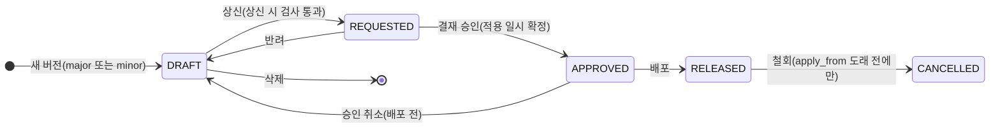
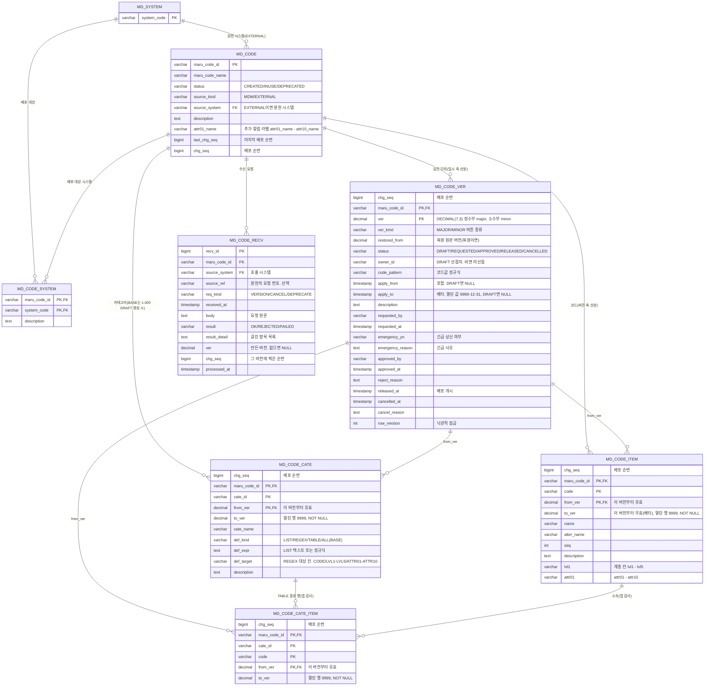

# 마루 MDM 설계: 마스터코드 관리

> 마루 코드마다 원장을 정하는 마스터코드의 모델·버전·승인·배포·판정 규칙. 도메인 참조는 `02-term-domain-column.md`, 룰은 `06-business-rule.md`, 공통 원칙은 `01-mdm-overview.md`.
>
> **배포 방식이 다른 같은 범위의 설계서가 둘이다.** 이 문서는 **변경분 방식**(행마다 배포 순번을 찍고 순번이 큰 행만 보낸다)으로 쓴 것이고, `04-master-code-deploy-full.md`는 **전체 방식**(마루 코드 하나의 배포된 행 전부를 보내고 사본을 통째로 바꾼다)으로 쓴 것이다. 배포 절과 그에 딸린 컬럼이 다르고, 그 여파로 경미 수정의 배포 추적성이 달라진다. 나머지는 두 문서가 같다. 둘 중 하나를 고른 뒤 나머지 하나는 버린다.

## 마스터코드의 위치

| 항목 | 내용 |
| --- | --- |
| 원장 | 마루 코드마다 정한다. MDM이면 MDM 화면에서 생성·검증·승인한다. EXTERNAL이면 원천 시스템이 생성·검증해 수신 API로 보내고 MDM은 검사 없이 저장·배포만 한다(결정 2026-09-09). 여기서 MDM은 역할이며 MDM 역할을 맡은 인스턴스를 뜻한다(01 「한 줄 정의」, 2026-09-10) |
| 마스터데이터와 구분 | 버전관리 여부뿐이다. 원장은 둘 다 마루 코드·마루 데이터마다 정한다(MDM 또는 EXTERNAL). 마스터데이터 쪽은 05 「마스터데이터의 위치」가 정한다(사용자 결정 2026-09-09, 검토서 70번) |
| 도메인 의존 | 없다. 생성·버전·승인·배포·폐기 어디에도 도메인이 끼어들지 않는다 |
| 참조 방향 | 도메인 → 마스터코드(카테고리) 한 방향뿐. 코드 종류 도메인은 검증식 없이 코드 참조만 두고, 자식 도메인의 참조가 부모 참조를 대체한다. 자세한 규칙은 02가 정한다 |
| 활용처 영향 | 코드 변경·폐기가 도메인·컬럼에 미치는 영향은 시스템이 검사하지 않는다. 업무 검토로 다룬다 |
| 범위 밖 | 채번(고객마스터 등). 따로 구현하고 방안은 향후 정한다(결정 2026-09-09) |

## 구조: 마루 코드 → 버전 · 코드 · 카테고리

```
MD_CODE            마루 코드. PROC_CD, PRD_NM_CD ...
  ├ MD_CODE_VER          버전 1.000, 1.001, 2.000 ... 승인 단위. 일시 축 선분 apply_from-apply_to
  ├ MD_CODE_ITEM         코드값 정의 + 계층 칸 lvl1-lvl5 + 추가 컬럼 attr01-attr10. 행마다 버전 축 선분 from_ver-to_ver
  └ MD_CODE_CATE         카테고리 = 명명된 부분집합. 행마다 from_ver-to_ver
      └ MD_CODE_CATE_ITEM  TABLE 종류일 때만: 카테고리에 속한 코드 행. 행마다 from_ver-to_ver
```

버전은 승인 단위다. 코드·카테고리·항목은 버전마다 복사하지 않고 행마다 선분을 갖는다.

| 항목 | 규칙 |
| --- | --- |
| 선분 | `from_ver`(포함) - `to_ver`(배타). 둘 다 NOT NULL. 열린 행은 `to_ver = 9999` |
| 버전 V의 모습 | `from_ver <= V AND V < to_ver`인 행 |
| 판정 | 두 단계. 기준 일시로 버전 V를 찾고, V로 행을 거른다 |
| 복사 | 없다. 카테고리만 바꾼 버전은 카테고리 행만 갖는다 |
| 사본 | 원장과 같은 행 구조·같은 필터를 쓴다. `MASTER`의 결정성이 유지된다 |
| 선분을 갖는 것 | 코드, 카테고리, 카테고리 항목 |
| 버전의 속성 | 코드값 패턴(`code_pattern`) |
| 버전 밖 | 마루 코드 자체(이름·상태·배포 대상·추가 컬럼 라벨) |

**행 조작**(DRAFT V에서)

| 조작 | 결과 |
| --- | --- |
| 추가 | 새 행 `from_ver = V, to_ver = 9999` |
| 수정 | 옛 행을 `to_ver = V`로 닫고, 새 행을 `from_ver = V`로 넣는다 |
| 삭제 | 옛 행을 `to_ver = V`로 닫는다 |
| V에서 두 번 고치기 | `from_ver = V` 행을 직접 갱신한다. 한 버전 안에 같은 키의 행은 하나뿐이다 |
| V의 diff | `from_ver = V` 또는 `to_ver = V`인 행 |

**행 되돌리기**(DRAFT V의 변경 하나를 취소)

| 무엇을 취소하나 | 처리 |
| --- | --- |
| 추가 | `from_ver = V` 행을 지운다 |
| 수정 | `from_ver = V` 행을 지우고, `to_ver = V`였던 옛 행을 9999로 되돌린다 |
| 삭제 | `to_ver = V`를 9999로 되돌린다 |

- 취소한 키는 V의 diff에서 사라진다.
- V에서 추가·수정한 행(`from_ver = V`)을 다시 삭제하면 **닫지 않고 지운다.** 닫으면 빈 구간 행이 생겨 diff에 추가와 삭제가 함께 보인다.
- 수정한 뒤 삭제한 경우는 옛 행이 `to_ver = V`로 닫힌 채 남는다. 되돌리기와 달리 9999로 열지 않는다.
- 닫는 조작은 이전 버전의 행에만 한다.
- 같은 키의 구간은 겹치지 않는다. 삭제 뒤 다시 추가하면 빈 구간은 생길 수 있다.
- DRAFT 행은 `from_ver = V`라 RELEASED 조회에 섞이지 않는다.
- 새 행의 `to_ver`는 항상 9999다. 미적용 버전이 하나뿐이라 같은 키에 V보다 큰 from_ver가 있을 수 없다. "다음 from_ver를 찾는" 규칙이 필요 없다.
- **철회·DRAFT 삭제**로 버전 V가 사라지면 `from_ver = V` 행을 지우고 `to_ver = V`였던 행을 9999로 되돌린다. 반려와 승인 취소는 버전이 남으므로 행을 건드리지 않는다.

**식별자**

| 항목 | 규칙 |
| --- | --- |
| 이름 | `maru_code_id`, `maru_code_name`. 룰은 `maru_rule_id`, 마스터데이터는 `maru_data_id`. 코드값 컬럼은 `code` |
| 종류 구분 컬럼 | 두지 않는다. 종류가 이름에 담긴다 |
| 문자 제약 | maru_code_id·cate_id에 점(.)·공백·콤마를 쓸 수 없다. 컬럼 물리명 규칙과 같다. `MASTER`·`CODE_LIST`의 인자로 그대로 쓴다. 저장 시 검사 |
| 이름 공간 | maru_code_id는 마루 데이터 ID(MD_DATA.maru_data_id)와 한 이름 공간이다. `MASTER`의 첫 인자가 ID로 코드·데이터를 가르기 때문이다. 등록할 때 MD_DATA에 같은 ID가 있으면 거부한다. 저장 시 검사(2026-09-08). 인스턴스가 여럿이어도 전역 유일은 요구하지 않는다. 사본이 ID마다 원장을 기억해 다른 원장의 같은 ID를 거부한다(05 「그 밖의 규칙」 다른 원장의 같은 ID, 사용자 결정 2026-09-09, 검토서 68번) |

**원천**

마루 코드마다 원천을 하나 정한다. 입력은 그 원천에서만 받는다(결정 2026-09-08).

| 항목 | 규칙 |
| --- | --- |
| `source_kind` | `MDM` 또는 `EXTERNAL`. 마루 코드를 만들 때 정하고 바꾸지 않는다 |
| `source_system` | EXTERNAL이면 필수. MD_SYSTEM FK. 수신 API는 이 시스템만 부를 수 있다 |
| 원천이 아닌 쪽의 저장 | 거부한다. EXTERNAL 마루 코드는 MDM 화면에서 조회 전용이다. MDM 마루 코드는 수신 API가 받지 않는다 |
| 정의도 원천 몫 | 이름·설명·추가 컬럼 라벨·카테고리 정의·배포 대상 시스템까지 원천 시스템이 보낸다. 마스터데이터는 정의를 MDM 담당자가 편집하므로(05 「구조」의 원천 표) 이 점이 다르다 |

**카테고리 참조 무결성**은 DB FK 대신 세 장치로 지킨다. 검증식으로는 콤보 목록을 만들 수 없으므로 부분집합에 이름을 붙여 두고 활용처가 그 이름으로 참조한다.

| 장치 | 내용 |
| --- | --- |
| 1. 소속 | 카테고리는 마루 코드 안에서만 정의한다. MD_CODE_CATE.maru_code_id가 MD_CODE FK이고 BASE는 예약이다 |
| 2. 항목 | 카테고리에 속한 코드는 저장 시와 상신 시 검사 2항에서 앱이 그 버전 유효성을 검사한다. CATE_ITEM은 카테고리 행·코드 행과 from_ver가 달라 FK를 걸 수 없다 |
| 3. 활용처 | 도메인의 cate_id는 도메인 저장 시 RELEASED 버전에 유효한 카테고리인지 검사한다(`../detail/db-term-domain.md`) |

마루 코드마다 예약 카테고리 `BASE`(전체)가 있다. 최초 DRAFT(1.000)를 만들 때 `from_ver = 1.000`으로 자동 생성된다. 마루 코드를 만드는 순간에는 VER 행이 없어 from_ver FK가 성립하지 않기 때문이다.

## 계층과 다목적 분류

계층은 코드 행의 `lvl1`-`lvl5`가 담고, 다목적 분류는 카테고리가 담는다(결정 2026-09-08). 계층을 카테고리로 표현하던 방식은 버린다. 카테고리는 계층을 가로지르는 임의 집합만 맡으므로, "주요 공정"처럼 여러 단계의 코드를 함께 묶는 분류가 카테고리다. 한 마루 코드에 카테고리를 여러 개 두고 같은 코드가 여러 카테고리에 속하는 것은 그대로다.

행은 고를 수 있는 최종 코드만 둔다. 그룹, 즉 중간 노드는 행이 아니라 칸의 값이다. 코드 KS-3-CGCC의 행은 `lvl1`이 `KS`, `lvl2`가 `KS-3`이고 `lvl3` 이하는 NULL이며 KS와 KS-3의 행은 없다. 마지막 단계는 코드 자체이므로 자기 코드를 칸에 적지 않는다.

| 항목 | 규칙 |
| --- | --- |
| 칸 | `lvl1`-`lvl5`. VARCHAR이고 NULL을 허용한다. 화면 라벨은 "1차"-"5차"다 |
| 깊이 | 행마다 다르다. 마루 코드마다 단수를 고정하지 않으므로 한 코드 세트 안에 2단·3단·4단이 섞인다. 깊이는 채운 칸 수에 1을 더한 값이고 최대 6단이다. 6단을 넘는 체계는 마루 코드를 나눈다 |
| 그룹 값 | 마루 코드 안에서 유일하다. 관례로 부모 값에 구분자를 붙여 지어서 KS에서 KS-3으로, KS-3에서 KS-3-CGCH로 내려간다. 강제하는 것은 유일성뿐이고 짓는 방식은 관례다. 유일하기 때문에 마지막에 고른 값 하나로 다음 단계를 뽑을 수 있고, REGEX 카테고리도 칸 하나로 부분 트리를 잡는다 |
| 값 제약 | 콤마와 공백을 쓸 수 없다. LIST 텍스트와 CSV의 구분자와 부딪히기 때문이다. 그 밖은 자유다. 코드이자 그룹인 값은 그 코드의 행이 `code_pattern`을 따르므로 따로 정하지 않는다 |
| 코드이자 그룹인 노드 | 그 코드의 행이 있고 그 행의 칸에는 부모까지만 적히며, 자손 행의 칸에 같은 값이 나타난다. 같은 문자열은 같은 노드이므로 새 플래그도 새 표도 두지 않는다 |
| 버전 | 계층 칸은 MD_CODE_ITEM 행의 값이라 선분 규칙 from_ver-to_ver를 그대로 따른다. 칸 값을 바꾸면 이름을 바꿀 때처럼 새 버전에서 옛 행을 닫고 새 행을 만든다 |
| 저장 검사 | 두 가지다. 첫째로 중간 칸이 비면 거부하므로 `lvl_n`에 값이 있으면 `lvl_1`부터 `lvl_(n-1)`까지 모두 값이 있어야 한다. 둘째로 같은 문자열이 그룹 값으로든 코드값으로든 이미 있으면 그 행의 앞 칸이 내 앞 칸과 같아야 하고, 다르면 거부한다. 조상 행이 있는지는 검사하지 않는다. 그룹은 행이 아니기 때문이다. 두 검사 모두 그 버전에 유효한 행을 기준으로 본다 |

그룹에는 이름이 없고 값이 그대로 보인다. 이름이 필요한 그룹은 그 값으로 코드 행을 두면 코드이자 그룹인 노드가 된다.

**보기**로 강종 규격 마루 코드 STEEL_STD를 든다. 한 코드 세트 안에 2단·3단·4단이 섞여 있고, KS-3-CGCH는 코드이자 그룹이다.

| code | name | seq | lvl1 | lvl2 | lvl3 | 깊이 |
| --- | --- | --- | --- | --- | --- | --- |
| KS-9 | 규격 외 KS | 9 | KS | | | 2단 |
| KS-3-CGCC | CGCC | 1 | KS | KS-3 | | 3단 |
| KS-3-CGCD | CGCD | 2 | KS | KS-3 | | 3단 |
| KS-3-CGCH | CGCH(기본) | 3 | KS | KS-3 | | 3단, 그룹이기도 하다 |
| KS-3-CGCH-Z12 | CGCH Z12 | 1 | KS | KS-3 | KS-3-CGCH | 4단 |
| KS-3-CGCH-Z27 | CGCH Z27 | 2 | KS | KS-3 | KS-3-CGCH | 4단 |
| JIS-3-CGCC | CGCC(JIS) | 1 | JIS | JIS-3 | | 3단 |
| JIS-4-SPCC | SPCC | 1 | JIS | JIS-4 | | 3단 |

lvl4와 lvl5는 모두 NULL이다. 이 여덟 행을 트리로 펼치면 이렇게 보인다.

```
▸  JIS
   ▸  JIS-3
       · JIS-3-CGCC  (CGCC(JIS))
   ▸  JIS-4
       · JIS-4-SPCC  (SPCC)
▸  KS
    · KS-9  (규격 외 KS)
   ▸  KS-3
       · KS-3-CGCC  (CGCC)
       · KS-3-CGCD  (CGCD)
      ▸· KS-3-CGCH  (CGCH(기본))
          · KS-3-CGCH-Z12  (CGCH Z12)
          · KS-3-CGCH-Z27  (CGCH Z27)
```

`▸`는 펼칠 수 있음이고 `·`는 고를 수 있음이다. KS-3-CGCH만 둘 다인데, 자기 행의 lvl3이 비어 있으면서 자손 두 행의 lvl3에 같은 값이 적혀 있기 때문이다. 콤보와 트리를 만드는 쿼리는 아래 「판정 참고 구현(사본 쿼리)」의 계층 콤보와 트리 소절에 있다.

| 하지 않는 것 | 대신 |
| --- | --- |
| 코드 확장 속성 테이블(EAV) | 개체 고유의 고정 사실은 추가 컬럼 `attr01`-`attr10`에 둔다(아래 「추가 컬럼」). 조건에 따라 달라지는 값은 업무기준(룰)이다 |
| 상위 코드 자기 참조 | 계층 칸 lvl1-lvl5. 그룹은 행이 아니라 값이다 |

코드 테이블이 갖는 것은 코드값·이름·약칭·순서·설명과 계층 칸 다섯 개, 추가 컬럼 열 개다.

## 추가 컬럼

코드 행에 문자열 컬럼 `attr01`-`attr10`을 고정으로 둔다. 어느 번호를 어떤 뜻으로 쓰는지는 마루 코드 행의 라벨 칸 `attr01_name`-`attr10_name`이 말한다(결정 2026-09-09). 정의 표는 두지 않는다. 마스터데이터의 추가 컬럼(05 「추가 컬럼」)과 같은 모양이고, 고정 컬럼으로 가는 근거는 05 「고정 컬럼으로 간다」에 있다.

| 항목 | 규칙 |
| --- | --- |
| 라벨 | `MD_CODE.attr01_name`-`attr10_name`. NULL 허용. 라벨이 있는 번호만 쓰는 칸이다. 화면의 열 머리와 CSV·API 안내에 쓴다 |
| 라벨 없는 칸 | 값이 오면 거부한다(「승인 시 검사」 7항) |
| 값 | 문자열 그대로 저장한다. `VARCHAR(500)`. 유형·필수·정규식 검사는 없다. 값의 형식은 원천이 지킨다. 입력은 원천에서만 받기 때문이다 |
| 번호로 다룬다 | 화면·API·CSV·`MASTER()`의 `attr` 인자 모두 `attr01` 같은 번호다. 논리 키 층은 두지 않는다 |
| 값의 버전 | 값은 코드 행에 있으므로 선분 규칙 from_ver-to_ver를 그대로 따른다. 값을 바꾸면 이름을 바꿀 때처럼 새 버전에서 옛 행을 닫고 새 행을 만든다. 경미 수정이 아니다 |
| 라벨의 버전 | 없다. 라벨은 마루 코드 행의 값이라 버전 밖이다. 경미 수정과 같은 경로로 결재 없이 고치고, 저장하면 MD_CODE 행에 배포 순번을 찍는다 |
| 라벨 지우기 | 라벨을 NULL로 하면 그 칸은 새 버전에서 값을 받지 않는다. 옛 버전의 값은 그대로 남는다. 지운 번호를 다른 뜻으로 다시 쓰면 옛 값이 새 뜻으로 읽히므로 새 뜻은 빈 번호에 붙인다 |
| 원천이 EXTERNAL | 라벨도 원천이 요청에 담아 보낸다(「수신 API」). 요청이 통과하면 MD_CODE의 라벨을 요청 값으로 바꾼다 |
| 카테고리 | REGEX 카테고리의 대상 칸으로 쓸 수 있다. `def_target`이 ATTR01-ATTR10이다 |
| 룰에서 읽기 | `MASTER(id, cate, key, "attr01")`이 평가 시각의 버전에 유효한 행의 값을 문자열로 돌려준다. 시각을 식 안에서 정하려면 `MASTER_AT(id, cate, key, base_dt, "attr01")`이다(05 「조회 함수와 사본 조회 API」) |

코드와 데이터를 가르는 것은 속성이 아니라 생성·배포 방식이다. 코드는 버전을 달고 승인·적용 시점을 거치며 이력이 중요하고, 데이터는 저장 즉시 유효하다(05 「마스터코드와 마스터데이터의 구분」). 값을 어디에 둘지는 이렇게 가른다. 조건에 따라 달라지는 값은 업무기준(룰)이고, 개체 고유의 고정 사실은 코드든 데이터든 추가 컬럼이다. 공정별 시간당 생산량은 룰이고, 강종 규격의 인장강도는 코드의 추가 컬럼이다.

## 카테고리 정의 방식

| def_kind | 정의 위치 | 화면 | 쓰는 경우 |
| --- | --- | --- | --- |
| LIST | `def_expr`에 코드값을 콤마로 열거한 텍스트 | 코드를 체크하면 "카테고리에 적용"이 텍스트를 만든다 | 코드 수가 적고 한 칸에서 읽혀야 할 때. 코드 추가 시 직접 갱신 |
| REGEX | `def_expr`에 정규표현식 하나. 대상 칸은 `def_target`(CODE 또는 LVL1-LVL5 또는 ATTR01-ATTR10, 기본 CODE) | 매칭 열은 읽기 전용, 체크 불가 | 코드값 패턴으로 부분집합을 잡을 때. 코드 추가 시 자동 편입 |
| TABLE | MD_CODE_CATE_ITEM 행 | 체크하면 "카테고리에 적용"이 행을 저장 | 대량 집합, 참조 무결성이 필요할 때. 코드 추가 시 직접 갱신 |
| ALL | 정의 없음. 그 버전의 코드 전체 | 편집·삭제 불가(화면·서버 모두) | 예약 카테고리 BASE 전용 |

**해석**(카테고리 → 코드 목록). 서버에서만 한다. 원장 서버와 사본 서버가 같은 Java 해석기를 쓰고 화면은 결과 목록만 받는다. 화면은 정규식을 실행하지 않는다.

| 종류 | 해석 |
| --- | --- |
| LIST | 콤마로 나누고 앞뒤 공백을 잘라 낸 뒤, 그 버전에 유효한 코드와 교집합. 텍스트에 있어도 그 버전에 없는 코드는 나오지 않는다 |
| REGEX | 그 버전에 유효한 코드 행마다 `def_target` 칸의 값에 전체 일치로 대조한다. 칸이 NULL이면 불일치다. 서버의 Java `java.util.regex`만 쓴다. `Pattern.compile(expr).matcher(value).matches()` |
| TABLE | 그 버전에 유효한 CATE_ITEM 행을 읽되, 항상 그 버전에 유효한 코드와 조인해 닫힌 코드를 걸러낸다 |
| ALL | 그 버전에 유효한 코드 전체 |

어느 종류든 결과는 그 버전에 유효한 코드의 부분집합이다.

| 항목 | 규칙 |
| --- | --- |
| 유효한 코드 | `from_ver <= V < to_ver`인 MD_CODE_ITEM 행이 있는 코드. 그것뿐이다 |
| 사용 여부 컬럼 | 두지 않는다. 코드를 못 쓰게 하는 방법은 행 닫기 하나다. 행 닫기도 버전을 거치므로 별도 표시가 있으면 같은 일을 하는 장치가 둘이 된다 |
| 닫힌 코드 | diff 보기와 코드 편집의 "닫힌 코드 보기"에서만 보인다 |
| LIST 텍스트 작성 | 화면이 만든다. 담당자가 코드를 체크하면 프로그램이 콤마 텍스트를 만들어 저장한다. 직접 치는 입력란은 두지 않는다 |
| LIST 저장 검사 | 서버가 각 코드값이 그 버전에 유효한지 보고, 아니면 거부한다. 오타·이관·API 직접 호출 대비 |
| REGEX 저장 검사 | `Pattern.compile`로 문법을 검사한다 |
| REGEX 대상 칸 | `def_target`이 정한다. 대상 칸이 NULL이면 불일치다 |
| 정규식 제한 | 길이·중첩 깊이·실행 시간 제한을 두지 않는다. 해석은 저장·상신 시 검사와 사본 캐시 적재에서 한 번씩만 돈다 |
| CATE_ITEM | TABLE 전용. LIST·REGEX는 행을 만들지 않는다 |
| DRAFT 편집 중 | 코드를 고치면 서버가 재해석해 내려주고 화면이 매칭 열을 갱신한다 |
| 활용처 참조 | `maru_code_id` + `cate_id` 두 값. 카테고리 ID는 버전을 넘어 유지되므로 버전을 적지 않는다 |

**LIST 텍스트 파싱**

| 항목 | 규칙 |
| --- | --- |
| 구분자 | 콤마 하나. 각 항목의 앞뒤 공백은 잘라 낸다 |
| 빈 항목 | `1P,,82`처럼 빈 항목이 있으면 저장을 거부한다 |
| 중복 | 저장 시 제거한다. 순서는 코드 seq 순으로 정규화한다 |
| 대소문자 | 코드값 그대로 비교한다 |
| 코드값 제약 | 코드값에 콤마·공백이 있으면 `code_pattern`과 무관하게 저장을 거부한다. 파싱이 깨지기 때문이다 |

**코드 추가 시 카테고리 유지 책임**

| 종류 | 새 코드 |
| --- | --- |
| REGEX | 패턴에 맞으면 자동 편입 |
| LIST·TABLE | 자동으로 들어가지 않는다. 담당자가 직접 넣는다 |

코드 편집 화면은 새 코드를 저장한 뒤 카테고리별 매칭 여부를 보여 준다. 카테고리 종류를 고를 때 "앞으로 추가될 코드도 자동으로 들어와야 하는가"가 REGEX를 택하는 기준이다.

**콤보 목록**은 검증과 같은 규칙으로 버전을 고른다. 검증은 작년 버전으로 하는데 콤보만 올해 버전을 보여 주는 어긋남을 막기 위해서다.

| 항목 | 규칙 |
| --- | --- |
| 함수 | `CODE_LIST`. 같은 이름으로 두 형태를 둔다 |
| `CODE_LIST("<마루 코드>", "<카테고리>")` | 현재 시각 기준 |
| `CODE_LIST("<마루 코드>", "<카테고리>", base_dt)` | 그 기준일 기준 |
| 버전 선택 | 레코드에 기준일이 있으면 그 기준일의 버전을 쓰고, 없으면 현재 시각의 버전을 쓴다 |
| 소급 | 버전 소급·카테고리 소급 모두 `MASTER`와 같다 |
| 사본 캐시 키 | (마루 코드, 카테고리, 버전) |

## 버전 상태와 적용시점

| 대상 | 상태 |
| --- | --- |
| 마루 코드 | CREATED → INUSE → DEPRECATED |
| 버전 | DRAFT → REQUESTED → APPROVED → RELEASED, 그리고 CANCELLED |



**마루 코드 상태**

| 전이 | 조건 |
| --- | --- |
| CREATED → INUSE | 첫 RELEASED 버전의 apply_from이 지나면 자동 전이. 그 전까지는 CREATED이며 화면에 "배포 대기 v1.000"을 함께 보인다 |
| → DEPRECATED | 미적용 버전이 없을 것 |
| 되돌리기 | 없다. INUSE·DEPRECATED에서 앞 상태로 돌아가지 못한다 |

INUSE가 된 뒤 RELEASED 버전이 없어지는 일은 없다. 철회가 apply_from 전에만 되기 때문이다.

**버전 상태**

| 상태 | 뜻 |
| --- | --- |
| DRAFT | 편집·삭제 가능한 유일한 상태. 소유자만 한다(08 「DRAFT 정책」) |
| REQUESTED | 상신되어 결재 대기. 편집 불가 |
| APPROVED | 적용 일시 확정, 배포 대기 |
| RELEASED | MDM이 배포를 개시했고 내용이 확정(불변). 시스템별 도달·적용은 각 시스템 책임 |
| CANCELLED | 적용 전에 철회한 버전. 불변이며 판정에 쓰지 않는다 |

**버전 번호**

| 항목 | 규칙 |
| --- | --- |
| 타입 | DECIMAL(7,3) 컬럼 하나. 정수부 major, 소수부(× 1000) minor. 부동소수점 타입은 쓰지 않는다 |
| major 버튼 | `floor(가장 큰 ver) + 1`. 1.007 → 2.000 |
| minor 버튼 | `가장 큰 ver + 0.001`. 1.007 → 1.008 |
| "가장 큰 ver" | CANCELLED 버전도 포함한다. CANCELLED 행이 PK로 남아 번호를 재사용할 수 없다 |
| 표시 | 소수부 세 자리를 그대로. "v1.008", "v2.000". 줄이면 v1.10이 v1.001과 눈으로 구분되지 않고 문자열 정렬에서 섞인다 |
| 정렬 | 항상 `ver` 값으로 |
| minor 상한 | 999. 999이면 minor 버튼을 비활성으로 하고 "major를 올리십시오"를 안내한다. minor 버튼이 major 번호를 만드는 일은 없다 |
| major 상한 | 9999는 발급하지 않는다. 열린 행의 `to_ver = 9999`와 겹치지 않게 하기 위해서다 |
| 종류 기록 | `ver_kind`(MAJOR·MINOR). v2.000 철회 뒤 minor를 누르면 v2.001이 되어 번호만으로는 종류를 알 수 없기 때문이다 |
| DRAFT 삭제 | VER 행이 없어지므로 그 번호는 다시 쓰인다. 1.000을 지우면 BASE 행도 함께 없어지고, 1.000을 다시 만들 때 BASE도 다시 만든다 |

major는 담당자가 코드 체계 개편으로 보는 변경, minor는 그 밖의 변경이다. **어느 쪽을 누를지는 담당자 판단이며 시스템이 강제하지 않는다.** 코드 닫기 같은 축소 변경도 minor일 수 있다. 데이터 처리와 배포 경로는 같고, 차이는 번호·`ver_kind`·리드타임 설정값뿐이다.

**한 번에 하나.** 미적용 버전(DRAFT·REQUESTED·APPROVED, apply_from이 오지 않은 RELEASED)이 하나라도 있으면 새 버전을 만들 수 없다. 마루 코드당 미적용 버전은 최대 하나이고, 번호를 끼워 넣는 일이 없으며, ver 순서와 apply_from 순서가 저절로 같다.

| 상황 | 처리 |
| --- | --- |
| 미래 RELEASED가 있는데 고칠 것이 생김 | 적용일까지 기다려 다음 버전에서 고친다. 미래 버전은 리드타임만큼만 앞서므로 기다리는 기간은 짧다 |
| 기다릴 수 없음 | 미래 버전을 철회하고 새로 만든다. 철회한 행을 되살리는 기능은 없다 |
| DRAFT·REQUESTED·APPROVED가 있음 | 그 버전 안에서 고치거나, 반려·승인 취소로 DRAFT로 돌려 고친다 |
| 이름·설명 오타 | 버전 없이 고친다(경미 수정 절) |

**미적용 버전이 둘이 생겼을 때.** 서버는 새 버전을 만들기 직전에 미적용 버전이 있는지 다시 검사해 거부한다. 시차를 두고 누르면 두 번째 요청이 여기서 막힌다. 검사와 insert 사이의 틈만 DB로 막지 않는다. 같은 버튼이면 번호가 같아 PK가 막으므로, major와 minor를 동시에 눌렀을 때만 둘이 생긴다.

| 미적용 버전 2개일 때 | 처리 |
| --- | --- |
| 허용 | DRAFT 삭제, 조회 |
| 거부 | 코드·카테고리·항목 저장, 새 버전 생성, 상신, 승인, 승인 취소, 배포, 철회, 경미 수정 |
| 화면 | "미적용 버전이 2개입니다. 하나를 삭제하세요" |

새 DRAFT는 빈 상태로 생기고 저장이 막히므로 둘 다 끝까지 비어 있다. 어느 쪽을 지워도 잃는 것이 없다. 부분 유니크 인덱스나 행 잠금은 두지 않는다.

**DRAFT 소유자.** DRAFT는 한 번에 한 사람이 선점하고 고친다(결정 2026-09-07, 08 「DRAFT 정책」). 새 버전을 만든 사람이 자동으로 선점해 `owner_id`가 된다. 저장·상신·삭제·해제·넘기기는 소유자만 한다. 다른 사용자는 읽기만 한다. 소유자는 작업을 마치면 선점을 해제하고, `owner_id`가 비어 있으면 담당자 권한이 있는 사람이 선점한다. 해제는 소유자만 하고 강제로 넘기는 관리자 역할은 없다(결정 2026-09-09). 소유자는 받을 사람을 골라 소유권을 바로 넘길 수도 있다. 버전 목록은 미적용 버전의 소유자를 함께 보인다(「화면」).

**DRAFT 동시 편집**은 소유자 한 사람이 창을 둘 열었을 때 생긴다. `row_version`(정수) 낙관적 잠금으로 막는다. 화면이 DRAFT를 열 때 값을 받아 두고 저장 때 함께 보낸다. 서버는 값이 같을 때만 저장하고 1 올린다. 다르면 "다른 사용자가 수정했습니다. 다시 불러오세요"로 거부한다. 상태 전이도 같은 검사를 거친다.

**이전 버전으로 복원.** 이미 적용된 버전은 철회할 수 없다. 옛 버전으로 돌아가려면 새 버전을 만들어 내용을 옛 버전과 같게 채운다. 옛 버전 행을 다시 열지는 않는다. 버전 하나가 적용 구간 하나를 갖고, 사본은 ver 오름차순으로만 적용하며, 그 사이 기간의 판정 이력도 남아야 하기 때문이다.

| 항목 | 규칙 |
| --- | --- |
| 조작 | 새버전 버튼에서 "vX.YYY 내용으로 채우기"를 고른다 |
| 채우는 방법 | 서버가 옛 버전과 현재 버전에 유효한 행을 키마다 비교해 차이만 만든다 |
| 옛 버전에만 있던 행 | 그 값으로 `from_ver = V` 행 추가(빈 구간 허용) |
| 현재에만 있는 행 | `to_ver = V`로 닫음 |
| 값이 다른 행 | 닫고 새 행 |
| 같은 행 | 두지 않는다 |
| 대상 | 코드·카테고리 정의·CATE_ITEM·`code_pattern` 전부 |
| 여러 버전 거슬러 갈 때 | 비교는 두 버전 사이에서만. 중간 버전 수는 상관없다 |
| 그 뒤 | 보통 DRAFT와 같다. 더 고칠 수 있고 상신·승인·배포·하한이 그대로 적용된다 |
| 기록 | `restored_from`에 원본 버전 번호. 버전 목록에 "v1.001 복원" |
| 부분 복원 | 없다. 카테고리 하나만 되돌리지 못한다 |
| 데이터 | 건드리지 않는다. 복원 버전 적용 전 기준일의 레코드는 그때 쓰던 버전으로 판정된다 |

**적용 구간**

| 항목 | 규칙 |
| --- | --- |
| 타입 | `apply_from`(포함) - `apply_to`(배타), timestamp. 초 단위 |
| 시간대 | MDM 기본 시간대(KST) 하나로 고정 |
| DRAFT·반려 | 둘 다 NULL |
| 상신 | 희망 apply_from을 적는다 |
| 승인 | 새 버전 apply_to를 `9999-12-31 00:00:00`으로 열고, **직전 유효 버전의 apply_to를 새 버전의 apply_from으로 닫는다** |
| 구간 | 같은 마루 코드 안에서 겹치지 않고 빈틈도 없다 |
| 배포 지연 | 원장은 닫혀 있고 사본은 열려 있는 기간이 생긴다. 시스템마다 도달 시각이 달라 사본끼리도 어긋나므로 감수한다 |

**적용시점 하한**: `apply_from >= max(직전 유효 버전의 apply_from + 최소 간격, 상신 일시 + 배포 리드타임)`

| 항목 | 규칙 |
| --- | --- |
| 설정값 | 최소 간격과 배포 리드타임은 시스템 설정값(기본 1일). major용 값을 따로 둘 수 있다 |
| 목적 | 상신 당일 적용을 막고, 시스템마다 도달 시각이 달라도 같은 일시에 함께 바뀌게 한다 |
| 긴급 | 상신자가 긴급 사유를 적어 리드타임 0을 요청하고, 결재자가 승인으로 받아들인다. 사유가 없으면 상신이 막힌다. 낮추는 것은 리드타임뿐이고 최소 간격은 그대로 지킨다 |
| 최초 버전 | 하한을 적용하지 않고 과거 일시도 허용한다. 예전부터 쓰던 코드를 처음 올릴 때 실제 사용 시작 시점을 적기 위해서다 |
| 검사 시점 | 상신 시 한 번뿐 |

**늦은 결재·늦은 배포**

| 상황 | 처리 |
| --- | --- |
| 승인·배포 시 apply_from이 이미 지남 | 경고만 띄우고 그대로 배포한다 |
| 사본 | 받는 순간 직전 버전을 apply_from으로 소급해 닫고, 새 버전을 apply_from부터 적용한다 |
| 그 사이 저장된 데이터 | 정합성 점검 배치가 다시 검증한다(`02-term-domain-column.md`) |
| 배포 전 기간 | 원장의 현재 버전 조회 결과가 빈다. 화면은 "배포 대기 v2.000"으로 표시한다 |

**되돌리기와 철회**

| 전이 | 처리 |
| --- | --- |
| 반려(REQUESTED → DRAFT) | apply_from·requested_by·requested_at을 비우고 reject_reason을 남긴다. 행은 그대로 두어 고쳐 다시 상신한다 |
| 승인 취소(APPROVED → DRAFT, 배포 전) | 반려와 같고, 승인 때 닫았던 직전 유효 버전의 apply_to를 다시 `9999-12-31 00:00:00`으로 연다 |
| 철회(RELEASED → CANCELLED) | apply_from 전에만 가능. `from_ver = V` 행을 지우고 `to_ver = V`였던 행을 9999로 되돌리며, 직전 유효 버전의 apply_to를 다시 연다. CANCELLED 상태와 되돌린 to_ver를 사본에 배포하고, 사본은 CANCELLED VER를 보고 그 버전에서 시작한 행을 스스로 지운다. 번호는 재사용하지 않는다 |

- 반려·승인 취소는 배포 전이므로 사본에 영향이 없다.
- 결재 정보는 VER 행의 마지막 값만 남긴다. 상신·반려가 반복되면 최종 상신자·결재자·마지막 반려 사유만 남고 별도 이력 테이블은 없다.
- apply_from이 지난 RELEASED는 철회할 수 없다. 이미 그 버전으로 검증·저장된 데이터가 있을 수 있다. 되돌리려면 새 버전을 만든다.
- apply_from 전이면 철회 기한은 두지 않는다. 철회가 늦게 닿아 사본이 그 사이 철회한 버전으로 판정했더라도 MDM은 다시 보지 않는다. 정리는 각 시스템 책임이다.

**변경 묶음은 두지 않는다.** 마루 코드 여러 개를 함께 바꿀 때도 마루 코드마다 따로 상신·승인·배포한다. 같은 apply_from이 필요하면 담당자가 맞춘다. 한쪽이 반려되어 다른 쪽만 적용되는 경우는 감수한다.

**사본의 버전 선택과 소급**

| 항목 | 규칙 |
| --- | --- |
| 함수 | `MASTER("<마루 코드>", "<카테고리>", key)`와 `MASTER_AT("<마루 코드>", "<카테고리>", key, base_dt)`. 마스터데이터 조회 함수와 이름이 같다(2026-09-08, 구 `CODE_EXISTS`. 시각 인자는 2026-09-09에 `MASTER_AT`로 나눴다). 첫 인자의 ID로 마루 코드·마루 데이터를 가른다. 시그니처는 05 「조회 함수와 사본 조회 API」, 마루 코드 판정 규칙은 02 제약 관리 절 |
| 버전 선택 | `apply_from <= base_dt < apply_to`인 RELEASED 버전 하나. 구간이 겹치지 않고 끝을 포함하지 않아 정확히 하나다 |
| base_dt 타입 | 초 단위. `MASTER`면 엔진의 평가 시각이고 `MASTER_AT`면 넷째 인자다. 일자 타입이면 그날 00:00:00으로 본다 |
| 행 필터 | `from_ver <= V < to_ver` |
| 버전 소급 | base_dt가 최초 버전의 apply_from보다 앞이면 최초 RELEASED 버전(CANCELLED 제외)을 쓴다. "그때는 코드가 없었다"보다 최초 정의로 판정하는 편이 실무에 맞다 |
| 카테고리 소급 | 버전 V에 카테고리 행이 없고 최초 from_ver가 V보다 뒤이면, 처음 정의한 버전의 정의를 V의 코드에 적용한다. 나중에 이름 붙인 카테고리로 옛 기준일을 검증할 수 있게 하기 위해서다 |
| 닫힌 카테고리 | `to_ver <= V`이면 false |
| 함수 시그니처 | 05 「조회 함수와 사본 조회 API」가 정한다. 카테고리는 생략할 수 없고 전체는 "BASE"를 적는다. `MASTER`는 엔진의 평가 시각으로, `MASTER_AT`는 넷째 인자로 판정한다(02 제약 관리 절) |

**현재 버전 컬럼은 두지 않는다.** `apply_from <= 현재 일시 < apply_to`인 RELEASED 버전을 조회해 표시한다. 없으면 마지막 RELEASED 버전과 "배포 대기" 표시를 함께 보인다. 시간이 흐르면 저절로 바뀌어야 하는 값을 저장하면 갱신 책임이 생기기 때문이다.

**불변식**: 같은 마루 코드 안에서 ver 순서와 apply_from 순서는 항상 같다(CANCELLED 제외). 이전 버전은 보존한다.

**원천이 EXTERNAL인 마루 코드**(결정 2026-09-08)

원천 시스템이 수신 API로 보낸 버전은 MDM 승인을 받지 않는다. 원천이 이미 확정한 값이기 때문이다. 01 원칙 3(승인 후 배포)의 두 번째 예외이며, 첫 번째 예외는 마스터데이터다. 처리 절차는 아래 「수신 API」가 정한다.

| 항목 | 규칙 |
| --- | --- |
| 상태 | 검사를 통과하면 바로 RELEASED다. DRAFT·REQUESTED·APPROVED를 거치지 않는다 |
| 버전 번호 | MDM이 매긴다. 정수 부분만 하나 올린다. 1.000 다음은 2.000이다 |
| `apply_from` | 요청에 담긴 값을 쓴다. 없으면 수신 시각이다. 이전 버전의 apply_from보다 앞서면 요청을 거부한다 |
| 적용시점 하한 | 상신이 없으므로 보지 않는다. 위 하한 식은 MDM 원천에만 쓴다 |
| 경미 수정 | 없다. 원천이 보내는 것은 전부 새 버전이다. 코드 이름만 바뀐 요청도 새 버전이 된다 |
| 철회 | 원천이 수신 API로 철회 요청을 보낸다. 규칙은 위 「되돌리기와 철회」의 철회와 같다. apply_from 전에만 된다 |
| DRAFT 소유권·넘기기·상신·결재 화면 | 없다 |

## 상신 시 검사

상신(DRAFT → REQUESTED)에서 모두 검사한다. 하나라도 실패하면 상신되지 않는다. **결재자가 승인할 때는 다시 검사하지 않는다.** REQUESTED는 편집할 수 없어 내용이 바뀌지 않기 때문이다. **결재자는 apply_from을 바꾸지 않는다.** 일시를 고치려면 반려한 뒤 다시 상신한다.

| # | 검사 | 실패 시 |
| --- | --- | --- |
| 1 | 이 버전에 유효한 모든 코드값이 `code_pattern`에 전체 일치하고 콤마·공백이 없다 | 거부 |
| 2 | 카테고리를 해석한다. REGEX는 문법을 검사한 뒤 대조한다 | 거부 |
| 2-1 | LIST 텍스트나 CATE_ITEM에 이 버전에 없는 코드가 있다 | 경고. LIST·TABLE은 필터라 없는 코드는 결과에서 빠질 뿐이다 |
| 2-2 | 해석 결과가 빈 카테고리가 있다 | 경고 |
| 3 | 희망 apply_from이 하한 이상이다. 미적용 버전이 하나뿐이라 뒤 버전과 비교할 일은 없다 | 거부. 최초 버전은 건너뛴다 |
| 4 | 직전 RELEASED 대비 추가·닫힘·변경 행이 있거나 code_pattern이 다르다 | 거부. 설명·이름만 고치는 것은 경미 수정으로 한다. 최초 버전은 코드가 없어도 상신할 수 있다 |
| 5 | 배포 대상 시스템이 하나 이상 있다 | 경고 |
| 6 | 계층 칸: 중간 칸이 비었거나, 같은 값의 앞 칸이 다른 행이 있다 | 거부 |
| 7 | 추가 컬럼: 라벨이 없는 번호에 값이 있다 | 거부 |

- 같은 코드값의 구간 겹침은 저장 시 검사한다. PK가 from_ver까지라 PK만으로는 막지 못한다.
- 변경 종류(major·minor)는 검사하지 않는다. 축소 변경이 minor에 있어도 거부하지 않는다.
- **기존 데이터에 미치는 영향은 검사하지 않는다.** 그 데이터는 하위 시스템에 있어 MDM이 볼 수 없다. 재검증은 각 시스템의 업무 영역에서 한다. 결재 화면은 줄어든 카테고리와 빠진 코드를 diff로 보여 주는 데 그친다.
- **수신 시에는 이 표의 검사를 돌리지 않는다.** 원천이 EXTERNAL인 마루 코드는 원천이 생성·수정할 때 검증한다. 받는 쪽인 MDM은 저장할 수 없는 요청만 거부한다(결정 2026-09-09). 무엇을 보는지는 아래 「수신 API」의 거부 조건에 있다.

## 수신 API (원천이 EXTERNAL인 마루 코드)

원천이 EXTERNAL인 마루 코드는 원천 시스템이 정의와 값을 수신 API로 보내고 MDM은 저장·배포만 한다(결정 2026-09-08). 검증은 원천이 생성·수정할 때 하고 받는 쪽은 하지 않는다(결정 2026-09-09).

| 항목 | 규칙 |
| --- | --- |
| 부를 수 있는 시스템 | `source_system`으로 등록된 시스템뿐이다. 호출 시스템은 인증으로 확인한다. 원천이 MDM인 마루 코드는 수신 API가 받지 않는다 |
| 요청 단위 | 요청 1건이 버전 1개다 |
| 요청 내용 | 정의 전체와 값 전체다. 마루 코드 이름·설명·코드값 패턴·추가 컬럼 라벨·카테고리 정의·배포 대상 시스템 목록에 코드 행 전부를 담는다. 코드 행에는 계층 칸(`lvls`)과 추가 컬럼(`attrs`)이 들어간다. 변경분이 아니다. 그래야 MDM이 이전 버전과 비교할 수 있다 |
| 철회 요청 | 원천이 보낸다. 대상 버전과 사유를 담는다 |
| 폐기 요청 | 원천이 보낸다. 마루 코드를 DEPRECATED로 바꾼다 |

**거부 조건**(저장할 수 없는 요청만 거른다. 정의와 값의 내용은 검사하지 않는다. 하나라도 걸리면 요청 전체를 거부한다. 결정 2026-09-09)

```
1. 마루 코드 상태: 모르는 마루 코드 ID면 거부. DEPRECATED면 거부
2. 원천: 호출 시스템 = source_system. source_kind가 MDM이면 거부
3. 요청 형식: 정의·카테고리·코드 행이 다 있어야 한다. 빠지면 거부
4. ID: 마루 코드 ID는 마루 데이터 ID와 한 이름 공간이다. MD_DATA에 같은 ID가 있으면 거부(위 「식별자」, 05 「구조」)
5. apply_from: 요청 값이 이전 버전의 apply_from보다 앞서면 거부. 버전 선택 쿼리가 이 순서에 기대기 때문이다
```

**통과하면**

| 항목 | 규칙 |
| --- | --- |
| 버전 | 새 버전을 만들어 바로 RELEASED로 둔다. 번호는 MDM이 정수 부분만 하나 올려 매긴다 |
| 행 | 요청의 코드·카테고리를 이전 버전과 비교해 선분 행으로 만든다. 새 코드는 `from_ver = V`로 넣고 빠진 코드는 `to_ver = V`로 닫는다. 조작 규칙은 위 「구조」의 행 조작과 같다 |
| 라벨 | 요청의 라벨 목록으로 MD_CODE의 `attr01_name`-`attr10_name`을 바꾼다 |
| 배포 | 저장과 배포 순번 발급이 한 트랜잭션이다. 배포는 아래 「배포와 사본」 규칙 그대로다 |
| 배포 대상 | 요청의 배포 대상 목록이 정한다. 마스터데이터는 담당자가 정하지만 여기서는 원천이 정의를 보내므로 원천이 정한다 |
| 응답 | 수신 번호(`recv_id`), 만든 버전 번호, 배포 순번을 돌려준다 |

**거부하면** 요청 전체를 거부한다. 부분 저장은 없다. 결과와 걸린 항목을 수신 로그에 남기고 응답으로도 돌려준다.

**수신 로그**(`MD_CODE_RECV`)

받은 것 전부와 처리 결과를 남긴다. 요청 1건이 한 행이다. 요청 하나가 버전 하나이므로 행 단위 결과 테이블(`_ITEM`)은 두지 않는다. 인증에 실패한 요청은 기록하지 않는다.

| 단계 | 하는 일 | 트랜잭션 |
| --- | --- | --- |
| 1 수신 | RECV 한 행을 적는다. 원천 시스템·마루 코드·요청 종류·요청 원문(`body`)·수신 일시. `result`는 NULL이다 | 바로 커밋 |
| 2 처리·결과 | 검사 순서대로 판정한다. 통과하면 새 버전을 RELEASED로 저장하고 순번 하나를 찍는다. RECV에 `result`·`result_detail`·만든 버전(`ver`)·`chg_seq`·`processed_at`을 적는다 | 한 트랜잭션 |
| 저장 오류 | 2가 실패하면 전부 되돌리고 RECV에 FAILED와 오류만 적는다 | 별도 커밋 |

| 항목 | 규칙 |
| --- | --- |
| `result` | OK / REJECTED / FAILED. 처리 전에는 NULL이다. PARTIAL은 없다. 요청 하나가 버전 하나라 일부만 통과하는 일이 없기 때문이다 |
| 걸린 항목 | `result_detail` 텍스트 한 칸에 목록으로 담는다 |
| 처리 도중 죽음 | `result`가 NULL인 채 남아 "받았으나 처리하지 못함"으로 보인다. 원천은 5xx를 받고 다시 보낸다. 새 요청이다 |
| 재처리 | 없다. 원천이 고쳐서 다시 보낸다. 마스터데이터와 같다 |
| 배포 | RECV 행은 배포하지 않는다. `chg_seq`는 만든 버전에 찍은 순번을 가리키는 참조다 |

**마스터데이터 수신과 다른 점**

| 항목 | 05 마스터데이터 | 04 마스터코드 |
| --- | --- | --- |
| 요청 단위 | 항목 1-N건의 upsert | 버전 하나. 정의와 값 전체 |
| 부분 저장 | 행마다 판정해 통과한 행만 저장한다 | 없다. 하나라도 걸리면 요청 전체를 거부한다 |
| 행 결과 테이블 | `MD_DATA_RECV_ITEM` | 두지 않는다. `result_detail` 한 칸이다 |
| 정의 편집 | MDM 담당자 몫이다 | 원천 몫이다. 이름·추가 컬럼 라벨·카테고리·배포 대상까지 원천이 보낸다 |

## 코드 삭제와 마루 코드 폐기

코드 삭제는 DRAFT V에서 그 행을 `to_ver = V`로 닫는 것이다. 행이 남으므로 이전 버전은 보존된다.

**코드를 닫으면 카테고리도 함께 정리한다.**

| 대상 | 처리 |
| --- | --- |
| 그 코드의 열린 CATE_ITEM 행 | 같은 V로 함께 닫는다 |
| 그 코드가 든 LIST 텍스트 | 그 코드를 뺀다. 정의 행이 `from_ver = V`면 그 자리에서 고치고, 이전 버전 행이면 `to_ver = V`로 닫고 고친 텍스트로 `from_ver = V` 행을 만든다 |
| 텍스트가 바뀌지 않는 LIST, REGEX, ALL | 건드리지 않는다 |
| 코드 수정 | 적용하지 않는다. 삭제에만 적용한다 |
| 화면 | "카테고리 n개에서 함께 빠집니다"를 보여 준다. diff에는 코드 삭제와 카테고리 수정이 함께 보인다 |

**코드 삭제를 되돌리면 카테고리도 함께 되돌린다.**

- CATE_ITEM 행은 9999로 다시 연다.
- LIST 텍스트에 그 코드를 다시 넣는다.
- 되돌린 텍스트가 이전 버전 행과 같아지면 `from_ver = V` 행을 지우고 옛 행을 9999로 되돌린다.
- 삭제 뒤에 담당자가 그 LIST를 따로 고쳤다면 그 변경은 남기고 코드만 다시 넣는다.

| 그 밖 | 규칙 |
| --- | --- |
| TABLE 카테고리를 닫을 때 | 그 항목 행을 모두 같은 V로 닫는다 |
| 닫은 코드 다시 쓰기 | 새 버전에서 같은 코드값을 추가한다(빈 구간 허용) |
| 닫기 허용 | MDM은 하위 시스템의 참조 데이터를 검사할 수 없으므로 경고만 하고 허용한다 |
| 닫힌 코드의 판정 | 그 버전의 해석 결과에서 빠지므로 사본의 `MASTER`도 거짓이다 |

**마루 코드 폐기(DEPRECATED)**

| 항목 | 규칙 |
| --- | --- |
| 조건 | 미적용 버전이 없을 것. 활용처가 남아 있는지는 검사하지 않는다 |
| 활용처 정리 | 폐기 전에 업무 검토로 한다 |
| 대체 마루 코드 컬럼 | 두지 않는다 |
| 배포 | 전이하는 순간 MD_CODE 행을 배포 대상 시스템 전체에 보낸다 |
| 그 뒤 | 배포 대상 목록은 그대로 두고 동기화를 계속한다. 새 버전이 생기지 않으므로 실제로 보낼 것은 없고, 사본은 마지막 버전을 유지한다 |
| 새 버전 | 만들 수 없다 |
| 사본 동작 | `CODE_LIST`(콤보)에서 감춘다. `MASTER`·`MASTER_AT`는 base_dt 기준으로 그대로 판정한다. 과거 기준일의 데이터는 폐기 뒤에도 검증돼야 하기 때문이다 |
| 원천이 EXTERNAL | 코드 삭제도 폐기도 원천이 수신 API로 보낸다. MDM 화면에서는 하지 못한다 |

## 경미 수정(패치)

판정에 쓰지 않는 값을 버전 없이 고치는 경로다. 코드명 오타가 대표 사례다.

- **판정이 바뀌면 반드시 버전이다.** `MASTER` 결과나 콤보 목록의 구성이 바뀌는 값은 패치할 수 없다.
- 판정이 바뀌지 않는 값은 패치가 기본이다. 다만 "그때는 이 이름이었다"를 이력으로 남겨야 하면 버전으로 낼 수 있다. 담당자가 고른다.

| 패치로 고칠 수 있는 값 | 버전으로만 고칠 수 있는 값 |
| --- | --- |
| MD_CODE_ITEM의 name·alter_name·seq·description | MD_CODE_ITEM의 code·from_ver·to_ver |
| MD_CODE_CATE의 cate_name·description | MD_CODE_CATE의 def_kind·def_expr, MD_CODE_CATE_ITEM 전부 |
| MD_CODE_VER의 description | MD_CODE_VER의 code_pattern·apply_from·apply_to·status |
| MD_CODE의 maru_code_name·description·attr01_name-attr10_name | MD_CODE의 status |

코드값 오타(`HANJN` → `HANJIN`)는 패치가 아니다. 그 값으로 이미 저장된 데이터가 있을 수 있으므로 새 버전에서 코드를 추가·닫는다.

| 항목 | 규칙 |
| --- | --- |
| 동작 | 행을 그 자리에서 update한다. 행이 from_ver-to_ver 구간 전체에 걸쳐 있으므로 그 구간의 모든 버전에서 고친 값이 보인다. 과거 버전을 열어도 고친 이름이 보인다 |
| 대상 행 | RELEASED 상태인 VER 행, from_ver의 버전이 RELEASED인 ITEM·CATE 행, MD_CODE 행. CATE_ITEM은 위 표가 전부 버전 전용으로 두어 고칠 값이 없으므로 대상이 아니다 |
| 대상이 아닌 행 | DRAFT가 추가한 행(DRAFT 편집으로 고친다), CANCELLED 버전의 행(이미 지워졌다) |
| 계층 칸·추가 컬럼 값 | 경미 수정이 아니다. 새 버전이다. 추가 컬럼 라벨은 MD_CODE 행의 값이라 이 표의 경미 수정으로 고친다 |
| DRAFT와 겹치는 키 | DRAFT V가 같은 키를 수정해 `from_ver = V` 행을 만들어 두었으면 거부하고 "DRAFT에서 고치세요"로 안내한다. 옛 행만 고치면 V 적용 뒤 옛 값이 되살아난다. DRAFT가 닫기만 한 경우(`to_ver = V`)는 패치할 수 있다 |
| 이력 | 별도 테이블도 사유 입력도 없다. 무엇이 바뀌었는지는 행의 현재 값과 배포 순번으로 안다 |
| 결재 | 받지 않는다. 판정이 바뀌지 않아 하위 시스템에 영향이 없다. 권한은 마루 코드 담당자로 제한한다 |
| 알림 | 저장되면 배포 대상 시스템 담당자에게 바뀐 행과 값을 보낸다 |
| 배포 | 고친 행에 배포 순번(`chg_seq`)을 찍는다. 사본은 다음 동기화 때 받는다. 별도 경로가 없다 |
| 원천이 EXTERNAL | 패치가 없다. 원천이 보내는 것은 전부 새 버전이다 |

## 배포와 사본

배포는 사본을 원장과 같게 맞추는 동기화다. 사본은 원장과 같은 행 구조(from_ver·to_ver)를 갖는다. **보내는 단위는 행이고, 무엇을 보낼지는 행마다 찍힌 배포 순번(`chg_seq`)으로 정한다.** 동기화 종류가 하나뿐이라 순서·보류·중복 규칙이 필요 없다.

> **대안**: 행 순번 없이 마루 코드 하나의 배포된 행 전부를 보내고 사본을 통째로 바꾸는 **전체 방식**이 `04-master-code-deploy-full.md`에 있다. 그 문서는 이 문서와 같은 범위를 배포 방식만 바꿔 쓴 것이며, 방식 비교와 권고는 그 문서 부록에 있다. 둘 중 하나를 고르며 아직 정하지 않았다.

### 배포 순번

다섯 테이블(MD_CODE·VER·ITEM·CATE·CATE_ITEM)의 행마다 `chg_seq`(BIGINT, NULL 허용)를 둔다. 마루 코드 단위로 단조 증가하며, 그 행이 마지막으로 "배포할 수 있는 변경"을 겪은 순번이다. MD_CODE의 `last_chg_seq`가 마지막으로 발급한 번호다.

| 항목 | 규칙 |
| --- | --- |
| 발급 | 사건과 같은 트랜잭션에서 `UPDATE MD_CODE SET last_chg_seq = last_chg_seq + 1 WHERE maru_code_id = ? RETURNING last_chg_seq` 한 문장으로. 읽어서 더해 쓰는 방식과 DB 시퀀스 객체는 쓰지 않는다 |
| 직렬화 | 이 update가 MD_CODE 행을 커밋까지 잠그므로 같은 마루 코드의 사건은 직렬화되고, 순번 순서와 커밋 순서가 같다. 롤백되면 번호도 되돌아간다 |
| 단위 | 사건 하나 = 순번 하나. 그 사건이 건드린 행 전부에 같은 순번을 찍는다. 행이 100개라도 순번은 하나다 |
| 크기 | 사건마다 1씩 오르므로 30년을 써도 BIGINT 범위와 거리가 멀다 |

| 사건 | 순번을 찍는 행 |
| --- | --- |
| 버전 V 배포(RELEASED 전이) | VER V, 직전 유효 버전의 VER(apply_to가 닫힘), `from_ver = V`인 ITEM·CATE·CATE_ITEM 전부, `to_ver = V`로 닫힌 행 전부 |
| 최초 배포(MD_CODE가 아직 순번을 받은 적이 없을 때) | 위 줄의 행에 MD_CODE를 더한다. 사본이 초기 적재로 MD_CODE 행을 받으려면 순번이 한 번은 찍혀야 한다. 배포한 버전을 철회하고 다시 배포해도 MD_CODE는 이미 순번이 있으므로 다시 찍지 않는다 |
| 경미 수정 1건 | 고친 행 하나 |
| 철회 | VER V(CANCELLED), apply_to를 다시 연 직전 버전의 VER, `to_ver`를 9999로 되돌린 행 전부. `from_ver = V` 행은 지우므로 순번이 없다 |
| DEPRECATED 전이 | MD_CODE |

다음에는 순번을 찍지 않는다. DRAFT 저장·되돌리기, 상신, 반려, 승인, 승인 취소, DRAFT 삭제, MD_CODE_SYSTEM 변경, INUSE 자동 전이다.

- **순번이 없는 행은 배포되지 않는다.** 미배포 버전(DRAFT·REQUESTED·APPROVED)이 만든 행과 그 VER 행은 사본에 가지 않는다. 배포된 뒤 적용일을 기다리는 RELEASED는 미적용 버전이지만 미배포 버전이 아니다.
- 미배포 버전이 기존 행을 닫으면(`to_ver = V`) 그 행 자체는 순번이 있어 갈 수 있다. 승인이 닫은 직전 버전의 apply_to도 같다.
- 이 둘은 아래 가리기 규칙으로 막는다.

### 보내는 쪽

사본마다 (maru_code_id, last_seq_received)를 갖는다. 초기 적재는 0이다. 처음 보낸 원장 코드도 함께 둔다(05 「그 밖의 규칙」 다른 원장의 같은 ID, 2026-09-09).

```sql
SELECT * FROM <각 테이블> WHERE maru_code_id = :mc AND chg_seq > :last ORDER BY chg_seq
```

| 규칙 | 내용 |
| --- | --- |
| 한 스냅샷 | 다섯 테이블과 last_chg_seq를 **한 트랜잭션·한 스냅샷**(REPEATABLE READ 이상, Oracle이면 READ ONLY 트랜잭션)에서 읽는다. 따로 읽으면 그 사이 커밋된 사건이 일부 테이블에만 실리고, 빠진 행은 다시 순번이 찍힐 때까지 영원히 오지 않는다. last_chg_seq를 먼저 읽고 `chg_seq <= L` 상한만 두는 방식은 대안이 되지 않는다. 그 사이 다시 순번이 찍힌 행이 묶음에서 빠지기 때문이다 |
| to_ver 가리기 | ITEM·CATE·CATE_ITEM의 to_ver가 미배포 버전(DRAFT·REQUESTED·APPROVED인 VER, 또는 VER 행이 없는 번호)을 가리키면 `to_ver = 9999`로 바꿔 보낸다. DRAFT가 닫은 RELEASED 행에 경미 수정이 들어간 경우와 초기 적재 때문이다 |
| apply_to 가리기 | VER 행의 apply_to가 RELEASED가 아닌 VER 행의 apply_from과 같으면 `9999-12-31 00:00:00`으로 바꿔 보낸다. 승인이 닫은 apply_to에는 순번이 없어서, 그대로 보내면 사본이 새 버전을 모른 채 직전 버전이 닫혀 최초 버전으로 소급한다 |
| 묶음 | 질의 결과 전부와 그 스냅샷의 last_chg_seq. 순번이 NULL인 행은 조건에서 저절로 빠진다 |
| 한 가지 동작 | 초기 적재·따라잡기·변경 배포가 모두 같다. 놓친 사건이 몇 개든 한 번에 받는다. 전체 재적재는 사본을 비우고 last 0으로 같은 질의를 한다 |

### 받는 쪽

| 규칙 | 내용 |
| --- | --- |
| 직렬화 | 같은 (시스템, 마루 코드)의 동기화는 한 번에 하나만 돈다(잠금 또는 단일 워커) |
| 원장 확인 | 묶음 헤더의 원장 코드가 사본이 그 ID에 기억한 원장과 다르면 통째로 버리고 경고한다. 마루 데이터로 기억한 같은 ID도 본다. 규칙은 05 「그 밖의 규칙」 다른 원장의 같은 ID(2026-09-09) |
| 옛 묶음 폐기 | 묶음의 last_chg_seq가 사본의 last_seq_received보다 크지 않으면 통째로 버린다. 늦게 도착한 옛 묶음이 새 값을 덮거나 철회로 지운 행을 되살리는 것을 막는다 |
| 한 트랜잭션 | 행 upsert, CANCELLED 처리, last_seq_received 갱신, 파생 캐시 재계산을 한 트랜잭션으로. 실패하면 아무것도 남기지 않고 다음에 같은 질의를 다시 한다 |
| upsert | PK 기준. 행이 절대값(from_ver·to_ver)이라 적용 순서가 없다. 같은 묶음을 두 번 적용해도 결과가 같다 |
| 철회 | 받은 VER에 CANCELLED가 있으면 사본의 `from_ver = 그 ver`인 ITEM·CATE·CATE_ITEM 행을 지운다 |
| 판정 | RELEASED 버전만 쓴다. 사본의 MD_CODE.status는 DEPRECATED 여부에만 쓴다 |

### 예

| 순서 | 사건 | 순번을 찍는 행 | last_chg_seq |
| --- | --- | --- | --- |
| E1 | v1.000 배포(코드 81·82·83, BASE) | VER 1.000, ITEM 81·82·83, CATE BASE, MD_CODE | 1 |
| E2 | v1.001 배포(84 추가, COATING `82,84`) | VER 1.001, VER 1.000(apply_to 닫힘), ITEM 84, CATE COATING | 2 |
| E3 | 경미 수정: 82 이름 오타 | ITEM 82 | 3 |
| E4 | DRAFT 2.000에서 83 닫기 | 없음(ITEM 83은 순번 1, to_ver 2.000) | 3 |
| E5 | v2.000 배포 | VER 2.000, VER 1.001(apply_to 닫힘), ITEM 83 | 4 |
| E6 | apply_from 전에 v2.000 철회 | VER 2.000(CANCELLED), VER 1.001(apply_to 9999), ITEM 83(to_ver 9999) | 5 |

| 사본 | 상황 | 받는 것 |
| --- | --- | --- |
| MES | E2 뒤 수신(last 2), E5 뒤 동기화 | 순번 3·4인 행. ITEM 82, VER 2.000, VER 1.001, ITEM 83 |
| MES | E6 뒤 다시 동기화 | 순번 5인 행 셋. CANCELLED VER 2.000을 보고 `from_ver = 2.000` 행을 지운다. 이 예에는 해당 행이 없다 |
| ERP | E2 뒤로 못 받다가 E6 뒤 동기화 | 순번 3·4·5를 한 번에. ITEM 83은 최종 상태(9999)만 온다. 철회 과정은 몰라도 된다 |
| 설비관리 | E4 시점에 대상 추가 | last 0으로 순번 있는 행 전부. ITEM 83은 원장에서 to_ver가 2.000이지만 2.000이 DRAFT라 9999로 가려서 간다. VER 2.000은 순번이 없어 가지 않는다 |

이 규칙은 무작위 사건 시뮬레이션으로 확인했다. 스크립트는 `sql/04-chg-seq-sim.py`이며 늦게 도착한 옛 묶음과 부분 적용 뒤 재시도를 사건에 섞는다. 옛 묶음 폐기는 `--drop-old-bundle`로 켠다. 세 가지 시드로 3,000회씩 돌려 사본 판정이 원장과 어긋난 경우가 0건이다.

```
python3 sql/04-chg-seq-sim.py --fix-apply-to --apply-fault --drop-old-bundle --runs 3000 --seed 1
python3 sql/04-chg-seq-sim.py --fix-apply-to --apply-fault --drop-old-bundle --runs 3000 --seed 7
python3 sql/04-chg-seq-sim.py --fix-apply-to --apply-fault --drop-old-bundle --runs 3000 --seed 11
```

- **한 스냅샷·apply_to 가리기·받는 쪽 직렬화**를 빼면 사본 판정이 원장과 어긋나는 경우가 재현된다.
- **옛 묶음 폐기를 빼도 어긋난다.** `--drop-old-bundle` 없이 시드 1로 500회를 돌리면 51회에서 어긋난다. 뒤늦게 온 옛 묶음이 새 값을 덮거나 철회로 지운 행을 되살리기 때문이다.
- **부분 적용이 실패한 뒤의 재시도는 이 검사에 걸리지 않는다.** 사본이 실패한 트랜잭션에서 last_seq_received를 올리지 않으므로, 다시 만든 묶음의 last_chg_seq가 사본의 last_seq_received보다 언제나 크다. 위 세 시드에서도 재시도가 막힌 경우가 없었다. 전체 방식은 묶음이 언제나 전체라서 재시도가 같은 순번으로 오고, 그래서 작을 때만 버린다(`04-master-code-deploy-full.md` 「검증」).

### 그 밖의 규칙

| 항목 | 규칙 |
| --- | --- |
| 동기화 단위 | 마루 코드. REGEX·LIST·ALL은 그 버전의 코드 전체가 있어야 해석된다. 카테고리 하나만 쓰는 시스템에도 코드 전체가 따라간다 |
| 배포 대상 지정 | 마루 코드마다 담당자가 지정한다(MD_CODE_SYSTEM). 도메인·컬럼에서 파생하지 않는다. 라인 코드는 MES·ERP, 정수 코드는 MES·설비관리, 팀 코드는 설비관리·ERP처럼 코드별로 다르다. `01-mdm-overview.md` 원칙 6의 "필요한 것만 배포"를 이 목록으로 지킨다 |
| 룰 참조 검사 | 룰이 참조하는 마루 코드가 룰 배포 시스템에도 있는지는 `06-business-rule.md`가 검사한다. 04는 룰 테이블을 보지 않는다. 대상 제거 때의 경고도 06의 검사다(아래 대상 제거 행) |
| 대상 추가 | 그 시스템에 초기 적재를 바로 실행한다(last 0) |
| 대상 제거 | 더 보내지 않을 뿐 사본은 지우지 않는다. 다시 추가하면 초기 적재부터 한다. 그 시스템에 배포된 룰이 이 마루 코드를 참조하면 걸린 룰 목록을 경고로 보이고 진행한다. 막지 않는다. 검사는 06 「배포 대상에서 시스템을 뺄 때」가 정한다(결정 2026-09-09, 검토서 67번) |
| 배포와 적용 | 다르다. RELEASED는 MDM이 내보냈다는 사실만 뜻한다. 오늘 릴리즈한 버전이 내일 적용되는 것이 정상 경로다 |
| 도달 책임 | 각 시스템. MDM 원장은 시스템별 도달 상태를 갖지 않는다. 수신 확인 로그가 필요하면 배포·동기화 영역에서 두되 버전 상태와는 무관하다 |
| 사본 테이블 | 원장과 같은 컬럼 구성(from_ver·to_ver·chg_seq)이되 **FK는 걸지 않는다.** 받는 쪽이 행을 순서 없이 upsert하기 때문이다. RELEASED·CANCELLED 버전과 순번이 찍힌 행만 담고, 판정에는 RELEASED만 쓴다 |
| 계층 칸·추가 컬럼 | 배포 묶음과 사본 테이블에 코드 행의 다섯 칸과 열 칸이 그대로 실린다. 라벨은 MD_CODE 행에 실린다. 그래서 하위 시스템은 아래 「판정 참고 구현(사본 쿼리)」과 같은 SQL로 콤보와 트리를 만들고 라벨로 열 머리를 붙인다 |
| 사본 독립성 | MDM 장애 시에도 사본이 apply_from을 갖고 있어 하위 시스템은 독립 운영된다. 못 받는 동안은 마지막 버전을 계속 쓰고, apply_from이 지난 뒤에 받아도 apply_from 그대로 적용한다 |
| 검증 대상 | 실행 시스템에 전파된 사본만. MDM 관리 화면만 원장을 직접 본다 |

## 판정 참고 구현(사본 쿼리)

`MASTER`가 소급을 어떻게 적용하는지 SQL로 적어 둔다. 규칙을 말로 해석할 일이 없게 하기 위해서다. 전체 파일은 `sql/04-code-exists.sql`이며 PostgreSQL 18에서 확인했다. DDL·예제 데이터·콤보 목록 함수 `cate_codes`가 들어 있다. `cate_codes`는 `CODE_LIST`의 참고 구현이다. LIST 분리(`string_to_array`)와 정규식(`~`)만 PostgreSQL 문법이다.

```sql
-- MASTER_AT(p_mc, p_cate, p_value, p_base_dt)의 마루 코드 대상 유효 판정. 함수 인자와 자리가 같다. MASTER는 p_base_dt 자리에 평가 시각이 온다
WITH v AS (                                   -- 1. 버전 고르기 (없으면 최초 버전으로 소급)
  SELECT COALESCE(
    (SELECT ver FROM md_code_ver
      WHERE maru_code_id = p_mc AND status = 'RELEASED'
        AND apply_from <= p_base_dt AND p_base_dt < apply_to),
    (SELECT MIN(ver) FROM md_code_ver
      WHERE maru_code_id = p_mc AND status = 'RELEASED')) AS ver
),
cate AS (                                     -- 2. 카테고리 정의 고르기 (없으면 최초 정의로 소급)
  SELECT c.def_kind, c.def_expr,
         GREATEST(c.from_ver, v.ver) AS eff_ver   -- TABLE 종류에서 CATE_ITEM을 볼 버전
  FROM md_code_cate c, v
  WHERE c.maru_code_id = p_mc AND c.cate_id = p_cate
    AND ( (c.from_ver <= v.ver AND v.ver < c.to_ver)            -- V에 유효한 행
       OR v.ver < (SELECT MIN(x.from_ver) FROM md_code_cate x    -- 아직 생기기 전이면 소급 후보
                    WHERE x.maru_code_id = p_mc AND x.cate_id = p_cate) )
  ORDER BY c.from_ver
  LIMIT 1
),
codes AS (                                    -- 3. V에 유효한 코드
  SELECT i.code
  FROM md_code_item i, v
  WHERE i.maru_code_id = p_mc AND i.from_ver <= v.ver AND v.ver < i.to_ver
)
SELECT EXISTS (                               -- 4. 판정
  SELECT 1
  FROM codes k, cate c
  WHERE k.code = p_value
    AND ( c.def_kind = 'ALL'
       OR (c.def_kind = 'LIST'  AND p_value = ANY (string_to_array(replace(c.def_expr, ' ', ''), ',')))
       OR (c.def_kind = 'REGEX' AND p_value ~ ('^(' || c.def_expr || ')$'))
       OR (c.def_kind = 'TABLE' AND EXISTS (
             SELECT 1 FROM md_code_cate_item ci
             WHERE ci.maru_code_id = p_mc AND ci.cate_id = p_cate AND ci.code = p_value
               AND ci.from_ver <= c.eff_ver AND c.eff_ver < ci.to_ver)) )
);
```

| 읽는 요령 | 내용 |
| --- | --- |
| 버전 소급 | 1단계의 `COALESCE` 둘째 인자. base_dt를 담는 RELEASED 버전이 없으면 가장 작은 ver를 쓴다 |
| 카테고리 소급 | 2단계의 `OR` 한 줄. 최초 from_ver가 V보다 크면 모든 행을 후보로 두고 `ORDER BY from_ver LIMIT 1`로 최초 정의를 고른다. V에 유효한 행이 있으면 MIN이 V 이하라 OR이 꺼진다. 이미 닫힌 카테고리는 0건이라 false |
| 코드 | 항상 V 기준이다. 정의만 빌려 온다. 소급된 LIST에 V에 없는 코드가 적혀 있으면 그 코드는 빠진다 |
| eff_ver | TABLE 종류에서만 쓴다. 소급이면 카테고리의 최초 버전, 아니면 V다 |

예제(PROC_CD: v1.000에 81·82·83, v1.001에 84 추가와 도금 공정 `LIST 82, 84` 신설, v1.002에서 `LIST 82, 83, 84`로 변경)의 실행 결과다.

| base_dt | 고른 버전 | 도금 공정 정의 | 82 | 83 | 84 | 목록 |
| --- | --- | --- | --- | --- | --- | --- |
| 2024-06-01 | v1.000(버전 소급) | v1.001(카테고리 소급) | true | false | false | 82 |
| 2025-03-01 | v1.000 | v1.001(카테고리 소급) | true | false | false | 82 |
| 2026-07-15 | v1.001 | v1.001 | true | false | true | 82, 84 |
| 2026-09-10 | v1.002 | v1.002 | true | true | true | 82, 83, 84 |

v1.000에만 있다가 v1.001에서 닫힌 카테고리는 2025-03-01에 true, 2026-07-15에 false다.

**미리 계산.** 사본은 저장할 때마다 이 쿼리를 돌리지 않는다.

- 변경분을 받을 때 RELEASED 버전 × 카테고리마다 코드 집합을 한 번 계산해 캐시 또는 테이블 `MD_CODE_CATE_EFF(maru_code_id, ver, cate_id, code)`에 둔다. REGEX는 이 계산에서도 `def_target`이 가리키는 대상 칸의 값을 본다. `CODE_LIST`는 이 코드 집합에 같은 버전의 MD_CODE_ITEM을 이어 code·name·alter_name·seq를 seq 오름차순(같으면 code 순)으로 돌려준다. 이름·순서를 캐시에 복사하지 않는다(결정 2026-09-09). 02 「제약 관리」가 원장이다.
- 소급은 이때 한 번만 적용된다.
- 판정과 콤보 목록은 (ver, cate_id)로 한 번 찾는 것으로 끝난다. 정규식·LIST 해석이 저장 경로에서 반복되지 않는다.

### 계층 콤보와 트리

계층 칸이 사본에도 그대로 있으므로 콤보와 트리를 사본 쿼리로 만든다. 그룹이 행이 아니라 칸의 값이라서 재귀 조회가 필요 없다.

**콤보 단계 n.** 지금까지 고른 마지막 값이 `KS-3`이고 다음 칸이 `lvl3`일 때다. 어느 단계든 칸 이름만 바뀐다.

```sql
SELECT value, MAX(is_group) AS is_group, MAX(is_code) AS is_code, MAX(name) AS name
  FROM (
    SELECT lvl3 AS value, 1 AS is_group, 0 AS is_code, NULL AS name
      FROM MD_CODE_ITEM WHERE maru_code_id = 'STEEL_STD' AND lvl2 = 'KS-3' AND lvl3 IS NOT NULL
    UNION ALL
    SELECT code, 0, 1, name
      FROM MD_CODE_ITEM WHERE maru_code_id = 'STEEL_STD' AND lvl2 = 'KS-3' AND lvl3 IS NULL
  ) v GROUP BY value ORDER BY is_code DESC, value
```

앞의 SELECT가 더 내려갈 그룹이고 뒤의 SELECT가 여기서 끝나는 코드다. 두 결과를 `GROUP BY value`로 합치므로 같은 값이 그룹이자 코드이면 한 항목으로 나온다. 1단계는 고른 값이 없으므로 `lvl1 IS NOT NULL`인 행의 `lvl1`이 그룹이고 `lvl1 IS NULL`인 행의 `code`가 코드다. 여기에 버전 V의 유효 행 조건 `from_ver <= V AND V < to_ver`가 붙는다. 그룹 값이 유일하기 때문에 마지막에 고른 값 하나만 조건으로 두면 된다.

「계층과 다목적 분류」의 STEEL_STD 여덟 행으로 단계마다 돌리면 이렇게 나온다.

| 고른 값 | 다음 단계 항목 |
| --- | --- |
| (없음) | JIS(그룹), KS(그룹) |
| KS | KS-9(코드), KS-3(그룹) |
| KS-3 | KS-3-CGCC(코드), KS-3-CGCD(코드), KS-3-CGCH(그룹+코드, CGCH(기본)) |
| KS-3-CGCH | KS-3-CGCH-Z12(코드), KS-3-CGCH-Z27(코드) |
| JIS | JIS-3(그룹), JIS-4(그룹) |

**트리**는 쿼리 한 번으로 읽는다.

```sql
SELECT lvl1, lvl2, lvl3, lvl4, lvl5, code, name
  FROM MD_CODE_ITEM WHERE maru_code_id = 'STEEL_STD'
 ORDER BY lvl1, lvl2, lvl3, lvl4, lvl5, seq, code
```

읽은 뒤에는 행마다 비어 있지 않은 칸을 왼쪽부터 따라가며 노드를 만들고, 마지막에 코드 자신도 노드로 만든다.

```python
nodes, roots = {}, []
def node(v, parent):                      # 값이 유일하므로 값이 곧 키다
    if v not in nodes:
        nodes[v] = {"parent": parent, "kids": [], "self": None}
        (nodes[parent]["kids"] if parent else roots).append(v)
    return nodes[v]
for *lv, code, name in rows:
    parent = None
    for v in lv:
        if v is None: break
        node(v, parent); parent = v
    node(code, parent)["self"] = name     # 코드도 노드. 그룹과 같은 값이면 같은 노드가 된다
```

같은 여덟 행의 결과다.

```
▸  JIS
   ▸  JIS-3
       · JIS-3-CGCC  (CGCC(JIS))
   ▸  JIS-4
       · JIS-4-SPCC  (SPCC)
▸  KS
    · KS-9  (규격 외 KS)
   ▸  KS-3
       · KS-3-CGCC  (CGCC)
       · KS-3-CGCD  (CGCD)
      ▸· KS-3-CGCH  (CGCH(기본))
          · KS-3-CGCH-Z12  (CGCH Z12)
          · KS-3-CGCH-Z27  (CGCH Z27)
```

표시 순서는 앱이 정하고 SQL의 정렬에 기대지 않는다. NULL 칸의 정렬 위치가 엔진마다 달라서(SQLite는 앞, PostgreSQL은 뒤) 같은 쿼리가 다른 순서를 주기 때문이다. 노드 안에서는 코드를 먼저 `seq` 순으로 보이고, 그다음 형제 그룹을 값 순으로 보인다. 콤보도 같아서 코드가 먼저다(`ORDER BY is_code DESC, value`). 그룹에는 `seq`가 없어서 순서를 따로 줄 수 없다. 그룹끼리의 표시 순서 규칙은 아래 「미결 사항」에 남긴다.

이 소절의 쿼리와 트리 만들기는 `sql/04-hier-tree-sim.py`로 확인했다. SQLite 메모리 DB에 STEEL_STD 표본(코드이자 그룹인 KS-3-CGCH 포함)과 05의 ORG 표본을 넣고 콤보 단계·트리·저장 검사 둘을 실행한다.

## 화면

| 화면 | 구성 |
| --- | --- |
| 마루 코드 조회 | 조회 조건은 마루 코드·상태. 목록 열은 ID·이름·현재 버전·상태·코드값 패턴·배포 대상 수·미적용 버전 유무. 현재 버전은 저장값이 아니라 현재 일시가 속한 구간의 버전을 조회해 v1.008 형식으로 보인다. ID 링크로 수정 화면에 간다 |
| 마루 코드 등록 | 입력은 ID·이름·설명·배포 대상 시스템·코드값 패턴(기본값 `^[0-9A-Z]{1,10}$`). 저장 한 번에 MD_CODE(CREATED) + MD_CODE_VER(1.000 DRAFT, MAJOR) + MD_CODE_CATE(BASE, from_ver 1.000) 세 행을 한 트랜잭션으로 만들고 수정 화면으로 간다 |
| 마루 코드 등록(원천 EXTERNAL) | 입력은 ID·원천 종류·원천 시스템뿐이다. MD_CODE 한 행만 만들고 DRAFT 버전은 만들지 않는다. 이름·설명·코드값 패턴·카테고리·배포 대상 시스템과 코드는 첫 수신 요청이 채운다 |
| 마루 코드 수정 | 카드 5개. 헤더 / 배포 대상 시스템(추가·제거) / 추가 컬럼 라벨(1-10번 표: 번호·라벨) / 버전 목록 / 카테고리(종류·매칭 건수) |
| 코드 편집 | 그리드 열은 코드·이름·약칭·순서·라벨이 있는 추가 컬럼(열 머리는 라벨). 그리드 열에 1차-5차 계층 칸이 있다. 트리 보기 토글로 계층을 펼쳐 본다. 카테고리를 고르면 매칭 열이 나오고, "전체보기 / 매칭만 보기"로 걸러 볼 수 있다. "닫힌 코드 보기"를 켜면 이 버전에서 닫힌 코드를 회색으로 함께 보인다 |
| 수신 로그 | 요청 목록(원천 시스템·요청 종류·수신 일시·결과·만든 버전·배포 순번)과 걸린 항목 목록을 본다. 거부된 요청은 요청 원문을 함께 보인다. 조회만 한다 |

**버전 목록**은 상태·종류(MAJOR·MINOR)·표시 번호·apply_from-apply_to·결재자·배포 순번(`chg_seq`)을 보인다. 미적용 버전은 소유자(`owner_id`, 비어 있으면 미선점)도 보인다(08 「결재 화면」과 같다, 검토서 75번). CANCELLED는 취소선과 철회 사유를 함께 보인다.

| 버튼 | 활성 조건 |
| --- | --- |
| 새버전(major·minor) | 미적용 버전이 없고 마루 코드가 DEPRECATED가 아닐 때. 미적용 버전이 있으면 비활성이고, DRAFT가 있으면 버전 목록에서 그 DRAFT로 이동한다. minor가 999이면 minor만 비활성이고 "major를 올리십시오"를 안내한다 |
| 삭제·상신 | DRAFT |
| 승인·반려 | REQUESTED |
| 승인 취소·배포 | APPROVED. 배포는 apply_from이 이미 지났으면 경고 확인 후 진행한다 |
| 철회 | apply_from이 오지 않은 RELEASED |
| 경미 수정 | RELEASED 버전의 행. 같은 키를 DRAFT가 수정해 둔 상태면 비활성 |

| 그 밖 | 규칙 |
| --- | --- |
| 새버전 번호 | major는 `floor(가장 큰 ver) + 1`, minor는 `가장 큰 ver + 0.001` |
| 최초 버전 | 등록 화면에서 함께 만들어지므로 새버전 버튼으로 만들지 않는다. 1.000 DRAFT를 지워 버전이 없으면 major 버튼만 활성이고 1.000(BASE 포함)을 다시 만든다 |
| 새버전 선택지 | "빈 버전" 또는 "vX.YYY 내용으로 채우기(복원)". 복원을 고르면 차이가 DRAFT에 미리 채워지고 diff 보기로 확인한다 |
| 편집 가능 버전 | DRAFT뿐. 편집 화면은 DRAFT V의 모습을 보여 주고 V에서 바뀐 행을 표시한다 |
| 되돌리기 | DRAFT에서 바뀐 행(추가·수정·삭제)마다 버튼이 있어 그 행만 원래대로 돌린다 |
| 읽기 전용 버전 | RELEASED·CANCELLED. diff 보기(`from_ver = V` 또는 `to_ver = V`인 행)를 제공한다. 결재 화면도 같은 diff를 본다 |
| 경미 수정 범위 | 이름·약칭·순서·설명과 마루 코드의 추가 컬럼 라벨만. 저장하면 그 행에 배포 순번이 찍힌다. 그 밖의 열은 잠긴다 |
| 낙관적 잠금 | DRAFT를 열 때 row_version을 받아 저장 때 함께 보낸다. 거부되면 "다른 사용자가 수정했습니다"를 보이고 다시 불러온다 |
| 미적용 버전 2개 | 목록에 경고를 띄우고 DRAFT 삭제만 활성. 저장·상신·승인·배포는 모두 비활성 |
| 원천이 EXTERNAL | 조회 전용이다. 편집·새버전·상신·경미 수정·폐기 버튼이 모두 없다. 값은 수신 API로만 바뀐다 |
| 라벨 | 컬럼 사전에서 가져온다(`02-term-domain-column.md` 컬럼명 속성 절). 추가 컬럼의 열 머리는 `MD_CODE.attr01_name`-`attr10_name`이다 |
| 콤보 | 단계마다 그룹과 코드가 함께 나온다. 그룹이자 코드인 값은 한 항목이다(「판정 참고 구현」의 계층 콤보와 트리) |

## ERD



| 항목 | 규칙 |
| --- | --- |
| 원장 FK | 자식의 maru_code_id → MD_CODE, 자식의 from_ver → MD_CODE_VER, `MD_CODE_SYSTEM.system_code`·`MD_CODE.source_system`·`MD_CODE_RECV.source_system` → MD_SYSTEM |
| FK 없음 | CATE_ITEM의 카테고리·코드 소속, 그리고 모든 to_ver. `to_ver = 9999`는 실제 버전이 아니다 |
| 앱 검사 | CATE_ITEM의 카테고리·코드는 각 행의 from_ver가 서로 달라 PK끼리 FK를 걸 수 없다. "같은 버전에 유효한가"를 저장 시와 상신 시 검사 2항에서 앱이 검사한다 |
| 사본 FK | 두지 않는다. 원장에만 건다 |
| 버전 V 필터 | 하위 3개 테이블 모두 `maru_code_id = ? AND from_ver <= V AND V < to_ver` |
| 카디널리티 | 모두 0 이상. 1.000 DRAFT를 지운 마루 코드는 버전과 BASE를 하나도 갖지 않을 수 있다 |
| 도메인 | 어느 ERD에도 그리지 않는다. 마스터코드 쪽에는 등장하지 않고, 02의 ERD도 용어·도메인·컬럼 영역만 그린다. 도메인이 참조하는 관계(MD_DOMAIN.maru_code_id FK + cate_id)는 02 `MD_DOMAIN`의 컬럼 설명으로 대신한다 |

## 테이블 설계

> 논리 설계 수준. 관리 속성(등록·수정자·일시)은 공통 모듈에서 정의하므로 생략한다. 접두어는 `MD_`. **테이블 7개.** 배포 순번 `chg_seq`는 MD_CODE_SYSTEM·MD_CODE_RECV를 뺀 다섯 테이블에 있다. MD_CODE_RECV의 `chg_seq`는 자기 순번이 아니라 만든 버전에 찍은 순번을 가리키는 참조다.

**MD_CODE (마루 코드)**

| 컬럼 | 설명 | 예 |
| --- | --- | --- |
| maru_code_id (PK) | 컬럼 물리명 규칙(용어 약어 조합)을 따른다. 마루 데이터 ID와 한 이름 공간이다. `MASTER`의 첫 인자가 ID로 코드·데이터를 가르기 때문이다. MD_DATA에 같은 ID가 있으면 등록을 거부한다(2026-09-08) | PROC_CD |
| maru_code_name | 마루 코드명 | 공정 코드 |
| status | CREATED / INUSE / DEPRECATED | INUSE |
| source_kind | MDM / EXTERNAL. 만들 때 정하고 바꾸지 않는다 | MDM |
| source_system | EXTERNAL이면 원천 시스템. MD_SYSTEM FK. MDM이면 NULL | - |
| description | 설명 | - |
| attr01_name - attr10_name | 추가 컬럼 라벨. NULL이면 그 번호는 쓰지 않는 칸이다. 버전 밖의 값이라 경미 수정으로 고친다 | 인장강도, NULL |
| last_chg_seq | 마지막 배포 순번. 사건마다 1씩 오른다. 없으면 0 | 5 |
| chg_seq | 이 행이 마지막으로 변경을 겪은 순번. 최초 배포·폐기·경미 수정 때 찍힌다 | 5 |

**MD_CODE_SYSTEM (배포 대상 시스템)**

| 컬럼 | 설명 | 예 |
| --- | --- | --- |
| maru_code_id + system_code (PK) | 이 마루 코드를 배포할 시스템. 담당자가 코드마다 지정한다 | LINE_CD + MES |
| description | 비고 | - |

**MD_CODE_VER (버전)**

| 컬럼 | 설명 | 예 |
| --- | --- | --- |
| maru_code_id + ver (PK) | DECIMAL(7,3) NOT NULL. 정수부 major(1-9998), 소수부 minor(999까지). 자식의 from_ver·to_ver가 이 값을 참조 | PROC_CD, 1.001 |
| chg_seq | 배포 순번. 미배포 버전이 만든 행은 NULL | 4 |
| ver_kind | MAJOR / MINOR. 만든 뒤 바꾸지 않는다 | MINOR |
| restored_from | 복원으로 만든 버전이면 원본 버전 번호. 아니면 NULL | 1.001 |
| status | DRAFT / REQUESTED / APPROVED / RELEASED / CANCELLED | RELEASED |
| owner_id | DRAFT 선점자. 만든 사람이 자동으로 선점한다. 작업을 마치면 소유자가 비운다(해제). 비어 있으면 담당자 권한이 있는 사람이 선점한다. 저장·상신·삭제·해제·넘기기는 소유자만 한다(08 「DRAFT 정책」, 결정 2026-09-09). RELEASED 뒤에는 기록으로만 남는다 | kim |
| code_pattern | 이 버전의 코드값 정규식(NOT NULL). 1.000은 등록 화면에서 입력받고 기본값은 `^[0-9A-Z]{1,10}$`. 그다음은 직전 RELEASED 값을 이어받는다 | `^[0-9A-Z]{2}$` |
| apply_from | 적용 시작(포함). DRAFT·반려는 NULL, 상신 시 희망 일시, 승인 시 그 희망 일시로 확정. 결재자는 바꾸지 않는다 | 2026-07-01 00:00:00 |
| apply_to | 적용 종료(배타). DRAFT면 NULL. 승인 시 9999-12-31. 다음 버전 승인 시 그 apply_from으로 닫히고, 다음 버전이 승인 취소·철회되면 다시 9999-12-31 | 9999-12-31 00:00:00 |
| description | 변경 설명 | 냉연 라인 2기 추가 |
| requested_by / requested_at | 상신자·상신 일시 | kim / 2026-06-20 14:10 |
| emergency_yn / emergency_reason | 긴급 상신 여부와 사유. 상신 시 기록하고 반려·승인 취소 시 비운다 | N / - |
| approved_by / approved_at | 결재자·승인 일시 | park / 2026-06-21 09:30 |
| reject_reason | 반려 사유. 반려 시 기록, 재상신 시 유지 | - |
| released_at | 배포 개시 일시 | 2026-06-21 10:00 |
| cancelled_at / cancel_reason | 철회 일시·사유. CANCELLED에서만 값을 가짐 | - |
| row_version | 낙관적 잠금용 정수. 생성 시 0. 저장·상태 전이마다 1 올린다 | 7 |

**MD_CODE_ITEM (코드)**

| 컬럼 | 설명 | 예 |
| --- | --- | --- |
| maru_code_id + code + from_ver (PK) | 코드값(code_pattern 통과 필수) + 유효해지는 버전. from_ver는 MD_CODE_VER FK | PROC_CD, 82, 1.000 |
| chg_seq | 배포 순번. 미배포 버전이 만든 행은 NULL | 4 |
| to_ver | 무효가 되는 버전(배타). NOT NULL, 열린 행은 9999 | 9999 |
| name | 코드명 | 2CGL |
| alter_name | 약칭·대체명 | CGL |
| seq | 표시 순서 | 21 |
| description | 설명 | - |
| lvl1 - lvl5 | 계층 칸. 1차부터 순서대로 채우고 중간이 비면 안 된다. 그룹 값은 마루 코드 안에서 유일하다 | KS, KS-3, NULL |
| attr01 - attr10 | 추가 컬럼 값. VARCHAR(500). 받은 문자열 그대로. 라벨이 없는 번호는 NULL이어야 한다 | 270, NULL |

**MD_CODE_CATE (카테고리)**

| 컬럼 | 설명 | 예 |
| --- | --- | --- |
| maru_code_id + cate_id + from_ver (PK) | 카테고리 ID + 이 정의가 유효해지는 버전. ID는 버전을 넘어 유지된다. `BASE`는 예약 ID이며 사용자가 만들거나 지울 수 없다 | PROC_CD, COLD_MILL, 1.000 |
| chg_seq | 배포 순번. 미배포 버전이 만든 행은 NULL | 4 |
| to_ver | 무효가 되는 버전(배타). NOT NULL, 열린 행은 9999 | 9999 |
| cate_name | 카테고리명 | 냉연 공정 |
| def_kind | LIST / REGEX / TABLE / ALL(BASE 전용) | REGEX |
| def_expr | LIST면 콤마 열거 텍스트, REGEX면 정규표현식, TABLE이면 NULL | `8[0-9]` |
| def_target | REGEX일 때 대조 대상 칸. CODE 또는 LVL1-LVL5 또는 ATTR01-ATTR10이고 기본값은 CODE. 그 밖의 종류는 NULL | CODE |
| description | 설명 | - |

**MD_CODE_CATE_ITEM (카테고리 항목, TABLE 전용)**

| 컬럼 | 설명 |
| --- | --- |
| maru_code_id + cate_id + code + from_ver (PK) | TABLE 카테고리의 소속 코드 + 유효해지는 버전. from_ver는 소속 행 자체의 시작 버전이며 MD_CODE_VER FK다. 카테고리 행·코드 행의 from_ver와 무관하고 cate_id·code로만 이어진다 |
| chg_seq | 배포 순번. 미배포 버전이 만든 행은 NULL |
| to_ver | 무효가 되는 버전(배타). NOT NULL, 열린 행은 9999 |

**MD_CODE_RECV (수신 요청)**

| 컬럼 | 설명 |
| --- | --- |
| recv_id (PK) | 순번 |
| maru_code_id | 마루 코드. MD_CODE FK. 모르는 ID로 온 요청은 NULL이고 `result_detail`에 그 ID를 적는다 |
| source_system | 호출 시스템. 인증으로 확인한 값. MD_SYSTEM FK |
| source_ref | 원천이 준 요청 번호. 선택. 배치 번호 같은 추적용 |
| req_kind | VERSION / CANCEL / DEPRECATE. 버전 요청·철회 요청·폐기 요청 |
| received_at | 수신 일시 |
| body | 요청 본문 원문 |
| result | OK / REJECTED / FAILED. 처리 전에는 NULL |
| result_detail | 검사에 걸린 항목 목록. OK면 NULL |
| ver | 이 요청이 만든 버전. 거부되면 NULL. 철회 요청이면 철회한 버전 |
| chg_seq | 그 버전에 찍은 배포 순번. 없으면 NULL |
| processed_at | 처리 완료 일시 |

### 샘플 데이터

기준일은 2026-09-03이다. v1.001이 사용 중이고 v2.000이 작업 중(DRAFT)이다.

```
MD_CODE            PROC_CD | 공정 코드 | INUSE | MDM
                   EQP_CD  | 설비 코드 | INUSE | EXTERNAL(MES)
                   ver   | 표시   | status   | apply_from          | apply_to            | code_pattern  | 설명
MD_CODE_VER        1.000 | v1.000 | RELEASED | 2024-01-01 00:00:00 | 2026-07-01 00:00:00 | ^[0-9A-Z]{2}$ | 최초 생성
                   1.001 | v1.001 | RELEASED | 2026-07-01 00:00:00 | 9999-12-31 00:00:00 | ^[0-9A-Z]{2}$ | 냉연 라인 2기 추가(minor)
                   2.000 | v2.000 | DRAFT    | NULL                | NULL                | ^[0-9A-Z]{2}$ | 코드 82·83 삭제(major, 작업 중)
                                    code | from  | to    | name   | alter | seq
MD_CODE_ITEM       PROC_CD | 1P   | 1.000 | 9999  | PLTCM  | PLTCM | 11
                   PROC_CD | 82   | 1.000 | 2.000 | 2CGL   | CGL   | 21    (DRAFT v2.000이 닫음)
                   PROC_CD | 83   | 1.000 | 1.001 | 3CGl   | CGL   | 22    (v1.001에서 이름을 고쳐 닫음)
                   PROC_CD | 83   | 1.001 | 2.000 | 3CGL   | CGL   | 22    (DRAFT v2.000이 닫음)
                   PROC_CD | 2P   | 1.001 | 9999  | PLTCM2 | PLTCM | 12    (v1.001에서 추가)
                                    cate      | from  | to    | name     | kind  | expr
MD_CODE_CATE       PROC_CD | BASE      | 1.000 | 9999  | 전체     | ALL   | -   (예약, 편집 불가)
                   PROC_CD | COATING   | 1.000 | 9999  | 도금 공정 | REGEX | 8[0-9]
                   PROC_CD | MAJOR     | 1.000 | 1.001 | 주요 공정 | LIST  | 1P, 82
                   PROC_CD | MAJOR     | 1.001 | 2.000 | 주요 공정 | LIST  | 1P, 2P, 82   (v1.001에서 정의 변경)
                   PROC_CD | MAJOR     | 2.000 | 9999  | 주요 공정 | LIST  | 1P, 2P       (82를 닫아 자동으로 빠짐)
                   PROC_CD | COLD_MILL | 1.000 | 9999  | 냉연 공정 | TABLE | -
MD_CODE_CATE_ITEM  PROC_CD | COLD_MILL | 1P | 1.000 | 9999      (TABLE 종류만 행을 가짐)
                   PROC_CD | COLD_MILL | 2P | 1.001 | 9999

현재 모습(2026-09-03 → v1.001): 코드 {1P, 82, 83(3CGL), 2P}, MAJOR = "1P, 2P, 82"
해석 결과(V = 1.001): BASE = {1P, 2P, 82, 83}, COATING = {82, 83}, MAJOR = {1P, 2P, 82}, COLD_MILL = {1P, 2P}
DRAFT v2.000의 모습: 코드 {1P, 2P} → BASE = {1P, 2P}, COATING = {}(경고), MAJOR = {1P, 2P}
diff(V = 2.000): to_ver = 2.000인 행(ITEM 82, ITEM 83@1.001, CATE MAJOR@1.001), from_ver = 2.000인 행(CATE MAJOR)
새 버전 버튼: DRAFT v2.000이 있으므로 비활성

참조 예: 도메인 도금공정코드 → maru_code_id = PROC_CD, cate_id = COATING

EQP_CD는 MES가 원천이다. MES가 정의와 코드 전부를 수신 API로 보내고 요청 1건이 버전 1개가 된다.
MD_CODE_VER        EQP_CD | 1.000 | RELEASED | 2026-08-01 00:00:00 | 2026-09-01 00:00:00 | ^[0-9A-Z]{4}$ | MES 최초 수신
                   EQP_CD | 2.000 | RELEASED | 2026-09-01 00:00:00 | 9999-12-31 00:00:00 | ^[0-9A-Z]{4}$ | MES 2차 수신(설비 3기 추가)
                   recv | 마루 코드 | source_system | req_kind | received_at         | result   | ver   | chg_seq
MD_CODE_RECV       1    | EQP_CD | MES  | VERSION  | 2026-07-28 09:00:00 | OK       | 1.000 | 1
                   2    | EQP_CD | MES  | VERSION  | 2026-08-27 09:00:00 | REJECTED | -     | -        (코드값 'eq01'이 패턴에 안 맞음)
                   3    | EQP_CD | MES  | VERSION  | 2026-08-28 09:00:00 | OK       | 2.000 | 2

EQP_CD의 last_chg_seq는 요청 3을 처리한 뒤 2다. 거부된 요청 2는 순번을 쓰지 않는다.
EQP_CD 화면: 조회 전용이다. 새버전·편집·경미 수정 버튼이 없고 수신 로그로 요청 3건을 본다.
```

**계층 예**

강종 규격 마루 코드 STEEL_STD다. 버전은 1.000 RELEASED 하나뿐이고, 한 코드 세트 안에 2단·3단·4단이 섞여 있다.

```
MD_CODE            STEEL_STD | 강종 규격 | INUSE | MDM | attr01_name 인장강도
                   ver   | 표시   | status   | apply_from          | apply_to            | code_pattern      | 설명
MD_CODE_VER        1.000 | v1.000 | RELEASED | 2026-01-01 00:00:00 | 9999-12-31 00:00:00 | ^[0-9A-Z-]{1,20}$ | 최초 생성
                               code          | from  | to   | name       | seq | lvl1 | lvl2  | lvl3      | attr01
MD_CODE_ITEM       STEEL_STD | KS-9          | 1.000 | 9999 | 규격 외 KS | 9   | KS   | NULL  | NULL      | NULL      (2단)
                   STEEL_STD | KS-3-CGCC     | 1.000 | 9999 | CGCC       | 1   | KS   | KS-3  | NULL      | 270       (3단)
                   STEEL_STD | KS-3-CGCD     | 1.000 | 9999 | CGCD       | 2   | KS   | KS-3  | NULL      | 270       (3단)
                   STEEL_STD | KS-3-CGCH     | 1.000 | 9999 | CGCH(기본) | 3   | KS   | KS-3  | NULL      | 270       (3단, 그룹이기도 하다)
                   STEEL_STD | KS-3-CGCH-Z12 | 1.000 | 9999 | CGCH Z12   | 1   | KS   | KS-3  | KS-3-CGCH | 270       (4단)
                   STEEL_STD | KS-3-CGCH-Z27 | 1.000 | 9999 | CGCH Z27   | 2   | KS   | KS-3  | KS-3-CGCH | 270       (4단)
                   STEEL_STD | JIS-3-CGCC    | 1.000 | 9999 | CGCC(JIS)  | 1   | JIS  | JIS-3 | NULL      | 270       (3단)
                   STEEL_STD | JIS-4-SPCC    | 1.000 | 9999 | SPCC       | 1   | JIS  | JIS-4 | NULL      | 270       (3단)

lvl4·lvl5는 여덟 행 모두 NULL이다. KS·KS-3·KS-3-CGCH·JIS·JIS-3·JIS-4는 그룹 값이라 행이 없고, KS-3-CGCH만 코드 행과 그룹 값을 함께 갖는다.

콤보 1단계        : JIS(그룹), KS(그룹)
콤보 KS 다음      : KS-9(코드), KS-3(그룹)
콤보 KS-3 다음    : KS-3-CGCC(코드), KS-3-CGCD(코드), KS-3-CGCH(그룹+코드, CGCH(기본))
콤보 KS-3-CGCH 다음: KS-3-CGCH-Z12(코드), KS-3-CGCH-Z27(코드)
콤보 JIS 다음     : JIS-3(그룹), JIS-4(그룹)

트리(쿼리 한 번. ▸는 펼칠 수 있음, ·는 고를 수 있음)
▸  JIS
   ▸  JIS-3
       · JIS-3-CGCC  (CGCC(JIS))
   ▸  JIS-4
       · JIS-4-SPCC  (SPCC)
▸  KS
    · KS-9  (규격 외 KS)
   ▸  KS-3
       · KS-3-CGCC  (CGCC)
       · KS-3-CGCD  (CGCD)
      ▸· KS-3-CGCH  (CGCH(기본))
          · KS-3-CGCH-Z12  (CGCH Z12)
          · KS-3-CGCH-Z27  (CGCH Z27)

저장 검사: (KS, NULL, KS-3-CGCH)는 중간 칸이 비어 거부, (JIS, KS-3)는 KS-3이 이미 KS 아래에 있어 거부, (KS, KS-3, KS-3-CGCH)는 통과
```

## 두지 않는 것

구현할 때 이 목록에 있는 것을 추가하려면 설계를 다시 본다.

| 두지 않는 것 | 대신 |
| --- | --- |
| 코드 사용 여부 컬럼(`use_yn`) | 행을 닫는다(`to_ver = V`) |
| 추가 컬럼 정의 표(MD_CODE_ATTR)·확장 속성 값 테이블(MD_CODE_ATTR_VAL) | 고정 컬럼 attr01-attr10과 MD_CODE의 라벨 칸 attr01_name-attr10_name(「추가 컬럼」, 결정 2026-09-09) |
| JSON 속성 컬럼 | 고정 attr01-attr10. 05 「고정 컬럼으로 간다」와 같다 |
| 추가 컬럼의 유형·필수·정규식 검사 | 없다. 값의 형식은 원천이 지킨다 |
| 상위 코드 자기 참조 컬럼(parent_code) | 계층 칸 lvl1-lvl5 |
| 계층 노드 테이블·그룹 이름 테이블 | 그룹은 값 그대로 보인다. 이름이 필요하면 그 값의 코드 행을 둔다 |
| 마루 코드별 계층 단수 고정 | 깊이는 행마다 다르다 |
| 객체 종류 구분 컬럼(MARU_TYPE) | 식별자 이름(`maru_code_id`·`maru_rule_id`·`maru_data_id`) |
| 마루 코드의 현재 버전 컬럼(MARU_CUR_VER) | 현재 일시가 속한 적용 구간을 조회 |
| 패치 이력 테이블(MD_CODE_PATCH) | 행의 현재 값과 배포 순번 |
| 결재 이력 테이블 | VER 행의 마지막 값 |
| 변경 세트 테이블(MD_CODE_CHANGE_SET) | 마루 코드마다 따로 상신·승인·배포 |
| 대체 마루 코드 컬럼 | 없다. 폐기 전 정리는 업무 검토 |
| LIST·REGEX의 CATE_ITEM 행 | `def_expr` 텍스트 해석 |
| 부분 복원 | 버전 전체를 옛 내용으로 채우기 |
| 철회 기한 | apply_from 전이면 언제든 |
| 정규식 길이·깊이·시간 제한 | 없다. 해석이 저장·승인·캐시 적재에서만 돈다 |
| 별도 식 엔진(EvalEx 등) | 카테고리 REGEX는 Java `java.util.regex`로 직접 대조한다 |
| 미적용 버전 부분 유니크 인덱스·행 잠금 | 저장·상신·승인·배포 거부와 DRAFT 삭제 유도 |
| 코드명 다국어 별도 테이블 | 요구가 나오면 `name_en` 컬럼 추가 |
| 철회한 행을 되살리는 기능 | 새 버전에서 다시 만든다 |
| 사본 테이블의 FK | 없다. 순서 없이 upsert하기 때문 |
| EXTERNAL 마루 코드의 MDM 편집·패치·상신 | 원천 시스템이 수신 API로 보낸다 |
| 수신 재처리 | 원천이 고쳐서 다시 보낸다. 요청 원문은 남지만 다시 돌리는 기능은 없다 |
| 수신 요청의 부분 저장 | 없다. 하나라도 걸리면 요청 전체를 거부한다 |
| 수신 요청의 내용 검사 | 없다. 「승인 시 검사」 표를 돌리지 않는다. 검증은 원천이 생성·수정할 때 한다. 받는 쪽은 저장할 수 없는 요청만 거부한다(결정 2026-09-09) |

## 미결 사항

| 항목 | 정할 것 |
| --- | --- |
| 배포 방식 | 이 문서의 변경분 방식(행마다 chg_seq)과 `04-master-code-deploy-full.md`의 전체 방식(마루 코드 전체 전송, 사본 교체) 중 하나. 둘 다 시뮬레이션으로 확인했다. 그 문서의 권고는 전체 방식이며, 대신 경미 수정이 어느 배포에 실렸는지가 남지 않는다. 고른 뒤 나머지 문서를 버린다 |
| 권한 | 역할 표(담당자 = 생성·배포 대상 지정·DRAFT 편집·삭제·상신·배포·철회·경미 수정·DEPRECATED 전이, 결재자 = 승인·반려·승인 취소, 배포 권한은 따로 두지 않는 안). 상신자와 결재자의 겸임 허용 여부. 담당자를 MD_CODE 컬럼(owner_id)으로 둘지 공통 권한 모듈에서 가져올지. 결재자 지정은 공통 결재 모듈을 쓰는 안이다. 배포 대상 시스템 담당자를 어디에 두고 경미 수정 알림을 어떻게 보낼지 |
| 승인 취소 시 결재 정보 | approved_by·approved_at을 비울지 남길지. 남기면 DRAFT인데 목록에 결재자가 보인다 |
| 전달 수단 | 배포·동기화 영역에서 정한다. 사본 보존 기간은 두지 않기로 닫혔다. 닫힌 이력 행은 사본에도 계속 둔다(결정 2026-09-09, 07 「사본 보존 기간」) |
| 대량 코드 화면 페이징 | 상세설계에서 다룬다 |
| 룰 참조 검사 | 닫힘(2026-09-09). 06 「상신 시 검사」 룰 참조 행에 있다. 배포 대상에서 시스템을 뺄 때의 경고도 06 「배포 대상에서 시스템을 뺄 때」가 정한다 |
| 마스터코드 대상 선정 | `01-mdm-overview.md` 미결 그대로. 마스터데이터와의 구분은 05 「마스터코드와 마스터데이터의 구분」이 정했다(2026-09-09). 대상 목록은 미확정 |
| 수신 API 전문 형식과 인증 방식 | 요청·응답 전문의 형식과 호출 시스템 인증을 어떻게 할지. 05의 마스터데이터 수신 API와 공통 모듈로 묶을지 함께 정한다 |
| 형제 그룹의 표시 순서 | 그룹에는 seq가 없어 값 순으로 보인다. 순서가 필요하면 값 이름으로 정하거나 규칙을 더한다 |
| 룰에서 계층 칸 읽기 | `MASTER()`의 `attr` 인자에 `lvl1` 같은 계층 칸을 허용할지. 06에서 정한다 |
| 룰에서 추가 컬럼 값을 숫자로 견주기 | `MASTER()`의 `attr` 인자로 읽은 값은 문자열이다. 대소 비교가 필요하면 변환 함수를 둘지 06에서 정한다 |
