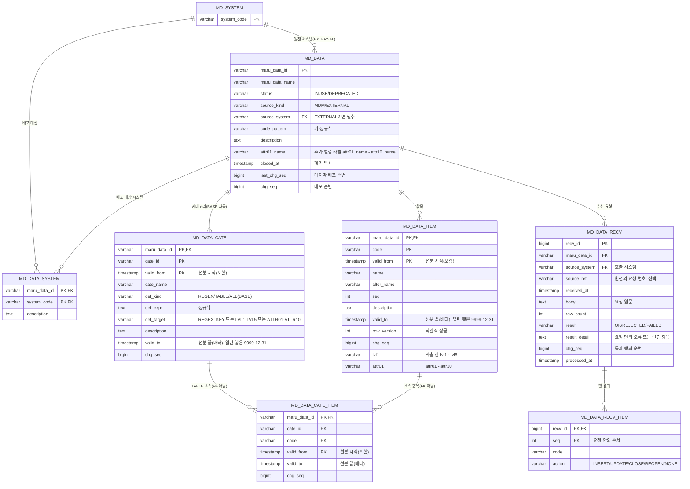

# 마루 MDM 설계: 마스터데이터 관리

> 마루 데이터마다 원장을 정하는 마스터데이터의 모델·검증·배포·판정 규칙. 마스터코드는 `04-master-code.md`, 도메인·컬럼의 참조는 `02-term-domain-column.md`, 룰은 `06-business-rule.md`, 공통 원칙은 `01-mdm-overview.md`.
>
> 마스터코드와 다른 점은 셋이다. **버전이 없다. 승인이 없다. 저장하면 바로 배포한다.** 그래서 04의 버전 테이블(VER)과 가리기 규칙이 없다. 이력은 04처럼 행마다 선분을 갖되 축이 버전이 아니라 일시다(사용자 결정 2026-09-09). 나머지 어휘(마루 데이터, 카테고리, BASE, 배포 순번)는 04와 같다.

## 마스터데이터의 위치

| 항목 | 내용 |
| --- | --- |
| 원장 | 마루 데이터마다 정한다. `MDM`이면 MDM 화면·CSV로 입력한다. `EXTERNAL`이면 원천 시스템이 수신 API로 보낸다. 저장·배포 경로는 하나다. 검증은 원천이 한다. `MDM`이면 화면·CSV에서 검사하고, `EXTERNAL`이면 원천 시스템이 검사한 것을 받는 쪽인 MDM은 검사 없이 저장한다(결정 2026-09-09). 여기서 `MDM`은 역할이며 MDM 역할을 맡은 인스턴스를 뜻한다(01 「한 줄 정의」, 2026-09-10) |
| 버전·적용 시점·승인 | 없다. 저장 커밋이 곧 배포 시작이다. 01 원칙 3("승인 후 배포")의 예외다 |
| 이력 | 버전 대신 항목·카테고리·소속 행마다 일시 축 선분(`valid_from`-`valid_to`)을 둔다. 값이 바뀌면 옛 행을 닫고 새 행을 만든다. 별도 버전 테이블도 변경 로그도 없다(사용자 결정 2026-09-09). EXTERNAL은 받은 요청과 처리 결과를 수신 로그로 남긴다. 조회 전용이고 복원은 없다 |
| 도메인 의존 | 없다(01 원칙 8). 참조는 도메인·컬럼(`ref_target`·`ref_cate_id`)·룰 → 마루 데이터 한 방향이다 |
| 활용처 영향 | 항목을 닫거나 마루 데이터를 폐기할 때 활용처를 검사하지 않는다. 업무 검토로 다룬다(04와 같다) |
| 테스트 DB | SQLite로 시험한다. 이 문서의 SQL과 컬럼 타입은 SQLite·PostgreSQL 공통 문법만 쓴다 |

## 마스터코드와 마스터데이터의 구분

01의 미결 "구분 기준"을 여기서 정한다. 대상 목록은 업무가 정한다.

| 관점 | 마스터코드(04) | 마스터데이터(05) |
| --- | --- | --- |
| 무엇 | 분류 값의 집합. 공정·등급·라인 | 개체 목록. 거래처·항구·제품 |
| 원장 | 마루 코드마다 정한다. MDM 또는 EXTERNAL(04 「마스터코드의 위치」) | 마루 데이터마다 정한다. MDM 또는 EXTERNAL(「마스터데이터의 위치」). 정하는 방식은 코드와 같다(사용자 결정 2026-09-09, 검토서 70번) |
| 늘어나는 방식 | 드물게, 업무 규칙이 바뀔 때 | 계속, 개체가 생길 때마다 |
| 행 추가의 뜻 | 규칙 변경. 승인·적용 시점·버전이 필요하다 | 사실 등록. 즉시 유효하다 |
| 크기 | 콤보에 전부 보일 정도 | 검색해서 고를 정도 |
| 속성 | 코드값·이름·약칭·순서·설명 + 계층 칸 다섯 개 + 추가 컬럼 열 개 | 키·이름·약칭·순서·설명 + 계층 칸 다섯 개 + 추가 컬럼 열 개. 두 항목 표의 모양은 같다(결정 2026-09-09) |
| 기준일 판정 | 버전 소급 | 일시 축 선분 행을 고른다 |
| 판정 질문 | "새 값을 추가할 때 언제부터 유효한지 정해야 하는가" → 예 | "행을 검색해서 고르는가" → 예 |

코드와 데이터를 가르는 것은 속성이 아니라 생성·배포 방식이다(결정 2026-09-09). 코드는 버전을 달고 승인·적용 시점을 거치며 이력이 중요하다. 데이터는 저장 즉시 유효하다. 그래서 두 항목 표는 같은 칸을 갖되, 04의 `MD_CODE_ITEM`에는 버전 축 from_ver-to_ver가 있고 05의 `MD_DATA_ITEM`에는 일시 축 valid_from-valid_to가 있다. 값을 어디에 둘지는 이렇게 가른다. 조건에 따라 달라지는 값은 업무기준(룰)이고, 개체 고유의 고정 사실은 코드든 데이터든 추가 컬럼이다. 공정별 시간당 생산량은 룰이고, 항구의 국가와 강종 규격의 인장강도는 추가 컬럼이다.

## 구조: 마루 데이터 → 항목 · 추가 컬럼 · 카테고리

```
MD_DATA              마루 데이터. CUST, PORT, PRODUCT ...
  ├ MD_DATA_SYSTEM       배포 대상 시스템
  ├ MD_DATA_ITEM         항목. code + name·alter_name·seq·description + lvl1-lvl5 + attr01-attr10 + 선분 valid_from-valid_to
  └ MD_DATA_CATE         카테고리 = 이름 붙인 부분집합
      └ MD_DATA_CATE_ITEM  TABLE 종류의 소속 행
```

| 항목 | 규칙 |
| --- | --- |
| 선분 | 항목·카테고리·소속 행마다 일시 축 `valid_from`-`valid_to`. 값이 바뀌면 옛 행을 닫고 새 행을 만든다(「선분과 닫기」, 결정 2026-09-09) |
| 닫기 | 행은 지우지 않고 열린 행의 `valid_to`를 적는다. 그래야 삭제가 사본에 전달된다. 마루 데이터 행만 `closed_at`이다 |
| 유효한 행 | `valid_from <= 기준시각 < valid_to`인 행. 기준시각이 최초 행보다 앞이면 최초 행으로 소급한다 |
| 사본 | 원장과 같은 행 구조다. FK만 없다 |

**계층**

계층은 항목 행의 고정 컬럼 `lvl1`-`lvl5`가 담고, 계층을 가로지르는 다목적 분류는 카테고리가 담는다(결정 2026-09-08). 조직을 공장·팀으로 내려가며 고르는 것은 계층이고, "주요 거래처"처럼 계층과 무관한 집합은 카테고리다.

| 항목 | 규칙 |
| --- | --- |
| 칸 | `lvl1`-`lvl5`. VARCHAR, NULL 허용. 화면 라벨은 "1차"-"5차" |
| 행 | 고를 수 있는 최종 항목만 행으로 둔다. 그룹은 행이 아니라 칸의 값이다. 항목 PH-A-PRD의 행은 `lvl1 = PH`, `lvl2 = PH-A`이고 `lvl3` 이하는 NULL이다. PH와 PH-A만을 위한 행은 없다. 마지막 단계는 항목 자신이므로 자기 키를 칸에 적지 않는다 |
| 깊이 | 행마다 다르다. 마루 데이터마다 단수를 고정하지 않으므로 한 마루 데이터 안에 2단·3단·4단 항목이 섞인다. 깊이는 채운 칸 수 + 1이고 최대 6단이다. 6단을 넘는 체계는 마루 데이터를 나눈다 |
| 그룹 값 | 마루 데이터 안에서 유일하다. 관례로 부모 값에 구분자를 붙여 짓는다. PH에서 PH-A로, PH-A에서 PH-A-PRD로 가는 식이다. 강제하는 것은 유일성뿐이고 짓는 방식은 관례다. 그래서 마지막에 고른 값 하나로 다음 단계를 뽑을 수 있고, REGEX 카테고리가 칸 하나로 부분 트리를 잡는다 |
| 항목이자 그룹인 노드 | 그 항목의 행이 있고 칸에는 부모까지만 적는다. 자손 행의 칸에 같은 값이 나타난다. 같은 문자열이면 같은 노드다. 새 플래그나 표는 두지 않는다. 항목 PH-A의 행과 `lvl2`가 PH-A인 자손 행이 함께 있으면 PH-A는 고를 수도 있고 펼칠 수도 있다 |
| 값 제약 | 콤마·공백을 쓸 수 없다. CSV 열과 부딪히기 때문이다. 그 밖은 자유다. 항목이자 그룹인 값은 항목 행이 `code_pattern`을 따르므로 따로 정하지 않는다 |
| 저장 검사 | 둘이다. 중간 칸이 비면 거부한다. `lvl_n`이 있으면 `lvl_1`-`lvl_(n-1)`이 모두 있어야 한다. 그리고 같은 문자열이 그룹 값으로든 항목 키로든 이미 있으면 그 행의 앞 칸이 내 앞 칸과 같아야 하고, 다르면 거부한다. 닫힌 항목도 비교 대상이다. 다시 열 수 있기 때문이다. 조상 행이 있는지는 검사하지 않는다. 그룹은 행이 아니다 |
| 두지 않는 것 | 상위 항목 자기 참조 컬럼, 계층 노드 테이블, 그룹 이름 테이블, 마루 데이터별 계층 단수 고정. 그룹은 이름이 없고 값 그대로 보인다. 이름이 필요한 그룹은 그 값의 항목 행을 둔다 |

자세한 콤보·트리 쿼리는 04 「판정 참고 구현」의 계층 콤보와 트리 소절과 같다. 표만 `MD_CODE_ITEM`에서 `MD_DATA_ITEM`으로 바뀌고, 04가 버전 유효 행으로 거르는 자리에서 05는 열린 행(`valid_to = 9999-12-31`)으로 거른다. 정렬은 04와 같이 `seq` 순이고 같으면 `code` 순이다. 표시 순서는 04와 같이 앱이 정하고, 노드 안에서 항목을 먼저 보인 뒤 형제 그룹을 값 순으로 보인다. 실행 표본은 04의 `sql/04-hier-tree-sim.py`에 ORG 예로 함께 있다.

마루 데이터 ORG(조직)의 예다.

| code | name | seq | lvl1 | lvl2 | 깊이 |
| --- | --- | --- | --- | --- | --- |
| HQ-PLN | 기획팀 | 1 | HQ | | 2단 |
| PH-B | B공장 | 1 | PH | | 2단. 팀 없이 공장이 단위다 |
| PH-A-PRD | A공장 생산팀 | 1 | PH | PH-A | 3단 |
| PH-A-MNT | A공장 정비팀 | 2 | PH | PH-A | 3단 |
| PH-A | A공장 | 2 | PH | | 2단. PH-A는 항목이자 그룹이다 |

**식별자**

| 항목 | 규칙 |
| --- | --- |
| 이름 | `maru_data_id`, `maru_data_name`. 항목의 키 컬럼은 04의 코드값 컬럼과 같이 `code`다(결정 2026-09-09). `key`는 MSSQL 예약어라 쓰지 않는다 |
| 이름 공간 | `maru_data_id`는 마루 코드 ID(MD_CODE.maru_code_id)와 한 이름 공간이다. `MASTER`의 첫 인자가 ID로 코드·데이터를 가르기 때문이다. 등록할 때 MD_CODE에 같은 ID가 있으면 거부한다. 저장 시 검사한다(2026-09-08). 인스턴스 간에는 사본이 원장을 가른다(「그 밖의 규칙」 다른 원장의 같은 ID, 2026-09-09) |
| 항목 키 | `code_pattern`이 정한다. 점·공백도 패턴이 허용하면 쓸 수 있다 |

**원천**

| 항목 | 규칙 |
| --- | --- |
| `source_kind` | `MDM` 또는 `EXTERNAL`. 마루 데이터를 만들 때 정하고 바꾸지 않는다 |
| `source_system` | EXTERNAL이면 필수. MD_SYSTEM FK. 수신 API는 이 시스템만 부를 수 있다 |
| 원천이 아닌 쪽의 저장 | 거부한다. EXTERNAL 마루 데이터의 항목은 MDM 화면에서 조회 전용이다. MDM 마루 데이터는 수신 API가 받지 않는다 |
| 정의는 MDM 몫 | 원천이 EXTERNAL이어도 카테고리·TABLE 소속·추가 컬럼 라벨·배포 대상은 MDM 담당자가 편집한다 |

**항목 키**

채번은 MDM이 하지 않는다. 따로 구현하고 방안은 향후 정한다(결정 2026-09-09).

| 원천 | 규칙 |
| --- | --- |
| MDM | 담당자가 키를 입력한다. `code_pattern` 전체 일치를 검사한다. 기본값은 `^[0-9A-Z]{1,20}$` |
| EXTERNAL | 원천이 정한 키를 그대로 받는다. `code_pattern` 검사는 하지 않는다. 키 형식은 원천이 지킨다(결정 2026-09-09) |

| 항목 | 규칙 |
| --- | --- |
| 키 변경 | 수정에서 키는 바꿀 수 없다. 키가 틀렸으면 닫고 새로 등록한다 |

## 추가 컬럼

항목 행에 문자열 컬럼 `attr01`-`attr10`을 고정으로 둔다. 어느 번호를 어떤 뜻으로 쓰는지는 마루 데이터 행의 라벨 칸 `attr01_name`-`attr10_name`이 말한다(결정 2026-09-09). 정의 표 `MD_DATA_ATTR`은 두지 않는다. 마스터코드의 추가 컬럼(04 「추가 컬럼」)과 같은 모양이다.

| 항목 | 규칙 |
| --- | --- |
| 라벨 | `MD_DATA.attr01_name`-`attr10_name`. NULL 허용. 라벨이 있는 번호만 쓰는 칸이다. 화면의 열 머리와 CSV·API 안내에 쓴다. 원천이 EXTERNAL이어도 MDM 담당자가 편집한다(「구조」의 원천 표) |
| 라벨 없는 칸 | 값이 오면 거부한다(「저장 경로와 검증」 검사 순서 5) |
| 값 | 문자열 그대로 저장한다. `VARCHAR(500)`. 유형·필수·정규식 검사는 없다. 값의 형식은 원천이 지킨다. 입력은 원천에서만 받기 때문이다 |
| 번호로 다룬다 | 화면·API·CSV·`MASTER()`의 `attr` 인자 모두 `attr01` 같은 번호다. 논리 키 층은 두지 않는다 |
| 라벨 변경 | 라벨만 바뀌고 기존 값은 그대로다. 저장 즉시 배포한다. MD_DATA 행에 배포 순번을 찍는다 |
| 라벨 지우기 | 라벨을 NULL로 하면 그 칸은 값을 받지 않는다. 값이 있는 행은 그대로 둔다. 지운 번호를 다른 뜻으로 다시 쓰면 옛 값이 새 뜻으로 읽히므로 새 뜻은 빈 번호에 붙인다 |
| 이름 | `name`은 NOT NULL이다. 약칭 `alter_name`, 표시 순서 `seq`, 설명 `description`은 04의 코드 행과 같은 뜻의 칸이다(결정 2026-09-09) |
| 길이 | `VARCHAR(500)`. 상세설계에서 조정한다 |
| 동시 편집 | `MD_DATA_ITEM.row_version`으로 낙관적 잠금을 건다. 거부되면 "다른 사용자가 수정했습니다"를 보이고 다시 불러온다 |

## 고정 컬럼으로 간다 (결정 2026-09-09)

추가 컬럼은 고정 컬럼 `attr01`-`attr10`으로 확정한다. JSON 속성 컬럼으로 바꾸는 길은 두지 않는다. 대부분의 마루 데이터가 열 칸 중 몇 칸만 쓰고 나머지는 NULL로 남는데, NULL 컬럼이 차지하는 용량이 어느 엔진에서도 따질 값이 아니기 때문이다. 04 마스터코드도 같은 결정을 따른다(04 「추가 컬럼」).

| DB | NULL VARCHAR 한 칸 | attr 열 칸이 전부 NULL인 행 |
| --- | --- | --- |
| PostgreSQL | 데이터 0바이트. 행에 NULL이 하나라도 있으면 컬럼당 1비트의 NULL 비트맵이 헤더에 붙는다 | 비트맵이 8바이트 정렬에 걸려 행당 8바이트 |
| SQLite | 레코드 헤더의 타입 코드 1바이트 | 10바이트 |
| Oracle | 길이 바이트 1바이트. 행 끝에 이어진 NULL은 저장하지 않는다 | 0바이트. `attr`이 행 끝에 있기 때문이다 |
| SQL Server | NULL 비트맵은 늘 있다. 가변 길이 NULL은 중간이면 오프셋 2바이트, 행 끝이면 저장하지 않는다 | 0바이트 |

항목이 100만 건이어도 많아야 10MB다. 인덱스는 추가 컬럼에 걸지 않는다. 선언 길이 `VARCHAR(500)`은 값이 있을 때 실제 길이만 쓴다.

| 항목 | 규칙 |
| --- | --- |
| 10개를 넘으면 | 컬럼을 늘린다(`attr11` 이후). 비용은 위 표의 NULL 표시뿐이다. 라벨 칸 `attr11_name`과 화면 라벨 표의 행 수를 같이 늘린다 |
| 컬럼 순서 | `lvl1`-`lvl5` 다음에 `attr01`-`attr10`을 행 끝에 둔다. Oracle과 SQL Server는 행 끝의 NULL을 저장하지 않는다 |
| 번호로 다룬다 | 화면·API·엔진 함수는 `attr01` 같은 번호로 다루고 외부 원천의 페이로드도 `{"attrs":{"attr01":"KR"}}` 형태다. 뜻은 라벨이 말한다. 논리 키 층은 두지 않는다(결정 2026-09-09) |
| 숫자·날짜 | 문자열 그대로 저장한다. 유형이 없으므로 정규화도 없다. 형식은 원천이 지킨다. 룰에서 숫자로 견주는 규칙은 06 미결이다 |

## 카테고리 정의 방식

| def_kind | 정의 | 화면 | 쓰는 경우 |
| --- | --- | --- | --- |
| REGEX | `def_target`의 값에 `def_expr` 정규식을 전체 일치로 대조한다. `def_target`은 `KEY`, `ATTR01`-`ATTR10`, `LVL1`-`LVL5` 중 하나다 | 매칭 열은 읽기 전용이다 | 키 패턴(`^KR.*` 한국 항구), 추가 컬럼 값(`attr01`이 `KR`, 거래처 유형이 `S`), 계층 값(`lvl2`가 `KS-3`인 항목 전부). 항목을 더하거나 속성을 고치면 자동으로 편입된다 |
| TABLE | `MD_DATA_CATE_ITEM` 행 | 항목을 검색해 체크하면 소속 행을 저장한다 | 담당자가 고르는 임의 집합. 주요 거래처 |
| ALL | 정의 없음. 항목 전체 | 편집·닫기 불가 | 예약 카테고리 BASE 전용 |

| 항목 | 규칙 |
| --- | --- |
| LIST 없음 | 항목이 수만 건이라 콤마 텍스트가 성립하지 않는다. TABLE이 대신한다 |
| 04와 다른 점 | `def_target` 허용값의 이름이 다르다. 04는 CODE·LVL1-LVL5·ATTR01-ATTR10이고 05는 KEY·LVL1-LVL5·ATTR01-ATTR10이다. 코드값을 04는 CODE, 키를 05는 KEY로 부른다. 그 밖의 해석 규칙은 04와 같다 |
| 해석 위치 | 서버 Java `Pattern.compile(expr).matcher(value).matches()`. 화면은 결과만 받는다. SQL에 정규식을 쓰지 않는다. SQLite에 내장 REGEXP가 없기 때문이기도 하다 |
| 다중 소속 | 한 항목이 여러 카테고리에 속한다. 고객이면서 공급사인 거래처는 TABLE 둘, 또는 속성 둘에 REGEX 둘로 표현한다 |
| 참조 | 활용처는 `maru_data_id` + `cate_id` 두 값이다. 컬럼 사전은 `ref_target`(마루 데이터 ID)과 `ref_cate_id`(카테고리 ID) 두 칸에 따로 담는다. 카테고리를 비우면 BASE다(2026-09-09) |
| BASE | 마루 데이터를 만들 때 자동 생성한다. 닫을 수 없다 |
| 원장 FK | 항목·카테고리에 일시 축 선분이 있어 04와 같이 `CATE_ITEM → CATE`, `CATE_ITEM → ITEM` FK를 걸 수 없다. 앱이 검사한다(결정 2026-09-09) |
| 닫힌 카테고리 | 소속 행은 그대로 두고 판정만 false다. 다시 열면 소속이 되살아난다 |
| 물질화 | 원장은 REGEX를 물질화하지 않는다(04와 같다). 사본은 적재할 때 REGEX를 평가해 `MD_DATA_CATE_EFF(maru_data_id, cate_id, code)`에 두고, 항목이 오면 그 항목만 다시 평가한다. 04의 "미리 계산"과 같다 |
| REGEX 저장 검사 | `Pattern.compile`로 문법을 검사한다. 길이·시간 제한은 두지 않는다 |
| NULL 값 | `def_target` 값이 NULL이면 REGEX는 불일치다 |

## 저장 경로와 검증

| 경로 | 원천 | 단위 | 실패 처리 |
| --- | --- | --- | --- |
| 화면 | MDM | 항목 1건(등록·수정·닫기·다시 열기). 카테고리·소속·추가 컬럼 라벨 편집은 원천과 무관 | 즉시 표시한다. 저장하지 않는다 |
| CSV 업로드 | MDM | 파일 1개 = 항목 N건. upsert다. 있는 키는 갱신한다 | 검증 결과 표를 보인다. **오류 0건일 때만** 저장한다. 한 트랜잭션, 배포 순번 하나 |
| 수신 API | EXTERNAL | 요청 1건 = 항목 1-N건. **upsert**다. 닫기·다시 열기는 `closed` 플래그로 한다 | 행의 내용은 검사하지 않는다(결정 2026-09-09). 요청 단위 거부에 걸리지 않으면 행 전부를 한 트랜잭션으로 저장·배포한다. 받은 것 전부와 행마다의 동작을 수신 로그(`MD_DATA_RECV`·`MD_DATA_RECV_ITEM`)에 남기고 응답으로도 돌려준다 |

**검사 순서**(화면·CSV 경로. 식 엔진을 쓰지 않는다. 01 8절. 수신 API는 받는 쪽이라 1·2와 본문 형식만 보고 3·4·5·5-1·7은 돌리지 않는다. 6의 upsert 처리는 같다. 검증은 원천이 생성·수정할 때 한다. 결정 2026-09-09)

```
1. 마루 데이터 상태: DEPRECATED면 거부
2. 원천: 경로와 source_kind가 맞아야 한다. API는 호출 시스템 = source_system
3. 키: 원천이 MDM이면 code_pattern 전체 일치. EXTERNAL은 검사하지 않는다. 수정에서 키는 못 바꾼다
4. name 필수
5. 추가 컬럼: 라벨 없는 칸에 값이 오면 거부. 유형·필수·정규식 검사는 없다
5-1. 계층 칸: 중간 칸이 비면 거부. 같은 값(그룹·키)의 앞 칸이 다른 행이 있으면 거부(닫힌 행 포함)
6. 중복: 화면 신규 등록에서 키가 이미 있으면 거부한다. 닫힌 키도 포함이며 "다시 열기"를 안내한다.
   CSV·API는 upsert라 갱신으로 처리한다. 값이 같으면 저장하지 않는다(아래 표)
7. 소속(TABLE): 항목과 카테고리가 있고 열려 있어야 한다. 앱 검사(선분 때문에 FK는 없다)
```

| 항목 | 규칙 |
| --- | --- |
| 페이로드 | 추가 컬럼은 행마다 `"attrs": {"attr01": "KR"}` 형태로 온다. 키는 번호다. 계층 칸은 `lvls` 배열로 온다. `{"code":"C0001","name":"…","seq":1,"lvls":["KS","KS-3"],"attrs":{"attr01":"KR"},"closed":false}`. 번호가 `attr01`-`attr10` 밖이면 본문 형식 오류다. 라벨 없는 번호의 값은 검사하지 않고 그대로 저장한다. 빠진 번호는 "변경 없음"이 아니라 NULL이다. `alter_name`·`description`도 같은 자리의 키이고 빠지면 NULL이다. `lvls`는 0-5개이고 1차부터 순서대로 담는다. 빈 배열이거나 키가 없으면 계층이 없어서 칸이 전부 NULL이다 |
| API 응답 | 수신 번호(`recv_id`), 행마다 동작(INSERT / UPDATE / CLOSE / REOPEN / NONE), 묶음의 배포 순번을 돌려준다 |
| 값이 같은 행 | CSV·API의 upsert에서 받은 값이 현재 값과 같으면 저장하지 않는다. 이름·약칭·순서·설명, 계층 칸 다섯 개, 추가 컬럼 열 칸, 열림·닫힘이 모두 같으면 같은 행이다. 순번을 발급하지 않고 새 선분 행도 만들지 않는다. 바뀐 행이 하나도 없으면 순번을 발급하지 않는다 |
| CSV 형식 | UTF-8, 첫 줄은 열 이름(`code`, `name`, `alter_name`, `seq`, `description`, `lvl1`-`lvl5`, `attr01`-`attr10`). 열 이름은 물리명이고 라벨은 안내에만 쓴다. 계층 칸은 비워 두면 NULL이다. 따옴표 규칙은 RFC 4180. 닫기는 CSV로 하지 않는다 |
| 대량 적재 | CSV 한 파일이 배포 순번 하나다. 항구 3,000건이 한 묶음으로 간다. 같은 파일을 다시 올리면 바뀐 행만 새 순번을 받는다 |
| 유일성 | 키의 유일성은 PK가 보장한다. 그 밖의 유일성(사업자번호 중복 금지 등)은 두지 않는다. 필요하면 업무 검토다 |

**수신 로그**(수신 API 전용)

받은 것 전부와 처리 결과를 남긴다. 요청 1건이 `MD_DATA_RECV` 한 행이고, 요청 안의 행마다 `MD_DATA_RECV_ITEM` 한 행이다. 중계 시스템이 "무엇을 받아 어떻게 했는지"를 스스로 답하기 위한 것이다. 인증에 실패한 요청은 기록하지 않는다.

| 단계 | 하는 일 | 트랜잭션 |
| --- | --- | --- |
| 1 수신 | RECV 한 행을 적는다. 원천 시스템·마루 데이터·요청 원문(`body`)·수신 일시. `result`는 NULL이다 | 바로 커밋 |
| 2 처리·결과 | 요청 단위 거부 조건을 본다. 걸리지 않으면 값이 바뀐 행을 upsert하고(선분 규칙대로 옛 행을 닫고 새 행을 만든다) 순번 하나를 찍는다. RECV_ITEM에 행마다 동작을, RECV에 `result`·행 수·`chg_seq`·`processed_at`을 적는다 | 한 트랜잭션 |
| 저장 오류 | 2가 실패하면 전부 되돌리고 RECV에 FAILED와 오류만 적는다 | 별도 커밋 |

| 항목 | 규칙 |
| --- | --- |
| `result` | OK(저장) / REJECTED(요청 단위 거부) / FAILED(저장 오류). NULL이면 처리 중이거나 처리 도중 죽은 것이다. PARTIAL은 없다. 행 단위 거부가 없기 때문이다(결정 2026-09-09) |
| 요청 단위 거부 | 모르는 마루 데이터, DEPRECATED, 원천 불일치, 본문 형식 오류(JSON 구조, `lvls` 6개 이상, `attr01`-`attr10` 밖 번호). 받는 쪽이 거부하는 것은 이것뿐이다. `result_detail`에 적고 RECV_ITEM은 만들지 않는다 |
| 행 동작 | `action`은 INSERT / UPDATE / CLOSE / REOPEN / NONE 중 하나다. 행 단위 결과 칸은 없다. 요청이 저장되면 행 전부가 저장된 것이다 |
| 행 페이로드 | 따로 두지 않는다. 화면은 `body`에서 `seq`로 꺼내 보인다 |
| 처리 도중 죽음 | `result`가 NULL인 채 남아 "받았으나 처리하지 못함"으로 보인다. 원천은 5xx를 받고 다시 보낸다. 새 요청이다 |
| 재처리 | 없다. 원천이 고쳐서 다시 보낸다 |
| 배포 | 하지 않는다. 순번도 찍지 않는다. `RECV.chg_seq`는 통과 행에 찍힌 순번을 가리키는 참조다 |

## 선분과 닫기

이력은 행마다 일시 축 선분으로 남긴다(사용자 결정 2026-09-09). 04의 from_ver-to_ver와 같은 꼴이되 축이 버전이 아니라 일시다. 별도 버전 테이블도 변경 로그도 없다.

| 항목 | 규칙 |
| --- | --- |
| 선분을 갖는 것 | 항목, 카테고리, 소속. 마루 데이터 행은 선분 없이 `status`·`closed_at`으로 폐기만 적는다 |
| 축 | `valid_from`(포함) - `valid_to`(배타). 둘 다 NOT NULL. 열린 행은 `valid_to = 9999-12-31 00:00:00` |
| 경계 | 저장 트랜잭션의 시각. 같은 키의 사건은 배포 순번으로 직렬화되므로 앞 사건보다 뒤 시각이다 |
| PK | 원래 키 + `valid_from` |
| 등록 | 새 행 하나. `valid_from`은 저장 시각 |
| 수정 | 열린 행의 `valid_to`에 저장 시각을 적고, 같은 시각을 `valid_from`으로 하는 새 행을 만든다. 두 행에 같은 배포 순번을 찍는다 |
| 닫기 | 열린 행의 `valid_to`에 저장 시각을 적는다. 새 행은 없다. 물리 삭제는 없다. 잘못 등록한 항목도 닫는다 |
| 다시 열기 | 마지막 행의 값을 복사한 새 행. 닫혀 있던 구간은 그대로 남아 그 구간의 기준일은 false다 |
| 유효한 행 | `valid_from <= 기준시각 < valid_to`. 현재 유효는 기준시각이 지금인 것이고, 열린 행이 없는 키가 닫힌 키다 |
| 최초 행 소급 | 기준시각이 가장 이른 행의 `valid_from`보다 앞이면 그 행으로 판정한다. 04의 최초 버전 소급과 같은 방향이다 |
| 이력 조회 | 키 하나의 선분 행을 시간순으로 보이면 01의 "생성·변경·소멸 이력 조회"다 |

| 대상 | 규칙 |
| --- | --- |
| 마루 데이터 | INUSE → DEPRECATED. 만들면 INUSE다. 폐기는 조건 없이 언제든 한다. `closed_at`에 폐기 일시를 적는다. 폐기되면 저장·수신을 거부하고 사본은 검색에서 숨긴다. 되돌리기는 없다 |
| 항목 | 선분 행. 닫기·다시 열기 모두 된다 |
| 카테고리 | 선분 행. BASE는 닫을 수 없다 |
| 소속 | 선분 행. 소속 해제는 열린 행을 닫는 것이고, 다시 소속은 새 행이다 |

- 닫힌 키로는 새로 등록할 수 없다. 다시 연다.

## 배포와 사본

배포는 사본을 원장과 같게 맞추는 동기화다. **보내는 단위는 행이고, 무엇을 보낼지는 행마다 찍힌 배포 순번(`chg_seq`)으로 정한다.** 04의 변경분 방식과 같다. 버전이 없으므로 04의 apply_to 가리기 규칙은 없다. 선분 행은 절대값이라 닫는 행도 새 행도 그대로 보낸다.

**실시간의 뜻**: 저장 트랜잭션이 커밋되면 대상 시스템마다 동기화를 바로 시작한다. 도달과 적용은 각 시스템 책임이다(04와 같다). 전파 지연은 설계에서 고려하지 않는다(02 결정).

### 배포 순번

네 테이블(MD_DATA·ITEM·CATE·CATE_ITEM)의 행마다 `chg_seq`(BIGINT, NOT NULL)를 둔다. 마루 데이터 단위로 단조 증가한다. `MD_DATA.last_chg_seq`가 마지막으로 발급한 번호다.

| 항목 | 규칙 |
| --- | --- |
| 발급 | `UPDATE MD_DATA SET last_chg_seq = last_chg_seq + 1 WHERE maru_data_id = ? RETURNING last_chg_seq` 한 문장. 사건과 같은 트랜잭션이다 |
| 직렬화 | 이 update가 MD_DATA 행을 커밋까지 잠근다. 같은 마루 데이터의 사건은 직렬화되고 순번 순서와 커밋 순서가 같다 |
| 단위 | 사건 하나 = 순번 하나. 그 사건이 건드린 행 전부에 같은 순번을 찍는다. CSV 3,000건도 순번 하나다 |
| NULL 없음 | 04와 달리 미배포 행이 없다. 모든 행이 배포 대상이라 `chg_seq`는 NOT NULL이다 |

| 사건 | 순번을 찍는 행 |
| --- | --- |
| 마루 데이터 생성 | MD_DATA, CATE BASE |
| 마루 데이터 이름·설명·키 패턴 변경, DEPRECATED | MD_DATA |
| 항목 등록·수정·닫기·다시 열기(화면 1건) | ITEM 행. 수정은 닫는 행과 새 행 둘이다 |
| API 요청 | 값이 바뀐 ITEM 행. 수정은 행마다 둘이다 |
| CSV 적재 | 값이 바뀐 ITEM 행(수정은 둘). 첫 적재는 전부다 |
| 추가 컬럼 라벨 변경 | MD_DATA 행 |
| 카테고리 등록·수정·닫기·다시 열기 | CATE 행. 수정은 둘이다 |
| 소속 편집 | 바뀐 CATE_ITEM 행 |

순번을 찍지 않는 것은 MD_DATA_SYSTEM 변경, RECV·RECV_ITEM이다. 바뀐 행이 없는 upsert는 순번을 쓰지 않는다.

### 보내는 쪽

사본마다 (maru_data_id, last_seq_received)를 갖는다. 초기 적재는 0이다. 처음 보낸 원장 코드도 함께 둔다(「그 밖의 규칙」 다른 원장의 같은 ID, 2026-09-09).

```sql
SELECT * FROM <각 테이블> WHERE maru_data_id = :md AND chg_seq > :last ORDER BY chg_seq
```

| 규칙 | 내용 |
| --- | --- |
| 한 스냅샷 | 네 테이블과 `last_chg_seq`를 한 트랜잭션·한 스냅샷에서 읽는다. PostgreSQL은 REPEATABLE READ, SQLite는 읽기 트랜잭션 하나(WAL 스냅샷)다. 따로 읽으면 그 사이 커밋된 사건이 일부 테이블에만 실린다 |
| 묶음 | 질의 결과 전부와 그 스냅샷의 `last_chg_seq` |
| 시작 시점 | 커밋 직후. 전달 수단(push, "바뀌었다" 신호 뒤 pull, 큐)은 배포 영역에서 정한다. 연속 사건은 한 묶음으로 간다. 짧은 지연으로 묶을지는 구현에서 정한다 |
| 안전망 | 전달이 실패하면 재시도한다. 사본은 주기 pull로도 따라잡는다. 두 경로가 같은 질의를 쓰므로 겹쳐도 해가 없다 |
| 한 가지 동작 | 초기 적재·따라잡기·변경 배포가 모두 같다. 놓친 사건이 몇 개든 한 번에 받는다. 전체 재적재는 사본을 비우고 last 0으로 같은 질의를 한다 |

### 받는 쪽

| 규칙 | 내용 |
| --- | --- |
| 직렬화 | 같은 (시스템, 마루 데이터)의 동기화는 한 번에 하나만 돈다 |
| 원장 확인 | 묶음 헤더의 원장 코드가 사본이 그 ID에 기억한 원장과 다르면 통째로 버리고 경고한다. 마루 코드로 기억한 같은 ID도 본다. 규칙은 「그 밖의 규칙」 다른 원장의 같은 ID(2026-09-09) |
| 옛 묶음 폐기 | 묶음의 `last_chg_seq`가 사본의 `last_seq_received`보다 크지 않으면 통째로 버린다 |
| 한 트랜잭션 | 행 upsert, `last_seq_received` 갱신, REGEX 캐시 재계산을 한 트랜잭션으로 한다. 실패하면 아무것도 남기지 않고 다음에 같은 질의를 다시 한다 |
| upsert | PK 기준. 행이 절대값이라 적용 순서가 없다. 같은 묶음을 두 번 적용해도 결과가 같다 |
| REGEX 캐시 | 받은 항목 행마다 그 마루 데이터의 REGEX 카테고리 행 전부(닫힌 행 포함)와 대조해 일치하는 쌍을 `MD_DATA_CATE_EFF`에 넣는다. REGEX 카테고리 행이 오면 그 행을 항목 행 전부와 대조한다. 선분 행은 바뀌지 않으므로 쌍을 지울 일은 없다 |
| 폐기 | `MD_DATA.status`가 DEPRECATED면 검색·단건 API에서 숨긴다. `MASTER`·`MASTER_AT`는 base_dt로 판정한다 |

### 예

| 순서 | 사건 | 순번을 찍는 행 | last_chg_seq |
| --- | --- | --- | --- |
| E1 | 마루 데이터 PORT 생성 | MD_DATA, CATE BASE | 1 |
| E2 | 추가 컬럼 라벨 지정(attr01 국가, attr02 위도, attr03 경도) | MD_DATA | 2 |
| E3 | CSV 3,000건 적재 | ITEM 3,000행 | 3 |
| E4 | 카테고리 KR(REGEX, ATTR01, `^KR$`) 등록 | CATE KR | 4 |
| E5 | 항목 KRPUS 이름 수정 | ITEM KRPUS | 5 |
| E6 | 항목 KRINC 닫기 | ITEM KRINC | 6 |

| 사본 | 상황 | 받는 것 |
| --- | --- | --- |
| MES | E3 뒤 수신(last 3), E6 뒤 동기화 | 순번 4·5·6인 행. CATE KR, ITEM KRPUS 두 행(닫힌 행과 새 행), ITEM KRINC. KR 카테고리 행이 왔으므로 항목 행 전부와 대조해 캐시를 만든다 |
| APS | E6 뒤 대상 추가 | last 0으로 순번 있는 행 전부. KRINC는 닫힌 선분 행(`valid_to` 있음)으로, KRPUS는 두 행으로 온다. 사건 순서는 몰라도 된다 |
| ERP | E2 뒤로 못 받다가 E6 뒤 동기화 | 순번 3·4·5·6을 한 번에 |

**EXTERNAL 예**: CUST. 원천은 ERP, 배포 대상은 MES·APS·EQP다. 추가 컬럼 라벨은 attr01 사업자번호, attr02 유형이고 `last_chg_seq`는 4다. 키는 줄여 적었다.

| 순서 | 사건 | 기록 |
| --- | --- | --- |
| X1 | ERP가 4행을 보낸다. C1 신규, C2 이름 변경, C3 현재 값과 같음, C4는 라벨 없는 attr03에 값이 있다 | RECV 1행(ERP, CUST, 원문, 수신 일시, `result` NULL)을 커밋한다 |
| X2 | 행의 내용은 검사하지 않는다. C4의 라벨 없는 attr03 값도 그대로 저장한다. 값이 바뀐 행은 C1·C2·C4 | 순번 5를 발급해 ITEM 행에 찍는다. C1은 새 행 하나, C2·C4는 닫는 행과 새 행 둘씩이라 다섯 행이다. RECV_ITEM 4행은 INSERT / UPDATE / NONE / UPDATE. RECV는 OK, 행 수 4, `chg_seq` 5. 한 트랜잭션으로 커밋한다 |
| X3 | 응답 | `recv_id`, 행별 동작, 순번 5 |
| X4 | 커밋 직후 동기화 | MES·APS·EQP가 순번 5인 ITEM 5행을 받는다. C3은 가지 않는다. ERP는 배포 대상이 아니므로 받지 않는다 |

### 그 밖의 규칙

| 항목 | 규칙 |
| --- | --- |
| 동기화 단위 | 마루 데이터. 카테고리 하나만 쓰는 시스템에도 항목 전체가 따라간다 |
| 배포 대상 지정 | 마루 데이터마다 담당자가 지정한다(MD_DATA_SYSTEM). 원천 시스템을 대상에 넣을지도 담당자가 정한다. 넣으면 원천도 사본을 받는다 |
| 대상 추가 | 그 시스템에 초기 적재를 바로 실행한다(last 0) |
| 대상 제거 | 더 보내지 않을 뿐 사본은 지우지 않는다. 다시 추가하면 초기 적재부터 한다. 그 시스템에 배포된 룰이 이 마루 데이터를 참조하면 걸린 룰 목록을 경고로 보이고 진행한다. 막지 않는다. 검사는 06 「배포 대상에서 시스템을 뺄 때」가 정한다(결정 2026-09-09, 검토서 67번) |
| 도달 책임 | 각 시스템. MDM 원장은 시스템별 도달 상태를 갖지 않는다 |
| 사본 테이블 | 원장과 같은 컬럼 구성이되 FK는 걸지 않는다. 받는 쪽이 행을 순서 없이 upsert하기 때문이다. 캐시 `MD_DATA_CATE_EFF`는 사본에만 있다 |
| 사본 독립성 | MDM 장애 시에도 사본은 마지막 상태로 판정한다. 못 받는 동안 새 거래처는 사본에 없으므로 false다. 전파 지연은 고려하지 않는다 |
| 검증 대상 | 실행 시스템에 전파된 사본만. MDM 관리 화면만 원장을 직접 본다 |
| 룰 참조 검사 | 룰이 참조하는 마루 데이터가 룰 배포 시스템에도 있는지는 `06-business-rule.md`가 검사한다. 대상 제거 때의 경고도 06의 검사다(위 대상 제거 행) |
| 다중 인스턴스 | 묶음이 절대값 upsert라 다른 MDM 인스턴스를 거쳐 중계해도 정합이 깨지지 않는다. ID의 전역 유일은 요구하지 않는다. 사본이 ID마다 원장을 기억해 다른 원장의 같은 ID를 거부한다. 아래 「다른 원장의 같은 ID」(사용자 결정 2026-09-09, 검토서 68번) |

**다른 원장의 같은 ID**

MDM 인스턴스가 여럿이면 같은 ID를 서로 모르고 만들 수 있다. ID의 전역 유일을 미리 보장하는 대신, 같은 ID가 만나는 자리에서 온 곳을 견주어 가른다(사용자 결정 2026-09-09, 검토서 68번).

| 항목 | 규칙 |
| --- | --- |
| 원장 코드 | MDM 인스턴스마다 MD_SYSTEM에 한 행을 두고 그 `system_code`를 원장 코드로 쓴다. 인스턴스 하나로 운영하면 행 하나다. 배포 묶음 헤더에 실린다(07 「묶음의 자기 완결성」) |
| 사본이 기억하는 것 | ID마다 처음 보낸 원장 코드. 「보내는 쪽」의 (maru_data_id, last_seq_received)에 원장 코드 한 칸을 더한다. 마루 코드와 한 이름 공간이므로 마루 코드 ID와 한 목록에 둔다 |
| 판정 | 묶음의 원장 코드가 기억한 원장과 같으면 그대로 처리한다. 다르면 묶음을 통째로 버리고 경고를 남긴다. 마루 코드로 기억한 같은 ID도 거부한다. 처음 오는 ID는 그 원장을 기억하고 처리한다 |
| 중계하는 MDM | 받는 쪽이라 같은 검사를 한다. 기억한 원장뿐 아니라 자기 원장의 MD_CODE·MD_DATA와도 대조한다 |
| 원장 안 검사 | 「식별자」 이름 공간 행의 상대 표 검사는 그대로다. 이 규칙은 그 검사의 인스턴스 간 판이다 |
| `MASTER` | 바뀌지 않는다. 사본 안에서 ID 하나가 원장 하나에만 묶이므로 첫 인자만으로 코드·데이터를 가른다 |
| 걸렸을 때 | 한쪽 ID를 바꿔야 한다. ID는 PK이자 `ref_target`과 룰 `MASTER`의 인자라 비싸다. 인스턴스를 여럿 두는 운영은 아직 정하지 않았고, 정할 때 접두 규칙 같은 이름 규칙을 더한다 |
| 발급 주체 | 따로 정하지 않는다. ID는 「식별자」대로 담당자가 만들 때 적는다 |

## 조회 함수와 사본 조회 API

엔진 모듈(`maru-mdm-engine`)의 함수 둘이다. `MASTER`는 엔진이 넘긴 평가 시각으로, `MASTER_AT`는 인자로 받은 시각으로 판정하고 그 밖에는 같다(사용자 결정 2026-09-09. 시각을 선택 인자로 두면 넷째 자리가 시각인지 `attr`인지 타입으로 가려야 해서 이름을 나눴다). 마루 코드와 마루 데이터를 같은 함수로 본다. 첫 인자의 ID가 어느 쪽인지 가른다. 인자 수에 따라 존재 확인과 속성 읽기를 한다(사용자 결정 2026-09-08. 옛 `CODE_EXISTS`·`MASTER_EXISTS`·`MASTER_ATTR`를 이름 하나·인자 순서 하나로 합쳤다). 로컬 사본만 읽는다.

```
MASTER(id, cate, key)                      → 불리언. 항목이 평가 시각에 유효한가
MASTER(id, cate, key, attr)                → 추가 컬럼 값. 마루 코드·마루 데이터 모두. 항목이 평가 시각에 유효하지 않으면 NULL
MASTER_AT(id, cate, key, base_dt)          → 불리언. 항목이 base_dt에 유효한가
MASTER_AT(id, cate, key, base_dt, attr)    → 추가 컬럼 값. 항목이 base_dt에 유효하지 않으면 NULL

  id      : 마루 코드 ID 또는 마루 데이터 ID. MDM에 등록한 ID를 문자열 리터럴로 그대로 적는다. 이름은 쓰지 않는다.
            ID가 MD_CODE에 있으면 마루 코드, MD_DATA에 있으면 마루 데이터로 본다. 둘은 한 이름 공간이다
  cate    : 카테고리 ID. 문자열 리터럴. 전체는 "BASE"다. 04·05 모두 BASE는 예약 카테고리다
  key     : 항목 키. NULL이면 불리언 형태는 false, 속성 형태는 NULL
  평가 시각: MASTER가 쓰는 시각. 엔진이 검증 한 번·룰 세트 실행 한 번마다 처음에 한 번 정해 함수에 넘기고 로그에 남긴다.
            호출자가 주지 않으면 현재 시각이다. 정합성 점검 배치는 레코드의 등록 일시를 준다(02 「제약 관리」).
            룰 세트가 룰 버전을 고르는 시각도 이 값이다(06 「엔진 골격」). 함수가 시계를 직접 읽지 않으므로
            같은 입력·같은 사본·같은 평가 시각이면 언제 평가해도 결과가 같다
  base_dt : MASTER_AT가 쓰는 시각. 초 단위 timestamp. 레코드의 날짜 컬럼처럼 식 안의 값으로 시점을 정할 때 쓴다.
            일자 타입이면 그날 00:00:00으로 본다. 아래 유효 규칙의 base_dt는 MASTER면 평가 시각이다
  attr    : 읽을 추가 컬럼의 번호. "attr01"-"attr10" 문자열 리터럴. 그 대상의 그 번호에 라벨이 없으면
            저장 시 검사가 거부한다(06 「저장 시 검사」)
  마루 코드 대상의 유효: 기준일로 RELEASED 버전을 고르고(apply_from <= base_dt < apply_to, 최초 버전 소급)
            그 버전의 카테고리 해석 결과에 key가 있으면 참. 카테고리 소급 포함. 규칙은 02 「MASTER 시그니처(마루 코드 대상)」,
            SQL은 04 「판정 참고 구현」
  마루 데이터 대상의 유효: 넷이 모두 참이면 유효. 선분 행은 valid_from <= base_dt < valid_to인 행을 고른다(최초 행 소급 포함)
            ① 마루 데이터가 있고    (closed_at IS NULL OR base_dt < closed_at)
            ② 항목의 선분 행이 있고
            ③ 카테고리의 선분 행이 있고
            ④ 소속: ALL → 참
                    REGEX → ②의 행 값이 ③의 행 정규식에 전체 일치(사본은 MD_DATA_CATE_EFF로 판정)
                    TABLE → 소속의 선분 행이 있고
  등록 전 기준일: 가장 이른 선분 행으로 소급한다. 소급 입력을 허용하는 것이고 04의 최초 버전 소급과 같은 방향이다
  마루 데이터·카테고리가 없으면 불리언 형태는 false, 속성 형태는 NULL
  속성값  : 저장된 문자열 그대로. 값이 없으면 NULL. 유형이 없으므로 변환하지 않는다. 마루 코드 대상은
            기준일의 버전에 유효한 코드 행의 값이고, 마루 데이터 대상은 기준일에 유효한 선분 행의 값이다.
            숫자·일자로 견주는 규칙은 06 미결이다
  NULL의 뜻: 06 Expression 셀 규칙 그대로다. == 값은 거짓, != 값은 참, 대소 비교는 판정 오류.
            != 꼴은 닫힌 항목이 적중하므로 MASTER(i, c, k) && MASTER(i, c, k, "a") != "X"처럼
            불리언 형태로 존재를 앞에 두거나 COALESCE로 막는다
  인자 수 초과: MASTER는 다섯 이상, MASTER_AT는 여섯 이상이면 저장 시 검사가 AST를 훑어 거부한다(06 「저장 시 검사」).
            EvalEx 파서는 가변 인자 함수의 최소 인자 수만 보므로 파싱은 통과한다. 평가에서 만나면 평가 오류다
```

| 항목 | 규칙 |
| --- | --- |
| 시각으로 판정하는 이유 | 거래처를 닫은 뒤 정합성 점검 배치가 옛 주문을 다시 검증해도 결과가 바뀌지 않게 하기 위해서다. 배치가 등록 일시를 평가 시각으로 넘기면 된다. 행마다 유효 구간이 있으므로 기준일이 그 구간에 드는 선분 행을 고르면 된다 |
| 이름이 둘인 이유 | 존재 확인과 속성 읽기는 같은 이름·같은 인자 순서다(사용자 결정 2026-09-08). 마지막 `attr`이 있으면 속성값이고 없으면 불리언이다. 시각만 이름으로 가른다(사용자 결정 2026-09-09). 시각을 선택 인자로 두면 넷째 자리가 시각인지 `attr`인지 타입으로 가려야 해서 억지스럽다. 그래서 `MASTER`에는 시각 인자가 없고 `MASTER_AT`는 넷째가 시각이다. EvalEx 함수 둘에 각각 마지막 인자를 가변으로 두어 구현하고 조회 코드는 하나다. 룰 참조 검사는 두 이름을 훑는다 |
| 인자를 나눈 이유 | ID와 카테고리를 "ID.카테고리" 한 문자열로 붙이지 않고 따로 받는다(사용자 결정 2026-09-08). MDM에 등록한 ID를 그대로 쓰고, 함수 안에서 문자열을 나누지 않으며, 04 `code_exists(p_mc, p_cate, p_value, p_base_dt)`의 파라미터와 `MASTER_AT`의 자리가 같다. 마루 코드 대상도 마루 데이터 대상도 같은 자리다 |
| 마루 코드도 같은 함수인 이유 | 룰 작성자가 코드인지 데이터인지 가리지 않고 한 이름을 쓴다(사용자 결정 2026-09-08). 첫 인자의 ID로 구분한다. 그래서 마루 코드 ID와 마루 데이터 ID는 한 이름 공간이다. 등록할 때 상대 표에 같은 ID가 있으면 거부한다. 함수 안에서 마루 코드 대상은 `engine.code`의 버전 선택·카테고리 해석으로, 마루 데이터 대상은 `MasterLookup`으로 간다 |
| 속성 읽기의 자리 | 코드와 데이터의 추가 컬럼을 룰이 읽는 길이다(결정 2026-09-09). 06의 표준 칸용 허용 함수에 넣었다(2026-09-08) |
| 속성 읽기도 시각으로 판정하는 이유 | 닫힌 항목의 속성으로 룰이 판정하면 존재 확인과 결과가 어긋난다. 유효하지 않으면 NULL을 돌린다. NULL의 뜻은 06 Expression 셀 규칙을 따른다. `== 값`은 거짓, `!= 값`은 참, 대소 비교는 판정 오류다. 그래서 속성 비교는 불리언 형태로 존재를 먼저 확인하거나 `COALESCE`로 막는다. 마루 데이터의 값은 기준일의 선분 행을, 마루 코드의 값은 기준일의 버전을 따른다 |
| 화면 주입 | 하지 않는다. 마스터데이터는 커서 화면이 목록을 갖지 않는다. 화면 인터프리터는 `isSupported()` false로 서버 미리보기에 폴백한다(02·evalex-guide 그대로) |
| MASTER_LIST | 두지 않는다. 콤보가 없다 |
| 사본 조회 API | 각 시스템이 자기 사본으로 제공한다. 검색(키·이름 부분 일치, 카테고리, 닫힘 포함 여부, 페이지), 단건(키 → 항목과 추가 컬럼), 존재 확인. 업무 화면은 콤보 대신 검색 선택 컨트롤을 쓴다 |
| 원장 직조회 | 하위 시스템용 API는 없다(02 결정). MDM 관리 화면만 원장을 본다 |

## 판정 참고 구현(사본 쿼리)

`MASTER`의 유효 판정을 SQL로 적어 둔다. 추가 컬럼 읽기는 이 판정이 참일 때 `md_data_item.attr<NN>`을 그대로 읽는 것이다. 마루 코드 대상이면 기준일의 버전에 유효한 `md_code_item` 행의 같은 칸이다. SQLite·PostgreSQL 공통 문법이다. 정규식은 SQL에 없고 사본 캐시 `MD_DATA_CATE_EFF`로 대신한다.

```sql
-- MASTER_AT(id, cate, key, base_dt) 유효 판정. p_md = id, p_cate = cate, p_key = key, p_base_dt = base_dt. MASTER는 p_base_dt 자리에 평가 시각이 온다
-- 선분 행 고르기: valid_from <= p_base_dt < valid_to. p_base_dt가 가장 이른 행보다 앞이면 그 행(최초 행 소급)
SELECT EXISTS (
  SELECT 1
  FROM md_data d
  JOIN md_data_item i ON i.maru_data_id = d.maru_data_id AND i.code = p_key           -- ② 항목의 선분 행
       AND p_base_dt < i.valid_to
       AND (i.valid_from <= p_base_dt OR NOT EXISTS (
             SELECT 1 FROM md_data_item x
             WHERE x.maru_data_id = i.maru_data_id AND x.code = i.code AND x.valid_from < i.valid_from))
  JOIN md_data_cate c ON c.maru_data_id = d.maru_data_id AND c.cate_id = p_cate        -- ③ 카테고리의 선분 행
       AND p_base_dt < c.valid_to
       AND (c.valid_from <= p_base_dt OR NOT EXISTS (
             SELECT 1 FROM md_data_cate x
             WHERE x.maru_data_id = c.maru_data_id AND x.cate_id = c.cate_id AND x.valid_from < c.valid_from))
  WHERE d.maru_data_id = p_md
    AND (d.closed_at IS NULL OR p_base_dt < d.closed_at)      -- ① 마루 데이터
    AND ( c.def_kind = 'ALL'                                  -- ④ 소속
       OR (c.def_kind = 'REGEX' AND EXISTS (
             SELECT 1 FROM md_data_cate_eff e
             WHERE e.maru_data_id = d.maru_data_id AND e.cate_id = c.cate_id AND e.cate_from = c.valid_from
               AND e.code = i.code AND e.item_from = i.valid_from))
       OR (c.def_kind = 'TABLE' AND EXISTS (
             SELECT 1 FROM md_data_cate_item ci
             WHERE ci.maru_data_id = d.maru_data_id AND ci.cate_id = c.cate_id AND ci.code = i.code
               AND p_base_dt < ci.valid_to
               AND (ci.valid_from <= p_base_dt OR NOT EXISTS (
                     SELECT 1 FROM md_data_cate_item x
                     WHERE x.maru_data_id = ci.maru_data_id AND x.cate_id = ci.cate_id AND x.code = ci.code
                       AND x.valid_from < ci.valid_from)))) )
);
```

| 읽는 요령 | 내용 |
| --- | --- |
| 소급 | 버전을 고르는 단계는 없고 선분 행을 고른다. 기준일이 가장 이른 행보다 앞이면 그 행이다(최초 행 소급). 닫혔다가 다시 연 사이의 빈 구간은 false다 |
| REGEX | `MD_DATA_CATE_EFF`는 사본이 적재할 때 Java로 만든 (카테고리 행, 항목 행) 쌍이다. 선분 행은 바뀌지 않으므로 쌍도 바뀌지 않는다. 원장 서버는 캐시 없이 항목 행의 값에 카테고리 행의 정규식을 직접 대조한다 |
| 인덱스 | 세 테이블 모두 PK로 찾는다. 검색 API는 `(maru_data_id, name)`과 라벨이 있는 `attrN`에 인덱스를 더한다 |

예제(PORT: 항목은 2026-08-20 09:00:00 등록. KRPUS는 2026-08-25 09:00:00에 이름을 부산에서 부산항으로 고쳤고, KRINC 인천은 2026-09-01 09:00:00에 닫혔다. CNSHA 상하이. 카테고리 KR은 REGEX ATTR01 `^KR$`, MAJOR는 TABLE {KRPUS, CNSHA}).

| id | cate | key | base_dt | 결과 | 이유 |
| --- | --- | --- | --- | --- | --- |
| `PORT` | `BASE` | KRPUS | 2026-09-06 | true | BASE, 열린 항목 |
| `PORT` | `BASE` | KRPUS | 2026-08-22 | true | 첫 선분 행(이름 수정 전) |
| `PORT` | `BASE` | KRINC | 2026-08-15 | true | 등록 전 기준일. 최초 행으로 소급 |
| `PORT` | `BASE` | KRINC | 2026-09-06 | false | 닫힌 뒤 |
| `PORT` | `KR` | CNSHA | 2026-09-06 | false | country가 CN |
| `PORT` | `MAJOR` | KRPUS | 2026-09-06 | true | TABLE 소속 |
| `PORT` | `MAJOR` | KRINC | 2026-08-15 | false | 소속 행이 없다 |

## 화면

| 화면 | 구성 |
| --- | --- |
| 마루 데이터 조회 | 조회 조건은 ID·이름·상태·원천. 목록 열은 ID·이름·원천(MDM 또는 시스템 코드)·항목 수·카테고리 수·배포 대상 수·마지막 배포 순번·상태. ID 링크로 수정 화면에 간다 |
| 마루 데이터 등록 | 입력은 ID·이름·설명·원천 종류·원천 시스템·키 패턴(원천이 MDM일 때)·배포 대상 시스템. 저장 한 번에 MD_DATA(INUSE)와 CATE(BASE)를 한 트랜잭션으로 만들고 수정 화면으로 간다 |
| 마루 데이터 수정 | 카드 5개. 헤더 / 배포 대상 시스템(추가·제거) / 추가 컬럼 라벨(1-10번 표: 번호·라벨) / 카테고리 목록(종류·대상·매칭 건수·상태) / 폐기 |
| 항목 관리 | 검색 그리드. 조건은 키·이름·카테고리·"닫힌 항목 보기". 열은 키·이름·약칭·순서·라벨이 있는 추가 컬럼(열 머리는 라벨)·상태·배포 순번. 열에 1차-5차 계층 칸이 있다. 트리 보기 토글이 있다. MDM 원천이면 행 편집·닫기·다시 열기·CSV 업로드가 있고, EXTERNAL이면 조회 전용이다. 행마다 「이력」으로 그 키의 선분 행을 시간순으로 본다 |
| 카테고리 편집 | 종류·대상 컬럼·정규식·매칭 건수. TABLE이면 항목을 검색해 체크하고 "카테고리에 적용"으로 소속을 저장한다 |
| CSV 업로드 | 파일을 올리면 검증 결과 표(행 번호·키·오류)를 보인다. 오류 0건이면 저장 버튼이 활성이다 |
| 수신 로그 | 요청 목록(원천 시스템·수신 일시·결과·행 수·배포 순번)과 요청 안의 행 동작(순서·키·동작). 거부된 요청은 요청 원문을 함께 보인다. 조회만 한다. 01의 「수신 데이터 검증」 화면은 이 화면으로 대체했다. 검증은 원천이 하므로 사람이 개입하거나 다시 돌리는 기능은 없다(검토서 41번) |
| 항목 이력 | 키 하나의 선분 행을 시간순으로 본다. 카테고리·소속도 같다. 01의 "생성·변경·소멸 이력 조회"다 |

| 버튼 | 활성 조건 |
| --- | --- |
| 항목 등록·CSV 업로드 | MDM 원천, INUSE |
| 항목 닫기 | 열린 항목. EXTERNAL은 API로만 |
| 항목 다시 열기 | 닫힌 항목. EXTERNAL은 API로만 |
| 카테고리 닫기·다시 열기 | BASE가 아닌 카테고리 |
| 폐기 | INUSE. 확인을 한 번 더 받는다 |

| 그 밖 | 규칙 |
| --- | --- |
| 라벨 | MDM 화면의 고정 라벨은 컬럼 사전에서 가져온다(02 컬럼명 속성 절). 추가 컬럼의 열 머리는 `MD_DATA.attr01_name`-`attr10_name`이다 |
| 입력 컨트롤 | 추가 컬럼은 문자열 입력 하나다. 유형이 없다 |
| 페이징 | 항목 그리드는 서버 페이징이다. 크기는 상세설계 |
| 콤보 | 단계마다 그룹과 항목이 함께 나온다(04 「판정 참고 구현」의 계층 콤보와 트리) |

## ERD



| 항목 | 규칙 |
| --- | --- |
| 원장 FK | 자식의 `maru_data_id` → MD_DATA, `MD_DATA.source_system`·`MD_DATA_SYSTEM.system_code`·`RECV.source_system` → MD_SYSTEM, `RECV_ITEM.recv_id` → RECV. `CATE_ITEM` → CATE·ITEM은 선분 때문에 FK가 아니고 앱이 검사한다 |
| 사본 FK | 두지 않는다 |
| 카디널리티 | 마루 데이터는 카테고리를 항상 하나 이상 갖는다(BASE). 나머지는 0 이상 |
| 도메인 | 그리지 않는다. 도메인이 참조하는 관계(`MD_COLUMN.ref_target`)는 02가 설명한다 |

## 테이블 설계

> 논리 설계 수준. 관리 속성(등록·수정자·일시)은 공통 모듈에서 정의하므로 생략한다. 접두어는 `MD_`. **원장 테이블 7개**, 사본 전용 1개. `chg_seq`는 SYSTEM·RECV·RECV_ITEM을 뺀 네 테이블에 있다. 항목·카테고리·소속은 일시 축 선분 행이라 PK에 `valid_from`이 들어간다(「선분과 닫기」).

**DB 공통 문법**

| 항목 | PostgreSQL | SQLite |
| --- | --- | --- |
| 순번 PK(`recv_id`) | `BIGINT GENERATED BY DEFAULT AS IDENTITY` | `INTEGER PRIMARY KEY` |
| 일시 | `TIMESTAMP` | `TEXT`(ISO 8601). ORM 매핑 |
| 불리언 | `BOOLEAN` | `INTEGER` 0/1. ORM 매핑 |
| RETURNING | 지원 | 3.35 이상 |
| 정규식 | 쓰지 않는다 | 쓰지 않는다 |

**MD_DATA (마루 데이터)**

| 컬럼 | 설명 | 예 |
| --- | --- | --- |
| maru_data_id (PK) | 컬럼 물리명 규칙(용어 약어 조합)을 따른다. 점·공백·콤마 금지. 마루 코드 ID와 한 이름 공간이다. MD_CODE에 같은 ID가 있으면 등록을 거부한다(2026-09-08) | PORT |
| maru_data_name | 마루 데이터명 | 항구 |
| status | INUSE / DEPRECATED | INUSE |
| source_kind | MDM / EXTERNAL | MDM |
| source_system | EXTERNAL이면 원천 시스템. MD_SYSTEM FK. MDM이면 NULL | - |
| code_pattern | 키 정규식(NOT NULL). 기본값 `^[0-9A-Z]{1,20}$`. 원천이 MDM일 때만 검사한다 | `^[A-Z]{5}$` |
| description | 설명 | UN/LOCODE |
| attr01_name - attr10_name | 추가 컬럼 라벨. NULL이면 그 번호는 쓰지 않는 칸이다 | 국가, 위도, 경도 |
| closed_at | 폐기 일시. INUSE면 NULL | - |
| last_chg_seq | 마지막으로 발급한 배포 순번. 없으면 0 | 6 |
| chg_seq | 이 행이 마지막으로 변경을 겪은 순번 | 1 |

**MD_DATA_SYSTEM (배포 대상 시스템)**

| 컬럼 | 설명 | 예 |
| --- | --- | --- |
| maru_data_id + system_code (PK) | 이 마루 데이터를 배포할 시스템. 담당자가 지정한다 | PORT + MES |
| description | 비고 | - |

**MD_DATA_ITEM (항목)**

| 컬럼 | 설명 | 예 |
| --- | --- | --- |
| maru_data_id + code + valid_from (PK) | 키와 선분 시작. code_pattern 통과 필수 | PORT, KRPUS, 2026-08-20 09:00:00 |
| name | 이름(NOT NULL) | 부산 |
| alter_name | 약칭. NULL 허용 | - |
| seq | 표시 순서. NULL 허용 | 1 |
| description | 설명. NULL 허용 | - |
| valid_from / valid_to | 선분 시작(포함, PK의 일부) / 끝(배타). 열린 행은 valid_to가 9999-12-31 00:00:00 | 2026-08-20 09:00:00 / 9999-12-31 00:00:00 |
| row_version | 낙관적 잠금용 정수. 생성 시 0 | 3 |
| chg_seq | 배포 순번 | 5 |
| lvl1 - lvl5 | 계층 칸. 1차부터 순서대로 채우고 중간이 비면 안 된다. 그룹 값은 마루 데이터 안에서 유일하다 | HQ, NULL |
| attr01 - attr10 | 추가 컬럼 값. VARCHAR(500). 받은 문자열 그대로. 라벨이 없는 번호는 NULL이어야 한다 | KR, 35.1, 129.04 |

**MD_DATA_CATE (카테고리)**

| 컬럼 | 설명 | 예 |
| --- | --- | --- |
| maru_data_id + cate_id + valid_from (PK) | 카테고리 ID와 선분 시작. `BASE`는 예약 | PORT, KR, 2026-08-20 09:00:00 |
| cate_name | 카테고리명 | 한국 항구 |
| def_kind | REGEX / TABLE / ALL(BASE 전용) | REGEX |
| def_expr | REGEX일 때 정규식. 그 밖은 NULL | `^KR$` |
| def_target | REGEX일 때 대조 대상. KEY, LVL1-LVL5, ATTR01-ATTR10 중 하나. 그 밖은 NULL | ATTR01 |
| description | 설명 | - |
| valid_from / valid_to | 선분 시작(포함, PK의 일부) / 끝(배타). 열린 행은 valid_to가 9999-12-31 00:00:00 | 2026-08-20 09:00:00 / 9999-12-31 00:00:00 |
| chg_seq | 배포 순번 | 4 |

**MD_DATA_CATE_ITEM (카테고리 소속, TABLE 전용)**

| 컬럼 | 설명 |
| --- | --- |
| maru_data_id + cate_id + code + valid_from (PK) | 소속과 선분 시작. CATE·ITEM에 선분이 있어 FK는 걸지 않는다. 앱이 검사한다 |
| valid_from / valid_to | 선분. 소속 해제는 열린 행의 valid_to를 적는 것이다 |
| chg_seq | 배포 순번 |

**MD_DATA_RECV (수신 요청)**

| 컬럼 | 설명 |
| --- | --- |
| recv_id (PK) | 순번 |
| maru_data_id | 마루 데이터. MD_DATA FK. 모르는 ID로 온 요청은 NULL이고 `result_detail`에 그 ID를 적는다 |
| source_system | 호출 시스템. 인증으로 확인한 값. MD_SYSTEM FK |
| source_ref | 원천이 준 요청 번호. 선택. ERP 배치 번호 같은 추적용 |
| received_at | 수신 일시 |
| body | 요청 본문 원문 |
| row_count | 행 수. 요청 단위 거부면 0이다 |
| result | OK / REJECTED / FAILED. 처리 전에는 NULL |
| result_detail | 요청 단위 오류. 04 `MD_CODE_RECV`와 같은 칸 이름이다 |
| chg_seq | 저장 행에 찍은 배포 순번. 없으면 NULL |
| processed_at | 처리 완료 일시 |

04와 다른 점은 `req_kind`가 없다는 것이다. 요청 종류가 항목 upsert 하나뿐이기 때문이다. 대신 행 수 칸과 `MD_DATA_RECV_ITEM`이 있다. 요청 하나에 여러 행이 오고 행마다 동작이 다르기 때문이다.

**MD_DATA_RECV_ITEM (수신 행 동작)**

| 컬럼 | 설명 |
| --- | --- |
| recv_id + seq (PK) | 요청 안의 행 순서. 1부터. recv_id → RECV FK |
| code | 페이로드의 키. 없으면 NULL |
| action | INSERT / UPDATE / CLOSE / REOPEN / NONE. REJECTED면 NULL |

**MD_DATA_CATE_EFF (사본 전용, REGEX 캐시)**

| 컬럼 | 설명 |
| --- | --- |
| maru_data_id + cate_id + cate_from + code + item_from (PK) | 항목 선분 행의 값이 카테고리 선분 행의 REGEX에 일치하는 (카테고리 행, 항목 행) 쌍. `cate_from`·`item_from`은 두 행의 `valid_from`이다. 사본이 적재할 때 Java로 만든다. 원장에는 없다 |

### 샘플 데이터

기준일은 2026-09-06이다.

```
MD_DATA            PORT | 항구  | INUSE | MDM           | ^[A-Z]{5}$  | last_chg_seq 8 | 라벨 attr01 국가, attr02 위도, attr03 경도
                   CUST | 거래처 | INUSE | EXTERNAL(ERP) | ^[0-9]{10}$ | last_chg_seq 4 | 라벨 attr01 사업자번호, attr02 유형(C 고객, S 공급사, B 둘 다)
MD_DATA_SYSTEM     PORT + MES, PORT + APS, PORT + ERP, CUST + MES, CUST + APS, CUST + EQP

                   code       | name    | attr01     | attr02 | attr03 | valid_from          | valid_to            | chg_seq
MD_DATA_ITEM       PORT KRPUS      | 부산    | KR         | 35.1   | 129.04 | 2026-08-20 09:00:00 | 2026-08-25 09:00:00 | 5
                   PORT KRPUS      | 부산항   | KR         | 35.1   | 129.04 | 2026-08-25 09:00:00 | 9999-12-31 00:00:00 | 5
                   PORT KRINC      | 인천    | KR         | 37.45  | 126.6  | 2026-08-20 09:00:00 | 2026-09-01 09:00:00 | 6
                   PORT CNSHA      | 상하이   | CN         | 31.23  | 121.47 | 2026-08-20 09:00:00 | 9999-12-31 00:00:00 | 3
                   CUST 1234567890 | 동국철강 | 1234567890 | C      | -      | 2026-09-05 10:00:00 | 9999-12-31 00:00:00 | 3
                   약칭·순서·설명은 비어 있어 생략했다. KRPUS 첫 행은 이름 수정 때 닫혔고 두 행 모두 순번 5다

                   cate     | name     | kind  | target | expr    | chg_seq
MD_DATA_CATE       PORT BASE     | 전체     | ALL   | -      | -       | 1
                   PORT KR       | 한국 항구 | REGEX | ATTR01 | ^KR$    | 4
                   PORT MAJOR    | 주요 항구 | TABLE | -      | -       | 7
                   CUST BASE     | 전체     | ALL   | -      | -       | 1
                   CUST SUPPLIER | 공급사   | REGEX | ATTR02 | ^(S|B)$ | 4
MD_DATA_CATE_ITEM  PORT MAJOR KRPUS (chg_seq 8), PORT MAJOR CNSHA (chg_seq 8)
                   카테고리·소속 행의 선분은 전부 열려 있다(valid_from은 그 사건의 시각, valid_to는 9999-12-31)

                   recv | md   | from | received_at         | result | rows | chg_seq
MD_DATA_RECV       1    | CUST | ERP  | 2026-09-05 10:00:00 | OK     | 2    | 3
                   seq | code       | action
MD_DATA_RECV_ITEM  1-1 | 1234567890 | INSERT
                   1-2 | 9876543210 | NONE

PORT의 사건: 1 생성, 2 추가 컬럼 라벨 지정, 3 CSV 적재, 4 KR 등록, 5 KRPUS 수정, 6 KRINC 닫기, 7 MAJOR 등록, 8 MAJOR 소속 저장
            시각: 3은 2026-08-20 09:00:00, 5는 2026-08-25 09:00:00, 6은 2026-09-01 09:00:00
CUST의 사건: 1 생성, 2 추가 컬럼 라벨 지정, 3 ERP 수신(요청 1, 2행 중 1행 통과), 4 SUPPLIER 등록

판정(2026-09-06): PORT = {KRPUS, CNSHA}, PORT.KR = {KRPUS}, PORT.MAJOR = {KRPUS, CNSHA}
                  KRINC는 base_dt < 2026-09-01 09:00:00 이면 PORT·PORT.KR에서 true
                  KRPUS는 base_dt < 2026-08-25 09:00:00 이면 첫 행(이름 부산)으로, 2026-08-20 09:00:00보다 앞이면 최초 행 소급으로 판정한다
사본 캐시: MD_DATA_CATE_EFF (KR 행, KRPUS 첫 행), (KR 행, KRPUS 둘째 행), (KR 행, KRINC 행). 닫힌 행도 캐시에 있고 ②에서 걸러진다
참조 예: 컬럼 선적항 → ref_target "PORT", ref_cate_id 없음(BASE). 컬럼 공급사 → ref_target "CUST", ref_cate_id "SUPPLIER"
룰 예: MASTER("PORT", "BASE", PORT_CD, "attr01") == "KR"   (KRINC는 평가 시각이 2026-09-01 09:00:00 이후면 NULL → 거짓)
       != "KR" 꼴은 NULL에서 참이 되어 닫힌 항목이 적중한다. MASTER("PORT", "BASE", PORT_CD) && … 로 존재를 앞에 둔다
       선적일 시점으로 보려면 MASTER_AT("PORT", "BASE", PORT_CD, SHIP_DT, "attr01")처럼 시각을 넷째 인자에 적는다
```

**계층 예**

마루 데이터 ORG(조직)이다. 2단과 3단이 섞여 있고 PH-A는 항목이자 그룹이다.

```
                   code         | name         | seq | lvl1 | lvl2 | 깊이
MD_DATA_ITEM       ORG HQ-PLN   | 기획팀        | 1   | HQ   | -    | 2단
                   ORG PH-B     | B공장         | 1   | PH   | -    | 2단. 팀 없이 공장이 단위다
                   ORG PH-A-PRD | A공장 생산팀   | 1   | PH   | PH-A | 3단
                   ORG PH-A-MNT | A공장 정비팀   | 2   | PH   | PH-A | 3단
                   ORG PH-A     | A공장         | 2   | PH   | -    | 2단. PH-A는 항목이자 그룹이다

콤보: (없음) → HQ(그룹), PH(그룹)
      PH     → PH-B(항목), PH-A(그룹+항목, A공장)
      PH-A   → PH-A-PRD, PH-A-MNT

트리:
▸  HQ
    · HQ-PLN  (기획팀)
▸  PH
    · PH-B  (B공장)
   ▸· PH-A  (A공장)
       · PH-A-MNT  (A공장 정비팀)
       · PH-A-PRD  (A공장 생산팀)

▸는 펼칠 수 있음, ·는 고를 수 있음이다. PH-A만 둘 다다
```

## 두지 않는 것

구현할 때 이 목록에 있는 것을 추가하려면 설계를 다시 본다.

| 두지 않는 것 | 대신 |
| --- | --- |
| 버전·적용 시점·승인(상신·결재) | 저장 즉시 배포. 규칙 변경이 필요한 값은 마스터코드다 |
| 버전 테이블·변경 로그(MD_DATA_HIST) | 행마다 일시 축 선분. 이력 조회는 선분 행을 시간순으로 보이는 것이다(사용자 결정 2026-09-09) |
| 채번(접두어·순번 자동 발급) | 따로 구현한다. 방안은 향후 정한다(결정 2026-09-09). 키는 담당자가 입력하거나 원천이 정한다 |
| LIST 카테고리 | TABLE 또는 REGEX |
| JSON 속성 컬럼 | 고정 attr01-attr10. 넘으면 컬럼을 늘린다(「고정 컬럼으로 간다」, 결정 2026-09-09) |
| 추가 컬럼 정의 표(MD_DATA_ATTR) | 라벨 칸 `attr01_name`-`attr10_name`. 번호로 다룬다(「추가 컬럼」, 결정 2026-09-09) |
| 추가 컬럼의 유형·필수·정규식 검사 | 없다. 값의 형식은 원천이 지킨다 |
| 시스템별 컬럼 서브셋 배포 | 마루 데이터 단위 구독. 컬럼이 10개뿐이라 서브셋이 필요 없다 |
| 물리 삭제 | 선분 닫기(`valid_to`). 마루 데이터 행은 `closed_at` |
| 닫힌 선분 행 보존 기간 | 두지 않는다. 닫힌 행은 원장·사본 모두 그 테이블에 계속 둔다. 과거 기준일 판정과 소급이 그 행에 걸려 있다(사용자 결정 2026-09-09, 검토서 79번, 07 「사본 보존 기간」) |
| 항목 사용 여부 컬럼(`use_yn`) | 열린 선분 행의 유무 |
| 상위 항목 자기 참조(parent_key) | 계층 칸 lvl1-lvl5(「계층」 소절) |
| 계층 노드 테이블·그룹 이름 테이블 | 그룹은 값 그대로 보인다. 이름이 필요하면 그 값의 항목 행을 둔다 |
| 마루 데이터별 계층 단수 고정 | 깊이는 행마다 다르다 |
| 항목 간 관계 테이블 | 상대 키를 추가 컬럼에 둔다. 관계가 복잡하면 그 시스템 몫이다 |
| 세부 항목(APS 공급사 품명별 등급 등) 저장 | 관리 주체 시스템(01). MDM은 연계만 보장한다 |
| 도메인 참조 | 없다(01 원칙 8) |
| 하위 시스템용 원장 직조회 API | 사본 조회 API |
| 경미 수정 구분 | 없다. 모든 수정이 같은 경로로 즉시 배포된다 |
| 시스템별 도달 상태 | 각 시스템 책임 |
| 수신 재처리 | 원천이 고쳐서 다시 보낸다. 요청 원문은 남지만 다시 돌리는 기능은 없다 |
| 수신 API의 내용 검사 | 없다. 검증은 생성·수정하는 원천이 한다. 받는 쪽은 저장할 수 없는 요청만 거부한다(결정 2026-09-09) |
| 수신 행 페이로드 컬럼 | 요청 원문(`MD_DATA_RECV.body`)에서 행 순서로 꺼낸다 |
| CSV 수신 로그 | 없다. 담당자가 결과를 즉시 보고, 바뀐 행은 선분 행에 그 순번으로 남는다 |
| 사본 테이블의 FK | 없다. 순서 없이 upsert하기 때문 |
| 별도 식 엔진(EvalEx 등)으로 하는 검증 | 화면·CSV 경로의 서버 Java 검사(01 8절). 수신 API는 검사하지 않는다 |
| 콤보 목록 함수(MASTER_LIST) | 검색 선택 컨트롤 + 사본 조회 API |
| 키 이외의 유일성 | 없다. 업무 검토 |
| 다국어 이름 | 요구가 나오면 `name_en` 컬럼 |

## 미결 사항

| 항목 | 정할 것 |
| --- | --- |
| 전달 수단 | push / 신호 뒤 pull / 큐. 연속 사건을 짧은 지연으로 묶을지. 배포·동기화 영역에서 정한다 |
| 권한 | 담당자(마루 데이터 생성·정의·항목 편집·폐기)와 원천 시스템(API 호출)의 인증 방식. 공통 권한 모듈을 쓸지 |
| 수신 로그 보존 기간 | 운영에서 정한다. 수신 로그는 요청 원문을 담아 빨리 커진다. 닫힌 선분 행은 보존 기간 없이 계속 둔다(「두지 않는 것」, 결정 2026-09-09) |
| 원천 변경 일시 | 원천이 옛 값을 나중에 보내면 그대로 덮는다. 페이로드에 원천 변경 일시를 넣어 옛 값을 거부할지 정한다 |
| 추가 컬럼 개수 10 | 첫 대상(거래처·항구·제품)의 실제 속성 수를 세어 확인한다. 넘으면 컬럼을 늘린다(「고정 컬럼으로 간다」) |
| 채번 | 따로 구현한다. 어디서 어떤 규칙으로 발급할지는 향후 정한다(결정 2026-09-09) |
| 마루 데이터 ID 발급 주체 | 닫힘(2026-09-09). 따로 정하지 않는다. ID는 담당자가 만들 때 적고, 인스턴스가 여럿이어도 전역 유일 대신 사본이 원장을 가른다(「그 밖의 규칙」 다른 원장의 같은 ID, 검토서 68번) |
| 마스터데이터 대상 목록 | 구분 기준은 이 문서가 정했다. 어느 데이터를 어느 원천으로 둘지는 업무가 정한다 |
| 검색 API 응답 형식·페이지 크기 | 상세설계 |
| CSV 최대 행 수 | 상세설계. 한 트랜잭션 크기와 관계가 있다 |
| 형제 그룹의 표시 순서 | 그룹에는 표시 순서 값이 없어 값 순으로 보인다. 순서가 필요하면 값 이름으로 정하거나 규칙을 더한다 |
| 룰에서 계층 칸 읽기 | `MASTER()`의 `attr` 인자에 `lvl1` 같은 계층 칸을 허용할지. 06에서 정한다 |
| 룰에서 추가 컬럼 값을 숫자로 견주기 | `MASTER()`의 `attr` 인자로 읽은 값은 문자열이다. 대소 비교가 필요하면 변환 함수를 둘지 06에서 정한다 |

## 다른 문서에서 고칠 곳

이 문서를 확정하면 아래를 함께 고친다.

| 문서 | 고칠 곳 |
| --- | --- |
| `01-mdm-overview.md` | 배포 방식 표의 마스터데이터 행(원천은 마루 데이터마다), 원칙 3에 마스터데이터 예외, 미결 "구분 기준" 해소, 관리 대상별 원장 표의 마스터데이터 행. 「수신 데이터 검증」 화면 행을 수신 로그 조회로 바꾸고 배포 방식 표·중계 흐름도에서 MDM 검증 단계를 뺀 것은 반영 2026-09-09. 원칙 3 예외, 미결 「구분 기준」, 배포 대상 매핑·세부 항목 관리주체 행도 반영 2026-09-09(01보다 02-08 우선 결정). 계층 구조 그림의 마스터데이터 노드와 ③ 데이터 계층 설명의 "MDM은 원장이 아니다"는 마루 데이터마다 정한다로 반영 2026-09-09(검토서 70번) |
| `02-term-domain-column.md` | 반영 2026-09-08. 제약 관리 절의 예를 `MASTER("CUST", "BASE", value, 기준일)`로 고쳤다. 시그니처는 이 문서가 정한다. 참조 대상은 `ref_target`·`ref_cate_id` 두 칸으로 반영 2026-09-09. 시각 인자를 뺀 `MASTER`와 `MASTER_AT`, 기준일 주입 항을 평가 시각 규칙으로 바꾼 것도 반영 2026-09-09 |
| `04-master-code.md` | 미결 "마스터코드 대상 선정" 행에서 구분 기준은 05로 해소했다고 적는다. 두 문서(변경분·전체) 모두. 함수·시그니처 행의 `MASTER_AT`와 평가 시각은 반영 2026-09-09. 「마스터코드의 위치」 표 "마스터데이터와 구분" 행의 "마스터데이터는 생성 시스템이 원장"은 원장을 둘 다 마루 코드·마루 데이터마다 정한다는 문구로 반영 2026-09-09(검토서 70번) |
| `06-business-rule.md` | 반영 2026-09-08. 표준 칸용 허용 함수와 MDM 조회 함수 행에 `MASTER`(속성 형태 포함). `MasterLookup` 시그니처. 반영 2026-09-09. `MASTER_AT` 추가, 미결 「기준일 주입」 행 삭제, 엔진 계약에 평가 시각 |
| `08-approval.md` | 1절 「대상별 결재 여부」 마스터데이터 행의 상태 머신 칸. "없음"을 INUSE → DEPRECATED(폐기)로 반영 2026-09-09(검토서 80번). 결재 전이는 없다 |
| `evalex-guide.md` | 반영 2026-09-08. MDM 조회 함수 항을 `MASTER(id, cate, key, base_dt[, attr])`로. 다섯째 인자 이름은 2026-09-09에 `attr`로 바꿨다. 같은 날 `MASTER(id, cate, key[, attr])`·`MASTER_AT(id, cate, key, base_dt[, attr])`로 나누고 평가 시각을 적었다 |
| `README.md` | 반영 2026-09-08. 05 행을 내용 요약으로 바꾸고 조회 함수 `MASTER` 통합을 적었다. `MASTER_AT`는 반영 2026-09-09 |
