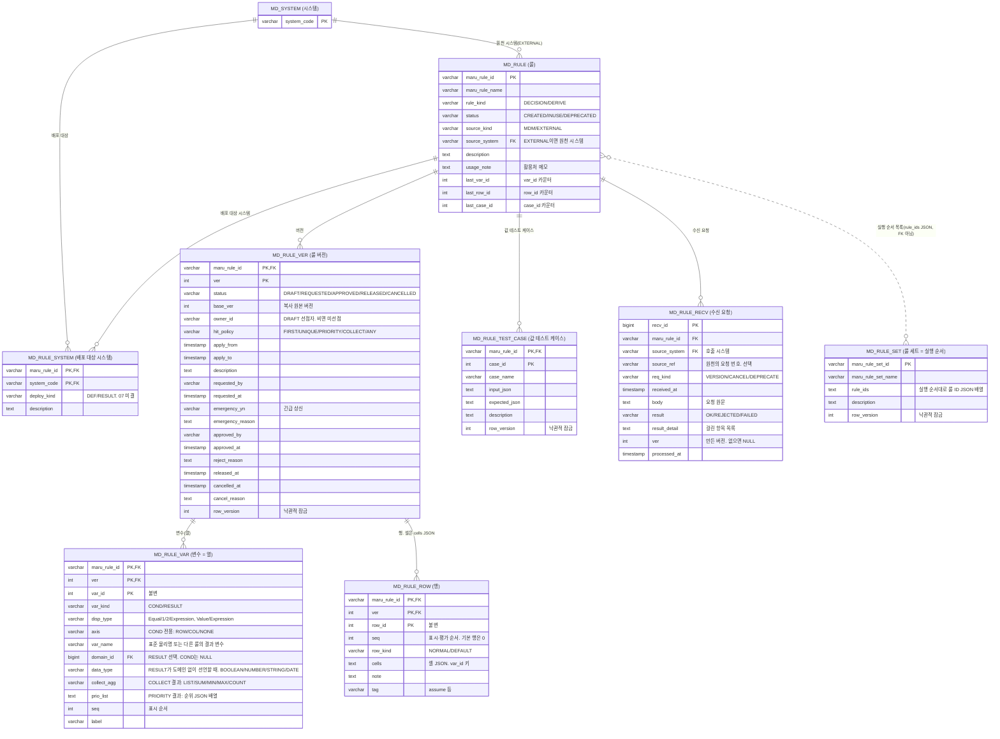

# 마루 MDM 설계: 업무기준(룰) 관리

> 분할 문서. 도메인 검증식·EvalEx 계약은 `02-term-domain-column.md`와 `evalex-guide.md`, 작업기준 칼럼 방식은 `workrule-column-design.md` 참조.

## 업무기준(룰) 관리

> 회의 #144의 업무기준(품질설계키 등) 결정과 기존 마루 룰엔진(TB_MR_RULE_*) 설계를 잇는 모델. 표현식 엔진은 도메인 검증과 동일하게 EvalEx 3.

### 기본 모델: 의사결정표

업무기준은 **왼쪽 조건 열 + 오른쪽 결과 열**로 이루어진 의사결정표(decision table)다. 조건이 참인 행의 결과 셀 값을 결과 변수에 대입한다.

```
[조건 열들]                          →  [결과 열들]
두께 >= 1.6 && 두께 < 2.5, 폭 > 1000  →  판정등급 = "A", 단가계수 = 1.05
```

- **대입은 표현식이 아니라 룰 엔진이 수행한다.** EvalEx에는 대입문이 없고, 있어서도 안 된다. 조건 셀은 boolean을 돌려주는 식, 결과 셀은 값을 돌려주는 식일 뿐이며, "참이면 결과 변수에 넣는다"는 동작은 Java 엔진이 `context.put(변수, 값)`으로 처리한다.
- 표현식에 부수효과가 없어야 캐시·병렬 평가·결과값 상호 검증(회의 #144)이 성립한다. `SET(변수, 값)` 같은 사용자 함수로 대입을 흉내 내는 것은 금지한다(`&&` 단락 평가·`IF` 지연 평가와 얽히면 대입 여부가 평가 순서에 의존).
- 조건과 대입을 스크립트 한 덩어리로 쓰지 않는다. 표 구조여야 시각화·겹침 검사·값 테스트가 가능하다. 회의 #144의 "복잡 로직은 코드단, 단순 조건만 MDM" 결론과 같은 축이다.

### 룰 구성 요소

| 구성                | 내용                                    |
| ----------------- | ------------------------------------- |
| 룰 헤더              | 룰명, 종류(DECISION/DERIVE), 버전, 적용시점, 승인, 배포 대상 시스템(「테이블 설계」), 원천(`source_kind`·`source_system`) |
| 룰 세트              | 룰 ID를 실행 순서대로 담은 목록. 버전·승인 없음. 저장하면 바로 배포 |
| 입력 변수             | 조건 셀과 결과 셀이 참조하는 컬럼(표준 물리명) 또는 앞 룰의 결과 변수. 컬럼 사전·도메인 참조       |
| 결과 변수             | 대입 대상 변수. 도메인 참조 → 결과값 타입·범위를 등록 시 검증 |
| 적중 정책(hit policy) | 여러 행이 참일 때 처리 방식. 아래 표                |
| 기본 행(default)     | 어느 행도 참이 아닐 때 결과. 선택이다. 없으면 결과 변수는 NULL이다(키는 두고 값만 NULL. 2026-09-09) |
| 행(record)         | 조건 셀 n개 + 결과 셀 m개                     |

**원천**

| 항목 | 규칙 |
| --- | --- |
| `source_kind` | `MDM` 또는 `EXTERNAL`. 룰을 만들 때 정하고 바꾸지 않는다. 여기서 `MDM`은 역할이며 MDM 역할을 맡은 인스턴스를 뜻한다(01 「한 줄 정의」, 2026-09-10) |
| `source_system` | EXTERNAL이면 필수. MD_SYSTEM FK. 수신 API는 이 시스템만 부를 수 있다 |
| 원천이 아닌 쪽의 저장 | 거부한다. EXTERNAL 룰은 MDM 화면에서 조회 전용이다. MDM 룰은 수신 API가 받지 않는다 |
| 정의도 원천 몫 | 원천이 EXTERNAL이면 룰명·설명·적중 정책·조건 열·결과 열·배포 대상 시스템까지 원천 시스템이 보낸다. 05의 마스터데이터는 정의를 MDM 담당자가 편집하지만 룰은 그렇지 않다(결정 2026-09-08) |
| 룰 세트 | MDM이 관리하는 목록이다. 원천을 두지 않으며 EXTERNAL 룰도 담을 수 있다 |

**적중 정책** (DMN 표준 용어 사용)

| 정책       | 동작                          | 용도                                   |
| -------- | --------------------------- | ------------------------------------ |
| FIRST    | 위에서부터 첫 번째 참인 행만 적용         | 우선순위 판정. 회의에서 말한 "제일 위부터 조건에 걸리는 형태" |
| UNIQUE   | 참인 행이 정확히 하나여야 함. 둘 이상이면 오류 | 겹치면 안 되는 등급 판정. 등록 시 겹침 검사 근거        |
| PRIORITY | 결과값에 우선순위를 두고 가장 높은 것 채택    | 여러 행이 겹칠 수 있는 판정                     |
| COLLECT  | 참인 행 전부의 결과를 모음(합·최대·목록)    | 가산 계수, 경고 목록                         |
| ANY      | 여러 행이 참이어도 결과가 같아야 함        | 중복 허용하되 일관성 검증                       |

**조건 셀은 두 가지로 적는다**

조건 열(변수)에는 표시 타입이 있다. Equal·1·2 열은 변수를 지정한 열이다. 셀은 op-code와 피연산자로만 적는다. 변수는 자동으로 왼쪽 주어가 되고 서버가 EvalEx 식을 만든다. Expression 열은 변수를 지정하지 않은 열이다. 셀에 자유 EvalEx 식을 쓴다. 교차 컬럼 조건은 여기로 온다. 평가 엔진은 한 종류만 둔다. 자유 표현식 셀은 도메인과 같은 원칙으로 **저장 시 1회 파싱해 표현식 텍스트와 AST JSON을 함께 저장**하고, 이후에는 재파싱하지 않는다. 표시 타입, op-code 표, 생성 규칙은 아래 「조건 열의 표시 타입과 op-code」 절에 있다.

**결과 셀**: 상수(`"A"`, `1.05`) 또는 표현식(`ROUND(BASE_FCT * 0.98, 2)`).

### 예: 품질 등급 판정 (FIRST 정책)

| #   | 두께 COIL_THK  | 폭 COIL_WID | 표면등급 SURF_GRD | → 판정등급 QLTY_GRD | → 단가계수 PRC_FCT              |
| --- | ------------ | ---------- | ------------- | --------------- | --------------------------- |
| 1   | `1.6 <= 변수 < 2.5` | `> 1000`   | `IN (A)`      | `"A"`           | `1.05`                      |
| 2   | `1.6 <= 변수 < 2.5` | `> 1000`   | `IN (B)`      | `"B"`           | `1.00`                      |
| 3   | `>= 2.5`     | `-`        | `NOT IN (C)`  | `"B"`           | `ROUND(BASE_FCT * 0.98, 2)` |
| 기본  |              |            |               | `"C"`           | `0.90`                      |

엔진 동작: 1행부터 조건 셀을 AND 평가 → 처음 참인 행의 결과 셀을 평가해 `QLTY_GRD`, `PRC_FCT`에 대입 → 종료. **적중한 행 번호를 결과와 함께 반환**하면 회의 #144의 "어느 조건에 걸렸는지 파악 불가" 문제가 해결된다.

이 표에서 두께 열은 2 타입, 폭 열과 표면등급 열은 1 타입이다. 3행의 `>= 2.5`는 2 타입 열에서 상한을 비운 셀이다. 저장된 값은 op `<= 변수 <`와 하한 `2.5`다. 화면이 이것을 `>= 2.5`로 요약해 보인다. 표시 타입은 아래 절에서 정한다.

### 조건 열의 표시 타입과 op-code

> 결정 2026-09-07. 기존 마루 룰(TB_MR_RULE_VAR)의 DISPLAY_TYPE 개념을 잇는다. 옛 설계이므로 개념만 쓰고 글루 연산자 사전과 CON1-20 고정 칼럼은 잇지 않는다(사용자 지시). EvalEx와 화면 인터프리터의 동작은 3.7.0 소스와 `js/evalex-ast-interpreter.js`를 실제로 돌려 확인한 것이다. 공식 문서에 없는 항목은 "소스 기준"으로 표시한다.

#### 표시 타입은 넷이다

조건 열 하나가 변수 하나다. 변수에 표시 타입을 둔다. 타입이 셀의 칸 수와 고를 수 있는 op를 정한다.

| 타입 | 변수 지정 | 셀 칸 | op | 셀 뜻 | 예 |
| --- | --- | --- | --- | --- | --- |
| Equal | 한다 | 값 1칸. 또는 `-` | 없다. `=`로 고정 | 변수가 값과 같다. String 값에 `%`·`_`가 있으면 패턴 | `"A"`, `1`, `TRUE`, `SGC%` |
| 1 | 한다 | op 1칸 + 값 칸. op에 따라 0칸·1칸·목록 | 단항 비교 op 12종 | 변수를 값 하나, 값 목록, 또는 NULL과 견준다 | `>= 1.6`, `= SGC%`, `IN (A, B)`, `CONTAINS CC` |
| 2 | 한다 | op 1칸 + 값 2칸 | 구간 op 4종. `<= 변수 <=` 같은 부등호 쌍 하나가 op다 | 변수가 구간에 든다. 한쪽 값은 비울 수 있다 | `1.6 <= 변수 < 2.5`, `0 < 변수 <= 100` |
| Expression | 안 한다 | 식 1칸. 또는 `-` | 없다 | 자유 EvalEx 식. 결과는 boolean | `COIL_THK * COIL_WID > 3000` |

규칙은 이렇다.

- **변수를 지정한 열은 변수가 자동으로 왼쪽 주어다.** 사용자는 op와 값만 고른다. 셀에 변수명을 다시 쓰지 않는다. 서버가 `변수 op 값` 꼴의 EvalEx 식을 만든다.
- **Expression 열은 입력 변수를 지정하지 않는다.** 열 이름만 있다. 식 안에서 여러 변수를 마음대로 참조한다. 식이 참조한 변수는 저장할 때 `getUsedVariables()`로 뽑아 검사하고, 룰의 입력 변수 목록에 등재한다. 그래야 엔진 계약 1(선언 변수는 레코드에 키가 있어야 한다)이 Expression 열만 있는 표에서도 성립한다.
- **변수는 두 곳에서 고른다.** 컬럼 사전의 컬럼, 또는 룰 세트에서 앞에 도는 다른 룰이 만드는 결과 변수다. 둘 중 어디에도 없으면 등록 거부다(workrule 5절). workrule의 룰 세트 예에서 `SPD_COL`과 `PAINT_CHG_CNT`가 앞 룰의 결과 변수를 조건 열로 쓰는 경우다.
- **타입은 열 단위다.** 같은 열의 모든 행이 같은 방식으로 적힌다. 열 타입을 바꾸면 그 열의 셀은 버린다. 자동 변환은 하지 않는다. 한 방향만 되는 변환은 넣지 않는다. 1 타입 열의 `>= 2.5`와 2 타입 열의 상한을 비운 `2.5 <= 변수`는 같은 집합이지만 중복 인코딩이 아니다. 한 열에는 한 타입만 있어서 같은 열 안에서는 표기가 하나다. 중복은 한 열 안에서만 따진다.
- **범위는 2 타입 열에만 적는다.** Equal·1 열에는 구간이 없다. 1 타입의 `>= 2.5`는 한쪽 경계 하나다. Expression 열에서 같은 변수를 대소 비교로 두 번 이상 견주는 식은 저장 시 검사가 거부하고 2 타입 열로 보낸다. 구조화된 셀만 겹침·빈틈을 계산할 수 있기 때문이다(2026-09-08).
- **데이터 타입은 저장하지 않는다.** 변수명은 컬럼 사전의 표준 물리명이다. 데이터 타입, 소수 자리수, 필수 여부, 도메인 종류는 컬럼 사전과 도메인에서 읽는다(02 "파생값을 저장하지 않는다"). 앞 룰의 결과 변수는 그 결과 열이 선언한 도메인에서, 도메인 없이 선언했으면 `data_type`에서 읽는다. 시스템별 필드명을 표준 물리명으로 바꾸는 일은 레코드를 만드는 어댑터가 한다.
- **컬럼 사전의 데이터 타입은 String과 Number 둘이다.** 02의 고정값(FLAG) 컬럼은 String이고 값은 도메인의 표준 검증식이 정한 허용 값(Y/N, T/F, 1/2/3/4/D 등)이다. 조건은 `= "Y"`처럼 적는다. Boolean 변수는 룰 세트 앞 단계가 만든 결과 변수에만 생긴다. 결과 열이 도메인 없이 `data_type`을 BOOLEAN으로 선언한다(02 도메인 종류에 Boolean은 없다. 결과 변수는 도메인 없이도 선언할 수 있다, 사용자 결정 2026-09-09). Boolean 변수는 Equal 또는 1 타입이고, 1 타입에서도 `=`, `IS NULL`, `IS NOT NULL`만 고를 수 있다.
- **2 타입과 대소 비교는 Number 변수와 일자 String 변수에만 연다.** 일자 String은 도메인 종류가 DATE이고 정밀도가 '일'이며 데이터 타입이 고정 길이 문자인 도메인이다. `YYYYMMDD`, `YYYYMM`, `YYYY`가 그것이다. 자리수가 고정이면 사전순이 곧 시간순이다(02 일자 도메인). 초 정밀도 DATE 도메인에는 열지 않는다. 그 밖의 String에도 열지 않는다. `'B' < 'a'`와 `'10' < '9'`가 참이 되어 현업이 버그로 읽기 때문이다.
- **결과 열에는 늘 결과 변수가 있다.** 표시 타입은 Value(상수)와 Expression(값 식) 둘이다. 둘로 두는 것은 기존 마루 데이터와 같다. 계산 전용 변수(OTHERS)는 조건 열도 결과 열도 아니다. `workrule-column-design.md`의 산출 룰(DERIVE) 결과 변수로 옮긴다.

#### op-code 표

| 코드 | 표기 | 타입 | 데이터 타입 | 피연산자 | 생성 EvalEx (V = 변수, L·R = 값) |
| --- | --- | --- | --- | --- | --- |
| NA | `-` | 전부(Equal, 1, 2, Expression) | 전부 | 없음 | 식을 만들지 않는다. 평가 목록에서 뺀다 |
| EQ | `=` | Equal(고정), 1 | 전부 | 값 1 | `V != NULL && V == L`. String 값에 `%`·`_`가 있으면 `V != NULL && STR_MATCHES(V, "정규식")` |
| NE | `<>` | 1 | String, Number | 값 1 | `V != NULL && V != L` |
| LT | `<` | 1 | Number, 일자 String | 값 1 | `V != NULL && V < L` |
| LE | `<=` | 1 | Number, 일자 String | 값 1 | `V != NULL && V <= L` |
| GT | `>` | 1 | Number, 일자 String | 값 1 | `V != NULL && V > L` |
| GE | `>=` | 1 | Number, 일자 String | 값 1 | `V != NULL && V >= L` |
| IN | `IN` | 1 | String, Number | 값 목록 | `V != NULL && (V == L1 \|\| V == L2 \|\| …)` |
| NOT_IN | `NOT IN` | 1 | String, Number | 값 목록 | `V != NULL && V != L1 && V != L2 && …` |
| CODE_IN | `IN 카테고리` | 1 | 코드 도메인 String만 | 카테고리 1 | `V != NULL && MASTER("<마루 코드>", "<카테고리>", V)`. 마루 코드는 변수의 도메인이 참조하는 것이고 카테고리는 값이다. 평가 시각의 사본 버전으로 판정한다(2026-09-09) |
| CONTAINS | `CONTAINS` | 1 | String. 코드 도메인도 된다(2026-09-09). 일자 도메인은 제외 | 값 1 | `V != NULL && INSTR(V, "값") > 0`. 변수가 값을 포함한다 |
| INSTR | `INSTR` | 1 | String. 코드 도메인도 된다(2026-09-09). 일자 도메인은 제외 | 값 1 | `V != NULL && INSTR("값", V) > 0`. 변수가 값의 일부다 |
| IS_NULL | `IS NULL` | 1 | 전부 | 없음 | `V == NULL` |
| NOT_NULL | `IS NOT NULL` | 1 | 전부 | 없음 | `V != NULL` |
| `<= 변수 <=` | `<= 변수 <=` | 2 | Number, 일자 String | 값 2 | `V != NULL && V >= L && V <= R` |
| `<= 변수 <` | `<= 변수 <` | 2 | Number, 일자 String | 값 2 | `V != NULL && V >= L && V < R` |
| `< 변수 <=` | `< 변수 <=` | 2 | Number, 일자 String | 값 2 | `V != NULL && V > L && V <= R` |
| `< 변수 <` | `< 변수 <` | 2 | Number, 일자 String | 값 2 | `V != NULL && V > L && V < R` |

- **무관(`-`)은 셀을 비운 것과 다르다.** 무관은 `op = NA`인 셀로 저장한다. 셀이 아예 없으면 미완성이라 저장을 거부한다. 이 구분이 없으면 두 규칙이 같이 무너진다. 하나는 머지 규칙이다. 한쪽만 조건 열을 추가하면 상대 쪽 행의 그 셀을 `-`로 채운다. 다른 하나는 workrule의 미완성 검사다. `-`는 표시 타입과 무관한 셀 속성이다. Equal 열과 Expression 열에도 `-` 셀을 둔다.
- **2 타입의 op는 부등호 쌍 하나다(2026-09-08).** `<= 변수 <=`, `<= 변수 <`, `< 변수 <=`, `< 변수 <` 넷이다. 코드가 곧 표기다. BETWEEN 같은 이름을 따로 두지 않는다. op 문자열 안의 `변수`는 고정 글자이고 변수명이 들어가지 않는다. 입력과 저장은 연산자 하나다. 식을 만들 때만 비교 둘로 나눈다. op의 왼쪽 부등호를 뒤집고 오른쪽은 그대로 잇는다. `1.6 <= 변수 < 2.5`는 `V != NULL && V >= L && V < R`이다.
- **2 타입에서 한쪽을 비우면 그쪽 끝이 열린다.** 상한을 비우면 `2.5 <= 변수`이고 화면은 `>= 2.5`로 요약한다. 비운 쪽의 부등호는 뜻이 없다. 저장할 때 비운 쪽 부등호를 `<`로 정규화한다. 그래서 상한을 비운 셀의 op는 `<= 변수 <`와 `< 변수 <` 둘, 하한을 비운 셀의 op는 `< 변수 <=`와 `< 변수 <` 둘만 남는다. 양쪽을 다 비우면 거부하고 `-`를 쓰게 한다. 하한과 상한이 같으면 거부하고 Equal이나 1 타입의 `=`를 쓰게 한다. 거부하는 까닭은 이렇다. 머지는 셀을 (연산자, 값) 구조로 견준다. 같은 집합을 두 가지로 적을 수 있으면 뜻이 같은 셀을 바뀐 셀로 잡는다.
- **IN 목록은 셀 JSON의 배열로 저장한다.** 구분자·따옴표·공백 규약을 두지 않는다. 값 안에 콤마가 있어도 문제가 없다. 화면은 콤마나 엔터로 끊어 칩으로 쌓는다. 원소 하나짜리 목록도 허용한다. 겹침 계산과 머지 비교는 집합으로 하므로 `= A`와 `IN (A)`를 같은 것으로 본다. 빈 목록은 거부하고 중복 원소는 지운다. 저장할 때 원소를 정규화한 뒤 정렬하므로 집합이 같으면 생성 텍스트도 같다. 원소 수 상한은 운영 설정으로 둔다. OR 사슬이 원소 수만큼 길어지기 때문이다.
- **`IN 카테고리`(CODE_IN)는 코드 카테고리 소속이다(사용자 결정 2026-09-09).** 1 타입이고 코드 도메인 변수 전용이다. 값은 그 변수의 도메인이 참조하는 마루 코드의 카테고리 ID 하나이고, 생성기가 `V != NULL && MASTER("<마루 코드>", "<카테고리>", V)`를 만든다. 마루 코드 ID는 셀에 저장하지 않고 배포 스냅샷을 조립할 때 도메인에서 읽는다. "공정코드가 도금 공정 카테고리에 속한다"를 셀 하나로 적고, IN에 코드를 나열할 때와 달리 코드가 바뀌어도 룰을 고칠 일이 없다. 판정은 평가 시각의 사본 버전으로 한다(「엔진 골격」 엔진 계약). 소속이 실행 시점에 풀리므로 겹침·빈틈 검사는 늘 겹치는 것으로 본다. 부정형(카테고리 비소속)은 두지 않는다. 필요하면 Expression 열에 `V != NULL && MASTER(…) == FALSE`로 적는다.
- **`=` 값에 `%`나 `_`가 있으면 DB의 LIKE처럼 패턴이다(2026-09-08. LIKE op를 없애고 `=`에 접었다).** `%`는 0글자 이상, `_`는 한 글자다. 글자 그대로 쓰려면 `\%`, `\_`, `\\`로 막는다. Equal 열의 값도 같다. 사용자는 정규식을 치지 못한다. 정규식은 Expression 셀의 `STR_MATCHES`에서만 쓴다. 생성기는 `A%`·`%A`·`%A%` 단순형을 먼저 가려내 `STR_STARTS_WITH`·`STR_ENDS_WITH`·`INSTR`로 만든다(「EvalEx 생성 규칙」). 나머지만 정규식이다. 서버가 정규식 메타문자(`\ ^ $ . | ? * + ( ) [ ] { }`)를 한 글자씩 백슬래시로 막은 뒤 막지 않은 `%`를 `.*`로, `_`를 `.`으로 바꾼다. 결과 정규식에는 리터럴과 `.`, `.*`만 남는다. Java 전용 문법이 섞일 수 없으므로 화면 `new RegExp()`의 SyntaxError는 생기지 않는다. ReDoS는 따로 막아야 한다. `%`가 여럿이면 `.*`가 줄줄이 붙어 백트래킹이 터진다. 와일드카드 아홉 개짜리 패턴을 40자 값에 견주면 화면에서 30초가 넘게 걸리는 것을 확인했다. 그래서 생성기가 연속한 `%`를 하나로 접고, 패턴 안의 `%` 개수를 3개로 제한한다. 서버는 `regexTimeoutMillis`가 끊어 판정 오류를 내지만 화면 정규식에는 타임아웃이 없다. 앵커는 붙이지 않는다. 서버 `STR_MATCHES`는 `matches()` 전체 일치이고 화면 인터프리터도 `^(?:…)$`로 감싼다. 패턴이 `%` 하나뿐이면 거부하고 `-`나 `IS NOT NULL`을 쓰게 한다. 패턴 해석은 String 변수에서만 한다. Number 값은 타입 검사에서 걸린다. 코드 도메인 변수는 값을 코드 목록에서 고르므로 패턴이 없다. 일자 도메인은 고정 길이 문자라 `%`·`_`를 거부한다. `<>`·`IN`·`NOT IN`의 값은 글자 그대로다. 패턴 부정은 없다. 행을 나누거나 Expression으로 적는다.
- **CONTAINS와 INSTR은 값을 문자 그대로 찾는다(2026-09-08).** 방향이 반대다. `CONTAINS CC`는 변수 안에 `CC`가 있는가이고, `INSTR ABCD`는 변수가 `ABCD` 안에 있는가다. Oracle `INSTR(문자열, 부분)`의 인자 순서 그대로다. 와일드카드가 없다. `*`·`?`도 글자다. 둘 다 커스텀 함수 `INSTR(s, sub)`로 만든다. 1부터 센 위치를 돌리고 없으면 0이다. 대소문자를 구분한다. EvalEx 표준 `STR_CONTAINS`는 대소문자를 무시하므로 쓰지 않는다. 정규식이 아니라 `Pattern.compile`도 ReDoS도 없다. 빈 값은 거부한다. 모든 값이 적중하기 때문이다. 화면은 `indexOf`로 견준다. 코드 도메인 변수에도 연다(사용자 결정 2026-09-09). 옛 룰의 `INSTR('SGCC,SGHC,SGCH', STL_GRD)`를 그대로 잇는 데 쓴다. 값은 글자 그대로이므로 코드 참조 검사는 하지 않는다. 일자 도메인 변수에는 열지 않는다.
- **피연산자는 리터럴만이다.** 다른 변수 참조와 산술을 넣지 않는다. 넣으면 셀이 구간이 아니게 되어 겹침·빈틈 검사가 무너진다. 변수끼리 견주는 조건은 Expression 열로 보낸다.
- **대소문자는 구분한다.** 두 엔진 모두 문자열 비교가 대소문자를 구분한다. 코드값의 대소문자 정규화는 도메인이 할 일이다.
- **글루 사전과의 대응.** `=`·`EQUAL` → EQ, `<` `<=` `>` `>=` → LT·LE·GT·GE, `BETWEEN` → 2 타입 열의 `<= 변수 <=`, `IN`·`NOT_IN` → IN·NOT_IN, `LIKE`와 `*`가 든 `=` → `=` 패턴, `IS_NULL`·`NOT_NULL` → IS_NULL·NOT_NULL, `NOT_CHECK` → NA. CONTAINS·INSTR은 사전에 없는 새 op다(2026-09-08). `IN 카테고리`(CODE_IN)도 사전에 없다(2026-09-09). `*`의 뜻은 미결이다. 0글자 이상이면 `%`, 사전 주석대로 한 글자라면 `_`로 바꾼다. `BETWEEN1-4`와 `LIKE1-3`은 뜻이 남아 있지 않아 대응을 두지 않는다.

CONTAINS·INSTR 예. 규격명 `SPEC_NM`은 자유 문자열, 강종 `STL_GRD`는 코드다.

| 변수 | op | 값 | 셀 요약 | 변수 값 | 결과 | 생성 식 |
| --- | --- | --- | --- | --- | --- | --- |
| `SPEC_NM` | CONTAINS | `SGCC` | `CONTAINS SGCC` | `JIS G3302 SGCC` | 참. 규격명에 강종이 들어 있다 | `V != NULL && INSTR(V, "SGCC") > 0` |
| `SPEC_NM` | CONTAINS | `SGCC` | 같다 | `JIS G3302 SGHC` | 거짓 | 같다 |
| `SPEC_NM` | CONTAINS | `sgcc` | `CONTAINS sgcc` | `JIS G3302 SGCC` | 거짓. 대소문자 구분 | `V != NULL && INSTR(V, "sgcc") > 0` |
| `SPEC_NM` | CONTAINS | `G3302%` | `CONTAINS G3302%` | `JIS G3302 SGCC` | 거짓. `%`는 글자다. 패턴은 `= %G3302%`로 | `V != NULL && INSTR(V, "G3302%") > 0` |
| `STL_GRD` | INSTR | `SGCC,SGHC,SGCH` | `INSTR SGCC,SGHC,SGCH` | `SGHC` | 참. 옛 룰의 `INSTR('SGCC,SGHC,SGCH', STL_GRD) > 0` 그대로 | `V != NULL && INSTR("SGCC,SGHC,SGCH", V) > 0` |
| `STL_GRD` | INSTR | 같다 | 같다 | `GC` | 참. 값의 일부면 된다. 목록 뜻이면 `IN (SGCC, SGHC, SGCH)`을 쓴다 | 같다 |
| `STL_GRD` | INSTR | 같다 | 같다 | `SGCH2` | 거짓 | 같다 |
| `STL_GRD` | INSTR | 같다 | 같다 | NULL | 거짓. 가드 | 같다 |

#### 값이 없는 변수는 어느 조건에도 걸리지 않는다

정책은 한 줄이다. **변수 값이 NULL이면 `IS NULL` 셀만 참이다. 나머지 셀은 전부 거짓이다. `-`는 값을 보지 않는다. 예외는 내지 않는다.** 값 공간이 `도메인 값 ∪ {NULL}`로 닫히므로 겹침·빈틈 계산에 NULL 구간이 빠지지 않는다.

이 정책을 생성 규칙 하나로 만든다. NA·IS_NULL·NOT_NULL 셋만 빼고 모든 op-code 셀의 식은 `V != NULL && (본체)` 꼴이다. op마다 가드를 붙일지 말지 가르지 않는다. 사람이 생성 텍스트를 읽을 때 기억할 규칙이 하나여야 한다.

가드가 필요한 근거는 두 엔진의 실제 동작이다(소스 기준).

| 연산 | EvalEx 3.7.0 | 화면 인터프리터 | 가드의 역할 |
| --- | --- | --- | --- |
| `==` | 한쪽만 NULL이면 타입 불일치로 거짓. 둘 다 NULL이면 참 | 같다 | 없어도 결과가 같다. 규칙을 하나로 두려고 붙인다 |
| `!=` | 한쪽만 NULL이면 참 | 같다 | **가드가 뜻을 정한다.** 없으면 값이 없는 레코드가 `<> A`와 `NOT IN` 행에 적중한다 |
| `< <= > >=` | NullPointerException | `비교할 수 없는 타입` 예외 | 없으면 행 평가가 죽는다 |
| `STR_MATCHES` | NullPointerException | `str(null)`을 문자열 `null`로 만들어 검사 | 없으면 두 엔진이 갈린다 |
| `INSTR` | 커스텀. 인자가 NULL이면 NULL을 돌린다 | 같다 | 가드가 앞에 있어 생성 식에서는 NULL이 닿지 않는다. Expression 셀에서 `INSTR(A, B) > 0`의 NULL은 대소 비교 NULL 규칙을 탄다 |
| `&&`, `\|\|` | 왼쪽으로 결과가 정해지면 오른쪽을 평가하지 않는다(`operandsLazy`). 오른쪽을 평가했는데 그 값이 NULL이면 NullPointerException | 단락 평가는 같다. 오른쪽 값이 NULL이면 거짓 | 가드 셀은 왼쪽이 boolean이라 안전하다. Expression 셀은 이 갈림을 그대로 탄다 |
| `!`, `NOT()` | NullPointerException | `!bool(null)` = 참 | 갈린다. **생성하지 않는다.** 부정은 `!=`와 `<`·`>`로 펼친다 |

엔진 계약 넷이 이 정책의 전제다. 아래 「엔진 골격」 절에 같이 적었다.

1. 룰의 입력 변수 목록은 조건 열 변수, Expression 셀의 참조 변수, 결과 식의 참조 변수를 합친 것이다. 저장하지 않고 배포 스냅샷을 조립할 때 계산해 싣는다. 이 목록의 변수는 레코드에 키가 있어야 한다. 값이 NULL인 것은 정상이고, 키가 없으면 판정 오류다. `lenientMode`는 켜지 않는다. 02 도메인 검증기의 "요구 컬럼이 컨텍스트에 없으면 실패"와 같은 축이다.
2. 엔진은 평가 직전에 레코드 값을 변수의 데이터 타입으로 바꾼다. Number는 BigDecimal, String은 String, Boolean은 Boolean이다. 화면은 Number를 decimal.js `Decimal`로 바꾼다. 바꾸지 못하면 판정 오류다. 이 계약은 룰 평가와 도메인 검증 양쪽에 적용한다(02 실행 순서 3단계, 2026-09-09). 두 엔진의 혼합 타입 규칙이 서로 다르기 때문이다. EvalEx는 `==`·`!=`에서 양쪽 타입이 다르면 값을 보지 않고 거짓이다. 그래서 `3 == "3"`이 거짓이다. 대소 비교는 왼쪽 타입으로 오른쪽을 강제 변환한다. 화면 `equals()`는 한쪽이 Decimal이면 다른 쪽을 승격한다. 그래서 참이다. 타입이 섞이지 않으면 이 차이가 드러나지 않는다.
3. 레코드 키는 EvalEx 상수 이름과 겹치면 안 된다. `NULL` `TRUE` `FALSE` `PI` `E` `DT_FORMAT_ISO_DATE_TIME` `DT_FORMAT_LOCAL_DATE_TIME` `DT_FORMAT_LOCAL_DATE` 여덟이고 대소문자를 가리지 않는다. 두 엔진이 정반대로 움직이기 때문이다. 화면은 상수가 변수를 가린다. EvalEx는 기본 설정에서 변수가 상수를 지운다(`allowOverwriteConstants` 기본 true, 소스 기준). 그러면 `V != NULL` 가드의 `NULL`이 레코드 값으로 바뀌어 모든 가드가 한꺼번에 무너진다. 엔진 설정 팩토리는 `allowOverwriteConstants`를 false로 고정한다. 그러면 EvalEx가 상수 이름에 값을 넣는 순간 예외를 낸다. 엔진은 그 예외를 판정 오류로 올린다. 저장 시에는 변수명 검사가 같은 이름을 막는다.
4. Expression 셀에는 가드를 넣지 않는다. 넣을 자리를 기계가 정할 수 없다. 대신 Expression 셀의 결과가 NULL이면 엔진이 그 셀만 거짓으로 보고 경고를 남긴다. 평가 중 예외는 판정 오류로 올린다. 화면 편집기 옆에 안내를 상시로 둔다. "값이 없을 수 있는 변수는 `COALESCE`나 `!= NULL`로 막으라. `A > 1 && B`에서 `B`가 NULL이면 서버는 예외, 화면은 거짓이다. `MASTER(id, cate, key, attr)`는 항목이 유효하지 않으면 NULL이다. `!= 값`으로 쓰면 닫힌 항목이 적중한다. `MASTER(id, cate, key) && …`로 존재를 먼저 확인하거나 `COALESCE`로 막으라."

#### EvalEx 생성 규칙

| 항목 | 규칙 |
| --- | --- |
| 변수 위치 | 변수를 늘 왼쪽에 둔다. EvalEx는 대소 비교에서 왼쪽 피연산자 타입으로 오른쪽을 변환한다(소스 기준) |
| 문자열 | 큰따옴표만 쓴다. 값 안의 `\`는 `\\`로, `"`는 `\"`로 바꾼다. 그 밖의 글자 앞에는 백슬래시를 붙이지 않는다. EvalEx 토크나이저는 백슬래시 뒤 여덟 글자만 알고 나머지는 파싱 오류를 낸다. 별표와 한글은 그대로 넣는다. 개행·탭 같은 제어문자는 저장 시 거부한다 |
| 숫자 | 평문 십진만 쓴다. 지수 표기와 16진수는 만들지 않는다. 저장할 때 선행 `+`, 정수부 앞 0, 소수 끝 0을 지운다(`1.60` → `1.6`). 두 엔진 모두 값으로 견주므로 판정은 같고 저장 표기가 하나가 된다. 도메인 소수 자리수를 넘는 입력은 반올림하지 않고 거부한다. 경계값이 말없이 옮겨지면 겹침 결과가 바뀐다 |
| 음수 | `V >= (-1.5)`처럼 괄호로 감싼다. EvalEx에 음수 리터럴 토큰이 없고 접두 마이너스로 파싱된다. 생성기가 우선순위를 따지지 않게 하려는 것이다 |
| 불린 | `TRUE`, `FALSE`를 맨 이름으로 쓴다. 두 엔진 모두 사전 정의 상수다. `V == TRUE`로 만들고 `V`나 `!V`로 줄이지 않는다 |
| 일자 | 문자 그대로 `"20260907"`. `DT_` 계열 함수는 만들지 않는다. 화이트리스트에 없다 |
| 2 타입 | op의 왼쪽 부등호는 뒤집는다. `<=`면 `V >= L`, `<`면 `V > L`. 오른쪽 부등호는 그대로다. `<=`면 `V <= R`, `<`면 `V < R`. 앞에 `V != NULL &&`를 붙이고 둘을 `&&`로 잇는다 |
| 열린 끝 | 2 타입에서 비운 쪽의 비교는 만들지 않는다. 상한을 비운 `<= 변수 <`는 `V != NULL && V >= L`, `< 변수 <`는 `V != NULL && V > L`이다. 하한을 비운 `< 변수 <=`는 `V != NULL && V <= R`, `< 변수 <`는 `V != NULL && V < R`이다 |
| 결과 Value | 결과 Value 셀도 리터럴 하나짜리 식 텍스트로 만든다. 문자열·숫자·불린 규칙을 그대로 쓴다. 엔진은 조건 셀과 결과 셀을 같은 방식으로 평가한다 |
| 등호 표기 | `==`와 `!=`만 쓴다. `=`·`<>`도 EvalEx가 받지만 생성 텍스트를 하나로 고정한다 |
| `=` 패턴 단순형 | 정규식으로 가기 전에 모양을 본다(2026-09-08). `%`가 끝에 하나뿐(`A%`)이면 `STR_STARTS_WITH(V, "A")`, 앞에 하나뿐(`%A`)이면 `STR_ENDS_WITH(V, "A")`, 앞뒤 하나씩(`%A%`)이면 `INSTR(V, "A") > 0`이다. 셋 다 `V != NULL &&` 가드를 붙인다. `A`에 `%`·`_`가 없을 때만이다. 그 밖의 모양만 `STR_MATCHES`다. 정규식은 컴파일·백트래킹 비용이 있고 ReDoS 검사가 따라붙는다. 상세설계에서 전부 정규식으로 만들지 않도록 여기 적어 둔다. `STR_STARTS_WITH`·`STR_ENDS_WITH`는 대소문자를 구분한다. 화면은 `startsWith`·`endsWith`·`indexOf`다 |
| `=` 패턴 정규식 | 단순형이 아닐 때만. 위 2단계 생성 뒤 문자열 리터럴 규칙을 한 번 더 적용한다. 백슬래시가 겹친다. 예: 사용자가 `A.B%`를 넣으면 정규식은 `A\.B.*`, 생성식은 `STR_MATCHES(V, "A\\.B.*")`다 |
| 셀 독립 | 셀마다 식 하나다. 행 안의 셀을 `&&`로 이어 붙이지 않는다. 엔진이 `allMatch`로 AND 한다. 이점은 셋이다. 우선순위를 따질 일이 없다. 어느 셀에서 떨어졌는지 셀 단위로 짚을 수 있다. 한 셀의 NULL이 다른 셀에 닿지 않는다. 괄호는 IN의 OR 묶음과 음수 리터럴에만 쓴다 |
| 무관 | 식을 만들지 않는다. 행의 조건 셀이 전부 `-`면 그 행은 항상 참이다. 저장에는 `NA` 셀로 남긴다 |
| 결정성 | 같은 구조는 어디서 만들어도 바이트가 같은 텍스트가 된다. IN 목록 순서(저장할 때 정렬한 `seq`), 공백, 숫자 정규화가 모두 여기에 걸린다. 생성기에 회귀 테스트를 붙인다 |

#### 언제 만들고 무엇을 저장하는가

| 시점 | 하는 일 | 저장·전달 |
| --- | --- | --- |
| DRAFT 저장 | 셀마다 식을 만들어 EvalEx로 파싱한다. `=` 패턴은 생성한 정규식을 `Pattern.compile`로 따로 컴파일한다. 하나라도 실패하면 저장 거부. 만든 식은 버린다 | op-code 셀은 구조(op, 값·목록)만 저장한다. 텍스트도 AST도 저장하지 않는다(02 "파생값을 저장하지 않는다"). Expression 셀은 텍스트와 AST JSON을 함께 저장한다(02 AST 1회 생성). `=` 패턴의 정규식 문자열은 저장 응답에 실어 화면이 미리보기에 쓴다 |
| 배포 스냅샷 조립 | 서버가 셀마다 식 텍스트를 한 번 만든다. 입력 변수 목록도 여기서 계산한다 | 구조와 텍스트를 같이 싣는다. Expression 셀은 텍스트와 AST JSON을 싣는다. 하위 시스템은 텍스트만 컴파일한다. 평가 입력은 식 텍스트라는 의존성 규칙 5를 지킨다. 무엇을 평가했는지 텍스트로 감사할 수 있다 |
| 서버·하위 시스템 평가 | 스냅샷 텍스트를 컴파일해 캐시하고 `copy()` 사본으로 평가한다 | 하위 시스템은 생성기를 돌리지 않는다. 생성기 버그를 고치면 재배포해야 판정이 바뀐다. 그게 맞다 |
| 값 테스트 | DRAFT 정의를 스냅샷 없이 판정한다. 서버가 그 자리에서 생성기를 돌려 텍스트를 만들고 같은 엔진으로 평가한다 | 텍스트는 저장하지 않는다. 스냅샷 조립과 같은 생성기라 결과가 같다 |
| 화면 미리보기 | op-code 셀은 구조를 직접 견준다. 파서를 쓰지 않는다. Number는 `Decimal`로, String과 일자 String은 UTF-16 코드유닛 순서로, Boolean은 값으로 견준다. 값이 NULL이면 `IS NULL`만 참이고 `-`는 참이며 나머지 op는 거짓이다. 위 NULL 정책과 같다. `=` 패턴의 단순형은 `startsWith`·`endsWith`·`indexOf`이고 나머지는 서버가 준 정규식 문자열을 그대로 쓴다. CONTAINS·INSTR은 `indexOf`다. `IN 카테고리`는 `CODE_LIST` 조회 API로 받아 둔 그 카테고리의 코드 집합에 값이 있는지로 견주고, 받아 두지 않았으면 서버 API로 폴백한다(evalex-guide 8.5). Expression 셀만 AST 인터프리터로 평가하고 `isSupported()`가 거짓이면 서버 API로 폴백한다 | 화면 결과와 서버 결과가 다르면 서버가 기준이다 |

생성기는 `engine.rule`에 둔다. 부르는 쪽은 서버뿐이다. 자리는 둘이다. 배포 스냅샷을 조립할 때, 그리고 값 테스트처럼 스냅샷 없이 DRAFT를 판정할 때다. 하위 시스템의 jar에도 같은 코드가 들어 있지만 부르지 않는다. 하위 시스템은 스냅샷의 텍스트만 컴파일한다.

변환기는 넷이고 전부 룰을 수행하는 쪽에 있다. 셋은 엔진 모듈 안이고 하나는 화면 JS다.

| 변환 | 자리 | 부르는 쪽 |
| --- | --- | --- |
| op-code 셀 → EvalEx 텍스트 | `engine.rule` 생성기 | 서버. 스냅샷 조립, 값 테스트 |
| EvalEx 텍스트 → EvalEx 내부 트리(컴파일) | EvalEx 라이브러리 자체 | 평가하는 모든 곳. 서버와 하위 시스템 |
| EvalEx 내부 트리 → AST JSON | `engine.expr`의 `AstExporter` | 서버. Expression 셀을 저장할 때 |
| AST JSON → 값 | `js/evalex-ast-interpreter.js` | 화면 미리보기 |

op-code 셀은 서버와 화면이 진짜로 다른 코드를 도는 유일한 자리다. 서버는 생성한 텍스트를 EvalEx로 평가하고 화면은 구조를 JS로 견준다. 그래서 정합성 테스트 코퍼스가 선택이 아니라 필수 산출물이다. 코퍼스 항목은 (셀 JSON, 변수 값, 기대 결과)다. 반드시 넣을 것은 다음과 같다.

- op마다 NULL 입력
- 구간 op 4종의 경계값 그 자체, 열린 끝 4종의 경계값
- `1.10`과 `1.1`
- 변수 타입과 어긋난 값
- 원소 하나짜리 IN
- `IN 카테고리`의 소속 코드, 비소속 코드, 닫힌 코드, NULL
- 일자 문자열 구간
- `=` 패턴의 단순형 셋(`A%`, `%A`, `%A%`)과 단순형이 아닌 `A%B`, `.`·`\`가 든 값, `%` 3개짜리, `\%`·`\_` 이스케이프, `_`만 있는 패턴, `%`·`_` 없는 값(정확 일치)
- CONTAINS·INSTR의 메타문자(`.`·`*`·`\`)가 든 값. 글자 그대로 찾아야 한다. 대소문자가 다른 값은 불일치. 두 방향 각각
- 상수 이름과 겹치는 레코드 키

#### 저장 항목

테이블은 아래 「테이블 설계」 절에 있다. 셀은 행의 JSON 한 칸(`cells`)에 `var_id`를 키로 둔다. 셀 객체의 키는 `op`, `left`, `right`, `list`, `expr`, `ast`, `val` 일곱이다. 열 타입별 모양은 「테이블 설계」의 「셀 JSON」 표에 있다. CON1-20·RSLT1-15 고정 칼럼은 잇지 않는다. 자유식의 AST와 IN 목록이 고정 칸에 들어가지 않고, 머지가 `row_id`로 행을 견주기 때문이다.

#### 화면은 이렇게 보인다

- **열 머리.** Equal·1·2 열은 화면 표시명, 표준 물리명, 데이터 타입 배지를 보인다. 화면 표시명은 `MD_RULE_VAR.label`이고, 비어 있으면 컬럼 사전의 표시명 3종 가운데 열 폭에 맞는 것을 쓴다(02 「화면 표시명 3종」, 결정 2026-09-09). 논리명은 화면에 쓰지 않고 툴팁에 보인다. Number면 소수 자리수도 보인다. 일자 도메인이면 "일자" 배지를 달아 구간 op가 왜 뜨는지 알린다. Expression 열은 "자유식" 배지와 참조 변수 목록을 보인다. 결과 열은 결과 변수명과 도메인명, 도메인이 없으면 데이터 타입을 보인다.
- **변수 등록.** 표시 타입을 고르면 변수 지정 칸이 켜지거나(Equal·1·2) 꺼진다(Expression). 변수는 컬럼 사전의 컬럼과 앞 룰의 결과 변수 중에서 고른다. 어디에도 없으면 등록 거부다.
- **op 드롭다운은 데이터 타입으로 줄어든다.** Equal 열과 Expression 열은 드롭다운이 없다. 1 타입 열의 목록은 넷이다. String이면 `- = <> IN NOT IN CONTAINS INSTR IS NULL IS NOT NULL` 9줄이다. Number면 `- = <> < <= > >= IN NOT IN IS NULL IS NOT NULL` 11줄이다. 일자 String이면 Number와 같은 11줄이다. 패턴 `=`·CONTAINS·INSTR은 일자에 열지 않는다. 코드 도메인 String이면 여기에 `IN 카테고리`가 더해진다(2026-09-09). Boolean이면 `- = IS NULL IS NOT NULL` 4줄이다. 2 타입 열은 `-`, `<= 변수 <=`, `<= 변수 <`, `< 변수 <=`, `< 변수 <` 5줄이다. 고른 op를 그대로 저장한다. 최근 쓴 op를 위로 올리지 않는다. 자리가 흔들리면 잘못 고른다.
- **무관 토글.** Equal 열과 Expression 열에는 op 드롭다운이 없으므로 셀 편집기에 '무관' 토글을 둔다. 토글을 켜면 값·식 칸을 비활성화하고 op를 NA로 저장한다.
- **셀 요약.** 셀은 평소에 한 줄 요약으로 보인다. `= "A"`, `>= 1.6`, `1.6 <= 변수 < 2.5`, `IN (A, B)`, `IN 카테고리 PLATING`, `= SGC%`, `CONTAINS CC`, `-`. 클릭하면 그 자리에서 칸이 펼쳐진다. 2 타입에서 한쪽을 비우면 요약이 `>= 1.6`이나 `< 2.5`로 바뀐다. 코드 도메인 변수의 `=`·`<>`·IN·NOT IN 값은 `CODE_LIST` 조회 API(02 「제약 관리」)가 주는 목록에서 고른다. 룰 식에 `CODE_LIST`를 쓰지는 않는다. `IN 카테고리`의 값은 그 마루 코드의 카테고리 목록에서 고른다. 02 CODE 도메인 화면이 코드 참조를 고를 때 쓰는 사본의 카테고리 목록과 같다.
- **패턴 미리보기.** `=` 값에 `%`·`_`가 있으면 서버가 만든 정규식과 사용자가 넣어 본 예시 문자열의 일치 여부를 보인다. 정규식 칸은 읽기 전용이다. CONTAINS·INSTR도 예시 문자열로 같은 미리보기를 보인다. 정규식 칸은 없다.
- **Expression 편집기.** 여러 줄 텍스트다. 변수와 표준 칸용 함수 자동완성을 붙이고, 화이트리스트 밖 이름은 즉시 붉게 보인다. 입력이 멈추면 디바운스로 서버 파싱 미리보기 API를 부른다.
- **값 테스트.** 입력 값을 넣으면 행마다 적중 여부를 칠하고, 떨어진 행은 첫 거짓 셀에 표시를 남긴다. 셀 단위로 식을 두었기 때문에 가능하다. 회의 #144의 "어느 조건에 걸렸는지 파악 불가"가 여기서 풀린다.

#### 저장 시 검사

| 검사 | 규칙 |
| --- | --- |
| 타입 | 값이 변수의 데이터 타입으로 파싱되어야 한다. Number 열에 문자열, Boolean 열에 TRUE/FALSE 밖의 값을 넣지 못한다. 지수·16진 표기는 거부. 이것은 미관이 아니라 정합성 조건이다. 타입이 어긋난 리터럴은 두 엔진의 판정을 가른다 |
| 변수 | 조건 열 변수는 컬럼 사전에 있거나 앞 룰의 결과 변수여야 한다. Expression 셀과 결과 식의 참조 변수도 같은 집합 안이어야 한다. DERIVE 룰의 결과 식은 같은 룰에서 `seq`가 앞선 결과 변수도 읽을 수 있다 |
| 산출 룰 순서 | DERIVE 룰의 결과 식은 자기 자신과 `seq`가 뒤인 결과 변수를 참조하지 못한다(workrule 5절) |
| op 허용 | 표시 타입과 데이터 타입이 그 op를 여는지 서버가 다시 본다. 화면 드롭다운이 이미 막지만 API 직접 호출에 대비한다 |
| 범위 자리 | 범위 연산자(구간 op 넷)는 2 타입 열에서만 받는다. 다른 열에 있으면 거부한다. Expression 셀 AST에서 같은 변수를 대소 비교(`<` `<=` `>` `>=`)로 두 번 이상 견주면 거부하고 2 타입 열로 보낸다(2026-09-08) |
| 경계 순서 | 2 타입은 하한 < 상한. 값으로 견준다. `1.10`과 `1.1`이 같으므로 문자열 비교가 아니다. 같으면 거부하고 `=`를 쓰게 한다. 양쪽 다 비면 거부. 비운 쪽 부등호는 `<`로 정규화한다 |
| 목록 | 빈 목록 거부, 중복 제거, 원소 수 상한 |
| `=` 패턴 | String 변수만. `%` 하나뿐이면 거부. 연속한 `%`는 하나로 접는다. `%` 개수 상한 3개. 패턴 길이 상한. 일자 도메인은 `%`·`_` 거부. 정규식 메타문자는 오류가 아니라 글자 그대로 막는다 |
| CONTAINS·INSTR | 빈 값 거부. 값 길이 상한. 와일드카드 없음. 값은 글자 그대로 |
| 도메인 범위 | 요구 컬럼이 없는 도메인의 유효 식만 값 하나로 평가해 본다. 통과하지 못하면 경고한다. 절대 참이 될 수 없는 셀일 가능성이 크다. 거부는 하지 않는다. 도메인이 나중에 바뀔 수 있다. 요구 컬럼이 있는 도메인과 CODE 종류는 이 검사를 건너뛴다 |
| 코드 참조 | 코드 도메인 변수의 `=`·`<>`·IN·NOT IN 값이 그 마루 코드에 있는지 `MASTER(id, cate, key)`로 확인한다. 시그니처는 05 「조회 함수와 사본 조회 API」, 마루 코드 판정 규칙은 02 제약 관리 절이 정한다. 평가 시각은 등록 시각이다. 없으면 경고만 한다. 미래 적용시점 코드를 미리 쓸 수 있어야 한다. `IN 카테고리` 값은 그 마루 코드의 카테고리여야 한다. 없으면 거부한다(2026-09-09) |
| MDM 참조 | Expression 셀의 `MASTER`·`MASTER_AT` 첫 인자 ID가 MD_CODE 또는 MD_DATA에 있고, 둘째 인자 카테고리가 그 아래에 있어야 한다. 마지막 인자 `attr`이 있으면 `"attr01"`-`"attr10"` 중 하나여야 하고, 그 대상(마루 코드는 MD_CODE, 마루 데이터는 MD_DATA)의 그 번호에 라벨이 있어야 한다. 마루 코드 대상에도 허용한다(결정 2026-09-09). 인자 수는 `MASTER`가 셋 또는 넷, `MASTER_AT`가 넷 또는 다섯이다. `MASTER_AT`의 넷째는 시각이다(2026-09-09). ID·카테고리·`attr`은 문자열 리터럴이어야 한다. AST를 훑어 검사하고 어긋나면 거부한다(05 「조회 함수와 사본 조회 API」) |
| 필수 컬럼 | 필수 컬럼에 `IS NULL`·`IS NOT NULL`을 쓰면 경고한다. 거부하지는 않는다. 이상 데이터를 잡는 행일 수 있다 |
| 미완성 | 조건 열과 NORMAL 행의 조합에 셀이 없으면 거부. 무관은 `-`로 명시한다. 결과 셀이 빈 행이 없어야 한다. 기본 행이 있으면 그 행도 포함이다. 축 조합을 전부 채우라고는 하지 않는다. 빠진 조합은 workrule 5절이 등록 시 경고만 한다 |
| 도달 불가 행 | 조건 셀이 전부 `-`인 NORMAL 행은 거부하고 기본 행으로 옮기게 한다. FIRST 표에서 앞 행들의 합집합이 뒤 행을 덮으면 경고한다. op-code 셀만으로 계산하고 Expression 셀이 낀 행은 건너뛴다(workrule 5절 열 판정 순서) |
| 겹침·빈틈 | 셀을 값 집합으로 바꿔 겹침을 본다. UNIQUE는 오류, 나머지 정책은 경고. 정적으로 못 푸는 셀이 있으면 그 사실을 경고한다. 아래 「겹침·빈틈 검사에 주는 것」 |
| 축 조합 완전성 | `MD_RULE_VAR.axis`가 ROW·COL인 UNIQUE 표에서 행 축과 열 축의 모든 조합에 행이 있는지 본다. 빠진 조합은 경고로 리포트한다(workrule 5절) |
| 생성해 보기 | 셀마다 식을 만들어 EvalEx 파싱을 통과해야 한다. 이스케이프 버그가 여기서 잡힌다. `=` 패턴은 생성한 정규식을 `Pattern.compile`로 따로 컴파일한다. 생성기는 화면 화이트리스트 안의 노드만 내도록 만들고 회귀 테스트로 지킨다. 만든 식은 버린다 |
| Expression | `getUsedVariables()`가 입력 변수 ∪ 앞 룰의 결과 변수 안에 들어야 한다. 함수는 표준 칸용 화이트리스트로 제한한다. `STR_MATCHES`의 정규식은 Java 전용 문법(`(?i)`, 소유 한정자 `a++`, 원자 그룹 `(?>…)`)을 거부한다. 화면 `new RegExp()`가 그 자리에서 SyntaxError를 내고 `isSupported()`는 패턴 문자열을 보지 않아 잡지 못한다. 중첩 수량자 검사도 같이 돈다. 결과 타입은 테스트 케이스로 확인한다. 조건 셀은 boolean이어야 하고 결과 셀은 결과 변수가 선언한 타입(도메인 또는 `data_type`)이어야 한다 |
| 변수명 | EvalEx 상수 이름 여덟 개(`NULL` `TRUE` `FALSE` `PI` `E` `DT_FORMAT_ISO_DATE_TIME` `DT_FORMAT_LOCAL_DATE_TIME` `DT_FORMAT_LOCAL_DATE`)는 변수명으로 쓰지 못한다. 대소문자를 가리지 않는다. 화면은 상수가 변수를 가리고 EvalEx는 변수가 상수를 지우므로 두 엔진이 갈린다 |
| 상수 사전 회귀 | 모든 가드가 `NULL` 상수 해석에 기댄다. `engine.expr` 설정 팩토리가 함수 사전을 갈아 끼울 때 상수 사전의 NULL·TRUE·FALSE가 남아 있는지, `allowOverwriteConstants`가 false인지 테스트로 잡는다 |

수신 시에는 저장 시 검사도 상신 시 검사도 돌리지 않는다. 원천이 생성·수정할 때 검증한다(「수신 API」, 결정 2026-09-09).

#### 겹침·빈틈 검사에 주는 것

op-code 셀은 값 집합으로 바뀐다. 정규형은 "겹치지 않는 구간의 목록"이고 값 공간은 `도메인 값 ∪ {NULL}`이다. 가드된 셀은 모두 NULL을 뺀 집합이다. 그래서 `<>`·`NOT IN`의 여집합도 닫혀서 계산된다. NULL을 덮는 셀은 `-`와 `IS NULL` 둘뿐이다. `IS NULL`은 `{NULL}` 한 점이라 가드된 다른 셀과 절대 겹치지 않는다. 둘 다 없는 열에서는 NULL이 늘 빈틈이다. 빈틈 리포트에 NULL 칸을 따로 보인다.

| 셀 | 겹침 계산 |
| --- | --- |
| Equal, 1, 2. 패턴 `=`·CONTAINS·INSTR은 제외 | 한다. 점, 반직선, 구간, 유한 집합, 여집합 |
| 패턴 `=` | 접두형(`A%`, `%`가 끝에 하나)만 `A <= 변수 < succ(A)` 반개구간으로 바꿔 계산한다. `succ(A)`는 A의 마지막 UTF-16 코드유닛에 1을 더한 문자열이다. 두 엔진이 UTF-16 코드유닛 순서로 같게 견주므로 성립한다. 값에 줄바꿈이 없다는 전제다. 대리쌍 경계에 걸리거나 그 밖의 패턴이면 겹치는 것으로 본다 |
| CONTAINS·INSTR | 계산하지 않는다. 늘 겹치는 것으로 본다 |
| `IN 카테고리`(CODE_IN) | 계산하지 않는다. 늘 겹치는 것으로 본다. 소속이 실행 시점의 사본 버전으로 풀린다 |
| Expression | 못 한다. 겹치는 것으로 보고 사람에게 보인다(「DRAFT와 시험 사본」 절) |

두 행은 **모든 조건 열의 셀이 각각 겹칠 때만** 겹친다. 이것이 다축의 일반 규칙이다. workrule 5절은 나머지 조건 값이 같은 행끼리 묶어 마지막 축으로 본다. 그것은 빈틈 리포트를 사람이 읽기 좋게 묶는 방법이다. 이 규칙 안에 든다. 값 구간 빈틈은 Number 열만 보고 소수 자리수 격자로 판정한다. NULL 빈틈은 모든 조건 열에서 본다. 소수 자리수 2인 두께 열에서 `1.6 <= 변수 < 2.5` 다음이 `2.5 < 변수 <= 3.0`이면 2.50이 빈틈이다. 빈틈은 경고다. 기본 행이 있어 빈틈이 곧 판정 실패가 아니다. UNIQUE 표에서 겹침은 오류, 나머지 정책에서는 경고다. UNIQUE 표에 비접두형 패턴 `=`·CONTAINS·INSTR·`IN 카테고리`나 Expression 셀이 있으면 겹침을 정적으로 못 푸므로 저장 시 경고하고 평가 시 UNIQUE 위반으로 잡는다.

#### 무엇을 넣지 않았나

| 뺀 것 | 이유 |
| --- | --- |
| 정규식 직접 입력 op | Java 전용 문법이 화면에서 SyntaxError로 터지고 `isSupported()`가 못 거른다. Expression 열의 `STR_MATCHES`로 보내고 거기서 저장 시 검사한다. 2026-09-08 재확인. op-code 셀의 패턴은 `%`·`_`뿐이다 |
| `LIKE` op | `=` 값의 `%`·`_`로 접었다(2026-09-08). DB 습관 그대로이고 op가 하나 준다 |
| 변수 대 변수 비교, 피연산자 산술 | 구간이 값에 따라 움직여 겹침·빈틈 검사가 정적으로 성립하지 않는다. Expression 열로 |
| `NOT BETWEEN` | 행을 둘로 나누면 된다. op가 하나 줄고 겹침 계산 갈래도 준다 |
| `STARTS_WITH`·`ENDS_WITH` op | 접두·접미는 `=`의 `%` 패턴으로 적는다. 포함은 CONTAINS·INSTR로 적는다(2026-09-08 추가). 둘 다 표준 `STR_CONTAINS`를 쓰지 않고 커스텀 `INSTR`로 만든다. `STR_CONTAINS`만 대소문자를 무시해 같은 드롭다운 안에서 규칙이 갈리기 때문이다 |
| 대소문자 무시 비교 | 위와 같다. 필요하면 Expression에서 `STR_UPPER`를 양쪽에 건다 |
| 네 번째 데이터 타입 Date와 `DT_` 함수 | 02의 일자 도메인이 고정 길이 문자다. 화이트리스트에 `DT_`가 없다. 타입을 늘리면 EvalEx의 날짜·문자열 비교 비대칭을 새로 떠안는다(소스 기준). 왼쪽이 문자면 문자로 견준다. 왼쪽이 날짜면 오른쪽을 날짜로 파싱하고, 파싱에 실패하면 1970년이 된다 |
| `!`·`NOT()` 생성 | NULL에서 EvalEx는 예외, 화면은 참이다. 부정은 원시 비교로 펼친다 |
| op-code 셀의 텍스트·AST 저장 | 파생값이다. 저장하면 구조와 어긋날 자리가 새로 생긴다 |

#### 미결

| 항목 | 정할 것 |
| --- | --- |
| 빈 문자열과 NULL | 02 도메인 검증기는 빈 값을 정규화한다. 룰 입력 어댑터도 같은 정규화를 하는지. `""`를 NULL로 보면 `IS NULL`이 빈 문자열까지 잡고 `= ""` 셀은 도달 불가가 된다. 값의 제어문자(줄바꿈)를 어댑터가 거부할지도 같이 정한다 |
| 일자 밖의 고정폭 String | 2 타입과 대소 비교를 일자 도메인에만 열었다. 다른 고정폭 코드와 초 정밀도 DATE에도 열려면 도메인 정규식이 길이를 고정하는지 판정하는 규칙과 리터럴 형식이 필요하다 |
| 상한값 | IN 원소 수, `=` 패턴 길이, CONTAINS·INSTR 값 길이, 조건 열 수, `regexTimeoutMillis`. 식 길이 제한과 스냅샷 용량에 걸린다 |
| 결과 열의 무관 | 어느 행에서 그 결과 변수에 대입하지 않는 것을 허용할지. 지금은 저장 시 검사가 모든 결과 셀을 채우게 해 사실상 금지한다 |
| 적중 정책 부속 정보 | 닫힘(2026-09-07). 결과 변수에 둔다. PRIORITY 순위 목록은 `MD_RULE_VAR.prio_list`, COLLECT 집계 방식은 `MD_RULE_VAR.collect_agg`다(「테이블 설계」) |
| 결과 셀 미리보기 | 화면이 결과 Expression 셀도 AST 인터프리터로 평가할지, 값 테스트에서 서버 결과만 보일지 |
| 기존 룰 이관 | 개념만 잇기로 했으므로 데이터 이관은 범위 밖이다. 이관하게 되면 순서는 이렇다. 먼저 CON_OP별 행 수를 센다. DISPLAY_TYPE이 아니라 CON_OP를 본다. Equal 열에 BETWEEN 행이 실제로 있기 때문이다. 새 설계는 범위를 2 타입 열에만 두므로 그런 열은 2 타입으로 옮긴다. `*`의 뜻과 NO·PRIOR 순서는 실데이터로 다시 판정해 정한다 |
| 추가 컬럼 값의 숫자 비교 | `MASTER`의 `attr` 인자로 읽은 추가 컬럼 값은 문자열이다(05 「조회 함수와 사본 조회 API」, 2026-09-09). 대소 비교가 필요하면 변환 함수를 둘지, 그 함수를 허용 함수 집합과 화면 인터프리터에 어떻게 넣을지 정한다 |
| 룰에서 계층 칸 읽기 | 04·05가 06으로 넘긴 미결이다. `MASTER`의 `attr` 인자에 `lvl1`-`lvl5`를 허용할지 정한다 |

### 엔진 골격 (Java, 서버)

```java
// 스냅샷 적재 시: 셀 텍스트마다 Expression을 한 번만 컴파일해 캐시(키는 식 텍스트)
// 평가 시: 캐시 원본에 값을 넣지 않고 copy() 사본에 넣는다 (copy()의 ParseException은 골격에서 생략)
// 평가 시 (FIRST 정책):
Map<String, Object> ctx = new HashMap<>(record);                 // 입력 변수
ctx.put("EVAL_TS", evalTs);                                      // 평가 시각. 호출자가 준 값, 없으면 현재 시각
for (RuleRow row : rule.rows()) {
    boolean hit = row.conditions().stream()
        .allMatch(c -> c.expression().copy().withValues(ctx).evaluate().getBooleanValue());
    if (hit) {
        for (ResultCell r : row.results()) {
            Object v = r.expression().copy().withValues(ctx).evaluate().getValue();
            ctx.put(r.variable(), v);                                // 여기가 '대입'
        }
        return new RuleResult(row.rowId(), row.seq(), ctx);         // 적중 행 + 결과
    }
}
return applyDefault(rule, ctx);
```

**엔진 계약.** 「조건 열의 표시 타입과 op-code」 절의 NULL 정책이 기대는 것이다. 골격에는 생략했지만 구현에는 들어간다.

- 룰의 입력 변수 목록은 조건 열 변수, Expression 셀의 참조 변수, 결과 식의 참조 변수를 합친 것이다. 배포 스냅샷에 실려 온다. 이 변수는 레코드에 키가 있어야 한다. 값이 NULL인 것은 정상이다. 키가 없으면 판정 오류다. `lenientMode`는 켜지 않는다. 02 도메인 검증기와 같은 규칙이다.
- 엔진은 평가 직전에 레코드 값을 변수의 데이터 타입으로 바꾼다. Number는 BigDecimal, String은 String, Boolean은 Boolean이다. 바꾸지 못하면 판정 오류다. 룰 평가와 도메인 검증 양쪽에 적용한다(02 실행 순서 3단계). EvalEx는 `==`에서 타입이 다르면 값을 보지 않고 거짓이고, 대소 비교에서는 왼쪽 타입으로 오른쪽을 변환한다(소스 기준). 숫자와 문자열이 섞이면 조용히 틀린 답이 난다.
- 평가 시각은 호출자가 검증 한 번·룰 세트 실행 한 번마다 하나를 주고, 주지 않으면 현재 시각이다. 엔진은 예약 키 `EVAL_TS`(초 단위 timestamp)로 ctx에 넣고 실행 로그에 남긴다. `MASTER`가 이 값으로 판정하고, 룰 세트가 룰 버전을 고를 때도 이 값을 쓴다. 함수가 시계를 직접 읽지 않으므로 같은 레코드·같은 스냅샷·같은 평가 시각이면 결과가 같다(2026-09-09. 02 「제약 관리」의 구 `CTX_BASE_DT`와 테이블 기준일 컬럼 주입을 대신한다). 레코드 키가 `EVAL_TS`와 겹치면 판정 오류다. 식이 `EVAL_TS`를 직접 쓰는 것은 변수 검사가 막는다(사용자 결정 2026-09-09. 열지 않는다. 오늘과 견주는 검증이 필요해지면 다시 보고, 그때 일자 도메인의 `YYYYMMDD` 문자열과 맞출 방법을 같이 정한다). 식 안에서 시점을 정하려면 `MASTER_AT`에 컬럼을 적는다.
- 레코드 키는 EvalEx 상수 이름과 겹치면 안 된다. 설정 팩토리가 `allowOverwriteConstants`를 false로 고정하므로 겹치면 EvalEx가 예외를 낸다. 엔진은 그것을 판정 오류로 올린다.
- 하위 시스템은 op-code 셀의 식 텍스트를 배포 스냅샷에서 받는다. 생성기를 돌리지 않는다. 서버는 값 테스트 때 생성기를 그 자리에서 돌린다. `-`(NA) 셀은 평가 목록에서 뺀다.
- Expression 셀의 결과가 NULL이면 엔진이 그 셀만 거짓으로 보고 경고를 남긴다. `getBooleanValue()`를 그대로 언박싱하면 박싱된 null이 풀리면서 행 평가 전체가 NullPointerException으로 죽는다. 평가 중 예외는 판정 오류로 올린다.

- **룰 세트**: 룰 여러 개를 순서대로 묶으면 앞 룰의 결과 변수(`QLTY_GRD`)를 뒤 룰의 조건에서 읽을 수 있다. 룰 간 대입 전파도 같은 `ctx`로 처리한다.
- 회의 #144의 "작게 쪼개 조합" 결론은 룰 세트로 구현한다. 큰 표 하나 대신 작은 룰 여러 개를 순서로 연결.

### 엔진 모듈: 별도 jar로 분리

> 결정 2026-09-04. 도메인 검증(02)과 업무기준(이 문서)이 같은 엔진을 쓴다. 하위 시스템도 같은 엔진을 로컬에서 돌린다(01 아키텍처 원칙 1, 02 안전장치 5). 그래서 엔진은 MDM 서버 안의 패키지가 아니라 따로 빌드해서 배포하는 모듈이다.

**EvalEx만으로는 부족한 이유**

EvalEx는 식 하나를 파싱하고 평가하는 라이브러리다. 아래 항목은 EvalEx 안에 없고 이 설계가 새로 정한 것이다. 서버, 하위 시스템, 정합성 테스트가 이것을 똑같은 코드로 써야 결과가 일치한다. 서버의 서비스 클래스 안에 흩어 두면 하위 시스템이 가져다 쓸 수 없다. 그러면 회의 #144의 "결과값 상호 검증"도 성립하지 않는다.

| 항목 | 내용 | 근거 |
| --- | --- | --- |
| 설정 고정 | `ExpressionConfiguration` 하나를 모듈이 만든다. precision 68, HALF_EVEN. 함수 사전은 표준 사전을 그대로 쓰지 않고 허용 함수만 넣어 만든다. 시각·난수·로캘·환경을 읽는 함수는 넣지 않는다. `RANDOM`, `DT_NOW`, `DT_TODAY`가 그 예다. `STR_FORMAT`을 넣으려면 로캘을 고정한다. `allowOverwriteConstants`는 false로 고정한다. 레코드 키가 상수 이름과 겹치면 EvalEx가 예외를 내게 하기 위해서다. `regexTimeoutMillis`도 값을 정해 고정한다 | evalex-guide 6·7절, 02 안전장치 1 |
| 허용 함수 집합 | 집합은 둘이다. 표준 칸용은 evalex-guide 8.5 목록 + `MASTER`·`MASTER_AT` + `INSTR`다. `INSTR(s, sub)`는 대소문자를 구분하는 위치 찾기다. 1부터 세고 없으면 0, 인자가 NULL이면 NULL이다. CONTAINS·INSTR op의 생성 식이 쓴다(2026-09-08). `MASTER`·`MASTER_AT`는 마루 코드·마루 데이터를 첫 인자의 ID로 가른다. 마지막 `attr`이 없으면 존재 여부, 있으면 추가 컬럼 값(마루 코드·마루 데이터 모두)이다. `MASTER`는 평가 시각으로, `MASTER_AT`는 넷째 인자의 시각으로 판정한다(05 「조회 함수와 사본 조회 API」, 2026-09-08·2026-09-09). 비즈니스 칸용은 표준 칸용 + 등록된 비즈니스 함수다. 룰의 조건 셀과 결과 셀은 표준 칸용으로 제한한다. 화면 미리보기가 표준 집합만 해석하기 때문이다. 사전에는 둘을 다 넣고, 칸별 제한은 저장 시 검사가 한다. `STEP`은 단위 검사용 숫자 함수다. 사본을 읽지 않는다. 필요해지면 표준 칸용에 넣고 화면 인터프리터에도 같이 넣는다 | 02 검증식 계약 항, evalex-guide 8.7절 |
| MDM 조회 함수 | `MASTER`와 `MASTER_AT` 둘. 시각을 ctx의 예약 키 `EVAL_TS`에서 받느냐 넷째 인자로 받느냐만 다르고 조회 코드는 하나다. 마지막 인자가 가변이다. 첫 인자의 ID가 MD_CODE에 있으면 `engine.code`의 버전 선택·카테고리 해석으로, MD_DATA에 있으면 `MasterLookup`으로 간다. 모듈 안에 `AbstractFunction`으로 구현한다. 로컬 사본만 읽는다 | 02 제약 관리 절, 04 판정 참고 구현 절 |
| 비즈니스 함수 | `THK_OK` 같은 비즈니스 커스텀 함수는 이 모듈에 넣지 않는다. 별도 jar `maru-mdm-functions`에 두고 서버와 Java 하위 시스템에 같이 배포한다. 모듈은 `spi.FunctionProvider`로 받아 비즈니스 칸용 집합에 합친다. 엔진과 따로 두는 이유는 바뀌는 주기가 다르기 때문이다 | 02 검증식 계약 항 |
| 저장 시 검사 | 파싱 → 변수·함수 화이트리스트 → AST JSON 생성. `AstExporter`를 확장해서 쓴다. 결과 타입은 정적으로 알 수 없으므로 테스트 케이스로 평가해서 확인한다. 도메인 검증식과 룰 조건 셀은 boolean, 룰 결과 셀은 값이다. 저장과 트랜잭션은 서버 몫이다 | evalex-guide 8.1절, 02 검증식 계약 항, 02 안전장치 3·6 |
| 의사결정표 | 적중 정책 5종, 기본 행, 적중 행 번호 반환, 룰 세트 체인, op-code 셀을 EvalEx 식으로 만드는 생성기(배포 스냅샷을 조립할 때 서버가 부른다), NULL 정책과 타입 변환 계약 | 이 문서 위 절 |
| 도메인 검증기 | 진입점 `validate(table, column, record)`. 02 실행 순서 1-4단계를 맡는다. 빈 값 정규화 → 필수(required) 검사 → 값을 도메인 데이터 타입으로 변환(02 3단계, 못 바꾸면 검증 실패) → 유효 표준식 → 유효 비즈니스식. NULL이면 `required`로만 판정하고 검증식은 돌리지 않는다. 요구 컬럼이 컨텍스트에 없으면 실패다. CODE 종류는 자동 생성한 `MASTER` 식을 유효 표준식 자리에서 평가한다. 유일성과 DB 제약은 호출자 몫이다. MDM은 유일성 정의를 갖지 않는다(02 "유일성은 MDM 밖이다"). 상속 누적은 하지 않는다. 유효 식은 저장하지 않고 배포 스냅샷을 만들 때 서버가 조상들의 AST를 AND로 이어 조립해 넘긴다(02 "파생값을 저장하지 않는다") | 02 제약 관리 절, 02 상속 구조 항, 02 배포 항 |
| 안전장치 | 컴파일 결과 캐시, 식 길이 제한, 평가 타임아웃, 저장 시 정규식 중첩 수량자 검사(길이는 기준이 아니다). 캐시 단위는 파싱된 `Expression`이고 키는 식 텍스트다. 평가할 때는 `copy()`로 사본을 만들어 값을 넣는다. `withValues`가 값을 `Expression` 안에 저장하므로 캐시 원본을 여러 스레드가 같이 쓰면 값이 섞인다. 정합성 테스트에 동시 평가 케이스를 넣는다 | 02 안전장치 4, evalex-guide 7절(중첩 수량자), 06 「저장 시 검사」 Expression 행 |

**모듈 하나, 패키지 다섯**

모듈 이름은 `maru-mdm-engine`이다. 처음부터 패키지를 모듈 여럿으로 쪼개지 않는다. 쓰는 쪽이 항상 같이 쓰기 때문에 패키지 경계로 충분하다. 기존 샘플 `js/AstExporter.java`의 패키지 `kr.dongkuk.maru.mdm.expr`는 이 모듈의 `engine.expr`로 옮긴다. 서버 애플리케이션과 패키지 이름이 겹치지 않게 모듈 패키지는 모두 `engine` 아래에 둔다.

| 패키지 | 내용 |
| --- | --- |
| `kr.dongkuk.maru.mdm.engine.expr` | 설정 팩토리, 허용 함수 집합, MDM 조회 함수, 문자열 함수 `INSTR`, `AstExporter`, 컴파일 캐시(평가는 `copy()` 사본으로), 타임아웃 평가, 테스트 케이스 실행 |
| `kr.dongkuk.maru.mdm.engine.rule` | 의사결정표 모델, 적중 정책, 기본 행, 룰 세트, op-code 셀 → EvalEx 식 생성기, 겹침·빈틈 계산용 값 집합 변환 |
| `kr.dongkuk.maru.mdm.engine.domain` | 도메인 검증기. `validate(table, column, record)` |
| `kr.dongkuk.maru.mdm.engine.code` | 04의 카테고리 해석기(LIST·REGEX·TABLE·ALL)와 기준일 버전 선택, 버전 소급, 카테고리 소급. 하위 시스템은 배포분을 받을 때 `MD_CODE_CATE_EFF`를 만드는 데 쓴다. `MASTER`·`MASTER_AT`(마루 코드 대상)와 `CODE_LIST`는 버전 선택에 쓴다. 04의 "원장 서버와 사본 서버가 같은 Java 해석기를 쓴다"가 이것이다. EvalEx는 쓰지 않는다 |
| `kr.dongkuk.maru.mdm.engine.spi` | 호출자가 구현하는 조회 인터페이스. `DefinitionLookup`은 (table, column)으로 도메인 유효 식 텍스트·종류·유효 코드 참조·컬럼의 ref_kind·ref_target·ref_cate_id·required·요구 컬럼을 돌려준다. 룰 세트 정의는 세트 ID로 돌려준다. `CodeLookup`은 마루 코드의 다섯 테이블 행을 그대로 돌려준다. MD_CODE의 status, VER 행과 그 status·apply_from·apply_to, ITEM 행, CATE 행의 def_kind·def_expr·from_ver·to_ver, CATE_ITEM 행이다. `engine.code`는 이 행으로 해석한다. 미리 계산한 (ver, cate_id)별 코드 집합은 `CodeEffLookup`으로 따로 받는다. 사본 구현체가 `MD_CODE_CATE_EFF`로 채우고, 판정과 콤보는 이것으로 한 번 찾는다. 원장 서버 구현체는 비워 두고 행으로 해석한다. `MasterLookup`은 (ID, 카테고리, 키, 기준일)로 항목이 유효한지, (ID, 카테고리, 키, 기준일, 추가 컬럼 번호)로 추가 컬럼 값을 답한다. `MASTER`·`MASTER_AT`가 이 둘을 부른다. 기준일은 `MASTER`면 평가 시각이고 `MASTER_AT`면 넷째 인자다(05, 2026-09-08·2026-09-09). `FunctionProvider`는 비즈니스 함수 목록을 준다. 시그니처에 EvalEx 타입을 쓰지 않는다 |

의존 방향은 한쪽이다. `spi`는 다른 패키지에 의존하지 않는다. `code`는 `spi`만 본다. `expr`는 `spi`와 `code`를 본다. `rule`과 `domain`은 `expr`와 `spi`를 본다. 코드 조회는 `expr`의 `MASTER`·`MASTER_AT`를 거치므로 `domain`은 `code`를 직접 보지 않는다.

**의존성 규칙**

1. 모듈은 EvalEx 3.7.0에만 의존한다. Spring, JDBC, HTTP 클라이언트, Jackson을 넣지 않는다. AST JSON은 `Map`으로 돌려주고 직렬화는 호출자가 한다. `AstExporter` 주석에 이미 그렇게 적혀 있다.
2. 정의와 로컬 사본은 모두 `spi` 인터페이스로 받는다. 구현체는 행만 읽는다. 버전 선택, 소급, 카테고리 해석은 `engine.code`가 한다. MDM 서버는 원장 DB를 읽는 구현체를 두고, 하위 시스템은 배포 사본 테이블이나 메모리 캐시를 읽는 구현체를 둔다. 정합성 테스트 코퍼스에 04의 소급 사례를 넣어 구현체끼리 결과를 맞춘다.
3. 모듈은 DB와 네트워크를 직접 부르지 않는다. 이것이 결정성(02 안전장치 1)과 독립 운영(01 원칙 1)을 지키는 조건이다.
4. EvalEx 버전은 이 모듈이 고정한다. 쓰는 쪽은 모듈 버전만 맞추면 된다. jar는 배포 엔진이 아니라 사내 Maven 저장소로 나간다. MDM 서버는 배포 스냅샷 헤더에 검증에 쓴 모듈 버전을 싣는다. 검사는 모듈이 아니라 스냅샷을 적재하는 쪽이 한다. 적재 코드는 모듈이 공개하는 버전 상수와 헤더 값을 비교한다. 자기 버전이 더 낮으면 새 배포분을 적용하지 않고 이전 정의로 계속 판정한다. 02 안전장치 5의 "같은 엔진 버전을 라이브러리로 배포받는다"는 이 모듈을 말한다.
5. 룰 헤더, 버전, 승인, 적용시점 같은 관리 속성은 모듈에 넣지 않는다. 모듈은 "배포된 정의를 받아 실행"만 한다. 어느 배포 버전을 실행할지 고르는 일은 `spi` 구현체와 호출자가 한다. 평가 입력은 식 텍스트다. op-code 생성기와 겹침·빈틈 계산만 (op, 값·목록) 구조를 받고, 생성기가 낸 텍스트가 평가로 간다. AST JSON은 만들기만 하고 읽지 않는다. AST JSON은 화면이 쓴다.

**어디서 쓰는가**

| 사용처 | 하는 일 |
| --- | --- |
| MDM 서버 저장 API | 파싱, 화이트리스트 검사, 자기 식 AST JSON 생성, 테스트 케이스 실행, 저장 시 정식 검증. 유효 식·유효 AST는 저장하지 않고 배포 스냅샷을 만들 때 조립한다(02 "파생값을 저장하지 않는다") |
| MDM 서버 미리보기 API | 자유 표현식 셀의 디바운스 평가. 화면이 `isSupported()` false로 폴백할 때 받는 API |
| MDM 판정 서비스(2안)·값 테스트 API | 배포 없이 서버에서 룰 세트를 판정하고 적중 행과 중간 결과를 돌려준다 |
| Java 하위 시스템 로컬 라이브러리 | 배포본의 유효 식 텍스트를 컴파일해 도메인 검증과 룰 판정. 01 배치도의 "로컬 라이브러리/엔진"이 이 jar다. 사본 저장과 배포 스냅샷의 적용시점 선택은 하위 시스템 몫이다 |
| 정합성 테스트 | 같은 표현식·입력·기대값 코퍼스를 이 모듈과 `js/evalex-ast-interpreter.js`에 돌려 비교 |

03의 레이아웃 파싱은 모듈 밖이다. 전문 단위 진입점은 두지 않는다(03 「수신 처리」). 하위 시스템이 항목을 잘라 항목별 `validate`만 부른다. MDM 코어의 "밸리데이션 엔진"은 식 평가·도메인 검증·룰 판정에 이 jar를 쓴다. 중복·유일성 검사처럼 DB를 보는 검증과 마스터코드의 `code_pattern` 형식 검사는 이 모듈 밖이다. 카테고리 해석은 `engine.code`에 있지만 EvalEx를 쓰지 않는다(04 두지 않는 것).

Java가 아닌 하위 시스템은 이 모듈을 쓸 수 없다. 그런 시스템의 검증은 02 전제대로 범위 밖이다. ERP가 여기에 해당한다. 예외는 화면 JS 인터프리터 하나다. 화면은 표준 검증식 AST JSON만 해석하고 미리보기 전용이다. 정식 판정은 서버가 이 모듈로 한다.

계산수식은 이 모듈의 실행 대상이 아니다. 01 원칙 4대로 각 시스템이 자체 구현하고 결과값을 상호 검증한다. 모듈이 계산수식에 하는 일은 저장 시 파싱과 결과 타입 검사뿐이다(02 안전장치 3). Java 시스템이 계산수식에도 이 모듈을 쓸지는 01 미정 항목 "수식 표현형식과 결과 검증 방식"과 함께 정한다.

### DRAFT와 시험 사본

> **보류 2026-09-07.** 사용자 결정으로 시험 사본과 사본 관리를 일단 제외했다("일단 테스트 버전 만드는 것은 제외", "사본 관리도 제외"). 「테이블 설계」에는 넣지 않았다. DRAFT는 세트 버전 하나이고 값 테스트 API로 시험한다. 아래는 나중에 도입할 때를 위해 남긴 설계다. 도입하면 정의 표의 키에 `copy_no`를 더하고 사본 부모 표(정의 사본)를 두는 방식이 유력하다. 버전 단위가 룰로 바뀌었으므로(2026-09-07) 아래의 "세트 단위 머지" 문장도 도입할 때 룰 단위로 다시 본다. 한 룰에 DRAFT를 여럿 두는 워크트리 방식도 두지 않는다. 사용자 요구(2026-09-07)로 한 번에 한 사람이 소유권을 가지고 고치고, 소유권은 넘길 수 있다(「테이블 설계」 DRAFT 소유권).
>
> 방향 정리 2026-09-04. 룰의 버전·승인·적용시점 모델 자체는 아직 정하지 않았다. 이 절은 그 모델이 갖춰졌을 때 편집과 시험을 어떻게 이을지를 먼저 적어 둔 것이다. 마스터코드(04)에는 두지 않는다.

**원천이 EXTERNAL인 룰은 이 절의 대상이 아니다.** 원천이 EXTERNAL인 룰에는 DRAFT·소유권·시험 사본·상신이 없다. 수신 즉시 RELEASED다. 아래 「수신 API」 절에서 다룬다.

**왜 룰에 필요한가.** 룰은 실데이터를 넣어 돌려 봐야 맞는지 안다. 조건 셀 하나를 고치면 적중하는 행이 바뀌고, 그 결과가 뒤 룰의 조건으로 들어간다. 표만 보고는 판단하기 어렵다. 06은 이미 "MDM 판정 서비스·값 테스트 API"로 배포 없이 판정하는 길을 열어 두었다. 시험 사본은 그것을 실데이터 규모로 넓힌 것이다.

**모델.** git의 브랜치와 워크트리에 대응한다.

| 이름 | 대응 | 내용 |
| --- | --- | --- |
| DRAFT | staging 브랜치 | 편집 중인 룰(또는 룰 세트)의 정의. 승인·배포로 가는 하나뿐인 통로다 |
| 시험 사본 | 워크트리 | DRAFT에서 떠낸 사본. 담당자마다 여러 개를 둘 수 있다 |
| 머지 | merge | 시험이 끝난 사본을 DRAFT에 합친다 |

DRAFT가 하나이므로 승인 단위가 흔들리지 않는다. 시험 사본은 룰 버전 행도, 배포에 실리는 흔적도 남기지 않는다. 원장 지위와 승인 권한은 MDM에 그대로 남는다.

**시험 사본에는 적용시점이 없다.** 시험 레코드 전부를 시험 사본 정의 하나로 판정한다. 마스터코드만 평가 시각으로 버전을 고르므로(04 「사본의 버전 선택과 소급」) 두 축이 어긋난다. 시험 데이터의 기준일 범위를 좁게 잡아 다루고, 범위를 어떻게 잡을지는 아래 미결에 둔다.

**엔진은 손대지 않는다.** 의존성 규칙 5가 "모듈은 배포된 정의를 받아 실행만 한다. 어느 배포 버전을 실행할지 고르는 일은 `spi` 구현체와 호출자가 한다"고 정해 두었다. 시험 사본의 정의를 돌려주는 `DefinitionLookup` 구현체를 하나 더 두면 판정이 그대로 돈다. `maru-mdm-engine`에 시험 모드를 넣지 않는다. 넣으면 시험이 운영과 다른 코드 경로로 돌게 되어 결과값 상호 검증의 전제가 무너진다.

구현체는 셋이다. 배포된 정의를 읽는 것, DRAFT를 읽는 것, 시험 사본을 읽는 것이다. 값 테스트 API는 DRAFT 구현체로 돌고 시험 사본 판정은 사본 구현체로 돈다. **어느 사본으로 판정할지는 호출자가 고른다.** 사본마다 구현체를 만들어 넘기고 `spi` 시그니처는 그대로 둔다.

#### 마스터코드처럼 키로 견줄 수 없는 이유

04에는 두 편집분을 합치는 절차가 아예 없다. DRAFT 동시 편집은 `row_version` 낙관적 잠금으로 거부하고, 미적용 버전이 마루 코드당 하나뿐이라 합칠 두 갈래가 생기지 않는다. 여러 코드를 묶는 변경 세트도 두지 않는다. 04가 행을 견주는 곳은 「이전 버전으로 복원」 하나이고, 거기서도 버전을 먼저 고른 뒤 두 버전에 유효한 행을 코드값·카테고리 ID로 맞대므로 무엇과 무엇을 견줄지 정할 일이 없다.

룰에 시험 사본을 두면 04가 피해 간 문제를 새로 떠안는다. 그리고 의사결정표는 견줄 키부터 없다.

| 차이 | 내용 |
| --- | --- |
| 행에 키가 없다 | 조건 셀 조합이 같은 행이 여럿 있을 수 있다. 무엇과 무엇을 견줄지 정해지지 않는다 |
| 순서가 결과를 바꾼다 | FIRST 정책은 위에서부터 첫 번째 참인 행을 쓴다. 행을 끼워 넣는 위치가 판정을 바꾼다 |
| 행끼리 얽힌다 | UNIQUE는 겹치면 오류이고 ANY는 결과가 같아야 한다. 각각 옳은 두 행이 합쳐져서 틀릴 수 있다 |
| 단계 순서도 결과를 바꾼다 | 적중 정책과 무관하다. 앞 단계 결과가 뒤 단계 조건으로 간다. 단계를 끼워 넣는 위치가 세트 결과를 바꾼다 |

그래서 세 가지를 먼저 둔다.

- **행 식별자를 둔다.** 행마다 바뀌지 않는 `row_id`를 두고, 표시·평가 순서는 `seq`로 따로 갖는다. 머지는 `row_id`로 견주고 `seq`는 별도 축으로 다룬다. 엔진은 적중 결과로 `row_id`와 `seq`를 함께 돌려준다. 위 「예」 절의 "적중한 행 번호를 결과와 함께 반환"이 가리키는 것이 이 둘이다. 시험 결과를 견주는 축은 `row_id`다. 기존 마루의 RULE_RECORD에는 이 구분이 없으므로 신규 항목이다.
- **세트 단계에도 식별자를 둔다.** 단계 식별자는 룰 ID(`maru_rule_id`)다. 따로 발급하지 않는다. 실행 순서는 `rule_ids` 목록의 순서다. 행의 `row_id`·`seq`와 같은 방식이다.
- **머지 단위는 룰 세트로 잡는다.** 06의 룰 세트는 앞 룰의 결과 변수를 뒤 룰이 읽는다. 룰 하나만 떠서 시험하면 반쪽만 본 것이다.

#### 적중 정책이 머지 난이도를 정한다

| 정책 | 순서가 결과를 바꾸나 | 머지 |
| --- | --- | --- |
| FIRST | 바꾼다 | 두 사본이 각각 행을 끼워 넣으면 합친 순서가 어느 쪽 시험 결과와도 다르다. 조건이 겹치지 않는 행 쌍은 상대 순서가 판정을 바꾸지 않으므로 자동으로 정한다. 겹치는 행 쌍만 사람에게 보인다 |
| PRIORITY | 안 바꾼다 | 행 집합만 합친다. 결과값 순위 목록을 양쪽이 다르게 바꿨으면 사람이 정한다 |
| UNIQUE | 안 바꾼다 | 합친 뒤 겹침 검사를 다시 돌린다. 각각 겹치지 않던 행이 합쳐서 겹칠 수 있다 |
| COLLECT | 안 바꾼다 | 합치기 쉽다. 다만 모으는 결과가 늘어난다 |
| ANY | 안 바꾼다 | 합친 뒤 일관성 검사를 다시 돌린다 |

산출 룰(`DERIVE`)은 적중 정책이 없고 결과 셀을 순서대로 평가한다(`workrule-column-design.md`). 순서가 결과를 바꾸므로 FIRST와 같이 다루고, 머지 뒤 그 문서의 산출 룰 순서 검사(뒤 식이 앞 식 결과만 참조)를 다시 돌린다.

겹침 판정은 op-code 셀의 구간 교집합으로 한다. 자유 표현식 셀이 낀 행은 겹침을 정적으로 알 수 없으므로 겹치는 것으로 보고 사람에게 보인다.

#### 머지 규칙

| 항목 | 규칙 |
| --- | --- |
| 견주는 세 상태 | 사본을 뜬 시점의 DRAFT, 지금 DRAFT, 시험 사본 |
| 견주는 방법 | op-code 셀은 (op, 하한, 상한, 목록) 구조로 견준다. 목록은 집합으로 견준다. 자유 표현식 셀과 표현식 결과 셀은 AST로 견준다. 상수 결과 셀은 도메인 타입으로 정규화한 값으로 견준다. **셀은 통째로 옮긴다.** 셀 안에서 텍스트를 조각내어 섞지 않는다 |
| 자동 반영 | 한쪽만 바꾼 행은 그대로 가져간다. 양쪽이 같은 값으로 바꾼 행도 그대로다 |
| 행 존재가 엇갈린 경우 | 뜬 시점에 있던 행을 한쪽이 지우고 다른 쪽이 그 행의 셀을 고쳤으면 사람이 푼다. 지울지 살릴지를 고르고, 살리면 `seq`도 함께 정한다. 양쪽이 같이 지운 행은 지운 채로 둔다 |
| 열이 늘어난 경우 | 한쪽 사본만 조건 열을 추가하면 상대 쪽에서 온 행의 그 셀은 `-`(무관)으로 채운다. 판정이 바뀌지 않는다. **결과 열은 자동으로 채우지 않는다.** 기본 행을 포함해 그 열의 셀을 사람이 모두 채워야 머지가 끝난다 |
| 기본 행 | 조건 셀이 없어 `row_id`로 견주지 않고 룰마다 하나로 견준다. 한쪽만 바꿨으면 가져가고 양쪽이 다르게 바꿨으면 사람이 정한다 |
| 세트 단계 | 한쪽만 넣거나 뺀 단계는 그대로 가져간다. 양쪽이 단계 순서를 다르게 바꾼 경우와, 같은 결과 변수를 쓰는 단계를 양쪽이 각각 넣은 경우는 사람이 정한다. 앞 단계 결과를 뒤 단계가 읽으므로 행 순서와 같은 축이다 |
| 사람이 푸는 것 | 같은 `row_id`의 같은 셀을 서로 다르게 고친 경우, 한쪽이 지운 행을 다른 쪽이 고친 경우, FIRST에서 겹치는 행의 순서가 엇갈린 경우, DERIVE 룰의 결과 변수 `seq`를 양쪽이 다르게 바꾼 경우, 입력·결과 변수 목록이 서로 다르게 바뀐 경우, 기본 행을 양쪽이 다르게 고친 경우, 적중 정책을 한쪽이라도 바꾼 경우, PRIORITY의 순위 목록을 양쪽이 다르게 바꾼 경우 |
| 사람에게 보일 것 | 겹치는 행 쌍, 각 사본에서 그 행이 어느 시험 건에 적중했는지, 순서를 바꿨을 때 적중 행이 달라지는 시험 건 |
| 머지 뒤 다시 도는 검사 | 저장 시 검사(파싱, 화이트리스트, AST JSON 생성, 결과 타입), 겹침·중복 검사, 적중 정책별 검사, 그리고 룰이 새로 참조하게 된 마루 코드·카테고리·마루 데이터가 그 룰의 배포 대상 시스템에도 배포되는지(04 「그 밖의 규칙」 룰 참조 검사, 05 배포 절) |
| 검사로 못 거르는 것 | 되살아난 행은 UNIQUE·ANY에서는 재검사에 걸리지만 FIRST·COLLECT에서는 걸리는 검사가 없다. 그래서 행 존재가 엇갈린 경우는 검사에 맡기지 않고 머지할 때 사람이 정한다 |
| 검사 실패 | 머지를 적용하지 않고 되돌린다. DRAFT는 머지 전 상태로 남고 사본은 그대로 살아 있다 |
| 직렬화 | DRAFT의 `row_version`으로 막는다. 두 번째 머지는 거절되고 사본을 다시 뜬다. 다시 뜰 때 앞 사본의 변경은 새 기준으로 세 상태를 다시 계산해 옮긴다 |
| DRAFT 직접 편집 | 사본 없이 바로 머지하는 것으로 본다. 같은 절차를 태워 편집하는 곳을 하나로 유지한다 |
| 밑동이 사라진 사본 | DRAFT가 지워지거나 상신·승인으로 편집이 막히면 열려 있는 사본을 잠그고 머지를 막는다. 다시 DRAFT가 열리면 새로 뜬다 |
| 반영하지 않는 값 | 다음 값은 사본에서 원장으로 싣지 않는다. 룰명·설명, 시험 사본 사용 여부, 룰 버전의 상태·적용시점·승인 정보, `row_version`이다. 시험 사본이 원장 관리 속성을 바꾸는 길은 없다 |
| 화면 전용 칸 | 조건 열의 `axis`(ROW/COL/NONE), 행의 비고·태그, 단계 설명, 열 표시명은 판정에 쓰지 않는다. 한쪽만 바꿨으면 가져가고 양쪽이 다르면 DRAFT 쪽을 남긴다. 조건 열이 늘어난 경우에는 그 열의 `axis`도 같이 정해야 머지가 끝난다 |

**통합 시험을 한 번 더 요구한다.** 사본별 시험은 부분 시험이다. 각각 통과한 변경이 합쳐져서 깨질 수 있고, FIRST 정책이면 특히 그렇다. DRAFT가 머지로 바뀌면 열려 있는 다른 사본에 "낡음"을 표시하고, 상신 전에 최종 DRAFT로 시험을 한 번 더 돌린다. 적중 정책이 바뀌면 그 룰의 사본 시험 기록은 무효로 보고 다시 돌린다.

#### 룰마다 켜고 끈다

모든 룰에 시험 사본을 두지 않는다. 대부분은 값 테스트 API로 충분하다. **검증을 철저히 해야 하는 룰에만 켠다.** 회의 #144에서 나온 품질설계키가 그런 룰이다. 틀리면 되돌리기 어렵고 하위 시스템이 그 값으로 이미 저장한 데이터가 남기 때문이다.

| 항목 | 규칙 |
| --- | --- |
| 지정 | 룰 헤더에 사용 여부를 둔다(도입 시 MD_RULE에 칸을 더한다). 기본값은 끔이다. 켜고 끄는 일은 DRAFT에서만 하며 시험 사본에서는 바꾸지 못한다. 사본은 세트 단위로 뜬다. 켠 룰이 하나라도 있으면 세트 전체를 뜬다. 끈 룰의 정의도 사본에 들어가고 같은 머지 절차를 탄다 |
| 켜는 기준 | 판정 결과가 되돌리기 어렵거나, 조건 행이 많아 표만 보고 판단하기 어렵거나, 룰 세트로 이어져 뒤 룰에 결과가 전파되는 룰이다 |
| 켠 룰 | 상신 전에 최종 DRAFT로 통합 시험을 돌린 기록이 있어야 상신할 수 있다 |
| 엔진 버전 | 시험 판정 기록에 판정에 쓴 엔진 모듈 버전을 함께 남긴다. MDM 서버의 모듈 버전과 다르면 통합 시험 기록으로 치지 않고 다시 돌린다(의존성 규칙 4는 배포 스냅샷 헤더로만 검사하므로 시험 경로에는 걸리지 않는다) |
| 끈 룰 | 값 테스트 API로 몇 건을 넣어 보는 것으로 끝낸다. DRAFT를 바로 고친다 |

#### 미결

| 항목 | 정할 것 |
| --- | --- |
| 룰 버전·승인 모델 | 닫힘(2026-09-08). 버전·승인·배포 단위는 룰이다. 새 버전은 정의를 복사한다. 상태 전이·결재 칸은 04를 준용한다. 「테이블 설계」 |
| 시험 사본의 자리 | MDM 안에 둘지 실행 시스템 안에 둘지. 배포 방법 설계에서 원장·사본과 함께 정한다. 실행 시스템에 두더라도 배포 사본 테이블과는 분리한다. 받는 쪽이 동기화마다 통째로 바꾸는 방식이면 시험 사본이 그 대상에 들어가면 안 된다 |
| 시험 데이터 | 실데이터를 어디서 어떻게 가져오는지, 얼마나 보관하는지, 기준일 범위를 어떻게 잡는지 |
| 시험의 기준 시점 | 판정에 쓸 평가 시각을 무엇으로 잡는지, 마스터코드와 도메인을 어느 시점으로 고정하는지, 아직 배포되지 않은 코드 버전으로 시험할 수 있게 할지 |
| 기준 스냅샷 | 방향만 정함(2026-09-07). 사본을 뜰 때 DRAFT 정의를 기준 사본으로 한 벌 더 복사해 같은 표에 두고 머지는 행 대 행으로 견준다. 사본 관리와 함께 보류 |
| 행 식별자 | 닫힘(2026-09-07). 룰의 단조 카운터로 발급하고 버전 복사 때 유지한다. 지운 번호는 다시 쓰지 않는다. 기본 행에도 `row_id`를 주고 머지는 `row_kind`로 견준다. 단계 식별자는 `maru_rule_id`가 대신한다(「테이블 설계」 식별자 발급). 기존 마루 RULE_RECORD와는 잇지 않는다 |
| 충돌 해결 화면 | 무엇을 어떻게 보여 줄지. 상세설계에서 다룬다 |

### 수신 API (원천이 EXTERNAL인 룰)

원천이 EXTERNAL인 룰은 원천 시스템이 수신 API로 보낸다. MDM은 저장하고 배포만 한다. 검증은 원천이 생성·수정할 때 하고 받는 쪽은 하지 않는다(결정 2026-09-09). 승인은 없다(결정 2026-09-08). 01 원칙 3(승인 후 배포)의 예외다. 마스터데이터·도메인·용어·인터페이스 레이아웃도 같은 예외다.

| 항목 | 규칙 |
| --- | --- |
| 부를 수 있는 시스템 | `MD_RULE.source_system`으로 등록된 시스템뿐이다. 호출 시스템은 인증으로 확인한다. 원천이 MDM인 룰은 이 API가 받지 않는다 |
| 요청 단위 | 요청 1건이 버전 1개다. 룰 정의와 조건 열·결과 열·셀 전부를 담는다. 변경분이 아니라 전체다. 그래야 MDM이 이전 버전과 견줄 수 있다 |
| 정의 | 룰명·설명·적중 정책·조건 열·결과 열·배포 대상 시스템도 요청에 담는다. MDM 화면에서는 고치지 못한다 |
| 적용시점 | `apply_from`은 요청에 담긴 값이다. 없으면 수신 시각이다. 이전 버전의 `apply_from`보다 앞서면 거부한다 |
| 부분 저장 | 없다. 거부 조건에 하나라도 걸리면 요청 전체를 거부한다 |
| 경미 수정(패치) | 없다. 원천이 보내는 것은 전부 새 버전이다 |
| 철회 | 원천이 수신 API로 철회 요청을 보낸다. RELEASED 버전을 CANCELLED로 바꾼다. 규칙은 04 「버전 상태와 적용시점」의 철회와 같고 `apply_from` 전에만 된다 |
| 룰 폐기 | 원천이 보낸다. MDM 화면에서는 못 한다 |
| DRAFT | 없다. 소유권·넘기기·시험 사본·상신·결재 화면도 없다 |
| 재처리 | 없다. 원천이 고쳐서 다시 보낸다. 05와 같다 |

**거부 조건**(저장할 수 없는 요청만 거른다. 룰의 내용은 검사하지 않는다. 결정 2026-09-09)

```
1. 룰 상태: 모르는 룰 ID면 거부. DEPRECATED면 거부
2. 원천: 호출 시스템 = MD_RULE.source_system. source_kind가 MDM이면 거부
3. 요청 형식: 정의·조건 열·결과 열·셀이 다 있어야 한다. 빠지면 거부
4. 적용시점: apply_from이 이전 버전의 apply_from보다 앞서면 거부. 버전 선택이 이 순서에 기대기 때문이다
```

**통과와 거부**

| 결과 | 하는 일 |
| --- | --- |
| 통과 | 새 버전을 만들어 바로 RELEASED로 둔다. 버전 번호는 MDM이 매기고 정수 하나를 올린다. 요청에 담긴 정의를 그대로 넣으므로 이전 버전을 복사하지 않는다. `base_ver`는 NULL이다. `owner_id`와 결재 칸도 NULL이다. 이전 RELEASED 버전의 `apply_to`는 새 버전의 `apply_from`으로 닫는다 |
| 거부 | 아무것도 저장하지 않는다. 결과와 걸린 항목을 수신 로그에 남기고 응답으로도 돌려준다 |

저장과 배포는 한 트랜잭션이다. 배포 스냅샷과 기전은 「배포 스냅샷 항목」과 07 그대로다. 원천 시스템을 배포 대상에 넣을지는 요청의 배포 대상 목록이 정한다. 05는 담당자가 정하지만 룰은 원천이 정의를 보내므로 원천이 정한다.

**수신 로그**

받은 것 전부와 처리 결과를 남긴다. 요청 1건이 `MD_RULE_RECV` 한 행이다. 05의 `MD_DATA_RECV`를 본뜨되 행 단위 결과 표(`_ITEM`)는 두지 않는다. 요청 하나가 버전 하나이므로 나눌 행이 없다. 거부 조건에 걸린 항목 목록은 `result_detail` 한 칸에 담는다. 룰에는 배포 순번이 없으므로(「테이블 설계」) 만든 버전 번호 `ver`가 요청과 배포를 잇는다. 인증에 실패한 요청은 기록하지 않는다.

| 단계 | 하는 일 | 트랜잭션 |
| --- | --- | --- |
| 1 수신 | RECV 한 행을 적는다. 원천 시스템·룰·요청 종류·요청 원문(`body`)·수신 일시. `result`는 NULL이다 | 바로 커밋 |
| 2 처리·결과 | 거부 조건을 본다. 걸리지 않으면 새 버전을 RELEASED로 저장하고 배포한다. RECV에 `result`·`ver`·`result_detail`·`processed_at`을 적는다 | 한 트랜잭션 |
| 저장 오류 | 2가 실패하면 전부 되돌리고 RECV에 FAILED와 오류만 적는다 | 별도 커밋 |

| 항목 | 규칙 |
| --- | --- |
| `result` | OK(통과) / REJECTED(거부) / FAILED(저장 오류). NULL이면 처리 중이거나 처리 도중 죽은 것이다. PARTIAL은 없다. 요청 하나가 버전 하나라 일부만 통과하는 일이 없기 때문이다 |
| `result_detail` | 거부 조건에 걸린 항목 목록 텍스트다. 통과면 NULL이다 |
| 처리 도중 죽음 | `result`가 NULL인 채 남아 "받았으나 처리하지 못함"으로 보인다. 원천은 5xx를 받고 다시 보낸다. 새 요청이다 |

**마스터데이터 수신과 다른 점**

04 마스터코드의 수신과는 규칙이 같다. 05 마스터데이터와만 다르다.

| 항목 | 05 마스터데이터 | 06 룰 |
| --- | --- | --- |
| 요청 단위 | 항목 1-N건의 upsert | 버전 하나. 정의와 셀 전부 |
| 부분 저장 | 행마다 판정해 통과한 행만 저장한다 | 없다. 하나라도 걸리면 요청 전체를 거부한다 |
| 행 결과 테이블 | `MD_DATA_RECV_ITEM` | 두지 않는다. `result_detail` 한 칸이다 |
| 정의 편집 | MDM 담당자 몫이다 | 원천 몫이다. 룰명·조건 열·결과 열·배포 대상까지 원천이 보낸다 |
| 요청과 배포를 잇는 값 | 배포 순번 `chg_seq` | 만든 버전 `ver`. 룰에는 배포 순번이 없다 |

**두지 않는 것**

| 뺀 것 | 이유 |
| --- | --- |
| EXTERNAL 룰의 MDM 편집·상신·시험 사본 | 원천이 정의까지 확정해 보낸다. MDM 화면은 조회 전용이다 |
| 수신 재처리 | 원천이 고쳐서 다시 보낸다. 요청 원문은 남지만 다시 돌리는 기능은 없다 |
| 부분 저장 | 요청 하나가 버전 하나다. 걸린 항목이 있으면 요청 전체를 거부한다 |

**미결**

| 항목 | 정할 것 |
| --- | --- |
| 수신 API 전문 형식과 인증 방식 | 요청·응답 전문의 형식과 호출 시스템 인증 방식. 05의 마스터데이터 수신 API와 공통 모듈로 할지 |

### 기존 마루 룰엔진과의 대응

| 본 모델 | 마루 (TB_MR_RULE_*) | 잇는 방식 |
| --- | --- | --- |
| 룰 헤더·버전·적용시점 | RULE_HEAD / RULE_VER | MD_RULE / MD_RULE_VER. 룰 단위 버전·승인·배포(사용자 결정 2026-09-07). 승인 모델은 08과 함께 확정 |
| 입력 변수 / 결과 변수 | RULE_VAR의 VAR_TYPE = CONDITION / RESULT / OTHERS | CONDITION → 조건 열, RESULT → 결과 열. OTHERS(계산 전용)는 산출 룰의 결과 변수로 |
| 조건 열 표시 타입 | DISPLAY_TYPE = Equal / 1 / 2 / Expression | **그대로 잇는다.** 결과는 Value / Expression. 「조건 열의 표시 타입과 op-code」 절 |
| 변수 위치·타입 | VAR_POS, DATA_TYPE(String/Number/Boolean), SCALE | VAR_POS는 폐지. 변수명(표준 물리명)으로 참조. DATA_TYPE·SCALE은 컬럼 사전에서 읽고 저장하지 않는다 |
| 연산자 | 글루 사전 20종(=, <, <=, >, >=, BETWEEN·BETWEEN1-4, LIKE·LIKE1-3, IN, NOT_IN, IS_NULL, NOT_NULL, NOT_CHECK, EQUAL) | op-code 17종 + `-`. 2 타입의 op는 `<= 변수 <=` 같은 부등호 쌍이다. CONTAINS·INSTR·`IN 카테고리`(CODE_IN)는 새 op다. LIKE는 `=` 패턴으로 접었다. 대응은 op-code 표 아래 |
| 셀 저장 | RULE_RECORD의 CON1-20_OP/LEFT/RIGHT, RSLT1-15 고정 칼럼 | 행마다 셀 JSON 한 칸. 조건·결과 수 상한 없음. IN 목록은 JSON 배열 |
| 행 | RULE_RECORD(RECORD_ID, NO, PRIOR) | `row_id`(불변) + `seq`(순서) 신설 |
| 적중 정책 | 없음(사실상 FIRST 고정으로 보임) | **신규** |
| 기본 행 | 없음 | **신규** |
| 적중 행 번호 반환 | 없음 | **신규** |

### 화면(JS)에서의 처리 범위

EvalEx는 Java 전용이고 공식 JS 포트가 없다. 화면에서 할 일과 서버에서 할 일을 나눈다.

| 처리                                   | 위치                                                | 이유                                                                                   |
| ------------------------------------ | ------------------------------------------------- | ------------------------------------------------------------------------------------ |
| op-code 셀 즉시 평가(`>=`, `<= 변수 <`, `IN`) | **화면 JS 가능**                                      | 구조화된 (연산자, 값)만 비교하면 되므로 파서 불필요. 값은 `Decimal`로 바꾼 뒤 견준다. `=` 패턴의 단순형은 `startsWith`·`endsWith`·`indexOf`, 나머지는 서버가 준 정규식 문자열을 쓴다. CONTAINS·INSTR은 `indexOf`, `IN 카테고리`는 받아 둔 카테고리 코드 집합의 `has`다. 미리보기·행 하이라이트에 사용 |
| op-code 셀 → EvalEx 식 생성 | **서버**(`engine.rule`) | 배포 스냅샷을 조립할 때 한 번. 화면은 생성 텍스트를 쓰지 않는다 |
| 행 순회·적중 정책(FIRST/UNIQUE 등) 미리보기      | **화면 JS 가능**                                      | 로직이 단순. 값 테스트 화면에서 "어느 행에 걸리는지" 즉시 표시                                                |
| 겹침·중복 검사(op-code 셀끼리)                 | **화면 JS 가능**                                      | 구간 교집합 계산. 등록 즉시 경고                                                                  |
| 자유 표현식(EvalEx) 평가                    | **서버 API**, 또는 서버가 배포한 **AST JSON을 화면 인터프리터**가 평가 | JS에 별도 파서를 두면 문법·우선순위가 어긋날 수 있으므로 파싱은 서버 EvalEx가 담당. 상세는 도메인 검증 규칙 표현 방식의 "실행 지점" 참조 |
| 승인·배포용 **정식 판정 결과**                  | **서버**                                            | 단일 엔진이어야 결과값 상호 검증이 성립                                                               |

- 화면 JS에서 숫자 비교를 할 때는 `0.1 + 0.2 !== 0.3` 문제가 있으므로 decimal.js 또는 big.js 같은 십진 라이브러리를 쓰거나, 정수 스케일링(두께를 0.1mm 단위 정수로)해서 비교한다.
- JS 표현식 라이브러리(math.js, expr-eval 등)로 EvalEx 표현식을 다시 파싱해 평가하는 것은 **비권장**. 연산자 우선순위·`^`·`==`·문자열 처리가 EvalEx와 달라 화면과 서버 결과가 어긋날 수 있다. 화면에서 표현식을 실행하려면 서버 EvalEx가 파싱한 AST JSON을 해석하는 방식으로 하고, 그 전까지는 서버 평가 API(디바운스 호출)로 미리보기한다.
- 정리: 화면은 **미리보기와 즉시 검증**까지, 정식 판정은 **서버 EvalEx 단일 엔진**. 두 결과가 다르면 서버가 기준이다.

**원천이 EXTERNAL인 룰의 화면**

| 화면 | 규칙 |
| --- | --- |
| 룰 등록 | MDM에서 `maru_rule_id`·종류(DECISION/DERIVE)·`source_kind`·`source_system`만 등록한다. 종류는 MD_RULE의 값이라 뒤에 바꾸지 못한다. 룰명·설명과 정의·버전은 첫 요청으로 원천이 보낸다 |
| 룰 편집 | 조회 전용이다. 표·조건 열·결과 열·적중 정책·배포 대상을 보여 주기만 한다. 저장·상신·새 버전·철회·폐기가 없다 |
| 수신 로그 | 요청 목록이다. 열은 원천 시스템·요청 종류·수신 일시·결과·만든 버전이다. 걸린 항목은 `result_detail`을 펼쳐 보인다. 조회만 한다 |

### 화면

> 04·05와 같은 모양이다. 01 「4. 업무기준 관리」가 요구한 기준 시각화·활용처 조회·도움말을 여기서 받는다(검토서 35번, 사용자 결정 2026-09-09). 원천이 EXTERNAL인 룰은 조회와 수신 로그만 있고 편집·상신은 없다(「수신 API」).

| 화면 | 구성 |
| --- | --- |
| 룰 조회 | 조회 조건은 ID·룰명·종류(DECISION/DERIVE)·상태·원천·배포 대상 시스템. 목록 열은 ID·룰명·종류·원천·적중 정책·RELEASED 버전·배포 대상 수·상태. ID 링크로 룰 화면에 간다 |
| 룰 등록 | 입력은 ID·룰명·종류·원천 종류·원천 시스템·설명·활용처 메모·배포 대상 시스템. 저장 한 번에 MD_RULE(CREATED)과 버전 1 DRAFT를 한 트랜잭션으로 만들고 룰 화면으로 간다 |
| 룰 화면 | 카드 5개. 헤더(룰명·설명·활용처 메모는 버전과 무관하게 바로 고친다) / 버전 목록(번호·상태·적용시점·소유자) / 배포 대상 시스템(DEF·RESULT, 추가·제거) / 의사결정표 / 활용처. 의사결정표는 열 머리에 조건 열·결과 열, 행마다 셀이다. 셀은 표시 타입대로 값·op·식을 넣는다(「화면은 이렇게 보인다」). 조건 열의 도메인과 라벨은 컬럼 사전에서 읽는다. DRAFT 버전만 고칠 수 있고 소유자만 저장한다 |
| 기준 시각화 | 따로 화면을 두지 않는다. 의사결정표 안에서 한다. 행을 고르면 그 행이 적중하는 조건을 열마다 강조하고, 겹침·빈틈·도달 불가 행은 「저장 시 검사」의 경고를 행 옆에 보인다. 새 행을 넣으면 앞 행에 가려지는지를 같은 자리에서 알 수 있다. 트리·의사결정나무 그림은 만들지 않는다. 의사결정표는 행 순서가 곧 판정 순서라서 표 자체가 판정 경로다 |
| 값 테스트 | 입력 변수마다 값을 넣고 고른 버전으로 돌린다. 결과 변수 값과 적중 행을 의사결정표에서 강조한다. 입력 칸 옆에 변수의 라벨·도메인 정의·예시 값(컬럼 사전)·필수 여부를 보인다. 케이스는 MD_RULE_TEST_CASE에 저장하고 불러온다 |
| 활용처 | 룰 화면의 카드 하나다. 활용처 메모(`MD_RULE.usage_note`)·배포 대상 시스템·이 룰을 담은 룰 세트 목록(`MD_RULE_SET.rule_ids` 검색)을 보인다. 프로그램·화면 단위 역추적은 자유 텍스트 메모뿐이다. 02 컬럼 사전의 `usage_note`와 같은 선례이고, 02의 공용 활용처 테이블이 생기면 룰도 거기에 얹는다 |
| 도움말 | 별도 화면이 아니다. 의사결정표의 열 머리와 셀 편집기에 붙는 공통 기능이다. 열 머리에서는 변수의 설명(컬럼 사전 description)과 도메인 정의를, 셀의 op 드롭다운 옆에서는 op-code 표(표기·타입·뜻·예)를 보인다 |
| 룰 세트 편집 | 세트 ID·이름·설명, 룰 ID 목록. 순서는 끌어서 바꾼다. 저장하면 바로 배포한다(「룰 세트는 목록일 뿐이다」) |
| 수신 로그 | 요청 목록(원천 시스템·수신 일시·종류·결과·버전)과 거부 사유. 요청 원문을 함께 보인다. 조회만 한다 |
| 결재 | 상신·승인·반려 화면은 08 「6. 결재 화면」이 원장이다. 버전 목록의 상신 버튼으로 들어간다 |

| 버튼 | 활성 조건 |
| --- | --- |
| 새 버전(DRAFT) | MDM 원천. 진행 중인 DRAFT·REQUESTED·APPROVED 버전이 없을 때(04 MD_CODE_VER의 "한 번에 하나" 규칙) |
| 저장·상신·삭제·해제·넘기기 | DRAFT 버전, 소유자만. 선점은 `owner_id`가 비어 있을 때 담당자(08 공통 DRAFT 정책) |
| 값 테스트 | 언제나. 고른 버전으로 돌린다 |
| 세트 저장 | 목록의 룰 ID가 모두 있을 때. 저장 즉시 배포 |
| 폐기 | INUSE. 확인을 한 번 더 받는다 |

| 그 밖 | 규칙 |
| --- | --- |
| 라벨 | 조건 열 머리는 `MD_RULE_VAR.label`, 비어 있으면 컬럼 사전 라벨(02) |
| 즉시 평가 | op-code 셀·적중 정책·겹침 검사는 화면 JS로 즉시 미리보기, Expression 셀은 AST 인터프리터, 정식 판정은 서버 엔진(「화면(JS)에서의 처리 범위」) |
| 페이징 | 룰 목록은 서버 페이징이다. 의사결정표는 한 화면에 다 보인다 |

### ERD



| 항목 | 규칙 |
| --- | --- |
| 원장 FK | 자식의 `maru_rule_id` → MD_RULE. VAR·ROW의 `(maru_rule_id, ver)` → MD_RULE_VER. `MD_RULE_VAR.domain_id` → MD_DOMAIN. `system_code`·`MD_RULE.source_system`·`RECV.source_system` → MD_SYSTEM. VAR·ROW에는 ON DELETE CASCADE를 건다. 그러면 버전 행 하나만 지워도 그 버전 정의가 통째로 지워진다. 셀은 ROW의 `cells` JSON 안에 있어 FK가 없다. 셀 키가 그 룰의 변수인지는 저장 시 검사가 본다. `MD_RULE_SET.rule_ids`도 FK가 아니다. 룰이 있는지는 세트 저장 시 검사가 본다 |
| 변수명 | `MD_RULE_VAR.var_name`은 FK가 아니다. 컬럼 사전의 표준 물리명이거나 다른 룰의 결과 변수명이다. 저장 시 검사가 확인한다. 물리명으로 컬럼을 찾을 수 있는 근거는 02 "유일성은 논리명과 물리명이 맡는다"다 |
| 유일 제약 | VAR `(maru_rule_id, ver, var_kind, seq)`. RESULT 변수의 `var_name`은 `(maru_rule_id, ver)` 안에서 유일하다. ROW의 NORMAL 행은 `(maru_rule_id, ver, seq)` 유일. 기본 행은 DECISION 룰마다 많아야 하나(앱 검사). 셀 JSON 안의 규칙(열마다 키 하나, 열 타입에 맞는 키)은 전부 앱 검사다 |
| 사본 FK | 두지 않는다 |
| 카디널리티 | 룰 버전에는 변수와 행이 하나 이상 있다. 이것은 상신 시 검사다. DRAFT 편집 중에는 비어 있을 수 있다. DERIVE 룰은 조건 변수가 없고 결과 변수만 있다. 기본 행은 DECISION 룰마다 많아야 하나이고 DERIVE 룰에는 없다. 기본 행이 없는 DECISION 룰은 어느 행도 참이 아닐 때 결과 변수에 NULL을 넣는다(2026-09-09) |
| 도메인·컬럼 사전 | MD_DOMAIN은 그리지 않는다. 컬럼 사전 변수가 참조하는 관계는 02가 설명한다 |

### 테이블 설계

> 논리 설계 수준. 관리 속성(등록·수정자·일시)은 공통 모듈에서 정의하므로 생략한다. 접두어는 `MD_`. **테이블 8개.** 셀은 행의 JSON 한 칸(`cells`)에 둔다. 의사결정표 한 행이 DB 한 행이다(결정 2026-09-07. 셀을 표로 풀지 않는다. 매일 도는 조회가 전부 행 단위이고, 셀 안을 뒤지는 조회는 룰 참조 검사뿐이라 JSON 함수로 한다). 배포 순번 `chg_seq`는 두지 않는다. 룰은 버전 스냅샷으로 배포한다. 1안(정의 배포)·2안(결과 송신) 선택은 07 미결이다.
>
> **결정 2026-09-07(사용자).** 버전·승인·배포 단위는 **룰**이다. 룰 세트는 버전 없는 실행 순서 목록으로만 둔다. 시험 사본과 사본 관리는 제외했다("일단 테스트 버전 만드는 것은 제외", "사본 관리도 제외"). 「DRAFT와 시험 사본」 절은 나중을 위해 남겨 두었고 이 표에는 반영하지 않았다. DRAFT는 룰 버전 하나이고, 값 테스트 API로 시험한다.
>
> **확정 2026-09-08(사용자).** 룰의 승인 모델은 아래 둘이다. 08 1절의 룰 행도 같이 고쳤다. 08 1절과 5절의 룰 세트 행은 2026-09-09에 새로 더했다(검토서 84).
>
> ① **버전은 정의 복사다.** 새 버전을 만들면 원본 버전의 변수와 행을 그대로 복사한다. 04의 행 단위 선분 이력은 쓰지 않는다. 의사결정표 행에는 견줄 키가 없다. 표도 작아서 복사 비용이 들지 않는다.
>
> ② 버전 상태 전이·적용시점·결재 컬럼·"한 번에 하나" 규칙은 04의 MD_CODE_VER를 따른다. 04와 다른 점은 여섯이다. 버전 번호가 정수다. `ver_kind`·`code_pattern`·`restored_from`·`chg_seq`는 룰에 뜻이 없어 두지 않는다. 경미 수정(패치)은 없다. 룰명·설명은 버전과 무관하게 MD_RULE에서 바로 고친다. 철회해도 정의 행을 지우지 않고 CANCELLED 표시만 한다. 버전이 통째 사본이라 나중에 다시 볼 수 있다. 더한 칸은 둘이다. `base_ver`(어느 버전을 복사했는지)와 `hit_policy`다. 적중 정책은 버전마다 바뀔 수 있어 버전에 둔다. 피벗 축은 `MD_RULE_VAR.axis`에 있다(검토서 122). `owner_id`(DRAFT 선점자)는 04 MD_CODE_VER에도 있는 공통 칸이다(검토서 72, 2026-09-09). 소유자 규칙은 아래 「DRAFT 소유권」에 있다.

**구조**

```
MD_RULE                  룰. 종류(DECISION/DERIVE), 상태, 식별자 카운터
  ├ MD_RULE_SYSTEM       배포 대상 시스템
  ├ MD_RULE_TEST_CASE    값 테스트 케이스. 버전과 무관
  └ MD_RULE_VER          버전 1, 2, 3 … 승인 단위. apply_from-apply_to. 적중 정책
      ├ MD_RULE_VAR      변수(열). 조건 열과 결과 열. 결과 열은 도메인 또는 데이터 타입·집계·순위를 선언
      └ MD_RULE_ROW      행. row_id 불변, seq 순서, DECISION 룰은 기본 행 많아야 하나. 셀은 cells JSON 한 칸
MD_RULE_SET              룰 세트 = 실행 순서 목록. 버전 없음. 저장하면 바로 배포
```

정의 표 둘(VAR·ROW)은 키 앞부분이 `(maru_rule_id, ver)`로 같다. 버전 하나가 정의 한 벌이다. 승인·배포·저장 시 검사·룰 참조 검사는 모두 이 키로 읽는다.

**룰 세트는 목록일 뿐이다.** 룰 ID를 실행 순서대로 담은 JSON 배열 하나다. 버전·승인·적용시점이 없다. 저장하면 05의 마스터데이터처럼 바로 배포한다. 01 원칙 3의 예외다(05의 마스터데이터와 같다). 세트를 실행할 때는 목록의 룰마다 평가 시각에 유효한 RELEASED 버전을 골라 순서대로 돌리고, 앞 룰의 결과 변수를 같은 `ctx`로 뒤 룰에 넘긴다(「엔진 골격」 룰 세트). 세트 안의 룰은 각자 버전이 오르므로 적용시점이 서로 어긋날 수 있다. 이것을 받아들이는 대신 세트 버전·승인·머지를 두지 않는다. 여러 룰을 묶어 한 번에 상신하는 변경 묶음도 두지 않는다(결정 2026-09-08). 04·08의 마스터코드와 같이, 같은 `apply_from`이 필요하면 담당자가 맞춘다. 룰 하나만 쓰는 곳은 세트 없이 룰 ID로 바로 부른다.

**식별자 발급.** `maru_rule_id`는 마스터코드처럼 컬럼 물리명 규칙을 따르는 전역 이름이다. `var_id`와 `row_id`는 룰 안에서 유일한 정수다. MD_RULE의 `last_var_id`·`last_row_id` 카운터를 `UPDATE … RETURNING`으로 올려 발급한다. 05의 `last_key_no`와 같은 방식이다. 한 번 쓴 번호는 행을 지워도 다시 쓰지 않는다. 버전을 복사할 때 번호를 그대로 유지한다. 새 행·새 열만 새 번호를 받는다. 그래서 버전이 달라도 같은 행을 `row_id`로 견줄 수 있다.

**DB 공통 문법**

| 항목 | PostgreSQL | SQLite |
| --- | --- | --- |
| `var_id`·`row_id`·`case_id` | 부모 행의 카운터 + 1. `UPDATE … RETURNING`. DB 시퀀스 객체를 쓰지 않는다 | 같다. RETURNING은 3.35 이상 |
| 일시 | `TIMESTAMP` | `TEXT`(ISO 8601). ORM 매핑 |
| 불리언 | `BOOLEAN` | `INTEGER` 0/1. ORM 매핑 |
| JSON(`cells`, `prio_list`, `rule_ids`, 테스트) | `JSONB` | `TEXT`. ORM 매핑 |
| 셀 안 조회 | `jsonb_each(cells)` + `->>`. 룰 참조 검사에만 쓴다 | `json_each(cells)` + `->>`. 3.38 이상 |
| NULL 정렬 | 정렬 키에 NULL을 두지 않는다. 기본 행 `seq`는 0이고 정렬은 `row_kind`(NORMAL 먼저) → `seq` → `row_id`다 | 같다 |
| 정규식 | 쓰지 않는다 | 쓰지 않는다 |

**MD_RULE (룰)**

| 컬럼 | 설명 | 예 |
| --- | --- | --- |
| maru_rule_id (PK) | 컬럼 물리명 규칙(용어 약어 조합)을 따른다 | QLTY_GRD_JDG |
| maru_rule_name | 룰명. 버전과 무관하게 고친다 | 품질 등급 판정 |
| rule_kind | DECISION(의사결정표) / DERIVE(산출 룰). 만든 뒤 바꾸지 않는다 | DECISION |
| status | CREATED / INUSE / DEPRECATED. 첫 RELEASED 버전의 apply_from이 되면 INUSE로 바뀐다. DEPRECATED 조건은 04 「코드 삭제와 마루 코드 폐기」와 같다 | INUSE |
| source_kind | MDM / EXTERNAL. 만든 뒤 바꾸지 않는다 | MDM |
| source_system | EXTERNAL이면 원천 시스템. MD_SYSTEM FK. MDM이면 NULL | - |
| description | 설명 | 코일 두께·폭·표면등급으로 등급과 단가계수 |
| usage_note | 활용처 메모(시스템·프로그램·화면). 자유 텍스트. 버전과 무관하게 고친다. 02 컬럼 사전의 `usage_note`와 같은 선례이고 02의 공용 활용처 테이블이 생기면 옮긴다(검토서 35번, 2026-09-09) | MES 품질판정 화면 QM0310 |
| last_var_id / last_row_id / last_case_id | `var_id`·`row_id`·`case_id` 발급 카운터. 없으면 0 | 5 / 4 / 1 |

**MD_RULE_SYSTEM (배포 대상 시스템)**

| 컬럼 | 설명 | 예 |
| --- | --- | --- |
| maru_rule_id + system_code (PK) | 이 룰을 배포할 시스템. 담당자가 지정한다 | QLTY_GRD_JDG + MES |
| deploy_kind | DEF(정의 스냅샷을 받는다) / RESULT(MDM이 판정하고 결과만 받는다). 07의 1안·2안이다. RESULT 대상은 엔진 버전 검사와 룰 참조 검사에서 빠진다. 07 미결이 닫히기 전까지는 DEF만 쓴다 | DEF |
| description | 비고 | - |

**MD_RULE_VER (룰 버전)**

| 컬럼 | 설명 | 예 |
| --- | --- | --- |
| maru_rule_id + ver (PK) | 정수 버전. 1부터 | QLTY_GRD_JDG, 2 |
| status | DRAFT / REQUESTED / APPROVED / RELEASED / CANCELLED. 전이는 04 「버전 상태와 적용시점」을 따른다(확정 2026-09-08) | RELEASED |
| base_ver | 복사 원본 버전. 직전 RELEASED 버전이다. 1이면 NULL | 1 |
| owner_id | DRAFT 선점자. 만든 사람이 자동으로 선점한다. 작업을 마치면 소유자가 비운다(해제). 비어 있으면 담당자 권한이 있는 사람이 선점한다. DRAFT 저장·상신·삭제·해제·넘기기는 소유자만 한다. RELEASED 뒤에는 기록으로만 남는다. 04 MD_CODE_VER와 같은 칸이다. 아래 「DRAFT 소유권」 | kim |
| hit_policy | FIRST / UNIQUE / PRIORITY / COLLECT / ANY. DERIVE 룰은 NULL. DERIVE 룰은 결과 셀을 `MD_RULE_VAR.seq` 순서로 평가하고 앞 셀 결과를 뒤 셀이 읽는다 | FIRST |
| apply_from / apply_to | 적용 구간. 포함·배타. 승인할 때 확정하고 다음 버전을 승인할 때 닫는다. 04와 같다 | 2026-10-01 00:00:00 / 9999-12-31 00:00:00 |
| description | 변경 설명 | 2.5mm 이상 구간 단가계수 조정 |
| requested_by / requested_at | 상신자·상신 일시 | kim / 2026-09-20 14:10 |
| emergency_yn / emergency_reason | 긴급 상신 여부와 사유. 08 「적용시점 하한」이 쓴다. 04와 같다 | N / - |
| approved_by / approved_at | 결재자·승인 일시 | park / 2026-09-21 09:30 |
| reject_reason | 반려 사유 | - |
| released_at | 배포 개시 일시 | 2026-09-21 10:00 |
| cancelled_at / cancel_reason | 철회 일시·사유 | - |
| row_version | 낙관적 잠금용 정수. DRAFT 저장·상태 전이마다 1 올린다 | 12 |

PRIORITY의 순위 목록은 `MD_RULE_VAR.prio_list`, COLLECT의 집계 방식은 `MD_RULE_VAR.collect_agg`에 둔다. 둘 다 결과 변수에 붙는다.

**DRAFT 소유권**

사용자 요구(2026-09-07). 룰 하나는 한 번에 한 사람이 선점하고 고친다. 선점한 사람이 소유자다. 작업을 마치면 소유자가 해제하고, 비어 있으면 권한 있는 사람이 선점한다. 소유자는 소유권을 다른 사람에게 바로 넘길 수도 있다(선점·해제 결정 2026-09-09). 워크트리처럼 한 룰에 DRAFT를 여럿 두는 방식은 쓰지 않는다. 그 방식은 저장은 `ver`로 바로 되지만 상신 때 리베이스와 3자 머지가 따라와서 화면과 검사가 늘어난다. "한 번에 하나" 규칙과 소유자 한 사람이 합쳐져 룰마다 편집 갈래가 하나이고, 그래서 머지가 없다. 이 정책은 08 「DRAFT 정책」으로 올려 마스터코드에도 같게 적용한다(사용자 결정 2026-09-07. 도메인·용어·레이아웃은 상태와 소유자가 없어 대상이 아니다, 2026-09-09). 아래 표는 룰에 적용한 모습이다.

| 항목 | 규칙 |
| --- | --- |
| 선점 | `MD_RULE_VER.owner_id`. 룰 등록과 새 버전에서 만든 사람이 자동으로 선점한다. 비어 있으면 담당자 권한이 있는 사람이 「선점」으로 자기를 적는다. 비어 있지 않으면 선점할 수 없다(결정 2026-09-09) |
| 해제 | 소유자가 작업을 마치면 `owner_id`를 비운다. 소유자만 한다. 관리자가 대신 비우지 못한다(결정 2026-09-09) |
| 소유자만 하는 일 | DRAFT 저장, 상신, DRAFT 삭제, 해제, 소유권 넘기기 |
| 다른 사용자 | 읽기와 값 테스트만 한다. 편집 화면은 잠긴 상태로 열리고 "누가 편집 중"을 보인다. `owner_id`가 비어 있으면 「선점」 버튼을 보인다 |
| 넘기기 | 소유자가 받을 사람을 골라 `owner_id`를 바꾼다. 해제와 상대의 선점을 한 번에 한 것과 같다. 미적용 버전(DRAFT·REQUESTED·APPROVED)에서 한다. 반려로 DRAFT에 돌아온 버전도 같다. 넘긴 뒤 이전 소유자는 다른 사용자와 같다. 퇴근 전에 넘기고 집에서 이어 하는 식으로 쓴다 |
| 소유자 부재 | 강제로 해제하거나 넘기는 관리자 역할은 두지 않는다(결정 2026-09-09, 검토서 73). 소유자가 돌아와 해제하거나 넘길 때까지 다른 사람은 기다린다 |
| `row_version` | 그대로 둔다. 소유자 한 사람이 창을 둘 열었을 때를 막는다 |
| 04 미결과의 관계 | 04·08의 "담당자를 두는 자리"는 권한이다. 누가 룰을 만들고 상신할 수 있는가다. 이 소유자는 작업 잠금이다. 지금 누가 선점했는가다. 둘을 섞지 않는다 |

**MD_RULE_VAR (변수 = 열)**

| 컬럼 | 설명 | 예 |
| --- | --- | --- |
| maru_rule_id + ver + var_id (PK) | 열 식별자. 복사해도 바뀌지 않는다 | QLTY_GRD_JDG, 2, 1 |
| var_kind | COND(조건 열) / RESULT(결과 열) | COND |
| disp_type | 조건 열은 Equal / 1 / 2 / Expression, 결과 열은 Value / Expression | 2 |
| axis | COND 전용. ROW/COL/NONE. 피벗 표에서 이 조건 열이 행 축·열 축·비표시 중 무엇인지. 순서는 axis로 나눈 뒤 그 안에서 `seq`로, 표기(구간/이산값)는 `disp_type`으로, 열 축 값 출처(변수 자체 또는 다른 룰 참조)는 `var_name`으로 얻는다. 별도 테이블도 화면 전용 JSON도 두지 않는다(검토서 122번, 2026-09-09) | ROW |
| var_name | 컬럼 사전의 표준 물리명, 또는 다른 룰의 결과 변수명. Expression 조건 열은 NULL. 결과 열은 필수이고 버전 안에서 유일하다 | COIL_THK |
| domain_id | 결과 열의 선택 항목이다. 있으면 결과 변수의 데이터 타입·소수 자리수·범위를 이 도메인이 정한다. 파생값이 아니라 선언이다. 02의 도메인 영향도 조회는 이 참조도 센다. 도메인은 폐기되지 않는다(검토서 48번). 없으면 `data_type`이 타입을 정한다(결과 변수는 도메인 없이도 선언할 수 있다, 사용자 결정 2026-09-09). 둘 중 하나는 있어야 한다. 조건 열은 둘 다 NULL이다. 조건 열의 도메인은 다른 곳에서 읽는다. 컬럼 사전 변수면 컬럼 사전에서 읽는다. 다른 룰의 결과 변수면 그 룰의 최신 RELEASED 버전에서 그 결과 열의 `domain_id` 또는 `data_type`을 읽는다 | - |
| data_type | 결과 열이 도메인 없이 타입만 선언할 때. BOOLEAN / NUMBER / STRING / DATE. NUMBER의 소수 자리수는 두지 않는다. 자리수나 범위가 필요하면 도메인으로 선언한다. `domain_id`가 있으면 NULL. Boolean 결과 변수는 이 길로만 만든다 | BOOLEAN |
| collect_agg | COLLECT 룰의 결과 열만. LIST / SUM / MIN / MAX / COUNT. 기본 LIST. 그 밖은 NULL | - |
| prio_list | PRIORITY 룰의 결과 열만. 결과값 순위 JSON 배열. 앞이 높다. 그 밖은 NULL | ["A","B","C"] |
| seq | 표시 순서. 조건 열끼리, 결과 열끼리 유일. DERIVE 룰은 결과 셀 평가 순서다 | 1 |
| label | 화면 표시명. Expression 조건 열은 이것이 열 이름이다 | 두께 |

조건 열에는 데이터 타입·소수 자리수·필수 여부·도메인 종류를 두지 않는다. `var_name`이 가리키는 컬럼 사전 또는 다른 룰의 결과 열에서 읽는다. 배포 스냅샷에는 변수마다 (변수명, 데이터 타입, 소수 자리수, 도메인)을 풀어서 싣는다. 하위 시스템에는 컬럼 사전 서브셋만 가고 룰 중간 결과 변수는 거기에 없기 때문이다.

**MD_RULE_ROW (행)**

| 컬럼 | 설명 | 예 |
| --- | --- | --- |
| maru_rule_id + ver + row_id (PK) | 행 식별자. 복사해도 바뀌지 않는다 | QLTY_GRD_JDG, 2, 3 |
| seq | 표시·평가 순서. FIRST 정책이 쓴다. NORMAL 행끼리 유일. 기본 행은 0이고 정렬에서 늘 뒤로 간다 | 3 |
| row_kind | NORMAL / DEFAULT. 기본 행은 DECISION 룰마다 많아야 하나이고 조건 셀이 없다. 없으면 어느 행도 참이 아닐 때 결과 변수가 NULL이다. DERIVE 룰에는 기본 행이 없고 NORMAL 행 하나에 결과 셀만 둔다 | NORMAL |
| cells | 셀 JSON. 키는 `var_id`, 값은 셀 객체. 아래 「셀 JSON」 | {…} |
| note / tag | 비고와 태그. workrule의 `assume`(추정값)·출처 배지 | - / assume |

**셀 JSON**

행의 `cells`는 `var_id`를 키로 셀을 모은 객체다. 셀 객체의 키는 `op`, `left`, `right`, `list`, `expr`, `ast`, `val` 일곱뿐이다. 열 타입이 어느 키를 허용하는지 저장 시 검사가 본다. 값은 전부 문자열이다. JSON 숫자로 두면 화면 JS가 double로 읽어 십진 비교가 깨진다.

| 열 타입 | 셀 JSON | 비고 |
| --- | --- | --- |
| Equal | `{"op":"EQ","left":"A"}` | op는 EQ 고정. 화면에는 값 칸만 보이고 저장은 명시한다 |
| 1 | `{"op":"GT","left":"1000"}` | |
| 1 값 목록 | `{"op":"IN","list":["A","B"]}` | 저장할 때 원소를 정규화하고 정렬한다 |
| 1 값 없음 | `{"op":"IS_NULL"}` | |
| 1 카테고리 | `{"op":"CODE_IN","left":"PLATING"}` | 코드 도메인 변수만. 값은 카테고리 ID 하나다. 마루 코드는 변수의 도메인에서 읽는다(2026-09-09) |
| 2 | `{"op":"<= 변수 <","left":"1.6","right":"2.5"}` | op는 부등호 쌍 문자열 그대로다. `left`나 `right`를 비우면 그쪽 끝이 열린다. 비운 쪽 부등호는 `<`로 정규화한다 |
| 무관 | `{"op":"NA"}` | 모든 조건 열. Expression 열도 |
| Expression 조건 | `{"expr":"COIL_THK * COIL_WID > 3000","ast":{…}}` | op 없음 |
| 결과 Value | `{"val":"A"}` | 도메인 타입으로 정규화한 값 |
| 결과 Expression | `{"expr":"ROUND(BASE_FCT * 0.98, 2)","ast":{…}}` | 조건 Expression과 같은 꼴 |

NORMAL 행에 조건 열이나 결과 열의 키가 빠지면 미완성이라 저장을 거부한다. 기본 행은 결과 열 키만 갖는다. op-code 셀에는 텍스트와 AST를 두지 않는다(「언제 만들고 무엇을 저장하는가」). `ast`는 EvalEx 토큰 트리다. 노드마다 `type`·`value`·`params`이며 `AstExporter`가 만든다(evalex-guide 8.3).

**MD_RULE_TEST_CASE (값 테스트 케이스)**

| 컬럼 | 설명 | 예 |
| --- | --- | --- |
| maru_rule_id + case_id (PK) | 룰의 대표 케이스. 버전과 무관하게 유지한다 | QLTY_GRD_JDG, 1 |
| case_name | 이름 | 1.8mm 광폭 A급 |
| input_json | 입력 변수 값 | {"COIL_THK":1.8,"COIL_WID":1200,"SURF_GRD":"A","BASE_FCT":1.0} |
| expected_json | 기대 결과. 결과 변수 값과 적중 row_id. NULL이면 기대값 없이 돌려 보기만 한다. 새 버전이 판정을 바꾸면 기대값도 같이 고친다. 고치지 않으면 값 테스트가 실패로 보인다 | {"QLTY_GRD":"A","PRC_FCT":1.05,"hit":1} |
| description | 설명 | - |
| row_version | 낙관적 잠금용 정수 | 0 |

값 테스트는 저장하지 않는다. 값 테스트 API가 DRAFT 정의로 케이스를 돌려 결과와 적중 행을 화면에 돌려주고 끝난다. 세트 단위로 돌릴 때는 목록의 룰을 순서대로 이어 돌린다.

**MD_RULE_SET (룰 세트 = 실행 순서)**

| 컬럼 | 설명 | 예 |
| --- | --- | --- |
| maru_rule_set_id (PK) | 컬럼 물리명 규칙을 따른다 | LS_A3 |
| maru_rule_set_name | 세트명 | 3CCL 라인스피드 |
| rule_ids | 실행 순서대로 룰 ID JSON 배열. FK가 아니다 | ["SPD_COL_JDG","BASE_SPD_LKP","SPD_EXC","SPD_JOIN"] |
| description | 설명 | workrule 3-1 |
| row_version | 낙관적 잠금용 정수 | 2 |

세트 저장 시 검사는 셋이다. 목록의 룰이 모두 있고 DEPRECATED가 아니어야 한다. 뒤 룰의 조건 변수 가운데 컬럼 사전에 없는 것은 앞 룰의 결과 변수여야 한다. 두 룰이 같은 결과 변수에 대입하면 경고한다. 세트는 저장하면 바로 배포한다. 목록만 가므로 스냅샷은 작다.

**MD_RULE_RECV (수신 요청)**

| 컬럼 | 설명 | 예 |
| --- | --- | --- |
| recv_id (PK) | 순번 | 7 |
| maru_rule_id | 룰. MD_RULE FK. 모르는 ID로 온 요청은 NULL이고 `result_detail`에 그 ID를 적는다 | EQP_CHK_JDG |
| source_system | 호출 시스템. 인증으로 확인한 값. MD_SYSTEM FK | MES |
| source_ref | 원천이 준 요청 번호. 선택. 추적용이다 | MES-20260909-0007 |
| req_kind | VERSION / CANCEL / DEPRECATE. 버전 요청·철회 요청·폐기 요청 | VERSION |
| received_at | 수신 일시 | 2026-09-09 08:00:00 |
| body | 요청 본문 원문. 룰 정의와 조건 열·결과 열·셀 전부가 들어 있다 | {"maru_rule_id":"EQP_CHK_JDG", …} |
| result | OK / REJECTED / FAILED. 처리 전에는 NULL | OK |
| result_detail | 걸린 항목 목록 텍스트. 통과면 NULL | - |
| ver | 만든 버전 번호. 거부·실패면 NULL | 3 |
| processed_at | 처리 완료 일시 | 2026-09-09 08:00:01 |

**세트 구성 지침**

세트를 처음 만들 때 룰을 고르는 순서다. 검사가 아니라 화면이 돕는 안내다(결정 2026-09-08).

| 단계 | 하는 일 | 화면 |
| --- | --- | --- |
| 1 | 마지막에 나와야 하는 결과 변수를 정한다 | 결과 변수 이름으로 룰을 찾는다. `MD_RULE_VAR`에서 `var_kind = RESULT`이고 그 룰의 최신 RELEASED 버전인 행 |
| 2 | 그 룰의 조건 변수 가운데 컬럼 사전에 없는 것을 찾는다. 다른 룰의 결과 변수다 | 그 변수를 만드는 룰을 1과 같은 방법으로 찾아 목록에 넣는다 |
| 3 | 더 찾을 것이 없을 때까지 2를 반복한다 | 순환이 나오면 거부한다. 룰 A의 조건이 B의 결과이고 B의 조건이 A의 결과인 경우다 |
| 4 | 의존 관계로 순서를 정한다. 조건 변수를 만드는 룰이 앞이다 | 화면이 위상 정렬로 순서를 제안한다. 의존이 없는 룰끼리의 순서는 사용자가 정한다 |
| 5 | 저장한다 | 세트 저장 시 검사 셋이 돈다 |

한 결과 변수를 만드는 룰이 둘 이상이면 화면이 모두 보이고 사용자가 고른다. 저장 시 검사가 같은 결과 변수의 중복 대입을 경고하는 것과 짝이다. 이미 있는 세트에 룰을 더할 때도 2-4를 그 룰에 대해 돌린다.

**상신 시 검사**

룰 버전 하나에 대해 돈다. 04 「상신 시 검사」와 같은 꼴이다. 하나라도 걸리면 상신을 거부한다.

| 검사 | 규칙 |
| --- | --- |
| 저장 시 검사 전부 | 「저장 시 검사」 표를 DRAFT 전체에 다시 돌린다 |
| 비어 있음 | 변수와 행이 하나 이상. 기본 행은 요구하지 않는다(2026-09-09) |
| 값 테스트 | 기대값이 있는 케이스를 전부 돌려 실패가 없어야 한다 |
| 룰 참조 | 룰이 참조하는 마루 코드·카테고리·마루 데이터가 MD_RULE_SYSTEM의 시스템마다 MD_CODE_SYSTEM·MD_DATA_SYSTEM에 있어야 한다. `deploy_kind`가 DEF인 시스템만 본다. 04·05가 06에 맡긴 검사다. 참조 집합은 코드 도메인 변수의 값, `IN 카테고리` 셀의 카테고리, Expression 셀의 `MASTER`·`MASTER_AT` 대상에서 계산한다. 셀 JSON을 `json_each`로 훑는다. MD_RULE_SYSTEM에 시스템을 더할 때도 같은 검사를 돌린다. 04·05 쪽에서 코드·데이터의 배포 대상에서 시스템을 뺄 때는 아래 「배포 대상에서 시스템을 뺄 때」대로 경고만 낸다(결정 2026-09-09, 검토서 67번) |
| 결과 변수 참조 | 조건 변수가 다른 룰의 결과 변수면 그 룰에 RELEASED 버전이 있어야 한다 |
| 적용시점 하한 | 희망 `apply_from`이 08 「적용시점 하한」 이상이다. 실패 시 거부한다. 최초 버전(`ver` 1)은 건너뛴다. 긴급 사유가 없으면 리드타임 0을 요청할 수 없다. 하한을 계산하는 방법은 08 「적용시점 하한」이 정하고 여기서 다시 적지 않는다. 04 「상신 시 검사」 3항과 같다(2026-09-09, 검토서 82) |

**배포 대상에서 시스템을 뺄 때**

마루 코드·마루 데이터의 배포 대상(MD_CODE_SYSTEM·MD_DATA_SYSTEM)에서 시스템을 빼는 것은 04·05의 동작이지만, 그때 룰을 다시 보는 규칙은 여기서 정한다(결정 2026-09-09, 검토서 67번). 위 룰 참조 검사와 같은 참조 집합 계산을 반대 방향으로 돌린다. 그 시스템에 DEF로 배포된 룰 가운데 빠지는 마루 코드(그 카테고리 포함)·마루 데이터를 참조하는 버전이 있으면 **경고를 내고 제거는 진행한다.** 막지 않는다. 08 4절의 경고와 같은 뜻이다(알리고 진행). 보는 버전은 REQUESTED·APPROVED와 apply_to가 지나지 않은 RELEASED다. DRAFT는 자기 상신 검사가 잡고, 닫힌 옛 버전은 사본에 그때까지의 값이 남아 있어 보지 않는다. RESULT 대상은 상신 검사와 같이 뺀다. 경고에는 걸린 룰과 버전을 목록으로 담는다. 사본은 지우지 않으므로(04·05 「그 밖의 규칙」 대상 제거) 그 룰은 그 시스템에서 멈춘 사본으로 계속 판정한다. 룰의 배포 대상에서 그 시스템을 빼거나 참조를 없앤 새 버전을 내는 것은 룰 담당자 몫이다.

**정의 표를 옮기는 동작**

| 동작 | 하는 일 |
| --- | --- |
| 룰 등록 | MD_RULE(CREATED)과 MD_RULE_VER(ver 1, DRAFT) 두 행을 한 트랜잭션으로 만든다. 등록자가 자동으로 선점한다(`owner_id`). 변수와 행은 DRAFT 편집에서 넣는다 |
| 새 버전 | 미적용 버전은 DRAFT·REQUESTED·APPROVED와, apply_from이 오지 않은 RELEASED다. 이런 버전이 룰에 하나라도 있으면 거부한다. 04 「한 번에 하나」와 같다. 직전 RELEASED 버전을 `base_ver`로 삼아 그 버전 행의 적중 정책·피벗 메타와 VAR·ROW를 새 ver로 복사한다. 식별자는 유지한다. 만든 사람이 자동으로 선점한다(`owner_id`) |
| DRAFT 편집 | 소유자만 저장한다. 저장할 때마다 「저장 시 검사」를 돌린다. `row_version`은 소유자의 창 둘을 막는다. 값 테스트 API는 누구나 부른다 |
| 상신 | 소유자가 한다. 희망 `apply_from`을 적고, 리드타임 0이 필요하면 긴급 사유도 함께 적는다(2026-09-09, 검토서 82). 위 「상신 시 검사」를 통과하면 DRAFT를 REQUESTED로 바꾼다 |
| 선점 | `owner_id`가 비어 있는 미적용 버전에 담당자가 자기를 적는다. 「DRAFT 소유권」 |
| 해제 | 소유자가 작업을 마치면 `owner_id`를 비운다. 「DRAFT 소유권」 |
| 소유권 넘기기 | 소유자가 받을 사람을 지정해 `owner_id`를 바꾼다. 「DRAFT 소유권」 |
| 배포 스냅샷 | RELEASED 버전의 정의를 읽는다. 셀마다 식 텍스트를 만들고, Expression 셀은 AST도 만든다. 스냅샷에는 입력 변수 목록과 엔진 모듈 버전을 함께 적는다. 항목은 아래 표. 피벗 메타와 테스트 케이스는 싣지 않는다 |
| 세트 저장 | 세트 저장 시 검사를 통과하면 바로 배포 목록에 싣는다. 버전이 없다 |
| 삭제 | DRAFT 삭제는 소유자가 한다. 04와 같이 DRAFT 버전 행을 지운다. VAR·ROW는 CASCADE로 따라 지워진다. RELEASED 이후 버전과 정의 행은 지우지 않는다 |

**배포 스냅샷 항목**

| 부분 | 항목 |
| --- | --- |
| 헤더 | `maru_rule_id`, `ver`, `rule_kind`, `hit_policy`, `apply_from`, `apply_to`, 엔진 모듈 버전. 받는 쪽은 04 사본처럼 apply_from까지 들고 있다가 그 시각에 적용한다(07 "배포와 적용은 다르다") |
| 변수 | 열마다 `var_id`, `var_kind`, `var_name`, `seq`, 데이터 타입, 소수 자리수, 도메인 ID. 결과 열은 `collect_agg`와 PRIORITY 순위 목록도 |
| 입력 변수 목록 | 조건 열 변수 ∪ Expression 셀 참조 변수 ∪ 결과 식 참조 변수. 이름마다 데이터 타입, 소수 자리수, 도메인 ID를 붙인다. 열이 없는 이름(결과 식만 참조하는 `BASE_FCT` 같은 컬럼)도 컬럼 사전에서 읽어 싣는다. 엔진 계약 2의 타입 변환이 이 목록을 쓴다 |
| 행 | `row_id`, `seq`, `row_kind` |
| 셀 | op-code 셀은 구조(op, 값, 목록)와 생성 텍스트. Expression 셀은 텍스트와 AST. 결과 Value 셀은 리터럴 식 텍스트 |
| 세트 | 룰 스냅샷과 따로 간다. `maru_rule_set_id`와 `rule_ids`뿐이다 |

#### 버전 선택 쿼리

같은 표에 RELEASED 버전과 DRAFT 버전이 함께 있다. 어느 버전의 정의를 읽을지는 언제나 `ver`로 가른다. `ver`를 고르는 쿼리는 자리마다 다르고, 정의를 읽는 쿼리는 어디서나 같다. 문답에서 나온 쿼리를 옮겼다(2026-09-08). PostgreSQL 문법이다. Oracle·SQLite 차이는 끝의 표에 있다.

**같은 행이 두 버전에 있는 모습**

```sql
SELECT ver, row_id, seq, cells
  FROM md_rule_row
 WHERE maru_rule_id = 'QLTY_GRD_JDG' AND row_id = 15
 ORDER BY ver;
```

```
ver | row_id | seq | cells
----+--------+-----+------------------------------------------
  2 |     15 |   3 | {"1":{"op":"GT","left":"1000"}, …}   RELEASED
  3 |     15 |   3 | {"1":{"op":"GT","left":"1500"}, …}   DRAFT
```

`row_id`는 버전 사이에서 유지되지만 `ver`가 다르므로 다른 행이다. RELEASED 행은 배포 뒤 고치지 않는다. 편집은 DRAFT 행에만 일어난다.

**운영 판정. 평가 시각으로 RELEASED 버전 하나**

```sql
SELECT ver
  FROM md_rule_ver
 WHERE maru_rule_id = :rule_id
   AND status = 'RELEASED'
   AND apply_from <= :eval_ts
   AND :eval_ts < apply_to;          -- 구간이 겹치지 않으므로 0행 또는 1행
```

**값 테스트. 화면이 편집 중인 `ver`를 그대로 보낸다**

```sql
-- 화면이 ver를 모를 때만 쓴다. "한 번에 하나" 규칙 때문에 최대 1행
SELECT ver
  FROM md_rule_ver
 WHERE maru_rule_id = :rule_id
   AND status IN ('DRAFT', 'REQUESTED', 'APPROVED');   -- 미적용 버전
```

**정의 읽기. 운영 판정·값 테스트·배포 스냅샷이 모두 이 둘을 쓴다**

```sql
SELECT var_id, var_kind, disp_type, var_name, domain_id, data_type, collect_agg, prio_list, seq
  FROM md_rule_var
 WHERE maru_rule_id = :rule_id AND ver = :ver
 ORDER BY var_kind, seq;

SELECT row_id, seq, row_kind, cells
  FROM md_rule_row
 WHERE maru_rule_id = :rule_id AND ver = :ver
 ORDER BY CASE row_kind WHEN 'NORMAL' THEN 0 ELSE 1 END, seq, row_id;
```

**세트 값 테스트. 룰마다 버전을 고른다**

```sql
WITH s AS (                                   -- 세트 목록을 순서 붙여 풀기
  SELECT r.rule_id, r.ord
    FROM md_rule_set,
         jsonb_array_elements_text(rule_ids) WITH ORDINALITY AS r(rule_id, ord)
   WHERE maru_rule_set_id = :set_id
)
SELECT s.ord,
       s.rule_id,
       COALESCE(
         CASE WHEN :draft_first THEN            -- 모드 켜졌을 때만 미적용 버전
           (SELECT v.ver FROM md_rule_ver v
             WHERE v.maru_rule_id = s.rule_id
               AND v.status IN ('DRAFT', 'REQUESTED', 'APPROVED'))
         END,
         (SELECT v.ver FROM md_rule_ver v        -- 없으면 운영 규칙
           WHERE v.maru_rule_id = s.rule_id
             AND v.status = 'RELEASED'
             AND v.apply_from <= :eval_ts
             AND :eval_ts < v.apply_to)
       ) AS ver
  FROM s
 ORDER BY s.ord;
```

`:draft_first`가 참이면 미적용 버전이 있는 룰은 그것을, 없는 룰은 운영 버전을 쓴다. 거짓이면 운영 실행과 같은 선택이다. `ver`가 NULL인 룰은 그 평가 시각에 돌릴 버전이 없다는 뜻이고 판정 오류로 끝낸다. 세트 엔진은 결과의 `(rule_id, ver)` 쌍마다 정의 읽기 쿼리를 돌린다.

**버전 비교. `row_id`가 버전 사이에서 유지되는 이유**

```sql
WITH o AS (SELECT row_id, seq, cells FROM md_rule_row
            WHERE maru_rule_id = :rule_id AND ver = :old_ver),
     n AS (SELECT row_id, seq, cells FROM md_rule_row
            WHERE maru_rule_id = :rule_id AND ver = :new_ver)
SELECT row_id,
       CASE WHEN o.row_id IS NULL THEN 'ADDED'
            WHEN n.row_id IS NULL THEN 'REMOVED'
            WHEN o.cells <> n.cells OR o.seq <> n.seq THEN 'CHANGED'
            ELSE 'SAME' END AS diff,
       o.cells AS old_cells,
       n.cells AS new_cells
  FROM o FULL JOIN n USING (row_id)
 ORDER BY COALESCE(n.seq, o.seq), row_id;
```

```
row_id | diff    | old_cells                          | new_cells
-------+---------+------------------------------------+------------------------------------
    12 | SAME    | {…}                                | {…}
    15 | CHANGED | {"1":{"op":"GT","left":"1000"},…}  | {"1":{"op":"GT","left":"1500"},…}
    16 | REMOVED | {…}                                | NULL
    17 | ADDED   | NULL                               | {…}
```

**DB별 차이**

| 자리 | PostgreSQL | Oracle(19c 이상) | SQLite(3.38 이상) |
| --- | --- | --- | --- |
| 배열 풀기 | `jsonb_array_elements_text … WITH ORDINALITY` | `JSON_TABLE(t.rule_ids, '$[*]' COLUMNS (ord FOR ORDINALITY, rule_id VARCHAR2(60) PATH '$'))` | `json_each(rule_ids)`의 `value`·`key` |
| 모드 플래그 | `:draft_first` (boolean) | `:draft_first = 'Y'`. 23ai 전에는 SQL에 BOOLEAN이 없다 | `:draft_first = 1` |
| 셀 비교 | `o.cells <> n.cells` (JSONB는 키 순서 무시) | `NOT JSON_EQUAL(o.cells, n.cells)`. CLOB은 `<>`를 못 쓴다. 18c 이상 | TEXT 비교. 저장 시 키 순서를 정규화해야 같은 셀이 같게 비교된다 |
| FULL JOIN | `USING (row_id)` | `FULL OUTER JOIN … ON n.row_id = o.row_id`와 `COALESCE(o.row_id, n.row_id)`. USING 컬럼에 별칭을 못 붙인다 | PostgreSQL과 같다 |
| JSON 칸 타입 | `JSONB` | `CLOB CHECK (cells IS JSON)`. 21c 이상은 `JSON` | `TEXT` |
| 식별자 발급 | `UPDATE … RETURNING` | `RETURNING … INTO`는 PL/SQL 또는 JDBC 반환 파라미터로만 받는다. `SELECT … FOR UPDATE` 뒤 UPDATE 두 문장이 단순하다 | `RETURNING` (3.35 이상) |

셀 값은 문자열이라 `"1000"`과 `"1000.0"`은 세 DB 모두에서 다른 값이다. 저장 시 값 정규화가 이것을 막는다.

#### 샘플 데이터

아래는 「예: 품질 등급 판정」 절의 표를 그대로 옮긴 것이다. 룰 QLTY_GRD_JDG, 버전 1(RELEASED).

```
MD_RULE            QLTY_GRD_JDG | 품질 등급 판정 | DECISION | INUSE | last_var_id 5 | last_row_id 4 | last_case_id 1
MD_RULE_SYSTEM     QLTY_GRD_JDG + MES (DEF)
MD_RULE_VER        QLTY_GRD_JDG 1 | RELEASED | base_ver - | FIRST | apply 2026-09-01 - 9999-12-31

                   var | kind   | disp       | var_name  | domain      | seq | label
MD_RULE_VAR        1   | COND   | 2          | COIL_THK  | -           | 1   | 두께
                   2   | COND   | 1          | COIL_WID  | -           | 2   | 폭
                   3   | COND   | 1          | SURF_GRD  | -           | 3   | 표면등급
                   4   | RESULT | Value      | QLTY_GRD  | 판정등급 도메인 | 1   | 판정등급
                   5   | RESULT | Expression | PRC_FCT   | 계수 도메인    | 2   | 단가계수

                   row | seq | kind    | cells
MD_RULE_ROW        1   | 1   | NORMAL  | {"1":{"op":"<= 변수 <","left":"1.6","right":"2.5"},"2":{"op":"GT","left":"1000"},
                                       |  "3":{"op":"IN","list":["A"]},"4":{"val":"A"},"5":{"expr":"1.05","ast":{…}}}
                   2   | 2   | NORMAL  | {"1":{"op":"<= 변수 <","left":"1.6","right":"2.5"},"2":{"op":"GT","left":"1000"},
                                       |  "3":{"op":"IN","list":["B"]},"4":{"val":"B"},"5":{"expr":"1.00","ast":{…}}}
                   3   | 3   | NORMAL  | {"1":{"op":"<= 변수 <","left":"2.5"},"2":{"op":"NA"},
                                       |  "3":{"op":"NOT_IN","list":["C"]},"4":{"val":"B"},"5":{"expr":"ROUND(BASE_FCT * 0.98, 2)","ast":{…}}}
                   4   | 0   | DEFAULT | {"4":{"val":"C"},"5":{"expr":"0.90","ast":{…}}}

화면 요약: 1행 1.6 <= 변수 < 2.5 | > 1000 | IN (A) | "A" | 1.05
          3행 >= 2.5(상한 열림) | - | NOT IN (C) | "B" | 식

MD_RULE_TEST_CASE  QLTY_GRD_JDG 1 | 1.8mm 광폭 A급 | {"COIL_THK":1.8,"COIL_WID":1200,"SURF_GRD":"A","BASE_FCT":1.0}
                                  | 기대 {"QLTY_GRD":"A","PRC_FCT":1.05,"hit":1}
MD_RULE_SET        LS_A3 | 3CCL 라인스피드 | ["SPD_COL_JDG","BASE_SPD_LKP","SPD_EXC","SPD_JOIN"]   (workrule 3-1의 세트)

배포 스냅샷의 입력 변수 목록: COIL_THK, COIL_WID, SURF_GRD, BASE_FCT (BASE_FCT는 결과 식이 참조)
생성 텍스트 예: 셀(1,1) → COIL_THK != NULL && COIL_THK >= 1.6 && COIL_THK < 2.5
               셀(3,1) → COIL_THK != NULL && COIL_THK >= 2.5
               셀(3,3) → SURF_GRD != NULL && SURF_GRD != "C"
```

**EXTERNAL 예**: EQP_CHK_JDG. 원천은 MES이고 배포 대상은 MES·QMS다. MES가 룰 정의와 조건 열·결과 열·셀 전부를 담아 요청 하나를 보내면 MDM이 검사하고 버전 3을 바로 RELEASED로 만든다. 승인 칸과 `owner_id`는 비어 있다.

```
MD_RULE            EQP_CHK_JDG | 설비 점검 판정 | DECISION | INUSE | EXTERNAL | MES
MD_RULE_SYSTEM     EQP_CHK_JDG + MES (DEF) | EQP_CHK_JDG + QMS (DEF)
MD_RULE_VER        EQP_CHK_JDG 3 | RELEASED | base_ver - | owner_id - | FIRST | apply 2026-09-10 - 9999-12-31
MD_RULE_RECV       7 | EQP_CHK_JDG | MES | VERSION | 2026-09-09 08:00:00 | OK | result_detail - | ver 3
```

