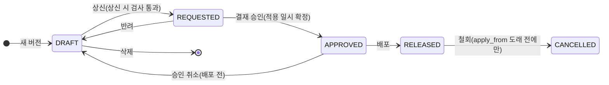

# 마루 MDM 설계: 결재

> 2026-09-07 작성. 상신·승인·반려·철회를 대상별로 모은 문서다. **규칙을 새로 정하지 않는다.** 각 규칙의 원장은 대상별 문서(`04-master-code.md`, `02-term-domain-column.md`, `05-master-data.md`, `06-business-rule.md`)이며, 이 문서는 그 규칙이 어떻게 맞물리는지를 보인다. 규칙이 바뀌면 원장 문서를 먼저 고치고 이 문서를 따라 고친다.
>
> 공통 원칙은 `01-mdm-overview.md` 원칙 3("승인 후 배포, 적용시점 지정, 이전 버전 보존")이다. 배포 경로는 `07-deploy.md`가 다룬다.

## 1. 대상별 결재 여부

대상 열의 "원천 MDM"은 MDM 역할을 맡은 인스턴스를 뜻한다(01 「한 줄 정의」, 2026-09-10).

| 대상 | 결재 | 상태 머신 | 근거 |
| --- | --- | --- | --- |
| 마스터코드 버전(원천 MDM) | **있다** | DRAFT → REQUESTED → APPROVED → RELEASED, 그리고 CANCELLED | 04 |
| 마스터코드 경미 수정 | 없다 | 상태 전이 없음 | 04 「경미 수정(패치)」 |
| 마스터코드 버전(원천 EXTERNAL) | 없다 | 수신 즉시 RELEASED. 원천이 확정한 값 | 04 「수신 API」 |
| 도메인 | **없다** | 없음. 표준 관리자 역할만 등록·수정하고 저장 커밋이 곧 배포 시작이다. 폐기도 없다(결정 2026-09-09) | 02 「생명주기와 변경 관리」 |
| 용어 | **없다** | 없음. 표준 관리자 역할만 등록·수정하고 저장하면 바로 쓴다(결정 2026-09-09) | 02 「미등록 용어 처리」 |
| 인터페이스 레이아웃 | **없다** | 없음. 표준 관리자 역할만 등록·수정하고 저장 커밋이 곧 배포 시작이다(결정 2026-09-09) | 03 「테이블 설계」 |
| 마스터데이터 | **없다** | INUSE → DEPRECATED(폐기). 결재 전이는 없고 저장 커밋이 곧 배포 시작이다 | 05 「선분과 닫기」 |
| 업무기준(룰)(원천 MDM) | **있다** | 마스터코드와 같다. 단위는 룰 하나. 새 버전은 정의를 복사한다. 철회해도 정의 행은 남긴다 | 06 「테이블 설계」 |
| 업무기준(룰)(원천 EXTERNAL) | 없다 | 수신 즉시 RELEASED. 원천이 확정한 값 | 06 「수신 API」 |
| 룰 세트 | 없다 | 없음. 버전·승인·적용시점이 없고 세트 저장 시 검사를 통과하면 바로 배포한다 | 06 「테이블 설계」 |

마스터데이터에 결재가 없는 것은 01 원칙 3의 예외다. 05가 그 예외를 명시했다. 규칙 변경이 필요한 값은 마스터코드로 다룬다.

## 2. 마스터코드 결재 흐름

| 단계 | 누가 | 하는 일 |
| --- | --- | --- |
| 새 버전 | 담당자 | DRAFT를 만든다. 마루 코드당 미적용 버전은 최대 하나다. 만든 사람이 자동으로 선점해 소유자가 된다 |
| 편집 | 소유자 | DRAFT에서만 한다. 소유자만 저장한다(3절 「DRAFT 정책」). `row_version`은 소유자 한 사람이 창을 둘 열었을 때를 막는다 |
| 선점 | 담당자 | `owner_id`가 비어 있을 때 자기를 적는다. 3절 「DRAFT 정책」 |
| 해제 | 소유자 | 작업을 마치면 `owner_id`를 비운다. 3절 「DRAFT 정책」 |
| 소유권 넘기기 | 소유자 | 받을 사람을 지정한다. 3절 「DRAFT 정책」 |
| 상신 | 소유자 | 희망 `apply_from`을 적는다. 상신 시 검사(4절)를 자동으로 돌린다. 거부인 검사가 하나라도 실패하면 상신되지 않고, 경고인 검사는 알리고 진행한다. 검사별 거부·경고 구분은 4절 표를 따른다(2026-09-09) |
| 승인 | 결재자 | 새 버전의 `apply_to`를 `9999-12-31 00:00:00`으로 열고, **직전 유효 버전의 `apply_to`를 새 버전의 `apply_from`으로 닫는다.** 한 트랜잭션이다 |
| 반려 | 결재자 | DRAFT로 되돌린다. `apply_from`·`requested_by`·`requested_at`을 비우고 `reject_reason`을 남긴다. 행은 그대로라 고쳐서 다시 상신한다 |
| 승인 취소 | 결재자 | 배포 전에만 한다. 반려와 같고, 승인 때 닫았던 직전 유효 버전의 `apply_to`를 다시 연다 |
| 배포 | 담당자 | RELEASED로 바꾼다. 내용이 확정되고 불변이 된다 |
| 철회 | 담당자 | `apply_from`이 오기 전에만 한다. CANCELLED로 바꾸고 그 버전이 만든 행을 지운다 |

**승인이 만지는 것은 VER 행 둘뿐이다.** 코드·카테고리 행은 건드리지 않는다. 승인 시점에는 아직 직전 버전이 사용 중이고, `apply_from`이 지나면 `apply_from <= 현재 일시 < apply_to` 조회 결과가 저절로 새 버전으로 바뀐다. 그 시각에 아무도 무엇을 실행하지 않는다.

반려와 승인 취소는 배포 전이므로 사본에 영향이 없다. 철회만 사본까지 간다.

**룰도 이 흐름을 그대로 쓴다**(확정 2026-09-08). 단위는 룰 하나다. 다른 점은 다섯이다. 버전 번호가 정수다. `ver_kind`·`code_pattern`·`restored_from`·`chg_seq` 칸이 없다. 경미 수정이 없다. 룰명·설명은 버전과 무관하게 고친다. 철회해도 정의 행을 지우지 않는다. 상신 시 검사는 06 「상신 시 검사」다. 값 테스트 전부 통과와 룰 참조 검사가 들어간다.

## 3. 결재에서 지키는 규칙

| 규칙 | 내용 | 이유 |
| --- | --- | --- |
| 검사는 상신 때 한 번뿐 | 결재자가 승인할 때는 다시 검사하지 않는다 | REQUESTED는 편집할 수 없어 내용이 바뀌지 않는다 |
| 결재자는 일시를 고치지 않는다 | `apply_from`을 바꾸려면 반려한 뒤 다시 상신한다 | 상신 시 검사한 하한이 승인 단계에서 깨지지 않게 한다 |
| 결재 이력 테이블이 없다 | VER 행에 최종 상신자·결재자·마지막 반려 사유만 남는다 | 상신과 반려가 반복돼도 마지막 값만 쓴다 |
| 결재 화면은 diff만 본다 | 줄어든 카테고리와 빠진 코드를 보여 주는 데 그친다 | **기존 데이터에 미치는 영향은 검사하지 않는다.** 그 데이터가 하위 시스템에 있어 MDM이 볼 수 없다. 재검증은 각 시스템의 정합성 점검 배치가 한다 |
| 변경 묶음이 없다 | 마루 코드마다 따로 상신·승인·배포한다 | 같은 `apply_from`이 필요하면 담당자가 맞춘다. 한쪽만 반려되어 다른 쪽만 적용되는 경우는 감수한다 |
| 미적용 버전은 하나뿐 | 미적용 버전이 있으면 새 버전을 만들 수 없다 | 번호를 끼워 넣는 일이 없고 ver 순서와 `apply_from` 순서가 저절로 같아진다 |

**적용시점 하한**

`apply_from >= max(직전 유효 버전의 apply_from + 최소 간격, 상신 일시 + 배포 리드타임)`

| 항목 | 규칙 |
| --- | --- |
| 설정값 | 최소 간격과 배포 리드타임은 시스템 설정값이며 기본은 1일이다. major용 값을 따로 둘 수 있다 |
| 목적 | 상신 당일 적용을 막고, 시스템마다 도달 시각이 달라도 같은 일시에 함께 바뀌게 한다 |
| 긴급 | 상신자가 긴급 사유를 적어 리드타임 0을 요청하고 결재자가 승인으로 받아들인다. 사유가 없으면 상신이 막힌다. 낮추는 것은 리드타임뿐이고 최소 간격은 그대로 지킨다 |
| 최초 버전 | 하한을 적용하지 않고 과거 일시도 허용한다. 예전부터 쓰던 코드를 처음 올릴 때 실제 사용 시작 시점을 적기 위해서다 |
| 검사 시점 | 상신 시 한 번뿐이다 |

**늦은 결재·늦은 배포**: 승인이나 배포 시점에 `apply_from`이 이미 지났으면 경고만 띄우고 그대로 진행한다. 사본은 받는 순간 직전 버전을 `apply_from`으로 소급해 닫는다. 그 사이 저장된 데이터는 정합성 점검 배치가 다시 검증한다.

**DRAFT 정책**

결정 2026-09-07(사용자). 룰에서 정한 DRAFT 정책을 결재를 받는 대상 전부에 같게 적용한다. 승인 전 편집 상태에 있는 것은 한 번에 한 사람이 선점하고 고친다. 선점한 사람이 소유자다. 여러 사람이 같은 것을 동시에 고치지 못하게 하는 장치이지 담당자를 정하는 장치가 아니다. 소유자는 작업을 마치면 선점을 해제하고, 비어 있으면 권한 있는 사람이 선점한다. 소유자는 소유권을 다른 사람에게 바로 넘길 수도 있다(선점·해제 결정 2026-09-09, 검토서 72·73). 워크트리처럼 한 대상에 편집 사본을 여럿 두는 방식은 쓰지 않는다. 그 방식은 상신 때 리베이스와 머지가 따라와 화면과 검사가 늘어난다.

| 항목 | 규칙 |
| --- | --- |
| 대상 | 마스터코드 버전의 DRAFT, 룰 버전의 DRAFT. 도메인·용어·인터페이스 레이아웃은 상태도 소유자도 없어 대상이 아니다(결정 2026-09-09). 원천이 EXTERNAL인 마스터코드·룰은 DRAFT가 없으므로 대상이 아니다(결정 2026-09-08) |
| 소유자 칸 | `owner_id`. 상태를 가진 행에 둔다. `MD_CODE_VER.owner_id`, `MD_RULE_VER.owner_id`. 비어 있으면(NULL) 아무도 선점하지 않은 상태다. 도메인·용어·레이아웃에는 없다 |
| 선점 | 만든 사람이 자동으로 선점한다. 새 버전, 룰 등록, 인라인 등록. `owner_id`가 비어 있으면 담당자 권한이 있는 사람이 「선점」으로 자기를 적는다. 비어 있지 않으면 선점할 수 없다(결정 2026-09-09) |
| 해제 | 소유자가 작업을 마치면 `owner_id`를 비운다. 소유자만 한다. 다른 사람이나 관리자가 대신 비우지 못한다(결정 2026-09-09). 미적용 상태면 언제든 된다 |
| 소유자만 하는 일 | 저장, 상신, DRAFT 삭제, 해제, 소유권 넘기기 |
| 다른 사용자 | 읽기와 시험(룰 값 테스트)만 한다. 편집 화면은 잠긴 채 열리고 소유자 이름을 보인다. `owner_id`가 비어 있으면 「선점」 버튼을 보인다 |
| 넘기기 | 소유자가 받을 사람을 골라 `owner_id`를 바꾼다. 해제와 상대의 선점을 한 번에 한 것과 같다. 미적용 상태(DRAFT·REQUESTED·APPROVED·CREATED)면 언제든 된다. 반려로 DRAFT에 돌아온 것도 같다. 넘긴 뒤 이전 소유자는 다른 사용자와 같다 |
| 소유자 부재 | 강제로 해제하거나 넘기는 관리자 역할은 두지 않는다(결정 2026-09-09, 검토서 73). 소유자가 해제하지 않고 자리를 비우면 돌아와 해제하거나 넘길 때까지 다른 사람은 기다린다 |
| `row_version` | 그대로 둔다. 소유자 한 사람이 창을 둘 열었을 때를 막는다 |
| 미적용은 하나 | "미적용 버전은 하나뿐" 규칙과 합쳐져 대상마다 편집 갈래가 하나다. 사본·머지·리베이스가 없다 |
| 담당자와의 관계 | 담당자는 권한이다. 누가 만들고 상신할 수 있는가다. 소유자는 작업 잠금이다. 지금 누가 선점했는가다. 둘을 섞지 않는다. 담당자를 두는 자리는 7절 미결 그대로다 |
| RELEASED 뒤 | `owner_id`는 기록으로만 남는다. 해제한 채 RELEASED가 되면 비어 있다 |

## 4. 상신 시 검사

상신(DRAFT → REQUESTED)에서 모두 검사한다.

| # | 검사 | 실패 시 |
| --- | --- | --- |
| 1 | 이 버전에 유효한 모든 코드값이 `code_pattern`에 전체 일치하고 콤마·공백이 없다 | 거부 |
| 2 | 카테고리를 해석한다. REGEX는 문법을 검사한 뒤 대조한다 | 거부 |
| 2-1 | LIST 텍스트나 CATE_ITEM에 이 버전에 없는 코드가 있다 | 경고 |
| 2-2 | 해석 결과가 빈 카테고리가 있다 | 경고 |
| 3 | 희망 `apply_from`이 하한 이상이다 | 거부. 최초 버전은 건너뛴다 |
| 4 | 직전 RELEASED 대비 추가·닫힘·변경 행이 있거나 `code_pattern`이 다르다 | 거부. 설명·이름만 고치는 것은 경미 수정으로 한다. 최초 버전은 코드가 없어도 상신할 수 있다 |
| 5 | 배포 대상 시스템이 하나 이상 있다 | 경고 |

변경 종류(major·minor)는 검사하지 않는다. 축소 변경이 minor에 있어도 거부하지 않는다.

## 5. 결재를 받지 않는 변경

| 대상 | 처리 | 근거 |
| --- | --- | --- |
| 마스터코드 경미 수정 | 결재를 받지 않는다. 권한을 담당자로 제한하고, 저장되면 배포 대상 시스템 담당자에게 알림을 보낸다(담당자를 어디에 두고 어떻게 보낼지는 7절 미결). **판정이 바뀌는 값은 패치할 수 없고 반드시 버전이다.** 코드값 오타도 패치가 아니다 | 04 「경미 수정(패치)」 |
| 마스터코드 추가 컬럼 라벨 편집 | 결재를 받지 않는다. 경미 수정과 같은 취급이다. 라벨은 MD_CODE 행의 값이라 버전 밖이고, 저장하면 배포 순번을 찍는다. 추가 컬럼의 값은 코드 행의 값이라 반드시 버전이다 | 04 「추가 컬럼」 |
| 도메인·용어·인터페이스 레이아웃 | 결재를 받지 않는다. 표준 관리자 역할만 등록·수정하며 저장하면 바로 배포된다. 도메인 좁히기와 레이아웃 항목 변경은 새 버전이지만 승인은 없다. 도메인 저장 화면이 diff·영향도를 보이고 테스트 케이스를 돌린다(결정 2026-09-09) | 02 「생명주기와 변경 관리」, 03 「버전과 변경」 |
| 마스터데이터 저장 | 화면·CSV·수신 API 어느 경로든 저장 커밋이 곧 배포 시작이다 | 05 |
| 룰 세트 저장 | 결재를 받지 않는다. 룰 ID를 실행 순서대로 담은 목록일 뿐이라 버전도 적용시점도 없다. 세트 저장 시 검사를 통과하면 바로 배포한다 | 06 「테이블 설계」 |
| 마스터코드(원천 EXTERNAL) 수신 | 결재를 받지 않는다. MDM은 검증하지 않고 저장해 새 버전을 바로 RELEASED로 둔다. 검증은 원천이 생성·수정할 때 한다(결정 2026-09-09). 원천이 정의와 코드를 전부 보내므로 DRAFT·상신·승인을 거치지 않는다 | 04 「수신 API」 |
| 룰(원천 EXTERNAL) 수신 | 결재를 받지 않는다. 요청 하나가 버전 하나다. 저장할 수 있는 요청이면 정수 버전을 하나 올려 바로 RELEASED로 둔다. 검증은 원천이 한다(결정 2026-09-09) | 06 「수신 API」 |

## 6. 결재 화면

| 화면 요소 | 내용 |
| --- | --- |
| 버전 목록(마스터코드 기준) | 상태·종류(MAJOR·MINOR)·표시 번호·`apply_from`-`apply_to`·결재자·배포 순번을 보인다. 미적용 버전은 소유자도 보인다. CANCELLED는 취소선과 철회 사유를 함께 보인다 |
| 버전 목록(룰) | 상태·정수 버전(`ver`)·`apply_from`-`apply_to`·결재자를 보인다. 종류와 배포 순번 칸은 없고 표시 번호도 정수 `ver` 하나다(06 「테이블 설계」). 미적용 버전은 소유자도 보인다(3절). CANCELLED는 취소선과 철회 사유를 함께 보인다 |
| 승인·반려 버튼 | REQUESTED일 때만 활성 |
| 승인 취소·배포 버튼 | APPROVED일 때만 활성. 배포는 `apply_from`이 이미 지났으면 경고 확인 후 진행한다 |
| 철회 버튼 | `apply_from`이 오지 않은 RELEASED일 때만 활성 |
| 결재자가 보는 것 | 읽기 전용 버전의 diff와 같다(`from_ver = V` 또는 `to_ver = V`인 행). 룰은 예외다. `MD_RULE_ROW`에는 `from_ver`·`to_ver`가 없다. diff는 06 「버전 선택 쿼리」처럼 두 `ver`의 행을 `row_id`로 FULL JOIN해 ADDED·REMOVED·CHANGED·SAME으로 낸다 |

## 7. 미결 사항

| 항목 | 정할 것 | 근거 |
| --- | --- | --- |
| 권한 역할 | 담당자(생성·배포 대상 지정·DRAFT 편집·삭제·상신·배포·철회·경미 수정·DEPRECATED 전이)와 결재자(승인·반려·승인 취소)로 나누고 **배포 권한은 따로 두지 않는 안**까지만 있다. 도메인·용어·인터페이스 레이아웃을 맡는 표준 관리자 역할은 정해졌다(결정 2026-09-09). DRAFT 소유권을 강제로 해제하거나 넘기는 관리자 역할은 두지 않기로 했다. 해제는 소유자만 하고, 비어 있으면 담당자가 선점한다(결정 2026-09-09, 검토서 73) | 04 미결 |
| 상신자와 결재자의 겸임 | 허용할지 정하지 않았다 | 04 미결 |
| 담당자를 두는 자리 | `MD_CODE` 컬럼으로 둘지 공통 권한 모듈에서 가져올지. DRAFT 소유자 `MD_CODE_VER.owner_id`(3절)와는 별개다 | 04 미결 |
| 배포 대상 시스템 담당자와 경미 수정 알림 | 배포 대상 시스템 담당자를 어디에 두고 경미 수정 알림을 어떻게 보낼지. 5절 「마스터코드 경미 수정」의 알림은 보낸다는 규칙만 정해졌고 전달 방식은 여기서 정한다 | 04 미결 |
| 결재자 지정 | 공통 결재 모듈을 쓰는 안이다. 확정하지 않았다 | 04 미결 |
| 승인 취소 시 결재 정보 | `approved_by`·`approved_at`을 비울지 남길지. 남기면 DRAFT인데 목록에 결재자가 보인다 | 04 미결 |
| 컬럼 시스템 매핑 | 승인·버전 대상으로 둘지 정하지 않았다 | 02, `../study/2026-09-04-column-crosswalk.md` 7절 |
