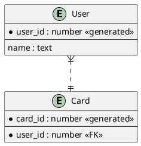

# G. ERD 도구 — 파일 포맷 · 기능 목록 조사 (2026-10-09)

범위: 파일 포맷(저장·교환·Claude 읽기용)과 기능 목록. 라이선스·스택은 다른 조사자 담당.
표기: O 지원 / △ 부분 / X 미지원 / 확인 안 됨 = 이번 조사에서 근거를 못 얻음.

---

## 1. 파일 포맷

### 1-1. DBML (dbml.dbdiagram.io)
출처: https://dbml.dbdiagram.io/docs/ (2026-10 기준 리다이렉트 후 DBML 홈은 제목만 잡힘)

```dbml
Project project_name {
  database_type: 'PostgreSQL'
  Note: 'Description of the project'
}

Table core.users [note: 'Application accounts'] {
  id integer [pk, increment, note: 'Primary key']
  email varchar(255) [unique, not null, note: 'Login email']
}

Table very_long_user_table as U {        // alias
  id integer [pk]
}

Enum job_status {
  created [note: 'Waiting to be processed']
  running
  done
}

Table jobs {
  status job_status
  indexes {
    (id, country) [pk]
    booking_date [type: hash, name: 'booking_idx']
  }
}

Ref: posts.user_id > users.id            // many-to-one
Ref: users.id < reviews.user_id          // one-to-many
Ref: user_infos.user_id - users.id       // one-to-one
Ref: authors.id <> books.id              // many-to-many
Ref: posts.user_id >? users.id           // ? = optional side
Ref: posts.user_id > users.id [delete: cascade]
```

- 논리명/물리명: `alias`(as) 와 `note` 로 흉내 가능. 별도 논리명 필드 없음 → 확인 안 됨(공식 문서에 논리명 전용 키 없음).
- 도메인 표현: Enum 으로 값 목록만. 도메인(타입 재사용) 개념은 확인 안 됨.
- 주제 영역/다이어그램: TableGroup, DiagramView 문법은 공식 문서 페이지를 가져오지 못해 **확인 안 됨**. (dbdiagram 쪽에서 TableGroup 은 쓰는 것으로 알려져 있으나 이번 조사에서 근거 못 얻음.)
- 위치 정보: 공식 docs 본문에서 위치·색상 저장 언급 없음 → 사실상 **미저장**으로 보이나 확인 안 됨.
- 식별/비식별: 문법에 직접 구분 없음. 외래키 컬럼의 pk 여부로 추정만 가능.
- 고정 ID: 없음(이름 기반). 이름 변경 추적 불가.
- git diff: 한 파일, 테이블 블록 단위. 테이블 순서·컬럼 순서가 그대로 diff 에 나옴. 정렬 규칙은 강제되지 않음.

### 1-2. Mermaid erDiagram
출처: https://mermaid.js.org/syntax/entityRelationshipDiagram.html

```mermaid
erDiagram
    CUST[Customer Account] ||--o{ ORDER : places
    CUST {
        string name PK "full legal name"
        string email UK
    }
    ORDER ||--|{ LINE_ITEM : "contains"
    ORDER {
        int id PK
        int cust_id FK
        string note?
    }
    LINE_ITEM ..o{ PRODUCT : "refers to"
```

- 카디널리티: `|o o|` (0..1), `||` (1), `}o o{` (0..N), `}| |{` (1..N).
- 식별: `--` 실선(식별), `..` 점선(비식별).
- 속성: 타입 이름 + PK/FK/UK + 큰따옴표 주석. 타입 집합 제한 없음.
- 논리/물리 분리: 없음. 엔티티 별칭 `[Alias]` 로 표시명만 바꿈. 
- 위치: 레이아웃은 렌더러(ELK 기본, Dagre 선택) 가 정함 → 위치 저장 불가.
- 주제 영역: 없음(한 다이어그램).
- 고정 ID: 없음.
- git diff: 한 파일, 텍스트 친화적. 레이아웃이 자동이라 줄 변경은 적음.
- Claude 읽기: 매우 좋음(짧고 익숙함). 단 모델 정보(도메인·MDM 링크) 는 담을 수 없음.

### 1-3. PlantUML IE
출처: https://plantuml.com/ie-diagram



- 카디널리티: `|o`, `||`, `}o`, `}|` (Mermaid 와 같은 crow's foot).
- 식별 구분: `--`/`..` 로 선 모양만. 속성 `*` 는 필수 표시, `--` 는 키/비키 구분선.
- 논리/물리, 위치, 고정 ID: 없음(위치는 렌더러 자동). 
- 주제 영역: `package`/`together` 등은 확인 안 됨(이번 페이지에 없음).
- 용도: 문서 삽입용 텍스트. 저장 모델로는 부적합.

### 1-4. D2 sql_table
출처: https://d2lang.com/tour/sql-tables/

```d2
users: {
  shape: sql_table
  id: int {constraint: primary_key}
  name: varchar
}
orders: {
  shape: sql_table
  id: int {constraint: primary_key}
  user_id: int {constraint: foreign_key}
}
orders.user_id -> users.id
```

- 제약: primary_key(PK), foreign_key(FK), unique(UNQ). 배열로 여러 개.
- 관계: 행 단위 연결선(TALA/ELK 엔진에서 행 정확 지점).
- 논리명·도메인·주제 영역: 확인 안 됨. 위치: D2 자체 레이아웃 → 저장 모델 아님.
- 용도: 문서 렌더링 전용.

### 1-5. exERD (.exerd)
출처: https://github.com/exerd/exerd → 저장소 "This repository is empty" 로 응답. exerd.dev 는 DNS 실패.
- XML/JSON 여부, 구조, 라이선스: **확인 안 됨**.

### 1-6. ERwin (.erwin / XML 내보내기)
- 이번 조사에서 공식 문서 근거 확보 못 함 → **확인 안 됨**(구조·XML 여부 모두).

### 1-7. Oracle SQL Developer Data Modeler (.dmd)
출처(검색 결과): https://docs.oracle.com/database/sql-developer-17.4/DMDUG/toc.htm 등 (Oracle DM User's Guide 목차), Oracle 기술 개요 메모.
- 확인된 것: 메타데이터는 XML 파일로 저장됨. 한 .dmd 안에 여러 독립 모델(논리·관계형) 이 있을 수 있음. 논리 모델과 관계형 모델은 각각 다이어그램과 서브뷰(subview) 를 가짐. 논리→관계형 매핑이 있음.
- 폴더 안 XML 파일들의 정확한 구조(파일 이름, logical/relational/subviews 각각의 역할): **확인 안 됨**. 실제 .dmd 를 열어 봐야 함.
- DDL 내보내기 O (Oracle, DB2, SQL Server 등), 모델 비교/병합 O (DB 데이터 사전 또는 DDL 과 비교해 ALTER 생성), 리포트·DDL 생성은 SQLcl 확장으로도 가능(릴리스 노트).
- Excel 데이터 사전 리포트: **확인 안 됨**(검색으로 못 찾음; CSV 내보내기는 언급).

### 1-8. DA# / ER/Studio (.dm1) / PowerDesigner (.pdm) / MySQL Workbench (.mwb) / pgModeler (.dbm)
- 이번 조사에서 포맷 근거를 얻지 못함. MySQL Workbench 공식 제품 페이지는 모델링 기능 대신 SQL 편집·성능 등만 설명(모델링 기능은 dev.mysql.com 문서 필요).
- 확인 안 됨: .mwb 가 zip+XML 인지, .dbm 이 XML 인지, .pdm 이 XML 인지, DA#·ER/Studio 포맷. 이 항목은 다음 조사에서 실물 파일 열어 확인 필요.

### 1-9. 오픈소스 JSON 계열
| 도구 | 포맷 | 확인 결과 |
|---|---|---|
| drawDB | .ddb / JSON | 공식 페이지에는 SQL 가져오기·내보내기, 마이그레이션 생성만 명시. JSON 구조 **확인 안 됨**. 라이선스 AGPL-3.0 (라이선스 항목은 스택 조사자와 겹침, 참고만). |
| ChartDB | JSON(가져오기) | "Smart Query" 로 DB 가 스키마를 JSON 으로 내보내고 ChartDB 에 붙여넣음. 내보내기는 AI 가 DDL 생성. JSON 구조 **확인 안 됨**. AGPL-3.0. |
| Azimutt | project JSON + AML | 가져오기: 샘플·SQL 파일·DB URL. 변환기: SQL↔AML↔DBML↔JSON. AML 문법 샘플은 **확인 안 됨**(GitHub 404). 가상 관계(virtual relations) 명시 없음 — 관계 경로 찾기는 있음. |
| ERD Editor (dineug) | .erd.json (.vuerd.json 아님) | MIT 라이선스. 저장 포맷은 erd-editor-schema 패키지가 정의하나 필드 구조 **확인 안 됨**. LWW(Last-Write-Wins) 연산자 언급 → 동시 편집 메타 존재 가능성(확인 안 됨). |
| Liam ERD | schema JSON | 공식 docs 404. 구조 **확인 안 됨**. |

### 1-10. 교환 표준
- OMG CWM 1.1 (2003), MOF 기반 메타모델, 교환은 XMI 사용. Relational 패키지(RelationalModule, IDL 파일) 존재 확인. 실사용 도구 지원 범위는 확인 안 됨. 무거움 → 직접 채택은 비추천, 개념 참고용.
- SQL DDL 자체: 방언이 Oracle 하나로 고정된 사내 상황에서 가장 실용적인 교환 형식. Oracle DDL 은 COMMENT ON, 제약 이름, 인덱스 포함 가능.

---

## 2. 포맷 비교 표 (확인된 범위만)

| 포맷 | 저장 적합 | 논리/물리 분리 | 도메인 | 주제 영역·다이어그램 | 위치 저장 | 식별/비식별 | 고정 ID | git diff | Claude 읽기 |
|---|---|---|---|---|---|---|---|---|---|
| DBML | △ (구조 충분, 메타 부족) | △ alias/note 로 흉내 | △ Enum 만 | 확인 안 됨 (TableGroup/DiagramView 문서 미확보) | 확인 안 됨(미저장으로 보임) | 문법 없음 | X | O (한 파일, 텍스트) | O 매우 좋음 |
| Mermaid erDiagram | X (뷰 전용) | X | X | X | X (자동) | O (-- / ..) | X | O | O 매우 좋음 |
| PlantUML IE | X | X | X | X | X | O | X | O | O |
| D2 sql_table | X | X | X | X | X | X | X | O | O |
| exERD | 확인 안 됨 | 확인 안 됨 | 확인 안 됨 | 확인 안 됨 | 확인 안 됨 | 확인 안 됨 | 확인 안 됨 | 확인 안 됨 | 확인 안 됨 |
| Oracle DM (.dmd) | O (논리+관계+서브뷰) | O | 확인 안 됨 | O 서브뷰 | 확인 안 됨 | 확인 안 됨 | 확인 안 됨 | 확인 안 됨 (여러 XML 파일) | 확인 안 됨 |
| ERD Editor .erd.json | O 추정 | 확인 안 됨 | 확인 안 됨 | 확인 안 됨 | 확인 안 됨 | 확인 안 됨 | 확인 안 됨 | O (JSON) | 확인 안 됨 |
| Azimutt AML | 확인 안 됨 (문법 샘플 미확보) | | | | | | | | |

---

## 3. 포맷 권장 (초안, 근거 부족 항목 명시)

(a) 저장 모델 설계 참고:
- 우리 모델 자체는 **자체 JSON(정규화된 구조 + 안정 ID)** 가 맞다. 근거: 조사한 어떤 텍스트 포맷도 논리명·도메인·위치·고정 ID 를 한꺼번에 담지 않는다(DBML 이 가장 가깝지만 위치·고정 ID·주제 영역 확정 못 함).
- 설계 참고: Oracle DM 의 "모델 하나 + 논리/관계 뷰 분리 + 서브뷰" 구조 (논리 모델과 관계형 모델을 따로 두고 매핑). 주제 영역 = 서브뷰 개념으로 옮기면 됨.
- 고정 ID: 모든 표·컬럼·관계·다이어그램 노드에 UUID(또는 짧은 ID). 이름 변경 추적은 ID 로만 가능. 조사한 어떤 DBML·Mermaid 도 고정 ID 가 없다 → 우리 쪽 필수 항목.

(b) 가져오기·내보내기 우선순위:
1. Oracle DDL (CREATE TABLE / COMMENT / 제약 / 인덱스) — 가져오기·내보내기 둘 다. 사내 정본 방언이 Oracle 이므로 최우선.
2. DBML — 가져오기·내보내기. 문법 확인됨, 외부 도구 교환 목적. (단 위치·고정 ID 손실 전제.)
3. Oracle SQL Developer Data Modeler (.dmd) — 가져오기는 어렵고 내부 구조 미확인. 사용자가 실제 쓰고 있다면 1순위로 올릴 수 있음 → 실물 확인 필요.
4. ERD Editor/drawDB/ChartDB/Azimutt JSON — 구조 미확인이라 보류.
5. Mermaid — 내보내기 전용(문서 삽입). 가져오기 불필요.

(c) Claude 가 읽는 텍스트 형식 후보:
- 1순위: 구조 요약 Markdown 또는 YAML-like 텍스트(테이블별 블록: 물리명·논리명·컬럼·PK·FK·코멘트·MDM 용어 ID). 토큰 효율과 사람 검토를 함께 잡음.
- 2순위: DBML 그대로 — 문법이 짧고 Claude 가 이미 잘 읽음. 위치 정보는 빠진다는 점 감안.
- Mermaid erDiagram 은 관계 그림 확인용 보조(렌더링 검토).

git 파일 구성 (사례 조사는 확인 안 됨): 
- 안전한 초안: **표 1개 = 파일 1개** (`tables/<물리명>.json`), 관계는 `relations/`, 다이어그램(위치·서브뷰)은 `diagrams/<주제>.json`. 키 정렬·ID 정렬로 diff 안정화. 이름 변경은 파일 이름이 바뀌므로 ID 로 연결하고 파일명은 물리명을 쓰되 ID 정본 유지.
- 사례 근거(실제 오픈소스 프로젝트 파일 구성 확인)는 **확인 안 됨**.

---

## 4. 기능 목록 (feature matrix) — 근거 부족, 부분 채움

조사 가능했던 항목만 채움. 나머지는 "확인 안 됨".

| 범주 / 기능 | exERD | ERwin | SQL Dev DM | dbdiagram.io | DrawSQL | ChartDB | drawDB | Azimutt | DataGrip |
|---|---|---|---|---|---|---|---|---|---|
| 논리/물리 분리 | 확인 안 됨 | 확인 안 됨 | O (논리·관계형 모델, 매핑) | X 추정(alias/note만, 근거 미확보) | 확인 안 됨 | 확인 안 됨 | 확인 안 됨 | 확인 안 됨 | X 추정(근거 없음) |
| 서브타입·도메인·단어 사전 | 확인 안 됨 | 확인 안 됨 | 확인 안 됨 | Enum 만 | 확인 안 됨 | 확인 안 됨 | 확인 안 됨 | 확인 안 됨 | 확인 안 됨 |
| 자동 배치 (auto layout) | 확인 안 됨 | 확인 안 됨 | 확인 안 됨 | 확인 안 됨 | 확인 안 됨 | 확인 안 됨 | 확인 안 됨 | O (레이아웃 저장) | O (Default layout, 재배치 옵션) |
| 주석·메모 / 영역 상자 | 확인 안 됨 | 확인 안 됨 | 확인 안 됨 | O (note) | 확인 안 됨 | 확인 안 됨 | 확인 안 됨 | O (레이아웃 메모, 테이블·컬럼 노트) | 확인 안 됨 |
| 식별/비식별 관계 | 확인 안 됨 | 확인 안 됨 | 확인 안 됨 | X (구분 문법 없음) | 확인 안 됨 | 확인 안 됨 | 확인 안 됨 | 확인 안 됨 | 확인 안 됨 |
| 카디널리티 표기 (IE/Barker/IDEF1X) | 확인 안 됨 | 확인 안 됨 | 확인 안 됨 | O (< > - <> 문법) | 확인 안 됨 | 확인 안 됨 | 확인 안 됨 | 확인 안 됨 | 확인 안 됨 |
| 자기 참조 관계 | 확인 안 됨 | 확인 안 됨 | 확인 안 됨 | 확인 안 됨 | 확인 안 됨 | 확인 안 됨 | 확인 안 됨 | 확인 안 됨 | 확인 안 됨 |
| 리버스 엔지니어링 (DB→모델) | 확인 안 됨 | 확인 안 됨 | O (DB 데이터사전 import) | X (수동/DBML) | 확인 안 됨 | O (Smart Query JSON) | 확인 안 됨 | O (DB URL import) | O (다이어그램 생성 기능 있다는 것만 확인, 세부 확인 안 됨) |
| 포워드 엔지니어링 (DDL 생성) | 확인 안 됨 | 확인 안 됨 | O (MySQL/PG/SQL Server·Oracle 등 DDL) | 확인 안 됨 | O (MySQL/PG/SQL Server DDL, Laravel) | O (AI 기반 방언 변환 DDL) | O (SQL 내보내기, 마이그레이션) | O (SQL 변환기) | 확인 안 됨 |
| 모델↔DB 비교·동기화 | 확인 안 됨 | 확인 안 됨 | O (모델 vs DB, ALTER 생성) | X | 확인 안 됨 | 확인 안 됨 | 확인 안 됨 | 확인 안 됨 | 확인 안 됨 |
| 모델↔모델 비교 | 확인 안 됨 | 확인 안 됨 | O (Tools>Compare/Merge) | X | 확인 안 됨 | 확인 안 됨 | 확인 안 됨 | 확인 안 됨 | 확인 안 됨 |
| 마이그레이션 생성 | 확인 안 됨 | 확인 안 됨 | 확인 안 됨 | X | O (Laravel migration) | 확인 안 됨 | O | 확인 안 됨 | 확인 안 됨 |
| 실시간 동시 편집 | 확인 안 됨 | 확인 안 됨 | 확인 안 됨 | 확인 안 됨 | O (실시간 공유 편집) | 확인 안 됨 | 확인 안 됨 | O 공유·임베드 (실시간 편집은 언급 없음) | 확인 안 됨 |
| 토론(댓글) | 확인 안 됨 | 확인 안 됨 | 확인 안 됨 | 확인 안 됨 | O (표 단위 토론 스레드) | 확인 안 됨 | 확인 안 됨 | O (노트·태그) | 확인 안 됨 |
| 버전 이력 | 확인 안 됨 | 확인 안 됨 | 확인 안 됨 | 확인 안 됨 | O | 확인 안 됨 | 확인 안 됨 | 확인 안 됨 | 확인 안 됨 |
| 서브뷰 / 주제 영역 | 확인 안 됨 | 확인 안 됨 | O (서브뷰) | 확인 안 됨 (TableGroup 미확인) | 확인 안 됨 | 확인 안 됨 | 확인 안 됨 | O (표시 선택·scope 가 근접) | O (Diagram scope) |
| 컬럼 표시/숨김 | 확인 안 됨 | 확인 안 됨 | 확인 안 됨 | 확인 안 됨 | 확인 안 됨 | 확인 안 됨 | 확인 안 됨 | O (표시할 항목 선택) | O (key/일반 컬럼 토글) |
| AI 기능 | X | X | 확인 안 됨 | 확인 안 됨 | O (스키마 리뷰·생성·미리보기) | O (OpenAI 키·DDL 변환) | 확인 안 됨 | △ (SQL 생성, 쿼리 설명은 예정) | 확인 안 됨 |
| PNG/SVG/PDF 출력 | 확인 안 됨 | 확인 안 됨 | 확인 안 됨 | 확인 안 됨 | O (이미지) | 확인 안 됨 | 확인 안 됨 | 확인 안 됨 | 확인 안 됨 |
| 테이블 정의서(엑셀/HTML) | 확인 안 됨 | 확인 안 됨 | 확인 안 됨 (CSV 내보내기·리포트 템플릿 존재, 엑셀 여부 미확인) | 확인 안 됨 | 확인 안 됨 | 확인 안 됨 | 확인 안 됨 | 확인 안 됨 | 확인 안 됨 |
| 검증 (명명·표준 위반) | 확인 안 됨 | 확인 안 됨 | 확인 안 됨 | X | O (AI 리뷰: 인덱스 누락 등) | 확인 안 됨 | 확인 안 됨 | 확인 안 됨 | 확인 안 됨 |
| 대형 모델 (수백 표) | 확인 안 됨 | 확인 안 됨 | 확인 안 됨 (서브뷰로 분할 권고) | 확인 안 됨 | 확인 안 됨 | 확인 안 됨 | 확인 안 됨 | 확인 안 됨 | O (scope 로 축소 관리) |

> 근거 URL: 아래 "핵심 URL" 절. 추가 확인이 필요한 항목은 exERD·ERwin·drawDB·ChartDB 세부 기능 페이지 (실제 문서·앱 직접 열기).

---

## 5. 사내 도구 1단계 기능 제안 (초안)

**1단계에 꼭 넣을 것**
- 구조화 모델 저장: 표·컬럼·관계·다이어그램·위치, 모든 객체 고정 UUID.
- 논리명/물리명 분리 (각 표·컬럼에 둘 다, MDM 용어 연결 필드).
- Oracle DDL 가져오기·내보내기 (정본 방언, 주석·제약·인덱스 포함).
- 관계: 식별/비식별, 카디널리티(IE 표기), 자기 참조.
- 편집 UX 최소: 캔버스 드래그·자동 배치 한 가지·컬럼 표시 토글·표 검색.
- 출력: PNG/SVG, 테이블 정의서(HTML 또는 CSV, 엑셀은 나중).
- Claude 읽기 텍스트 내보내기 (구조 요약 Markdown/YAML + DBML 보조).
- 변경 이력은 git 파일 단위로 충분(자체 버전 기능은 나중).

**나중**
- 모델↔DB 비교·동기화 (Oracle 데이터사전 조회로 ALTER 생성), 모델↔모델 비교.
- 서브타입·도메인 재사용, MDM 단어 사전 자동 매칭 고도화.
- 검증 규칙 엔진(명명 규칙·표준 위반 알림).
- 실시간 동시 편집, 댓글, 잠금.
- 대형 모델의 주제 영역(서브뷰) 다중 화면.
- AI 기능(스키마 리뷰, 표 초안 생성).

**안 넣을 것 (1단계 범위 밖)**
- 다중 DBMS 방언 변환 (사내는 Oracle 하나).
- 자체 Excel 데이터 사전 엔진 (CSV·HTML 로 충분).
- 자체 협업 서버·계정 체계 (git 기반 파일 협업으로 대체).
- 교환 표준 CWM·XMI 직접 구현 (무거움, 실익 낮음).

---

## 6. 확인 안 된 주요 사항 (다음 조사 우선순위)
1. Oracle SQL Developer Data Modeler .dmd 폴더 내부 XML 구조 (실물 파일 열기 필요).
2. exERD 저장 포맷 (exerd.dev / 저장소 정상 경로 재확인).
3. DBML TableGroup·DiagramView 문법과 위치 저장 여부 (dbml 공식 문서 재확인).
4. ERwin·PowerDesigner·ER/Studio·pgModeler·MySQL Workbench(.mwb) 포맷 실물 확인.
5. drawDB·ChartDB·Liam·ERD Editor JSON 스키마 필드.
6. Azimutt AML 문법 샘플.
7. 기능 매트릭스의 "확인 안 됨" 대부분 (exERD·ERwin 기능 페이지, dbdiagram 정식 기능표).

---

## 핵심 URL
- DBML 문법: https://dbml.dbdiagram.io/docs/ (TableGroup 등은 미확보)
- Mermaid erDiagram: https://mermaid.js.org/syntax/entityRelationshipDiagram.html
- PlantUML IE: https://plantuml.com/ie-diagram
- D2 sql_table: https://d2lang.com/tour/sql-tables/
- Oracle DM 사용자 가이드 목차: https://docs.oracle.com/database/sql-developer-17.4/DMDUG/toc.htm
- Oracle DM 릴리스 노트(DDL·비교): https://www.oracle.com/database/technologies/appdev/datamodeler/relnotes-194.html
- ERD Editor (dineug): https://github.com/dineug/erd-editor (MIT)
- drawDB: https://github.com/drawdb-io/drawdb (AGPL-3.0, JSON 구조 확인 안 됨)
- ChartDB: https://github.com/chartdb/chartdb (AGPL-3.0)
- Azimutt: https://azimutt.app/ (라이선스 페이지 미표기)
- DrawSQL: https://drawsql.app/
- DataGrip diagrams: https://www.jetbrains.com/help/datagrip/diagrams.html
- OMG CWM: https://www.omg.org/spec/CWM/ (1.1, RelationalModule)
- exERD 저장소(빈 페이지): https://github.com/exerd/exerd
