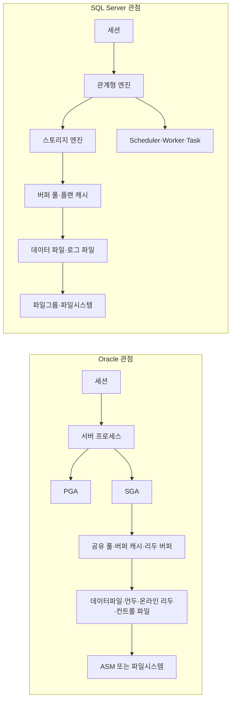

# Oracle 사용자가 SQL Server를 쓸 때 반드시 알아야 할 차이와 실무 가이드

## Executive Summary

이 보고서는 가능하면 한국어 공식 문서인 Microsoft Learn ko-KR를 우선 사용하고, Oracle 쪽은 한국어 공식 문서 범위가 상대적으로 좁아 Oracle Corporation 의 영문 공식 문서를 병행했다. 비교 기준은 Oracle Database 19c 계열 개념과 현재 공개된 Microsoft SQL Server 공식 문서다. 버전이나 에디션에 따라 기능 차이가 큰 항목은 본문에서 따로 지적했다.

- **가장 큰 사고방식 전환은 동시성 모델이다.** Oracle은 기본적으로 멀티버전 읽기 일관성을 제공해 “읽는 세션과 쓰는 세션이 서로 막지 않는” 쪽에 가깝다. 반면 SQL Server의 기본 `READ COMMITTED`는 보통 공유 잠금을 사용하는 잠금 기반 읽기이며, Oracle처럼 읽기 일관성을 읽기 쪽 기본값으로 체감하려면 `READ_COMMITTED_SNAPSHOT` 또는 `SNAPSHOT`을 별도 검토해야 한다. `NOLOCK`은 Oracle식 비차단 읽기의 대체재가 아니라 더티 리드를 허용하는 별도 선택지다.

- **두 번째 큰 차이는 물리 설계 기준점이다.** Oracle 사용자는 보통 “테이블은 힙, 인덱스는 별도 구조”라는 감각에 익숙하지만, SQL Server는 클러스터형 인덱스가 기본 테이블 저장 방식을 규정한다. Oracle의 인덱스-조정 감각을 그대로 가져오면 SQL Server에서 핵심 저장 구조를 놓치기 쉽다. Oracle에는 비트맵, 함수 기반, 인비저블, 글로벌/로컬 파티션 인덱스가 강하고, SQL Server에는 클러스터형/비클러스터형, 포함 열, 필터드 인덱스, 컬럼스토어, 인덱싱된 뷰가 강하다.

- **세 번째 큰 차이는 프로그래밍 모델이다.** Oracle PL/SQL은 `EXCEPTION`, `RAISE`, `RETURNING INTO`, 행 레벨 트리거, 암묵 커서와 `CURSOR FOR LOOP`에 익숙하다. SQL Server T-SQL은 `TRY...CATCH`, `THROW`, `XACT_STATE()`, `OUTPUT`, `SCOPE_IDENTITY()`, statement-level DML 트리거와 `inserted`/`deleted` 논리 테이블 중심으로 사고해야 한다. 특히 트리거와 자동증가 키 회수 방식은 포팅 시 오류가 많이 나는 지점이다.

- **운영 관점의 기준 도구도 다르다.** Oracle 쪽 실무 중심축이 AWR·ASH·ADDM·DBMS_XPLAN·SQL Monitor라면, SQL Server 쪽은 Query Store·Extended Events·시스템 세션(`system_health`)·통계/카디널리티 추정·파일그룹/`tempdb` 운영이 중심이다. Oracle의 RMAN·Data Guard·RAC에 대응하는 SQL Server 운영 블록은 전체/차등/로그 백업, 로그 전달, Always On 가용성 그룹, 레거시 미러링이다.

- **실무 우선순위는 세 가지다.** Oracle 애플리케이션을 SQL Server에 얹을 때 가장 먼저 검토할 것은 `DATE`/`NUMBER` 매핑, 읽기 일관성 전제(`READ_COMMITTED_SNAPSHOT` 여부), 그리고 클러스터형 인덱스/포함 열/필터드 인덱스를 포함한 물리 설계 재작성이다. 그 다음이 `OUTPUT`·`SCOPE_IDENTITY()`·`TRY...CATCH`·`XACT_STATE()` 표준화, 마지막이 Query Store 기반 회귀 추적이다.

## 주요 차이 요약표

| 영역 | Oracle에서 익숙한 관점 | SQL Server에서 대응되는 관점 | Oracle 사용자의 실무 해석 | 근거 |
|---|---|---|---|---|
| 아키텍처 | 데이터베이스 + 인스턴스, SGA/PGA/UGA, 백그라운드/서버 프로세스 | 관계형 엔진/스토리지 엔진, 버퍼 풀·플랜 캐시, scheduler/worker/task, 데이터 파일·로그 파일·파일그룹 | Oracle의 “인스턴스 메모리/프로세스” 감각을 SQL Server의 “버퍼 풀/플랜 캐시/SQLOS/파일그룹” 감각으로 전환해야 한다 | |
| 기본 저장 모델 | 기본은 힙 테이블, IOT는 별도 선택 | 클러스터형 인덱스가 데이터 행 저장 방식을 규정할 수 있음 | SQL Server에서는 인덱스 설계가 곧 테이블 저장 설계다 | |
| 동시성 | 기본 멀티버전 읽기 일관성, dirty read 불가, readers/writers 비차단 | 기본 `READ COMMITTED`는 보통 잠금 기반, `READ_COMMITTED_SNAPSHOT`로 행 버전 읽기 가능, `NOLOCK`은 dirty read | Oracle 앱을 그대로 옮기면 SQL Server에서 예상보다 블로킹이 많이 생길 수 있다 | |
| 락 | 행 수정 시 행 잠금, 보통 락 에스컬레이션 없음 | 행/페이지/테이블 잠금 가능, 조건에 따라 에스컬레이션 가능 | SQL Server는 “락 단위”와 “에스컬레이션”을 설계 단계에서 더 의식해야 한다 | |
| 인덱스·통계 | 비트맵, 함수 기반, 인비저블, 글로벌/로컬 파티션, `DBMS_STATS` | 클러스터형/비클러스터형, 포함 열, 필터드, 컬럼스토어, 인덱싱된 뷰, 자동 통계·CE | Oracle의 함수 기반·비트맵 감각을 SQL Server의 포함 열·필터드·컬럼스토어로 치환해 생각해야 한다 | |
| SQL/절차 | PL/SQL, `RETURNING INTO`, `EXCEPTION`, 행/문장 트리거, 암묵 커서 | T-SQL, `OUTPUT`, `TRY...CATCH`, `THROW`, statement-level 트리거, `inserted`/`deleted`, `SCOPE_IDENTITY()` | 자동증가 값 회수, 예외 처리, 트리거 로직은 거의 반드시 재설계가 필요하다 | |
| 보안 | 권한/역할, CDB/PDB common/local, TDE, Unified Auditing, Data Redaction/VPD | 서버/데이터베이스 역할, securable hierarchy, TDE, Audit, RLS, DDM, Always Encrypted | SQL Server는 서버 수준과 DB 수준 보안 주체를 분리해서 생각해야 하고, RLS/DDM/Always Encrypted의 역할 구분이 중요하다 | |
| 백업·복구·HA | RMAN, archived redo, Data Guard, RAC | full/diff/log backup, log shipping, Always On AG, 레거시 미러링 | SQL Server에서는 로그 백업 체인과 복구 모델 이해가 Oracle의 archived redo 이해만큼 중요하다 | |
| 관측·튜닝 | AWR, ASH, ADDM, DBMS_XPLAN, SQL Monitor | Query Store, Extended Events, 통계/CE, 시스템 세션 | SQL Server는 Query Store와 XE를 “기본 수집면”으로 삼는 편이 운영 효율이 높다 | |
| 운영 설정 | `SPFILE`/`PFILE`, ASM/OMF | `sp_configure`, `ALTER DATABASE`, 파일/파일그룹, `tempdb`, IFI | Oracle의 init.ora/SPFILE 감각을 SQL Server의 서버 옵션·DB 옵션·파일 옵션으로 나눠서 봐야 한다 | |

## 아키텍처와 데이터 타입

Oracle 사용자가 SQL Server를 처음 만날 때 가장 먼저 바꿔야 하는 정신모델은 “인스턴스”와 “저장 구조”에 대한 관점이다. Oracle에서는 인스턴스가 기동될 때 메모리 영역을 할당하고 백그라운드 프로세스를 시작하며, 핵심 메모리 구조는 공유 메모리인 SGA, 프로세스 전용 메모리인 PGA, 세션 메모리인 UGA로 구분된다. 또한 Oracle 저장 구조는 테이블스페이스·데이터파일·리두 로그·컨트롤 파일·언두를 중심으로 이해하는 것이 자연스럽고, ASM은 Oracle이 권장하는 전용 스토리지 관리 계층이다.

반면 SQL Server는 관계형 엔진과 스토리지 엔진, 버퍼 풀과 프로시저 캐시, 그리고 scheduler/worker/task 모델을 가진 실행 계층을 중심으로 본다. 데이터와 오브젝트는 운영체제 파일로 저장되며, 데이터 파일은 파일그룹으로 묶을 수 있고, 로그 파일은 별도 체인 관리가 핵심이다. Oracle에서의 “인스턴스 메모리 튜닝”이 SQL Server에서는 “버퍼 풀/플랜 캐시/메모리 옵션 + 파일/파일그룹/`tempdb` 운영”으로 해석된다고 보면 적응이 빠르다.

특히 **클러스터형 인덱스**는 Oracle 사용자가 가장 자주 오해하는 지점이다. Oracle은 인덱스 조직 테이블(IOT)을 제외하면 “행 저장과 인덱스 저장”이 구분되는 감각이 강하다. SQL Server는 클러스터형 인덱스가 존재하면 데이터 행 자체가 그 키 순서에 맞춰 저장되므로, 인덱스를 만드는 것이 아니라 **기본 행 배치를 정한다**고 생각하는 편이 정확하다. 이 차이 때문에 Oracle에서 “나중에 인덱스만 조정해 보자”는 접근이 SQL Server에서는 “기본 저장 구조를 다시 정해야 한다”로 바뀌는 경우가 많다.



데이터 타입은 단순 치환보다 **의미 보존**이 중요하다. Oracle에서는 `NUMBER` 하나로 정수·소수·의사-불리언을 모두 담는 문화가 흔하지만, SQL Server에서는 `decimal/numeric`, `int/bigint`, `bit`, `money`류를 구분하는 편이 계획 품질과 제약 표현에 유리하다. 또한 Oracle `DATE`는 날짜와 시간을 함께 저장하지만, SQL Server `date`는 날짜만 저장하므로 Oracle `DATE`를 습관적으로 SQL Server `date`로 옮기면 시간이 조용히 잘리는 사고가 발생한다.

| Oracle 타입/관행 | SQL Server 권장 매핑 | 실무 주의점 | 근거 |
|---|---|---|---|
| `NUMBER(p,s)` | `decimal(p,s)` / `numeric(p,s)` | SQL Server의 `decimal/numeric` 최대 전체 자릿수는 38이다. Oracle `NUMBER`도 최대 38 유효숫자 범위를 가진다 | |
| 스케일 없는 `NUMBER` 정수 컬럼 | `int` / `bigint` / `decimal(38,0)` | 실제 데이터 분포를 먼저 봐야 한다. “모든 `NUMBER`를 `decimal(38,10)`로” 같은 일괄 규칙은 좋지 않다 | |
| `NUMBER(1)`로 불리언 흉내 | `bit` 또는 경우에 따라 `tinyint` | SQL Server는 `bit`를 부울성 값 저장용으로 명시한다. 다만 0/1 외 상태가 있으면 `tinyint`가 더 안전하다 | |
| `DATE` | 대개 `datetime2(n)` | Oracle `DATE`는 시간까지 저장하고, SQL Server `date`는 날짜만 저장한다 | |
| `VARCHAR2(n)` | `varchar(n)` 또는 `nvarchar(n)` | SQL Server `varchar(n)`의 `n`은 바이트 길이이고 최대 8,000, `nvarchar(n)`의 `n`은 바이트쌍 길이이며 최대 4,000이다. Oracle `VARCHAR2`는 `MAX_STRING_SIZE=EXTENDED`이면 32,767까지 가능하다 | |
| `CLOB`/긴 문자열 | 보통 `varchar(max)` 또는 `nvarchar(max)` | SQL Server의 `max` 타입은 대형 값 저장을 지원하며 필요시 행 외부 저장으로 나뉜다 | |
| Oracle의 `''` 처리 | 로직 분리 필요 | Oracle 문서상 빈 문자열은 `NULL`로 처리될 수 있으므로, SQL Server 이행 시 `''`와 `NULL`을 같은 것으로 전제한 조건문·인덱스·제약식을 분리 점검해야 한다 | |
| Oracle IDENTITY 또는 시퀀스 | `IDENTITY` 또는 `SEQUENCE` | Oracle의 IDENTITY도 내부적으로 시퀀스와 연관된다. SQL Server에서는 적재 중 기존 키 보존이 필요하면 `SET IDENTITY_INSERT`를 쓴다 | |

실무적으로는 문자열 정책을 먼저 정하는 것이 좋다. Oracle에서 `VARCHAR2` 하나로 한글/영문을 모두 다뤘더라도, SQL Server에서는 콜레이션과 `varchar`/`nvarchar` 선택이 성능·길이·정렬에 직접 영향을 준다. 운영 표준이 다국어 중심이면 `nvarchar`를 표준화하고, 그렇지 않더라도 “어디까지 유니코드가 필요한가”를 테이블 단위가 아니라 시스템 기준으로 먼저 합의해야 한다. 이 부분은 기계적 변환보다 표준화 결정이 더 중요하다.

## SQL 문법과 프로그래밍 모델

표준 SQL 겹침이 크기 때문에 단순 조회문은 생각보다 빨리 적응한다. 문제는 “Oracle에서 자주 쓰던 편의 문법”과 “SQL Server가 더 직접적으로 지원하는 DML 문법”의 차이다. Oracle은 `DUAL`, `NVL`, `LISTAGG`, `TRUNC(date,...)`, `RETURNING INTO`, 상관 서브쿼리 기반 `UPDATE`에 익숙하고, SQL Server는 `TOP`/`OFFSET... FETCH`, `ISNULL`/`COALESCE`, `STRING_AGG`, `DATETRUNC`/`EOMONTH`, `OUTPUT`, `UPDATE... FROM`에 익숙하다. 윈도우 함수 자체는 양쪽 모두 강력하지만, 세부 함수 이름과 구문 습관은 다르다.

다음 예제는 “같은 업무를 두 제품에서 어떻게 쓰는지”를 가장 자주 부딪히는 형태로 비교한 것이다.

```sql
-- Oracle
SELECT SYSTIMESTAMP FROM dual;

SELECT employee_id, salary
FROM employees
ORDER BY salary DESC
FETCH FIRST 10 ROWS ONLY;

SELECT LISTAGG(last_name, ',')
 WITHIN GROUP (ORDER BY last_name) AS names
FROM employees;

SELECT TRUNC(SYSDATE, 'MM') AS month_start
FROM dual;
```

```sql
-- SQL Server
SELECT SYSDATETIME();

SELECT TOP (10) employee_id, salary
FROM dbo.Employees
ORDER BY salary DESC;

SELECT STRING_AGG(last_name, ',')
 WITHIN GROUP (ORDER BY last_name) AS names
FROM dbo.Employees;

SELECT DATETRUNC(month, SYSDATETIME()) AS month_start;
```

Oracle에서 `UPDATE`/`DELETE`는 상관 서브쿼리 또는 `MERGE`에 기대는 경우가 많지만, SQL Server는 조인 기반 DML이 더 직접적이다. 특히 SQL Server의 `UPDATE... FROM`, `DELETE... FROM... JOIN`은 Oracle 사용자에게 아주 낯설지만, SQL Server 스타일로는 매우 흔하다. 반대로 SQL Server의 `MERGE`는 “있으면 무조건 쓰는 만능문”이 아니며, Microsoft 문서도 단순 갱신/삽입 시나리오에서는 `INSERT`/`UPDATE`/`DELETE` 조합이 성능·확장성 측면에서 더 나을 수 있다고 안내한다.

```sql
-- Oracle: 조인 기반 갱신을 상관 서브쿼리로 표현하는 전형적 패턴
UPDATE target t
 SET amount = (
 SELECT s.amount
 FROM source s
 WHERE s.id = t.id
 )
 WHERE EXISTS (
 SELECT 1
 FROM source s
 WHERE s.id = t.id
 );

-- SQL Server: 조인 기반 갱신
UPDATE t
 SET t.amount = s.amount
FROM dbo.target AS t
JOIN dbo.source AS s
 ON s.id = t.id;
```

자동 생성 키 회수 방식도 바뀐다. Oracle에서는 시퀀스와 `RETURNING INTO`를 함께 쓰는 패턴이 대표적이고, Oracle IDENTITY도 시퀀스와 연결되어 관리된다. SQL Server에서는 `IDENTITY`가 일반적이며, 값 회수는 `OUTPUT INSERTED...` 또는 `SCOPE_IDENTITY()`를 쓰는 편이 안전하다. 특히 `@@IDENTITY`는 트리거의 영향을 받을 수 있어 대부분의 시나리오에서 권장되지 않는다. 대량 적재 중 기존 키를 유지해야 할 때는 `SET IDENTITY_INSERT`가 필요하다.

```sql
-- Oracle
INSERT INTO orders (id, customer_id, order_ts)
VALUES (orders_seq.NEXTVAL, :p_customer_id, SYSTIMESTAMP)
RETURNING id INTO :p_new_id;
```

```sql
-- SQL Server
DECLARE @new_ids TABLE (id int);

INSERT INTO dbo.Orders (customer_id, order_ts)
OUTPUT INSERTED.id INTO @new_ids(id)
VALUES (@p_customer_id, SYSDATETIME());

SELECT id FROM @new_ids;

-- 단건 저장 프로시저 안이라면
SELECT SCOPE_IDENTITY() AS new_id;
```

절차 언어 레벨에서는 차이가 더 크다. Oracle은 `BEGIN... EXCEPTION... END`와 `RAISE`가 자연스럽고, 커서는 암묵 커서 속성(`SQL%ROWCOUNT` 등)이나 `CURSOR FOR LOOP`로 다루기 쉽다. SQL Server는 `TRY...CATCH`와 `THROW`, 그리고 오류 후 트랜잭션이 커밋 가능한지 알려주는 `XACT_STATE()`를 함께 써야 한다. Oracle에서 예외를 잡고 다시 던지는 패턴이 T-SQL에서는 “트랜잭션 상태를 보고 롤백한 뒤 `THROW`” 패턴으로 바뀌는 셈이다.

```sql
-- Oracle
BEGIN
 SAVEPOINT sp_before_ins;

 INSERT INTO orders (id, customer_id)
 VALUES (orders_seq.NEXTVAL, p_customer_id);

EXCEPTION
 WHEN OTHERS THEN
 ROLLBACK TO sp_before_ins;
 RAISE;
END;
/
```

```sql
-- SQL Server
BEGIN TRY
 BEGIN TRAN;

 SAVE TRAN sp_before_ins;

 INSERT INTO dbo.Orders (customer_id)
 VALUES (@p_customer_id);

 COMMIT TRAN;
END TRY
BEGIN CATCH
 IF XACT_STATE() <> 0
 ROLLBACK TRAN;

 THROW;
END CATCH;
```

트리거는 반드시 재학습해야 한다. Oracle은 행 레벨/문장 레벨 트리거와 compound trigger를 지원하고, mutating-table 오류라는 고유한 함정이 있다. SQL Server DML 트리거는 **statement-level**이며, 변경 전후 행은 `deleted`와 `inserted` 논리 테이블을 통해 다룬다. 따라서 Oracle에서 “한 행씩 생각하는 트리거”를 SQL Server로 옮길 때는 항상 **다중 행 집합**을 전제로 다시 써야 한다. SQL Server 트리거는 유효한 이벤트가 실행되면 영향 행 수가 0이어도 발화할 수 있고, `inserted`/`deleted`는 여러 행을 담을 수 있다.

또 하나의 차이는 트랜잭션 제어와 DDL의 감각이다. Oracle은 DDL 문 전후에 암묵적 `COMMIT`을 수행한다. SQL Server는 `BEGIN TRANSACTION`·`COMMIT`·`ROLLBACK`·`SAVE TRANSACTION`으로 명시적 제어를 제공하고, 런타임 오류 전체를 트랜잭션 단위로 롤백하려면 `SET XACT_ABORT ON`을 상황에 따라 고려할 수 있다. Oracle에서 “DDL이 트랜잭션의 일부처럼 보일 것”이라고 기대하던 감각은 버리는 편이 안전하다.

## 트랜잭션, 잠금, 인덱스, 옵티마이저

Oracle은 멀티버전 읽기 일관성을 기본 철학으로 삼는다. 공식 문서가 명시하듯 Oracle은 dirty read를 허용하지 않으며, 단일 질의는 항상 statement-level read consistency를 갖고, readers와 writers는 서로를 막지 않는다. 행을 수정할 때만 행 잠금이 걸리고, 보통 행 잠금이 블록이나 테이블 수준으로 에스컬레이션되지 않는다. 이것이 Oracle 사용자에게는 “조회가 웬만해선 막히지 않는다”는 직관으로 체화돼 있다.

SQL Server는 다르다. 기본 `READ COMMITTED`는 `READ_COMMITTED_SNAPSHOT`이 꺼져 있으면 공유 잠금을 사용해 읽기 동안 다른 트랜잭션의 수정을 막거나, 반대로 수정 중인 데이터를 읽지 못하게 한다. 다시 말해 Oracle 기본값에 익숙한 애플리케이션을 그대로 옮기면 SQL Server에서 블로킹이 증가하는 것이 자연스럽다. 그 차이를 줄이는 대표 옵션이 `READ_COMMITTED_SNAPSHOT ON`이며, 이 경우 `READ COMMITTED`에서도 잠금 대신 행 버전 관리를 사용해 문 시작 시점 스냅샷을 읽는다. 다만 이 옵션을 켜려면 해당 DB에 `ALTER DATABASE` 연결 외 활성 연결이 없어야 한다.

Oracle 사용자에게 특히 강조할 실무 원칙은 세 가지다. 첫째, SQL Server에서 Oracle식 비차단 읽기를 기대한다면 `NOLOCK`부터 집어들지 말고 먼저 `READ_COMMITTED_SNAPSHOT` 적합성을 검토해야 한다. 둘째, `NOLOCK`/`READ UNCOMMITTED`는 커밋되지 않은 값을 읽을 수 있으므로 Oracle의 read consistency 대체재가 아니다. 셋째, 애플리케이션이 “같은 트랜잭션 안에서 같은 SELECT를 두 번 하면 거의 같은 세계를 본다”는 전제를 강하게 갖고 있다면, SQL Server 쪽 격리 수준을 더 엄밀히 재평가해야 한다.

락 동작도 다르게 보아야 한다. Oracle은 행 수정 시 행 잠금 중심이고, 명시적 예외를 빼면 에스컬레이션이 드물다. 그러나 Oracle조차 외래키 인덱스가 없으면 부모 키 수정/삭제 시 자식 테이블 쪽에 더 강한 락이 걸릴 수 있으므로, 외래키 지원 인덱스는 대체로 만드는 편이 맞다. SQL Server는 행·페이지·테이블 잠금과 에스컬레이션을 더 적극적으로 고려해야 하며, 큰 DML이나 스캔 질의에서 페이지/테이블 쪽으로 올라가는 현상을 실제 운영 변수로 본다.

인덱스·통계·옵티마이저는 두 제품 모두 강력하지만 철학이 다르다. Oracle은 B-tree가 기본이고, 데이터 웨어하우스 쪽에서 비트맵 인덱스, 표현식 최적화에 함수 기반 인덱스, 실험용 인비저블 인덱스, 파티션 테이블과 연계한 글로벌/로컬 인덱스가 핵심 축이다. 통계는 `DBMS_STATS`로 수동 수집할 수 있고, 스키마/DB 수준 수집 시 stale statistics 기준을 적용하며, 19c 옵티마이저는 적응형 최적화를 지원한다.

SQL Server는 클러스터형/비클러스터형 인덱스가 뼈대이고, 포함 열로 covering을 강화하며, 데이터의 잘 정의된 부분집합에는 필터드 인덱스, 분석 워크로드에는 컬럼스토어, 엄격한 제약을 만족하는 집계/요약 최적화에는 인덱싱된 뷰를 쓴다. 옵티마이저는 통계 히스토그램과 카디널리티 추정에 크게 의존하며, 통계는 자동 생성·자동 갱신을 기본 축으로 쓴다. 따라서 Oracle에서 “힌트와 실행계획”에 익숙한 사람도, SQL Server에 오면 “통계 최신성”과 “클러스터드 키 설계”를 동급의 핵심으로 올려야 한다.

파티셔닝도 대응 개념이 1:1은 아니다. Oracle은 파티셔닝이 “객체를 더 작은 조각으로 세분화하면서 투명하게 적용되는 관리/성능 기술”이라는 색채가 강하고, 로컬/글로벌 인덱스 전략이 중요하다. SQL Server는 파티션 함수와 파티션 스킴, 정렬된(aligned) 인덱스, 파티션 제거가 실무 핵심이며, 고유 비클러스터형 인덱스 분할 시 분할 열 포함 같은 제약을 신경 써야 한다. Oracle의 로컬/글로벌 인덱스 감각을 SQL Server의 aligned/nonaligned 인덱스 감각으로 재매핑해야 한다.

모니터링과 튜닝에서도 기본 도구가 바뀐다. Oracle에서 AWR·ASH·ADDM·`DBMS_XPLAN.DISPLAY_CURSOR`·SQL Monitor가 표준 레퍼런스라면, SQL Server는 Query Store와 Extended Events가 훨씬 중심적이다. 특히 Query Store는 계획 회귀 식별과 강제 계획/힌트 적용에 실전성이 높고, Microsoft는 SQL Server 2022 이후 새 데이터베이스에서는 Query Store가 기본 `READ_WRITE`로 활성화된다고 명시한다. Extended Events는 경량이면서 엔진 내부 동작을 깊게 볼 수 있는 기본 성능 모니터링 체계다.

실무 명령 예시는 아래 정도를 팀 표준으로 잡아두면 좋다. 첫 블록은 Oracle 쪽 통계/플랜 확인, 두 번째 블록은 SQL Server 쪽 최소 운영 표준이다. 설명은 공식 문서에 근거하고, 값 자체는 예시다.

```sql
-- Oracle: stale object 위주 통계 갱신 + 실제 실행 계획 확인
BEGIN
 DBMS_STATS.GATHER_SCHEMA_STATS(
 ownname => 'APP',
 options => 'GATHER STALE'
 );
END;
/

SELECT *
FROM TABLE(DBMS_XPLAN.DISPLAY_CURSOR(NULL, NULL, 'ALLSTATS LAST'));
```

```sql
-- SQL Server: Query Store, RCSI, 서버 옵션 예시
ALTER DATABASE [AppDB] SET QUERY_STORE = ON;
GO

-- 실행 중 연결이 없는 점검 창에서 수행
ALTER DATABASE [AppDB] SET READ_COMMITTED_SNAPSHOT ON;
GO

EXEC sp_configure 'show advanced options', 1;
RECONFIGURE;
EXEC sp_configure 'max server memory (MB)', 57344; -- 예시값
RECONFIGURE;
```

## 보안, 백업, 고가용성, 운영

Oracle 보안 모델은 권한과 역할, 그리고 멀티테넌트 환경의 common/local 개념을 중심으로 이해하는 것이 자연스럽다. Oracle 문서는 CDB 안의 사용자·역할·오브젝트·권한이 common 또는 local일 수 있음을 명확히 설명한다. 데이터 보호 측면에서는 TDE, Unified Auditing, Data Redaction과 VPD 계열 기능이 핵심 축이고, 보안 점검 도구로는 DBSAT이 대표적이다. Oracle 경험자가 SQL Server로 넘어올 때는 “권한과 역할” 자체보다 “컨테이너 경계”와 “공통/로컬 부여 범위” 감각이 먼저 사라진다는 점을 의식해야 한다.

SQL Server는 보안 주체를 서버 수준과 데이터베이스 수준으로 나눠서 본다. 서버 수준 역할과 데이터베이스 수준 역할, securable hierarchy가 분리돼 있고, 권한 상속도 계층적으로 판단한다. 데이터 보호는 TDE로 “at rest” 암호화를 하고, Audit으로 서버/데이터베이스 이벤트를 감사하며, RLS로 행을 필터/차단하고, DDM으로 결과 노출을 가리고, Always Encrypted로 암호화 키를 엔진 외부에 둔 채 민감 컬럼을 보호할 수 있다. 다만 DDM은 보안 노출 제한을 위한 보조 도구이지 강한 경계가 아니라는 점을 문서가 명확히 경고한다.

운영 보안에서 Oracle 사용자에게 특히 중요한 SQL Server 주의점은 두 가지다. 첫째, **cross-db ownership chaining**은 인스턴스 전체를 켜지 말고 꼭 필요한 DB에만 제한하는 것이 권장된다. 둘째, `TRUSTWORTHY` 같은 속성은 우회적 해법으로 남용하지 말고, 문서가 권장하듯 인증서/서명 기반 접근을 우선 검토하는 편이 좋다. 이는 Oracle의 definer rights/invoker rights와는 결이 다르지만, “가급적 권한 상승 경로를 명시적으로 통제한다”는 점에서는 같은 원칙이다.

백업·복구는 완전히 다른 풍경이다. Oracle은 RMAN과 archived redo를 중심으로 백업/복구 전략을 짠다. 재해복구와 HA는 Data Guard 물리 대기 DB, Redo Apply, RAC가 중심이며, Active Data Guard 옵션이 있으면 apply 중 조회를 열 수 있다. 물리 대기 DB는 primary의 block-for-block exact copy다.

SQL Server는 **복구 모델 + 로그 백업 체인**이 핵심이다. 전체 복구 모델 또는 대량 로그 복구 모델에서는 `BACKUP LOG`가 가능하고, 전체 복구 시에는 보통 최신 full backup, 필요 시 differential, 이후 log backup을 `NORECOVERY`로 순서대로 적용한 뒤 `WITH RECOVERY`로 여는 절차를 따른다. Oracle DBA가 archived redo 전개에 익숙하다면, SQL Server에서는 “로그 백업이 끊기면 point-in-time 복구 능력이 약해진다”는 감각을 먼저 몸에 익혀야 한다.

고가용성 선택지도 Oracle과 다르다. SQL Server의 로그 전달은 주 DB의 로그 백업을 보조 서버로 자동 전송·복원하는 구조로, 지연 적용과 제한적 읽기 전용 액세스를 활용할 수 있는 전형적인 DR 수단이다. Always On 가용성 그룹은 Microsoft 문서가 database mirroring의 엔터프라이즈급 대안이라고 정의하며, 하나의 primary와 최대 여덟 개의 secondary를 둘 수 있고 읽기 전용 보조와 일부 백업 오프로딩도 가능하다. Standard Edition 계열에서는 basic availability group이 단일 DB 기반 HA 옵션이다. 반면 database mirroring은 남아 있더라도 전략적 중심 기능으로 보기보다 레거시로 취급하는 편이 현실적이다.

운영 설정 계층도 달라진다. Oracle에서는 `SPFILE`/`PFILE`과 메모리 관련 초기화 파라미터, ASM/OMF 같은 저장 계층 개념이 익숙하다. SQL Server에서는 `sp_configure`가 서버 수준 옵션, `ALTER DATABASE`가 DB 수준 옵션, 파일/파일그룹/성장 정책이 저장 운영의 핵심이다. `tempdb`는 별도 튜닝 대상이고, instant file initialization은 파일 작업을 빠르게 해 주지만 기능·보안 조건을 같이 봐야 한다. Oracle의 “init parameter tuning”을 SQL Server에 그대로 들고 오면 설정 계층을 잘못 건드리기 쉽다.

보안과 성능 관련 권장 설정 예시는 다음처럼 시작하는 것이 실무적이다. 첫 번째 블록은 SQL Server TDE와 감사, 두 번째 블록은 Oracle Unified Auditing 예시다. 실제 운영에서는 키 관리와 인증서 백업, 감사 정책 범위, 보존 기간을 함께 설계해야 한다.

```sql
-- SQL Server: TDE 예시
USE master;
GO
CREATE MASTER KEY ENCRYPTION BY PASSWORD = 'StrongPassword!Replace';
GO
CREATE CERTIFICATE AppTDECert WITH SUBJECT = 'AppDB TDE';
GO

USE AppDB;
GO
CREATE DATABASE ENCRYPTION KEY
WITH ALGORITHM = AES_256
ENCRYPTION BY SERVER CERTIFICATE AppTDECert;
GO
ALTER DATABASE AppDB SET ENCRYPTION ON;
GO

-- SQL Server Audit 예시
USE master;
GO
CREATE SERVER AUDIT AppAudit
TO FILE (FILEPATH = 'D:\SqlAudit\');
GO
ALTER SERVER AUDIT AppAudit WITH (STATE = ON);
GO
```

```sql
-- Oracle: Unified Auditing 예시
CREATE AUDIT POLICY app_dml_pol
 ACTIONS INSERT, UPDATE, DELETE ON app.orders;

AUDIT POLICY app_dml_pol;
```

## 마이그레이션 전략과 체크리스트

도구 선택부터 분명히 하는 것이 좋다. Microsoft는 Oracle에서 SQL Server로의 마이그레이션 자동화를 위해 SSMA(SQL Server Migration Assistant)를 제공하고, 별도의 Oracle-to-SQL Server 마이그레이션 가이드도 둔다. 즉, Oracle 사용자에게 SQL Server 이행의 기본 출발점은 “수작업 포팅”이 아니라 **SSMA로 평가 보고서를 만들고, 자동 변환 가능한 범위와 수작업 보정 범위를 먼저 분리하는 것**이다.

권장 전략은 다음 순서가 안전하다. 먼저 스키마와 코드 인벤토리를 만들고, `NUMBER`/`DATE`/문자열·공백·NULL·자동증가 키·트리거·예외 처리·격리 수준 전제를 평가한다. 그 다음 SSMA로 1차 변환을 수행하되, DDL과 정적 SQL만 믿고 끝내지 말고 저장 프로시저·트리거·배치·동적 SQL을 별도 큐로 빼라. 데이터 적재는 “새 키 재생성”인지 “기존 surrogate key 보존”인지 정책을 먼저 정한 뒤 진행하고, 마지막으로 Query Store를 켜 놓은 상태에서 기능 검증과 성능 회귀 검증을 같이 해야 한다.

실무적으로 가장 많이 깨지는 항목은 아래 체크리스트에 거의 다 들어 있다.

- **`DATE` 매핑을 먼저 고정하라.** Oracle `DATE`를 SQL Server `date`로 옮기면 시간이 사라진다. 대부분의 업무 테이블은 `datetime2`가 출발점이다.
- **`NUMBER`는 한 종류가 아니다.** 코드만 보고는 정수인지 금액인지 비율인지 불리언 흉내인지 구분이 안 되므로, 컬럼별 실제 데이터 프로파일링 후 `int`/`bigint`/`decimal(p,s)`/`bit`로 나눠라.
- **빈 문자열과 `NULL` 전제를 분리하라.** Oracle 로직에서 `''`가 사실상 `NULL`로 동작하던 부분은 조건식, 제약식, 함수 결과가 SQL Server에서 달라질 수 있다.
- **시퀀스와 자동증가 전략을 명시적으로 선택하라.** Oracle 시퀀스 문화에 익숙하면 SQL Server에서도 `IDENTITY`만 강제하지 말고, 다중 테이블 공유 번호나 사전 번호 할당이 필요하면 `SEQUENCE`를 검토하라. 반대로 기존 키를 그대로 적재하는 단계에서는 `SET IDENTITY_INSERT`를 써야 한다.
- **생성 키 회수는 `@@IDENTITY`를 버리고 `OUTPUT` 또는 `SCOPE_IDENTITY()`로 표준화하라.** 트리거가 있는 환경에서 `@@IDENTITY`는 예상과 다른 값을 돌려줄 수 있다.
- **트리거는 반드시 집합 기반으로 다시 써라.** Oracle 행 트리거 감각을 SQL Server로 가져오면 `inserted`/`deleted`가 여러 행을 담는다는 사실을 놓치기 쉽다.
- **예외 처리 표준을 새로 정하라.** PL/SQL `EXCEPTION` 블록을 단순 변환하지 말고, T-SQL에서는 `TRY...CATCH`, `THROW`, `XACT_STATE()`를 팀 표준으로 묶어라. 필요 시 `SET XACT_ABORT ON` 정책도 함께 정하라.
- **동시성 전제를 코드와 함께 이행하라.** Oracle에서 별 문제 없던 조회/갱신 경쟁이 SQL Server 기본 설정에서 블로킹으로 바뀔 수 있다. `READ_COMMITTED_SNAPSHOT` 적합성 검토는 애플리케이션 기능 테스트와 같이 가야 한다.
- **클러스터형 인덱스 설계를 별도 작업으로 빼라.** Oracle 인덱스 이관을 기계적으로 하면 SQL Server에서 가장 큰 성능 레버를 놓친다. 기본 키를 그대로 클러스터형으로 둘지, 다른 접근 경로를 클러스터형으로 둘지 테이블별로 판단해야 한다.
- **`MERGE`는 신중하게 써라.** Oracle에서 `MERGE`가 익숙하더라도 SQL Server에서는 단순 upsert/동기화 작업에 `INSERT`/`UPDATE`/`DELETE` 조합이 더 단순하고 예측 가능할 때가 많다.
- **통계와 회귀 관측을 cutover 전부터 켜라.** Oracle에서 AWR 전후 비교를 하듯, SQL Server에서는 Query Store를 켜고 baseline을 쌓은 상태에서 컷오버해야 회귀 분석이 가능하다.

현장에서 바로 쓸 수 있는 최종 체크리스트를 정리하면 다음과 같다.

- **스키마 단계**
 - `NUMBER`, `DATE`, 문자열, 자동증가 컬럼 목록을 추출했다.
 - 빈 문자열/`NULL` 구분이 필요한 컬럼과 로직을 식별했다.
 - 클러스터형 인덱스 후보, 포함 열 후보, 필터드 인덱스 후보를 테이블별로 정했다.

- **코드 단계**
 - `NVL`, `LISTAGG`, `TRUNC(date)`, `RETURNING INTO`, Oracle 전용 outer join/상관 DML 패턴을 모두 매핑했다.
 - PL/SQL `EXCEPTION` 블록을 T-SQL `TRY...CATCH`/`THROW`/`XACT_STATE()` 패턴으로 치환했다.
 - 트리거가 다중 행 집합을 정확히 처리하는지 검증했다.

- **데이터 적재 단계**
 - 기존 키 유지 테이블과 신규 키 재생성 테이블을 구분했다.
 - `SET IDENTITY_INSERT` 필요 대상을 분류했다.
 - 정렬·콜레이션·유니코드 정책을 확인했다.

- **성능·운영 단계**
 - Query Store를 켰다.
 - `READ_COMMITTED_SNAPSHOT` 채택 여부를 기능 테스트와 함께 결정했다.
 - 통계 수집/업데이트 정책과 인덱스 유지보수 정책을 분리 설계했다.
 - `tempdb`, 파일 성장, IFI, 백업 체인을 운영 표준에 반영했다.

- **보안·가용성 단계**
 - 서버 역할/DB 역할/객체 권한 모델을 설계했다.
 - TDE, Audit, RLS/DDM/Always Encrypted 적용 범위를 분리했다.
 - DR이 로그 전달인지, AG인지, 단순 백업 복구인지 운영 목표와 RPO/RTO로 결정했다.

결론만 압축하면, Oracle 사용자가 SQL Server에서 가장 먼저 버려야 할 습관은 “Oracle 기본 동작이 다른 DB에서도 대개 맞다”는 가정이다. SQL Server는 Oracle보다 나쁘거나 단순한 DB가 아니라, **스토리지 설계·동시성 제어·관측 도구·보안 경계**를 다른 곳에 두는 DB다. 따라서 성공적인 적응은 SQL 문법 암기가 아니라, `DATE` 의미 보존, RCSI 여부, 클러스터형 인덱스 설계, `TRY...CATCH`/`OUTPUT` 표준화, Query Store 기반 검증을 먼저 체계화하는 데서 시작한다. 