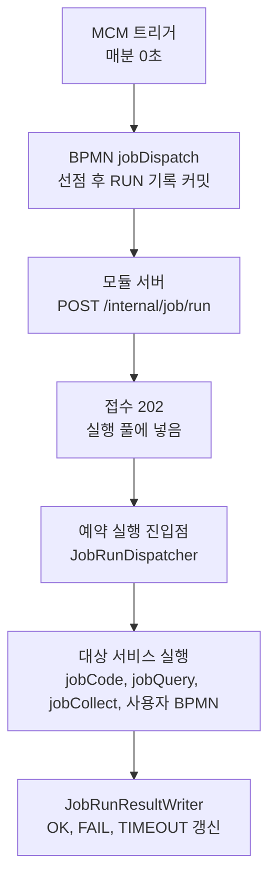

# 예약 작업 처리기·BPMN 만들기

예약 작업 관리 화면에서 고를 수 있는 실행 대상을 코드로 만드는 개발자를 위한 안내서입니다.
화면 사용법은 「사용 방법」 탭에 있습니다. 클래스 이름, 칸 이름, 메시지 문구는 구현 코드에서 확인한 것만 적었습니다.

## 한눈에 보기

| 만들려는 것 | 방법 | 화면에서 고르는 유형 |
|---|---|---|
| Java 로 짠 집계나 정리 | `ScheduledJob` 처리기(람다는 `SimpleScheduledJob`) | 코드 실행 |
| 여러 단계를 엮은 업무 | 사용자 BPMN 서비스 | 서비스 실행 |
| 사용자 BPMN 안에서 SQL 이나 수집을 한 단계로 | 내장 서비스(`jobQuery`, `jobCollect`, `jobCode`)를 서브서비스로 호출 | 서비스 실행 |

- 작업 정의의 실체는 서비스 ID 와 입력입니다. 코드 실행, 쿼리 실행, 수집은 각각 내장 서비스 `jobCode`, `jobQuery`, `jobCollect` 를 부르고, 서비스 실행은 사용자가 만든 BPMN 을 부릅니다.
- 어떤 방법이든 실행 이력(`TB_MCM_JOB_RUN`)은 실행 진입점이 가장 바깥에서 한 번만 씁니다. 처리기와 BPMN 은 이력을 쓰지 않습니다.

## 전체 구조



| 단계 | 하는 곳 | 내용 |
|---|---|---|
| 판정과 선점 | MCM 서버만 | 매분 지금 할 작업을 찾고 한 서버가 행 잠금으로 선점합니다 |
| 호출 | MCM 서버 | 작업에 지정한 모듈 서버의 `/internal/job/run` 으로 요청을 보냅니다. 요청 본문에 서비스 ID, 변수 확정값, 시간 초과가 담깁니다 |
| 접수 | 모듈 서버 | 중복, 처리기 유무, 실행 풀 여유를 확인하고 바로 202 로 답합니다 |
| 실행 | 모듈 서버 | 진입점이 대상 서비스를 자기 트랜잭션에서 실행하고 시간 초과를 감시합니다 |
| 결과 | 모듈 서버 | 진입점이 실행 이력의 RUN 행을 모듈 DB 연결로 직접 갱신합니다 |

- 모듈은 작업 목록을 들고 있지 않고 일정을 판정하지 않습니다. 실행 요청을 받으면 실행만 합니다.
- `/internal/job/run` 은 MCM 의 시스템 호출(`system:mcm`)만 받습니다. 사용자 요청과 사용자 토큰은 403 입니다.

## 코드 처리기 만들기

코드 실행 유형은 `ScheduledJob` 빈으로 등록된 처리기만 실행합니다. 화면에서 임의의 클래스나 메서드 이름을 받지 않습니다.

### ScheduledJob 인터페이스

```java
public interface ScheduledJob {
    String id();                       // 처리기 ID, 예: "mcm.screenUsageRollup"
    JobModule module();                // 모듈 키, 예: JobModule.MCM
    String name();
    default String defaultCron() { return null; }   // 있으면 기동 때 같은 ID 의 작업으로 자동 등록
    default List<JobVar> defaultVars() { return List.of(); }
    default Duration defaultTimeout() { return Duration.ofMinutes(30); }
    int run(JobContext ctx);           // 처리 건수. 실패는 예외
}
```

| 멤버 | 규칙 |
|---|---|
| `id()` | `[A-Za-z0-9_.-]{1,60}`. 관례는 `모듈소문자.이름`입니다. 형식이 틀리면 ERROR 로그를 남기고 등록하지 않습니다 |
| `module()` | 이 처리기가 있는 모듈. 앱의 모듈 키와 같을 때만 등록하고 실행합니다 |
| `name()` | 화면의 처리기 목록과 자동 생성 작업의 작업명으로 쓰입니다 |
| `defaultCron()` | crontab 5칸 식. 비우면 작업을 자동으로 만들지 않고, 사용자가 화면에서 처리기를 골라 일정을 정합니다. 형식이 틀리면 ERROR 로그를 남기고 등록하지 않습니다 |
| `defaultVars()` | 기본 변수 목록. 이름과 형식은 코드가 정하고 화면에서는 값만 바꿉니다 |
| `defaultTimeout()` | 기본 시간 초과. 생략하면 30분입니다 |
| `run(ctx)` | 처리한 건수를 돌려줍니다. 실패는 예외로 알립니다 |

### JobContext

`run` 이 받는 문맥입니다. 변수는 MCM 이 선점할 때 확정한 값입니다.

| 필드 | 내용 |
|---|---|
| `jobId()` | 작업 ID |
| `runId()` | 이번 실행의 ID(UUID) |
| `vars()` | 변수 이름과 확정값 |
| `schedAt()` | 이 회차의 예정 시각 |
| `manual()` | 「지금 실행」이면 true |

### 등록 예: SimpleScheduledJob

기존 서비스의 공개 메서드를 코드 작업으로 노출할 때는 람다로 만드는 `SimpleScheduledJob` 이 편합니다. 이때 기존 클래스는 `ScheduledJob` 을 구현하지 않고 코드도 고치지 않습니다. 설정 클래스의 `@Bean` 메서드가 그 클래스를 주입받아 공개 메서드를 부르는 처리기 빈을 하나 더 만드는 방식입니다. 아래 `mcm.screenUsageRollup` 이 그 예(`JobServerConfig`)입니다. `ScreenUsageRollup` 은 평범한 서비스 클래스이고, 처리기 빈이 `rollup()` 을 호출합니다. 이 클래스에 있던 `@Scheduled` 는 없어졌고 일정은 DB 의 작업 정의가 정합니다.

```java
/** 화면 사용 일별 집계 — 기존 {@code ScreenUsageRollup#rollup()} 을 그대로 부른다. 건수는 집계한 일수. */
@Bean
public ScheduledJob mcmScreenUsageRollup(ObjectProvider<ScreenUsageRollup> rollup) {
    return new SimpleScheduledJob("mcm.screenUsageRollup", JobModule.MCM, "화면 사용 일별 집계", "0 2 * * *", Duration.ofMinutes(30),
            ctx -> rollup.getObject().rollup().days());
}
```

생성자 인자는 처리기 ID, 모듈, 이름, 기본 crontab, 시간 초과, 본문 순서입니다. 변수가 있으면 시간 초과 뒤에 `List<JobVar>` 를 하나 더 넣는 생성자를 씁니다. 같은 방식으로 `mcm.revokedTokenPurge`(만료 토큰 정리), `mcm.collectPurge`, `mcm.jobRunPurge`, `mcm.jobRunSweep` 도 등록되어 있습니다.

다른 모듈에 처리기를 추가할 때도 그 모듈의 설정 클래스에 `@Bean` 으로 `ScheduledJob` 을 두기만 하면 됩니다. 아래는 설명용으로 지어낸 예이며 실제로 등록된 처리기가 아닙니다.

```java
@Bean
public ScheduledJob mdmTermCleanup(TermCleaner cleaner) {
    return new SimpleScheduledJob("mdm.termCleanup", JobModule.MDM, "용어 임시 데이터 정리", "20 3 * * *", Duration.ofMinutes(10),
            ctx -> cleaner.cleanup());
}
```

클래스를 직접 구현해도 됩니다. `id()`, `module()`, `name()`, `run()` 만 구현하면 되고 나머지는 기본 구현이 있습니다.

### 처리기를 만들 때의 규칙

- 같은 회차가 겹치거나 시간 초과 뒤에 다시 돌아도 결과가 같게(멱등) 만듭니다. 시간 초과로 기록된 작업도 다음 회차를 막지 않습니다.
- 실패는 예외로 던집니다. 예외 메시지는 실행 이력에 `USER_ERROR: 문구`(사용자용 예외) 또는 `SYSTEM_ERROR: 예외 종류`로 남습니다. SQL 원문, 주소, 인증값이 메시지에 들어가지 않게 합니다.
- 처리기 안에서 오래 걸리는 SQL 을 쓰면 쿼리 시간 초과를 걸어 두는 것이 좋습니다. 자세한 내용은 「시간 초과」 장에 있습니다.
- `run` 이 돌려준 값이 실행 이력의 건수가 됩니다.

## 모듈 키와 기동 때 등록

- 앱의 모듈 키는 설정 `dmes.job.module` 이고, 비어 있으면 `spring.application.name` 의 첫 `-` 앞부분을 대문자로 씁니다. 판정할 수 없으면 예약 실행이 켜지지 않습니다.
- 모듈 앱이 기동을 마치면(`ApplicationReadyEvent`) 자기 모듈의 `ScheduledJob` 빈을 모두 DB 에 직접 등록합니다. 등록 코드는 `JobHandlerRegistrar` 한 곳에 있습니다.

| 대상 | 동작 |
|---|---|
| `TB_MCM_JOB_HANDLER` | 처리기마다 MERGE 합니다. 이름, 기본 일정, 기본 변수와 마지막 등록 시각(`SEEN_AT`)을 갱신합니다. 화면의 처리기 목록과 「코드 없음」 배지가 이 표를 읽습니다 |
| `TB_MCM_JOB_DEF` | `defaultCron()` 이 있는 처리기만 같은 ID 의 코드 작업(출처 CODE, 서비스 `jobCode`)을 **없을 때만** 만듭니다. 화면에서 바꾼 일정과 사용 여부는 덮어쓰지 않고, 두 서버가 동시에 떠도 행은 하나입니다 |

- 등록에 실패하면(표 없음, 권한, DB 순간 오류) WARN 을 한 번 남기고 1분 뒤 한 번 더 시도합니다. 앱 기동은 실패하지 않습니다.
- MCM 이 꺼져 있어도 모듈 앱은 기동에 실패하지 않습니다. 모듈은 MCM 과 HTTP 로 통신하지 않고 DB 만 씁니다.
- `SEEN_AT` 이 7일 넘게 갱신되지 않은 처리기의 작업은 화면에 「코드 없음」으로 보이고 「지금 실행」이 막힙니다.
- 처리기가 없는 서버가 요청을 받으면 접수 단계에서 404 `JOB_HANDLER_NOT_FOUND` 로 답하고 이력에 `처리기 없음` 이 남습니다.
- `dmes.job.agent.enabled=false` 인 앱은 `/internal/job/run` 요청에 404 로 답합니다.
- 코드 작업이 만들어진 뒤 `defaultCron()` 을 코드에서 바꿔도 이미 있는 작업의 일정은 바뀌지 않습니다. 일정의 정본은 DB 입니다.

## 사용자 BPMN 만들기

서비스 실행 유형은 이미 만들어진 BPMN 서비스를 서비스 ID 와 Action 으로 부릅니다.

- BPMN 파일은 각 모듈 api 의 클래스패스(`src/backend/모듈/api/src/main/resources/services/**/*.bpmn`)에 둡니다. 코드와 함께 배포되며 실행 중에 고치는 경로는 없습니다.
- 서비스 ID 는 그 BPMN 서비스를 화면에서 부를 때 쓰는 ID 와 같습니다(예: `jobSchedMng` 서비스는 `/oasis/jobSchedMng/…` 로 부릅니다).
- 진입점이 서비스에 넘기는 입력은 `action` 과 변수 표의 변수 확정값입니다. 변수 이름이 서비스의 입력 파라미터 이름입니다.
- 서비스가 출력 `jobItemCnt` 에 숫자를 담으면 그 값이 실행 이력의 건수가 됩니다. 내장 서비스를 거쳤다면 그 건수가 쌓인 값을 우선합니다.
- 서비스 ID 와 Action 은 저장할 때 형식만 검사합니다. 없는 서비스는 저장은 되지만 실행할 때 실패로 남습니다.
- 서비스 ID 로 `jobCode`, `jobQuery`, `jobCollect`(내장), `jobDispatch`(판정)는 서비스 실행 유형으로 등록할 수 없습니다.
- BPMN 서비스는 자기 트랜잭션에서 돌고, 정상 종료하면 커밋됩니다.

## 내장 서비스를 서브서비스로 엮기

OASIS 에서는 서비스에서 다른 서비스를 함수처럼 부를 수 있습니다. 사용자 BPMN 이 내장 서비스를 여러 번 엮으면서 호출마다 다른 문장이나 원천을 줄 수 있습니다.

### 내장 서비스와 입력

| 서비스 | 입력 | 하는 일 | 건수 |
|---|---|---|---|
| `jobCode` | `handlerId`(처리기 ID) | 그 `ScheduledJob` 빈의 `run` 을 실행합니다 | 처리기가 돌려준 수 |
| `jobQuery` | `sql`(DML 한 문장 또는 `BEGIN 프로시저(…); END;`) | 그 모듈 기본 DB 에서 서비스 트랜잭션 안에 실행합니다 | DML 은 영향받은 행 수, 프로시저는 0 |
| `jobCollect` | `source`(sql, http, exchange), `save`(기본 true) | 원천에서 값을 읽어 범위에 담고, 저장은 진입점이 결과 갱신 때 합니다 | 읽은 항목 수 |

- 입력을 서비스 입력 파라미터로 주면 그 값을 쓰고, 주지 않으면 작업 정의의 설정(쿼리 실행 작업의 `sql`, 수집 작업의 `source`)을 씁니다.
- 변수 값은 늘 작업의 변수에서 읽습니다. `jobQuery` 의 SQL 안 `:이름` 은 변수 표에 있는 이름이어야 하고, 없으면 `변수 :이름 의 값이 없습니다` 로 실패합니다.
- SQL 은 화면의 쿼리 실행과 같은 검사를 실행할 때마다 거칩니다. 허용되는 문장과 거절되는 문장은 「사용 방법」 탭의 쿼리 실행 설명을 봅니다.
- 건수는 내장 서비스를 부를 때마다 쌓입니다. 진입점이 마지막에 그 합계를 이력에 기록합니다.

### BPMN 예

사용자 BPMN 이 내장 서비스 `jobQuery` 를 문장마다 한 번씩 부르는 예입니다. 서브서비스 호출은 `callActivity` 의 `calledElement` 에 서비스 ID 를 적고 입력은 `inputParameter` 로 줍니다.

```xml
<bpmn:callActivity id="callFirst" name="첫 문장" calledElement="jobQuery">
  <bpmn:extensionElements>
    <camunda:inputOutput>
      <camunda:inputParameter name="sql">UPDATE TB_XXX SET STATUS = 'C' WHERE BASE_DT = :baseDt</camunda:inputParameter>
    </camunda:inputOutput>
  </bpmn:extensionElements>
  <bpmn:incoming>flow_1</bpmn:incoming>
  <bpmn:outgoing>flow_2</bpmn:outgoing>
</bpmn:callActivity>
<bpmn:callActivity id="callSecond" name="둘째 문장" calledElement="jobQuery">
  <bpmn:extensionElements>
    <camunda:inputOutput>
      <camunda:inputParameter name="sql">UPDATE TB_YYY SET USE_YN = 'N' WHERE BASE_DT = :baseDt</camunda:inputParameter>
    </camunda:inputOutput>
  </bpmn:extensionElements>
  <bpmn:incoming>flow_2</bpmn:incoming>
  <bpmn:outgoing>flow_3</bpmn:outgoing>
</bpmn:callActivity>
```

- 위 예에서 `:baseDt` 는 작업의 변수 표에 선언한 변수입니다(예: DATE, 값 `:yesterday`).
- 업무 서비스(예: `dma^^termMng`)와 내장 서비스를 한 BPMN 에서 차례로 엮을 수 있고, 몇 겹으로 감싸도 됩니다.

### 지켜야 할 규칙

- 내장 서비스는 **같은 스레드의 연결 서브서비스**(기본값)로 부를 때만 동작합니다. `createNewService=true`, 병렬 게이트웨이, 병렬 다중 인스턴스 안에서 부르면 `예약 실행 밖에서는 호출할 수 없습니다.` 로 거절됩니다.
- `createNewService=true` 는 쓰지 않습니다. 새 스레드에서 돌아 범위가 없고, OASIS 의 전역 50초 상한과 결과 null 문제도 있습니다.
- 내장 서비스를 웹 요청(`/api/모듈/oasis/jobQuery/run` 등)으로 직접 부르면 같은 문구로 거절됩니다. 예약 실행 진입점이 연 범위 안에서만 동작합니다.
- 예약 작업 진입점은 이미 실행 범위가 열려 있으면 거절합니다. 서비스 중첩은 연결 서브서비스로만 합니다.

## 한 트랜잭션 규칙

| 상황 | 동작 |
|---|---|
| 대상 서비스 | 서비스 하나가 자기 트랜잭션 하나로 돕니다. 진입점은 트랜잭션 밖의 평범한 Java 입니다 |
| 연결 서브서비스 | 부모와 같은 스레드, 같은 트랜잭션입니다. 사용자 BPMN 이 엮은 여러 단계는 한 트랜잭션입니다 |
| 정상 종료 | 가장 바깥 서비스가 끝날 때 커밋됩니다 |
| 실패, 시간 초과(쿼리 시간 초과) | 대상 트랜잭션이 롤백됩니다. 연결 서브서비스로 엮은 단계도 함께 롤백됩니다 |
| 실패 기록 | 대상 트랜잭션과 분리된 짧은 트랜잭션(`REQUIRES_NEW`)으로 씁니다. 대상이 롤백되어도 실패 기록은 남습니다 |

다음은 바깥에서 이미 커밋되므로 롤백되지 않습니다. 이런 작업은 다시 돌려도 결과가 같게(멱등) 만듭니다.

- `createNewService=true` 로 부른 업무 서브서비스(자기 트랜잭션으로 따로 커밋합니다)
- OASIS 의 커밋 요청 이벤트로 묶음마다 중간 커밋하는 작업
- `alwaysCommit` 트랜잭션 관리자로 쓴 내용

## 시간 초과

- 시간 초과는 실행 진입점이 감시합니다. 한도를 넘기면 상태를 TIMEOUT 으로 기록하고 실행 스레드에 중단(인터럽트)을 요청합니다.
- 인터럽트는 실행 중인 JDBC 문장을 멈추지 못합니다. 그래서 내장 서비스(`jobQuery`, 수집의 SQL 원천)는 **문장마다 DB 쿼리 시간 초과를 겁니다.** 값은 이 시도의 마감까지 남은 시간(초, 올림, 최소 1초)입니다. 수집 SQL 원천은 이 값과 10초 중 작은 값을 씁니다.
- 쿼리 시간 초과가 나면 Oracle 이 문장을 취소(ORA-01013)하고 대상 트랜잭션이 롤백되며, 상태는 FAIL 이 아니라 TIMEOUT(`쿼리 시간 초과`)입니다.
- **사용자 BPMN 과 코드 처리기는 이 강제가 없습니다.** 긴 SQL 은 직접 쿼리 시간 초과를 걸 것을 권장합니다. 걸지 않으면 TIMEOUT 으로 기록된 뒤에도 작업이 끝까지 돌아 커밋할 수 있습니다. 이때 늦게 도착한 결과로 이력을 덮어쓰지 않고 모듈 로그에 경고만 남깁니다.
- OASIS 의 `timeoutSecond` 로는 대신할 수 없습니다. 값이 전역 50초로 고정되어 있고 `createNewService=true` 서브서비스에만 쓰이며, 시간을 넘기면 결과가 null 이어서 오류가 납니다.
- 시간 초과 값은 작업마다 정합니다(10-86400초). 처리기의 `defaultTimeout()` 은 자동으로 만들어지는 작업의 초기값입니다.

## 로그와 실행 기록에 남는 것

| 무엇 | 어디에 |
|---|---|
| 매분 트리거의 시작과 끝 두 줄 | sch 로그 파일 |
| 판정과 선점의 SQL·bind 줄, 모듈 호출과 접수 결과 | MCM 업무 로그(서비스 `jobDispatch`) |
| 「지금 실행」의 이력 INSERT | MCM 업무 로그(서비스 `jobSchedMng`) |
| 모듈에서 실행한 서비스 전체(진입점 시작·끝 줄, 대상과 서브서비스 로그), 결과 갱신 SQL, 늦은 결과 경고 | **그 모듈의 업무 로그** |
| 코드 작업·처리기 등록 MERGE | 그 모듈의 업무 로그 |

- 실행 이력의 `MSG` 에는 결과 코드와 사용자용 메시지만 남깁니다. SQL 원문, 주소, 인증값, DB 원문 오류 메시지는 넣지 않습니다. 시스템 오류는 예외 종류 이름만 남습니다.
- 로그에도 SQL 원문이나 인증값을 남기지 않도록 예외 메시지를 만들 때 주의합니다.
- 모듈에서 실행한 서비스의 로그 줄은 서비스 ID 가 `sch.` 로 시작하지 않으므로 sch 파일이 아니라 그 모듈의 업무 로그로 갑니다.

### 서비스 태그로 로그 찾기

1. 예약 작업 관리 화면에서 작업을 고르고 실행 이력에서 해당 회차 행을 찾습니다.
2. 행의 「실행 서버」(호스트:앱 이름:프로세스 번호)와 「서비스 태그」를 확인합니다.
3. 로그 뷰어에서 그 서버를 고르고 서비스 태그로 검색합니다. 진입점의 시작·끝 줄, 대상 서비스와 서브서비스의 로그, 결과 갱신 SQL 이 같은 태그로 묶여 있습니다.
4. MCM 쪽 판정과 호출 로그는 서비스 `jobDispatch` 로 찾고, 이력의 실행 ID(`runId`)로 모듈 쪽 로그와 이어 봅니다.

## 점검 목록

- [ ] 처리기 ID 가 `[A-Za-z0-9_.-]{1,60}` 이고 다른 처리기와 겹치지 않는다
- [ ] `module()` 이 처리기를 둔 앱의 모듈 키와 같다
- [ ] 기본 일정이 있다면 crontab 5칸이고 `일`과 `요일`을 동시에 제한하지 않았다
- [ ] 같은 회차가 겹치거나 다시 돌아도 결과가 같다(멱등)
- [ ] 실패는 예외로 던지고, 메시지에 SQL 원문이나 인증값이 없다
- [ ] 긴 SQL 에는 쿼리 시간 초과가 걸려 있다
- [ ] 사용자 BPMN 에서 내장 서비스를 `createNewService`, 병렬 게이트웨이, 병렬 다중 인스턴스 안에서 부르지 않았다
- [ ] 사용자 BPMN 의 서비스 ID 가 `jobCode`, `jobQuery`, `jobCollect`, `jobDispatch` 가 아니다
- [ ] 쿼리 안의 `:이름` 을 작업의 변수 표에 선언했다
