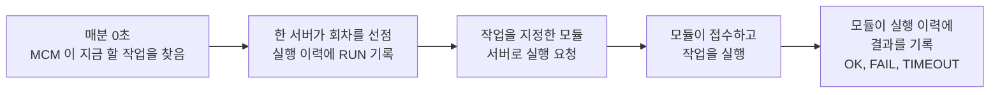

# 예약 작업 관리 사용 방법

예약 작업 관리 화면(공통관리 > 시스템관리 > 예약 작업 관리)을 쓰는 운영자를 위한 안내서입니다.
서버에서 정해진 시각마다 해야 하는 일(집계, 정리, 수집, 쿼리 실행, 업무 서비스 호출)을 한곳에서 등록하고 결과를 확인합니다.
값, 칸 이름, 메시지 문구는 설계 문서와 구현 코드에서 확인한 것만 적었습니다.

## 한눈에 보기

| 알고 싶은 것 | 답 |
|---|---|
| 무엇을 하는 화면인가 | 서버의 cron 을 대신합니다. 일정(crontab 식)과 할 일을 DB 에 등록하면 서버가 알아서 그 시각에 실행합니다 |
| 어디서 실행되나 | 작업마다 고른 모듈(MCM, MDM, MPP, MLS, MQC, MPN)의 서버에서 실행됩니다 |
| 서버가 여러 대이면 | 한 회차는 한 서버에서 한 번만 실행됩니다 |
| 저장하면 언제부터 적용되나 | 저장이 끝난 다음 분부터 새 설정으로 실행됩니다 |
| 실행 유형 | 코드 실행, 서비스 실행(BPMN), 쿼리 실행, 수집 4가지입니다 |
| 결과는 어디서 보나 | 화면 아래쪽 「실행 이력」입니다 |
| 이 화면을 쓸 수 있는 사람 | 시스템 관리자(SYSADMIN)입니다 |

### 한 회차가 실행되는 흐름



- MCM 서버가 매분 정각에 "지금 실행할 작업"을 찾습니다. 이 일은 MCM 만 합니다.
- 실행은 작업에 지정한 모듈 서버가 합니다. 모듈은 작업 목록을 들고 있지 않고 MCM 이 보낸 요청만 실행합니다.
- MCM 이 꺼져 있는 동안에는 모든 모듈의 예약 작업이 멈춥니다. 자세한 내용은 「놓친 회차와 겹침」 장에 있습니다.

## 화면 구성

화면은 조회 조건, 왼쪽의 작업 목록과 실행 이력, 오른쪽의 상세로 나뉩니다. 처음 열면 자동으로 조회됩니다.

### 조회 조건

| 조건 | 고를 수 있는 값 |
|---|---|
| 모듈 | 전체, MCM, MDM, MPP, MLS, MQC, MPN |
| 유형 | 전체, 코드 실행, 서비스 실행, 쿼리 실행, 수집 |
| 사용 | 전체, 사용, 중지 |
| 최근 결과 | 전체, 정상, 실패, 실행 중, 건너뜀, 시간 초과 |
| 이름/ID | 작업명이나 작업 ID 의 일부. 검색어의 `_` 와 `%` 는 지우고 검색하므로 `_` 가 든 부분 문자열로는 찾을 수 없습니다 |

작업 목록은 최대 500건까지 보입니다. 500건에 닿으면 안내가 나오므로 모듈이나 유형으로 좁혀 조회합니다.

### 작업 목록

| 열 | 뜻 |
|---|---|
| 모듈 | 이 작업을 실행하는 모듈 |
| 작업 ID, 작업명 | 작업을 구분하는 이름 |
| 유형 | 코드 실행, 서비스 실행, 쿼리 실행, 수집. 「코드 없음」 배지가 붙으면 아래 설명을 봅니다 |
| crontab 식, 일정 설명 | 일정 식과 사람이 읽는 설명(예: 매일 02:00) |
| 사용 | 사용 또는 중지 |
| 다음 예정 | 다음에 실행될 시각. 중지했거나 「코드 없음」인 작업은 `-` 로 보입니다 |
| 최근 결과, 최근 실행 서버 | 가장 최근 실행의 상태와 실행한 서버 |

「코드 없음」 배지는 코드로 등록된 처리기를 그 모듈 서버가 7일 넘게 등록하지 않았다는 뜻입니다.
처리기가 삭제되었거나 그 모듈 서버가 오래 꺼져 있을 수 있습니다. 이 작업은 「지금 실행」을 쓸 수 없습니다.

### 실행 이력

작업 하나를 고르면 그 작업의 최근 실행이 최대 100건 보입니다.

| 열 | 뜻 |
|---|---|
| 예정 시각 | 실행하기로 한 시각(초 단위). 「지금 실행」은 요청한 시각입니다 |
| 구분 | 일정(정해진 시각에 자동 실행), 수동(「지금 실행」), 놓친 회차(옵션을 켠 작업이 늦은 회차를 한 번 실행한 것) |
| 상태 | 정상, 실패, 실행 중, 건너뜀, 시간 초과. 뜻은 「실행 이력 읽기」 장에 있습니다 |
| 실행 서버 | 요청을 접수한 모듈 서버(호스트:앱 이름:프로세스 번호) |
| 서비스 태그 | 그 모듈 서버 로그에서 이 실행을 찾는 열쇠 |
| 시작, 끝, 소요 | 선점한 시각, 결과를 기록한 시각, 걸린 시간 |
| 건수 | 처리 건수. 뜻은 유형마다 다릅니다 |
| 메시지 | 실패나 건너뜀의 사유. 수집(HTTP)이 일시 오류를 다시 시도해 성공했다면 그 설명도 남습니다 |

### 수집 값 보기

수집 작업이 쌓은 값은 화면 아래쪽 「수집 값」 탭에서 읽습니다. 「실행 이력」 옆에 탭이 생기고, 고른 작업이 **저장한 수집 작업**이면서 「읽은 값을 수집 값 표에 저장」이 켜져 있을 때만 보입니다. 다른 유형이거나 저장을 끈 작업은 탭이 없습니다. 이 탭은 읽기 전용이고, 탭을 열어야 값을 불러옵니다. 환율의 업무 값은 마루 MDM 의 마스터데이터에서 보고, 이 탭은 수집 원본을 확인하는 용도입니다(수집 실패나 값 이상을 볼 때 씁니다).

| 보기 | 내용 |
|---|---|
| 최신 회차 | 가장 최근에 수집한 한 회차의 항목 키, 값, 수집 시각 |
| 이력 | 수집 회차를 행으로, 항목 키를 열로 편 표. 최신 회차가 위에 옵니다 |

- 이력 보기는 기간(최근 1일, 7일, 30일, 90일. 처음은 7일)과 항목 키로 좁힙니다. 항목 키 선택지는 지금까지 불러온 값에서 모읍니다.
- 한 번에 최대 500행을 받습니다. 넘으면 「이전 회차 더 보기」가 나타나 더 오래된 회차를 이어 받습니다.
- 항목 키가 60개를 넘으면 앞쪽 60개만 열로 보이고 안내가 나옵니다. 항목 키로 좁혀 보세요.
- 값 칸에는 숫자 값이 있으면 숫자(소수 8자리까지), 없으면 글자 값이 나옵니다.
- 표 머리줄의 「그리드 설정」 메뉴에서 「엑셀 출력」으로 지금 보이는 표를 내려받을 수 있습니다.
- 수집 값은 90일보다 오래되면 `mcm.collectPurge` 가 지우므로 그보다 오래된 값은 볼 수 없습니다.

### 상세 카드

| 카드 | 내용 |
|---|---|
| 기본 | 실행 모듈, 작업 ID, 작업명, 유형, 설명, 사용 |
| 일정 | crontab 식을 만드는 칸과 다음 예정 시각 미리보기 |
| (유형) 설정 | 유형마다 다른 입력 칸. 「실행기별 설명」 장에 있습니다 |
| 변수 | 작업에 넘기는 변수 표 |
| 고급 설정 | 시간 초과, 실패 시 재시도, 놓친 회차 한 번 실행. 처음에는 접혀 있습니다 |

상세 아래의 단추는 다음과 같습니다.

| 단추 | 하는 일 |
|---|---|
| 복사 | 지금 작업을 바탕으로 새 작업을 만듭니다. 코드가 등록한 작업은 복사할 수 없습니다 |
| 중지로 / 사용으로 | 사용 여부를 바꿉니다. 저장하지 않은 변경이 있으면 먼저 저장해야 합니다 |
| 지금 실행 | 일정과 상관없이 한 번 실행합니다 |
| 삭제 | 작업과 실행 이력, 수집 값을 함께 지웁니다. 화면에서 만든 작업만 지울 수 있고, 실행 중인 작업은 `실행 중인 작업은 삭제할 수 없습니다` 로 거절됩니다 |
| 저장 | 입력을 저장합니다 |

최근 실행이 실패하거나 시간 초과였으면 상세 위쪽에 사유가 붉은 안내로 나옵니다.

## 작업 만들기

1. 작업 목록의 [새 작업]을 누릅니다.
2. 유형 카드 4개(코드 실행, 서비스 실행, 쿼리 실행, 수집) 중에서 고릅니다. 무엇을 고를지는 아래 표를 봅니다.
3. 기본 카드를 채웁니다.
4. 일정을 정합니다.
5. 유형 설정과 변수를 채웁니다.
6. 필요하면 고급 설정에서 시간 초과와 재시도를 바꿉니다.
7. [저장]을 누릅니다. 저장이 끝난 다음 분부터 일정대로 실행됩니다.

| 이런 일을 하려면 | 고르는 유형 |
|---|---|
| 개발자가 코드로 만들어 둔 집계나 정리를 정해진 시각에 돌린다 | 코드 실행 |
| 이미 있는 업무 서비스(BPMN)를 정해진 시각에 호출한다 | 서비스 실행 |
| UPDATE, DELETE 같은 DML 한 문장이나 프로시저 하나를 돌린다 | 쿼리 실행 |
| SQL 결과, 외부 웹 주소의 값, 환율을 읽어 표에 쌓는다 | 수집 |

### 기본 카드의 입력 칸

| 칸 | 규칙 |
|---|---|
| 실행 모듈 | MCM, MDM, MPP, MLS, MQC, MPN 중 하나. 작업이 실행될 서버입니다 |
| 작업 ID | 영문, 숫자, `_`, `.`, `-` 로 1자 이상 60자 이하. 저장하면 바꿀 수 없습니다. `모듈소문자.이름`(예: `mdm.masterSync`) 형태를 권장합니다 |
| 작업명 | 1자 이상 100자 이하 |
| 설명 | 500자 이하(선택) |
| 사용 | 사용이면 일정대로 실행하고, 중지이면 실행하지 않습니다 |

## 일정(crontab 식)

일정은 리눅스 crontab 과 같은 5칸 식입니다. 시간대는 한국 시간(Asia/Seoul)입니다.

```text
분 시 일 월 요일
```

| 칸 | 범위 | 예 |
|---|---|---|
| 분 | 0-59 | `*/5`, `0,30` |
| 시 | 0-23 | `9-18`, `0,12` |
| 일 | 1-31 | `1`, `1,15` |
| 월 | 1-12 또는 JAN-DEC | `*/3`, `1,7` |
| 요일 | 0-7 또는 SUN-SAT (0과 7은 일요일) | `1-5`, `0,6` |

각 칸에는 `*`(전부), `,`(나열), `-`(범위), `/`(간격)를 쓸 수 있습니다. `@hourly`, `@daily`, `@weekly`, `@monthly`, `@yearly` 도 받습니다.

### 자주 쓰는 일정

| 하려는 일 | crontab 식 |
|---|---|
| 매분 | `* * * * *` |
| 5분마다 | `*/5 * * * *` |
| 매시 정각 | `0 * * * *` |
| 매일 02:00 | `0 2 * * *` |
| 평일 09:00 | `0 9 * * 1-5` |
| 매주 일요일 04:00 | `0 4 * * 0` |
| 매월 1일 00:30 | `30 0 1 * *` |
| 매일 03:30 | `30 3 * * *` |

### 입력 방식

- 쉬운 설정: 반복 종류(매분, N분마다, 매시간, 매일, 매주, 매월)를 고르면 칸이 알맞게 나오고 식이 만들어집니다. 만들어진 식은 복사할 수 있습니다.
- 직접 입력: 다섯 칸을 직접 씁니다. 쉬운 설정으로 나타낼 수 없는 식은 직접 입력으로만 편집됩니다.
- 어느 쪽이든 식 아래에 설명과 다음 예정 시각이 미리보기로 나옵니다. 화면이 먼저 계산해 보여 주고 서버의 계산 결과가 오면 그 값으로 바뀝니다.

### 지켜야 할 점

- 최소 간격은 1분입니다. 초 단위 일정은 없습니다.
- 일과 요일을 둘 다 `*` 가 아닌 값으로 제한한 식(예: `0 9 1 * 1`)은 저장되지 않습니다. 리눅스 crontab 에서는 둘 중 하나만 맞아도 실행되지만 이 시스템은 둘 다 맞아야 실행되므로 뜻이 달라지기 때문입니다. 하나는 `*` 로 둡니다.
- `?`, `L`, `W`, `#` 와 6칸 식은 쓸 수 없습니다.
- 수집 유형은 연속한 두 실행의 간격이 5분 이상이어야 하고, 환율 수집은 60분 이상이어야 합니다. 다른 유형은 1분 간격도 됩니다.
- 매분 0초에 실행할 작업을 찾으므로 정시에서 몇 초 늦게 시작될 수 있습니다.
- 사용을 중지했다가 다시 사용으로 바꾸면 다음 예정은 그때를 기준으로 새로 계산됩니다. 중지한 동안의 회차가 한꺼번에 실행되지 않습니다.

## 변수

변수는 작업에 넘기는 값입니다. 같은 작업을 날짜만 바꿔 돌리고 싶을 때 SQL 에 날짜를 박아 두지 않고 변수로 씁니다.

### 변수 표의 칸

| 칸 | 규칙 |
|---|---|
| 이름 | 영문자로 시작하는 영문, 숫자, `_` 30자 이하. 작업 안에서 겹치면 안 됩니다. `action`, `sql`, `handlerId`, `source`, `save` 는 예약어라 쓸 수 없습니다 |
| 형식 | 문자(STRING), 숫자(NUMBER), 날짜(DATE), JSON |
| 값 | 고정값 또는 실행 변수(아래 표). 1000자 이하 |
| 설명 | 메모 |

한 작업에 변수를 최대 30개까지 둘 수 있습니다. 형식에 맞지 않는 값(숫자 칸에 글자 등)은 저장되지 않습니다. DATE 값은 `yyyy-MM-dd` 또는 `yyyy-MM-dd HH:mm[:ss]` 입니다.

### 내장 변수(실행 변수)

값 칸에 콜론으로 시작하는 아래 이름을 쓰면 실행할 때마다 값이 자동으로 채워집니다.

| 값 | 채워지는 값 |
|---|---|
| `:schedAt` | 이 회차의 예정 시각(yyyy-MM-ddTHH:mm:ss) |
| `:now` | MCM 이 이 회차를 선점한 시각(DB 시각). 재시도할 때도 같은 값입니다 |
| `:today` | 예정 시각의 날짜 |
| `:yesterday` | 예정 시각 날짜의 전날 |
| `:monthStart` | 예정 시각이 속한 달의 1일 |
| `:prevMonthStart` | 그 전달의 1일 |
| `:prevRunAt` | 직전에 정상 종료한 일정 회차의 예정 시각. 없으면 값이 없습니다 |
| `:jobId` | 작업 ID |
| `:moduleCd` | 작업의 모듈 |

- 날짜 변수(`:today`, `:yesterday`, `:monthStart`, `:prevMonthStart`)는 현재 시각이 아니라 예정 시각을 기준으로 합니다. 자정 작업이 조금 일찍 시작되어도 날짜가 하루 어긋나지 않습니다.
- `:prevRunAt` 은 일정으로 실행된 정상 회차만 셉니다. 「지금 실행」으로 돌린 회차는 세지 않으므로 일정 회차의 구간이 당겨지지 않습니다.
- 값은 요청을 보낼 때 한 번 확정되어 실행 이력(DB)에 남습니다. 이력 그리드에는 이 값이 보이지 않습니다.
- 「지금 실행」은 지금 시각을 기준으로 저장된 변수를 확정합니다. 화면에서는 변수 값을 바꿔 지난 기간을 다시 돌릴 수 없습니다.

### 유형별로 변수가 쓰이는 곳

| 유형 | 변수가 쓰이는 곳 |
|---|---|
| 코드 실행 | 처리기에 값으로 전달됩니다. 이름과 형식은 코드가 정하고 화면에서는 값만 바꿉니다 |
| 서비스 실행 | 서비스의 입력 파라미터가 됩니다 |
| 쿼리 실행 | SQL 안의 `:이름` 자리에 바인드됩니다. SQL 에서 쓴 이름은 변수 표에 선언해야 합니다 |
| 수집(SQL 원천) | 원천 SQL 의 `:이름` 자리에 바인드됩니다 |
| 수집(HTTP 원천) | 주소의 `{{이름}}` 자리에 들어갑니다. 경로와 쿼리에만 쓸 수 있고, 값은 주소에 맞게 인코딩됩니다 |
| 수집(환율 원천) | 쓰이지 않습니다 |

## 실행기별 설명

실행 유형마다 같은 틀로 설명합니다. 실행기는 작업을 실제로 수행하는 부분을 말합니다.

### 코드 실행

| 항목 | 내용 |
|---|---|
| 무엇을 하나 | 개발자가 코드로 등록한 처리기 하나를 실행합니다. 화면에서 임의의 클래스나 메서드를 지정할 수는 없고, 등록된 처리기만 실행됩니다 |
| 화면 입력 칸 | 처리기(목록에서 고름). 고르면 변수 기본값이 채워지고, 작업명은 비어 있을 때만, 일정은 처리기에 기본 일정이 있을 때만 함께 채워집니다. 같은 처리기를 변수만 달리해 여러 작업으로 쓸 수 있습니다 |
| 실제로 부르는 서비스 | 내장 서비스 `jobCode` |
| 처리 건수의 뜻 | 처리기가 돌려준 수. 무엇을 세는지는 처리기마다 아래 표에 적었습니다 |
| 기본 시간 초과 | 30분(1800초) |
| 제약과 거절 | 등록되지 않은 처리기는 저장되지 않습니다. 코드가 등록한 작업의 제약은 「코드 작업의 제약」 장에 있습니다 |
| 실패하면 | 처리기가 예외를 던지면 실패로 기록됩니다. 처리기를 찾지 못한 서버가 요청을 받으면 `처리기 없음` 이 남습니다 |
| 예시 | 처리기 `mcm.screenUsageRollup`(기본 일정 `0 2 * * *`)을 골라 MCM 에서 매일 02:00 에 실행합니다 |

#### 지금 등록된 처리기

모두 MCM 모듈의 처리기이고, 기본 일정이 있어서 MCM 서버가 기동할 때 같은 ID 의 작업이 자동으로 만들어집니다.

| 처리기 ID | 이름 | 기본 일정 | 시간 초과 | 하는 일 | 처리 건수 |
|---|---|---|---|---|---|
| `mcm.screenUsageRollup` | 화면 사용 일별 집계 | `0 2 * * *` (매일 02:00) | 30분 | 화면 사용 원본 기록을 일별로 집계합니다. 집계 범위는 마지막으로 집계한 날의 2일 전부터 어제까지이고, 집계가 끝난 뒤 365일이 지난 원본은 지웁니다 | 집계한 일수 |
| `mcm.revokedTokenPurge` | 만료 토큰 정리 | `0 * * * *` (매시 정각) | 10분 | 만료된 회수 토큰을 지웁니다 | 지운 수 |
| `mcm.collectPurge` | 수집 값 보관 삭제 | `30 3 * * *` (매일 03:30) | 30분 | 수집 값 표에서 90일이 지난 값을 지웁니다. 수집 기능이 꺼져 있으면(`dmes.job.collect.enabled=false`) 아무것도 하지 않습니다. 이 설정이 꺼지면 수집 유형 작업 자체가 선점 대상에서 빠져 실행도 이력도 생기지 않습니다 | 지운 수 |
| `mcm.jobRunPurge` | 실행 기록 보관 삭제 | `40 3 * * *` (매일 03:40) | 30분 | 시작한 지 90일이 지난 실행 이력을 지웁니다 | 지운 수 |
| `mcm.jobRunSweep` | 멈춘 실행 정리 | `*/5 * * * *` (5분마다) | 5분 | 상태가 「실행 중」으로 멈춘 이력을 「시간 초과」로 닫습니다. 기준은 시작 시각에 시간 초과와 여유 300초를 더한 시각이 지난 것입니다 | 닫은 수 |

이 표의 처리기가 전부입니다. MDM, MPP, MLS, MQC, MPN 모듈에는 아직 등록된 처리기가 없습니다. 개발자가 처리기를 추가하면 그 모듈의 서버가 기동할 때 목록에 나타납니다. 만드는 방법은 「처리기·BPMN 만들기」 탭에 있습니다.

### 서비스 실행(BPMN)

| 항목 | 내용 |
|---|---|
| 무엇을 하나 | 이미 만들어진 업무 서비스(BPMN)를 서비스 ID 와 Action 으로 호출합니다 |
| 화면 입력 칸 | 서비스 ID(예: `dma^^termMng`), Action(예: `rebuild`) |
| 실제로 부르는 서비스 | 입력한 서비스 ID 의 업무 서비스. 변수 표의 변수가 그 서비스의 입력 파라미터로 넘어갑니다 |
| 처리 건수의 뜻 | 서비스 안에서 내장 서비스(쿼리 실행, 수집, 코드 실행)를 불렀다면 그 건수가 쌓인 값을 우선합니다. 그런 호출이 없으면 서비스가 출력 `jobItemCnt` 에 담은 숫자를 씁니다. 둘 다 없으면 비어 있습니다 |
| 기본 시간 초과 | 10분(600초) |
| 제약과 거절 | 서비스 ID 와 Action 은 형식만 검사합니다. 내장 서비스(`jobCode`, `jobQuery`, `jobCollect`)와 판정 서비스(`jobDispatch`)는 이 유형으로 등록할 수 없습니다. 내장 서비스는 쿼리 실행이나 수집 유형으로 등록합니다 |
| 실패하면 | 서비스가 실패 결과를 돌려주면 실패로 기록되고 메시지에 결과 코드와 사용자용 문구가 남습니다. 없는 서비스 ID 는 저장은 되지만 실행할 때 실패로 남습니다 |
| 예시 | 서비스 ID `dma^^termMng`, Action `rebuild` 를 MDM 모듈에서 매일 01:00 에 호출합니다. 서비스가 쓰는 날짜 파라미터는 변수 `baseDt`(DATE, 값 `:yesterday`)로 넘깁니다 |

서비스는 하나의 트랜잭션으로 실행됩니다. 서비스가 정상 종료하면 커밋되고 실패하면 롤백됩니다. 실패 기록은 롤백과 별도로 남습니다.

### 쿼리 실행

| 항목 | 내용 |
|---|---|
| 무엇을 하나 | 그 모듈 DB 에서 DML 한 문장 또는 프로시저 호출 하나를 실행합니다 |
| 화면 입력 칸 | 실행할 SQL(최대 20,000자) |
| 실제로 부르는 서비스 | 내장 서비스 `jobQuery` |
| 처리 건수의 뜻 | DML 이면 영향받은 행 수. 프로시저 호출이면 0 입니다 |
| 기본 시간 초과 | 10분(600초). 문장마다 DB 의 쿼리 시간 초과도 걸리므로 시간이 지나면 DB 가 문장을 취소합니다 |
| 제약과 거절 | 아래 「허용되는 문장」과 「거절되는 문장」을 봅니다 |
| 실패하면 | 실행이 실패하면 롤백되어 그 시도의 변경은 남지 않습니다. 쿼리 시간 초과이면 상태가 시간 초과이고 메시지는 `쿼리 시간 초과` 입니다. 메시지에는 SQL 원문을 넣지 않습니다 |
| 예시 | 모듈 MDM, 일정 `10 0 * * *`, 변수 `baseDt`(DATE, 값 `:yesterday`), SQL 은 아래 코드 블록 |

```sql
UPDATE TB_XXX
   SET STATUS = 'C'
 WHERE BASE_DT = :baseDt
```

#### 허용되는 문장

| 종류 | 형태 |
|---|---|
| DML 한 문장 | `INSERT`, `UPDATE`, `DELETE`, `MERGE` 중 하나. 끝의 `;` 는 있어도 되고 없어도 됩니다 |
| 프로시저 하나 | `BEGIN 프로시저이름(인수); END;` 형태. 패키지 이름을 붙인 `BEGIN PKG.PROC(:baseDt); END;` 도 됩니다 |

SQL 안에서 값을 받으려면 `:이름` 으로 쓰고, 그 이름을 변수 표에 선언합니다. 선언하지 않으면 저장할 때 `변수 :이름 를 변수 표에 선언해 주세요` 라는 거절이 나옵니다.

#### 거절되는 문장

| 거절되는 것 | 이유 |
|---|---|
| `SELECT` 단독, 두 문장 이상 | 한 문장만 실행합니다 |
| `CREATE`, `ALTER`, `DROP`, `TRUNCATE`, `GRANT`, `REVOKE` | DDL 은 금지입니다 |
| `COMMIT`, `ROLLBACK`, `SAVEPOINT` | 커밋과 롤백은 시스템이 정합니다 |
| `EXECUTE`(EXECUTE IMMEDIATE 포함), `DBMS_SQL`, `DBMS_SCHEDULER`, `DBMS_JOB` | 동적 실행과 DB 안의 다른 스케줄러는 금지입니다 |
| `UTL_FILE`, `UTL_HTTP`, `UTL_TCP`, `UTL_SMTP`, `UTL_MAIL` | 파일, 네트워크, 메일 접근은 금지입니다 |
| DB 링크(`테이블@링크`) | 다른 DB 로 나가는 문장은 금지입니다 |
| 대체 따옴표 `q'…'`, 위치 바인드 `:1`, 치환 변수 `&이름` | 검사를 피해 갈 수 있어서 금지입니다 |
| 프로시저 호출 형태가 아닌 `BEGIN … END;` 블록 | 호출 하나만 허용합니다 |

거절되면 저장할 때 사유가 안내됩니다. 문장은 실행할 때 한 번 더 검사합니다.

### 수집

| 항목 | 내용 |
|---|---|
| 무엇을 하나 | 원천(SQL, HTTP JSON, 환율)에서 값을 읽어 수집 값 표(`TB_MCM_JOB_COLLECT_DATA`)에 쌓습니다. 저장하지 않고 읽기만 하는 선택도 있습니다 |
| 화면 입력 칸 | 원천 종류와 원천별 칸(아래 표), 저장 여부(읽은 값을 수집 값 표에 저장) |
| 실제로 부르는 서비스 | 내장 서비스 `jobCollect` |
| 처리 건수의 뜻 | 읽은 항목 수 |
| 기본 시간 초과 | 2분(120초) |
| 제약과 거절 | 일정 간격은 5분 이상, 환율은 60분 이상입니다. 원천별 제약은 아래 표를 봅니다 |
| 실패하면 | 읽은 값이 하나도 없으면 `수집된 값이 없습니다.` 로 실패합니다. 실패한 회차의 값은 저장하지 않습니다. 메시지에는 주소나 DB 원문 메시지를 넣지 않습니다 |
| 예시 | 모듈 MCM, 일정 `0 */1 * * *`, 원천 환율, 통화 USD, JPY. 읽은 값이 정시마다 쌓입니다 |

#### 원천별 입력과 제약

| 원천 | 입력 칸 | 제약 |
|---|---|---|
| SQL | SQL, 값 칸(필수), 키 칸(선택) | 그 모듈 DB 를 읽기 전용으로 읽습니다. `SELECT` 나 `WITH` 한 문장만 됩니다. 최대 50행, 쿼리 시간 초과는 10초와 남은 시간 중 작은 값입니다. 사용자 변수(`:userId`, `:deptCd`)는 쓸 수 없습니다. 선언한 작업 변수를 쓸 수 있고, 같은 이름의 작업 변수가 없을 때만 `:today`, `:yesterday`, `:monthStart`(yyyyMMdd 형태의 글자), `:now`(모듈 서버의 현재 시각)가 자동으로 채워집니다. 날짜 칸과 비교한다면 DATE 형식의 작업 변수를 선언해 쓰는 편이 안전합니다 |
| HTTP JSON | URL, 수집 항목(키와 경로, 1-20개) | 허용 호스트 목록(`dmes.job.http.allowed-hosts`)에 있는 호스트만 호출합니다. 저장할 때는 호스트를 검사하지 않고 실행할 때 검사하므로, 목록에 없으면 실행 이력에 실패로 남습니다. 링크 로컬, 멀티캐스트, 클라우드 메타데이터 주소로 풀리는 호스트는 목록에 있어도 거절합니다. GET 으로 JSON 을 받습니다. 리다이렉트는 따라가지 않고, 연결 3초, 읽기 5초, 응답 1MB 가 상한입니다. 주소에는 사용자 정보(`user:pw@`)를 쓸 수 없습니다. 주소에 `{{이름}}` 을 쓰면 작업 변수 값이 들어갑니다(같은 이름의 작업 변수가 없으면 `today`, `yesterday`, `monthStart`, `now` 를 씁니다). 경로와 쿼리에만 쓸 수 있고 스킴, 호스트, 포트 자리에는 쓸 수 없으며, 값은 인코딩됩니다. 경로 자리의 값에는 `/`, `\`, `%`, `..` 를 쓸 수 없습니다. 정의되지 않은 변수나 빈 값은 실행 이력에 실패로 남습니다. 허용 호스트 검사는 변수를 넣은 주소로 합니다 「일시 오류일 때 몇 초 뒤 한 번 다시 시도」를 켜면 아래 규칙대로 한 번만 다시 부릅니다 |
| 환율 | 통화 목록(화면에서는 USD, JPY, EUR, CNY, GBP 중에서 고름) | MCM 모듈 작업에서만 쓸 수 있습니다. 기준 통화 KRW 는 수집할 수 없습니다. 최근 7일 안에서 가장 최근 값을 읽습니다. 외부 환율 조회가 꺼져 있으면(`dmes.widget.ext.enabled=false`) 실패로 기록됩니다 |

- SQL 원천에서 키 칸을 비우면 첫 행의 값 하나를 키 `VALUE` 로 저장합니다. 키 칸이 있으면 행마다 한 항목으로 저장하고, 키가 겹치면 앞의 것만 남깁니다.
- HTTP 원천의 경로는 `data.items[0].price` 처럼 점과 대괄호로 씁니다. 항목 키는 1-100자이고 겹치면 안 됩니다.
- 숫자로 읽을 수 있는 값은 숫자(소수 8자리)로, 그 밖의 값은 글자(200자까지)로 저장됩니다.
- 저장 위치는 작업 ID, 슬롯(예정 시각 `yyyyMMddHHmm`), 항목 키입니다. 같은 슬롯과 키는 덮어씁니다. 값은 정상으로 끝난 회차에서만 저장됩니다.
- 저장하지 않고 읽기만 하는 선택(저장 여부를 끔)은 외부 주소를 정시에 한 번 불러 주는 용도로 씁니다.
- **HTTP 원천의 「일시 오류일 때 몇 초 뒤 한 번 다시 시도」**: 한 번의 실행 안에서 외부 주소가 잠깐 막혔을 때를 넘기는 옵션입니다. 새 작업은 켜진 채로 시작하고, 이 옵션이 생기기 전에 만든 작업은 꺼진 채로 열립니다.
  - 다시 시도하는 경우: HTTP 503, 502, 504, 429 응답, 연결 시간 초과(3초), 읽기 시간 초과(5초), 연결 거부, 연결 끊김입니다.
  - 다시 시도하지 않는 경우: HTTP 500, 그 밖의 4xx(400, 401, 403, 404 등), 리다이렉트, 응답이 JSON 이 아니거나 비었거나 1MB 를 넘는 경우, 허용 호스트 검사와 주소 검사에 걸린 경우입니다. 같은 요청을 다시 보내도 결과가 같기 때문입니다.
  - 횟수와 간격: 최대 한 번이고, 3초에 0-1초를 더한 만큼 기다린 뒤 부릅니다. 429 와 503 응답에 `Retry-After`(초 단위 정수)가 있으면 그 시간만큼 기다리되 10초까지만 따르고, 더 길면 다시 시도하지 않고 실패로 기록합니다.
  - 시간 초과 안에서만 합니다: 작업의 시간 초과(기본 120초)에서 남은 시간이 기다림 3초와 호출 최대 8초를 합친 시간보다 짧으면 다시 시도하지 않습니다. 시간 초과를 10초 안팎으로 짧게 잡은 수집 작업에서는 사실상 꺼져 있는 것과 같습니다.
  - 실행 이력의 메시지: 다시 시도해서 성공하면 `일시 오류(HTTP 503) 후 재시도 1회로 성공`, 다시 시도해도 실패하면 `수집 요청 실패: HTTP 503 (일시 오류 재시도 1회 후에도 실패)` 로 남습니다. 다시 시도하지 않은 실행의 메시지는 그대로입니다.
  - 고급 설정의 「실패 시 재시도」와 다릅니다: 이 옵션은 한 번의 실행 안에서 몇 초 뒤 한 번 더 부르는 것이고, 「실패 시 재시도」는 실패로 끝난 실행을 분 단위로 다시 실행하는 것입니다. 둘을 함께 켜면 한 회차에 외부 주소를 부르는 횟수가 늘어나, 최악의 경우 (1 + 재시도 횟수) × 2 번까지 부릅니다. 외부 시스템의 호출 한도를 고려해서 켭니다.
- **인증값(API 키 등)은 작업 변수로 두지 마십시오.** 변수 확정값은 실행 이력의 `VARS_JSON` 에 그대로 남습니다.
- 수집한 값을 화면에 보이려면 쿼리 위젯에서 `TB_MCM_JOB_COLLECT_DATA` 를 SQL 로 읽습니다.

## 사용·중지와 지금 실행

### 사용과 중지

- 목록의 「사용」 열과 상세의 [중지로]/[사용으로] 단추로 바꿉니다. 중지하면 일정에 따른 실행이 멈추고, 이미 실행 중인 회차는 끝까지 갑니다.
- 사용으로 되돌릴 때 다음 예정은 그 시점부터 새로 계산됩니다.
- 사용 변경도 저장과 마찬가지로 다음 분부터 반영됩니다.

### 지금 실행

일정과 상관없이 한 번 실행합니다. 다음 예정 시각은 바뀌지 않습니다. 이력의 구분은 「수동」으로 남습니다. 실행한 사람은 DB 에 기록되지만 이력 그리드에는 보이지 않습니다.

- 저장하지 않은 변경이 있으면 먼저 저장해야 합니다.
- 확인 창에서 실행을 승인하면 요청이 나가고, 화면에는 접수 결과가 바로 나옵니다. 정상이면 `접수되었습니다(서버 이름)`, 이미 끝났으면 `이미 끝났습니다`, 거절되었으면 `실행되지 않았습니다 — 사유` 가 나옵니다.
- 같은 작업이 이미 실행 중이면 `이미 실행 중인 작업입니다` 로 거절됩니다.
- 같은 초에 이미 요청한 실행이 있으면 `같은 초에 이미 요청한 실행이 있습니다` 로 거절됩니다.
- 다른 요청이 같은 작업을 처리하는 중이면 `다른 요청이 이 작업을 처리하는 중입니다. 잠시 뒤 다시 시도하세요` 가 나옵니다.
- 접수 여부를 바로 알 수 없으면 `호출을 보냈습니다. 접수 여부를 아직 모릅니다 — 실행 이력을 확인하세요` 가 나옵니다. 이력에서 상태를 확인합니다.
- 「코드 없음」 작업은 실행할 수 없습니다.

## 시간 초과와 재시도

두 값은 상세의 「고급 설정」 카드에 있습니다.

| 설정 | 규칙 |
|---|---|
| 시간 초과(초) | 10-86400 사이의 정수. 유형별 기본값은 코드 실행 1800초, 서비스 실행 600초, 쿼리 실행 600초, 수집 120초입니다 |
| 실패 시 재시도 | 횟수 0-5회, 간격 1-120분. 횟수가 0 이면 재시도하지 않습니다 |
| 놓친 회차 | 「서버가 꺼져 있어 놓친 회차를 한 번 실행」 체크. 기본은 꺼짐입니다. 규칙은 「놓친 회차와 겹침」 장에 있습니다 |

- 시간 초과: 실행이 정한 시간을 넘기면 상태가 「시간 초과」로 기록되고 실행 스레드에 중단을 요청합니다. 쿼리 실행과 수집(SQL)은 문장마다 DB 의 쿼리 시간 초과도 걸려서 DB 가 문장을 취소합니다.
- 서비스 실행과 코드 실행은 중단 요청을 무시하고 계속 돌 수 있습니다. 그래서 시간 초과로 기록된 뒤에 작업이 끝나 커밋될 수도 있고, 이때 나중에 도착한 결과로 이력을 바꾸지는 않습니다. 이런 작업은 같은 회차가 겹쳐 실행되어도 결과가 같게(멱등) 만들어야 합니다.
- 재시도: 모듈에서 실행하던 작업이 실패(FAIL)하면 정한 간격만큼 기다렸다가 같은 회차를 다시 실행합니다. 시간 초과(TIMEOUT)나 쿼리 시간 초과는 재시도하지 않고 바로 기록되며, MCM 쪽에서 난 실패(모듈 호출 실패, 처리기 없음, 정의 오류)도 재시도하지 않습니다. 시도마다 시간 초과를 따로 적용하고, 마지막 시도의 결과를 이력에 한 번 남깁니다. 재시도했다면 메시지 끝에 `(재시도 1/2)` 처럼 붙고, 재시도 요청이 실행 풀 사정으로 들어가지 못하면 `… — 재시도 풀 가득` 이 붙습니다. 재시도 중에는 다음 회차가 「이전 회차 실행 중」으로 건너뛰어질 수 있습니다.
- 시간 초과(`TIMEOUT`)로 닫힌 작업도 다음 회차를 막지 않습니다.
- 수집(HTTP) 작업의 「일시 오류일 때 몇 초 뒤 한 번 다시 시도」는 위 「실패 시 재시도」와 별개입니다. 한 번의 실행(시도) 안에서 몇 초 뒤 한 번만 다시 부르며, 시도의 시간 초과 안에서만 합니다. 규칙은 「수집」 설명을 봅니다.

## 실행 이력 읽기

### 상태

| 상태 | 화면 표시 | 뜻 |
|---|---|---|
| OK | 정상 | 작업이 끝났습니다 |
| FAIL | 실패 | 작업이 실패했습니다. 메시지에 사유가 있습니다 |
| RUN | 실행 중 | 실행 중이거나 결과를 아직 받지 못했습니다 |
| SKIP | 건너뜀 | 이번 회차를 실행하지 않았습니다. 메시지에 이유가 있습니다 |
| TIMEOUT | 시간 초과 | 정한 시간 안에 끝나지 않았습니다 |

### 메시지

| 상태 | 메시지 | 뜻과 할 일 |
|---|---|---|
| SKIP | 놓친 회차를 건너뜀 | 예정 시각보다 2분 넘게 늦게 판정되어 따라잡지 않았습니다. 서버가 꺼져 있었던 경우입니다. 필요하면 「지금 실행」을 쓰거나 작업의 「놓친 회차 한 번 실행」을 켭니다 |
| SKIP | 이전 회차 실행 중 | 같은 작업의 이전 회차가 아직 끝나지 않았습니다. 작업이 일정 간격보다 오래 걸리는지 확인합니다 |
| SKIP | 호출 대기열 가득 | MCM 이 모듈로 보내는 요청이 밀려 있습니다. 같은 시각에 작업이 너무 많은지 봅니다 |
| SKIP | 실행 풀 가득 | 모듈 서버가 동시에 실행할 수 있는 작업 수(기본 4개)에 닿았습니다. 일정을 분산합니다 |
| SKIP | 같은 서버에서 실행 중 | 요청을 받은 모듈 서버에서 같은 작업이 이미 실행 중입니다 |
| FAIL | 처리기 없음 | 요청을 받은 서버에 그 코드 처리기가 없습니다. 모듈이 최신 코드로 배포되었는지 확인합니다 |
| FAIL | 모듈 호출 실패(…) | MCM 이 모듈 서버에 요청을 보내지 못했습니다. 연결 거부, 연결 시간 초과, 4xx 응답, 주소 오류처럼 접수되지 않은 것이 확실한 경우입니다. 괄호 안은 원인 종류입니다(주소 설정 없음, HTTP 상태, 예외 종류, 주소 형식). 모듈 서버가 떠 있는지, 주소 설정이 맞는지 봅니다 |
| FAIL | 정의 오류: … | 작업 정의(변수, 설정, 고급 설정, crontab 식)가 손상되어 판정할 수 없습니다. 작업을 열어 다시 저장합니다 |
| FAIL | USER_ERROR: 문구 | 서비스나 처리기가 사용자용 오류를 돌려주었습니다. 문구를 읽고 조치합니다 |
| FAIL | SYSTEM_ERROR: 예외 종류 | 시스템 오류입니다. 예외 종류만 남고 상세는 모듈 서버 로그에 있습니다. 「서비스 태그」로 로그를 찾습니다 |
| TIMEOUT | 쿼리 시간 초과 | DB 가 문장을 취소했습니다. SQL 이 느린지 확인합니다 |
| TIMEOUT | 시간 초과(600초) | 정한 시간(괄호 안)을 넘겼습니다. 시간 초과 값을 늘리거나 작업을 줄입니다 |
| TIMEOUT | 결과 없음 — 모듈 서버가 도중에 죽었을 수 있음 | 실행 중으로 남은 채 결과가 오지 않아 정리 작업이 닫았습니다. 응답 시간 초과나 5xx 처럼 접수 여부를 알 수 없었던 호출도 여기로 닫힙니다. 모듈 서버가 재기동되었는지 봅니다 |

수집 유형의 실패 사유(예: `수집된 값이 없습니다.`, `수집 요청 실패: HTTP 503`)도 FAIL 의 USER_ERROR 로 나옵니다. 일시 오류 재시도를 켠 작업이 다시 시도하고도 실패하면 뒤에 `(일시 오류 재시도 1회 후에도 실패)` 가 붙습니다. 메시지에는 SQL 원문, 주소, 인증값, DB 의 원문 오류 메시지를 넣지 않습니다.

### 모듈 로그 찾기

이력의 「실행 서버」와 「서비스 태그」로 그 모듈 서버의 업무 로그에서 이 실행을 찾을 수 있습니다. 로그 뷰어에서 서버와 서비스 태그로 검색합니다. 작업이 실행한 서비스의 로그는 MCM 이 아니라 작업을 실행한 모듈의 로그에 남습니다.

## 놓친 회차와 겹침

### MCM 이 꺼져 있었다면

MCM 이 꺼져 있는 동안에는 모든 모듈의 예약 작업이 판정되지 않습니다. MCM 이 다시 켜지면 그 사이의 회차를 따라잡아 실행하지 않습니다. 대신 이력에 「놓친 회차를 건너뜀」 한 건이 남고 다음 예정은 앞으로 오는 시각으로 올라갑니다.

- 기준: 예정 시각보다 2분을 넘겨 판정된 회차입니다. 기본은 건너뛰는 것입니다. 작업마다 아래 「놓친 회차 한 번 실행」을 켜면 건너뛰지 않고 한 번 실행합니다.
- 모듈 서버만 꺼져 있었다면 연결 거부 같은 경우는 「모듈 호출 실패」로 남습니다. 로드밸런서 뒤에서 응답이 없거나 5xx 가 오면 접수 여부를 알 수 없어 「실행 중」으로 남았다가, 정리 작업이 「결과 없음」 시간 초과로 닫습니다. 어느 쪽이든 다시 실행하지 않습니다.
- 꼭 필요한 회차는 [지금 실행]으로 직접 돌립니다. 이때 변수는 저장된 값과 지금 시각을 기준으로 확정되므로 지난 날짜 구간을 그대로 재현하지는 못합니다.

### 놓친 회차를 한 번 실행하려면

작업 상세의 「고급 설정」에서 「서버가 꺼져 있어 놓친 회차를 한 번 실행」을 체크하고 저장합니다. 기본은 꺼짐이고, 새 작업도 꺼진 채 시작합니다.

- 켠 작업은 2분 넘게 늦은 회차를 건너뛰지 않고 한 번 실행합니다. 이력의 구분이 「놓친 회차」로 남고, 예정 시각은 놓친 첫 회차의 시각입니다. 날짜 변수도 그 예정 시각을 기준으로 확정됩니다.
- 여러 회차를 놓쳐도(예: 30분마다 도는 작업이 3시간 꺼져 있었던 경우) 실행은 한 번뿐입니다. 나머지 놓친 회차는 만들어지지 않고, 다음 예정은 일정대로 앞으로 오는 시각입니다.
- 이전 회차가 아직 실행 중이면 옵션을 켰어도 「이전 회차 실행 중」으로 건너뜁니다. 겹침 규칙은 그대로입니다.
- 오래 꺼져 있다 돌아오면 옵션을 켠 작업이 모두 한 번씩 실행됩니다. 외부 시스템을 부르는 수집처럼 부담이 되는 작업은 꼭 필요한 것만 켭니다.
- 「지금 실행」은 이 옵션과 무관합니다.

### 이전 회차가 끝나지 않았다면

같은 작업의 이전 회차가 「실행 중」이고 아직 시간 초과 시간에 여유 300초를 더한 시간 안이면 이번 회차는 「이전 회차 실행 중」으로 건너뜁니다. 한 작업이 동시에 두 번 돌지 않게 하는 장치입니다.

### 서버가 여러 대일 때

MCM 서버가 여러 대여도 한 회차는 한 번만 선점됩니다. 모듈 서버가 여러 대이면 앞단의 로드밸런서가 고른 서버 한 곳이 실행합니다. 그 서버의 실행 풀이 가득이면 다른 서버가 비어 있어도 그 회차는 건너뜁니다.

## 여러 문장이 필요할 때

쿼리 실행은 한 번에 DML 한 문장 또는 프로시저 하나만 허용합니다. 여러 문장이 필요하면 세 가지 방법이 있습니다.

| 방법 | 어떻게 | 트랜잭션 |
|---|---|---|
| 프로시저로 묶기 | DB 에 프로시저를 만들고 쿼리 실행에서 `BEGIN 프로시저(…); END;` 로 호출합니다 | 한 호출 안에서 처리됩니다. 프로시저가 안에서 스스로 COMMIT 하면 그 앞까지는 되돌릴 수 없습니다 |
| BPMN 으로 엮기 | 개발자가 BPMN 하나를 만들고 안에서 `jobQuery` 를 문장마다 여러 번 호출합니다. 작업은 서비스 실행 유형으로 등록합니다 | 모든 단계가 한 트랜잭션입니다. 하나라도 실패하면 전체가 롤백됩니다 |
| 작업 나누기 | 문장마다 쿼리 실행 작업을 하나씩 만들고 일정을 몇 분씩 어긋나게 둡니다 | 작업마다 따로 커밋됩니다. 앞 작업이 실패해도 뒤 작업은 그대로 실행되고 순서도 보장되지 않습니다 |

문장 사이에 순서와 전체 롤백이 필요하면 프로시저나 BPMN 을 씁니다. BPMN 으로 엮는 법은 「처리기·BPMN 만들기」 탭에 있습니다.

## 코드 작업의 제약

코드 작업은 코드가 만들어 준 작업(출처 CODE)입니다. 기본 일정이 있는 처리기는 모듈 서버가 기동할 때 같은 ID 의 작업을 자동으로 만들어 줍니다.

| 할 수 있는 것 | 할 수 없는 것 |
|---|---|
| 일정, 사용 여부, 시간 초과, 변수 값, 설명, 고급 설정 바꾸기 | 삭제, 작업명 변경, 유형 변경, 모듈 변경, 처리기 변경, 변수 이름과 형식 변경, 복사 |

- 삭제와 유형 변경이 막히는 이유는 이 작업이 코드의 처리기에 묶여 있기 때문입니다. 기본 일정이 있는 처리기는 모듈 서버가 기동할 때 같은 ID 의 작업이 없으면 다시 만들어 주므로 지워도 소용이 없고, 유형이나 처리기를 바꾸면 코드와 어긋납니다. 실행을 멈추려면 「중지로」를 씁니다.
- 화면에서 바꾼 일정과 사용 여부는 모듈 서버가 재기동되어도 덮어쓰지 않습니다. 기동 때는 같은 ID 의 작업이 없을 때만 새로 만듭니다.
- 코드의 기본 일정이 나중에 바뀌어도 이미 있는 작업의 일정은 바뀌지 않습니다. 화면에서 직접 고칩니다.
- 코드를 통째로 지운 처리기의 작업은 7일 뒤 「코드 없음」으로 표시되고 실행되지 않습니다.
- 처리기를 직접 골라 만든 작업(출처 USER)은 코드 작업이 아니므로 삭제할 수 있습니다.

## 권한

- 이 화면은 시스템 관리자(SYSADMIN)에게만 열립니다.
- 단추는 메뉴 권한의 동작별로 막힙니다. 저장, 사용·중지, 지금 실행, 삭제가 각각 권한 항목이고 [새 작업]과 [복사]는 저장 권한을 따릅니다. 서버도 같은 권한으로 막습니다.
- 쿼리 실행은 그 모듈 DB 에 쓰는 강한 기능이라 시스템 관리자만 저장할 수 있습니다.
- 예약 작업에서 실행하는 서비스는 사용자가 아니라 시스템 사용자 `SCHEDULER` 로 실행된 것으로 기록됩니다. 「지금 실행」은 요청한 사용자가 기록됩니다.

## 자주 묻는 질문

**저장했는데 바로 실행되지 않습니다.**
저장이 끝난 다음 분부터 반영됩니다. 지금 바로 돌리려면 [지금 실행]을 씁니다.

**일정을 고쳤더니 다음 예정이 바뀌었습니다.**
일정(crontab 식)을 바꾸거나 중지했던 작업을 다시 사용으로 바꾸면 다음 예정을 지금 시각 기준으로 다시 계산합니다. 그 밖의 설정만 바꾸면 다음 예정은 그대로입니다.

**작업 ID 를 잘못 썼습니다.**
작업 ID 는 저장한 뒤에 바꿀 수 없습니다. 새 작업을 만들고 옛 작업을 삭제하거나 중지합니다.

**다른 사람이 먼저 고쳤다고 나옵니다.**
같은 작업을 두 사람이 동시에 고쳤을 때 나오는 안내입니다. 작업을 다시 불러온 뒤 변경 내용을 다시 입력하고 저장합니다.

**이력에 같은 시각의 실행이 두 건 있습니다.**
구분이 다르면 하나는 일정이고 다른 하나는 「지금 실행」입니다. 일정 회차와 겹치면 「지금 실행」이 거절될 수 있습니다.

**작업이 실행되었는데 건수가 비어 있습니다.**
서비스 실행에서 서비스가 `jobItemCnt` 를 출력하지 않았고 내장 서비스를 거치지 않았으면 건수가 비어 있습니다. 오류는 아닙니다.

**어느 서버에서 실행되었는지 알고 싶습니다.**
이력의 「실행 서버」 열을 봅니다. 접수 응답을 받기 전에 실패했으면 비어 있을 수 있습니다.

**수집 값은 어디에 쌓이나요?**
`TB_MCM_JOB_COLLECT_DATA` 입니다. 작업 ID, 슬롯, 항목 키로 구분됩니다. 쿼리 위젯에서 SQL 로 읽어 화면에 보입니다.

**위젯 관리의 시간 설정과 같은가요?**
아닙니다. 위젯과 예약 작업은 관계가 없습니다. 위젯에 정한 시간은 화면에 보이는 시간이고, 예약 작업은 서버가 실행하는 일입니다.
