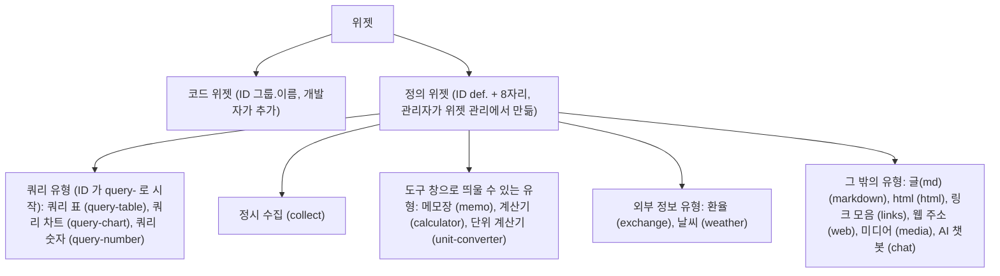
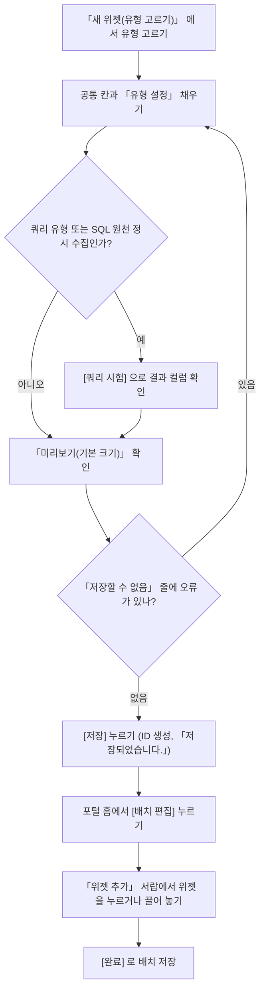
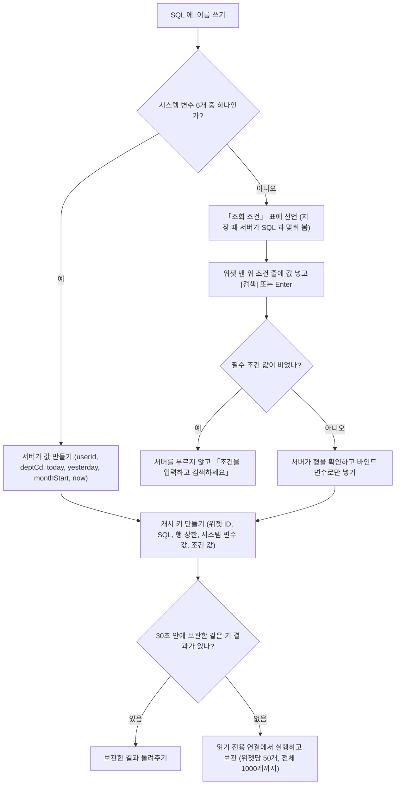
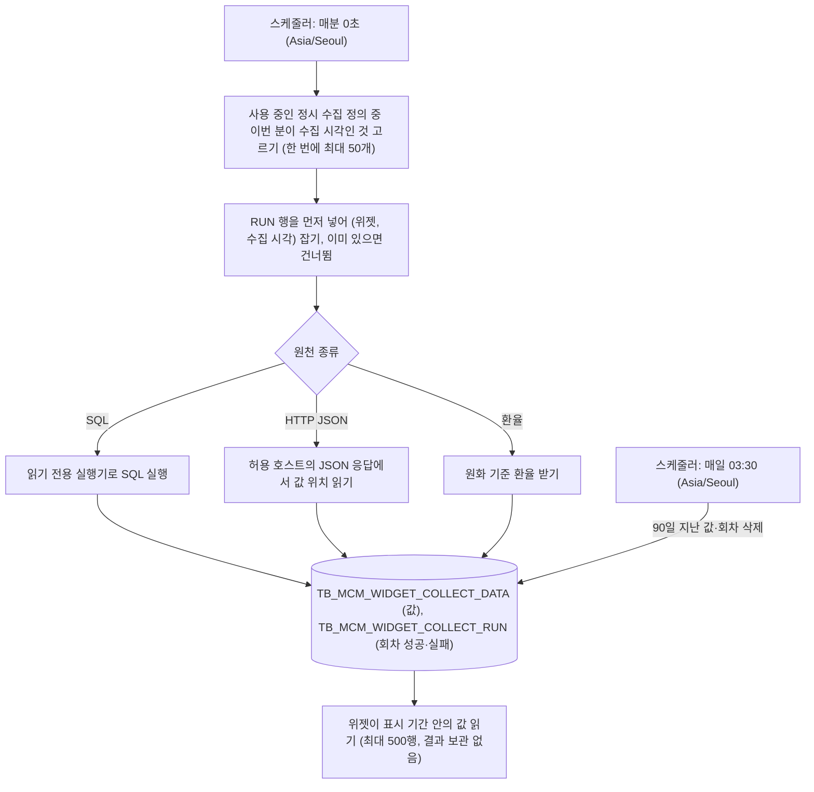
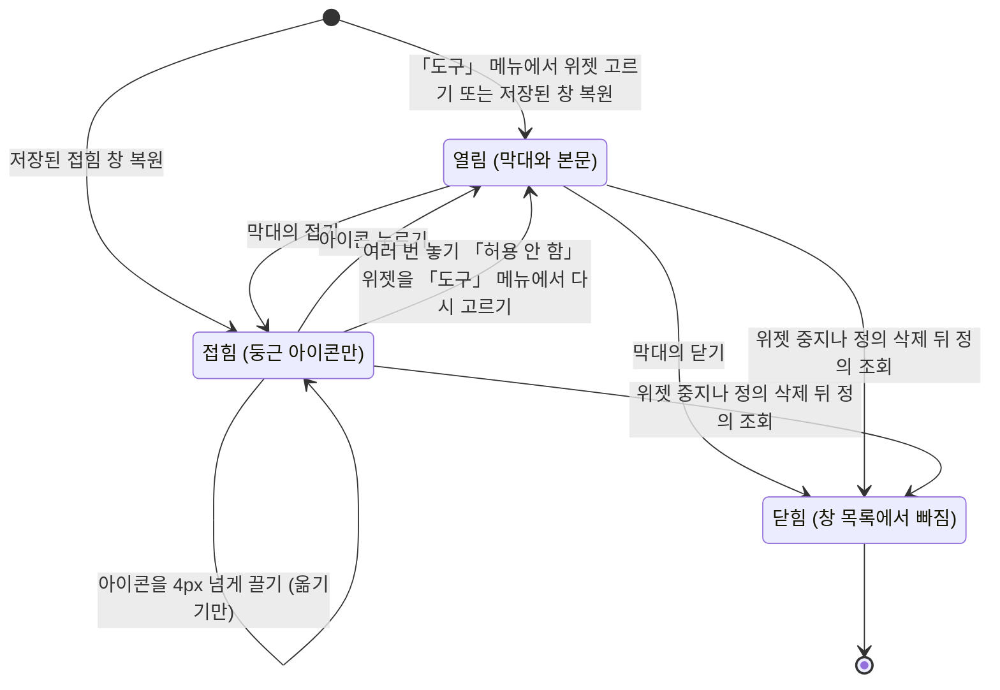
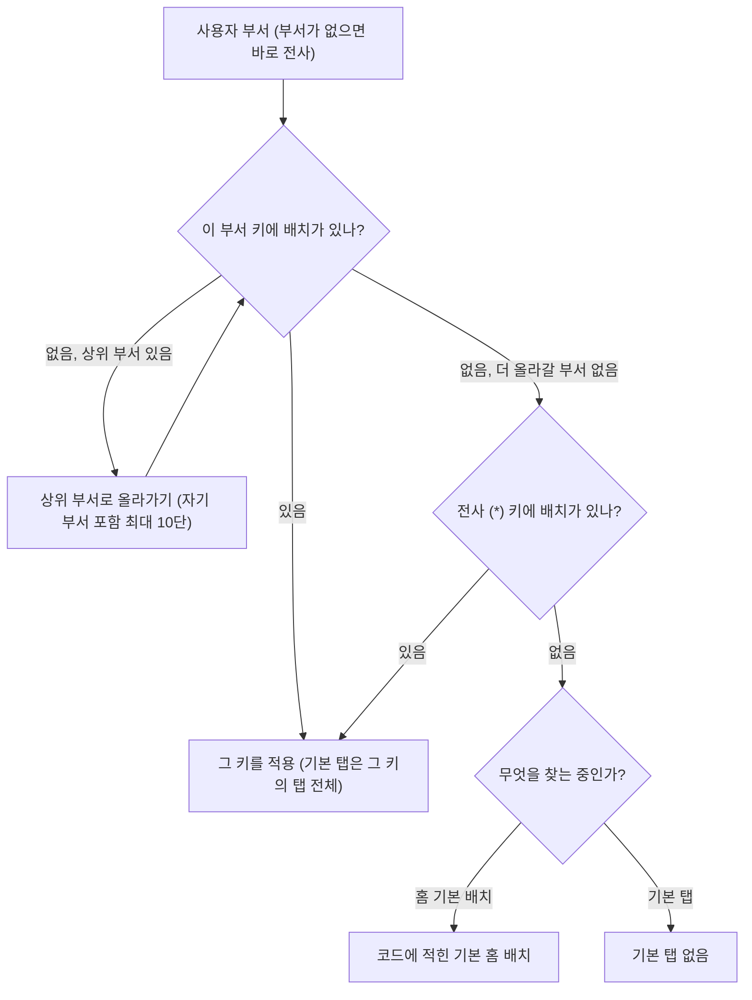
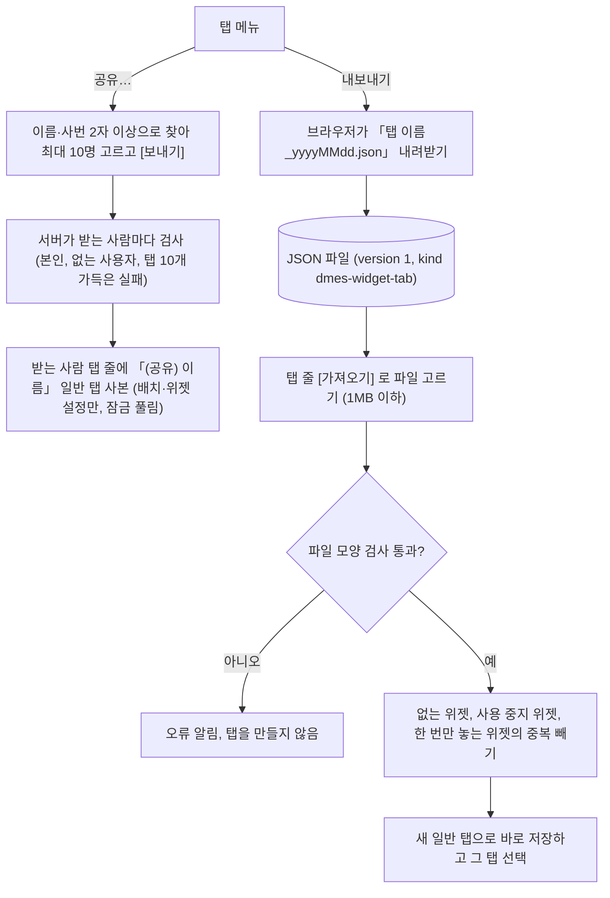

# 위젯 만드는 여러 가지 방법

> 이 문서는 위젯 관리 화면(공통관리 > 시스템관리 > 위젯 관리)을 쓰는 관리자를 위한 안내서입니다.
> 코드를 쓰지 않고 화면에서 위젯을 만드는 방법, 업무 화면 위에 띄우는 도구 창, 회사·부서 기본 탭, 탭 공유와 가져오기를 다룹니다.
> 값, 칸 이름, 메시지 문구는 구현 코드에서 확인한 것만 적었습니다. 

## 1. 위젯 종류 개요

### 1.1 코드 위젯과 정의 위젯

위젯은 두 갈래로 나뉩니다.

- **코드 위젯**은 개발자가 프로그램으로 만든 위젯입니다. ID 는 `home.notice` 처럼 `그룹.이름` 모양입니다. 공지사항, 알림, 작업 지시처럼 업무 로직이 들어간 위젯이 여기에 속합니다. 새 코드 위젯은 개발자가 `widgets/{그룹}/{이름}/` 폴더에 `widget.tsx` 와 `widget.meta.ts` 를 만들어 추가합니다. 관리자는 새로 만들 수 없습니다.
- **정의 위젯**은 관리자가 위젯 관리 화면에서 만듭니다. ID 는 `def.k3x9q2ab` 처럼 `def.` 뒤에 소문자로 시작하는 8자리가 붙고, 저장할 때 서버가 자동으로 만듭니다. 정의 위젯은 개발자가 미리 만들어 둔 **위젯 유형** 하나를 골라 그 유형의 설정 칸만 채우면 됩니다.

관리자가 두 갈래에서 바꿀 수 있는 범위는 다릅니다.

- 코드 위젯: 이름, 부제, 설명, 크기, 새로 고침, 화면 열기, 여러 번 놓기, 분류, 비공개, 사용 여부를 덮어쓸 수 있습니다. 비워 둔 칸은 코드에 적힌 값이 그대로 쓰입니다. 덮어쓴 값은 [코드 값으로 되돌리기] 로 지울 수 있습니다.
- 정의 위젯: 위의 모든 칸에 더해 유형별 설정(SQL, 글, 주소 등)을 고칠 수 있습니다.

정의 위젯은 사용자가 놓기만 합니다. 놓인 위젯의 설정을 사용자가 바꾸는 기능은 없습니다. 위치, 크기, 탭은 사용자가 자기 화면에서 정합니다.

### 1.2 정의 위젯 유형 전체 목록

현재 등록된 유형은 15개입니다. 괄호 안은 기본 크기(가로 칸 × 세로 칸)입니다. 가로는 전체 24칸입니다.

- **쿼리 표**(12×12): SQL 결과를 표로 보입니다.
- **쿼리 차트**(12×12): SQL 결과를 막대, 선, 영역, 원 차트로 보입니다.
- **쿼리 숫자**(12×6): SQL 결과의 행마다 숫자 타일 하나를 보입니다. 최대 8개입니다.
- **정시 수집**(8×8): 정해진 시각에 SQL, HTTP JSON, 환율 값을 모아 두고 최신 값과 추이를 보입니다.
- **글(md)**(8×10): 마크다운으로 쓴 안내 글입니다.
- **html**(8×10): html 로 꾸민 안내와 배너입니다.
- **링크 모음**(6×10): 포털 화면과 웹 주소 바로가기 목록입니다.
- **웹 주소**(12×16): 바깥 웹 페이지를 칸 안에 띄웁니다.
- **미디어**(8×10): 이미지, 동영상, YouTube 를 올리거나 주소로 넣고, 여러 개면 자동으로 넘겨 보입니다.
- **환율**(8×10): 원화 기준 주요 통화의 최신 환율, 전일 대비, 추이입니다.
- **날씨**(8×8): 지점별 현재 기온, 날씨, 바람, 습도와 3일 예보입니다.
- **AI 챗봇**(8×18): AI 와 대화하고 포털 화면 안내와 데이터 질의를 받습니다.
- **메모장**(8×10): 공용 안내 메모 또는 사용자별 개인 메모입니다. 도구 창으로 띄울 수 있습니다.
- **계산기**(6×12): 사칙연산, 백분율, 계산 기록입니다. 도구 창으로 띄울 수 있습니다.
- **단위 계산기**(8×12): 길이, 무게, 면적, 부피, 온도, 압력, 힘, 속도, 에너지 환산입니다. 도구 창으로 띄울 수 있습니다.

아래 도식은 두 갈래의 위젯과 정의 위젯 유형 15개를 묶음별로 보인 것입니다(괄호 안은 유형 ID).



새 유형이 필요하면 개발자가 `widget-types/{유형 ID}/` 폴더를 추가해야 합니다. 관리자가 화면에서 유형을 늘릴 수는 없습니다.

## 2. 위젯 만드는 기본 순서

### 2.1 새로 만들기

1. 포털 메뉴에서 공통관리 > 시스템관리 > 위젯 관리 를 엽니다. 이 화면은 메뉴 권한이 있어야 열립니다.
2. 「위젯 목록」 탭을 선택합니다. 이 탭이 처음 열리는 탭입니다. 왼쪽 목록에는 코드 위젯과 정의 위젯이 모두 나옵니다.
3. 목록 위 머리줄의 선택 칸 「새 위젯(유형 고르기)」 에서 유형을 고릅니다. 선택지에는 유형 이름과 설명이 함께 보입니다.
4. 오른쪽 상세 영역이 비어 있는 새 위젯 상태로 바뀝니다. 이름과 기본 크기에는 유형의 기본값이 채워져 있고, 여러 번 놓기는 「허용」, 사용은 「사용」 입니다.
5. 공통 칸과 맨 아래 「유형 설정」 을 채웁니다.
6. 상세 맨 아래 「미리보기(기본 크기)」 에서 결과를 확인합니다. 값을 바꾸면 약 0.3초 뒤에 미리보기가 다시 그려집니다. 저장하기 전 값으로 그려집니다.
7. 오른쪽 아래 [저장] 을 누릅니다. 「저장되었습니다.」 알림이 뜨면 끝입니다. ID 는 이때 만들어집니다.

아래 도식은 정의 위젯을 만들어 홈에 놓기까지의 흐름입니다. [쿼리 시험] 은 쿼리 유형과 SQL 원천을 고른 정시 수집에만 있습니다.



[저장] 은 바뀐 값이 있고 입력 오류가 하나도 없을 때만 눌립니다. 오류가 있으면 상세 맨 아래 「저장할 수 없음」 줄에 이유가 보입니다. 새 정의 위젯은 바뀐 값이 없어도 저장할 수 있습니다(변경 여부 검사만 면제됩니다). 다만 쿼리 표·쿼리 차트·쿼리 숫자, 정시 수집, 웹 주소, html, 글(md), 링크 모음 유형은 초기 설정이 비어 있어 필수 칸(SQL, 주소, 내용, 링크 등)을 채워야 오류가 사라지고 저장됩니다.

바뀐 값이 있는 상태에서 다른 행을 고르거나 「기본 배치」 탭으로 옮기면 「저장하지 않은 변경을 버릴까요?」 라고 묻습니다.

목록 위 검색 영역에서 이름이나 ID 로 찾고, 구분(코드·정의)과 사용(사용·중지)으로 거를 수 있습니다. 상단 [조회] 는 목록을 서버에서 다시 받습니다.

### 2.2 공통 칸 설명

모든 위젯에 공통으로 있는 칸입니다.

- **ID**: 읽기 전용입니다. 새 정의 위젯은 저장하기 전에 「(저장할 때 만들어집니다)」 라고 보입니다.
- **구분**: 「코드 위젯」 또는 「정의 위젯 · 유형 이름(유형 ID)」 이 보입니다.
- **이름**: 위젯 틀 머리에 보이는 제목입니다. 정의 위젯은 필수이고 50자 이하입니다. 코드 위젯은 비우면 코드 값을 씁니다.
- **부제**: 이름 아래 작은 글씨입니다. 100자 이하입니다.
- **설명**: 여러 줄을 쓸 수 있는 칸으로 400자 이하입니다. 위젯 추가 서랍에서 위젯 이름 아래에 보이며, 길면 3줄까지 보이고 전체는 마우스를 올리면 말풍선으로 나옵니다.
- **기본 크기(가로·세로)**: 위젯을 처음 놓을 때의 크기입니다. 가로는 24 이하입니다.
- **최소 크기(가로·세로)**: 사용자가 줄일 수 있는 한계입니다. 비우면 그 유형(코드 위젯은 코드 위젯의 메타)에 정해 둔 최소 크기가 쓰이고, 정해 둔 값이 없을 때만 가로 4, 세로 6 이 쓰입니다. 예를 들어 계산기는 4×9, 정시 수집은 5×5, 환율은 6×8, 날씨는 6×8, 단위 계산기는 5×10, AI 챗봇은 6×10 입니다. 비워 두면 쓰일 값이 입력 칸에 자리 표시로 보입니다. 최소 가로도 24 이하입니다.
- **최대 크기(가로·세로)**: 사용자가 키울 수 있는 한계입니다. 비우면 제한이 없습니다.
- **새로 고침(초)**: 자동으로 다시 불러오는 주기입니다. 600(10분) 이상 86400 이하의 정수이거나 빈 칸이어야 합니다. 빈 칸이면 자동 새로 고침이 없습니다. 예전에 600 미만으로 저장된 값은 화면에서 저장하려면 600 이상으로 고쳐야 하고, 고치기 전에도 위젯은 600초마다 새로 고칩니다. 사용자는 틀 머리의 [새로 고침] 단추로 직접 새로 고칠 수도 있습니다.
- **화면 열기 pageId**: 입력하면 위젯 틀 머리에 [화면 열기] 단추가 생기고, 누르면 그 포털 화면이 탭으로 열립니다. 예는 `mls:lsh/noticeMgmt` 입니다. 200자 이하입니다.
- **여러 번 놓기**: 「허용」 이면 같은 위젯을 한 탭에 여러 번 놓을 수 있고, 「허용 안 함」 이면 한 번만 놓을 수 있습니다. 코드 위젯은 비우면 코드 값을 씁니다.
- **분류**: 공통코드 그룹 WIDGET_CTG 에서 고릅니다. 기본 시드는 공통, 생산, 품질, 물류, 도구, 외부 정보입니다. 20자 이하의 코드 값이 저장됩니다. 위젯 추가 서랍에서는 같은 분류끼리 묶여 보이고, 위쪽의 분류 칩(「전체」와 실제로 위젯이 있는 분류)으로 거를 수 있습니다. 분류가 없거나 코드에 없는 분류의 위젯은 맨 끝 「기타」 묶음에 모입니다. 위젯 관리의 입력 칸과 목록 칸에도 분류 이름이 보입니다.
- **사용**: 「사용」 또는 「중지」 입니다. 중지하면 서랍에 보이지 않고, 이미 놓인 자리는 「사용 중지된 위젯입니다」 빈 칸으로 남습니다. 사용자는 그 칸을 ✕ 로 뺄 수 있고, 다시 「사용」 으로 바꾸면 내용이 돌아옵니다.
- **비공개**: 「서랍에 숨기기(ID를 정확히 검색해야 보임)」 를 체크합니다. 비공개 위젯은 위젯 추가 서랍의 목록에 나오지 않고, 서랍 검색 칸에 위젯 ID 를 글자 그대로 전부 입력했을 때만 보입니다. 이름 일부만 입력해서는 보이지 않습니다. 이 칸은 보이는 범위만 줄일 뿐 접근을 막는 권한이 아닙니다. 위젯 ID 를 아는 사람에게 알려 주는 방식으로 씁니다.
- **실행 모듈**: 쿼리 유형에만 나타납니다. 지금은 `mcm (공통관리)` 하나만 고를 수 있습니다.

### 2.3 코드 위젯 값 덮어쓰기와 되돌리기

코드 위젯을 고르면 모든 칸이 비어 있고, 칸의 안내 글자에 코드 값이 보입니다. 바꾸고 싶은 칸만 채우고 [저장] 을 누릅니다. 목록의 「덮어씀」 표시가 붙은 행이 덮어쓴 위젯입니다.

덮어쓴 칸을 모두 비우면 저장할 수 없고 「덮어쓴 값을 모두 비웠습니다. [코드 값으로 되돌리기]를 쓰세요.」 라고 안내합니다. 오른쪽 아래 [코드 값으로 되돌리기] 를 누르고 확인하면 덮어쓰기 행이 지워져 코드 값으로 돌아갑니다.

### 2.4 삭제와 사용자 수

오른쪽 아래 [삭제] 는 정의 위젯에만 있습니다. 사용자의 탭에 놓여 있는 정의 위젯은 지울 수 없습니다. 그때는 「사용 중인 위젯은 지울 수 없습니다. 사용 중지하세요」 가 나오므로 [삭제] 대신 「사용」 을 「중지」 로 바꿉니다. 목록의 사용자 수 칸으로 몇 명이 쓰는지 볼 수 있습니다.

### 2.5 복사해서 만들기

비슷한 위젯을 하나 더 만들 때는 처음부터 채우지 말고 기존 정의 위젯을 복사합니다.

1. 왼쪽 목록에서 복사할 정의 위젯을 고릅니다.
2. 오른쪽 아래 [복사] 를 누릅니다.
3. 오른쪽 상세가 「새 위젯」 작성 상태로 바뀝니다. **ID** 는 비어 「(저장할 때 만들어집니다)」 로 보이고, **이름** \* 은 「원래 이름 (사본)」 이 됩니다. 이름이 50자를 넘으면 원래 이름이 잘려 「 (사본)」 이 남습니다.
4. 필요한 칸만 고칩니다. 같은 유형 편집기에 원본의 유형 설정이 전부 들어 있으므로(쿼리 위젯이면 SQL·입력 조건·컬럼, 정시 수집이면 수집 설정) 달라지는 부분만 바꾸면 됩니다.
5. [저장] 을 누르면 새 ID 가 발급되고 새 위젯이 만들어집니다. [저장] 전에는 서버에 아무것도 만들어지지 않으며, 다른 행을 고르면 사본은 사라집니다.

복사되는 값은 이름(「 (사본)」 이 붙음)·부제·설명·기본/최소/최대 크기·새로 고침·화면 열기 pageId·여러 번 놓기·분류·비공개·실행 모듈과 유형 설정 전체입니다. 사용은 원본이 「중지」 여도 사본은 늘 「사용」 으로 시작합니다. 중지한 위젯을 복사했더니 사본도 말없이 서랍에서 사라지는 혼선을 막기 위해서입니다. 저장하지 않은 변경이 있는 채로 [복사] 를 누르면 「저장하지 않은 변경을 버리고 복사할까요?」 라고 묻고, 확인하면 그 변경은 사본에 들어가지 않고 마지막으로 저장한 값이 복사됩니다.

복사할 수 없는 경우는 [복사] 가 눌리지 않고, 마우스를 올리면 이유가 보입니다.

- **코드 위젯**: 관리자가 새로 만들 수 없으므로 복사할 수 없습니다. 비슷한 위젯이 필요하면 유형을 골라 새로 만듭니다.
- **저장하지 않은 새 위젯**: 먼저 저장한 뒤 복사합니다.
- **알 수 없는 유형**: 유형 편집기가 없어 사본을 고칠 수 없습니다.

사용자 데이터가 위젯 정의와 따로 쌓이는 유형은 정의 설정만 복사됩니다. 복사한 뒤 아래쪽에 안내 문구가 보입니다.

- **개인 메모**: 사용자가 쓴 메모 내용은 가져가지 않습니다.
- **정시 수집**: 이미 모은 값은 가져가지 않고, 사본을 저장한 때부터 새로 쌓입니다.

미디어 유형을 복사하면 올려 둔 파일 자체는 복사되지 않고 사본이 같은 파일을 가리킵니다. 서버는 위젯을 지워도 올린 파일을 지우지 않으므로 원본을 삭제해도 사본의 이미지·동영상은 그대로 보입니다. 사본의 파일을 따로 두고 싶으면 사본 편집기에서 파일을 새로 올립니다.

## 3. 쿼리 표, 쿼리 차트, 쿼리 숫자

세 유형은 SQL 을 쓰는 방식이 같습니다. 먼저 공통 규칙을 설명하고, 뒤에서 유형별 칸을 설명합니다.

### 3.1 언제 쓰나

- 공통관리 DB 에 이미 있는 데이터를 표나 차트나 숫자 타일로 홈 화면에 보여 주고 싶을 때 씁니다.
- 읽기만 하는 조회입니다. 데이터를 바꾸는 위젯은 만들 수 없습니다.
- 사용자가 조회 조건(기간, 이름 등)을 직접 넣게 하려면 3.5 의 입력 조건을 씁니다.

### 3.2 만드는 순서

1. 「새 위젯(유형 고르기)」 에서 쿼리 표, 쿼리 차트, 쿼리 숫자 중 하나를 고릅니다.
2. 이름과 공통 칸을 채웁니다. 실행 모듈은 `mcm (공통관리)` 입니다.
3. 유형 설정의 SQL 칸에 조회문을 씁니다.
4. [쿼리 시험] 을 눌러 결과 컬럼을 확인합니다. 시험이 끝나면 아래 필드 칸이 결과 컬럼 목록에서 고르는 방식으로 바뀝니다.
5. 사용자 입력이 필요하면 「조회 조건」 에 조건을 선언합니다.
6. 유형별 칸(표시 컬럼, 차트 종류, 라벨 필드 등)을 채웁니다.
7. 미리보기를 확인하고 [저장] 을 누릅니다.

### 3.3 SQL 규칙

SQL 은 읽기 전용 실행기가 실행합니다. 저장할 때, 시험할 때, 실제 실행할 때마다 같은 검사를 서버가 다시 합니다.

- 첫 낱말은 `SELECT` 또는 `WITH` 여야 합니다. 아니면 「SELECT 또는 WITH 로 시작하는 조회문만 쓸 수 있습니다」 가 나옵니다.
- 문장은 하나만 쓸 수 있습니다. 끝의 `;` 하나는 지워 주지만, 중간에 `;` 가 있으면 「문장은 하나만 쓸 수 있습니다」 가 나옵니다.
- 주석과 문자열 리터럴을 걷어 낸 뒤 쓰기와 관리에 쓰는 낱말을 찾습니다. 대표적으로 INSERT, UPDATE, DELETE, MERGE, DROP, ALTER, CREATE, TRUNCATE, GRANT, REVOKE, EXEC, EXECUTE, CALL, COMMIT, ROLLBACK, INTO, PRAGMA, ATTACH, DETACH 가 있으면 거절합니다. `SELECT ... INTO` 도 INTO 때문에 거절됩니다. SQL Server 계열 문장(USE, DECLARE, WHILE, BEGIN, DENY, WAITFOR 등)도 거절합니다. 메시지는 「쓸 수 없는 낱말이 있습니다: 해당 낱말」 로 시작합니다. 열이나 표 이름이 우연히 이 낱말과 같으면 큰따옴표로 감싸면 통과합니다.
- 세션을 끊거나, 파일을 읽거나, 잠금을 잡거나, 문자열로 받은 SQL 을 대신 실행하는 DB 함수를 부르면 「쓸 수 없는 함수가 있습니다: 함수 이름」 으로 거절합니다. 함수 이름 뒤에 공백이나 주석을 건너뛰고 `(` 나 `.`, 또는 DB 링크 이름이 뒤따르는 `@` 가 오면 부르는 것으로 봅니다. 그래서 같은 이름의 열이나 표 이름도 뒤에 이런 글자가 없으면 통과하지만, 표 이름으로 열을 한정해 `XP_HIST.CNT` 처럼 쓰면 패키지 호출과 구별할 수 없어 거절됩니다(별칭을 씁니다). `SP_EXECUTESQL` 같은 SQL Server 의 위험한 저장 프로시저는 괄호 없이 부르므로 이름만 나와도 거절합니다.
- 닫히지 않은 따옴표, 괄호, 주석이 있으면 「닫히지 않은 따옴표·괄호·주석이 있습니다」 가 나옵니다.
- DB 마다 읽는 방식이 달라 위험한 특수 표기(`E'...'`, `q'...'`, `$$...$$`, 백틱, `U&"..."`)는 쓸 수 없습니다. DB 고유 자리표시자(`\:이름`, `@이름`, `$이름`, `$숫자`)도 쓸 수 없고, 조건은 항상 `:이름` 으로만 씁니다.
- 실행 한도는 이렇습니다. 위젯이 실행될 때 최대 500행을 돌려주고 넘으면 「상위 500행만 표시합니다」 가 보입니다. [쿼리 시험] 은 최대 50행입니다. 실행 시간 제한은 10초입니다. 결과 컬럼 값은 JSON 으로 바뀌며 긴 글(CLOB)은 4000자까지 옵니다.
- 실행 연결은 읽기 전용으로 열고 항상 롤백합니다. 운영에서는 읽기 권한만 가진 DB 계정의 전용 연결(`dmes.widget.query.datasource.*`)을 서버에 설정하는 것이 원칙입니다. SQL Server 처럼 읽기 전용 트랜잭션이 없는 DB 에서는 전용 연결이 없으면 시험, 저장, 실행이 모두 거절됩니다.
- 같은 위젯, 같은 시스템 변수 값, 같은 입력 조건 값의 결과는 30초 동안 서버가 보관해 다시 씁니다. 정의를 저장하면 그 위젯의 보관분은 지워집니다. 그래서 사용자가 [새로 고침] 을 자주 눌러도 DB 부하가 크게 늘지 않지만, 방금 바뀐 데이터가 30초쯤 늦게 보일 수 있습니다.

**방언 주의:** 로컬 개발 DB 는 SQLite, 운영 DB 는 Oracle 또는 PostgreSQL 입니다. 이 문서의 예시 SQL 은 로컬 SQLite 에서 확인한 문법(`SUBSTR`, `INSTR`, `LIMIT`, `||`)이라 운영 DB 에서는 함수와 행 수 제한 문법을 그 DB 에 맞게 고쳐 써야 합니다.

### 3.4 시스템 변수

SQL 안에 `:이름` 으로 쓰면 서버가 값을 넣어 줍니다. 쓸 수 있는 시스템 변수는 아래 6개가 전부입니다. SQL 이 실제로 쓰는 변수만 값을 만듭니다.

- `:userId`: 로그인한 사용자 ID 입니다. 요청으로 바꿀 수 없고 항상 인증된 사용자 값입니다.
- `:deptCd`: 로그인한 사용자의 부서 코드입니다. 부서가 없으면 NULL 입니다.
- `:today`: 오늘 날짜를 `yyyyMMdd` 글자로 넣습니다. 서울 시간(Asia/Seoul) 기준입니다.
- `:yesterday`: 어제 날짜를 `yyyyMMdd` 글자로 넣습니다.
- `:monthStart`: 이달 1일을 `yyyyMMdd` 글자로 넣습니다.
- `:now`: 현재 시각(타임스탬프)입니다.

위 6개 말고 모르는 `:이름` 을 쓰면 「알 수 없는 변수입니다: :이름」 이 나오고 뒤에 쓸 수 있는 변수 목록이 붙습니다. 시스템 변수는 날짜가 `yyyyMMdd` 글자이므로 `yyyy-MM-dd` 형태로 저장된 날짜 열과 바로 비교하면 어긋납니다. 예시의 `REPLACE(SUBSTR(STARTED_AT, 1, 10), '-', '')` 처럼 열 쪽을 맞춰 줍니다.

### 3.5 입력 조건(조회 조건)

시스템 변수가 아닌 `:이름` 은 모두 **입력 조건**으로 선언해야 합니다. 선언하면 위젯 본문 맨 위에 조건 줄이 생기고, 사용자가 값을 넣은 뒤 [검색] 을 누르면(또는 입력 칸에서 Enter) 그 값으로 다시 조회합니다.

**선언하는 곳:** 쿼리 유형 편집기의 SQL 칸 아래 「조회 조건」 표입니다. [조건 추가] 로 줄을 더하고, SQL 에 `:이름` 만 써 놓고 선언하지 않았다면 [SQL 에서 가져오기] 로 선언되지 않은 이름을 글자 형으로 한꺼번에 추가할 수 있습니다. 표 아래에 「SQL 에 쓰였지만 선언하지 않은 조건」, 「선언했지만 SQL 에 쓰이지 않은 조건」 이 알림으로 보입니다.

표의 칸은 다음과 같습니다.

- **이름** \*: SQL 의 `:이름` 과 같은 이름입니다. 영문자로 시작하고 영문, 숫자, 밑줄만 쓸 수 있으며 30자 이하입니다. 대소문자를 구분합니다. 같은 이름을 두 번 선언할 수 없고, 위 시스템 변수 이름(userId, deptCd, today, yesterday, monthStart, now)은 쓸 수 없습니다.
- **라벨**: 조건 줄에 보이는 이름입니다. 비우면 이름을 그대로 보입니다. 50자 이하입니다.
- **형**: 글자, 숫자, 날짜, 선택 중 하나입니다.
- **기본값**: 처음 채워지는 값이자 [쿼리 시험] 에 쓰는 값입니다. 200자 이하입니다.
- **필수**: 「예」 면 라벨 옆에 `*` 가 붙고, 값이 비어 있으면 서버를 부르지 않고 「조건을 입력하고 검색하세요」 를 보입니다.
- **선택지(값:라벨,...)**: 선택 형에서만 씁니다. `MINE:내 기록,ALL:전체 사용자` 처럼 적습니다. 라벨은 생략할 수 있습니다. 값에는 쉼표와 콜론을 쓸 수 없고, 값 앞뒤 공백도 쓸 수 없습니다. 선택지는 최대 50개이고 라벨은 50자 이하입니다.

형별로 SQL 에 들어가는 값은 이렇습니다.

- **글자**: 입력한 글자 그대로 들어갑니다.
- **숫자**: 숫자(NUMERIC)로 들어갑니다. 유효 자릿수와 소수 자릿수는 각각 38 이하입니다.
- **날짜**: 화면에서는 `yyyy-MM-dd` 로 입력하고 SQL 에는 `yyyyMMdd` 글자로 들어갑니다. 시스템 변수 `:today` 와 같은 형입니다. 실제로 있는 날짜여야 합니다. 날짜 열과 비교할 때는 `TO_DATE(:이름,'YYYYMMDD')` 처럼 바꿔 씁니다.
- **선택**: 선언한 선택지 값 중 하나만 들어갑니다.

값 처리 규칙은 이렇습니다.

- 사용자 값은 **바인드 변수로만** SQL 에 들어갑니다. 서버는 SQL 글자를 이어 붙이지 않으므로 값 때문에 SQL 이 바뀌지 않습니다. 단, `LIKE` 의 `%` 와 `_` 같은 문자는 그 DB 규칙대로 패턴으로 읽힙니다. 문제가 되는 SQL 이면 작성자가 `ESCAPE` 로 직접 처리해야 합니다.
- 값은 한 개당 200자까지이고, 조건은 위젯당 최대 10개입니다. 값 전체를 묶은 JSON 은 4000자 이하여야 합니다.
- 값 칸을 비운(공백만 있는) 경우 기본값이 아니라 값이 없는 것으로 봅니다. 필수 조건이면 거절되고, 필수가 아니면 형이 붙은 NULL 이 바인드됩니다. 그래서 `(:screenNm IS NULL OR ...)` 패턴으로 비운 조건을 전체 조회로 처리할 수 있습니다. 기본값은 사용자가 아직 조건을 한 번도 보내지 않았을 때만 쓰입니다.
- 서버 결과 보관(30초)의 키에 조건 값도 들어갑니다. 값 조합이 다르면 따로 보관합니다. SQL 이 `:userId` 나 `:deptCd` 같은 시스템 변수를 쓰면 그 변수 값도 키에 들어가므로 사용자마다 따로 보관되고, 이것도 같은 한도를 채웁니다. 한 위젯이 보관할 수 있는 항목(입력 조건 값 조합과 사용자별 항목을 합한 수)은 50개까지이고, 가득 차면 새 결과는 보관하지 않고 그때마다 DB 에서 읽습니다.
- 저장할 때 서버가 SQL 의 `:이름` 과 선언을 맞춰 봅니다. SQL 에 쓰였지만 선언이 없는 이름, 선언했지만 SQL 에 쓰이지 않은 이름이 있으면 저장되지 않습니다.

아래 도식은 SQL 의 `:이름` 이 값으로 바뀌어 실행되고 결과가 보관되기까지의 흐름입니다. 캐시 키의 `:now` 는 30초 구간의 시작 시각으로 맞춰 넣습니다. [쿼리 시험] 결과는 보관하지 않습니다.



### 3.6 쿼리 시험 버튼

SQL 칸 아래 [쿼리 시험] 은 저장하기 전에 SQL 을 서버에서 실제로 실행해 봅니다.

- 로그인한 관리자 본인의 시스템 변수 값으로 실행합니다.
- 입력 조건이 있으면 각 조건의 **기본값**으로 실행합니다. 값이 없는 필수 조건은 NULL 로 두어 컬럼 확인만 되게 합니다.
- 최대 50행까지 받습니다. 성공하면 버튼 옆에 결과 요약이 보이고, 상세 아래 미리보기가 이 결과로 그려집니다. 실제 위젯 서버 호출은 하지 않습니다.
- 실패하면 서버가 돌려준 메시지를 그대로 보입니다. DB 오류는 「쿼리 오류: 」 뒤에 DB 메시지가 붙습니다. 사용자에게 보이는 실제 위젯은 DB 메시지를 숨기고 「위젯 데이터를 불러오지 못했습니다」 만 보입니다.
- SQL 칸이 비어 있으면 「SQL 을 입력하세요」 가 보입니다.
- [쿼리 시험] 결과는 저장되지 않습니다. 시험만 누르고 다른 값을 바꾸지 않았다면 저장할 변경이 없어 [저장] 이 눌리지 않습니다.

### 3.7 쿼리 표

**언제 쓰나:** 목록 형태의 데이터(최근 작업, 사용 기록 등)를 그대로 보여 줄 때 씁니다.

**만드는 순서:** 3.2 의 순서를 따르고, 마지막에 「표시 컬럼」 을 정합니다. [결과 컬럼 모두 넣기] 로 시험한 결과 컬럼을 한 번에 넣을 수 있습니다.

**칸 설명:**

- **SQL** \*: 필수입니다.
- **조회 조건**: 3.5 참고입니다.
- **표시 컬럼**: 필드(필수), 머리글, 폭, 정렬(자동·왼쪽·가운데·오른쪽), 형식(그대로·글자·숫자·날짜)입니다. 컬럼을 하나도 넣지 않으면 결과 컬럼을 모두 보입니다. 폭은 칸 너비의 비율입니다. 숫자 형식은 천 단위로 구분하고, 날짜 형식은 `yyyy-MM-dd` 로 보입니다.

**예시:** 9.2 를 봅니다.

**자주 틀리는 점:**

- 표시 컬럼에 필드 이름을 쓸 때 대소문자가 SQL 의 별칭(AS) 과 달라 빈 열이 나옵니다. 시험 뒤 선택 목록에서 고르면 안전합니다.
- 필드가 빈 컬럼 줄을 남겨 두면 「필드가 빈 컬럼이 있습니다」 가 나와 저장되지 않습니다.
- 결과가 500행을 넘는 SQL 은 잘려 보이므로 SQL 안에서 `LIMIT` 등으로 줄여 둡니다.

### 3.8 쿼리 차트

**언제 쓰나:** 기간별 추이, 항목별 비교, 비율을 차트로 보여 줄 때 씁니다.

**만드는 순서:** 3.2 의 순서를 따르고, [쿼리 시험] 뒤에 차트 종류, 가로축 필드, 값 계열을 고릅니다.

**칸 설명:**

- **차트 종류**: 막대, 선, 영역, 원(첫 계열만) 입니다. 필수입니다.
- **가로축 필드**: 가로축에 올릴 컬럼입니다. 필수입니다.
- **값 계열**: 값으로 그릴 컬럼 목록입니다. 필드(필수)와 이름(범례)을 적습니다. 값은 숫자로 그립니다. 숫자가 아니면 0 으로 봅니다. 막대는 계열을 위로 쌓고, 선과 영역은 계열마다 한 장씩 그립니다. 원은 첫 계열만 그립니다.
- **단위(원 차트)**: 원 차트 범례에 붙는 단위입니다. 비우면 첫 계열 이름 끝의 괄호 글자를 단위로 씁니다. 예를 들어 「사용 시간(분)」 이면 「분」 입니다. 괄호도 없으면 단위를 붙이지 않습니다. 10자 이하입니다.

**예시:** 값 계열 이름을 「사용 시간(분)」 으로 두고 원 차트로 그리면 범례가 분 단위로 나옵니다.

**자주 틀리는 점:**

- 가로축 필드를 고르지 않으면 「가로축 필드를 고르세요」, 값 계열이 없으면 「값 계열을 하나 이상 넣으세요」 가 나옵니다.
- 값 계열의 컬럼이 문자 컬럼이면 모두 0 으로 그려집니다. SQL 에서 숫자로 바꾸어 줍니다.
- 조회 조건이 있는 차트는 조건 줄이 차지한 높이만큼 그림이 낮아집니다. 세로 크기를 조금 키워 둡니다.

### 3.9 쿼리 숫자

**언제 쓰나:** 오늘의 건수, 사용 시간처럼 핵심 지표를 숫자 타일 몇 개로 보여 줄 때 씁니다.

**만드는 순서:** 3.2 의 순서를 따릅니다. SQL 결과의 **행 하나가 타일 하나**가 되므로 지표마다 한 행으로 만들어 줍니다. 여러 지표를 한 번에 보이려면 `UNION ALL` 을 씁니다.

**칸 설명:**

- **라벨 필드**: 타일 이름이 될 컬럼입니다. 필수입니다.
- **값 필드**: 타일 숫자가 될 컬럼입니다. 필수입니다.
- **단위 필드**: 행마다 단위가 다를 때 단위가 들어 있는 컬럼입니다. 선택입니다.
- **단위**: 단위 필드 값이 비었을 때 쓰는 단위입니다. 예는 t, 건, % 입니다.
- **값 형식**: 숫자(천 단위 구분) 또는 백분율(소수 1자리 %) 입니다.

**예시:** 라벨 컬럼 `LABEL`, 값 컬럼 `VAL`, 단위 컬럼 `UNIT` 을 돌려주는 SQL 로 「사용 시간 / 사용자 / 연 화면 / 열람 횟수」 4개 타일을 만들 수 있습니다.

**자주 틀리는 점:**

- 타일은 최대 8개입니다. 행이 8개를 넘으면 나머지는 보이지 않습니다.
- 라벨 필드나 값 필드를 고르지 않으면 「라벨 필드를 고르세요」, 「값 필드를 고르세요」 가 나옵니다.

## 4. 정시 수집(collect)

### 4.1 언제 쓰나

DB 나 외부 사이트의 값을 **정해진 시각마다 모아 두었다가** 최신 값과 추이를 보고 싶을 때 씁니다. 쿼리 위젯은 열 때마다 지금 값을 조회하지만, 정시 수집은 서버가 일정에 맞춰 값을 쌓아 두므로 지난 값의 변화를 볼 수 있습니다. 예를 들어 설비 상태를 10분마다 모으거나, 환율을 하루 한 번 모으는 경우에 씁니다.

### 4.2 만드는 순서

1. 「새 위젯(유형 고르기)」 에서 「정시 수집」 을 고릅니다.
2. 공통 칸을 채웁니다.
3. 유형 설정의 「일정」 에서 수집 방식(「주기마다」 또는 「매일 정해진 시각」)을 고르고 주기나 시각을 정합니다.
4. 「원천」 에서 종류(SQL, HTTP JSON, 환율)를 고르고 종류별 칸을 채웁니다.
5. 「표시」 에서 기간(일)과 단위를 정합니다.
6. [저장] 을 누릅니다. 저장한 뒤 다음 수집 시각이 되면 값이 쌓이기 시작합니다. 저장 직후 바로 수집하지 않습니다.

### 4.3 칸 설명

**일정**

- **주기마다**: 자정부터 정해진 간격으로 모읍니다. 10분이면 0:00, 0:10, 0:20 순서입니다. 간격은 5, 10, 15, 20, 30, 60, 120, 180, 240, 360, 480, 720, 1440 분 중에서 고릅니다.
- **매일 정해진 시각**: 「수집 시각」 표에 `HH:mm`(24시간제)을 최대 24개까지 넣습니다. 같은 시각을 두 번 넣을 수 없습니다. [시각 추가] 로 만든 새 줄은 빈 칸이라 `HH:mm` 을 직접 적어야 합니다. `09:00` 은 수집 방식을 「매일 정해진 시각」 으로 바꿀 때 시각이 하나도 없으면 한 줄 채워지는 값입니다.
- 시간대는 한국 시간(Asia/Seoul) 입니다. 서버가 꺼져 있던 동안 지나간 시각은 따라잡지 않고 건너뜁니다.

**원천 종류별 칸**

- **SQL**:
  - SQL 칸은 쿼리 위젯과 같은 편집기이고 [쿼리 시험] 도 있습니다. 수집에는 사용자가 없으므로 `:userId`, `:deptCd` 와 사용자 입력 조건은 쓸 수 없습니다. 쓸 수 있는 시스템 변수는 `:today`, `:yesterday`, `:monthStart`, `:now` 입니다.
  - **값 컬럼** \*: 모을 값이 들어 있는 결과 컬럼입니다. 필수입니다.
  - **항목 컬럼**: 고르면 결과 행마다 항목 하나(이름은 그 컬럼 값)를 모읍니다. 한 회차에 최대 50개입니다. 비우면 첫 행의 값 컬럼 하나를 `VALUE` 항목으로 모읍니다.
  - 읽기 전용 실행기를 그대로 쓰므로 3.3 의 SQL 규칙과 행 상한 50행, 10초 제한이 같습니다.
- **HTTP JSON**:
  - **주소** \*: `http://` 또는 `https://` 로 시작하는 절대 주소입니다. 500자 이하이고 `user:password@` 형태의 사용자 정보는 쓸 수 없습니다.
  - **수집 항목**: 1개에서 20개까지 「항목 이름」 과 「값 위치」 를 적습니다. 값 위치는 응답 JSON 안의 위치를 `data.items[0].price` 처럼 점과 대괄호로 적습니다. 이름 조각은 글자, 숫자, `_`, `$`, `-` 만 쓸 수 있고(한글도 됩니다), 대괄호 안은 0 에서 9999 사이 정수입니다. 전체 200자, 20조각 이하입니다. 항목 이름은 100자 이하이며 겹칠 수 없습니다.
  - 값이 숫자나 숫자 글자면 숫자로, 그 밖은 글자(200자까지)로 저장합니다. 위치에 값이 없는 항목은 건너뛰고, 전부 없으면 그 회차가 실패로 기록됩니다.
  - **허용 호스트**: 서버에 등록된 호스트만 호출할 수 있습니다. 설정 방법은 4.5 에서 설명합니다. 허용 목록이 비어 있으면 HTTP 원천은 모두 거절됩니다. 이 원천은 [쿼리 시험] 같은 시험 버튼이 없습니다.
- **환율**: 통화를 체크합니다. 선택지는 USD, EUR, JPY, CNY, GBP, AUD, CAD, CHF, HKD, SGD, THB 이고 최대 10개입니다. 기준 통화 KRW 는 고를 수 없습니다. 원화 기준으로 각 통화의 값을 모읍니다. 수집 시각 기준 7일 안에서 가장 최근 날짜의 값을 쓰므로 주말이나 휴일에는 직전 영업일 값이 들어갑니다. 주기마다 방식에서는 60분 이상만 고를 수 있습니다. 이 원천도 시험 버튼이 없습니다.

**표시**

- **기간(일)**: 위젯이 읽을 기간입니다. 1에서 90 사이 정수이고 비우면 7일입니다. 위젯은 이 기간 안의 값을 최대 500건 읽습니다.
- **단위**: 숫자 값 뒤에 붙는 글자입니다(예: 건, 원, %). 10자 이하입니다.

### 4.4 서버가 하는 일

- 서버 스케줄러가 **매분 0초**(한국 시간)에 사용 중인 정시 수집 정의를 읽습니다. 그 분이 수집 시각인 정의만 수집합니다. 한 번에 최대 50개 정의까지 처리하고, 한 정의가 실패해도 다른 정의는 계속 처리합니다.
- **중복 방지**: 수집을 시작할 때 (위젯, 수집 시각) 단위로 회차 기록을 먼저 만듭니다. 같은 정의의 같은 분은 한 번만 수집되므로 서버가 여러 대여도 값이 두 번 쌓이지 않습니다.
- **보관 기간**: 수집한 값과 회차 기록은 90일 보관합니다. 매일 새벽 3시 30분(한국 시간)에 90일이 지난 것을 지웁니다. 정의를 중지하거나 지워도 이미 쌓인 값은 90일 뒤에 같은 방식으로 지워집니다.
- 정의를 「중지」 로 바꾸면 수집이 멈춥니다.
- 서버 설정 `dmes.widget.collect.enabled` 를 `false` 로 하면 수집과 보관 삭제를 모두 하지 않습니다. 기본은 켜짐입니다.
- HTTP 원천은 연결 3초, 읽기 5초 제한이 있고 응답은 1MB 까지만 받습니다. 리다이렉트는 따라가지 않으며 JSON 이 아닌 응답은 실패로 기록합니다. 링크 로컬, 멀티캐스트, 와일드카드, 클라우드 메타데이터 주소로 풀리는 호스트는 호출하지 않습니다. 시스템 프록시는 쓰지 않습니다.
- 환율 원천은 서버의 외부 정보 설정 `dmes.widget.ext.enabled` 가 꺼져 있으면 수집하지 않고 실패로 기록합니다.

아래 도식은 서버가 값을 모으고, 위젯이 읽고, 보관 기간이 지난 값을 지우는 흐름입니다. 두 스케줄러 모두 `dmes.widget.collect.enabled` 가 켜져 있을 때만 일합니다.



### 4.5 HTTP 원천의 허용 호스트 설정 방법

허용 호스트는 서버 설정(예: `application.yml` 또는 운영 환경 설정)에 아래처럼 적습니다. 기본 설정 파일에는 이 항목이 없으므로, 적지 않으면 HTTP 원천은 하나도 쓸 수 없습니다.

```
dmes:
  widget:
    collect:
      enabled: true
      allowed-hosts:
        - api.example.com
```

- 호스트 이름은 글자가 정확히 같아야 합니다(대소문자는 구분하지 않습니다). `example.com` 을 적어도 `api.example.com` 은 허용되지 않습니다.
- 포트는 달라도 됩니다. 호스트 이름만 비교합니다.
- 설정을 바꾼 뒤에는 서버를 다시 시작해야 합니다.
- 저장할 때도 호스트가 허용 목록에 없으면 「이 호스트는 수집 허용 목록(dmes.widget.collect.allowed-hosts)에 없습니다: 호스트」 가 나와 저장되지 않습니다.
- 허용 호스트는 신뢰할 수 있는 곳만 적습니다. 이름 풀이 뒤에 주소가 바뀌는 공격(DNS 재바인딩)은 막지 못합니다.

### 4.6 수집한 값을 위젯에서 보는 법

정시 수집 위젯을 홈이나 기본 탭에 놓으면 위젯 안에서 바로 봅니다.

- 항목마다 **최신 값 타일**이 보입니다. 타일에는 값, 단위, 직전 회차 대비 증감, 「수집 시각」 이 나옵니다.
- 타일 아래 항목 버튼을 누르면 그 항목의 **추이 선 차트**가 보입니다. 숫자 값이 2회 이상 모이기 전에는 「추이를 그릴 숫자 값이 2회 이상 모이면 선 차트가 보입니다」 가 보입니다.
- 값이 아직 없으면 「아직 수집된 값이 없습니다」 가 보입니다. 가장 최근 회차가 실패했으면 타일 위에 「최근 수집 실패」 한 줄이 보입니다. 서버 오류 문구는 사용자에게 보이지 않습니다.
- 관리 화면의 미리보기에서는 「저장하고 첫 수집이 끝나면 수집된 값이 여기에 보입니다」 가 보입니다.
- 이 위젯은 결과를 캐시하지 않으므로 위젯의 새로 고침이 바로 반영됩니다.
- 수집 값은 공통관리 DB 의 `TB_MCM_WIDGET_COLLECT_DATA`(값)와 `TB_MCM_WIDGET_COLLECT_RUN`(회차) 테이블에 쌓입니다. 다른 위젯 유형이 이 값을 쓰는 방법은 이 문서에서 확인하지 못해 다루지 않습니다.

### 4.7 자주 틀리는 점

- 저장하자마자 값이 보이지 않아 오류로 착각합니다. 다음 수집 시각(예: 10분 주기면 다음 0, 10, 20분 정각)이 되어야 첫 값이 쌓입니다.
- 주기는 화면의 선택 칸에서 고르므로 허용되지 않는 분은 평소에 넣을 수 없습니다. API 를 직접 호출해 넣으면 서버가 「수집 주기(schedule.everyMin)는 5·10·15·20·30·60·120·180·240·360·480·720·1440 분 중 하나여야 합니다.」 로 거절합니다.
- 환율 원천은 주기마다 방식에서 60분보다 짧은 주기를 고를 수 없습니다. 선택지에서 빠져 있고, 원천을 환율로 바꾸면 짧은 주기는 60분으로 올라갑니다. 그래서 평소에는 오류가 나지 않습니다. 옛 설정이나 API 로 짧은 주기가 남아 있으면 화면은 「환율 원천은 주기마다 수집할 때 60분 이상으로 고르세요 ...」, 서버는 「환율 원천은 수집 주기(schedule.everyMin)를 60분 이상으로 정해 주세요」 로 시작하는 오류를 냅니다. 더 자주 모으려면 「매일 정해진 시각」 을 씁니다.
- SQL 원천에서 `:userId`, `:deptCd` 를 쓰면 화면이 「수집에는 사용자가 없어 :userId 를 쓸 수 없습니다」(둘 다 쓰면 `:userId·:deptCd`) 로 [저장] 을 막습니다. 화면 검사를 거치지 않는 호출에는 서버가 「정시 수집 SQL 에는 사용자 변수(:userId·:deptCd)를 쓸 수 없습니다. 수집에는 사용자가 없습니다」 로 거절합니다. 사용자 입력 조건(`:이름`)을 쓰면 화면이 「수집 SQL 에는 사용자 입력 조건(:이름)을 쓸 수 없습니다」 로 막습니다.
- HTTP 원천의 값 위치를 `data.items[0].price` 처럼 적지 않고 슬래시나 `@` 를 쓰면 화면이 「수집 항목 N번의 값 위치는 data.items[0].price 처럼 점·대괄호 경로로 적으세요 ...」 로 막습니다. 서버 문구는 「항목 이름 의 응답 위치(path)는 data.items[0].price 처럼 점·대괄호 경로여야 합니다.」 이고 화면 검사를 우회한 호출에서만 나옵니다.

## 5. 그 밖의 유형

### 5.1 글(md)

**언제 쓰나:** 공지, 업무 안내, 체크리스트를 서식 있는 글로 보여 줄 때 씁니다.

**만드는 순서:** 「새 위젯」 에서 「글(md)」 을 고르고 「글」 칸에 내용을 씁니다.

**칸 설명:** 「글」 칸 하나입니다. 서식 편집과 MD 직접 편집 두 방식을 오갈 수 있습니다. 필수입니다. 글은 마크다운으로 해석한 뒤 안전하게 정화되어 포털 안에 그려집니다.

**예시:** 제목, 목록, 굵은 글씨 정도의 안내 글을 쓰고 미리보기로 확인합니다.

**자주 틀리는 점:** 글이 비어 있으면 「글을 입력하세요」 가 나와 저장되지 않습니다. 스크립트나 외부 스타일은 정화 과정에서 지워집니다.

### 5.2 html

**언제 쓰나:** 배너, 점검 안내처럼 모양을 직접 꾸밀 때 씁니다.

**만드는 순서:** 「새 위젯」 에서 「html」 을 고르고 html 원문 칸에 씁니다. 스크립트가 꼭 필요할 때만 「스크립트 허용」 을 체크합니다.

**칸 설명:**

- **html** \*: 원문입니다. 필수입니다.
- **스크립트 허용**: 꺼져 있으면 스크립트, 스타일, 이벤트 속성을 지우고 포털 안에 그립니다. 켜면 포털과 분리된 격리 칸(`iframe` 의 `sandbox="allow-scripts"`)에서 실행합니다. 이때 「스크립트는 포털과 분리된 칸에서 실행됩니다. 포털 화면·로그인 정보에는 접근할 수 없습니다」 안내가 보입니다.

**예시:** `<h3>점검 안내</h3><p>오늘 22시 정기 점검</p>` 처럼 짧은 html 을 넣습니다.

**자주 틀리는 점:**

- 「html 을 입력하세요」 가 나오면 비어 있는 것입니다.
- 스크립트를 끄고도 `onclick` 같은 속성이 동작하기를 기대하지 마세요. 지워집니다.
- 격리 칸 안의 스크립트는 포털의 로그인 정보나 화면에 접근할 수 없습니다. 포털 API 를 부르는 용도로는 쓸 수 없습니다.

### 5.3 링크 모음

**언제 쓰나:** 자주 쓰는 포털 화면이나 외부 사이트로 가는 바로가기를 묶어 둘 때 씁니다.

**만드는 순서:** 「새 위젯」 에서 「링크 모음」 을 고르고 [링크 추가] 로 줄을 더합니다. 줄마다 종류, 이름, 대상을 정합니다. 위, 아래 단추로 순서를 바꾸고 휴지통 단추로 지웁니다.

**칸 설명:**

- **종류**: 「포털 화면」 또는 「웹 주소」 입니다.
- **이름**: 단추에 보이는 이름입니다.
- **대상**: 포털 화면은 내 메뉴에서 검색해 고릅니다. 메뉴를 받지 못하면 「메뉴를 받지 못해 화면 ID 를 직접 입력합니다.」 가 보이고 화면 ID(예: `mls:lsh/noticeMgmt`)를 직접 적습니다. 웹 주소는 `http://` 또는 `https://` 로 시작해야 합니다.

**예시:** 포털 화면 두 개와 웹 주소 하나를 묶어 「관리자 바로가기」 를 만듭니다.

**자주 틀리는 점:**

- 링크를 하나도 넣지 않으면 「링크를 하나 이상 추가하세요」 가 나옵니다. 이름이나 화면이 비면 「n번째 링크의 이름을 입력하세요」, 「n번째 링크의 화면을 고르세요」 가 나옵니다.
- 웹 주소는 새 탭으로 열립니다. 웹 주소 위젯과 달리 포털과 같은 출처의 주소도 쓸 수 있습니다.

### 5.4 웹 주소

**언제 쓰나:** 바깥 웹 페이지(사내 게시판, 대시보드 등)를 위젯 칸 안에 그대로 띄우고 싶을 때 씁니다.

**만드는 순서:** 「새 위젯」 에서 「웹 주소」 를 고르고 주소를 입력합니다. 틀리면 입력 즉시 칸 아래에 이유가 보입니다.

**칸 설명:** 「웹 주소」 칸 하나입니다. `http://` 또는 `https://` 로 시작하는 절대 주소여야 합니다. 서버 저장 때도 같은 검사를 하고, 틀리면 「웹 주소는 http:// 또는 https:// 로 시작하는 절대 주소여야 합니다.」 가 나옵니다.

**예시:** `https://example.com/dashboard` 형태의 주소를 넣고, 위젯 크기를 12×16 이상으로 둡니다.

**자주 틀리는 점:**

- 포털과 같은 출처의 주소는 거절됩니다. 「포털 화면은 링크 모음 위젯으로 여세요」 가 보입니다. 포털 화면은 링크 모음으로 엽니다.
- 사이트가 다른 화면 안에 띄우는 것을 막으면(X-Frame-Options 또는 CSP) 빈 화면이 보입니다. 위젯 본문 아래에 늘 「화면이 보이지 않으면 [새 탭으로 열기]를 누르세요」 안내가 있고, 틀 위의 [새 탭으로 열기] 로 열 수 있습니다.

### 5.5 미디어

**언제 쓰나:** 포스터, 안전 교육 영상, 홍보 이미지를 위젯에 보여 줄 때 씁니다.

**만드는 순서:** 「새 위젯」 에서 「미디어」 를 고르고, 「파일 올리기」 또는 「주소로 추가」 로 항목을 더합니다. 항목의 순서를 위, 아래 단추로 바꿉니다.

**칸 설명:**

- **파일 올리기**: 이미지(png, jpg, gif, webp)는 10MB, 동영상(mp4, webm)은 100MB 까지 올릴 수 있습니다. SVG 는 받지 않습니다. 올린 파일은 서버에 저장되고 항목에는 「업로드 파일」 로 보입니다.
- **주소로 추가**: `https://` 이미지, 동영상, YouTube 주소를 넣고 [주소로 추가] 를 누릅니다(입력 칸에서 Enter 도 됩니다). 종류를 「종류 자동」, 「이미지」, 「동영상」 중에서 고릅니다. YouTube 주소는 자동으로 알아봅니다.
- **캡션(선택)**: 항목마다 200자까지 쓸 수 있습니다.
- **넘김 간격(초)**: 항목이 둘 이상일 때 자동으로 넘어가는 간격입니다. 3초 이상이고 비우면 8초입니다. 동영상은 재생이 끝나면 넘어갑니다.
- **맞춤 방식**: 「전체 보이기(여백이 생김)」 또는 「칸 채우기(가장자리가 잘림)」 입니다.

**예시:** 업로드한 이미지 두 장과 YouTube 주소 하나를 넣고 넘김 간격을 10초로 둡니다.

**자주 틀리는 점:**

- 항목이 하나도 없으면 「미디어를 하나 이상 넣으세요」 가 나옵니다. 주소가 잘못된 항목은 「n번째 항목의 주소가 올바르지 않습니다」 입니다.
- 확장자가 없는 이미지나 동영상 주소는 「종류를 알 수 없는 주소입니다. 종류를 이미지나 동영상으로 직접 고르세요」 가 나옵니다. 종류를 직접 고릅니다.
- 허용되지 않는 형식이나 큰 파일은 「올릴 수 없는 파일 형식입니다(png·jpg·gif·webp·mp4·webm)」 또는 「이미지는 10MB, 동영상은 100MB 까지 올릴 수 있습니다」 가 나옵니다.

### 5.6 메모장

**언제 쓰나:** 모두에게 보이는 짧은 안내(공용)나, 사용자마다 자기 홈에 쓰는 개인 메모(개인)가 필요할 때 씁니다. 도구 창으로도 띄울 수 있습니다.

**만드는 순서:** 「새 위젯」 에서 「메모장」 을 고르고 종류와 형식을 정합니다. 공용 메모면 내용도 씁니다.

**칸 설명:**

- **종류** \*: 「공용 메모」 또는 「개인 메모」 입니다. 공용 메모는 관리자가 쓴 내용을 모두가 읽기만 합니다. 개인 메모는 내용 칸이 없고 사용자가 홈에서 직접 쓰며 자기만 봅니다.
- **형식** \*: 「텍스트」, 「md」, 「html」 입니다. 개인 메모에서는 새 메모의 처음 형식이 됩니다.
- **내용**: 공용 메모에서만 쓰며 20,000자까지입니다.

**예시:** 공용 메모에 md 로 「이번 주 점검 일정」 을 쓰고, 개인 메모는 따로 하나 더 만들어 둡니다.

**자주 틀리는 점:**

- 종류나 형식을 「선택하세요」 로 두면 저장할 수 없습니다.
- 종류를 개인 메모로 바꾸면 내용 칸이 비워집니다. 같은 편집 화면에서 다시 공용으로 돌리면 쓰던 내용이 되살아나지만, 편집 화면을 벗어나면 되돌릴 수 없으니 바꾸기 전에 내용을 따로 복사해 둡니다.
- 개인 메모는 사용자가 홈에서 편집하고 [저장] 합니다. 사용자는 틀 제목의 연필 단추로 개인 메모 제목(최대 40자)을 바꿀 수 있고, 비우면 위젯 이름으로 돌아갑니다. 쓰다 만 글은 그 사용자의 브라우저에 7일까지 임시 보관됩니다.
- 「위젯 목록」 에서 메모장 정의를 만들지 않으면 도구 창 메뉴에 메모가 나오지 않습니다(6장 참고).
- 위젯 관리의 「기본 배치」 보드에서는 개인 메모를 쓸 수 없고 「기본 배치 화면에서는 개인 메모를 쓰지 않습니다(사용자가 홈에서 씁니다)」 만 보입니다.

### 5.7 계산기

**언제 쓰나:** 현장에서 간단한 사칙연산과 백분율 계산이 필요할 때 씁니다. 도구 창으로도 띄울 수 있습니다.

**만드는 순서:** 「새 위젯」 에서 「계산기」 를 고르고 필요하면 계산 기록 설정을 바꿉니다.

**칸 설명:** 「계산 기록 보이기」 체크 하나입니다. 본문 너비가 약 420px 이상일 때 계산기 오른쪽에 최근 10건을 보입니다. 기록은 화면에서만 들고 있고 저장하지 않습니다.

**예시:** 기본 설정 그대로 만들어도 됩니다. 기본 크기는 6×12 입니다.

**자주 틀리는 점:** 계산 기록은 저장되지 않으므로 화면을 닫거나 새로 고치면 사라집니다. 도구 창으로 띄운 계산기는 접거나 탭을 바꿔도 값이 유지됩니다.

### 5.8 단위 계산기

**언제 쓰나:** 길이, 무게, 압력, 온도 같은 단위를 환산할 때 씁니다. 도구 창으로도 띄울 수 있습니다.

**만드는 순서:** 「새 위젯」 에서 「단위 계산기」 를 고르고 보일 분류와 기본 분류를 정합니다.

**칸 설명:**

- **보일 분류**: 길이, 무게, 면적, 부피, 온도, 압력, 힘, 속도, 에너지 중 보일 것을 체크합니다. 모두 체크하면 「모든 분류를 보입니다. 분류가 새로 늘어도 자동으로 보입니다.」 라고 안내하고 전체로 저장됩니다. 최소 하나는 남아야 해서 마지막 하나는 끌 수 없습니다. [전체 선택] 으로 모두 켭니다.
- **기본 분류**: 처음에 열릴 분류입니다. 보일 분류 안에서만 고를 수 있습니다.

**예시:** 철강 현장이라면 길이, 무게, 압력만 남기고 기본 분류를 무게로 둡니다. 계산은 서버를 부르지 않고 브라우저에서 합니다.

**자주 틀리는 점:** 보일 분류를 줄여서 기본 분류가 보일 분류 밖이 되면 기본 분류 칸이 「선택하세요」 로 바뀌고 저장되지 않습니다. 기본 분류를 다시 고릅니다.

### 5.9 날씨

**언제 쓰나:** 사업장별 현재 날씨와 예보를 홈에서 볼 때 씁니다.

**만드는 순서:** 「새 위젯」 에서 「날씨」 를 고르고 지점을 추가합니다.

**칸 설명:**

- **지점**: 이름, 위도, 경도를 한 줄로 적고 [지점 추가] 로 늘립니다. 지점이 둘 이상이면 위젯 위쪽에 탭으로 나뉩니다.
- **빠른 추가**: 서울, 인천, 포항, 당진, 부산 단추를 누르면 좌표가 채워진 지점이 추가됩니다. 이미 있는 이름은 눌리지 않습니다.
- 위도는 -90에서 90, 경도는 -180에서 180 사이 숫자입니다. 예는 서울 37.5665, 126.978 입니다.

**예시:** 기본 설정은 서울 한 지점입니다. 빠른 추가로 부산과 당진을 더합니다.

**자주 틀리는 점:**

- 이름이나 좌표가 비거나 범위를 벗어나면 「이름을 입력하세요」, 「위도는 -90~90 사이 숫자여야 합니다」 같은 오류로 저장되지 않습니다.
- 날씨는 서버가 공개 API(Open-Meteo)에서 받아 와 10분 동안 보관합니다. 서버가 밖으로 나갈 수 없는 망이면 서버 설정 `dmes.widget.ext.enabled` 를 꺼 두며, 이때 위젯은 「날씨 정보를 불러오지 못했습니다」 를 보입니다.

### 5.10 환율

**언제 쓰나:** 원화 기준 주요 통화의 최신 환율과 추이를 홈에서 볼 때 씁니다.

**만드는 순서:** 「새 위젯」 에서 「환율」 을 고르고 통화와 기간을 정합니다.

**칸 설명:**

- **통화**: USD, EUR, JPY, CNY, GBP, AUD, CAD, CHF, HKD, SGD, THB 중에서 체크합니다. 최대 10개입니다. 기본값은 USD, EUR, JPY, CNY 입니다.
- **기간**: 추이 기간으로 7일, 30일, 90일 중에서 고릅니다. 기본은 30일입니다.
- 기준 통화는 KRW 로 고정입니다. 「새로 고침(초)」 로 갱신 주기를 정합니다.

**예시:** USD, EUR, JPY 를 체크하고 기간 30일로 저장합니다.

**자주 틀리는 점:**

- 통화를 하나도 안 고르면 「통화를 하나 이상 고르세요」 가 나옵니다.
- 서버는 **저장된 환율 위젯 정의 하나**의 통화와 기간 범위 안에서만 조회를 받습니다. 저장하지 않은 통화를 미리보기에서 조회하면 「환율 위젯 정의에 없는 통화·기간입니다. 위젯관리에서 환율 위젯 정의를 저장한 뒤 다시 조회하세요.」 가 보일 수 있습니다. 먼저 저장하고 다시 확인합니다.
- 사용자당 외부 호출을 일으키는 요청이 10분에 10회로 제한됩니다. 넘으면 「환율 조회 요청이 너무 잦습니다. 잠시 뒤 다시 시도하세요.」 가 보입니다.
- 환율 제공자는 서버 설정으로 고릅니다. 기본은 유럽중앙은행 기준(Frankfurter)이고, 키를 넣으면 한국수출입은행도 쓸 수 있습니다.

### 5.11 AI 챗봇

**언제 쓰나:** 사용자가 대화로 포털 화면을 찾거나, 관리자가 정해 둔 조회 결과를 물어볼 때 씁니다.

**만드는 순서:** 「새 위젯」 에서 「AI 챗봇」 을 고르고 시스템 프롬프트와 옵션을 정합니다. AI 연결 자체는 서버 설정으로 정합니다.

**칸 설명:**

- **시스템 프롬프트**: 도우미의 역할, 말투, 지켜야 할 규칙입니다. 화면 목록에서는 숨겨지지만 대화 중에 사용자에게 드러날 수 있으므로 내부 주소, 인증키, 공개하지 않는 정책 문구 같은 비밀은 넣지 않습니다.
- **첫 인사**: 대화 기록이 없을 때 도우미 말풍선으로 보입니다. 기본은 「무엇을 도와드릴까요?」 이고 비우면 인사를 보이지 않습니다.
- **포털 화면 안내**: 「사용자가 볼 수 있는 화면을 찾아 안내」 를 체크하면 도우미가 그 사용자의 메뉴에서 화면을 찾아 [열기] 단추와 함께 알려 줍니다.
- **데이터 질의에 쓸 쿼리 위젯**: 고른 쿼리 위젯의 결과만 도우미가 조회할 수 있습니다. 도우미가 SQL 을 직접 만들어 실행하지는 않습니다.

AI 연결 설정은 서버의 `dmes.widget.llm.*` 입니다. 공급자(`provider`)는 `anthropic` 또는 `openai`(사내 Ollama, vLLM 같은 OpenAI 호환 서버)이고, 모델, 주소, 키는 환경 변수로 넣습니다. 키는 화면과 DB 에 남기지 않습니다.

**예시:** 시스템 프롬프트에 「생산과 품질 담당자에게 간결한 존댓말로 답한다.」 를 쓰고 포털 화면 안내를 켭니다.

**자주 틀리는 점:**

- 서버에 공급자가 설정되어 있지 않으면 「AI 연결이 설정되지 않았습니다. 관리자에게 문의하세요.」 만 답합니다. 위젯 설정이 아니라 서버 설정 문제입니다.
- 선택한 쿼리 위젯이 삭제되거나 중지되면 「사용할 수 없는 쿼리 위젯이 선택되어 있습니다(...). 선택에서 빼 주세요.」 가 나와 저장되지 않습니다.
- 응답이 60초 안에 오지 않거나 공급자 오류가 나면 「답을 받지 못했습니다. 잠시 뒤 다시 시도하세요.」 가 보입니다.
- 사용자당 하루 호출 한도(기본 200회)를 넘으면 「오늘 AI 챗봇 사용 한도(n회)를 모두 썼습니다. 내일 다시 이용하세요.」 가 보입니다.
- 대화 기록은 사용자별로 저장되고 위젯당 최근 100개만 남습니다. 사용자는 [새 대화] 로 지웁니다.

## 6. 도구 창으로 업무 화면에서 쓰기

### 6.1 언제 쓰나

계산기, 단위 계산기, 메모를 홈에서만이 아니라 **업무 화면을 보면서** 옆에 띄워 쓰고 싶을 때 씁니다. 포털 머리의 「도구」 버튼으로 엽니다.

### 6.2 어떤 위젯이 도구 창이 되나

위젯 메타의 `floatable` 이 켜져 있고 사용 중지가 아닌 위젯만 「도구」 메뉴에 나옵니다. 현재 `floatable` 이 켜진 것은 다음 세 유형입니다.

- 계산기
- 단위 계산기
- 메모장

코드 위젯 중에는 `floatable` 이 켜진 것이 없습니다. `floatable` 을 켜는 일은 개발자가 유형 정의에서 하며, 관리자가 화면에서 바꾸는 칸은 없습니다.

### 6.3 사용 순서

1. 관리자가 먼저 위젯 관리에서 해당 유형의 정의 위젯을 만들고 「사용」 으로 저장합니다. 계산기, 단위 계산기, 메모장은 모두 정의 위젯이라 **정의 행이 없으면 「도구」 메뉴에 나오지 않습니다.**
2. 사용자는 포털 머리의 「도구」 버튼을 누릅니다. 메뉴 제목은 「업무 화면 위에 띄우기」 이고, 위젯이 제목순으로 나옵니다. 이미 열린 창이 있으면 그 개수가 버튼과 항목에 숫자로 보입니다.
3. 항목을 고르면 업무 화면 위에 떠 있는 창으로 열립니다.

### 6.4 창 조작

- **이동**: 창 위 막대를 끌어 옮깁니다. 화면 밖으로 나가지 않게 보정됩니다.
- **크기**: 오른쪽 아래 손잡이를 끌어 크기를 바꿉니다. 기본 크기는 위젯의 기본 크기(칸)를 칸당 가로 40px, 세로 30px 로 바꾼 값이고, 가로 220px, 세로 160px 보다는 작아지지 않습니다.
- **접기**: 막대의 [접기] 를 누르면 같은 자리에 둥근 아이콘(제목 첫 글자)만 남습니다. 아이콘을 누르면 다시 펼쳐집니다. 아이콘을 4px 넘게 끌면 옮기기만 하고 펼치지 않습니다.
- **닫기**: 막대의 [닫기] 입니다. 닫으면 창이 사라지고 「도구」 버튼으로 키보드 초점이 돌아갑니다.
- 창은 **최대 8개**까지 띄울 수 있습니다. 8개가 되면 메뉴에 「창은 8개까지 띄울 수 있습니다.」 가 보이고 새 창 항목이 막힙니다. 「여러 번 놓기」 가 「허용 안 함」 인 위젯이 이미 열려 있으면 새 창을 만들지 않고 그 창을 앞으로 가져옵니다.
- 새 창은 오른쪽 위에서 28px 씩 계단식으로 열립니다.
- 업무 화면의 팝업, 알림창은 도구 창보다 위에 보입니다.

아래 도식은 도구 창 하나가 가지는 상태와 바뀌는 계기입니다. 닫기 단추는 펼친 창의 막대에만 있습니다.



### 6.5 탭을 바꿔도 유지됩니다

도구 창은 업무 화면 탭 안이 아니라 포털 셸에 붙어 있습니다. 그래서 다른 업무 탭으로 옮기거나 새 탭을 열어도 창이 그대로 남고, 접어 둔 동안에도 본문을 닫지 않으므로 계산기 값이나 쓰던 메모가 유지됩니다. 접은 동안에는 자동 새로 고침이 멈춥니다.

### 6.6 사용자별 저장

창의 위치, 크기, 접힘 상태는 **이 브라우저에 사용자 ID 별로** 저장됩니다(저장 키 `oasis.widget-dock.v1.{사용자 ID}`). 같은 사용자가 다시 로그인하면 창이 복원되고, 다른 사용자가 같은 PC 에 로그인해도 서로의 창이 보이지 않습니다. 다른 PC 나 다른 브라우저에는 따라가지 않습니다. 서버에 저장해 PC 간에도 이어지게 하는 방식은 아직 없습니다.

메모 창은 위젯 칸마다 고정된 메모 ID 를 쓰므로 닫았다 다시 열어도 같은 메모가 열립니다. 같은 위젯의 두 번째 창부터는 다른 메모이고, 위젯당 최대 8개까지 서버에 행이 만들어질 수 있습니다.

### 6.7 자주 틀리는 점

- 「도구」 메뉴에 메모가 안 보이면 코드 문제가 아니라 데이터 문제입니다. 위젯 관리에서 유형 「메모장」 정의를 만들고 「사용」 으로 저장해야 합니다. 운영 이행 때도 세 유형의 정의 행이 있어야 합니다.
- 메뉴에 「띄울 수 있는 도구가 없습니다」 가 보이면 `floatable` 위젯의 정의가 하나도 없거나 모두 중지 상태입니다. 「도구 목록을 불러오지 못했습니다」 가 보이면 위젯 정의 조회가 실패한 것이므로 화면을 새로 고칩니다.
- 위젯을 「중지」 로 바꾸거나 정의를 지우면 저장된 도구 창도 다음 정의 조회 때 사라집니다.
- 도구 창 막대에는 위젯 정의의 이름이 보입니다. 개인 메모의 사용자 지정 제목은 도구 창 막대에 반영되지 않습니다.

## 7. 기본 배치와 회사, 부서 기본 탭

### 7.1 개념

사용자가 포털 홈에 들어가면 보이는 탭 구성을 관리자가 미리 정해 줄 수 있습니다. 두 가지가 있습니다.

- **홈 기본 배치**: 사용자 「홈」 탭의 처음 배치입니다.
- **기본 탭**: 「홈」 말고 사용자에게 고정으로 보이는 추가 탭입니다. 배치 키(전사 또는 부서)마다 최대 5개입니다.

배치 키는 두 종류입니다.

- **전사(`*`)**: 모든 사용자의 기본입니다.
- **부서 코드**: 그 부서(와 그 아래 부서)의 기본입니다.

### 7.2 적용되는 순서

사용자의 부서에서 시작해 상위 부서로 올라가며(자기 부서를 포함해 최대 10단계) 처음 만나는 배치가 적용됩니다. 부서에 없으면 전사(`*`)에서 찾습니다. 전사에도 없을 때는 홈 기본 배치와 기본 탭이 다릅니다. 홈 기본 배치는 코드에 적힌 기본 배치가 쓰이지만, 기본 탭은 코드에 적힌 기본값이 없어서 기본 탭이 없는 상태가 됩니다. 홈 기본 배치와 기본 탭은 각각 따로 이 순서로 찾습니다. 기본 탭은 그 키에 기본 탭이 하나라도 있는 첫 키의 **탭 전체**가 적용됩니다. 부서 키에 기본 탭이 하나라도 있으면 전사의 기본 탭은 그 부서 사용자에게 적용되지 않습니다.

아래 도식은 서버가 적용할 배치 키를 찾는 순서입니다. 홈 기본 배치와 기본 탭은 이 순서를 각각 따로 거칩니다.



### 7.3 만드는 순서

1. 위젯 관리 화면의 「기본 배치」 탭을 엽니다. 왼쪽 「배치 목록」 에 「전사」 와 배치가 있는 부서가 나옵니다.
2. 부서 배치를 새로 만들려면 [부서 추가] 를 눌러 부서를 검색해 고릅니다. 부서코드나 부서명이 입력한 글자로 시작하는(앞부분 일치, 대소문자 구분 없음) 사용 중 부서만 나오고 최대 50건까지 보입니다. 부서명의 중간 글자로는 찾아지지 않으므로 50건에 걸리면 글자를 더 입력해 좁힙니다. 전사는 늘 첫 줄에 있습니다.
3. 배치 키를 고르면 오른쪽에 그 키의 보드가 열립니다. 부서에 배치가 없으면 「…배치를 물려받아 보이는 중입니다. 저장하면 이 부서 배치가 생깁니다」 안내가 보이고, 위 부서나 전사 배치가 시작점으로 복사되어 보입니다.
4. 「홈」 탭의 위젯 배치를 정하려면 [배치 편집] 을 눌러 서랍에서 위젯을 놓고 크기를 바꾸고 [완료] 를 누릅니다. 서랍 항목에 마우스를 올리면 보드의 첫 빈 자리에 위젯이 미리 보이고, 항목을 눌러야 그 자리에 실제로 놓입니다. 원하는 자리가 따로 있으면 항목을 끌어서 놓습니다.
5. 기본 탭을 더하려면 탭 줄의 (+) 를 눌러 새 탭을 만들고 이름을 정한 뒤 같은 방식으로 위젯을 놓고 [완료] 를 누릅니다. 탭 메뉴에서 이름 바꾸기, 왼쪽으로, 오른쪽으로, 탭 지우기를 쓸 수 있습니다.
6. 배치를 통째로 없애려면 오른쪽 위 [기본 배치 지우기] 를 누릅니다. 전사를 지우면 코드 기본값이, 부서를 지우면 상위 부서나 전사 배치가 적용됩니다. 그 키에 기본 탭이 있으면 함께 지워진다는 안내가 확인 창에 붙습니다.

보드 위에는 「홈」 은 사용자 홈 탭의 기본 배치이고, (+) 로 더한 탭은 사용자에게 고정으로 보이는 기본 탭이며 다음 접속 때 생긴다는 안내가 항상 보입니다.

### 7.4 칸과 한도

- 기본 탭 이름은 20자 이하입니다.
- 한 배치 키에 기본 탭은 최대 5개입니다. 넘으면 「기본 탭은 키마다 5개까지 만들 수 있습니다.」 가 나옵니다.
- 한 키 안에서 탭 이름은 겹칠 수 없습니다. 겹치면 「같은 이름의 기본 탭이 있습니다.」 가 나옵니다.
- 탭 하나에는 위젯을 최대 30개까지 놓을 수 있습니다. 빈 탭도 저장할 수 있습니다.
- 서랍에는 사용 중인 위젯만 보입니다.
- 기본 탭의 ID 는 `def-N` 형태로 서버가 전역 번호를 매깁니다.

### 7.5 사용자가 보는 모습

- 탭 줄 맨 앞에 「홈」, 그다음에 관리자가 정한 순서대로 기본 탭, 그 뒤에 사용자가 만든 일반 탭이 나옵니다.
- 기본 탭은 사용자가 **지우거나 이름을 바꾸거나 순서를 바꿀 수 없습니다.** 탭에 마우스를 올리면 「관리자가 제공하는 기본 탭입니다(이름·순서는 바꿀 수 없습니다)」 라고 보입니다. 이름과 순서는 항상 관리자 값입니다.
- 잠그기와 배치 바꾸기(개인화)는 할 수 있습니다. 개인화한 배치는 그 사용자에게만 적용됩니다.
- 사용자 탭은 홈을 포함해 최대 10개이고 기본 탭도 이 안에 들어갑니다.

### 7.6 기본으로 되돌리기

사용자가 기본 탭 배치를 고쳤다면 탭 메뉴 「기본으로 되돌리기」 로 관리자가 정한 배치로 돌아갑니다. 확인 창은 「기본으로 되돌릴까요?」 이고 「「탭 이름」 탭의 내 배치를 지우고 관리자가 정한 기본 배치로 돌아갑니다.」 라고 설명합니다. 바꾼 배치가 없으면 이 항목은 눌리지 않고 「바꾼 배치가 없습니다」 가 보입니다. 홈 탭의 메뉴에는 같은 뜻의 「기본 배치로 되돌리기」 가 있습니다. 이름이 다르니 헷갈리지 않게 안내합니다.

### 7.7 적용 시점과 영향 범위

- 새로 만든 기본 탭은 사용자의 **다음 접속 때** 생깁니다. 이미 접속해 있는 사용자 화면에는 바로 나타나지 않습니다.
- 홈 기본 배치를 바꿔도 이미 자기 홈을 저장한 사용자에게는 영향이 없습니다. 아직 저장한 적이 없는 사용자와 「기본 배치로 되돌리기」 를 누른 사용자에게만 보입니다.
- 관리자가 기본 탭을 지우면 사용자가 개인화해 둔 기록은 남지만 화면에서는 숨겨집니다.

### 7.8 자주 틀리는 점

- 부서에 기본 탭을 하나만 만들면 그 부서 사용자에게는 전사 기본 탭이 모두 사라집니다. 전사 탭을 함께 보여 주려면 부서에도 같은 탭을 만들어 줍니다.
- 기본 탭을 만든 직후 사용자가 보이지 않는다고 문의하면 다음 접속 때 생긴다고 안내합니다.
- 기본 탭 관련 서버 작업(`loadDefaultTabs`, `saveDefaultTab`, `deleteDefaultTab`, `reorderDefaultTabs`)은 메뉴 권한 역할에 이 4개 작업이 들어 있어야 합니다. 시스템 관리자 전체 권한(PERM_ALL)에는 시드되어 있지만, 기존 위젯 관리 권한 역할에는 운영 반영 때 수동으로 추가해야 합니다. 빠져 있으면 기본 탭을 저장하거나 불러올 때 권한 오류(HTTP 403)가 납니다.

## 8. 공유, 내보내기, 가져오기

사용자는 자기 탭의 구성을 다른 사람에게 보내거나 파일로 옮길 수 있습니다. 이 기능은 포털 홈의 탭 줄에서 씁니다. 위젯 관리의 기본 배치 보드에서는 이 메뉴가 보이지 않습니다.

아래 도식은 공유, 내보내기, 가져오기가 탭을 옮기는 길입니다. 공유는 서버가 받는 사람에게 바로 사본을 넣고, 내보내기와 가져오기는 브라우저에서 파일로 오갑니다.



### 8.1 탭 공유(사본 전달)

**언제 쓰나:** 내가 꾸민 탭을 동료에게 그대로 복사해 주고 싶을 때 씁니다.

**순서:**

1. 보낼 탭의 탭 메뉴(탭 이름 옆 단추)를 열고 「공유…」 를 고릅니다. 「홈」 탭과 기본 탭도 공유할 수 있습니다.
2. 창 제목은 「「탭 이름」 탭 공유」 입니다. 검색 칸에 이름 또는 사번을 **2자 이상** 입력해 받는 사람을 찾습니다. 활성 사용자만 나오고 한 번에 최대 20명이 검색됩니다. 본인은 결과에서 빠집니다.
3. 받는 사람을 **최대 10명**까지 고르고 [보내기] 를 누릅니다.
4. 결과 알림이 보입니다. 모두 성공하면 「n명에게 공유했습니다.」 이고, 일부가 실패하면 실패한 사람과 이유가 알림에 붙습니다. 실패한 사람만 선택된 채로 창이 남아 다시 보낼 수 있습니다.

**어떻게 전달되나:**

- 공유는 **사본 전달**입니다. 받는 사람의 탭 줄에 「(공유) 이름」 이라는 새 일반 탭이 바로 생깁니다. 받는 사람이 확인하거나 수락하는 단계는 없습니다. 같은 이름이 있으면 숫자 꼬리가 붙고, 탭 이름은 20자로 잘립니다.
- 배치와 위젯 설정만 넘어갑니다. **메모와 챗봇 대화 내용은 복사되지 않습니다.** 잠금 상태도 풀려서 전달됩니다.
- 원본은 내 화면의 탭입니다. 이후 원본을 고쳐도 받은 사본에는 반영되지 않습니다.

**제한과 오류:**

- 받는 사람의 탭이 이미 10개면 「받는 사람의 탭이 가득 찼습니다(10개).」 로 그 사람만 실패합니다.
- 「없거나 사용하지 않는 사용자입니다.」, 「본인에게는 공유할 수 없습니다.」 도 사람별로 나옵니다.
- 한 번에 11명 이상 보내려 하면 「한 번에 10명까지 공유할 수 있습니다.」 가 나옵니다.
- 「홈」 은 본인이 저장한 홈 배치가 있으면 그것을 공유합니다. 아직 한 번도 저장하지 않았다면 사용자의 부서(위 부서 포함)와 전사의 기본 홈 배치 중 처음 만나는 것을 공유합니다. 본인 홈 배치도, 부서·전사 기본 홈 배치도 없을 때만 「「홈」 배치를 한 번 저장한 뒤 공유해 주세요.」 가 나옵니다.

### 8.2 내보내기

탭 메뉴에서 「내보내기」 를 누르면 그 탭이 JSON 파일로 내려받아집니다. 파일 이름은 「탭 이름_yyyyMMdd」 형태(파일 이름에 못 쓰는 글자는 `_` 로 바뀝니다)이고 확장자는 `.json` 입니다. 배치 편집 중에는 내보낼 수 없습니다. 서버를 거치지 않고 브라우저에서 만듭니다.

### 8.3 JSON 파일 형식

```
{
  "version": 1,
  "kind": "dmes-widget-tab",
  "name": "생산 현황",
  "items": [
    { "widgetId": "home.notice", "x": 0, "y": 0, "w": 12, "h": 8, "locked": false, "config": null }
  ]
}
```

- **version**: 항상 `1` 입니다. 가져올 때 `1` 이 아니면 거절합니다. 이 칸이 파일 형식 버전입니다.
- **kind**: 항상 `dmes-widget-tab` 입니다.
- **name**: 탭 이름입니다.
- **items**: 위젯 목록입니다. 항목마다 `widgetId`(위젯 ID), 격자 좌표 `x`, `y`, 크기 `w`, `h`, 잠금 `locked`, 위젯 설정 `config`(없으면 `null`)가 있습니다.

### 8.4 가져오기

**순서:** 탭 줄의 [가져오기] 단추를 눌러 `.json` 파일을 고릅니다. 검사를 통과하면 새 일반 탭으로 바로 저장되고 그 탭이 선택됩니다.

**규칙:**

- 탭이 이미 10개면 가져올 수 없고 「탭은 최대 10개까지 둘 수 있습니다. 탭을 지운 뒤 가져와 주세요.」 가 나옵니다. 이때 [가져오기] 단추도 눌리지 않습니다.
- 파일 크기는 1MB 까지입니다. 넘으면 「파일이 너무 큽니다(최대 1MB).」 입니다.
- 위젯은 탭당 최대 30개입니다. 넘으면 「위젯이 n개라 가져올 수 없습니다(탭당 최대 30개).」 입니다.
- 새 탭은 잠금이 없는 일반 탭이고, 위젯마다 새 인스턴스 ID 가 만들어지며, 이름이 겹치면 숫자 꼬리가 붙습니다.
- **없는 위젯, 사용 중지 위젯, 한 번만 놓는 위젯의 두 번째부터는 빼고 가져오며 알려 줍니다.** 알림은 「「탭 이름」 탭을 가져왔습니다. 없는 위젯(ID들), 사용 중지 위젯(ID들), 한 번만 놓는 위젯의 중복(ID들)은(는) 빼고 가져왔습니다.」 형태입니다. 해당하는 종류만 나옵니다.
- 배치 편집 중이거나 위젯 정의를 아직 불러오는 중이면 가져오기가 막힙니다.

**자주 나는 오류:**

- 「JSON 파일이 아닙니다.」: 파일 내용이 JSON 이 아닙니다.
- 「위젯 탭 파일 모양이 아닙니다.」: `kind` 가 다르거나 `name`, `items` 가 없습니다.
- 「지원하지 않는 파일 버전입니다(version ...). version 1 파일만 가져올 수 있습니다.」: `version` 이 `1` 이 아닙니다.
- 「n번째 위젯의 모양이 틀립니다.」: 위젯 항목이 객체가 아니거나, `widgetId` 가 없거나 글자가 아니거나 100자를 넘습니다. `x`, `y`, `w`, `h` 가 빠지거나 숫자가 아닌 경우, `locked` 가 있는데 true 나 false 가 아닌 경우, `config` 가 있는데 객체가 아닌 경우도 같은 문구입니다.
- 「n번째 위젯의 설정이 너무 깁니다(4000자 이하).」: `config` 가 4000자를 넘습니다.

개발, 운영 환경이 다르면 위젯 ID 가 다를 수 있습니다. 다른 환경에서 만든 파일을 가져오면 없는 위젯이 빠집니다.

## 9. 예시 따라 하기

### 9.1 입력 조건 샘플: 화면 사용 기록 검색(def.qcondsmp)

이 위젯은 입력 조건 4개를 가진 쿼리 표입니다. 위쪽 조건 줄에서 범위, 화면명, 시작일, 최소 사용 초를 고르고 [검색] 을 누르면 화면 사용 기록을 다시 조회합니다.

**출처에 대한 메모:** 이 샘플은 시드 코드에 들어 있지 않고 로컬 개발 DB(`mcm.db`)의 `TB_MCM_WIDGET_DEF` 행으로만 있습니다. 아래 SQL 과 조건 선언은 그 행의 값을 그대로 옮긴 것입니다. 로컬 SQLite 문법이므로 운영 DB(Oracle, PostgreSQL)에서는 `SUBSTR`, `INSTR`, `||`, `LIMIT` 등을 그 DB 문법으로 바꿔야 합니다.

위젯 기본 정보입니다.

- 유형: 쿼리 표, 실행 모듈: mcm
- 이름: 화면 사용 기록 검색(입력 조건 샘플)
- 부제: 범위·화면명·시작일·최소 사용 초로 조회
- 기본 크기: 14×12, 새로 고침: 600초, 화면 열기: `mcm:csa/screenUsageStat`
- 분류: INFO(외부 정보), 여러 번 놓기: 허용 안 함, 비공개: 아니오

SQL 입니다.

```
SELECT SUBSTR(l.STARTED_AT, 1, 16) AS STARTED,
       COALESCE(o.OBJECT_NM, l.PAGE_ID) AS SCREEN_NM,
       l.USER_ID AS USER_ID,
       ROUND(l.DURATION_MS / 1000.0) AS SEC
  FROM TB_SEC_SCREEN_USAGE_LOG l
  LEFT JOIN TB_MCM_SEC_OBJ o
    ON o.OBJECT_ID = SUBSTR(l.PAGE_ID, INSTR(l.PAGE_ID, '/') + 1)
 WHERE (:scope = 'ALL' OR l.USER_ID = :userId)
   AND (:screenNm IS NULL OR COALESCE(o.OBJECT_NM, l.PAGE_ID) LIKE '%' || :screenNm || '%')
   AND (:fromDt IS NULL OR REPLACE(SUBSTR(l.STARTED_AT, 1, 10), '-', '') >= :fromDt)
   AND (:minSec IS NULL OR l.DURATION_MS >= :minSec * 1000)
 ORDER BY l.STARTED_AT DESC
 LIMIT 100
```

조회 조건 선언입니다(`params`).

```
[
  { "name": "scope", "label": "범위", "type": "select", "default": "MINE", "required": true,
    "options": [ { "value": "MINE", "label": "내 기록" }, { "value": "ALL", "label": "전체 사용자" } ] },
  { "name": "screenNm", "label": "화면명", "type": "text" },
  { "name": "fromDt", "label": "시작일", "type": "date" },
  { "name": "minSec", "label": "최소 사용(초)", "type": "number", "default": "10" }
]
```

표시 컬럼입니다(`columns`).

```
[
  { "field": "STARTED", "header": "시작", "width": 130 },
  { "field": "SCREEN_NM", "header": "화면", "width": 160 },
  { "field": "USER_ID", "header": "사용자", "width": 90 },
  { "field": "SEC", "header": "사용(초)", "width": 80, "format": "number" }
]
```

**단계별로 따라 하기:**

1. 위젯 관리 > 위젯 목록 > 「새 위젯(유형 고르기)」 에서 「쿼리 표」 를 고릅니다. 이름에 「화면 사용 기록 검색(입력 조건 샘플)」 을 입력합니다. 기본 크기는 14, 12 로 둡니다.
2. 유형 설정의 SQL 칸에 위 SQL 을 붙여 넣습니다. 시스템 변수는 `:userId` 하나만 썼고, 나머지 `:scope`, `:screenNm`, `:fromDt`, `:minSec` 는 사용자 입력 조건입니다.
3. SQL 칸 아래 「조회 조건」 의 [SQL 에서 가져오기] 를 누릅니다. 선언되지 않은 `scope`, `screenNm`, `fromDt`, `minSec` 4개가 글자 형으로 한꺼번에 들어갑니다. 이제 표를 고쳐 맞춥니다.
   - `scope`: 라벨 「범위」, 형 「선택」, 기본값 `MINE`, 필수 「예」, 선택지 `MINE:내 기록,ALL:전체 사용자`
   - `screenNm`: 라벨 「화면명」, 형 「글자」, 기본값 없음, 필수 「아니오」
   - `fromDt`: 라벨 「시작일」, 형 「날짜」, 기본값 없음, 필수 「아니오」
   - `minSec`: 라벨 「최소 사용(초)」, 형 「숫자」, 기본값 `10`, 필수 「아니오」
4. [쿼리 시험] 을 누릅니다. 각 조건의 기본값(`scope` 는 `MINE`, `minSec` 는 `10`)으로 실행되고 `screenNm` 과 `fromDt` 는 NULL 로 들어가 전체 조회가 됩니다. 결과 요약이 보이면 성공입니다.
5. 「표시 컬럼」 에서 [결과 컬럼 모두 넣기] 를 누르고 머리글과 폭을 위 값처럼 맞춥니다. `SEC` 의 형식은 「숫자」 로 둡니다.
6. 공통 칸에서 화면 열기 pageId 에 `mcm:csa/screenUsageStat`, 새로 고침에 `600`, 여러 번 놓기에 「허용 안 함」 을 정합니다.
7. 미리보기에서 조건 줄(범위, 화면명, 시작일, 최소 사용(초))과 [검색] 을 확인하고 [저장] 을 누릅니다.

**이 샘플이 보여 주는 규칙:**

- `(:screenNm IS NULL OR ...)` 형태로 조건 칸을 비우면 그 조건이 무시되고 전체가 조회됩니다. 비운 값은 기본값이 아니라 NULL 로 들어가기 때문입니다.
- 「범위」 는 필수 선택이라 비울 수 없고 처음부터 「내 기록」 이 채워져 있습니다. 「전체 사용자」 를 고르면 다른 사람의 기록도 보이므로 이 위젯은 관리자 용도입니다.
- 날짜 조건은 SQL 에 `yyyyMMdd` 글자로 들어가므로 열 쪽도 `REPLACE(SUBSTR(...), '-', '')` 로 맞췄습니다.
- 숫자 조건은 NUMERIC 으로 들어가므로 `:minSec * 1000` 처럼 계산에 바로 쓸 수 있습니다.

### 9.2 쿼리 표 최소 예시: 내 최근 화면 사용(def.ldj2hpgw)

조건 선언이 없는 가장 단순한 쿼리 표입니다. 이 예시도 로컬 DB 의 정의 행에서 옮긴 값이며 SQLite 문법입니다.

```
SELECT SUBSTR(l.STARTED_AT, 1, 16) AS STARTED,
       COALESCE(o.OBJECT_NM, l.PAGE_ID) AS SCREEN_NM,
       ROUND(l.DURATION_MS / 1000.0) AS SEC
  FROM TB_SEC_SCREEN_USAGE_LOG l
  LEFT JOIN TB_MCM_SEC_OBJ o
    ON o.OBJECT_ID = SUBSTR(l.PAGE_ID, INSTR(l.PAGE_ID, '/') + 1)
 WHERE l.USER_ID = :userId
 ORDER BY l.STARTED_AT DESC
 LIMIT 20
```

표시 컬럼은 `STARTED`(시작, 폭 130), `SCREEN_NM`(화면, 폭 160), `SEC`(사용(초), 폭 80, 형식 숫자) 입니다.

1. 「새 위젯」 에서 「쿼리 표」 를 고르고 이름을 정합니다.
2. SQL 에 위 문장을 붙여 넣습니다. 시스템 변수 `:userId` 만 쓰므로 조회 조건은 비워 둡니다.
3. [쿼리 시험] 으로 확인하고 [결과 컬럼 모두 넣기] 후 머리글과 폭을 정리합니다.
4. 저장하고 홈의 [배치 편집] 에서 서랍을 열어 이 위젯을 추가합니다.

로그인한 사용자 본인의 기록만 나오는 이유는 `:userId` 가 항상 인증된 사용자 값으로 바뀌기 때문입니다.

### 9.3 정시 수집 예시: 하루 화면 열람 횟수를 30분마다 모으기

이 예시는 이 문서가 `CollectConfigs` 의 검사 규칙에 맞춰 직접 만든 것입니다. 로컬 DB 에는 정시 수집 정의가 하나도 없어 실제 환경에서 실행해 보지는 않았습니다. SQL 문법은 로컬 SQLite 기준입니다.

목표는 오늘 화면을 연 횟수를 30분마다 모아 두고, 위젯에서 최신 값과 추이를 보는 것입니다.

1. 「새 위젯」 에서 「정시 수집」 을 고르고 이름을 「오늘 화면 열람 횟수」 로 정합니다.
2. 일정에서 방식은 「주기마다」, 주기는 30분을 고릅니다. 0:00, 0:30, 1:00 순서로 모읍니다.
3. 원천 종류는 「SQL」 을 고르고 아래 SQL 을 넣습니다. 수집 SQL 에서는 `:today` 같은 시스템 변수만 쓸 수 있습니다.

```
SELECT COUNT(*) AS CNT
  FROM TB_SEC_SCREEN_USAGE_LOG
 WHERE REPLACE(SUBSTR(STARTED_AT, 1, 10), '-', '') = :today
```

4. [쿼리 시험] 을 눌러 컬럼 `CNT` 가 보이는지 확인합니다. 값 컬럼에 `CNT` 를 고르고 항목 컬럼은 비웁니다. 항목 컬럼이 없으면 첫 행의 값이 `VALUE` 항목으로 쌓입니다.
5. 표시의 기간은 7, 단위는 「회」 로 합니다.
6. [저장] 을 누르고, 다음 30분 정각 이후에 위젯을 홈에 놓아 확인합니다.

이 설정이 저장되는 JSON 은 다음과 같습니다.

```
{
  "schedule": { "mode": "interval", "everyMin": 30 },
  "source": { "kind": "sql", "sql": "(위 SQL)", "valueField": "CNT" },
  "show": { "days": 7, "unit": "회" }
}
```

항목별로 모으려면 SQL 이 `SELECT PAGE_ID AS KEY_NM, COUNT(*) AS CNT ... GROUP BY PAGE_ID` 처럼 행마다 항목 이름과 값을 돌려주게 하고, 항목 컬럼에 `KEY_NM` 을 고릅니다. 한 회차에 최대 50개 항목까지 모읍니다.

## 10. 문제 해결

화면에 나오는 메시지는 아래에서 앞부분 글자로 찾습니다.

### 10.1 저장할 때

- 「이름을 입력하세요」, 「유형을 고르세요」: 정의 위젯의 필수 칸이 비었습니다.
- 「이름은 50자 이하여야 합니다.」, 「설명은 400자 이하여야 합니다.」: 글자 수 한도를 넘었습니다.
- 「새로 고침 주기는 600~86400초여야 합니다.」: 새로 고침을 600보다 작게 넣었습니다.
- 「기본 너비는 24 이하여야 합니다.」, 「최소 너비는 기본 너비 이하여야 합니다.」: 크기 칸이 서로 맞지 않습니다. 같은 축에서 최소 ≤ 기본 ≤ 최대여야 하며, 같은 값은 허용됩니다(앞의 값이 뒤의 값보다 작거나 같아야 합니다).
- 「유형 설정은 200KB 이하여야 합니다.」: 설정이 너무 큽니다.
- 「사용 중인 위젯은 지울 수 없습니다. 사용 중지하세요」: 사용자 탭에 놓인 정의 위젯은 지울 수 없습니다. 「중지」 로 바꿉니다.
- 「덮어쓴 값을 모두 비웠습니다. [코드 값으로 되돌리기]를 쓰세요.」: 코드 위젯의 덮어쓴 칸을 모두 비웠습니다.
- 「위젯 목록을 불러오지 못했습니다. [조회]로 다시 시도하세요.」: 목록 조회에 실패해 편집이 막혀 있습니다. 상단 [조회] 로 다시 받습니다. 목록을 받기 전에는 덮어쓰기 값이 비어 보여 실수로 덮어쓸 수 있어 편집이 막힙니다.
- 「유형 편집기를 불러오지 못했습니다.」: 유형 편집기 화면을 읽지 못했습니다. 화면을 새로 고칩니다.
- 「알 수 없는 유형(유형 ID)입니다. 이 정의는 지울 수만 있습니다.」: 코드에서 사라진 유형으로 만든 정의입니다.

### 10.2 SQL 과 입력 조건

- 「SQL 을 입력해 주세요」, 「SQL 을 입력하세요」: SQL 이 비어 있습니다.
- 「SELECT 또는 WITH 로 시작하는 조회문만 쓸 수 있습니다」: 첫 낱말이 SELECT 나 WITH 가 아닙니다. 앞의 주석 때문에 위치가 밀리지 않았는지도 봅니다.
- 「문장은 하나만 쓸 수 있습니다」: SQL 중간에 `;` 가 있습니다.
- 「쓸 수 없는 낱말이 있습니다: ...」: 3.3 의 금지 낱말이 들어 있습니다. 열 이름이 우연히 같다면 큰따옴표로 감쌉니다.
- 「쓸 수 없는 함수가 있습니다: ...」: 3.3 의 금지 함수를 부르고 있습니다.
위 SQL 문구는 서버가 [쿼리 시험] 이나 [저장] 때 돌려주는 것입니다. 입력 조건 칸의 편집 오류는 서버로 가기 전에 화면 검사가 먼저 걸려 [저장] 을 막고, 문구는 「조회 조건 N번의 ...」 형식으로 상세 맨 아래 「저장할 수 없음」 줄에 보입니다. N 은 조회 조건 표의 줄 번호입니다.

- 「SQL 에 쓰였지만 선언하지 않은 조건: 이름」, 「선언했지만 SQL 에 쓰이지 않은 조건: 이름」(조회 조건 표 아래 안내): 화면이 SQL 글자에서 근사해 알려 주는 안내일 뿐 [저장] 을 막지 않습니다. 정식 판정은 저장할 때 서버가 합니다. 「SQL 에서 가져오기」 로 선언을 추가하거나 안 쓰는 조건을 지웁니다.
- 「알 수 없는 변수입니다: :이름 ...」: 시스템 변수 6개가 아닌 `:이름` 을 썼는데 입력 조건으로 선언하지 않았습니다. 서버 문구라서 [쿼리 시험] 이나 [저장] 때 나옵니다.
- 「조건 :이름 는 SQL 에서 쓰이지 않습니다. SQL 에 쓰거나 조건을 지워 주세요.」: 선언만 하고 SQL 에 쓰지 않았습니다. 서버 문구라서 [저장] 때 나옵니다.
- 「조회 조건 N번의 이름을 입력하세요」, 「조회 조건 N번의 이름은 영문자로 시작하는 영문·숫자·밑줄 30자 이하로 입력하세요」: 이름이 비었거나 형식이 맞지 않습니다.
- 「조회 조건 N번의 이름 「이름」 은 시스템 변수 이름이라 쓸 수 없습니다」: 조건 이름을 userId, deptCd, today, yesterday, monthStart, now 로 지었습니다.
- 「조회 조건 N번의 이름 「이름」 이 중복됩니다」: 같은 이름을 두 번 선언했습니다.
- 「조회 조건 N번의 형을 고르세요」: 형이 비었습니다.
- 「조회 조건은 최대 10개까지 둘 수 있습니다」: 조건이 너무 많습니다.
- 「조회 조건 N번은 선택 형이라 선택지를 하나 이상 넣어야 합니다」: 선택 형인데 선택지가 없습니다. 선택지 값이 비었거나 겹치거나 200자를 넘거나, 선택지가 50개를 넘거나 라벨이 50자를 넘을 때도 같은 형식의 문구가 나옵니다.
- 「조회 조건 N번의 기본값은 ...」으로 시작하는 메시지: 기본값이 형에 맞지 않습니다. 숫자 형에는 숫자, 날짜 형에는 `yyyy-MM-dd` 나 `yyyyMMdd` 의 실제 날짜, 선택 형에는 선택지 값 중 하나를 넣습니다. 기본값이 200자를 넘을 때도 같은 형식입니다.
- 「조건을 입력하고 검색하세요」(위젯 본문): 필수 조건에 값이 없습니다. 서버를 부르지 않고 화면이 보이는 안내입니다.

아래 문구는 화면 검사를 거치지 않는 호출(API 직접 호출, 화면 밖에서 바뀐 정의)이나 화면이 막지 않는 항목에서만 서버가 돌려줍니다. 사용자 화면의 위젯은 서버가 거절하면 이유와 상관없이 「위젯 데이터를 불러오지 못했습니다」 만 보입니다.

- 「입력 조건 이름 :이름 은(는) 시스템 변수 이름과 같아 쓸 수 없습니다.」, 「입력 조건 이름은 영문자로 시작하는 영문·숫자·밑줄 30자 이하여야 합니다: 이름」, 「입력 조건 이름이 겹칩니다: :이름」, 「입력 조건은 최대 10개까지 정할 수 있습니다.」: 위 화면 검사와 같은 이유의 서버 문구입니다.
- 「입력 조건 :이름 은(는) select 형이라 선택지(options)가 하나 이상 있어야 합니다.」, 「입력 조건 :이름 의 기본값(default)은 ...」으로 시작하는 메시지: 선택지 없음이나 기본값 불일치의 서버 문구입니다. [쿼리 시험] 은 화면 검사 오류가 있어도 눌리므로 이 문구가 시험 결과로 보일 수 있습니다.
- 「입력 조건 :이름 의 이름표(label)는 50자 이하 문자열이어야 합니다.」: 조건 라벨이 50자를 넘었습니다. 화면 검사가 라벨 길이는 보지 않으므로 [저장] 때 서버가 돌려줍니다.
- 「입력 조건 ... 의 값을 입력해 주세요.」: 필수 조건 값이 비었는데 API 로 그대로 호출했습니다.
- 「입력 조건 ... 의 값은 숫자여야 합니다.」, 「... 의 값은 yyyy-MM-dd 또는 yyyyMMdd 형식의 실제 날짜여야 합니다.」, 「... 의 값은 선택지 중 하나여야 합니다.」: API 로 보낸 값이 형에 맞지 않습니다.
- 「입력 조건 값이 너무 깁니다.」, 「... 의 값은 200자 이하여야 합니다.」: API 로 보낸 값이 길이 한도를 넘었습니다.
- 「SQL 의 :이름 조건이 정의에 선언되어 있지 않습니다.」: 저장된 정의가 DB 에서 바뀌어 선언과 SQL 이 어긋난 경우입니다. 정의를 열어 다시 저장합니다.

### 10.3 쿼리 위젯 실행

- 「쿼리 오류: ...」: [쿼리 시험] 에서만 보이는 DB 오류입니다. DB 가 돌려준 메시지를 읽고 SQL 을 고칩니다. 로컬 SQLite 에서 쓴 함수가 운영 DB 에 없는 경우가 흔합니다.
- 「위젯 데이터를 불러오지 못했습니다」: 사용자 화면에서 보이는 고정 문구입니다. 자세한 원인은 서버 로그의 위젯 ID 와 함께 남습니다.
- 「표시할 데이터가 없습니다」: 조회 결과가 0행입니다.
- 「상위 500행만 표시합니다」: 결과가 500행을 넘었습니다. SQL 로 줄입니다.
- 「사용 중지된 위젯입니다」: 정의가 「중지」 입니다. 위젯 관리에서 「사용」 으로 바꿉니다.
- 「위젯 정의를 찾을 수 없습니다」, 「쿼리 위젯이 아닙니다」: 위젯 ID 가 잘못되었거나 쿼리 유형이 아닙니다.
- 「아직 지원하지 않는 모듈입니다」: 실행 모듈에 `mcm` 이 아닌 값이 있습니다.
- 「SQL Server 에서는 읽기 전용 계정의 전용 연결(dmes.widget.query.datasource)을 설정해야 쿼리 위젯을 실행할 수 있습니다」: 서버 설정 문제입니다. 읽기 전용 DB 계정의 전용 연결을 서버에 설정합니다. 「읽기 전용 트랜잭션을 걸 수 없는 DB 에서는...」 도 같은 뜻입니다.
- 「쿼리 위젯 DB 에 연결하지 못했습니다」: 쿼리 전용 연결 설정이나 DB 상태를 서버에서 확인합니다.

### 10.4 정시 수집

- 「이 호스트는 수집 허용 목록(dmes.widget.collect.allowed-hosts)에 없습니다: 호스트」: 저장 때 나옵니다. 4.5 의 서버 설정에 호스트를 추가합니다.
- 「허용 목록에 없는 호스트라 수집하지 않습니다.」: 수집 실행 때 나오는 같은 이유입니다. 회차 기록에 실패로 남습니다.
아래 저장 오류는 서버로 가기 전에 화면 검사가 먼저 걸려 [저장] 을 막습니다. 문구는 칸 아래와 상세 맨 아래 「저장할 수 없음」 줄에 보이며, 괄호 안은 화면 검사를 거치지 않는 호출(API 직접 호출)에서 서버가 돌려주는 문구입니다.

- 「SQL 을 입력하세요」, 「값 컬럼을 입력하세요」, 「값 컬럼은 100자 이하로 입력하세요」, 「항목 컬럼은 100자 이하로 입력하세요」: SQL 이나 값 컬럼이 비었거나 컬럼 이름이 너무 깁니다. (서버: 「수집 SQL 을 입력해 주세요.」, 「값 열(source.valueField)을 100자 이하로 정해 주세요.」)
- 「수집에는 사용자가 없어 :userId 를 쓸 수 없습니다」, 「수집 SQL 에는 사용자 입력 조건(:이름)을 쓸 수 없습니다」: 수집 SQL 에 사용자 변수나 입력 조건을 썼습니다. (서버: 「정시 수집 SQL 에는 사용자 변수(:userId·:deptCd)를 쓸 수 없습니다. 수집에는 사용자가 없습니다」)
- 「수집 항목을 1~20개 넣으세요」, 「수집 항목은 최대 20개까지 둘 수 있습니다」, 「수집 항목 N번의 이름을 입력하세요」, 「수집 항목 N번의 이름은 100자 이하로 입력하세요」, 「수집 항목 N번의 이름 「x」 이 중복됩니다」: HTTP 원천의 수집 항목 설정 오류입니다. (서버: 「수집 항목(source.items)은 1~20개여야 합니다.」, 「항목 이름(key)은 1~100자여야 합니다.」, 「항목 이름이 겹칩니다: ...」)
- 「수집 항목 N번의 값 위치를 입력하세요」, 「수집 항목 N번의 값 위치는 data.items[0].price 처럼 점·대괄호 경로로 적으세요 ...」: 값 위치가 비었거나 형식이 맞지 않습니다. (서버: 「항목 이름 의 응답 위치(path)는 data.items[0].price 처럼 점·대괄호 경로여야 합니다.」)
- 「주소를 입력하세요」, 「주소는 http:// 또는 https:// 로 시작하는 절대 주소여야 합니다」, 「주소에 사용자 정보(user:pw@)를 넣을 수 없습니다」, 「주소는 500자 이하로 입력하세요」, 「주소에 쓸 수 없는 글자가 있습니다 ...」, 「주소에 올바른 호스트가 있어야 합니다 ...」: 주소 형식 오류입니다. (서버: 「수집 주소는 http:// 또는 https:// 로 시작하는 절대 주소여야 합니다.」, 「수집 주소에는 사용자 정보(user:password@)를 쓸 수 없습니다.」, 「수집 주소는 500자 이하여야 합니다.」)
- 「통화를 1~10개 고르세요」, 「통화는 최대 10개까지 고를 수 있습니다」, 「기준 통화(KRW)는 대상 통화로 고를 수 없습니다」, 「통화 코드가 올바르지 않습니다: ...」, 「통화 USD 가 중복됩니다」: 환율 원천 설정 오류입니다. (서버: 「통화(source.currencies)는 1~10개여야 합니다.」, 「통화는 영문 대문자 3자리여야 합니다: ...」, 「기준 통화 KRW 는 수집할 수 없습니다.」, 「통화가 겹칩니다: ...」)
- 「수집 시각을 1~24개 넣으세요」, 「수집 시각 「x」 은 HH:mm(00:00~23:59) 형식이어야 합니다」, 「수집 시각 「x」 이 중복됩니다」: 「매일 정해진 시각」 의 시각 표 오류입니다. (서버: 「수집 시각(schedule.at)은 HH:mm 을 1~24개 담은 배열이어야 합니다.」, 「수집 시각은 24시간제 HH:mm 형식이어야 합니다: ...」, 「수집 시각이 겹칩니다: ...」)
- 「표시 기간은 1~90일의 정수로 입력하세요」, 「단위는 공백을 포함해 10자 이하로 입력하세요」: 표시 칸 오류입니다.
- 「수집된 값이 없습니다.」: 회차는 돌았지만 값이 하나도 나오지 않았습니다. SQL 결과가 0행이거나 HTTP 응답에서 모든 값 위치가 비었습니다.
- 「응답을 JSON 으로 읽지 못했습니다.」, 「응답이 비었습니다.」, 「응답이 1MB 를 넘어 수집하지 않습니다.」, 「리다이렉트 응답은 따르지 않습니다.」, 「수집 요청 실패: HTTP 상태 코드」: 외부 응답 문제입니다. 주소를 브라우저로 직접 열어 확인하고, 리다이렉트되는 주소라면 최종 주소를 적습니다.
- 「외부 정보 설정(dmes.widget.ext.enabled)이 꺼져 있어 환율을 수집하지 않습니다.」: 서버 설정으로 외부 호출이 꺼져 있습니다.
- 「최근 수집 실패」(위젯 위 한 줄): 가장 최근 회차가 실패했습니다. 실패 이유는 서버가 회차 기록에 남기며 위젯에는 보이지 않습니다.
- 「아직 수집된 값이 없습니다」: 저장 뒤 다음 수집 시각이 아직 오지 않았거나 서버의 정시 수집이 꺼져 있습니다(`dmes.widget.collect.enabled`).

### 10.5 다른 유형

- 웹 주소: 「웹 주소를 입력하세요」, 「http:// 또는 https:// 로 시작하는 주소를 입력하세요」, 「포털 화면은 링크 모음 위젯으로 여세요」.
- 미디어: 「미디어를 하나 이상 넣으세요」, 「n번째 항목의 주소가 올바르지 않습니다」, 「넘김 간격은 3초 이상이어야 합니다」, 「올릴 수 없는 파일 형식입니다(png·jpg·gif·webp·mp4·webm)」, 「이미지는 10MB, 동영상은 100MB 까지 올릴 수 있습니다」, 「서버와 연결할 수 없습니다. 네트워크 또는 서버 상태를 확인한 뒤 다시 시도해 주세요.」, 「인증이 만료되었습니다. 다시 로그인하세요.」.
- 메모장: 「메모 종류(scope)는 shared 또는 personal 이어야 합니다.」, 「메모 형식(format)은 text·md·html 중 하나여야 합니다.」, 「메모 내용은 20,000자까지 쓸 수 있습니다.」.
- 환율: 「환율 위젯 정의에 없는 통화·기간입니다. 위젯관리에서 환율 위젯 정의를 저장한 뒤 다시 조회하세요.」, 「환율 조회 요청이 너무 잦습니다. 잠시 뒤 다시 시도하세요.」.
- 날씨: 「날씨 정보를 불러오지 못했습니다」.
- AI 챗봇: 「AI 연결이 설정되지 않았습니다. 관리자에게 문의하세요.」, 「답을 받지 못했습니다. 잠시 뒤 다시 시도하세요.」, 「오늘 AI 챗봇 사용 한도(n회)를 모두 썼습니다. 내일 다시 이용하세요.」.
- 위젯 틀: 「사용 중지된 위젯입니다」(놓인 자리에 보이는 빈 칸), 「없는 위젯」(코드에서 사라졌거나 유형이 없는 위젯), 「위젯 정의를 불러오지 못했습니다」(정의 목록 조회 실패로 [배치 편집] 이 막힙니다. [다시 시도] 를 누릅니다), 「저장한 위젯 화면을 불러오지 못했습니다.」(사용자 탭 조회 실패).

### 10.6 기본 탭, 공유, 가져오기, 도구 창

- 「탭은 10개까지 만들 수 있습니다.」, 「같은 이름의 탭이 있습니다.」, 「위젯은 탭당 30개까지 놓을 수 있습니다.」: 사용자 탭 한도입니다.
- 「「홈」 탭은 지울 수 없습니다.」, 「기본 탭은 지울 수 없습니다. 기본으로 되돌리기를 쓰세요.」: 고정 탭은 지울 수 없습니다.
- 「「홈」과 기본 탭만 기본으로 되돌릴 수 있습니다.」: 일반 탭에는 되돌릴 기준이 없습니다.
- 「쓸 수 없는 기본 탭입니다: 탭 ID」: 사용자의 기본 탭 집합에 없는 기본 탭을 저장하려 했습니다. 관리자가 기본 탭을 지운 직후에 낡은 화면에서 저장할 때 납니다. 화면을 새로 고칩니다.
- 기본 탭 저장이 권한 오류(HTTP 403)로 거절됨: 7.8 의 권한 추가가 빠진 경우입니다.
- 공유 오류: 8.1 의 「받는 사람의 탭이 가득 찼습니다(10개).」, 「한 번에 10명까지 공유할 수 있습니다.」, 「공유할 사용자를 골라 주세요.」, 「검색어는 2자 이상 입력해 주세요.」.
- 가져오기 오류: 8.4 의 목록을 봅니다.
- 도구 창: 「띄울 수 있는 도구가 없습니다」, 「도구 목록을 불러오지 못했습니다」, 「창은 8개까지 띄울 수 있습니다.」. 6.7 을 봅니다.
- 위젯 관리 「기본 배치」 탭: 「배치를 불러오지 못했습니다.」(다시 시도 단추), 「기본 탭은 키마다 5개까지 만들 수 있습니다.」, 「같은 이름의 기본 탭이 있습니다.」, 「없는 부서입니다: 부서코드」.
