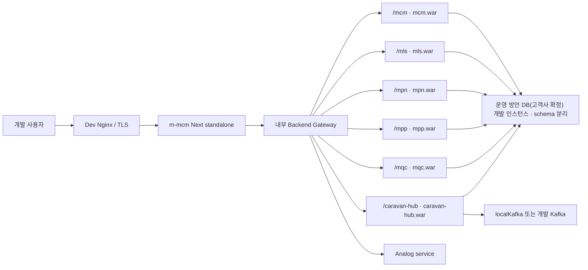
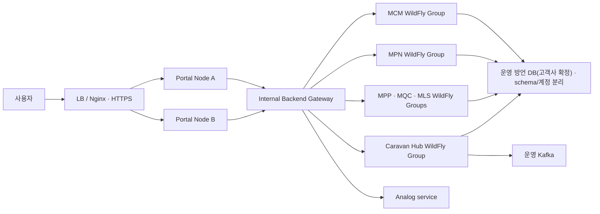

# {CLIENT} DMES 통합 배포 가이드

> **쉽게 말하면**: 개발이 끝난 Backend와 Frontend를 개발계·SIT·UAT·운영계 서버에 **어떻게 설치하고, 검증하고, 승격하고, 문제가 생기면 되돌릴지** 정한 문서다.
>
> npm이나 Nexus에 재사용 라이브러리를 발행하는 방법은 다루지 않는다. 모듈 패키지의 버전·호환성·발행·소비 계약은 [모듈 패키지 발행·소비 가이드](DMES-Module-Package-Publishing-and-Consumption-Guide.md)가 담당하고, 이 문서는 그 패키지를 소비해 만든 `*.war`와 Portal standalone을 실제 실행 환경에 배포하는 단계부터 담당한다.

> **문서 상태**: REVIEWED WORKING BASELINE
>
> **기준일**: 2026-07-13
>
> **대상**: MCM, MLS, MPN/APS, MPP, MQC, Caravan Hub, Analog, localKafka, Frontend Portal과 공통 라이브러리

---

## 0. 문서 범위

이 문서는 Backend와 Frontend의 배포 전략과 실행 절차를 함께 관리하는 **전체 DMES 배포 단일 정본**이다.

| 이 문서가 소유하는 내용 | 이 문서가 소유하지 않는 내용 |
|---|---|
| Backend/Frontend 배포 단위와 런타임 구조 | 프로젝트 관리 산출물 |
| 개발계·SIT·UAT·운영계 토폴로지와 승격 정책 | 모듈별 기능 완료 범위·업무 결정 |
| 최초 설치·반복 배포·rollback·테스트·증적 절차 | APS/MPN ADR·기능 설계·상세 업무 테스트 |
| 공통 배포 P0 차단사항과 `P/T-DMES-DEP-*` 백로그 | npm/Nexus 패키지의 상세 발행 계약 |

MPN 등 모듈명은 전체 배포 의존성을 설명할 때만 기록한다. 모듈별 기능 완료와 수용 증거는 해당 모듈 문서에서 관리한다.

---

## 1. 배포 결론

> **Backend 업무 웹 모듈은 WildFly 40 Standard에 모듈별 WAR로 독립 배포하고, Frontend 업무 패키지는 모두 `m-mcm` Portal에 번들해 Next.js standalone 하나로 배포한다.**

1. Spring Boot 4.0.6/Java 21 웹 모듈은 Servlet 6.1을 지원하는 WildFly 40 Standard를 사용한다.
2. `mcm.war`, `mls.war`, `mpn.war`, `mpp.war`, `mqc.war`, `caravan-hub.war`를 각각 생성한다.
3. `aps-core`, `cactus-core`, `mcm-core`, `caravan-core`, OASIS와 각 모듈 `lib`는 WAR에 포함되는 라이브러리다.
4. Analog는 현재 실행 JAR다. 공통 WildFly 표준 편입 시 WAR 전환이 필요하다.
5. localKafka는 개발계 전용 비웹 JAR다. 운영계는 외부 Kafka를 사용한다.
6. `shared`, `m-mpn`, `m-mpp`, `m-mqc`, `m-mls`, `m-analog`는 별도 서버가 아니라 Portal build에 포함되는 화면 라이브러리다.
7. 운영 Frontend 배포 단위는 `m-mcm` Next.js standalone 단일 artifact다.
8. 개발계에서 검증한 동일 checksum artifact를 SIT/UAT/운영으로 승격하고 설정과 secret만 환경별로 분리한다.
9. Spring Boot 실행 JAR를 기존 WildFly에 그대로 배포하지 않는다. 전용 WildFly 단일 실행물이 필요할 때만 Bootable JAR를 별도 판정한다.

---

## 2. Backend 배포

### 2.1 WildFly 배포 대상

| 시스템 | 소스 | 배포물 | 역할 | 현재 준비상태 |
|---|---|---|---|---|
| MCM | `src/backend/mcm` | `mcm.war` | 로그인·공통·권한·메뉴 | WAR/ServletInitializer 준비 |
| MLS | `src/backend/mls` | `mls.war` | 물류·슬리팅 | WAR/ServletInitializer 준비 |
| MPN/APS | `src/backend/mpn` + `aps-core` | `mpn.war` | 계획·스케줄·작업지시 | WAR 준비, prod DB baseline 차단 존재 |
| MPP | `src/backend/mpp` | `mpp.war` | 생산실행 | WAR/ServletInitializer 준비 |
| MQC | `src/backend/mqc` | `mqc.war` | 품질 | WAR/ServletInitializer 준비 |
| Caravan Hub | `src/backend/caravan-hub` | `caravan-hub.war` | 인터페이스·Kafka 연계 | WAR 준비, 별도 장애영역 권고 |

WAR의 로컬 `server.port`는 외장 WildFly에서 사용하지 않는다. `/mcm`, `/mls`, `/mpn`, `/mpp`, `/mqc`, `/caravan-hub` context root를 WildFly 설정 또는 `jboss-web.xml`로 명시 고정한다.

### 2.2 별도 실행·내장 대상

| 구분 | 대상 | 배포 방식 |
|---|---|---|
| 운영 보조 웹앱 | Analog | 현재 `bootJar`; 독립 서비스 예외 또는 승인 후 WAR 전환 |
| 개발 인프라 | localKafka | 개발계 별도 실행 JAR; 운영 배포 금지 |
| 제품 라이브러리 | `aps-core`, `cactus-core`, `mcm-core`, `caravan-core`, OASIS | Nexus/composite build 검증 후 WAR 내장 |
| 사이트 라이브러리 | 각 모듈 `lib` | 해당 `api` WAR 내장 |

### 2.3 Backend 릴리스 bundle

```text
dmes-backend-<releaseId>.zip
├── apps/
│   ├── mcm.war
│   ├── mls.war
│   ├── mpn.war
│   ├── mpp.war
│   ├── mqc.war
│   └── caravan-hub.war
├── optional/
│   └── analog.jar 또는 analog.war
├── dev-only/
│   └── localKafka.jar
├── wildfly/
│   ├── common.cli
│   ├── dev.cli
│   ├── prod.cli
│   ├── deploy.cli
│   └── rollback.cli
├── config/
│   ├── required-env.md
│   ├── dev.env.example
│   └── prod.env.example
├── db/<module>/
├── tests/
├── sbom/
├── release-manifest.json
└── checksums.sha256
```

`release-manifest.json`에는 Git SHA, Spring Boot/JDK/WildFly 버전, WAR checksum, 포함 라이브러리 버전, DB migration version, API contract version과 대응 Portal release ID를 기록한다.

### 2.4 DB schema 현행과 승격 원칙

| 모듈 | dev 현행 | prod 현행 | 운영 승격 조치 |
|---|---|---|---|
| MPN | application Flyway OFF, `ddl-auto=none` | application Flyway ON, `ddl-auto=none`, V1 placeholder(전환 전 legacy) | ADR-0058 clean lineage를 DBA runner로 선적용한 뒤 application Flyway OFF·자동 baseline 금지로 원자 전환 |
| MCM | `ddl-auto=update` | `ddl-auto=none` | versioned DDL 신설 |
| MLS | `ddl-auto=update` | `ddl-auto=none` | versioned DDL·멀티 datasource 검증 |
| MPP | `ddl-auto=update` | `ddl-auto=none` | 모듈 전용 schema·versioned DDL 신설 |
| MQC | `ddl-auto=update` | `ddl-auto=none` | 모듈 전용 schema·versioned DDL 신설 |
| Caravan Hub | dev 자동 DDL | prod 자동 DDL 금지 대상 | Kafka/Caravan schema versioned DDL 신설 |

dev 자동 DDL은 진단 편의일 뿐 승격 artifact가 아니다. 각 모듈의 schema diff를 versioned DDL/migration으로 만들고 빈 DB, 기존 DB upgrade, 운영유사 clone에서 같은 checksum을 검증한다.

MPN은 ERP DB를 변경하지 않으며 기존 IF 팀이 제공하는 계약 경계 밖의 `EAIUSER` schema도 MPN migration으로
소유하지 않는다. MPN 최초 구축 lineage의 대상은 `MPNAPUSER` 업무 schema다. 상세 분류·baseline 예외·전환
순서는 [ADR-0058](../../aps/design/adr/0058-mpn-database-clean-build-and-if-boundary.md)을 따른다.

---

## 3. Frontend 배포

### 3.1 런타임 단위

| 패키지 | 유형 | 운영 별도 프로세스 | 배포 방식 |
|---|---|---:|---|
| `@dk-oasis/mcm` | Next.js Portal+BFF | 예 | standalone 단일 Node 서비스 |
| `@dk-oasis/shared` | 공통 UI·인증·BFF 라이브러리 | 아니오 | Portal build에 포함 |
| `@dk-oasis/m-mpn` | APS 화면 라이브러리 | 아니오 | Portal build에 포함 |
| `@dk-oasis/m-mpp` | 생산 화면 라이브러리 | 아니오 | Portal build에 포함 |
| `@dk-oasis/m-mqc` | 품질 화면 라이브러리 | 아니오 | Portal build에 포함 |
| `@dk-oasis/m-mls` | 물류 화면 라이브러리 | 아니오 | Portal build에 포함 |
| `@dk-oasis/m-analog` | 로그 화면 라이브러리 | 아니오 | Portal build에 포함 |

업무 화면 패키지는 운영 서버로 각각 배포하지 않는다. 독립 팀 발행이 필요하면 private npm에 publish하고 Portal이 버전을 고정해 재빌드한다. 운영 중 package hot-swap은 별도 micro-frontend 설계 없이는 적용하지 않는다.

### 3.2 Portal standalone 패키징 전제

`src/frontend/m-mcm`은 Next.js 16 Portal+BFF이며 `output: "standalone"`으로 자체 포함 실행 트리를 만든다.

| 항목 | 요구사항 | 검증 기준 |
|---|---|---|
| Node.js | 20.9 이상 | build manifest에 실제 버전 기록 |
| pnpm | 10.x | lockfile과 실제 버전 기록 |
| package registry | `@dk-oasis` private registry 접근 | install 실패 0건 |
| dependency layout | `node-linker=hoisted` | 이식 불가능한 절대경로 symlink 0건 |
| zip 실행환경 | Windows PowerShell `Compress-Archive` 사용 가능 | 최종 zip 존재·해제 검증 |

빌드 PC의 `src/frontend/.npmrc`에는 다음 로컬 설정이 필요하다. 이 파일은 source에 secret과 함께 커밋하지 않는다.

```ini
@dk-oasis:registry=http://localhost:4873/
node-linker=hoisted
```

`node-linker`를 추가하거나 변경했다면 기존 dependency tree를 재사용하지 않고 클린 설치한다.

```powershell
cd src\frontend
Remove-Item -Recurse -Force node_modules, m-mcm\node_modules, shared\node_modules -ErrorAction SilentlyContinue
pnpm install --frozen-lockfile
```

`node-linker=hoisted`를 적용하지 않은 pnpm symlink 구조는 다른 PC로 옮겼을 때 target이 끊길 수 있으므로 승격 artifact로 인정하지 않는다.

> **현재 준비상태**: 저장소의 로컬 `src/frontend/.npmrc`는 존재하지 않고 `pnpm config get node-linker`도 `undefined`다. 빌드 PC에서 위 설정을 만들고 클린 설치하기 전까지 standalone artifact는 진단용이며 승격할 수 없다.

### 3.3 Portal component artifact 생성

```powershell
cd src\frontend
pnpm install --frozen-lockfile
pnpm -r build
pnpm --filter @dk-oasis/mcm pack:zip
```

산출물은 `src\frontend\m-mcm\.next\m-mcm-standalone.zip`이다. `pnpm -r build`는 `shared → m-* → m-mcm` 의존 순서로 workspace를 빌드하고, `pack:zip`은 `scripts/pack-standalone.mjs --zip`을 실행한다.

zip 없이 보강된 standalone 폴더만 만들 때는 다음 명령을 사용한다.

```powershell
pnpm --filter @dk-oasis/mcm pack
```

패키징 스크립트는 다음 순서로 component artifact를 조립한다.

1. `.next/static`을 `standalone/m-mcm/.next/static`에 복사한다.
2. `public/`을 `standalone/m-mcm/public`에 복사한다.
3. target을 찾을 수 있는 traced runtime dependency symlink를 실파일로 펼친다. 현재 스크립트는 깨진 symlink를 경고 후 삭제하므로 격리 부팅 검증 전에는 성공으로 판정하지 않는다.
4. 처리 후 symlink가 하나라도 남으면 스크립트가 이식 불가로 실패한다.
5. 스크립트의 고정 목록에 있는 `.env`, `.env.local`, 개발·로컬 env 파일을 제거한다. 그 밖의 `.env*`는 pipeline이 재귀 검사한다.
6. `--zip`이면 PowerShell `Compress-Archive`로 `.next/m-mcm-standalone.zip`을 만든다. 현재 PowerShell 실패가 process exit 0으로 끝날 수 있으므로 zip 존재·해제 검증을 별도 gate로 강제한다.

`next.config.ts`의 `output: "standalone"`, frontend root를 가리키는 `outputFileTracingRoot`, 업무 package를 포함하는 `transpilePackages`가 전제다. 실행 진입점은 `m-mcm/server.js`다.

### 3.4 Component 구조와 이식성 Gate

```text
m-mcm-standalone.zip
├── m-mcm/
│   ├── server.js
│   ├── package.json
│   ├── public/
│   └── .next/
│       ├── BUILD_ID
│       ├── *-manifest.json
│       ├── required-server-files.json
│       ├── server/
│       ├── static/
│       └── node_modules/        # trace 결과에 따라 생성
└── node_modules/                # hoisted runtime dependency
```

`shared`, `m-mpn`, `m-mpp`, `m-mqc`, `m-mls`, `m-analog`는 별도 최상위 디렉터리로 배포하지 않고 server bundle에 포함한다.

component artifact는 다음 조건을 모두 통과해야 한다.

- `m-mcm/server.js`가 정확히 1개 존재한다.
- `.next/static`, 필요한 `public`, BUILD_ID와 manifest가 존재한다.
- symlink 0건이며, pipeline의 재귀 검사 기준 `.env*` 0건·secret scan 0건이다. pack 스크립트의 고정 삭제 목록만으로 판정하지 않는다.
- zip 파일이 실제로 존재하고 별도 임시 디렉터리에 정상 해제된다.
- 해제한 디렉터리에서 외부 환경변수만 주입해 `node m-mcm\server.js` 기동이 가능하다.
- 원본 build PC의 절대경로를 참조하지 않는다.

2026-06-22 실측값인 약 44MB·2,061개 entry는 참고값이며 release gate가 아니다. package와 Next 버전에 따라 달라질 수 있다.

### 3.5 Frontend 최종 릴리스 bundle

`m-mcm-standalone.zip`은 Portal component artifact다. 공통 pipeline이 manifest/checksum/SBOM/smoke를 더해 다음 최종 승격 bundle을 만든다.

```text
dmes-portal-<releaseId>.zip
├── m-mcm/
├── node_modules/
├── release-manifest.json
├── checksums.sha256
├── sbom/
└── smoke/
```

manifest에는 Git SHA, lockfile hash, Node/pnpm/Next 버전, 전체 업무 package 버전, Next BUILD_ID, 대응 Backend release ID/API contract version과 Portal checksum을 기록한다. `.env`, 비밀번호, JWT secret, client key는 artifact에 포함하지 않는다.

패키징 구현 정본은 다음 source다.

- `src/frontend/m-mcm/scripts/pack-standalone.mjs`
- `src/frontend/m-mcm/next.config.ts`
- `src/frontend/m-mcm/package.json`의 `pack`, `pack:zip`
- `src/frontend/.npmrc`의 `node-linker=hoisted` 로컬 설정

### 3.6 패키징 장애 대응

| 증상 | 주요 원인 | 조치 |
|---|---|---|
| dereference 후 symlink 잔존 | hoisted 미적용 또는 중첩 symlink farm | `.npmrc` 확인 → node_modules 클린 → frozen install → 재빌드·재패키징 |
| `Cannot find module 'next'` 또는 `styled-jsx` | build PC 절대경로 symlink가 zip에 남음 | hoisted 클린 설치 후 component artifact 재생성 |
| CSS/JS 또는 public asset 누락 | static/public 보강 실패 | pack 로그의 static/public 복사 성공과 zip 내부 경로 확인 |
| standalone 산출물 없음 | `next build` 미수행 또는 `output: "standalone"` 누락 | `pnpm -r build` 선행, `next.config.ts` 확인 |
| zip 생성 실패·파일 없음 | PowerShell `Compress-Archive` 실패 | command status뿐 아니라 zip 존재를 gate로 검사하고, 원인 해결 후 재생성 |
| pack 성공이나 runtime module 누락 | 깨진 symlink를 경고 후 삭제하고 계속 진행 | 깨진 symlink를 non-zero로 바꾸기 전에는 격리 부팅·module load smoke를 의무화하고 승격 금지 |
| 예상하지 않은 `.env*` 잔존 | pack 스크립트가 고정된 env 파일명만 삭제 | standalone 전체 재귀 검색과 secret scan 0건을 pipeline에서 강제 |
| 다른 PC에서만 부팅 실패 | 원본 경로·env·secret 의존 | 절대경로·symlink·`.env*` 0건 확인 후 격리 디렉터리 smoke 수행 |

### 3.7 배포·rollback 정책

- release는 별도 디렉터리에 풀고 기존 파일을 덮어쓰지 않는다.
- 새 프로세스 readiness와 업무 smoke가 통과한 뒤 upstream을 전환한다.
- 정적 chunk와 server bundle은 같은 release로 함께 전환한다.
- 실패 시 이전 upstream과 승인 release로 복귀한다.
- 최근 승인 artifact·manifest·checksum을 rollback 정책에 따라 보존한다.

---

## 4. 환경별 구성

### 4.1 개발자 로컬

- 필요한 Backend 모듈만 실행하고 SQLite를 단위/API 재현에 우선 사용한다.
- Frontend는 `pnpm dev`와 업무 package watch build를 사용한다.
- Portal BFF는 초기 진단에서 모듈별 WAS URL로 직결할 수 있다.
- 로컬 직결은 운영 경로 검증을 대체하지 않는다.

### 4.2 공용 개발·통합계



| 영역 | 개발계 기준 |
|---|---|
| WildFly | WildFly 40 통합 인스턴스부터 시작 가능; 자원·장애영역 문제 시 MPN/Caravan 분리 |
| Backend profile | 모든 WAR에 `spring.profiles.active=dev` 명시 |
| DB | 운영 방언 DB(고객사 확정)의 개발 인스턴스, 모듈별 schema·계정; SQLite는 로컬 개발·테스트 전용 |
| Portal | Next standalone artifact로 서비스 기동 |
| Routing | `BACKEND_API_URL`이 내부 dev Gateway를 가리킴; 모듈별 URL은 진단 예외 |
| Kafka | localKafka 또는 개발 Kafka; 운영 데이터 연결 금지 |
| 완료 증거 | test report, checksum, deployment status, smoke report |

### 4.3 운영계



| 영역 | 운영계 기준 |
|---|---|
| WildFly | MCM, MPN, MES 업무군, Caravan Hub를 독립 JVM/server group으로 분리 |
| 이중화 | Portal A/B, 핵심 WildFly는 2노드 또는 rolling 가능한 group |
| Backend profile | `prod` 강제, 기본 profile fail-fast |
| DB | 운영 방언 DB(고객사 확정) 최소권한 계정, `ddl-auto=none`, 승인 migration만 적용 |
| Secret | WildFly credential store/JNDI 또는 조직 secret store |
| Portal | 동일 standalone checksum을 A/B에 배포하고 upstream 전환 |
| Portal 필수 env | `PORT`, `HOSTNAME`, `NEXTAUTH_URL`, `AUTH_SECRET`, `AUTH_COOKIE_PREFIX`, `BACKEND_API_URL`, `BACKEND_CLIENT_KEY`, `RBAC_DEFAULT_DENY=true`, `TRUSTED_PROXY_HOPS`(앞단 단계 수, 아래 행) |
| Portal 앞단 Nginx · 사용자 IP | Portal 앞 Nginx 는 클라이언트가 보낸 값을 덮어쓴다: `proxy_set_header X-Forwarded-For $remote_addr;`. Portal 은 `TRUSTED_PROXY_HOPS`=앞단 단계 수(Nginx 한 단계면 `1`)로 두고, 그만큼 오른쪽에서 고른 주소 하나만 BE 로 넘긴다. 기본 `0` 은 XFF 를 넘기지 않는다(Next 16 은 소켓 주소를 주지 않아 위조 값과 구별할 수 없다 — `m-mcm/lib/http/forwarded-for.ts`). BE `dmes.client-ip.trusted-proxies` 에 Portal 노드 IP 를 넣어야 그 값이 화면 사용 기록에 쓰인다(2026-10-03) |
| Portal 공존 조건 | 서로 다른 build가 A/B·rolling 중 공존하고 Server Actions를 사용하면 CI build 입력 `NEXT_SERVER_ACTIONS_ENCRYPTION_KEY`와 deployment ID를 노드 간 일치시킨다. cache/ISR을 사용하면 공유 저장소 또는 버전 고정 routing 정책 적용 |
| Portal readiness | `/readyz`가 프로세스 생존뿐 아니라 Gateway·MCM 인증·`BACKEND_CLIENT_KEY` 의존성까지 판정 |
| Routing | 브라우저의 WildFly 직접접근 금지; 단일 내부 Gateway 사용 |
| 롤백 | N/N-1 API 호환, DB expand→deploy→contract |
| 관측 | release/correlation ID, health/readiness, JVM/DB pool, HTTP, Kafka/IF lag, reconciliation |

---

## 5. 공통 배포 Gate

| 영역 | 필수 gate |
|---|---|
| Backend | 모듈/core 테스트, 6개 WAR, SBOM·secret scan, checksum·manifest, versioned DB migration 검증 |
| Frontend | lockfile 고정, 전체 업무 package lint/test/build, Portal standalone, 이식성·secret scan, checksum·manifest |
| 환경 승격 | 개발계 smoke를 통과한 동일 artifact·migration checksum 승격 |
| 배포 후 | health/readiness, 인증·권한, DB/IF, 대표 업무 smoke와 reconciliation |

root `buildAll/testAll`과 Frontend `test:all`이 모든 업무 모듈을 포함하지 않는 문제는 P0 차단사항으로 관리한다.

---

## 6. 완료 결과와 역할

### 6.1 완료 결과

배포 기반은 다음 상태가 모두 증명됐을 때 완료다.

1. 승인 WildFly 환경에 6개 WAR가 고정 context root로 기동된다.
2. Portal standalone이 서비스로 기동되고 Gateway를 통해 각 Backend로 연결된다.
3. Analog/localKafka가 승인된 환경별 방식으로 격리된다.
4. 같은 source/tag로 재현 가능한 artifact와 checksum을 만든다.
5. 자동 테스트, migration, smoke, rollback 결과가 동일 release ID로 연결된다.
6. secret이 source, WAR/zip, manifest, 로그에 포함되지 않는다.
7. 동일 artifact를 개발계에서 운영계까지 승격할 수 있다.

### 6.2 RACI

| 활동 | 개발 | PM | 인프라/보안 | DBA | 업무·ERP/MES |
|---|---|---|---|---|---|
| artifact·자동 테스트·배포 스크립트 | A/R | I | C | C | I |
| 서버·네트워크·TLS·서비스 계정 | C | A | R | I | I |
| DB schema·계정·backup·migration 승인 | C | I | C | A/R | I |
| Gateway·Portal·Backend route 구성 | R | A | R | C | I |
| IF 연결·샘플·상대 side effect 검증 | R | A | C | C | R |
| 배포·rollback 승인 | R | A | R | R | C |
| smoke·업무 점검·종료 승인 | R | A | C | C | R |

---

## 7. 최초 개발계 설치

### S0. 환경 매트릭스 동결

다음 값을 환경별로 채우고 각 행에 owner·승인자를 지정한다.

| 구분 | 확정할 값 |
|---|---|
| Runtime | JDK vendor/version, WildFly major·patch, Node/pnpm version |
| Server | hostname, OS, CPU/RAM, disk 임계값, timezone/NTP |
| WildFly | base/service명, server group, bind/management port, context root, JVM/heap, log 경로 |
| Portal | A/B node, release/service 경로, port, public URL, upstream 전환 방식 |
| Network | DNS/TLS, LB/Nginx, 방화벽, Gateway와 DB/Kafka/IF 목적지 |
| Database | DB/schema/계정, migration runner, backup·restore 위치, RTO/RPO |
| Secret | 저장소, 주입 방식, rotation owner·주기, 비상폐기 절차 |
| Control | 배포 가능시간, 승인자, artifact/config/log/backup 보존기간 |

**Exit**: 필수 미정값 0개 또는 설치를 막지 않는 승인 예외만 존재한다.

### S1. 사전점검

- JDK, WildFly, Node, disk, memory, timezone, NTP를 확인한다.
- Portal→Gateway, Gateway→Backend, Backend→DB/Kafka/IF 연결을 확인한다.
- 서비스 계정 최소권한과 DB schema 권한을 확인한다.
- 기존 artifact/config/DB backup과 복구 위치를 확인한다.
- 운영 데이터와 운영 Kafka가 개발계에 연결되지 않았는지 확인한다.

**Exit**: 필수 runtime·자원 기준 충족, 연결·권한 사전점검 PASS, backup·복구 위치 접근 가능, 운영 endpoint 오연결 0건.

### S2. source 기준선과 artifact 생성

Backend 기본 형태:

```bash
cd src/backend/<module>
../gradlew :lib:test :api:test :api:bootWar --rerun
```

대상은 `mcm`, `mls`, `mpn`, `mpp`, `mqc`다. 예외·확장 대상은 다음 명령을 명시 실행한다.

```bash
cd src/backend
./gradlew :aps-core:test :aps-core:slowTest :aps-core:useCaseTest --rerun
./gradlew :caravan-hub:test :caravan-hub:bootWar --rerun
./gradlew :analog:core:test :analog:api:test :analog:api:bootJar --rerun
```

Frontend 기본 형태:

```bash
cd src/frontend
pnpm install --frozen-lockfile
pnpm -r lint
pnpm test:unit
pnpm test:api
pnpm -r build
pnpm --filter @dk-oasis/mcm pack:zip
```

Portal component의 상세 전제·구조·이식성 검증은 §3.2~3.6을 적용한다.

**Exit**: 필수 test 실패 0, archive secret scan 0, artifact별 checksum·manifest·SBOM 생성.

### S3. DB schema 준비

1. 현재 schema와 코드/migration diff를 만든다.
2. versioned DDL/migration과 backup·검증·복구 절차를 준비한다.
3. 빈 DB, 기존 DB upgrade, 운영유사 clone에서 checksum을 검증한다.
4. 배포 대상 DB를 backup하고 restore 가능 여부를 확인한다.
5. DBA 승인 뒤 환경별 승인 runner(Flyway 또는 승인 SQL runner)로 migration을 적용한다.
6. 적용 후 migration version/checksum, schema diff, 대표 데이터 보존을 확인한다.
7. manifest와 배포 이력에 적용 전·후 version/checksum을 기록한다.
8. 적용·검증 실패 시 WAR 배포를 시작하지 않고 DBA가 재시도, forward-fix 또는 restore를 판정한다.

**Exit**: 미승인 schema diff 0건, migration 적용·version/checksum 검증 PASS, 대표 데이터 손실 0건, restore 가능 증적 확보.

### S4. WildFly와 Backend 설치

1. 환경 매트릭스대로 WildFly base/service/JVM/port를 준비한다.
2. profile, UTF-8, timezone, heap, log path를 외부 설정한다.
3. DB/JWT/client key/IF 설정은 credential/JNDI/secret store로 주입한다.
4. 기본 profile이나 번들 secret으로 기동하면 fail-fast한다.
5. 기존 deployment/config를 backup한다.
6. 6개 WAR를 management CLI/API로 배포한다.
7. deployment status, health/readiness, DB, 인증 401과 대표 API를 확인한다.

**Exit**: WildFly deployment error 0건, 배포 checksum=manifest, 전 WAR health/readiness·인증·대표 API PASS, 서비스 재시작 후 자동기동 PASS.

### S5. Portal 설치

1. standalone을 새 release 디렉터리에 풀고 기존 release를 덮어쓰지 않는다.
2. 필수 env/secret을 외부 주입하고 preflight를 실행한다.
3. Node를 Windows service 또는 systemd로 등록한다.
4. health와 `/readyz`를 확인한다. `/readyz`는 Gateway·MCM 인증·`BACKEND_CLIENT_KEY` 의존성까지 판정해야 한다.
5. reverse proxy가 외부 내부신뢰/사용자/client-key 헤더를 제거하는지 확인한다.
6. MCM 로그인, 권한거부, 모듈별 메뉴/BFF API, 정적 asset을 확인한다.

**Exit**: release/build ID와 checksum 일치, 서비스 재시작 후 자동기동, 로그인·403·업무 route PASS, mixed-content/CORS/asset 오류 0건.

### S6. 통합 smoke와 인수

1. Portal/Gateway/Backend health·readiness
2. 로그인 성공·실패, 무인증 401, 권한 없는 역할 403
3. 각 업무 모듈 대표 읽기 API
4. 승인된 격리 데이터 쓰기→조회→삭제/복원
5. Kafka/ERP/MES side effect 없는 contract ping
6. release/correlation ID 기반 로그 추적
7. DB pool, 오류율, 응답시간, disk/heap, IF backlog

**Exit**: P0/P1 결함 0, 증적과 제한사항 승인.

---

## 8. 반복 배포와 환경 승격

### 8.1 반복 배포

```text
변경 승인
 → deploy ID·source/tag·commit·변경목록·담당·승인자 동결
 → test report·DB 변경·이전 artifact/config 복구 가능 여부 기록
 → 자동 테스트·migration 검증
 → WAR/Portal build
 → secret scan·SBOM·checksum·manifest
 → DB backup·restore 가능 확인
 → 승인 migration 적용·version/checksum/schema 검증
 → 새 Backend deployment·health
 → 새 Portal release 기동·ready/smoke
 → Gateway/Nginx 전환
 → 모듈 업무 smoke·reconciliation
 → 이전 Portal·Backend 유입 차단·connection drain
 → 합의된 관찰 구간 동안 오류율·지연·IF backlog 확인
 → 이전 process 종료·artifact 보존
 → 완료 승인 또는 rollback
```

배포 성공은 파일 복사나 프로세스 기동이 아니라 배포 후 smoke·관찰 전 항목 PASS 시점이다. migration 적용이나 검증이 실패하면 신규 artifact 배포를 시작하지 않고 DBA가 forward-fix/restore를 판정한다.

### 8.2 환경 승격

| 항목 | 개발계 | SIT/UAT | 운영계 |
|---|---|---|---|
| Artifact | 승인 branch 자동배포 가능 | 개발계 통과 checksum 승격 | UAT 승인 checksum만 승격 |
| Backend | 통합 WildFly 허용 | 운영유사 group/context/Gateway | 장애영역 분리·rolling |
| Portal | 단일 Node 허용 | standalone·실 route 검증 | A/B 동일 artifact·upstream 전환 |
| DB | 운영 방언 DB(고객사 확정) 개발 인스턴스·schema 분리 | prod-like clone·versioned migration | 최소권한·승인 migration |
| Kafka/IF | 개발 Kafka | 상대 staging | 운영 Kafka/실 IF |
| Gate | 자동 test+smoke | 전체 프로세스·UAT·복구 | go/no-go·post-smoke·reconciliation |

환경마다 재빌드하지 않는다. 동일 artifact와 migration checksum을 승격한다.

승격 환경에서도 `backup → 승인 migration 적용 → version/checksum/schema 검증 → Backend 배포` 순서를 지키며, 단계별 deploy ID·승인·검증 증적을 한 이력으로 묶는다.

---

## 9. Rollback

### 9.1 조건

- health/readiness 실패 또는 반복 재기동
- 로그인/Gateway/BFF 핵심 route 실패
- DB incompatibility·데이터 훼손 징후
- Kafka/ERP/MES 중복 side effect 또는 backlog 급증
- P0/P1 smoke 실패, 오류율·지연 임계값 초과

### 9.2 실행

1. rollback을 선언하고 신규 작업 유입을 통제한다.
2. 장애 로그, deploy ID, DB/IF 상태를 보존한다.
3. Frontend upstream을 이전 Portal release로 되돌린다.
4. 영향 WAR를 이전 checksum으로 독립 rollback한다.
5. DB는 expand→deploy→contract 호환 경로를 우선한다.
6. health→인증→모듈 API→업무 smoke→IF reconciliation 순으로 재검증한다.
7. RTO, 원인, 데이터 보정, 재배포 조건을 기록한다.

destructive down migration은 DBA 승인 없이 실행하지 않는다.

---

## 10. 테스트·증적

| 단계 | 최소 기준 |
|---|---|
| Unit/API | failures/errors 0, 예상하지 않은 skip 0 |
| SQLite/local | 격리 fixture와 상태·수량 불변식 PASS |
| 운영 방언 DB(고객사 확정) | migration·권한·대표 query·schema diff PASS |
| Artifact | checksum 일치, secret scan 0, 빈 디렉터리 이식 smoke PASS |
| Security | 401·403·default deny·내부 헤더 위조 negative PASS |
| Integration | Portal→Gateway→각 모듈, Kafka/IF 계약 PASS |
| Rollback | 승인 RTO 안에 이전 release와 데이터 정합 복구 |

```text
<releaseId>/
  release-manifest.json
  checksums.sha256
  sbom/
  test/
  db/
  preflight/
  deploy/
  smoke/
  rollback/
  known-issues.md
  approval.md
```

비밀번호·token·원문 secret은 증적에 넣지 않는다.

---

## 11. 운영 전 P0 차단사항

### 11.1 Backend

| ID | 차단사항 | 필요한 조치 |
|---|---|---|
| DEP-BE-001 | MPN MSSQL V1 placeholder와 불완전한 최초 구축 계보 | V2~V21·V32 중복까지 정규화한 clean lineage, 빈 DB/clone 검증 |
| DEP-BE-002 | MPN 공유 DB runner/profile 전환 미완 | DBA runner 선적용, application Flyway OFF·자동 baseline 금지·runtime DDL 거부 원자 전환 |
| DEP-BE-003 | MCM prod multi-datasource 정합 미완 | EAI/CARAVAN datasource·transaction boot test |
| DEP-BE-004 | MPP/MQC dev DB 기본값이 MCM 계정 | 모듈 전용 계정·환경변수 의무화 |
| DEP-BE-005 | root build/test에서 MLS·Analog 누락 | 전체 모듈 CI matrix 보완 |
| DEP-BE-006 | Analog는 Boot JAR만 지원 | WAR 전환 또는 독립 서비스 예외 승인 |
| DEP-BE-007 | WildFly 39 stale 주석 | 6개 WAR WildFly 40 smoke·템플릿 정리 |
| DEP-BE-008 | profile에 credential 기본값/리터럴 존재 | credential 제거·rotate·archive scan 0 |
| DEP-BE-009 | 공통 prod profile fail-fast 부재 | prod guard 또는 배포 preflight 구현 |
| DEP-BE-010 | MPN 외 versioned migration 승격체계 부재 | 모듈별 versioned DDL·checksum 체계 구축 |

### 11.2 Frontend

| ID | 차단사항 | 필요한 조치 |
|---|---|---|
| DEP-FE-001 | MQC Portal page registry 누락 | MQC registry/codegen·메뉴 smoke |
| DEP-FE-002 | MLS export/build entry 불일치 | private npm 전환 시 정합; monorepo trace/pack smoke |
| DEP-FE-003 | 비밀번호 API Gateway prefix 불일치 | 공통 backend URL resolver 사용 |
| DEP-FE-004 | `/oasis-test` 기본 계정·JWT 노출 | prod 제외/제거·인증가드 |
| DEP-FE-005 | Portal health/readiness 부재 | `/healthz`, `/readyz`, release/build ID |
| DEP-FE-006 | root dev/test 업무 package 누락 | workspace script·CI matrix 보완 |
| DEP-FE-007 | `pack:zip` 실패가 성공 종료 가능 | 실패 non-zero·cross-platform pack |
| DEP-FE-008 | public WAS URL client 참조 | prod bundle direct-WAS 참조 0 검증 |
| DEP-FE-009 | 내부/사용자 헤더 위조 인증우회 가능 | 신뢰헤더 방어·외부 strip·내부 route 차단 |
| DEP-FE-010 | RBAC 미등록 API 기본허용 가능 | `RBAC_DEFAULT_DENY=true`·negative smoke |
| DEP-FE-011 | 필수 env 누락에도 process 기동 가능 | required-env preflight·ready dependency 검증 |
| DEP-FE-012 | refresh token 저장·세션/CSRF 기준 미완 | HttpOnly/회전전략·CSRF/Origin negative test |
| DEP-FE-013 | pack이 깨진 symlink를 삭제·계속하고 env 고정 목록만 제거 | 깨진 symlink non-zero·standalone 재귀 `.env*`/secret scan 0 |

P0 차단사항이 남은 artifact는 진단용으로만 개발계에 배포하며 상위 환경으로 승격하지 않는다.

---

## 12. 통합 배포 실행 백로그

### 12.1 상위 계획

| 상태 | 우선순위 | Plan Code | 계획 | 완료 결과 |
|---|---:|---|---|---|
| [🕒][⚠️] | P0 | P-DMES-DEP-000 | 배포 기준선·환경 확정 | 전체 인벤토리·RACI·환경 매트릭스 |
| [🕒][⚠️] | P0 | P-DMES-DEP-100 | Backend 전체 WAR 표준화 | 6개 WAR·Analog 결정·통합 bundle |
| [🕒][⚠️] | P0 | P-DMES-DEP-200 | Frontend 단일 Portal 배포 | 재현 standalone·A/B rollback |
| [🕒][⚠️] | P0 | P-DMES-DEP-300 | 개발계 최초 통합배포 | 통합 smoke·반복배포 기반 |
| [🕒] | P1 | P-DMES-DEP-400 | SIT/UAT/운영 승격 | 동일 artifact·DDL 승격·rehearsal |
| [🕒] | P1 | P-DMES-DEP-500 | 운영 전환·배포 관찰 | cutover·post-smoke·reconciliation·배포 인수 |

### 12.2 실행 Task

| 상태 | Task Code | 작업 |
|---|---|---|
| [🕒][⚠️] | T-DMES-DEP-001 | 전체 서버·WildFly group·Node·DB·Kafka·DNS/TLS·포트·계정 환경 매트릭스 확정 |
| [🕒][⚠️] | T-DMES-DEP-002 | Backend·Frontend owner/FTE와 배포·rollback RACI 확정 |
| [🕒][⚠️] | T-DMES-DEP-003 | DEP-BE-001~010, DEP-FE-001~013 owner·due·수용기준 배정 |
| [🕒][⚠️] | T-DMES-DEP-101 | 6개 WAR build/test/secret scan/checksum 자동화 |
| [🕒] | T-DMES-DEP-102 | Analog WAR 전환 또는 독립 JAR 예외 승인 |
| [🕒][⚠️] | T-DMES-DEP-103 | root build/test CI matrix에 MLS/Analog 포함 |
| [🕒][⚠️] | T-DMES-DEP-104 | 전 WAR credential 제거·rotate·archive scan 0과 prod profile fail-fast |
| [🕒] | T-DMES-DEP-105 | 전용 WildFly 요구가 생길 때만 Bootable JAR PoC, 없으면 근거 있는 N/A |
| [🕒][⚠️] | T-DMES-DEP-201 | 전체 업무 package lint/test/build와 Portal standalone 재현 build |
| [🕒][⚠️] | T-DMES-DEP-202 | Portal health/readiness·release ID·모듈 smoke 구현 |
| [🕒][⚠️] | T-DMES-DEP-203 | Portal package·routing·테스트 페이지 P0 결함 종결 |
| [🕒][⚠️] | T-DMES-DEP-204 | 신뢰헤더 인증우회 차단·RBAC default-deny·required-env preflight |
| [🕒][⚠️] | T-DMES-DEP-205 | Portal refresh token 비저장·세션회전·CSRF/Origin 방어 |
| [🕒][⚠️] | T-DMES-DEP-301 | Dev WildFly·Gateway·Portal·운영 DB·Kafka 설치 |
| [🕒][⚠️] | T-DMES-DEP-302 | 6개 WAR+Portal 최초 통합배포와 로그인·대표 API smoke |
| [🕒] | T-DMES-DEP-303 | 반복배포·checksum·증적·rollback rehearsal |
| [🕒] | T-DMES-DEP-304 | 공통 로그·release/correlation ID·metrics·trace·alert 기반 구축 |
| [🕒] | T-DMES-DEP-305 | 모듈 독립 배포·checksum·증적을 연결할 공통 CLI/CI framework 구축 |
| [🕒] | T-DMES-DEP-401 | 운영유사 WildFly group·Portal A/B·Gateway·DB/IF 구성 |
| [🕒] | T-DMES-DEP-402 | 동일 RC artifact·versioned DDL 개발계→SIT 승격 |
| [🕒] | T-DMES-DEP-403 | 부하·복구·rolling·N/N-1 compatibility rehearsal |
| [🕒] | T-DMES-DEP-404 | SIT 승인 artifact·versioned DDL UAT 승격 |
| [🕒][⚠️] | T-DMES-DEP-405 | SIT 통합검증·defect gate와 배포후보 품질 승인 |
| [🕒] | T-DMES-DEP-406 | 배포·복구 dress rehearsal 증적과 운영 runbook 인수 승인 |
| [🕒] | T-DMES-DEP-501 | 최종 delta·운영배포·트래픽 전환·post-smoke 실행 |
| [🕒] | T-DMES-DEP-502 | 배포 관찰·reconciliation·운영 배포 인수 |

### 12.3 완료 조건

- [ ] 모든 모듈이 release manifest와 checksum을 가진다.
- [ ] 개발계에서 검증한 동일 artifact가 상위 환경으로 승격된다.
- [ ] 환경별 설정·secret이 artifact와 분리된다.
- [ ] Backend 모듈별 rollback과 Portal 전체 rollback이 가능하다.
- [ ] DB 변경은 versioned migration과 expand→deploy→contract를 따른다.
- [ ] 각 환경 승격·운영 전환 단계마다 자동 smoke와 승인 증적이 있다.

---

## 13. 관련 문서

- 모듈 package 발행·소비 계약: [DMES-Module-Package-Publishing-and-Consumption-Guide.md](DMES-Module-Package-Publishing-and-Consumption-Guide.md)
- MPN 남은 작업과 완료 조건: [TASKS.md](../../aps/TASKS.md)
- MPN 배포 검증 부록: [MPN-Deployment-Verification-Addendum.md](../../aps/MPN-Deployment-Verification-Addendum.md)

---

## 14. 변경 이력

| 일자 | 버전 | 내용 |
|---|---|---|
| 2026-07-12 | v0.1~0.2 | Backend/Frontend 배포 전략·환경·P0·배포 백로그 작성 및 검토 |
| 2026-07-13 | v0.3~0.4 | 공통 Operations 이동, MPN 분리, 보안·관측·pipeline Task 보강 |
| 2026-07-13 | v1.0 | 배포 전략과 실행 절차를 Backend·Frontend 단일 가이드로 통합하고 비배포 내용을 분리 |
| 2026-07-13 | v1.1 | `m-mcm` Next.js standalone 패키징·이식성·장애대응 매뉴얼을 본 가이드에 통합 |

---

## 15. 공식 참고

- [Spring Boot System Requirements](https://docs.spring.io/spring-boot/system-requirements.html)
- [Spring Boot Traditional Deployment](https://docs.spring.io/spring-boot/how-to/deployment/traditional-deployment.html)
- [WildFly 40 Getting Started Guide](https://docs.wildfly.org/40/Getting_Started_Guide.html)
- [WildFly Admin Guide](https://docs.wildfly.org/40/Admin_Guide.html)
- [Next.js Standalone Output](https://nextjs.org/docs/app/api-reference/config/next-config-js/output)
- [Next.js Self-Hosting Guide](https://nextjs.org/docs/app/guides/self-hosting)
