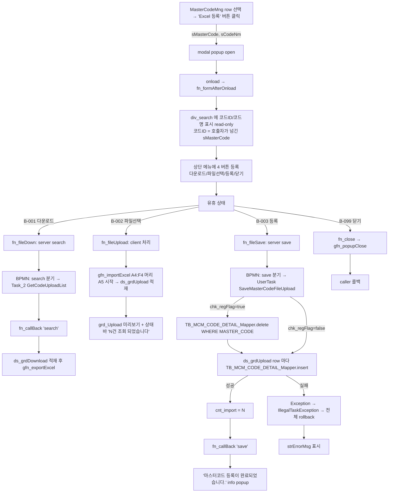

# masterCodeUploadFilePopup 기능설계서

> 단일 원천: `masterCodeUploadFilePopup_분석리포트.md`. 본 문서는 분석리포트의 §1~§14 를 기능 관점으로 재구성한 To-Be 명세.

## §1. 화면 개요 + 호출 컨텍스트

### 1.1 화면 식별

| 항목 | 값 |
|---|---|
| 화면 식별자 | masterCodeUploadFilePopup |
| As-Is | MasterCodeUploadFilePopup (마스터코드 등록(Excel Upload)) |
| 화면 유형 | **modal popup** (단독 진입 불가) |
| 모듈 / 그룹 | mcm (공통관리) / cma (Master 관리(원장)) |
| 메뉴 계층 | 공통관리 > Master 관리(원장) > 마스터코드 등록(Excel Upload) |
| BPMN process | MasterCodeUploadFilePopup (`services/cma/MasterCodeUploadFilePopup.bpmn:3`) |
| Service ID | masterCodeUploadFilePopup |

### 1.2 비즈니스 목적

선택된 마스터 코드 (MASTER_CODE) 의 상세 코드 (CATEGORY_ID × CODE_VAL) 를 **Excel 일괄 등록** 하기 위한 보조 팝업. 사용자가 Excel 파일을 골라 그리드로 미리 본 후, "등록" 버튼을 누르면 서버는 (선택적으로) 기존 row 를 전체 삭제하고 Excel 의 모든 row 를 일괄 INSERT 한다. 부수적으로 현재 등록된 row 를 **Excel 다운로드** 하는 기능도 제공한다.

### 1.3 호출 컨텍스트 (P-001 단일 호출원)

| 항목 | 값 | 근거 |
|---|---|---|
| 호출 화면 | MasterCodeMng (코드 마스터 조회/등록 화면) | MasterCodeMng.xfdl:778 |
| 호출 트리거 | "Excel 등록" 버튼 (또는 동등 버튼) — `fn_addMasterCodeUploadFilePopup_onclick` | MasterCodeMng.xfdl:773-779 |
| 호출 모드 | modal (`gfn_openPopup("modal", ...)`) | MasterCodeMng.xfdl:778 |
| 사전 조건 | 메인 그리드에서 row 가 선택되어 있어야 함 (`ds_grdMain.rowposition != -1` 가드) | MasterCodeMng.xfdl:774 |
| 전달 파라미터 (in) | `sMasterCode` = 선택 row 의 MASTER_CODE, `sCodeNm` = 선택 row 의 CODE_NM | MasterCodeMng.xfdl:775-776 |
| 콜백 함수 | fn_returnMasterCodeUploadFilePopupCallBack | MasterCodeMng.xfdl:778, :782 |
| 반환값 (out) | (현행 As-Is: 사용 안 함 — rtVal null 검사 후 return) | MasterCodeMng.xfdl:782-785 |

## §2. 화면 흐름도

### 2.1 mermaid

### 2.2 트랜잭션 경계 요약

| 영역 | 트랜잭션 | 비고 |
|---|---|---|
| B-001 다운로드 | 1 SELECT (read-only) | 트랜잭션 의미 없음 |
| B-002 파일선택 | (server 호출 없음) | 100% client side |
| B-003 등록 | 1 트랜잭션: 선 DELETE (조건부) + N INSERT 모두 atomic | row 1 개라도 실패 시 전체 rollback |

## §3. 조회 기능

### 3.1 호출자 파라미터 수신 (fn_formAfterOnload)

| 단계 | 동작 | 근거 (xfdl) |
|---|---|---|
| 1 | `this.sMasterCode = this.gfn_Data_Return("sMasterCode", this.name);` | xfdl:159 |
| 2 | `this.sMasterCodeNm = this.gfn_Data_Return("sCodeNm", this.name);` | xfdl:160 |
| 3 | sMasterCode 가 null 아니면 `div_search.form.edt_MasterCode.set_value(...)` | xfdl:162-164 |
| 4 | (동일 가드) sMasterCodeNm 으로 `edt_MasterCodeNm.set_value(...)` | xfdl:165-167 (단, 가드 조건이 sMasterCode 로 잘못 비교됨 — F-006 잠재 결함) |
| 5 | `this.fn_button()` 호출 | xfdl:169 |

> **F-006 (분석리포트 미등재 — 본 절에서 추가)**: xfdl:165 의 if 가드는 `this.sMasterCode` 를 검사하나 set_value 의 대상은 `edt_MasterCodeNm` (sMasterCodeNm 값). 즉 sMasterCode 가 null 이면 sMasterCodeNm 이 있어도 채워지지 않음. 호출자는 항상 둘 다 함께 전달하므로 실 영향은 미미. To-Be 에서는 가드 분리 필요.

### 3.2 다운로드 (B-001 fn_fileDown)

| 단계 | 동작 | 근거 |
|---|---|---|
| 1 | `sSvcID = "search"`, `sUrl = "cma::MasterCodeUploadFilePopup"`, `sInDatasets = ""`, `sOutDatasets = "ds_grdDownload=ds_GetCodeUploadList"` | xfdl:188-191 |
| 2 | `sArgument = gfn_setParam("pCodeId", this.sMasterCode)` | xfdl:192 |
| 3 | `this.ds_grdDownload.clearData()` 로 기존 결과 초기화 | xfdl:195 |
| 4 | `gfn_transaction(...)` 호출 (콜백 = `fn_callBack`) | xfdl:196 |
| 5 | BPMN exclusiveGateway "search" 분기 → Task_2 (CommonSelectTask) → `MasterCodeUploadFilePopupMapper.GetCodeUploadList` | bpmn:35 / bpmn:19 |
| 6 | 결과 row → context["ds_GetCodeUploadList"] → xfdl ds_grdDownload | bpmn:20 |
| 7 | 콜백 case "search" (nErrorCode==0): `ds_grdDownload.set_rowposition(grd_row)` (xfdl:231), 상태바 메시지 "{건수}건 조회 되었습니다." (xfdl:233), objAry 에 코드ID/코드명 추가 (xfdl:234-236), `gfn_exportExcel(grd_Download, this.titletext, objAry)` (xfdl:237) | xfdl:230-240 |

### 3.3 SQL 명세 (#1 GetCodeUploadList)

| 항목 | 값 |
|---|---|
| SQL ID | MasterCodeUploadFilePopupMapper.GetCodeUploadList |
| WHERE | MASTER_CODE = #{pCodeId} |
| ORDER BY | CATEGORY_ID, SORT_SEQ |
| 반환 컬럼 | MASTER_CODE / CATEGORY_ID / CODE_VAL / CODE_VAL_MEAN / CODE_VAL_DESC / CODE_VER / SORT_SEQ (7개) |
| dataset 적재 | ds_grdDownload (단, CODE_VER 컬럼이 dataset 에 정의되지 않아 적재되지 않음 — As-Is 보존, Excel export 대상 외) |

## §4. 파일 처리 (B-002 파일선택 + 미리보기 + B-003 일괄 INSERT)

### 4.1 파일 선택 (B-002 fn_fileUpload)

| 단계 | 동작 | 근거 |
|---|---|---|
| 1 | `this.ds_grdUpload.clear()` (기존 dataset row + 컬럼 메타 모두 초기화 — `.clear()` 와 `.clearData()` 차이) | xfdl:202 |
| 2 | `gfn_importExcel(div_main.form.grd_Upload, "마스터코드등록(ExcelUpload)", "A4:F4", "A5", ds_grdUpload, "fn_callImportBack")` | xfdl:203 |
| 3 | 콜백 `fn_callImportBack`: 상태바에 "Excel Data N건 조회 되었습니다." 표시 | xfdl:206-209 |

### 4.2 gfn_importExcel 파라미터 의미

| 파라미터 | 값 | 해석 |
|---|---|---|
| grid | div_main.form.grd_Upload | 미리보기 그리드 |
| sheetName | "마스터코드등록(ExcelUpload)" | 시트명 또는 파일 식별자 (구현체에 의존) |
| headerRange | "A4:F4" | Excel 헤더 행 (A4~F4 = 6 컬럼) |
| dataStart | "A5" | 데이터 시작 셀 |
| dataset | ds_grdUpload | 적재 대상 |
| callback | fn_callImportBack | 적재 완료 콜백 |

> **헤더 6 컬럼 매핑** (xfdl 의 grd_Upload 또는 ds_grdUpload 정의 순):
> A=MASTER_CODE / B=CATEGORY_ID / C=CODE_VAL / D=CODE_VAL_MEAN / E=CODE_VAL_DESC / F=SORT_SEQ

### 4.3 등록 (B-003 fn_fileSave)

| 단계 | 동작 | 근거 |
|---|---|---|
| 1 | `sSvcID = "save"`, `sUrl = ""`, `sInDatasets = "ds_grdUpload=ds_grdUpload"`, `sOutDatasets = "ds_grdDownload=ds_GetCodeUploadList"` | xfdl:214-217 |
| 2 | `sArgument = gfn_setParam("pCodeId", this.sMasterCode) + gfn_setParam("pRegFlag", this.div_search.form.chk_regFlag.value)` | xfdl:218-219 |
| 3 | `gfn_transaction(...)` 호출 — sUrl 이 빈 문자열인 경우 sSvcID 기반으로 라우팅 (현행 oasis 표준 — 본 화면 BPMN process id 매칭) | xfdl:222 |
| 4 | BPMN exclusiveGateway "save" 분기 → UserTask_09dxtkf (`com.dongkuk.dmes.mui.task.ui.cma.MasterCodeUploadFilePopup.SaveMasterCodeFileUpload`) | bpmn:47 / bpmn:41 |
| 5 | UserTask 본문: §4.4 참조 | java:20-76 |
| 6 | 콜백 case "save" (nErrorCode==0): 상태바 "{cnt_import}건 저장 되었습니다." (xfdl:243), `ds_grdDownload.clearData()` (xfdl:244), `ds_grdUpload.clearData()` (xfdl:245), `gfn_message("", "", "마스터코드 등록이 완료되었습니다.", "info", "", "")` (xfdl:246) | xfdl:241-250 |
| 7 | 콜백 case "save" (nErrorCode!=0): 상태바 strErrorMsg 표시 (xfdl:248) | - |

### 4.4 서버 트랜잭션 (SaveMasterCodeFileUpload)

| 단계 | 동작 | 근거 (java) |
|---|---|---|
| S1 | log 시작 | java:22 |
| S2 | `TransactionalDao dao = context.getDao();` | java:25 |
| S3 | context 에서 `pCodeId` (= MasterCode) / `pRegFlag` 추출 | java:27-28 |
| S4 | context 에서 `ds_grdUpload` 를 `ArrayList<HashMap<String,Object>>` 로 캐스팅 | java:30-31 |
| S5 | param = new HashMap | java:33 |
| S6 | cnt = 0 | java:37 |
| S7 (조건부 선삭제) | `if(pRegFlag.equals("true"))`: param.clear / param_MasterCode=MasterCode / MYBATIS_WHERE="MASTER_CODE = #{param_MasterCode}" / dao.delete("TB_MCM_CODE_DETAIL_Mapper.delete", param) | java:40-45 |
| S8 (반복 INSERT) | for(i=0; i<ds_grdUpload.size(); i++) { param.clear; 7 컬럼 put (CODE_VER="1"); if(dao.update("TB_MCM_CODE_DETAIL_Mapper.insert", param) <= 0) throw new Exception; else cnt++; } | java:47-66 |
| S9 | `CommonDaoUtil.addDaoResultIntoContext(context, "cnt_import", cnt, null, true)` | java:68 |
| S10 | return null (정상) | java:70 |
| S11 (예외) | catch Exception → log → throw new IllegalTaskException(e) → BPMN 전체 rollback | java:71-75 |

## §5. 버튼 액션 (4 enum)

| ID | 버튼명 | 핸들러 | sSvcID | server call | 변경 dataset | 후처리 |
|---|---|---|---|---|---|---|
| B-001 | 다운로드 | fn_fileDown | "search" | Y (BPMN search → SELECT) | ds_grdDownload (write) | gfn_exportExcel |
| B-002 | 파일선택 | fn_fileUpload | (없음) | N | ds_grdUpload (write, client) | 상태바 메시지 |
| B-003 | 등록 | fn_fileSave | "save" | Y (BPMN save → UserTask DELETE/INSERT) | ds_grdDownload/ds_grdUpload (모두 clearData on success) | gfn_message info |
| B-099 | 닫기 | fn_close | - | N | - | gfn_popupClose |

## §6. 비즈니스 룰

### 6.1 입력 검증 (R-001 ~)

| 규칙 ID | 규칙 | 단계 | 근거 | 비고 |
|---|---|---|---|---|
| R-001 | 호출 사전 조건: 호출자가 MASTER_CODE 와 CODE_NM 둘 다 전달해야 함 | (호출자) | MasterCodeMng.xfdl:773-779 | 본 popup 안에서 검증 없음 — 호출자가 row 미선택 시 호출 자체 차단 (MasterCodeMng.xfdl:774) |
| R-002 | edt_MasterCode / edt_MasterCodeNm 는 read-only | UI | xfdl:106, 108 | 사용자가 본 popup 안에서 코드ID 변경 불가 |
| R-003 | B-001 다운로드: ds_grdUpload 와 무관하게 항상 sMasterCode 로 서버 조회 | 조회 | xfdl:192 | sMasterCode 가 null/empty 인 경우 SQL `WHERE MASTER_CODE = NULL` → 0 row → 빈 Excel export. 검증 없음 (현행 As-Is). |
| R-004 | B-002 파일선택: client 측 Excel 헤더 = "A4:F4" / 데이터 = "A5" 부터 | 파일 처리 | xfdl:203 | Excel 행 5 부터 모두 적재 + **To-Be cell type 방어 (`String.valueOf(...)`) 보강** (사용자 결정) |
| R-005 | B-003 등록: ds_grdUpload 0 건이어도 호출 가능 — server 는 빈 ArrayList 로 처리 | 저장 | java:47 (for 0 iter) | F-007: 빈 dataset 으로 chk_regFlag=true 시 단순 전체 삭제만 발생 — **To-Be 사전 confirm 메시지 추가** (사용자 결정) |
| R-006 | B-003 등록 시 chk_regFlag=true → 본 MASTER_CODE 의 모든 row 선삭제 → INSERT | 저장 | java:40-45 | atomic — 어떤 row INSERT 실패해도 전체 rollback |
| R-007 | B-003 등록 시 chk_regFlag=false → 선삭제 없이 INSERT 만 → PK (MASTER_CODE+CATEGORY_ID+CODE_VAL) 충돌 시 실패 → 전체 rollback | 저장 | java:40 (조건 false) | F-005 |
| R-008 | INSERT 시 CODE_VER 은 항상 "1" 고정 | 저장 | java:55 | F-004 |
| R-009 | B-003 등록 성공 시 ds_grdDownload / ds_grdUpload 모두 clearData (= row 비우기) | 후처리 | xfdl:244-245 | grid 가시 row 사라짐 — 사용자에게 명확한 완료 시각 신호 |

### 6.2 중복 처리

- **chk_regFlag=true**: 본 MASTER_CODE 의 기존 모든 row 가 삭제되므로 PK 중복 불가능. Excel 내부의 PK 중복 (같은 MASTER_CODE+CATEGORY_ID+CODE_VAL 2건 이상) 만 위험 — DB 트랜잭션이 두 번째 INSERT 에서 실패 → 전체 rollback.
- **chk_regFlag=false**: DB 에 이미 같은 (MASTER_CODE+CATEGORY_ID+CODE_VAL) 이 존재하면 INSERT 실패 → 전체 rollback. 즉 부분 신규 추가도 사실상 불가능 (행 한 줄이라도 충돌하면 전부 실패).

### 6.3 오류 row 처리

| 케이스 | 처리 |
|---|---|
| 1 row INSERT 실패 | 전체 rollback (atomic) — **To-Be 오류 row index 포함 메시지** (사용자 결정). |
| Excel cast 실패 (셀이 숫자형) | `ClassCastException` → 전체 rollback. **To-Be `String.valueOf(...)` 방어 보강** (사용자 결정). |
| chk_regFlag=true + Excel 0 row | DELETE 만 수행 → 정상 종료 (cnt_import=0) → "0건 저장 되었습니다." (To-Be 사전 confirm 메시지 추가 — 사용자 결정) |

## §7. 상태값 (ST-NNN)

본 화면은 상태값 (workflow state) 이 없음 — 단순 등록/삭제. chk_regFlag 는 trigger flag 이지 상태 enum 이 아님.

| ID | 상태값 | 표시명 | 영향 | 근거 |
|---|---|---|---|---|
| ST-001 | chk_regFlag = true | 삭제등록 ON | fn_fileSave 시 선 DELETE 수행 | xfdl:110 / java:40 |
| ST-002 | chk_regFlag = false (또는 null) | 삭제등록 OFF | fn_fileSave 시 INSERT 만 수행 | xfdl:110 / java:40 |

## §8. 권한 / 접근 제어

### 8.1 As-Is

- xfdl / java / bpmn / mapper 어디에도 명시적 권한 체크 코드 없음.
- 본 popup 호출 권한 = 호출자 (MasterCodeMng) 의 화면 접근 권한에 종속.
- 따라서 MasterCodeMng 접근 가능 = 본 popup 접근 가능 = 일괄 등록 가능.

### 8.2 To-Be 권한 — 외부 권한 프로세스 위임 (사용자 결정)

| 권한 ID | 영역 | 후보 |
|---|---|---|
| AUTH-001 | popup 진입 | (a) caller 의 화면 권한 위임 / (b) 별도 권한 분리 |
| AUTH-002 | B-001 다운로드 | (a) 조회권 / (b) 별도 |
| AUTH-003 | B-003 등록 | (a) 등록권 + (b) chk_regFlag=true 시 추가 권한 (= 일괄 삭제 권한) |

## §9. 호출 화면 매핑 (P-NNN 역참조 — §1.3 참조)

| P-NNN | 호출 화면 | 트리거 | 반환 |
|---|---|---|---|
| P-001 | masterCodeMng (As-Is: MasterCodeMng) | "Excel 등록" 버튼 (행 선택 후) | rtVal 미사용 |

> 본 popup 이 다른 popup 을 호출하는 케이스는 없음 (xfdl 안에서 openPopup 호출 ✗).

## §10. 메시지 / 알림

### 10.1 As-Is 메시지 전수 (xfdl 인용)

| ID | 트리거 | 표시 위치 | 본문 | 종류 | 근거 |
|---|---|---|---|---|---|
| M-001 | fn_callImportBack (B-002 후) | div_bottom 상태바 (`gfn_commonBottomStatus_msg`) | "Excel Data {N}건 조회 되었습니다." | info | xfdl:208 |
| M-002 | fn_callBack case "search" 성공 | div_bottom 상태바 | "{N}건 조회 되었습니다." (`strErrorMsg["ds_GetCodeUploadList"]` + " 건 조회 되었습니다.") | info | xfdl:233 |
| M-003 | fn_callBack case "search" 실패 | div_bottom 상태바 | strErrorMsg (서버 메시지 그대로) | error | xfdl:238 |
| M-004 | fn_callBack case "save" 성공 (상태바) | div_bottom 상태바 | "{cnt_import}건 저장 되었습니다." | info | xfdl:243 |
| M-005 | fn_callBack case "save" 성공 (모달 메시지) | gfn_message (`info` 모달) | "마스터코드 등록이 완료되었습니다." | info modal | xfdl:246 |
| M-006 | fn_callBack case "save" 실패 | div_bottom 상태바 | strErrorMsg | error | xfdl:248 |

### 10.2 To-Be 추가 메시지 (분석가 권고)

| ID | 시점 | 본문 후보 | 종류 |
|---|---|---|---|
| MT-001 | B-001 호출 전 sMasterCode null 시 | "코드ID 가 지정되지 않았습니다." | warning |
| MT-002 | B-003 호출 전 ds_grdUpload 0 건 + chk_regFlag=true 시 | "Excel 데이터가 없습니다. 본 마스터 코드의 모든 상세 코드가 삭제됩니다. 계속하시겠습니까?" | confirm |
| MT-003 | B-003 호출 전 chk_regFlag=false + Excel 의 PK 중복 row 검출 시 | "Excel 내에 중복된 (MASTER_CODE, CATEGORY_ID, CODE_VAL) 이 있습니다." | warning |
