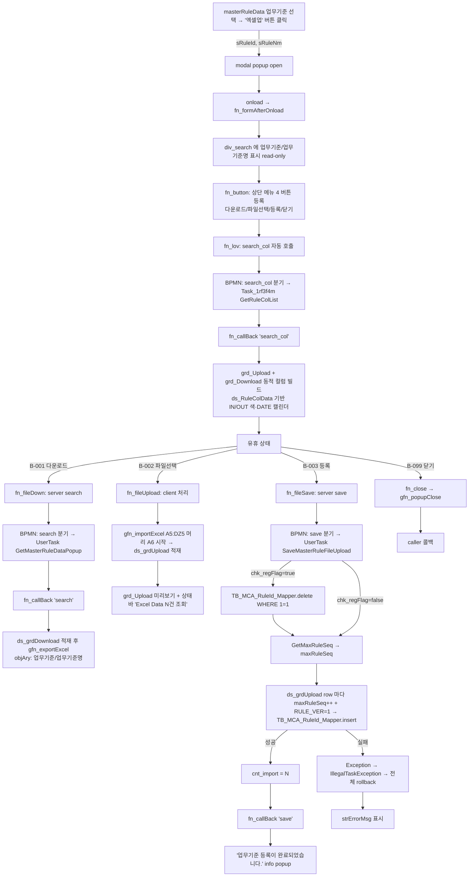

# masterRuleDataUploadFilePopup 기능설계서

> 단일 원천: `masterRuleDataUploadFilePopup_분석리포트.md`. 본 문서는 분석리포트의 §1~§14 를 기능 관점으로 재구성한 To-Be 명세.

## §1. 화면 개요 + 호출 컨텍스트

### 1.1 화면 식별

| 항목 | 값 |
|---|---|
| 화면 식별자 | masterRuleDataUploadFilePopup |
| As-Is | MasterRuleDataUploadFilePopup (일반 업무기준 등록(Excel Upload)) |
| 화면 유형 | **modal popup** (단독 진입 불가 — 부모 masterRuleData 의 자식) |
| 모듈 / 그룹 | mcm (공통관리) / cmb (업무기준 관리(원장)) |
| 메뉴 계층 | 공통관리 > 업무기준 관리(원장) > 일반 업무기준 등록(Excel Upload) |
| BPMN process | MasterRuleDataUploadFilePopup (`services/cmb/MasterRuleDataUploadFilePopup.bpmn:3`) |
| Service ID | masterRuleDataUploadFilePopup |

### 1.2 비즈니스 목적

선택된 **업무기준 (RULE_ID)** 의 실데이터를 **Excel 일괄 등록** 하기 위한 보조 팝업. 부모 화면(masterRuleData)에서 업무기준이 선택된 상태로 호출되며, 팝업 진입 시 업무기준 컬럼정의(`search_col`)를 자동 조회하여 업로드/다운로드 그리드의 컬럼을 **런타임 동적 구성**한다. 사용자가 Excel 파일을 골라 미리 본 후 "등록" 버튼을 누르면 서버는 동적 테이블 `TB_MCA_<업무기준ID>` 에 (선택적으로) 기존 row 를 전체 삭제하고 Excel 의 모든 row 를 `RULE_VER`/`RULE_SEQ` 부여하여 일괄 INSERT 한다. 부수적으로 현재 등록된 row 를 **Excel 다운로드** 하는 기능도 제공한다.

### 1.3 호출 컨텍스트 (P-001 단일 호출원)

| 항목 | 값 | 근거 |
|---|---|---|
| 호출 화면 | masterRuleData (As-Is: MasterRuleData — 업무기준 Data관리) | MasterRuleData.xfdl:722 |
| 호출 트리거 | "엑셀업" 버튼 (btn_excelUp) — `fn_excelUp` | MasterRuleData.xfdl:716-723 |
| 호출 모드 | modal (`gfn_openPopup("modal", "업무기준 등록", "cmb::MasterRuleDataUploadFilePopup.xfdl", ...)`) | MasterRuleData.xfdl:722 |
| 사전 조건 | 부모 화면에서 업무기준이 선택되어 있어야 함 (`edt_ruleId.value` null 시 즉시 return) | MasterRuleData.xfdl:718 |
| 전달 파라미터 (in) | `sRuleId` = 선택된 업무기준ID, `sRuleNm` = 업무기준명 | MasterRuleData.xfdl:719-720 |
| 콜백 함수 | fn_returnMasterRuleDataUploadFilePopupCallBack | MasterRuleData.xfdl:722, :726 |
| 반환값 (out) | (현행 As-Is: 사용 안 함 — rtVal null 검사 후 return) | MasterRuleData.xfdl:726-729 |

## §2. 화면 흐름도

### 2.1 mermaid

### 2.2 트랜잭션 경계 요약

| 영역 | 트랜잭션 | 비고 |
|---|---|---|
| T-003 자동 컬럼정의 조회 | 1 SELECT (read-only) | 트랜잭션 의미 없음 — onload 시 자동 |
| B-001 다운로드 | 1 SELECT (read-only) | 트랜잭션 의미 없음 |
| B-002 파일선택 | (server 호출 없음) | 100% client side |
| B-003 등록 | 1 트랜잭션: 선 DELETE (조건부) + GetMaxRuleSeq + N INSERT 모두 atomic | row 1 개라도 실패 시 전체 rollback |

## §3. 조회 기능

### 3.1 호출자 파라미터 수신 + 컬럼정의 자동 조회 (fn_formAfterOnload)

| 단계 | 동작 | 근거 (xfdl) |
|---|---|---|
| 1 | `this.sRuleId = this.gfn_Data_Return("sRuleId", this.name);` | xfdl:126 |
| 2 | `this.sRuleNm = this.gfn_Data_Return("sRuleNm", this.name);` | xfdl:127 |
| 3 | sRuleId null 아니면 `div_search.form.edt_MasterRuleId.set_value(sRuleId)` | xfdl:129-131 |
| 4 | (동일 가드 `!isNull(sRuleId)`) `edt_MasterRuleNm.set_value(sRuleNm)` | xfdl:132-134 (가드 조건이 sRuleId 로 비교됨 — F-101 잠재 결함) |
| 5 | `this.fn_button()` 호출 | xfdl:135 |
| 6 | `this.fn_lov()` 호출 → search_col 으로 그리드 동적 컬럼 즉시 구성 | xfdl:136 |

> **F-101**: xfdl:132 의 if 가드는 `this.sRuleId` 를 검사하나 set_value 대상은 `edt_MasterRuleNm` (sRuleNm 값). sRuleId 가 null 이면 sRuleNm 이 있어도 채워지지 않음. 호출자(부모)는 항상 둘 다 함께 전달하므로 실 영향 미미. To-Be 가드 분리 권고.

### 3.2 컬럼정의 자동 조회 (T-003 fn_lov — search_col)

| 단계 | 동작 | 근거 |
|---|---|---|
| 1 | `this.ds_RuleColData.clearData()` | xfdl:155 |
| 2 | `sSvcID="search_col"`, `sUrl="cmb::MasterRuleDataUploadFilePopup"`, `sInDatasets=""`, `sOutDatasets="ds_RuleColData=ds_GetRuleColUploadList"` | xfdl:157-160 |
| 3 | `sArgument = gfn_setParam("pRuleId", div_search.form.edt_MasterRuleId.value)` | xfdl:161 |
| 4 | grd_Download / grd_Upload `set_enableredraw(false)` (성능) | xfdl:164-165 |
| 5 | `gfn_transaction(...)` 호출 (콜백 = `fn_callBack`) | xfdl:167 |
| 6 | BPMN exclusiveGateway "search_col" 분기 → Task_1rf3f4m (CommonSelectTask) → `MasterRuleDataUploadFilePopupMapper.GetRuleColList` | bpmn:60 / bpmn:53 |
| 7 | 콜백 case "search_col" (nErrorCode==0): 상태바 "{건수}건 조회 되었습니다." + grd_Upload 동적 컬럼 빌드 (xfdl:261-273) + grd_Download 동적 컬럼 빌드 (xfdl:276-291) + 양 그리드 enableredraw(true) | xfdl:255-299 |

### 3.3 다운로드 (B-001 fn_fileDown — search)

| 단계 | 동작 | 근거 |
|---|---|---|
| 1 | `sSvcID="search"`, `sUrl="cmb::MasterRuleDataUploadFilePopup"`, `sInDatasets=""`, `sOutDatasets="ds_grdDownload=ds_GetRuleDataUploadList"` | xfdl:173-176 |
| 2 | `sArgument = gfn_setParam("pTable", "TB_MCA_"+this.sRuleId)` | xfdl:177 |
| 3 | `ds_grdUpload.clear()` + `ds_grdDownload.clearData()` 초기화 | xfdl:180-181 |
| 4 | `gfn_transaction(...)` 호출 (콜백 = `fn_callBack`) | xfdl:184 |
| 5 | BPMN exclusiveGateway "search" 분기 → UserTask_1j7375k (`GetMasterRuleDataPopup`) → `MasterRuleDataUploadFilePopupMapper.GetMasterRuleDataList` | bpmn:22 / bpmn:39 |
| 6 | 결과 row → context["ds_GetRuleDataUploadList"] → ds_grdDownload | java(Get):29-31 |
| 7 | 콜백 case "search" (nErrorCode==0): 상태바 "{건수}건 조회 되었습니다." (xfdl:227), objAry 에 업무기준/업무기준명 추가 (xfdl:246-248), `gfn_exportExcel(grd_Download, titletext, objAry)` (xfdl:249) | xfdl:225-253 |

### 3.4 SQL 명세

| SQL | WHERE / 동적 | 반환 | dataset 적재 |
|---|---|---|---|
| #1 GetRuleColList (Mapper.xml:7-29) | `RMASTER.RULE_ID = RCLIST.RULE_ID` + (pRuleId != null → `AND RMASTER.RULE_ID = #{pRuleId}`) / ALL_CONS_COLUMNS PK 판정 | RULE_ID/COL_SEQ/COL_ID/COL_NM/COL_LEN/MES_COL_ID/CODE_YN/PK_YN/COL_TYPE/IO_FLAG (9 컬럼) | ds_RuleColData (6 컬럼 선언) |
| #2 GetMasterRuleDataList (Mapper.xml:31-34) | `SELECT * FROM MCA_SOURCE.${pTable}` (전건) | 동적 (업무기준 컬럼 전체) | ds_grdDownload (동적 컬럼) |
| #3 GetMaxRuleSeq (Mapper.xml:36-39) | `SELECT NVL(MAX(RULE_SEQ),0) FROM MCA_SOURCE.${pTable}` | RULE_SEQ (max) | (Save 채번 — Q-103: Save 는 부모 매퍼 호출) |

## §4. CRUD 기능 (파일 일괄 등록 — B-002 파일선택 + 미리보기 + B-003 일괄 INSERT)

### 4.1 파일 선택 (B-002 fn_fileUpload)

| 단계 | 동작 | 근거 |
|---|---|---|
| 1 | `this.ds_grdUpload.clear()` (dataset row + 동적 컬럼 메타 초기화) | xfdl:190 |
| 2 | `gfn_importExcel(div_main.form.grd_Upload, "일반업무기준등록(ExcelUpload)", "A5:DZ5", "A6", ds_grdUpload, "fn_callImportBack")` | xfdl:192 |
| 3 | 콜백 `fn_callImportBack`: 상태바에 "Excel Data {ds_grdUpload.getRowCount()}건 조회 되었습니다." 표시 | xfdl:195-203 |

### 4.2 gfn_importExcel 파라미터 의미

| 파라미터 | 값 | 해석 |
|---|---|---|
| grid | div_main.form.grd_Upload | 미리보기 그리드 (동적 컬럼) |
| sheetName | "일반업무기준등록(ExcelUpload)" | 시트명/파일 식별자 (구현체 의존) |
| headerRange | "A5:DZ5" | Excel 헤더 행 (A5~DZ5 = 최대 130 컬럼 — 동적 컬럼 폭 대응) |
| dataStart | "A6" | 데이터 시작 셀 |
| dataset | ds_grdUpload | 적재 대상 (search_col 으로 동적 컬럼 사전 구성됨) |
| callback | fn_callImportBack | 적재 완료 콜백 |

> **헤더 컬럼 매핑**: Excel 헤더(A5~)는 `search_col` 으로 빌드된 동적 컬럼(COL_ID/COL_NM)과 매칭. 컬럼 개수·이름은 업무기준별로 가변. masterCodeUploadFilePopup(고정 6 컬럼)과 달리 본 화면은 동적.

### 4.3 등록 (B-003 fn_fileSave)

| 단계 | 동작 | 근거 |
|---|---|---|
| 1 | `sSvcID="save"`, `sUrl=""`, `sInDatasets="ds_RuleColData=ds_RuleColData ds_grdUpload=ds_grdUpload"`, `sOutDatasets="ds_grdDownload=ds_GetRuleDataUploadList"` | xfdl:208-211 |
| 2 | `sArgument = gfn_setParam("pRuleId", this.sRuleId) + gfn_setParam("pTable", "TB_MCA_"+this.sRuleId) + gfn_setParam("pRegFlag", div_search.form.chk_regFlag.value)` | xfdl:212-214 |
| 3 | `gfn_transaction(...)` 호출 — sUrl 빈 문자열 시 sSvcID 기반 라우팅 (oasis 표준, 본 화면 BPMN process id 매칭) | xfdl:217 |
| 4 | BPMN exclusiveGateway "save" 분기 → UserTask_09dxtkf (`SaveMasterRuleFileUpload`) | bpmn:33 / bpmn:27 |
| 5 | UserTask 본문: §4.4 참조 | java:20-92 |
| 6 | 콜백 case "save" (nErrorCode==0): 상태바 "{cnt_import}건 저장 되었습니다." (xfdl:303), `ds_grdDownload.clearData()` (xfdl:304), `ds_grdUpload.clearData()` (xfdl:305), `gfn_message("", "", "업무기준 등록이 완료되었습니다.", "info", "", "")` (xfdl:306) | xfdl:301-310 |
| 7 | 콜백 case "save" (nErrorCode!=0): 상태바 strErrorMsg 표시 (xfdl:308) | - |

### 4.4 서버 트랜잭션 (SaveMasterRuleFileUpload)

| 단계 | 동작 | 근거 (java) |
|---|---|---|
| S1 | log 시작 | java:23 |
| S2 | `TransactionalDao dao = context.getDao();` | java:26 |
| S3 | context 에서 `pRuleId` / `pTable` / `pRegFlag` 추출 | java:28-30 |
| S4 | context 에서 `ds_grdUpload` / `ds_RuleColData` 를 `ArrayList<HashMap>` 캐스팅 | java:32-33 |
| S5 | `typeDiv` Map 구성 (ds_RuleColData 의 COL_ID → COL_TYPE) | java:35-38 |
| S6 | cnt = 0 / getMap / setMap 선언 | java:42-44 |
| S7 (조건부 선삭제) | `if(pRegFlag.equals("true"))`: param.put(MYBATIS_WHERE, "1 = 1") → `dao.delete(pTable+"_Mapper.delete", param)` (전건 삭제) | java:46-53 |
| S8 (채번) | `getMap.put("pTable", pTable)` → `maxRuleSeq = Integer.parseInt(dao.selectOne("MasterRuleDataMapper.GetMaxRuleSeq", getMap))` | java:55-57 (부모 매퍼 — Q-103) |
| S9 (반복 INSERT) | for(i=0; i<ds_grdUpload.size(); i++): maxRuleSeq++ → ds_grdUpload[i] key 순회 (COL_TYPE=="DATE" 면 `-` 제거 + 14자 절단) → setMap put → RULE_VER="1" / RULE_SEQ=maxRuleSeq → `dao.insert(pTable+"_Mapper.insert", setMap)` ≤0 이면 throw Exception else cnt++ | java:60-82 |
| S10 | `CommonDaoUtil.addDaoResultIntoContext(context, "cnt_import", cnt, null, true)` | java:84 |
| S11 | return null (정상) | java:86 |
| S12 (예외) | catch Exception → log → throw new IllegalTaskException(e) → BPMN 전체 rollback | java:87-91 |

## §5. 버튼 액션 (4 enum)

| ID | 버튼명 | 핸들러 | sSvcID | server call | 변경 dataset | 후처리 |
|---|---|---|---|---|---|---|
| B-001 | 다운로드 | fn_fileDown | "search" | Y (BPMN search → SELECT) | ds_grdDownload (write) | gfn_exportExcel |
| B-002 | 파일선택 | fn_fileUpload | (없음 — client) | N | ds_grdUpload (write, client) | 상태바 메시지 |
| B-003 | 등록 | fn_fileSave | "save" | Y (BPMN save → UserTask DELETE/INSERT) | ds_grdDownload/ds_grdUpload (모두 clearData on success) | gfn_message info |
| B-099 | 닫기 | fn_close | - | N | - | gfn_popupClose |
| (T-003) | (자동 컬럼정의) | fn_lov | "search_col" | Y (BPMN search_col → SELECT) | ds_RuleColData + 그리드 동적 컬럼 | enableredraw(true) |

## §6. 비즈니스 룰

### 6.1 입력 검증 (R-101 ~)

| 규칙 ID | 규칙 | 단계 | 근거 | 비고 |
|---|---|---|---|---|
| R-101 | 호출 사전 조건: 부모가 업무기준ID(sRuleId)/명(sRuleNm) 둘 다 전달해야 함 | (호출자) | MasterRuleData.xfdl:716-722 | 본 popup 안에서 검증 없음 — 부모가 업무기준 미선택 시 호출 자체 차단 (MasterRuleData.xfdl:718) |
| R-102 | edt_MasterRuleId / edt_MasterRuleNm 는 read-only | UI | xfdl:73, 75 | 사용자가 본 popup 안에서 업무기준 변경 불가 |
| R-103 | 진입 시 컬럼정의 자동 조회(search_col) → 그리드 동적 컬럼 구성. Excel 헤더는 동적 컬럼과 매칭 | 조회 | xfdl:136, 154-168 / 255-299 | masterCodeUploadFilePopup(고정 컬럼)과 달리 동적 |
| R-104 | B-001 다운로드: ds_grdUpload 와 무관하게 항상 `TB_MCA_`+sRuleId 로 서버 조회 | 조회 | xfdl:177 | sRuleId null/empty 시 잘못된 테이블명 → 오류. 검증 없음 (현행 As-Is). |
| R-105 | B-002 파일선택: client 측 Excel 헤더 = "A5:DZ5" / 데이터 = "A6" 부터 | 파일 처리 | xfdl:192 | Excel 행 6 부터 모두 적재 + **To-Be cell type 방어 보강** |
| R-106 | B-003 등록: ds_grdUpload 0 건이어도 호출 가능 — server 는 빈 ArrayList 로 처리 | 저장 | java:60 (for 0 iter) | **확정(Q-102, 2026-06-05): 삭제등록(chk_regFlag) 시 ① 사전 confirm 메시지, ② 미리보기(ds_grdUpload) 빈 상태에서는 전건삭제 차단 가드 (무경고 전체삭제 방지)** |
| R-107 | B-003 등록 시 chk_regFlag=true → 본 테이블 전건 선삭제(`WHERE 1=1`) → INSERT | 저장 | java:46-53 | atomic — 어떤 row INSERT 실패해도 전체 rollback |
| R-108 | B-003 등록 시 chk_regFlag=false → 선삭제 없이 INSERT 만 → PK (RULE_VER+RULE_SEQ) 충돌 위험은 낮음(RULE_SEQ 채번) — 단 동적 컬럼 PK 충돌 시 실패 → 전체 rollback | 저장 | java:47 (조건 false) | F-105 |
| R-109 | INSERT 시 RULE_VER 항상 "1" 고정, RULE_SEQ = maxRuleSeq+1 채번 | 저장 | java:75-76 | F-103 |
| R-110 | COL_TYPE=="DATE" 인 컬럼 값은 `-` 제거 후 14자 절단하여 INSERT | 저장 | java:69-72 | yyyyMMddHHmmss 형식 정규화 |
| R-111 | B-003 등록 성공 시 ds_grdDownload / ds_grdUpload 모두 clearData | 후처리 | xfdl:304-305 | grid 가시 row 사라짐 — 완료 시각 신호 |

### 6.2 중복 처리

- **chk_regFlag=true**: 본 테이블의 기존 모든 row 가 삭제(`WHERE 1=1`)되므로 PK 중복 불가능. Excel 내부 PK 중복만 위험 — RULE_SEQ 가 루프마다 채번되므로 PK(RULE_VER,RULE_SEQ) 충돌은 발생하지 않으나, 업무기준 고유 컬럼에 UNIQUE 제약이 있으면 그 위반 시 두 번째 INSERT 에서 실패 → 전체 rollback.
- **chk_regFlag=false**: 기존 row 유지 + 추가 INSERT. RULE_SEQ 는 maxRuleSeq 기반 채번이라 PK 충돌은 낮으나, 동적 컬럼의 업무 고유키 충돌 시 실패 → 전체 rollback.

### 6.3 오류 row 처리

| 케이스 | 처리 |
|---|---|
| 1 row INSERT 실패 (dao.insert ≤ 0) | 전체 rollback (atomic) — **To-Be 오류 row index 포함 메시지** (F-101) |
| Excel cell 값 cast | java:67 `!=null?...toString():""` null-safe — 단 number 셀 import 시 형식 검증은 To-Be 보강 |
| chk_regFlag=true + Excel 0 row | **확정(Q-102): To-Be 는 미리보기 빈 상태 시 전건삭제 차단(가드) — DELETE 미수행 + 안내 메시지. 데이터 있을 때만 confirm 후 진행** |

## §7. 상태값 (ST-NNN)

본 화면은 workflow state 가 없음 — 단순 등록/삭제. chk_regFlag 는 trigger flag 이지 상태 enum 이 아님.

| ID | 상태값 | 표시명 | 영향 | 근거 |
|---|---|---|---|---|
| ST-001 | chk_regFlag = true | 삭제등록 ON | fn_fileSave 시 본 테이블 전건 DELETE 수행 | xfdl:77 / java:47 |
| ST-002 | chk_regFlag = false (또는 null) | 삭제등록 OFF | fn_fileSave 시 INSERT 만 수행 | xfdl:77 / java:47 |
| ST-003 | IO_FLAG = IN | 입력 컬럼 (그리드 셀 red) | 동적 컬럼 cssclass cellBody_BgColor_red | xfdl:271, 289 |
| ST-004 | IO_FLAG = OUT | 출력 컬럼 (그리드 셀 blue) | 동적 컬럼 cssclass cellBody_BgColor_blue | xfdl:271, 289 |

## §8. 권한 / 접근 제어

### 8.1 As-Is

- xfdl / java / bpmn / mapper 어디에도 명시적 권한 체크 코드 없음.
- 본 popup 호출 권한 = 부모 (masterRuleData) 의 화면 접근 권한에 종속.
- 따라서 masterRuleData 접근 가능 = 본 popup 접근 가능 = 일괄 등록 가능.

### 8.2 To-Be 권한 — 외부 권한 프로세스 위임 (가족 정합)

| 권한 ID | 영역 | 후보 |
|---|---|---|
| AUTH-001 | popup 진입 | (a) caller(masterRuleData)의 화면 권한 위임 / (b) 별도 권한 분리 |
| AUTH-002 | B-001 다운로드 | (a) 조회권 / (b) 별도 |
| AUTH-003 | B-003 등록 | (a) 등록권 + (b) chk_regFlag=true 시 추가 권한 (= 일괄 삭제 권한) |

## §9. 팝업 / 연계 화면 (호출 화면 역참조 — §1.3 참조)

| P-NNN | 호출 화면 | 트리거 | 반환 |
|---|---|---|---|
| P-001 | masterRuleData (As-Is: MasterRuleData) | "엑셀업" 버튼 (업무기준 선택 후) | rtVal 미사용 |

> 본 popup 이 다른 popup 을 호출하는 케이스는 없음 (xfdl 안에서 openPopup 호출 ✗).

## §10. 메시지 / 알림

### 10.1 As-Is 메시지 전수 (xfdl 인용)

| ID | 트리거 | 표시 위치 | 본문 | 종류 | 근거 |
|---|---|---|---|---|---|
| M-001 | fn_callImportBack (B-002 후) | div_bottom 상태바 (`gfn_commonBottomStatus_msg`) | "Excel Data {N}건 조회 되었습니다." | info | xfdl:202 |
| M-002 | fn_callBack case "search" 성공 | div_bottom 상태바 | "{N}건 조회 되었습니다." (`strErrorMsg["ds_GetRuleDataUploadList"]` + " 건 조회 되었습니다.") | info | xfdl:227 |
| M-003 | fn_callBack case "search" 실패 | div_bottom 상태바 | strErrorMsg (서버 메시지) | error | xfdl:251 |
| M-004 | fn_callBack case "search_col" 성공 | div_bottom 상태바 | "{N}건 조회 되었습니다." (`strErrorMsg["ds_GetRuleColUploadList"]`) | info | xfdl:258 |
| M-005 | fn_callBack case "search_col" 실패 | div_bottom 상태바 | strErrorMsg | error | xfdl:297 |
| M-006 | fn_callBack case "save" 성공 (상태바) | div_bottom 상태바 | "{cnt_import}건 저장 되었습니다." | info | xfdl:303 |
| M-007 | fn_callBack case "save" 성공 (모달) | gfn_message (`info` 모달) | "업무기준 등록이 완료되었습니다." | info modal | xfdl:306 |
| M-008 | fn_callBack case "save" 실패 | div_bottom 상태바 | strErrorMsg | error | xfdl:308 |

### 10.2 To-Be 추가 메시지 (분석가 권고)

| ID | 시점 | 본문 후보 | 종류 |
|---|---|---|---|
| MT-001 | B-001 호출 전 sRuleId null 시 | "업무기준이 지정되지 않았습니다." | warning |
| MT-002 | B-003 호출 전 ds_grdUpload 0 건 + chk_regFlag=true 시 | "Excel 데이터가 없습니다. 본 업무기준의 모든 데이터가 삭제됩니다. 계속하시겠습니까?" | confirm (Q-102) |
| MT-003 | B-003 INSERT 실패 시 | "{row index}행 등록 실패 — {원인}" | error (F-101) |
