# mcm / csa 시스템관리 — 메뉴·권한 ERD

- 작성일: 2026-09-04
- 근거: `src/backend/data/mcm.db` 실측 스키마 + `mcm-core` 엔티티 + `SecUserService` / `SecMenuNativeRepository` / `DataInitializer`
- 대상 화면: `commMenuMng`(메뉴 관리) · `commObjMng`(OBJECT 관리) · `commRoleMng`(역할 관리) · `commRoleGrpMng`(역할 그룹) · `commPermMng`(권한) · `commUserMng`(사용자)

> **audit 9 컬럼**(`C_USR_ID` / `C_AT` / `C_SVC_ID` / `C_PGM_ID` / `U_USR_ID` / `U_AT` / `U_SVC_ID` / `U_PGM_ID` / `VER`)은
> 모든 테이블에 cactus-core `CactusAuditEntity` 로 자동 적용된다. 아래 다이어그램에서는 생략한다.

## 1. 먼저 알아야 할 것 두 가지

**① 메뉴 트리는 테이블 두 개로 쪼개져 있다.** 이게 이 스키마에서 제일 헷갈리는 부분이다.

| 테이블 | 담는 것 | 실측 |
|---|---|---|
| `TB_MCM_SEC_MENU_FLD` | **폴더만** (모듈 루트 + 그룹) | 8행 — `mcm` `cma` `cmb` `cme` `cmz` `csa` `analog` `anl` |
| `TB_MCM_SEC_MENU` | **화면(leaf)만** | 21행 — **21행 전부 `OBJECT_ID` 보유** |

`TB_MCM_SEC_MENU.PARENT_MENU_ID` 는 같은 테이블이 아니라 **`TB_MCM_SEC_MENU_FLD.MENU_ID` 를 가리킨다.**
실측 distinct 값이 `cma / csa / cme / cmb / cmz / anl` 로 전부 FLD 쪽 ID다. 폴더 계층(모듈→그룹)은
`TB_MCM_SEC_MENU_FLD.PARENT_MENU_ID` 자기참조로 이어진다. 2026-06-02 (R3) 에 분리된 구조다.

**② 물리 FK 제약이 하나도 없다.** `mcm-core` 엔티티에 `@ManyToOne` / `@OneToMany` / `@JoinColumn` 이 **0건**이다
(JPA 연관관계 금지 정책). 아래 관계선은 전부 **논리 FK** 이며, 조인은 native query 나 Java 코드가 수행한다.
따라서 DB 가 참조무결성을 지켜주지 않는다 — 예를 들어 `OBJECT_ID` 를 지워도 `TB_MCM_SEC_MENU` 행은 남는다.

## 2. ERD

```mermaid
erDiagram
    TB_MCM_SEC_MENU_FLD ||--o{ TB_MCM_SEC_MENU_FLD : "PARENT_MENU_ID (자기참조 · 모듈→그룹)"
    TB_MCM_SEC_MENU_FLD ||--o{ TB_MCM_SEC_MENU : "PARENT_MENU_ID (폴더→화면)"
    TB_MCM_SEC_OBJ      ||--o| TB_MCM_SEC_MENU : "OBJECT_ID (화면 실체)"

    TB_MCM_SEC_OBJ  ||--o{ TB_MCM_SEC_ROLE_MAPPING : "OBJECT_ID"
    TB_MCM_SEC_PERM ||--o{ TB_MCM_SEC_ROLE_MAPPING : "PERMISSION_ID"
    TB_MCM_SEC_ROLE ||--o{ TB_MCM_SEC_ROLE_MAPPING : "ROLE_ID"

    TB_MCM_SEC_ROLEGROUP ||--o{ TB_MCM_SEC_ROLEGROUP_MAPPING : "ROLE_GROUP_ID"
    TB_MCM_SEC_ROLE      ||--o{ TB_MCM_SEC_ROLEGROUP_MAPPING : "ROLE_ID"
    TB_MCM_SEC_ROLEGROUP ||--o{ TB_MCM_SEC_USER_MAPPING : "ROLE_GROUP_ID"
    TB_MCM_SEC_USER      ||--o{ TB_MCM_SEC_USER_MAPPING : "USER_ID"
    TB_MCM_SEC_USER      ||--|| TB_MCM_SEC_USER_PWD : "USER_ID"

    TB_MCM_SEC_MENU_FLD ||--o{ TB_MCM_SEC_ROLE : "MENU_ID (역할 기본 진입 메뉴)"

    TB_MCM_SEC_USER              ||--o{ TB_MCM_SEC_USER_FAVORITE : "USER_ID"
    TB_MCM_SEC_MENU              ||--o{ TB_MCM_SEC_USER_FAVORITE : "MENU_ID"
    TB_MCM_SEC_USER_FAVORITE_FOLD ||--o{ TB_MCM_SEC_USER_FAVORITE : "FVT_FOLD_ID"
    TB_MCM_SEC_USER              ||--o{ TB_MCM_SEC_USER_FAVORITE_FOLD : "USER_ID"
    TB_MCM_SEC_USER              ||--o{ TB_MCM_SEC_USER_START_PGM : "USER_ID"
    TB_MCM_SEC_MENU              ||--o{ TB_MCM_SEC_USER_START_PGM : "MENU_ID"

    TB_MCM_SEC_MENU_FLD {
        varchar30 MENU_ID PK "폴더 ID (모듈 루트 또는 그룹)"
        varchar30 PARENT_MENU_ID FK "상위 폴더 · 모듈 루트는 NULL"
        varchar100 MENU_NM "폴더명"
        varchar30 MENU_SEQ "형제 정렬 (8자리 0 LPAD)"
        numeric FULL_SEQ "7자리 인코딩 · 저장 시 자동 재계산"
        varchar1 USE_TP "사용 여부"
        varchar1 MENU_VIEW_YN "사이드바 표시 Y/N · NULL=표시"
        varchar20 MENU_TP "메뉴 유형"
        varchar10 BIZ_SYSTEM_CODE "To-Be 폐기 · DDL 만 잔존"
    }

    TB_MCM_SEC_MENU {
        varchar30 MENU_ID PK "화면 메뉴 ID (= OBJECT_ID 관행)"
        varchar30 PARENT_MENU_ID FK "소속 그룹 폴더 → SEC_MENU_FLD"
        varchar50 OBJECT_ID FK "화면 실체 → SEC_OBJ"
        varchar300 MENU_NM "화면명"
        varchar30 MENU_SEQ "형제 정렬"
        varchar30 FULL_SEQ "7자리 인코딩"
        varchar10 MENU_TP "메뉴 유형"
        varchar1 MENU_VIEW_YN "사이드바 표시 Y/N"
        varchar1 USE_TP "사용 여부"
        varchar1000 MENU_DESC "설명"
        varchar300 MENU_PARAM1 "화면 파라미터 1"
        varchar300 MENU_PARAM2 "화면 파라미터 2"
        varchar300 MENU_PARAM3 "화면 파라미터 3"
        varchar255 START_ACTIVE_DATE "유효 시작"
        varchar255 END_ACTIVE_DATE "유효 종료"
    }

    TB_MCM_SEC_OBJ {
        varchar50 OBJECT_ID PK "화면 식별자 (= screenId = serviceId)"
        varchar100 OBJECT_NM "화면명"
        varchar10 SYSTEM_CODE "소속 모듈 · FE moduleId 가 된다 (mcm/mls/analog)"
        varchar10 OBJECT_TYPE "web 등"
        varchar1 USE_TP "사용 여부"
        varchar10 ACCESS_TP "내부/외부"
        varchar100 FORM_URL "화면 경로"
        varchar100 SERVICE "서비스명"
        varchar150 PARAM "파라미터"
        varchar300 PROGRAM_DESC "프로그램 설명"
        varchar150 OUT_ACCESS_IP "외부 접속 주소"
        varchar255 START_ACTIVE_DATE "유효 시작"
        varchar255 END_ACTIVE_DATE "유효 종료"
    }

    TB_MCM_SEC_ROLE_MAPPING {
        varchar50 OBJECT_ID PK "복합 PK 1 → SEC_OBJ"
        varchar100 PERMISSION_ID PK "복합 PK 2 → SEC_PERM"
        varchar30 ROLE_ID PK "복합 PK 3 → SEC_ROLE"
    }

    TB_MCM_SEC_PERM {
        varchar100 PERMISSION_ID PK "권한 ID (PERM_ALL 등)"
        varchar100 PERMISSION_NM "권한명"
        varchar2000 PERMISSION_ACTION "허용 action 콤마 목록 (search,save,delete...)"
        varchar1000 POPUP_BTN "팝업 버튼 제어"
        varchar500 PERMISSION_COMMON "공통 버튼 제어"
        varchar500 PERMISSION_CUSTOM "커스텀 버튼 제어"
        varchar300 PERMISSION_DESC "설명"
        varchar1 USE_TP "사용 여부"
    }

    TB_MCM_SEC_ROLE {
        varchar30 ROLE_ID PK "역할 ID (SYSADMIN 등)"
        varchar100 ROLE_NM "역할명"
        varchar30 MENU_ID FK "기본 진입 메뉴 → SEC_MENU_FLD"
        varchar30 PARENT_ROLE_ID "상위 역할 (본 화면 미사용)"
        varchar300 ROLE_DESC "설명"
        varchar1 USE_TP "사용 여부"
    }

    TB_MCM_SEC_ROLEGROUP {
        varchar30 ROLE_GROUP_ID PK "역할 그룹 ID"
        varchar100 ROLE_GROUP_NM "역할 그룹명"
        varchar300 ROLE_GROUP_DESC "설명"
        varchar1 USE_TP "사용 여부"
    }

    TB_MCM_SEC_ROLEGROUP_MAPPING {
        varchar30 ROLE_GROUP_ID PK "복합 PK 1"
        varchar30 ROLE_ID PK "복합 PK 2"
    }

    TB_MCM_SEC_USER {
        varchar30 USER_ID PK "사용자 ID"
        varchar30 USER_NM "성명"
        varchar10 USER_EMP_NO "사번"
        varchar10 DEPT_CD "부서 코드"
        varchar1 USE_TP "사용 여부"
        varchar1 IN_OUT_EMP_TP "내부/외부"
        bigint PWD_FAIL_COUNT "비밀번호 실패 횟수"
        varchar30 SSO_ID "SSO ID"
        varchar20 THEME_TP "테마"
    }

    TB_MCM_SEC_USER_MAPPING {
        varchar30 ROLE_GROUP_ID PK "복합 PK 1"
        varchar100 USER_ID PK "복합 PK 2"
    }

    TB_MCM_SEC_USER_PWD {
        varchar30 USER_ID PK "→ SEC_USER"
        varchar200 USER_ENC_PWD "BCrypt 해시"
        varchar255 LAST_PWD_CHNG_DATE "최종 변경일"
    }

    TB_MCM_SEC_USER_FAVORITE {
        varchar200 FULL_ID PK "복합 PK 1"
        varchar30 FVT_FOLD_ID PK "복합 PK 2 → FAVORITE_FOLD"
        varchar30 MENU_ID PK "복합 PK 3 → SEC_MENU"
        integer MENU_SEQ PK "복합 PK 4"
        varchar30 USER_ID PK "복합 PK 5 → SEC_USER"
        integer FVT_SEQ "즐겨찾기 정렬"
    }

    TB_MCM_SEC_USER_FAVORITE_FOLD {
        varchar10 FVT_FOLD_ID PK "복합 PK 1"
        varchar30 USER_ID PK "복합 PK 2 → SEC_USER"
        varchar30 FVT_FOLD_NM "폴더명"
        integer FVT_FOLD_SEQ "정렬"
    }

    TB_MCM_SEC_USER_START_PGM {
        varchar30 USER_ID PK "복합 PK 1 → SEC_USER"
        varchar200 FULL_ID PK "복합 PK 2 componentPath"
        varchar30 MENU_ID PK "복합 PK 3 → SEC_MENU"
        integer MENU_SEQ PK "복합 PK 4"
        integer START_SEQ "여는 순서(기본 화면)"
    }
```

## 3. 메뉴가 화면에 뜨기까지 — 권한 해석 체인

로그인한 사용자에게 사이드바 메뉴가 보이는 경로다. `SecUserService.filterMenusByRole` 이 정본이다.

```mermaid
flowchart LR
    U["SEC_USER<br/>admin"] --> UM["SEC_USER_MAPPING"]
    UM --> RG["SEC_ROLEGROUP<br/>ROLE_GROUP_SYSADMIN"]
    RG --> RGM["SEC_ROLEGROUP_MAPPING"]
    RGM --> R["SEC_ROLE<br/>SYSADMIN"]
    R --> RM["SEC_ROLE_MAPPING<br/>ROLE x OBJECT x PERM"]
    RM --> O["SEC_OBJ<br/>허용 OBJECT_ID 집합"]
    O --> M["SEC_MENU<br/>OBJECT_ID 매칭 leaf"]
    M --> F["SEC_MENU_FLD<br/>조상 폴더 역추적"]
    F --> TREE["사이드바 트리"]
```

단계별로 무슨 일이 일어나는지:

1. `resolveRoleIds(userId)` — 사용자 → 역할그룹 → 역할 집합을 구한다.
2. `secRoleMappingRepository.findByRoleIdIn(roleIds)` — 그 역할들이 가진 **허용 `OBJECT_ID` 집합**을 만든다.
3. `TB_MCM_SEC_MENU` 를 훑어 `OBJECT_ID` 가 허용 집합에 있는 **leaf 를 visible 로 표시**한다.
4. 그 leaf 의 `PARENT_MENU_ID` 를 타고 **조상 폴더를 위로 역추적**해 함께 visible 로 만든다.
   → 보이는 화면이 하나도 없는 폴더는 트리에 나타나지 않는다.
5. `MENU_VIEW_YN='N'` 인 폴더/화면은 사이드바에서 숨긴다 (`cmz` 팝업 그룹이 이 방식이다).
   **`NULL` 은 숨김이 아니라 표시**로 취급한다.

> **`sysadmin-freepass`** — `mcm.security.sysadmin-freepass=true` 면 SYSADMIN 이 2~4 단계를 건너뛰고
> 전체 메뉴를 통과한다. 기본값은 `false` 라 SYSADMIN 도 `TB_MCM_SEC_ROLE_MAPPING` 멤버십으로 판정된다
> (2026-07-30 순수 RBAC 전환). **신규 화면을 만들고 메뉴에 걸었는데 안 보이면 여기부터 의심한다.**

## 4. `FULL_SEQ` 7자리 인코딩

폴더/화면 정렬 순서를 담는 계산 컬럼이다. 사용자가 입력하지 않는다 —
`SecMenuNativeRepository.recomputeMenuFullSeq()` 가 저장 시점과 부팅 시점에 트리 전체를 멱등 재계산한다.

| 자리 | 가중치 | 의미 | 예 |
|---|---|---|---|
| 백만 | +1,000,000 | 모듈 루트 폴더 | `mcm`=1,000,000 / `analog`=2,000,000 |
| 만 | +10,000 | 그룹 폴더 | `cma`=1,010,000 / `csa`=1,020,000 / `cme`=1,030,000 / `cmb`=1,040,000 / `cmz`=1,050,000 |
| 백·십 | +100 ~ +990 | 화면(leaf) | 그룹 기준 +100, +110, ... |

`ORDER BY CASE WHEN FULL_SEQ IS NULL THEN 1 ELSE 0 END, FULL_SEQ, MENU_SEQ, MENU_ID` —
미부여(NULL) 행은 항상 말미로 보낸다.

## 5. 화면과 테이블 소유 관계

| 화면 | 소유 테이블 (IUD) | 참조만 |
|---|---|---|
| `commMenuMng` 메뉴 관리 | `TB_MCM_SEC_MENU` · `TB_MCM_SEC_MENU_FLD` | `TB_MCM_SEC_OBJ` |
| `commObjMng` OBJECT 관리 | `TB_MCM_SEC_OBJ` | — |
| `commRoleMng` 역할 관리 | `TB_MCM_SEC_ROLE` · `TB_MCM_SEC_ROLE_MAPPING` | `TB_MCM_SEC_OBJ` · `TB_MCM_SEC_PERM` · `TB_MCM_SEC_MENU_FLD` |
| `commRoleGrpMng` 역할 그룹 | `TB_MCM_SEC_ROLEGROUP` · `TB_MCM_SEC_ROLEGROUP_MAPPING` | `TB_MCM_SEC_ROLE` |
| `commPermMng` 권한 관리 | `TB_MCM_SEC_PERM` | — |
| `commUserMng` 사용자 관리 | `TB_MCM_SEC_USER` · `TB_MCM_SEC_USER_PWD` · `TB_MCM_SEC_USER_MAPPING` | `TB_MCM_DEPT_INFO` |
| `commUserRoleCopy` 권한 일괄 등록 | `TB_MCM_SEC_ROLE_MAPPING` | `TB_MCM_SEC_USER` |

## 6. 신규 화면 등록 시 건드리는 순서

`noticeMgmt` 를 예로 든 등록 순서다. 앞 단계가 없으면 뒤 단계가 성립하지 않는다.

1. **`commObjMng`** → `TB_MCM_SEC_OBJ` 에 화면 등록. `SYSTEM_CODE` 가 FE moduleId 가 되어 BFF 라우팅을 결정한다.
2. **`commRoleMng`** → `TB_MCM_SEC_ROLE_MAPPING` 에 (역할 × OBJECT × 권한) 추가.
   **이게 없으면 메뉴에 걸어도 `EndpointPermissionFilter` 가 API 를 막는다.**
3. **`commMenuMng` 메뉴 필드 관리 팝업** → `TB_MCM_SEC_MENU_FLD` 에 모듈/그룹 폴더 생성.
4. **`commMenuMng` 본 그리드** → `TB_MCM_SEC_MENU` 에 화면 leaf 등록 (`PARENT_MENU_ID`=그룹 폴더, `OBJECT_ID`=1번).
   `FULL_SEQ` 는 비워둔다 — 저장 시 자동 부여된다.
