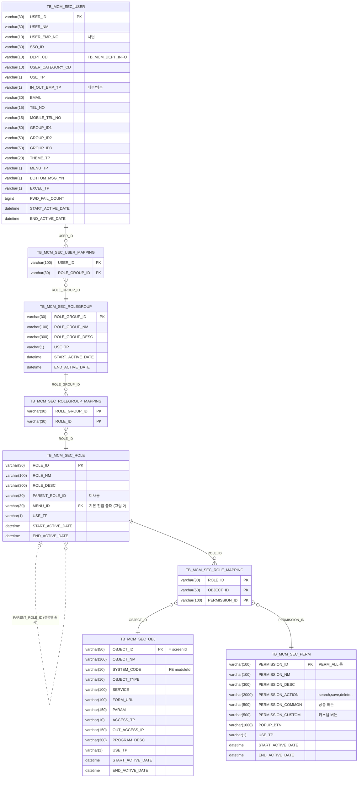
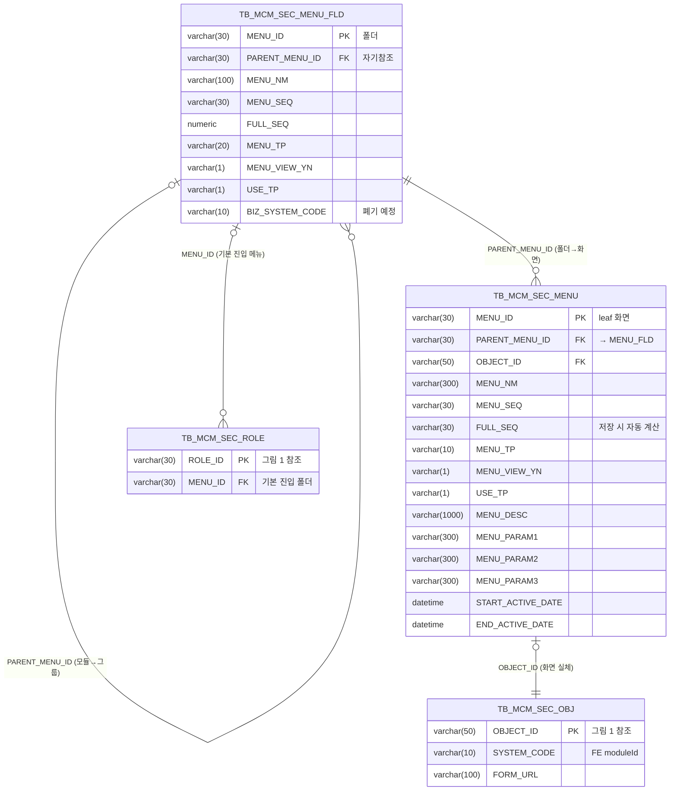
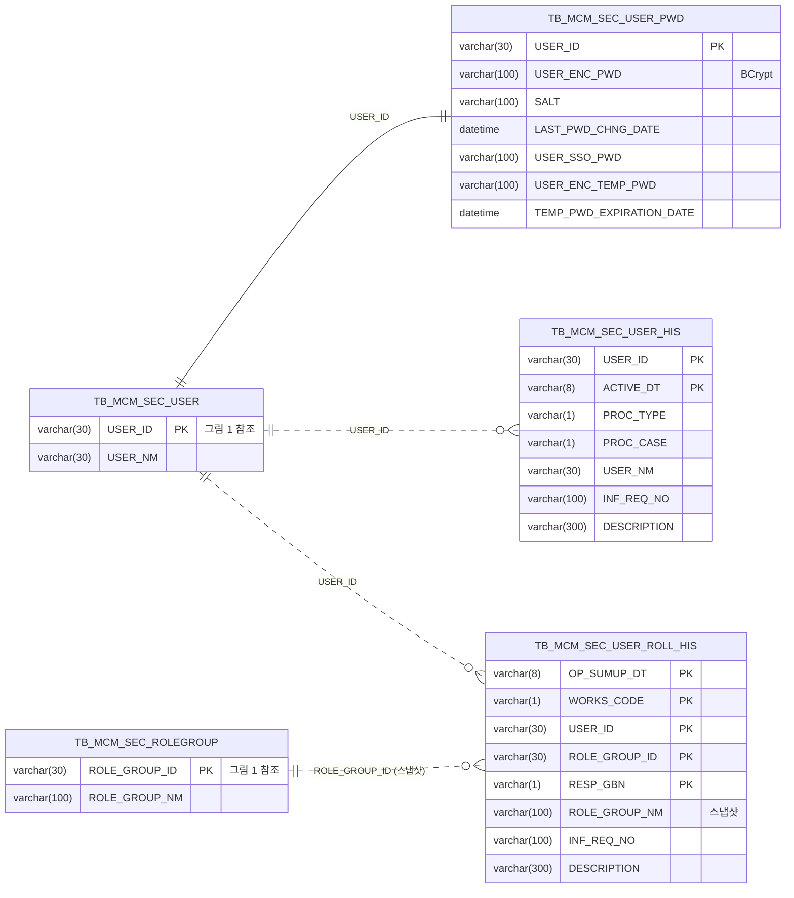
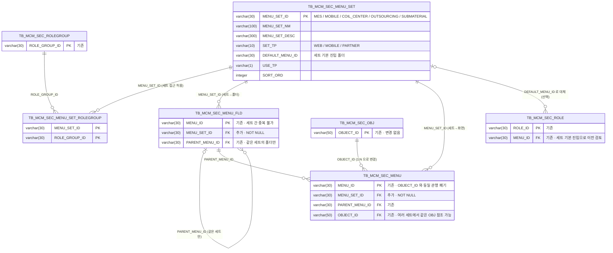

# mcm / csa 시스템관리 — 역할 · 역할그룹 · 사용자 · Permission · Menu · Object ERD

- 작성일: 2026-09-08
- 근거: `mcm-core/entity/Sec*.java` 13개 엔티티 + `src/backend/data/mcm.db` 실측 스키마
- 출처: Claude Code 아티팩트 "MCM 권한 ERD" (https://claude.ai/code/artifact/842c2d7b-78a3-4a54-abcb-dd73ec53830f) 를 저장소용 Markdown 으로 옮긴 것
- 관련 문서: [csa-menu-erd.md](./csa-menu-erd.md) (메뉴·즐겨찾기 중심), [csa-menu.dbml](./csa-menu.dbml) (dbdiagram.io 용 DBML)

> **audit 9 컬럼**(`C_USR_ID` / `C_AT` / `C_SVC_ID` / `C_PGM_ID` / `U_USR_ID` / `U_AT` / `U_SVC_ID` / `U_PGM_ID` / `VER`)은
> 모든 테이블에 cactus-core `CactusAuditEntity` 로 자동 적용된다. 아래 다이어그램에서는 생략한다.
>
> **물리 FK 제약은 0건**이며 아래 관계선은 모두 논리 FK 이다 (JPA 연관관계 금지 정책. 조인은 native query 나 Java 코드가 수행).

한 그림에 13개 테이블을 다 넣으면 폭이 커져 읽기 어려우므로 목적별 세 장으로 나눴다.
두 그림에 함께 나오는 테이블은 두 번째 그림에서 키 컬럼만 적었다.

범례

| 선 | 의미 |
|---|---|
| 실선 `--` | 논리 FK (코드가 조인) |
| 점선 `..` | 이력 · 스냅샷 참조 (키 정합 미보장) |
| 복합 PK 테이블 | 매핑 테이블 (`*_MAPPING`) |

## 1. 권한 해석 체인

위에서 아래로 읽으면 사용자가 어떤 화면에서 어떤 action 을 할 수 있는지가 결정되는 순서다.

## 2. 메뉴 트리와 화면 실체

폴더(`MENU_FLD`)가 자기참조로 모듈→그룹을 이루고, 화면(`MENU`)은 `OBJECT_ID` 로 실체와 1:1 로 이어진다.
`ROLE` 과 `OBJ` 는 그림 1 의 테이블이며 여기서는 키만 적었다.

## 3. 사용자 부속과 이력

비밀번호는 1:1 분리, 이력 두 테이블은 키 정합이 보장되지 않는 스냅샷이다.
`USER` 와 `ROLEGROUP` 은 그림 1 의 테이블이며 키만 적었다.

## 4. 테이블 역할

| 테이블 | 구분 | 실측 행 | 한 줄 설명 |
|---|---|---:|---|
| `SEC_USER` | 본체 | 1 | 사용자. 비밀번호는 `SEC_USER_PWD` 로 1:1 분리 |
| `SEC_ROLEGROUP` | 본체 | 1 | 역할 묶음. 사용자에게 부여되는 단위 |
| `SEC_ROLE` | 본체 | 1 | 역할. `MENU_ID` 로 기본 진입 폴더 지정 |
| `SEC_PERM` | 본체 | 1 | 허용 action 목록(search/save/delete…)을 콤마로 보유 |
| `SEC_OBJ` | 본체 | 21 | 화면 실체. `SYSTEM_CODE` 가 FE moduleId 가 됨 |
| `SEC_MENU` | 본체 | 21 | 화면(leaf)만. 폴더는 `SEC_MENU_FLD` 가 따로 담음 |
| `SEC_MENU_FLD` | 본체 | 8 | 모듈·그룹 폴더. 엔티티 없음, DataInitializer DDL 로만 존재 |
| `SEC_USER_MAPPING` | 매핑 | — | 사용자 × 역할그룹 |
| `SEC_ROLEGROUP_MAPPING` | 매핑 | — | 역할그룹 × 역할 |
| `SEC_ROLE_MAPPING` | 매핑 | — | 역할 × OBJECT × PERMISSION 3중 복합 PK. 권한 판정의 핵심 |
| `SEC_USER_HIS` | 이력 | 0 | 사용자 변경 이력 |
| `SEC_USER_ROLL_HIS` | 이력 | 0 | 사용자 역할그룹 부여 이력(그룹명 스냅샷 보유) |

## 5. 권한 해석 체인 (코드 기준)

1. `SEC_USER` → `SEC_USER_MAPPING` → 역할그룹 집합
2. 역할그룹 → `SEC_ROLEGROUP_MAPPING` → 역할 집합
3. 역할 → `SEC_ROLE_MAPPING` → 허용 (OBJECT_ID, PERMISSION_ID) 집합
4. `SEC_PERM.PERMISSION_ACTION` 으로 화면별 허용 action 결정. API 는 `EndpointPermissionFilter` 가 같은 집합으로 차단
5. `SEC_MENU` 중 허용 OBJECT_ID 를 가진 leaf 만 표시하고, `PARENT_MENU_ID` 를 따라 `SEC_MENU_FLD` 조상 폴더를 역추적해 사이드바 트리 구성

> `sysadmin-freepass` 기본값은 `false` 이다. SYSADMIN 도 `SEC_ROLE_MAPPING` 행이 없으면 화면과 API 가 막힌다.
> 신규 화면은 OBJ 등록 → ROLE_MAPPING 추가 → MENU_FLD 폴더 → MENU leaf 순으로 넣는다.

## 6. 같은 저장소에 있는 다른 SEC 스키마

`mcm-core/db/migration/sqlite/V1~V17` 의 `TB_SEC_*`(ROLE / PERM / ROLE_PERM / PERM_BUTTON / USER_ROLE …) 는 이력 참고용이며 런타임에 적용되지 않는다.
`application.yml` 이 Flyway 를 끄고 hibernate ddl-auto 와 DataInitializer 로 위 `TB_MCM_SEC_*` 만 만든다.
다만 `PermKey.java` 주석은 아직 `TB_SEC_*` 이름을 쓰고 있다.

---

## 7. 변경안 · 메뉴 세트 도입 (검토용 · 미확정)

**요구**: MES 기본 · 모바일 · 코일센터(사외 창고) · 외주가공 업체 · 부재료 공급 업체마다 메뉴와 프로그램이 다르다.
세트를 고르는 기준은 **접속한 시스템**이고, 그 세트 안에서 무엇이 보이는지는 지금처럼 **역할**이 정한다.
두 기준을 분리해야 같은 사람이 MES 기본과 모바일을 함께 쓸 수 있다.

### 7.1 대안 비교

| 대안 | 내용 | 장점 | 단점 |
|---|---|---|---|
| A. 역할그룹에 세트 지정 | `ROLEGROUP.MENU_SET_ID` 한 컬럼 추가 | 가장 싸다 | 같은 사람이 MES 기본과 모바일을 쓰려면 역할그룹을 두 벌 만들어야 한다. 역할그룹이 "권한 묶음"과 "접속 채널" 두 뜻을 갖게 된다. 접속 채널이 세트를 고르는 요구와 어긋난다 |
| B. 루트 폴더 = 세트 | 스키마 무변경. `MENU_FLD` 루트(`mcm`, `analog`)처럼 세트마다 루트 폴더를 두고 포털이 루트 ID 를 넘긴다 | 이행 비용이 0 에 가깝다 | "이 사용자가 이 세트에 들어와도 되는가"를 표현할 자리가 없다. 외주 업체 계정이 MES 기본 URL 로 오면 빈 트리만 뜬다. 세트 이름·유형(모바일 등)을 둘 메타 자리가 없다 |
| **C. 세트 테이블 + 세트 접근 매핑 (권장)** | 세트를 독립 테이블로 두고, 폴더·화면이 세트에 속하며, 역할그룹이 어떤 세트에 들어갈 수 있는지를 매핑으로 둔다 | 세트 선택(접속 시스템)과 화면 허용(역할)이 분리된다. 한 역할그룹이 여러 세트에, 한 세트에 여러 역할그룹이 올 수 있다. 같은 화면(`OBJ`)을 여러 세트에 걸 수도, 세트별로 다른 화면을 걸 수도 있다 | 신규 테이블 2개, 기존 테이블 컬럼 추가 2건, 데이터 이행 필요 |

### 7.2 변경안 C 의 ERD

기존 테이블은 바뀌는 컬럼만 적었다. `OBJ ↔ MENU` 는 1:0..1 에서 1:N 으로 바뀐다.

### 7.3 바뀌는 것

| 대상 | 변경 | 비고 |
|---|---|---|
| `SEC_MENU_SET` | 신규 | 세트 5행 시드. `SET_TP` 로 모바일·협력사 구분 |
| `SEC_MENU_SET_ROLEGROUP` | 신규 | 세트 접근 허용. 내부 역할그룹은 MES + MOBILE 두 행, 협력사 역할그룹은 자기 세트 한 행 |
| `SEC_MENU_FLD` | 컬럼 추가 | `MENU_SET_ID NOT NULL`. 기존 8행은 `MES` 로 채움 |
| `SEC_MENU` | 컬럼 추가 | `MENU_SET_ID NOT NULL`. 기존 21행은 `MES` 로 채움. 세트마다 같은 OBJ 를 걸 수 있으므로 `MENU_ID` 는 세트 접두어(`MOBILE.noticeMgmt`) 관행 도입 |
| `SEC_ROLE.MENU_ID` | 유지 | 세트별 기본 진입이 필요하면 `MENU_SET.DEFAULT_MENU_ID` 로 옮긴다. 1차에서는 손대지 않음 |
| `SEC_USER_FAVORITE` | 유지 | MENU_ID 가 세트에 속하므로 FE 가 현재 세트의 즐겨찾기만 표시 |
| `SEC_ROLE_MAPPING` · `SEC_PERM` · `SEC_OBJ` | 변경 없음 | 화면 허용 판정은 그대로. API 차단(`EndpointPermissionFilter`)도 그대로 |

### 7.4 로그인 후 흐름

1. 포털(접속 시스템)이 자기 `MENU_SET_ID` 를 안다. 모바일 앱은 `MOBILE`, 협력사 포털은 각자 세트.
2. `getMyMenus(menuSetId)` 호출. 서비스가 사용자 역할그룹 ∩ `SEC_MENU_SET_ROLEGROUP` 로 세트 접근을 먼저 검사한다. 허용이 없으면 403.
3. `SEC_MENU WHERE MENU_SET_ID=?` 로 후보를 좁힌 뒤, 지금과 같은 `filterMenusByRole` 로 허용 OBJECT_ID 만 남긴다.
4. 조상 폴더 역추적도 같은 세트 안에서만 한다. `FULL_SEQ` 재계산은 세트별로 독립.
5. 한 사용자가 여러 세트에 접근 가능하면 포털 상단에서 세트 전환. 접근 가능한 세트가 하나면 전환 UI 를 숨긴다.

> 역할그룹에 세트를 직접 넣지 않는 이유: 역할그룹은 "무엇을 할 수 있는가", 세트는 "어느 문으로 들어왔는가"다.
> 둘을 한 컬럼에 합치면 MES 기본과 모바일을 함께 쓰는 내부 사용자마다 역할그룹이 두 배로 늘어난다.

### 7.5 영향 범위 (구현 시)

- **백엔드**: 엔티티 2개 신규(`SecMenuSet`, `SecMenuSetRoleGroup`), `SecMenu` 컬럼 추가, `MENU_FLD` DDL 보강(DataInitializer), `SecUserService.getMyMenus / getMyMenusTree` 에 세트 파라미터와 접근 검사, `SecMenuNativeRepository` 의 폴더 CTE 와 `FULL_SEQ` 재계산에 세트 조건.
- **화면**: 메뉴 관리(`commMenuMng`)에 세트 선택 추가, 역할그룹 관리(`commRoleGrpMng`)에 세트 접근 탭 추가, 신규 세트 관리 화면 1개.
- **포털 셸**: `portal-shell` 이 세트 ID 를 들고 `getMyMenus` 에 전달, 세트 전환 UI.
- **데이터 이행**: 기존 폴더 8행·화면 21행에 `MES` 부여, 기존 역할그룹에 `MES`(+`MOBILE`) 접근 행 삽입. 멱등 DDL/시드는 DataInitializer 관례를 따른다.
