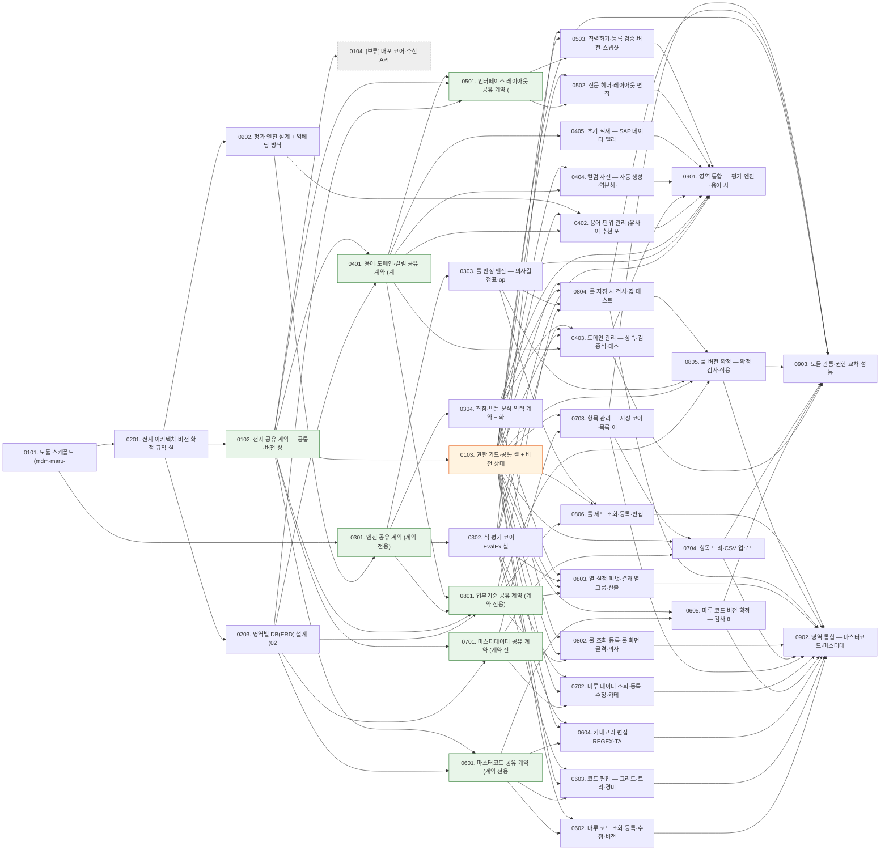

# WBS - 마루 MDM (dmes-standard 개발분)

> version: 1.3
> depth: 3
> start-date: 2026-09-28 / target-date: 2027-01-05 / updated: 2026-09-24
> 입력: [PRD.md](PRD.md) · [TRD.md](TRD.md) · 원천 설계 [design/basic/](design/basic/README.md) (02·03·04 전체 방식·05·06 + HTML 시안)
> 일정: 영업일(주말 제외) FS 계산, 공휴일·인력 제약 미반영 — target-date 는 인원 무제한 가정의 임계 경로 종료일이며 납기가 아니다. 담당 배정 후 D'Flow 에서 재조정
> 설계 링크(`design/basic/...`)는 이 PC 의 로컬 심볼릭 링크(`docs/mdm/design` → `/Users/jji/project/mdm/docs/design`)를 거친다. 워크트리·다른 클론·D'Flow 웹에서는 열리지 않으므로 원본 경로 `/Users/jji/project/mdm/docs/design/basic/` 을 직접 연다

---

## Dev Config

### Domains
| domain | description | unit-test | e2e-test | e2e-server | e2e-url |
|--------|-------------|-----------|----------|------------|---------|
| backend | mdm 모듈·엔진 jar (Spring Boot 4, OASIS BPMN, EvalEx 3.7.0) | `cd src/backend/mdm && ../gradlew :lib:test :api:test` | - | - | - |
| frontend | m-mdm 화면 라이브러리·JS 평가기 | `cd src/frontend && pnpm --filter @dk-oasis/m-mdm test` | `cd src/frontend && pnpm exec playwright test e2e/mdm-*.spec.ts` | `./be-run.sh --mcm --mdm & ./fe-run.sh --all -q` | `http://localhost:5100` |
| database | Flyway 두 방언(SQLite·MSSQL) | `cd src/backend/mdm && ../gradlew :api:test` | - | - | - |
| fullstack | 화면 + OASIS 서비스 + 전용 테이블 수직 슬라이스 | - | - | - | - |
| infra | 모듈 뼈대·공통 기반·설계 | `cd src/backend && ./gradlew testAll` | - | - | - |
| test | 통합 시나리오 | - | `cd src/frontend && pnpm exec playwright test e2e/mdm-*.spec.ts` | `./be-run.sh --mcm --mdm & ./fe-run.sh --all -q` | `http://localhost:5100` |

### Design Guidance
| domain | architecture |
|--------|-------------|
| backend | RULE.md MES 분기(`docs/guide/MES/Mes-Guide.md`). 업무 API 는 OASIS BPMN(`services/{group}/{screenId}.bpmn` → 서비스 빈), `@RestController` 우회 금지. 패키지 `com.dongkuk.dmes.mdm.{group}.{screenId}`. 스키마는 Flyway 두 방언(`flyway-migration-add`). BPMN 수정 후 `oasis-contract-check` ERROR 0. 엔진 jar 는 EvalEx 외 의존·DB·네트워크 호출 금지 |
| frontend | 공통 FE 가이드(`docs/guide/FrontEnd/README.md`). 화면 `m-mdm/pages/{group}/{screenId}/page.tsx`, 팝업은 `page.tsx` 금지. 라우팅과 메뉴 연결: 신규 페이지는 즉시 page-registry 에 등록하고 `DataInitializer` 메뉴·OBJECT·RBAC 시드를 같은 Task 에서 추가한다. 라우터·메뉴 배선을 분리된 후속 Task 로 미루면 orphan page 가 발생한다. 화면마다 설계 산출물 5종(RULE.md)을 Task 설계 단계에서 작성한다 |

### Quality Commands
| name | command |
|------|---------|
| lint | `cd src/frontend && pnpm lint` |
| typecheck | `cd src/frontend && pnpm --filter @dk-oasis/m-mdm lint` |
| coverage | - |

### Cleanup Processes
node, vitest, java

## WP-01: 프로젝트 초기화·공유 계약
- schedule: 2026-09-28 ~ 2026-11-20
- description: mdm 모듈·엔진 모듈 뼈대, 전사 공유 계약(계약 전용), 버전 상태 공통 기반 구현. 결재·배포·수신은 보류(PRD §2 규칙 7)

### TSK-01-01: 모듈 스캐폴드 (mdm·maru-mdm-engine) + DB 연결 + CI
- category: infra
- domain: infra
- model: sonnet
- status: [ ]
- priority: critical
- assignee: -
- schedule: 2026-09-28 ~ 2026-10-06
- tags: setup, mdm, engine, agent
- depends: -
- blocked-by: -
- entry-point: -
- note: 세부 작업: mdm 모듈 스캐폴드 + DB 연결 + CI / maru-mdm-engine 모듈 스캐폴드

#### PRD 요구사항
- prd-ref: [01 「8. 공통 엔진 모듈 (도출)」](design/basic/01-mdm-overview.md) · [06 「엔진 모듈: 별도 jar로 분리」](design/basic/06-business-rule.md) · PRD TRD §1 · PRD FR-E7
- requirements:
  - `src/backend/mdm`(lib+api) 생성 — mqc 모듈 구조를 본뜬다
  - `src/backend/settings.gradle` includeBuild, 루트 `includedProjectNames` 에 mdm 추가(testAll 대상)
  - application.yml 프로파일(local=SQLite, local-db=MSSQL, wildfly=JNDI), Flyway `db/migration/mdm/{sqlite,mssql}` 빈 V1
  - `src/frontend/m-mdm`(@dk-oasis/m-mdm) tsup 라이브러리 + Vitest `test` 스크립트, pnpm workspace 등록
  - `be-run.sh --mdm`(포트 8096) 추가, m-mcm 이 m-mdm 화면을 page-registry 로 적재
  - `src/backend/maru-mdm-engine` 독립 java-library, 의존은 EvalEx 3.7.0 하나
  - 패키지 `engine.{expr,rule,domain,code,spi}` 빈 골격
  - ArchUnit 으로 EvalEx 외 의존·DB·네트워크 호출 금지 규칙 고정
- acceptance:
  - `cd src/backend && ./gradlew testAll` 이 mdm 포함으로 통과
  - `./be-run.sh --mdm` 으로 기동 후 헬스 체크 응답
  - `pnpm --filter @dk-oasis/m-mdm test` 와 `pnpm lint` 통과
  - 샘플 빈 화면 1개가 m-mcm 포털에서 열린다
  - `../gradlew test` 통과, ArchUnit 규칙 위반 시 빌드 실패
  - mdm 모듈이 composite build 로 엔진을 의존한다
- constraints: -
- test-criteria: -

#### 기술 스펙 (TRD)
- tech-spec:
  - Java 21, Spring Boot 4.0.6, Gradle 9.3.1, cactus-core, OASIS 5.1.1
  - Next.js 16 호스트(m-mcm) + m-mdm tsup 라이브러리, Vitest 3
- api-spec: -
- data-model:
  - Flyway V1 (빈 베이스라인)
- ui-spec: -

### TSK-01-02: 전사 공유 계약 — 공통·버전 상태 (계약 전용)
- category: infra
- domain: database
- model: opus
- status: [ ]
- priority: critical
- assignee: -
- schedule: 2026-10-22 ~ 2026-11-03
- tags: contract, version, agent
- depends: TSK-02-01
- blocked-by: -
- entry-point: -
- note: 세부 작업: MDM 전사 공유 계약 (계약 전용) / 버전 상태 계약 (계약 전용). 결재·배포·수신 계약은 보류(PRD §2 규칙 7)

#### PRD 요구사항
- prd-ref: [02 「테이블 설계 샘플」](design/basic/02-term-domain-column.md) · [01 「2. 관리 대상별 원장과 흐름」](design/basic/01-mdm-overview.md) · [04 「버전 상태와 적용시점」](design/basic/04-master-code-deploy-full.md) · [06 「테이블 설계」](design/basic/06-business-rule.md) · PRD FR-A6, FR-F1 · PRD §2 규칙 7
- requirements:
  - `TB_MDM_SYSTEM` DDL(두 방언) + 초기 적재 시드(ERP/MES/APS/DKMS/L2 + MDM 자기 행)
  - 공통 관리 속성(등록·수정자·일시) 칼럼 규약과 적용 방식(TB 명명 결정 반영)
  - 역할 상수(표준 관리자·담당자)·권한 액션 코드, 공통 오류 코드·응답 DTO
  - OASIS 서비스 ID·화면 그룹 코드(dma/dmb/dmc/dmd/dme — [screens/README.md](screens/README.md)) 규칙
  - 04·05 공유 모델: 카테고리(REGEX/TABLE, BASE 예약, def_target) 타입과 마루 코드·마루 데이터 ID 이름 공간 검사 인터페이스
  - 버전 상태 5종(DRAFT/REQUESTED/APPROVED/RELEASED/CANCELLED) 상수와 전이 표 인터페이스. 이번 범위의 전이는 담당자 확정(DRAFT→RELEASED)·DRAFT 삭제뿐
  - DRAFT 소유권(선점·해제·넘기기) 서비스 인터페이스, `row_version` 낙관적 잠금 규약
  - 확정 시 apply_from 순서 검사 인터페이스(직전 RELEASED apply_from 보다 뒤, 최초 버전 면제)
  - 대상별 확정 검사 SPI(04 마루 코드·06 룰이 구현: diff 조회·확정 검사 호출)
- acceptance:
  - 실행 로직 없음 (contract-only)
  - 두 방언 마이그레이션이 SQLite·MSSQL 에서 적용된다
  - 공통 DTO·상수가 mdm lib 에 컴파일된다
  - 04·06 이 같은 인터페이스를 구현할 수 있음을 스텁 컴파일로 확인
- constraints: -
- test-criteria: -

#### 기술 스펙 (TRD)
- tech-spec: -
- api-spec: -
- data-model:
  - TB_MDM_SYSTEM(system_code PK, system_name, self_yn)
- ui-spec: -

### TSK-01-03: 권한 가드·공통 셸 + 버전 상태 서비스(담당자 확정)
- category: infra
- domain: fullstack
- model: opus
- status: [ ]
- priority: high
- assignee: -
- schedule: 2026-11-04 ~ 2026-11-20
- tags: shell, rbac, version, state-machine, ui, agent
- depends: TSK-01-02
- blocked-by: -
- entry-point: /portal → MDM 메뉴 그룹 (메뉴: MDM)
- note: 세부 작업: 권한 가드 + 공통 레이아웃 셸 / 버전 상태 서비스(담당자 확정). 결재 화면은 보류(PRD §2 규칙 7)

#### PRD 요구사항
- prd-ref: [04 「버전 상태와 적용시점」](design/basic/04-master-code-deploy-full.md) · [04 「상신 시 검사」](design/basic/04-master-code-deploy-full.md) · [06 「테이블 설계」](design/basic/06-business-rule.md) · PRD §2 규칙 7 · PRD §3, TRD §6 · PRD FR-F1
- requirements:
  - MDM 메뉴 그룹 트리(용어·도메인 / 레이아웃 / 마스터코드 / 마스터데이터 / 업무기준) 시드
  - TSK-01-01 이 만든 샘플 화면 `mdmSample` 의 그룹 경로를 `dma` 로 옮기거나 샘플을 지운다(메뉴 시드·tsup entry·pages 폴더·스모크 테스트를 함께 맞춘다)
  - 역할 2종(표준 관리자·담당자) 시드와 화면·액션별 권한 매핑 기본값(역할 ID·권한 세트·매트릭스는 [ADR-0003](adr/0003-module-boundary-screens-roles.md))
  - m-mdm 공통 화면 셸(PageLayout, 상태 배지, 잠금 배지)
  - 이번 범위의 전이 2종(담당자 확정 DRAFT→RELEASED, DRAFT 삭제), 미적용 버전 하나 규칙
  - 확정 시 apply_to 열기 + 직전 RELEASED 버전 닫기(한 트랜잭션)
  - DRAFT 선점·해제·넘기기(소유자만), 관리자 강제 해제 없음
  - 확정 시 apply_from 순서 검사(직전 RELEASED apply_from 보다 뒤, 최초 버전 면제)
  - 대상별 확정 검사 SPI 호출(04 검사 8항, 06 저장 시 검사·테스트 케이스는 각 영역이 구현)
  - 상신·반려·승인·승인 취소·철회와 결재 화면은 만들지 않는다(PRD §2 규칙 7)
- acceptance:
  - 권한 없는 사용자는 MDM 메뉴가 보이지 않고 API 가 403
  - 셸 컴포넌트가 Vitest 로 렌더 테스트된다
  - 확정·DRAFT 삭제와 거부 경로(미적용 버전 둘, 비소유자, apply_from 역순, 확정 검사 실패) 단위 테스트
  - 동시 확정 충돌 시 row_version 409
  - 담당자 역할만 확정 가능
  - 확정 검사 실패 시 DRAFT 가 그대로 남는다
- constraints: -
- test-criteria:
  - 04 「버전 상태와 적용시점」 예시를 테스트 케이스로 옮긴다

#### 기술 스펙 (TRD)
- tech-spec:
  - `DataInitializer.seedMdmMenus()`
  - shared `PageLayout`, `portal-menu`
  - BE: 공통 버전 상태 서비스(화면 없음, 04·06 영역 서비스가 호출)
- api-spec: -
- data-model: -
- ui-spec:
  - 공통 셸 컴포넌트(상태·잠금 배지). 독립 화면 없음

### TSK-01-04: [보류] 배포 코어·수신 API 골격 + 수신 스텁
- category: infra
- domain: backend
- model: opus
- status: [ ]
- priority: low
- assignee: -
- schedule: 2026-11-04 ~ 2026-11-10
- tags: deploy, receive, on-hold
- depends: TSK-01-02
- blocked-by: -
- entry-point: -
- note: 보류(사용자 결정 2026-09-23, PRD §2 규칙 7). 결재·배포·수신을 구현할 때 다시 연다. 그때 요구사항을 원천 설계(02·04·05·06 배포·수신 절)로 다시 쓴다. 에이전트 위임 대상이 아니다

#### PRD 요구사항
- prd-ref: [05 「보내는 쪽」](design/basic/05-master-data.md) · [05 「저장 경로와 검증」](design/basic/05-master-data.md) · PRD FR-F2, FR-F3 · PRD §5 「보류」
- requirements:
  - 배포 순번 발급기(SQLite RETURNING / MSSQL OUTPUT), 스냅샷 읽기(SQLite WAL / MSSQL SNAPSHOT)
  - 전달(수단 미정) + 실패 재시도 + 주기 pull 안전망(05 「안전망」)
  - 수신 API 공통 처리기(원천 인증, 2단 커밋 로그)
  - 통합테스트용 하위 시스템 수신 스텁(옛 묶음 폐기, 멱등 적용, last_seq_received 기록)
- acceptance:
  - 동시 배포 사건 100건에서 순번 중복·누락 0
  - 스텁이 순번 역행 묶음을 버리고 같은 묶음 재수신에 멱등
- constraints: -
- test-criteria: -

#### 기술 스펙 (TRD)
- tech-spec: -
- api-spec: -
- data-model: -
- ui-spec: -

## WP-02: 기본설계
- schedule: 2026-10-07 ~ 2026-11-04
- description: 전사 아키텍처·공통 설계, 영역별 DB(ERD) 설계, 미결 사항 조사

### TSK-02-01: 전사 아키텍처·버전 확정 규칙 설계
- category: design
- domain: infra
- model: opus
- status: [ ]
- priority: critical
- assignee: -
- schedule: 2026-10-07 ~ 2026-10-21
- tags: architecture, version, research, agent
- depends: TSK-01-01
- blocked-by: -
- entry-point: -
- note: 세부 작업: 전사 아키텍처·공통 계약 설계 / 버전 상태·담당자 확정 규칙 설계. 결재·배포·수신 설계는 보류(PRD §2 규칙 7)

#### PRD 요구사항
- prd-ref: [01 「MDM 전체 아키텍처」](design/basic/01-mdm-overview.md) · [02 「ERD」](design/basic/02-term-domain-column.md) · [04 「상신 시 검사」](design/basic/04-master-code-deploy-full.md) · [06 「DRAFT와 시험 사본」](design/basic/06-business-rule.md) · PRD §2 규칙 2·7 · PRD TRD §1·§4·§5·§8 · PRD FR-F1
- requirements:
  - 테이블 명명 `TB_MDM_*` 확정(사용자 결정 2026-09-23) 반영: 식별자 사전 정규식에 mdm 추가, 감사 칼럼 자동 주입(`McmAuditStatementInspector`) 적용 범위 결정, ADR
  - 방언 매핑 확정(RETURNING/OUTPUT, JSON 칼럼, 스냅샷 격리, 재귀 CTE)
  - 화면 그룹 코드·screenId 목록, 화면 설계 산출물 위치(`docs/mdm/design` 은 외부 링크 → `docs/mdm/screens/` 안)
  - 기존 mcm `cma`/`cmb` 와의 병존 원칙, 공통 관리 속성 정의
  - 04·06 공통 버전 상태·DRAFT 정책과 담당자 확정 규칙 확정(PRD §2 규칙 7. 07·08 은 적용하지 않는다)
  - 확정 때 쓰는 결재 칸(approved_by·approved_at 등)을 확정자·확정 일시로 채울지 비울지 결정
  - 권한 역할(표준 관리자·담당자) 배치
  - 배포 대상·배포 순번·수신 로그 테이블을 DDL 만 두고 코드는 쓰지 않는 원칙을 ADR 에 기록
- acceptance:
  - ADR 발행(adr-write) 및 TRD §9 가정 T1·T2 확정
  - 모든 후속 DB 설계 Task 가 참조할 명명·방언 규칙표 존재
  - 권한 역할 배치에 결론 또는 협의 이슈(issue-brief) 발행
  - decisions.md 에 결정 기록
- constraints: -
- test-criteria: -

#### 기술 스펙 (TRD)
- tech-spec: -
- api-spec: -
- data-model: -
- ui-spec: -

### TSK-02-02: 평가 엔진 설계 + 임베딩 방식 조사
- category: design
- domain: infra
- model: opus
- status: [ ]
- priority: high
- assignee: -
- schedule: 2026-10-22 ~ 2026-11-02
- tags: engine, embedding, research, agent
- depends: TSK-02-01
- blocked-by: -
- entry-point: -
- note: 세부 작업: 평가 엔진 설계 / 용어 임베딩 저장·검색 방식 조사

#### PRD 요구사항
- prd-ref: [06 「엔진 모듈: 별도 jar로 분리」](design/basic/06-business-rule.md) · [evalex-guide 「8. 화면(JS)에서 EvalEx 규칙을 실행하는 방법」](design/basic/evalex-guide.md) · [02 「TB_MDM_TERM (용어집)」](design/basic/02-term-domain-column.md) · PRD FR-E7 · PRD FR-A1
- requirements:
  - engine.spi 인터페이스(DefinitionLookup/CodeLookup/CodeEffLookup/MasterLookup/FunctionProvider)
  - EvalEx 설정 고정값·칸별 허용 함수 집합·AST JSON 스키마
  - MASTER/MASTER_AT/CODE_LIST 시그니처(05 기준), 평가 시각(EVAL_TS) 주입
  - 화면 JS 평가기 범위(op-code 직접 비교 + AST 인터프리터 미리보기), 정합성 코퍼스 형식
  - pgvector 전제를 SQLite·MSSQL 환경으로 옮기는 방법(파일 인덱스, 메모리 전수 비교 등) 비교
  - KURE-v1 ONNX INT8 + ONNX Runtime Java CPU 추론 시간 실측(용어 1만 건 기준)
- acceptance:
  - 엔진 계약 Task 가 그대로 옮길 수 있는 인터페이스 초안
  - 선택안과 근거를 decisions.md 에 기록(TRD 가정 T6 확정)
- constraints: -
- test-criteria: -

#### 기술 스펙 (TRD)
- tech-spec: -
- api-spec: -
- data-model: -
- ui-spec: -

### TSK-02-03: 영역별 DB(ERD) 설계 (02·03·04·05·06)
- category: design
- domain: database
- model: sonnet
- status: [ ]
- priority: high
- assignee: -
- schedule: 2026-10-22 ~ 2026-11-04
- tags: erd, 02, 03, 04, 05, 06, agent
- depends: TSK-02-01
- blocked-by: -
- entry-point: -
- note: 세부 작업: 용어·도메인·컬럼 DB 설계 / 인터페이스 레이아웃 DB 설계 + 헤더 적층 모델 확정 / 마스터코드 DB 설계 / 마스터데이터 DB 설계 / 업무기준 DB 설계

#### PRD 요구사항
- prd-ref: [02 「테이블 설계」](design/basic/02-term-domain-column.md) · [03 「테이블 설계」](design/basic/03-interface-layout.md) · [04 「테이블 설계」](design/basic/04-master-code-deploy-full.md) · [05 「테이블 설계」](design/basic/05-master-data.md) · [06 「테이블 설계」](design/basic/06-business-rule.md) · PRD FR-A · PRD FR-B · PRD FR-C · PRD FR-D · PRD FR-E
- requirements:
  - 테이블 TB_MDM_UNIT, TB_MDM_TERM, TB_MDM_DOMAIN, TB_MDM_COLUMN, TB_MDM_COLUMN_SYSTEM, TB_MDM_DICT_SEQ, TB_MDM_DICT_SYSTEM 의 두 방언 DDL 초안(명명 결정 반영)
  - 원장 내부 FK·인덱스·CHECK, 하위 업무 테이블로의 FK 금지 확인
  - 테이블 TB_MDM_EAI, TB_MDM_LAYOUT, TB_MDM_LAYOUT_ITEM (+ 헤더 적층·상수 재정의 테이블) 의 두 방언 DDL 초안(명명 결정 반영)
  - 목업의 헤더 다중 적층(EAI 구간 + 시스템 구간)과 md 의 전문당 헤더 하나 중 확정, 상수 재정의 저장 테이블 설계
  - 테이블 TB_MDM_CODE, TB_MDM_CODE_SYSTEM, TB_MDM_CODE_VER, TB_MDM_CODE_ITEM, TB_MDM_CODE_CATE, TB_MDM_CODE_CATE_ITEM, TB_MDM_CODE_RECV 의 두 방언 DDL 초안(명명 결정 반영)
  - 테이블 TB_MDM_DATA, TB_MDM_DATA_SYSTEM, TB_MDM_DATA_ITEM, TB_MDM_DATA_CATE, TB_MDM_DATA_CATE_ITEM, TB_MDM_DATA_RECV, TB_MDM_DATA_RECV_ITEM 의 두 방언 DDL 초안(명명 결정 반영)
  - 테이블 TB_MDM_RULE, TB_MDM_RULE_SYSTEM, TB_MDM_RULE_VER, TB_MDM_RULE_VAR, TB_MDM_RULE_ROW, TB_MDM_RULE_TEST_CASE, TB_MDM_RULE_SET, TB_MDM_RULE_RECV 의 두 방언 DDL 초안(명명 결정 반영)
  - JSON 칼럼(cells, rule_ids) 방언 표현과 json_each/OPENJSON 참조 검사 쿼리
  - 배포 대상(`*_SYSTEM`)·배포 순번(`TB_MDM_DICT_SEQ`, `chg_seq`)·수신 로그(`*_RECV*`) 표는 설계대로 두고 ERD 에 보류 표시(PRD §2 규칙 7)
- acceptance:
  - ERD(Mermaid 또는 dbml)와 DDL 초안을 `docs/mdm/erd/` 에 커밋
  - 영역 계약 Task 가 그대로 마이그레이션으로 옮길 수 있는 수준
- constraints: -
- test-criteria: -

#### 기술 스펙 (TRD)
- tech-spec: -
- api-spec: -
- data-model:
  - TB_MDM_UNIT, TB_MDM_TERM, TB_MDM_DOMAIN, TB_MDM_COLUMN, TB_MDM_COLUMN_SYSTEM, TB_MDM_DICT_SEQ, TB_MDM_DICT_SYSTEM
  - TB_MDM_EAI, TB_MDM_LAYOUT, TB_MDM_LAYOUT_ITEM (+ 헤더 적층·상수 재정의 테이블)
  - TB_MDM_CODE, TB_MDM_CODE_SYSTEM, TB_MDM_CODE_VER, TB_MDM_CODE_ITEM, TB_MDM_CODE_CATE, TB_MDM_CODE_CATE_ITEM, TB_MDM_CODE_RECV
  - TB_MDM_DATA, TB_MDM_DATA_SYSTEM, TB_MDM_DATA_ITEM, TB_MDM_DATA_CATE, TB_MDM_DATA_CATE_ITEM, TB_MDM_DATA_RECV, TB_MDM_DATA_RECV_ITEM
  - TB_MDM_RULE, TB_MDM_RULE_SYSTEM, TB_MDM_RULE_VER, TB_MDM_RULE_VAR, TB_MDM_RULE_ROW, TB_MDM_RULE_TEST_CASE, TB_MDM_RULE_SET, TB_MDM_RULE_RECV
- ui-spec: -

## WP-03: 평가 엔진 (maru-mdm-engine)
- schedule: 2026-11-03 ~ 2026-11-24
- description: 02·03·04·05·06 이 공유하는 EvalEx 기반 평가 엔진 jar 와 화면 JS 평가기

### TSK-03-01: 엔진 공유 계약 (계약 전용)
- category: infra
- domain: backend
- model: opus
- status: [ ]
- priority: critical
- assignee: -
- schedule: 2026-11-03 ~ 2026-11-05
- tags: contract, engine, agent
- depends: TSK-02-02, TSK-01-01
- blocked-by: -
- entry-point: -
- note: -

#### PRD 요구사항
- prd-ref: [06 「엔진 모듈: 별도 jar로 분리」](design/basic/06-business-rule.md) · [evalex-guide 「8.3 AST JSON 형식」](design/basic/evalex-guide.md) · PRD FR-E7
- requirements:
  - engine.spi 인터페이스, EvalEx 설정 팩토리 시그니처, AST JSON 스키마 타입
  - MASTER/MASTER_AT/CODE_LIST 함수 시그니처, 판정 결과 타입(적중 row_id·seq, 첫 거짓 셀, 경고)
  - JS 평가기와 공유할 AST·셀 구조 TypeScript 타입
- acceptance:
  - 실행 로직 없음 (contract-only)
  - Java·TS 타입이 같은 JSON 스키마에서 나온다
- constraints: -
- test-criteria: -

#### 기술 스펙 (TRD)
- tech-spec: -
- api-spec: -
- data-model: -
- ui-spec: -

### TSK-03-02: 식 평가 코어 — EvalEx 설정·MASTER 계열·카테고리 해석·도메인 검증기
- category: dev
- domain: backend
- model: opus
- status: [ ]
- priority: high
- assignee: -
- schedule: 2026-11-06 ~ 2026-11-24
- tags: engine, expr, code, domain, agent
- depends: TSK-03-01
- blocked-by: -
- entry-point: -
- note: 세부 작업: EvalEx 설정·허용 함수·AST 내보내기 / 카테고리 해석기·버전 선택·MASTER 계열 함수 / 도메인 검증기

#### PRD 요구사항
- prd-ref: [evalex-guide 「6. 문법에 영향을 주는 설정 (`ExpressionConfiguration`)」](design/basic/evalex-guide.md) · [06 「엔진 모듈: 별도 jar로 분리」](design/basic/06-business-rule.md) · [04 「판정 참고 구현(사본 쿼리)」](design/basic/04-master-code-deploy-full.md) · [05 「판정 참고 구현(사본 쿼리)」](design/basic/05-master-data.md) · [02 「제약 관리: 값 · 필수 · 참조 · 유일성」](design/basic/02-term-domain-column.md) · [02 「검증식 계약」](design/basic/02-term-domain-column.md) · PRD FR-E7 · PRD FR-C4, FR-D1, FR-E7 · PRD FR-A2
- requirements:
  - precision 68/HALF_EVEN, allowOverwriteConstants=false 설정 팩토리
  - 칸별 허용 함수 화이트리스트, Java 전용 정규식 거부, 예약 변수명 금지
  - AstExporter, 컴파일 캐시 + copy(), 평가 타임아웃
  - REGEX(전체 일치, def_target 칸)·TABLE 카테고리 해석, BASE 예약
  - 기준일로 버전 선택(04 선분 from_ver–to_ver), 일시 선분(05 valid_from–to) 판정, 최초 행 소급
  - `MASTER(id,cate,key[,attr])`, `MASTER_AT(...base_dt...)`, `CODE_LIST` — 첫 인자로 코드·데이터 구분
  - `validate(column, record)` 순서: 빈 값 정규화 → 필수 → 타입 변환 → 유효 표준식 → 유효 비즈니스식
  - 상속 체인 AND 누적 유효 식 조립(파생값, 저장하지 않음)
  - 비즈니스식 변수 누락은 검증 실패
- acceptance:
  - 화이트리스트 밖 함수는 파싱 단계에서 거부
  - 동시 평가 1,000 스레드에서 결과 일치(캐시 copy 검증)
  - 04 판정 표(2024-06-01~2026-09-10)가 `sql/04-code-exists.sql` 결과와 일치
  - 05 PORT 판정 7케이스 통과
  - 02 「도메인 종류」 예시 전부 테스트
  - 타입 변환 계약이 06 룰 엔진과 같은 함수를 쓴다
- constraints: -
- test-criteria: -

#### 기술 스펙 (TRD)
- tech-spec: -
- api-spec: -
- data-model: -
- ui-spec: -

### TSK-03-03: 룰 판정 엔진 — 의사결정표·op-code 생성·룰 세트
- category: dev
- domain: backend
- model: opus
- status: [ ]
- priority: high
- assignee: -
- schedule: 2026-11-06 ~ 2026-11-24
- tags: engine, rule, opcode, ruleset, agent
- depends: TSK-03-01
- blocked-by: -
- entry-point: -
- note: 세부 작업: 의사결정표 판정·적중 정책·결과 열 그룹 / op-code → EvalEx 생성기 / 룰 세트 실행 + 정의 조회 view

#### PRD 요구사항
- prd-ref: [06 「엔진 골격 (Java, 서버)」](design/basic/06-business-rule.md) · [workrule 「2. 개념 매핑」](design/basic/workrule-column-design.md) · [06 「EvalEx 생성 규칙」](design/basic/06-business-rule.md) · [06 「룰 구성 요소」](design/basic/06-business-rule.md) · PRD FR-E2, FR-E7 · PRD FR-E2 · PRD FR-E5, FR-E6
- requirements:
  - 4단계 판정(조건 검사 → 행 고르기 → 결과 검사 → 결과 평가), 적중 정책 FIRST/UNIQUE/PRIORITY/COLLECT/ANY
  - 기본 행, NULL 정책(`V != NULL &&` 가드), EVAL_TS 주입, 식 변수 `_V<var_id>` 사전 계산
  - 결과 열 그룹(res_grp·grp_cond) 선택, 산출 룰(DERIVE) 순차 평가
  - 표시 타입 Equal/1/2/Expression 셀 → EvalEx 텍스트, 2 타입은 부등호 쌍 4종
  - `=` 값의 `%`·`_` 패턴(단순형 3종/정규식), CONTAINS/INSTR, `IN 카테고리`(CODE_IN)
  - ReDoS 제한, 결정적 바이트 동일 출력
  - 세트 순차 실행, 실행 전 입력 키 일괄 확인, 최종·중간 결과 반환, 폐기 세트는 판정 오류
  - `view(ruleId, evalTs, {TEXT, AST, CONTRACT})`, `setView`
- acceptance:
  - 06 샘플 룰 QLTY_GRD_JDG·COIL_WGT_CALC·PROD_WGT_CALC·BASE_SPD_LKP 값 테스트 일치
  - 같은 셀 입력에 바이트 동일 출력(회귀 스냅샷 테스트)
  - 생성 텍스트가 EvalEx 파싱을 통과
  - 세트 LS_A3 샘플 실행 결과 일치
  - 폐기된 세트 판정 시 명시적 오류
- constraints: -
- test-criteria: -

#### 기술 스펙 (TRD)
- tech-spec: -
- api-spec: -
- data-model: -
- ui-spec: -

### TSK-03-04: 겹침·빈틈 분석·입력 계약 + 화면 JS 평가기·정합성 코퍼스
- category: dev
- domain: fullstack
- model: opus
- status: [ ]
- priority: high
- assignee: -
- schedule: 2026-11-06 ~ 2026-11-19
- tags: engine, analysis, js, corpus, agent
- depends: TSK-03-01
- blocked-by: -
- entry-point: `@dk-oasis/m-mdm` evalex 모듈 (화면 없음 — 02 도메인·06 룰 화면에서 소비)
- note: 세부 작업: 겹침·빈틈·도달 불가 분석 + 입력 계약 계산 / 화면 JS 평가기 + 서버·JS 정합성 코퍼스

#### PRD 요구사항
- prd-ref: [06 「저장 시 검사」](design/basic/06-business-rule.md) · [06 「입력 계약」](design/basic/06-business-rule.md) · [evalex-guide 「8. 화면(JS)에서 EvalEx 규칙을 실행하는 방법」](design/basic/evalex-guide.md) · [02 「도메인 검증 규칙 표현 방식」](design/basic/02-term-domain-column.md) · PRD FR-E2, FR-E3 · PRD FR-E7, PRD AC-3
- requirements:
  - 조건 열별 값 집합(구간 대수, 패턴 접두 구간)으로 겹침·빈틈·도달 불가 계산
  - UNIQUE 는 겹침 오류, 나머지는 경고
  - AST 기반 행별 필수·선택 입력 변수 계산(입력 계약)
  - op-code 셀 직접 비교, 적중 정책·겹침 즉시 미리보기(decimal.js)
  - AST 인터프리터(`evalex-ast-interpreter`), 지원 밖 노드는 서버 미리보기로 폴백(isSupported=false)
  - 서버·JS 정합성 코퍼스 JSON + 양쪽 러너(JUnit, Vitest)
- acceptance:
  - 06 「저장 시 검사」 겹침·빈틈 예시 통과
  - 계약 계산이 PROD_WGT_CALC 행별 계약과 일치
  - 코퍼스 불일치 0건
  - 1만 행 평가 100 ms 이내(NFR-1)
- constraints: -
- test-criteria: -

#### 기술 스펙 (TRD)
- tech-spec: -
- api-spec: -
- data-model: -
- ui-spec: -

## WP-04: 용어·도메인·컬럼 사전 (02)
- schedule: 2026-11-05 ~ 2026-12-11
- description: 용어·도메인·컬럼·단위 표준 사전과 초기 적재(변경분 배포는 보류)

### TSK-04-01: 용어·도메인·컬럼 공유 계약 (계약 전용)
- category: infra
- domain: database
- model: sonnet
- status: [ ]
- priority: critical
- assignee: -
- schedule: 2026-11-05 ~ 2026-11-09
- tags: contract, 02, agent
- depends: TSK-02-03, TSK-01-02
- blocked-by: -
- entry-point: -
- note: -

#### PRD 요구사항
- prd-ref: [02 「테이블 설계 샘플」](design/basic/02-term-domain-column.md) · PRD FR-A
- requirements:
  - 02 테이블 7개 Flyway(두 방언), JPA 엔티티·리포지토리
  - 유효 식·유효 코드 참조 해석 함수 인터페이스(저장·조회 공유), 영향도 조회 인터페이스
  - 컬럼 사전 조회 인터페이스(03 레이아웃·06 룰 변수가 사용)
- acceptance:
  - 실행 로직 없음 (contract-only)
  - 03·06 계약이 이 인터페이스만 참조한다
- constraints: -
- test-criteria: -

#### 기술 스펙 (TRD)
- tech-spec: -
- api-spec: -
- data-model:
  - TB_MDM_UNIT, TB_MDM_TERM, TB_MDM_DOMAIN, TB_MDM_COLUMN, TB_MDM_COLUMN_SYSTEM, TB_MDM_DICT_SEQ, TB_MDM_DICT_SYSTEM
- ui-spec: -

### TSK-04-02: 용어·단위 관리 (유사어 추천 포함)
- category: dev
- domain: fullstack
- model: sonnet
- status: [ ]
- priority: high
- assignee: -
- schedule: 2026-11-23 ~ 2026-12-02
- tags: 02, ui, embedding, agent
- depends: TSK-04-01, TSK-01-03, TSK-02-02
- blocked-by: -
- entry-point: /portal → dma/unitMng (메뉴: MDM > 용어·도메인 > 단위 마스터); /portal → dma/termMng (메뉴: MDM > 용어·도메인 > 용어 관리)
- note: 세부 작업: 단위 마스터 / 용어 관리 / 용어 임베딩 유사어 추천

#### PRD 요구사항
- prd-ref: [02 「단위: 저장 단위와 표시 단위의 분리」](design/basic/02-term-domain-column.md) · [02 「용어(단어) 속성」](design/basic/02-term-domain-column.md) · [02 「컬럼명 속성」](design/basic/02-term-domain-column.md) · [02 「TB_MDM_TERM (용어집)」](design/basic/02-term-domain-column.md) · PRD FR-A4 · PRD FR-A1 · 시안: [02 「단위 마스터」](design/basic/html/02-term-domain-column.html) · 시안: [02 「용어 관리」](design/basic/html/02-term-domain-column.html)
- requirements:
  - 차원·기준 단위·환산 계수 CRUD, 차원 선택 시 기준 단위 고정
  - 환산 미리보기(같은 차원만)
  - (표기, 의미 번호) 키 CRUD, 정의 필수, 동의어·별칭·사용 시스템·영문명·약어
  - 1차 문자열 유사어 추천 패널(디바운스), 동의어로 확정
  - KURE-v1 ONNX INT8 서버 내장 인코딩(등록·수정 시 1회)
  - 최초 일괄 구축 배치, 모델 교체 시 재인코딩 배치
  - 용어 관리 화면 2차 추천 API
- acceptance:
  - 차원이 다른 변환 거부
  - 월·년·영업일 단위 등록 거부
  - 포털 메뉴에서 화면이 열리고 e2e `src/frontend/e2e/mdm-unitMng.spec.ts` 가 통과한다
  - (표기, 의미 번호) 중복 저장 거부
  - 약어 중복 경고
  - 포털 메뉴에서 화면이 열리고 e2e `src/frontend/e2e/mdm-termMng.spec.ts` 가 통과한다
  - 용어 1만 건 추천 응답 500 ms 이내
  - embedding_model 이 다른 행은 재인코딩 대상으로 잡힌다
- constraints: -
- test-criteria: -

#### 기술 스펙 (TRD)
- tech-spec:
  - BE: `com.dongkuk.dmes.mdm.dma.unitMng.{dto,service}` + BPMN `services/dma/unitMng.bpmn`
  - FE: `m-mdm/pages/dma/unitMng/page.tsx` (m-mcm 포털 적재, page-registry 코드젠)
  - 메뉴·OBJECT·RBAC 시드: `DataInitializer` componentPath=`dma/unitMng`
  - BE: `com.dongkuk.dmes.mdm.dma.termMng.{dto,service}` + BPMN `services/dma/termMng.bpmn`
  - FE: `m-mdm/pages/dma/termMng/page.tsx` (m-mcm 포털 적재, page-registry 코드젠)
  - 메뉴·OBJECT·RBAC 시드: `DataInitializer` componentPath=`dma/termMng`
- api-spec:
  - OASIS 서비스 `unitMng` — `/api/mdm/oasis/{serviceId}/{action}`
  - OASIS 서비스 `termMng` — `/api/mdm/oasis/{serviceId}/{action}`
- data-model:
  - TB_MDM_UNIT
  - TB_MDM_TERM
- ui-spec:
  - 시안: [02 「단위 마스터」](design/basic/html/02-term-domain-column.html)
  - 시안: [02 「용어 관리」](design/basic/html/02-term-domain-column.html)

### TSK-04-03: 도메인 관리 — 상속·검증식·테스트 케이스·영향도
- category: dev
- domain: fullstack
- model: opus
- status: [ ]
- priority: high
- assignee: -
- schedule: 2026-11-25 ~ 2026-12-11
- tags: 02, ui, evalex, impact, agent
- depends: TSK-04-01, TSK-01-03, TSK-03-02, TSK-03-04
- blocked-by: -
- entry-point: /portal → dma/domainMng (메뉴: MDM > 용어·도메인 > 도메인 관리)
- note: 세부 작업: 도메인 관리 — 상속 트리·기본 속성 / 도메인 검증식·테스트 케이스·미리보기 / 도메인 영향도 조회

#### PRD 요구사항
- prd-ref: [02 「속성과 상속 규칙」](design/basic/02-term-domain-column.md) · [02 「도메인 종류」](design/basic/02-term-domain-column.md) · [02 「검증식 계약」](design/basic/02-term-domain-column.md) · [02 「파생값을 저장하지 않는다」](design/basic/02-term-domain-column.md) · [02 「생명주기와 변경 관리」](design/basic/02-term-domain-column.md) · PRD FR-A2 · 시안: [02 「도메인 관리」](design/basic/html/02-term-domain-column.html) · 시안: [02 「도메인 관리 — 검증식·테스트 케이스」](design/basic/html/02-term-domain-column.html) · 시안: [02 「도메인 관리 — 영향도 표」](design/basic/html/02-term-domain-column.html)
- requirements:
  - 상속 트리 그리드(들여쓰기, 유효 식 표시), 기본 속성 폼
  - 상속 규칙: 종류·타입·단위 고정, 길이·소수 좁히기, CODE 참조(maru_code_id+cate_id) 대체
  - 변경 분류(호환/좁히기·넓히기/구조 변경 금지)
  - 표준식(화면+서버)·비즈니스식(서버 전용) 두 칸, 저장 시 파싱·화이트리스트·AST 저장
  - 저장 거부 조건 10종, 빈 말단 경고
  - 테스트 케이스 그리드 실행, 부모 수정 시 하위 테스트 케이스를 같은 트랜잭션에서 재실행
  - 화면 JS 미리보기 + 비즈니스식 서버 미리보기(디바운스)
  - 재귀 CTE 로 하위 도메인·참조 컬럼·룰 결과 변수·레이아웃 조회
  - 저장 전 diff 와 변경 분류 표시
- acceptance:
  - 상속 순환·길이 확대·구조 변경 저장 거부
  - CODE 도메인은 체인 어딘가에 참조가 있어야 저장
  - 포털 메뉴에서 화면이 열리고 e2e `src/frontend/e2e/mdm-domainMng.spec.ts` 가 통과한다
  - 거부 조건 10종 각각 서버 테스트
  - 하위 테스트 케이스 실패 시 부모 저장 롤백
  - 03·06 테이블이 비어 있어도 조회가 동작한다(참조 0건)
- constraints: -
- test-criteria: -

#### 기술 스펙 (TRD)
- tech-spec:
  - BE: `com.dongkuk.dmes.mdm.dma.domainMng.{dto,service}` + BPMN `services/dma/domainMng.bpmn`
  - FE: `m-mdm/pages/dma/domainMng/page.tsx` (m-mcm 포털 적재, page-registry 코드젠)
  - 메뉴·OBJECT·RBAC 시드: `DataInitializer` componentPath=`dma/domainMng`
- api-spec:
  - OASIS 서비스 `domainMng` — `/api/mdm/oasis/{serviceId}/{action}`
- data-model:
  - TB_MDM_DOMAIN
- ui-spec:
  - 시안: [02 「도메인 관리」](design/basic/html/02-term-domain-column.html)
  - 시안: [02 「도메인 관리 — 검증식·테스트 케이스」](design/basic/html/02-term-domain-column.html)
  - 시안: [02 「도메인 관리 — 영향도 표」](design/basic/html/02-term-domain-column.html)

### TSK-04-04: 컬럼 사전 — 자동 생성·역분해·시스템 매핑
- category: dev
- domain: fullstack
- model: opus
- status: [ ]
- priority: high
- assignee: -
- schedule: 2026-11-23 ~ 2026-12-02
- tags: 02, ui, naming, agent
- depends: TSK-04-01, TSK-01-03
- blocked-by: -
- entry-point: /portal → dma/columnMng (메뉴: MDM > 용어·도메인 > 컬럼 사전)
- note: 세부 작업: 컬럼 사전 — 목록·상세·시스템 필드명 매핑 / 컬럼명 자동 생성·역분해·용어 인라인 등록

#### PRD 요구사항
- prd-ref: [02 「TB_MDM_COLUMN (컬럼 사전)」](design/basic/02-term-domain-column.md) · [02 「TB_MDM_COLUMN_SYSTEM (컬럼 시스템 매핑)」](design/basic/02-term-domain-column.md) · [02 「컬럼명 속성」](design/basic/02-term-domain-column.md) · PRD FR-A3 · 시안: [02 「컬럼 사전 관리」](design/basic/html/02-term-domain-column.html) · 시안: [02 「컬럼 사전 관리 — 자동 생성 패널」](design/basic/html/02-term-domain-column.html)
- requirements:
  - 컬럼 목록(실제 필드명으로도 검색), 상세 폼(표시명 긴24/중12/짧6, 도메인 필수, 참조 종류)
  - 시스템별 실제 필드명 그리드(행 추가·삭제, transform·note)
  - 한국어 논리명 → 최장 일치 분해 → 동의어 표준어 치환 → 물리명 미리보기(`***` 표시)
  - `***` 클릭 → 유사어 확인 → 용어 인라인 등록 팝업(`dma/termRegPop`)
  - 도메인 추천·중복 검사, 역방향(물리명 → 논리명) 분해
- acceptance:
  - 한 시스템 안 같은 필드명의 두 번째 등록 거부
  - 라벨이 비면 더 긴 쪽으로 대체해 표시
  - 포털 메뉴에서 화면이 열리고 e2e `src/frontend/e2e/mdm-columnMng.spec.ts` 가 통과한다
  - `***` 가 남으면 저장 불가
  - 권한 없는 사용자는 인라인 등록 불가
- constraints: -
- test-criteria: -

#### 기술 스펙 (TRD)
- tech-spec:
  - BE: `com.dongkuk.dmes.mdm.dma.columnMng.{dto,service}` + BPMN `services/dma/columnMng.bpmn`
  - FE: `m-mdm/pages/dma/columnMng/page.tsx` (m-mcm 포털 적재, page-registry 코드젠)
  - 메뉴·OBJECT·RBAC 시드: `DataInitializer` componentPath=`dma/columnMng`
- api-spec:
  - OASIS 서비스 `columnMng` — `/api/mdm/oasis/{serviceId}/{action}`
- data-model:
  - TB_MDM_COLUMN, TB_MDM_COLUMN_SYSTEM
- ui-spec:
  - 시안: [02 「컬럼 사전 관리」](design/basic/html/02-term-domain-column.html)
  - 시안: [02 「컬럼 사전 관리 — 자동 생성 패널」](design/basic/html/02-term-domain-column.html)

### TSK-04-05: 초기 적재 — SAP 데이터 엘리먼트 후보 추출
- category: dev
- domain: backend
- model: opus
- status: [ ]
- priority: high
- assignee: -
- schedule: 2026-11-23 ~ 2026-12-04
- tags: 02, migration, agent
- depends: TSK-04-01
- blocked-by: -
- entry-point: -
- note: 세부 작업: SAP 초기 적재 후보 추출. 사전 수신 시스템 지정·변경분 배포는 보류(PRD §2 규칙 7)

#### PRD 요구사항
- prd-ref: [02 「TB_MDM_COLUMN_SYSTEM (컬럼 시스템 매핑)」](design/basic/02-term-domain-column.md) · PRD FR-A6 · PRD §5 「보류」
- requirements:
  - SAP 데이터 엘리먼트(DD03L 등) 추출 파일에서 용어·도메인·컬럼 매핑 후보 생성
  - 미대응 필드 작업 목록 출력
- acceptance:
  - 샘플 추출 파일로 후보·미대응 목록이 생성된다
  - 후보는 파일로 출력하고 자동 등록하지 않는다. 사람이 검토해 용어·도메인·컬럼 화면으로 등록한다
- constraints:
  - 사전 수신 시스템 화면(`dma/dictSystemMng`)과 변경분 배포는 보류(PRD §5)
- test-criteria: -

#### 기술 스펙 (TRD)
- tech-spec:
  - BE: 후보 추출 배치(입력: SAP 추출 파일, 출력: 후보·미대응 목록 파일)
- api-spec: -
- data-model: -
- ui-spec:
  - -

## WP-05: 인터페이스 레이아웃 (03)
- schedule: 2026-11-10 ~ 2026-12-14
- description: 고정 길이 전문 정의·검증·직렬화와 스냅샷 출력(스냅샷 배포는 보류)

### TSK-05-01: 인터페이스 레이아웃 공유 계약 (계약 전용)
- category: infra
- domain: database
- model: sonnet
- status: [ ]
- priority: critical
- assignee: -
- schedule: 2026-11-10 ~ 2026-11-12
- tags: contract, 03, agent
- depends: TSK-02-03, TSK-01-02, TSK-04-01
- blocked-by: -
- entry-point: -
- note: -

#### PRD 요구사항
- prd-ref: [03 「구조: 전문 = EAI 헤더 + 업무 본문」](design/basic/03-interface-layout.md) · [03 「항목 채움 방식(fill_kind)과 기본값」](design/basic/03-interface-layout.md) · PRD FR-B
- requirements:
  - 03 테이블(적층 모델 확정분 포함) Flyway 두 방언, 엔티티
  - 레이아웃 스냅샷 JSON 스키마, 직렬화기·파서 인터페이스
- acceptance:
  - 실행 로직 없음 (contract-only)
- constraints: -
- test-criteria: -

#### 기술 스펙 (TRD)
- tech-spec: -
- api-spec: -
- data-model:
  - TB_MDM_EAI, TB_MDM_LAYOUT, TB_MDM_LAYOUT_ITEM (+ 적층·재정의 테이블)
- ui-spec: -

### TSK-05-02: 전문 헤더·레이아웃 편집
- category: dev
- domain: fullstack
- model: opus
- status: [ ]
- priority: high
- assignee: -
- schedule: 2026-11-23 ~ 2026-12-09
- tags: 03, ui
- depends: TSK-05-01, TSK-01-03
- blocked-by: -
- entry-point: /portal → dmb/headerMng (메뉴: MDM > 레이아웃 > 전문 헤더 정의); /portal → dmb/layoutMng (메뉴: MDM > 레이아웃 > 전문 레이아웃)
- note: 세부 작업: 전문 헤더 정의 / 전문 레이아웃 — 기본 속성·헤더 구성·상수 재정의 / 전문 레이아웃 — 본문 항목·오프셋 자동 계산

#### PRD 요구사항
- prd-ref: [03 「구조: 전문 = EAI 헤더 + 업무 본문」](design/basic/03-interface-layout.md) · [03 「항목 채움 방식(fill_kind)과 기본값」](design/basic/03-interface-layout.md) · [03 「자동 계산과 등록 검증」](design/basic/03-interface-layout.md) · [03 「단위와 표현 형식」](design/basic/03-interface-layout.md) · PRD FR-B1 · PRD FR-B2 · 시안: [03 「전문 헤더 정의」](design/basic/html/03-interface-layout.html) · 시안: [03 「전문 레이아웃 — 헤더 구성·상수 편집」](design/basic/html/03-interface-layout.html) · 시안: [03 「전문 레이아웃 — 본문 항목」](design/basic/html/03-interface-layout.html)
- requirements:
  - 헤더 목록·상세(인코딩·패딩), 헤더 항목 그리드(컬럼 사전 검색으로 추가)
  - 헤더 변경 시 사용 전문 전체를 영향도에 표시
  - 전문 목록·기본 속성(송신·수신 시스템), 헤더 구성 그리드(순서, 구성 잠김)
  - 상수 편집 팝업(헤더 기본값 vs 이 전문 값) — 기본값 3층 규칙
  - 본문 항목 그리드(컬럼 사전 검색, fill_kind 선택, 드래그 순서)
  - 항목 상세(파생 타입·단위·도메인, trans_unit/unit_item, 부호·0 채움·암묵 소수점, FILLER 길이)
  - 오프셋·총 길이 즉시 재계산
- acceptance:
  - 컬럼 사전에 없는 항목 추가 불가
  - 포털 메뉴에서 화면이 열리고 e2e `src/frontend/e2e/mdm-headerMng.spec.ts` 가 통과한다
  - 헤더 구성·길이는 전문에서 편집 불가, 상수만 재정의
  - 포털 메뉴에서 화면이 열리고 e2e `src/frontend/e2e/mdm-layoutMng.spec.ts` 가 통과한다
  - fill_kind 별 닫힌 칸에 값이 있으면 거부
  - M201 예시 총 길이 187바이트·본문 첫 오프셋 130 재현
- constraints: -
- test-criteria: -

#### 기술 스펙 (TRD)
- tech-spec:
  - BE: `com.dongkuk.dmes.mdm.dmb.headerMng.{dto,service}` + BPMN `services/dmb/headerMng.bpmn`
  - FE: `m-mdm/pages/dmb/headerMng/page.tsx` (m-mcm 포털 적재, page-registry 코드젠)
  - 메뉴·OBJECT·RBAC 시드: `DataInitializer` componentPath=`dmb/headerMng`
  - BE: `com.dongkuk.dmes.mdm.dmb.layoutMng.{dto,service}` + BPMN `services/dmb/layoutMng.bpmn`
  - FE: `m-mdm/pages/dmb/layoutMng/page.tsx` (m-mcm 포털 적재, page-registry 코드젠)
  - 메뉴·OBJECT·RBAC 시드: `DataInitializer` componentPath=`dmb/layoutMng`
- api-spec:
  - OASIS 서비스 `headerMng` — `/api/mdm/oasis/{serviceId}/{action}`
  - OASIS 서비스 `layoutMng` — `/api/mdm/oasis/{serviceId}/{action}`
- data-model: -
- ui-spec:
  - 시안: [03 「전문 헤더 정의」](design/basic/html/03-interface-layout.html)
  - 시안: [03 「전문 레이아웃 — 헤더 구성·상수 편집」](design/basic/html/03-interface-layout.html)
  - 시안: [03 「전문 레이아웃 — 본문 항목」](design/basic/html/03-interface-layout.html)

### TSK-05-03: 직렬화기·등록 검증·버전·스냅샷 출력
- category: dev
- domain: fullstack
- model: opus
- status: [ ]
- priority: high
- assignee: -
- schedule: 2026-11-25 ~ 2026-12-14
- tags: 03, serializer, validate, version
- depends: TSK-05-01, TSK-01-03, TSK-03-02
- blocked-by: -
- entry-point: /portal → dmb/layoutMng (메뉴: MDM > 레이아웃 > 전문 레이아웃)
- note: 세부 작업: 전문 직렬화기·파서 라이브러리 / 등록 검증과 샘플 전문 / 버전 이력·스냅샷 출력·영향도. 스냅샷 배포는 보류(PRD §2 규칙 7)

#### PRD 요구사항
- prd-ref: [03 「수신 처리」](design/basic/03-interface-layout.md) · [03 「단위와 표현 형식」](design/basic/03-interface-layout.md) · [03 「자동 계산과 등록 검증」](design/basic/03-interface-layout.md) · [03 「버전과 변경」](design/basic/03-interface-layout.md) · PRD FR-B5 · PRD FR-B3 · PRD FR-B4 · 시안: [03 「등록 검증과 샘플 전문」](design/basic/html/03-interface-layout.html) · 시안: [03 「버전과 영향도」](design/basic/html/03-interface-layout.html)
- requirements:
  - 인코딩 바이트 길이·패딩·암묵 소수점·AUTO(SEND_TIME·MSG_LENGTH·SEQ·LAYOUT_ID) 채움
  - 단위 경계 변환(trans_unit / unit_item, TB_MDM_UNIT 계수)
  - 수신 파싱 → 단위 역변환(받는 쪽 검증 없음)
  - 등록 거부 조건 7종 자동 검사 표
  - 예시 값 입력 → 인코딩 바이트 기준 한 줄 렌더(구역별 색)
  - 버전 이력(전환 방식 순차/동시), 변경 분류 표
  - 레이아웃 스냅샷 JSON·엑셀 내려받기
  - 컬럼·도메인 변경 영향 전문 목록
  - 저장 즉시 스냅샷 버전 생성(배포는 보류)
- acceptance:
  - 3.5 mm → `0035` 등 03 예시 왕복(직렬화→파싱) 일치
  - 직렬화와 파싱이 같은 스냅샷 버전으로 동작
  - 거부 7종 각각 서버 테스트
  - CONST 값은 도메인 유효 식으로 검증
  - 포털 메뉴에서 화면이 열리고 e2e `src/frontend/e2e/mdm-layoutMng.spec.ts` 가 통과한다
  - FILLER 분할 추가는 총 길이 불변·순차 전환으로 분류
- constraints: -
- test-criteria: -

#### 기술 스펙 (TRD)
- tech-spec:
  - BE: `com.dongkuk.dmes.mdm.dmb.layoutMng.{dto,service}` + BPMN `services/dmb/layoutMng.bpmn`
  - FE: `m-mdm/pages/dmb/layoutMng/page.tsx` (m-mcm 포털 적재, page-registry 코드젠)
  - 메뉴·OBJECT·RBAC 시드: `DataInitializer` componentPath=`dmb/layoutMng`
- api-spec:
  - OASIS 서비스 `layoutMng` — `/api/mdm/oasis/{serviceId}/{action}`
- data-model: -
- ui-spec:
  - 시안: [03 「등록 검증과 샘플 전문」](design/basic/html/03-interface-layout.html)
  - 시안: [03 「버전과 영향도」](design/basic/html/03-interface-layout.html)

## WP-06: 마스터코드 (04, 전체 방식)
- schedule: 2026-11-05 ~ 2026-12-10
- description: 마루 코드 버전·선분·카테고리와 담당자 확정(결재·배포·수신은 보류)

### TSK-06-01: 마스터코드 공유 계약 (계약 전용)
- category: infra
- domain: database
- model: opus
- status: [ ]
- priority: critical
- assignee: -
- schedule: 2026-11-05 ~ 2026-11-09
- tags: contract, 04
- depends: TSK-02-03, TSK-01-02
- blocked-by: -
- entry-point: -
- note: -

#### PRD 요구사항
- prd-ref: [04 「테이블 설계」](design/basic/04-master-code-deploy-full.md) · [04 「구조: 마루 코드 → 버전 · 코드 · 카테고리」](design/basic/04-master-code-deploy-full.md) · PRD FR-C
- requirements:
  - 04 테이블 7개 Flyway 두 방언, 엔티티
  - 선분 조작 서비스 인터페이스(카테고리 모델·ID 이름 공간은 전사 계약 재사용)
  - 확정 검사 SPI(diff·검사 8항) 구현 대상 선언
- acceptance:
  - 실행 로직 없음 (contract-only)
- constraints: -
- test-criteria: -

#### 기술 스펙 (TRD)
- tech-spec: -
- api-spec: -
- data-model:
  - TB_MDM_CODE, TB_MDM_CODE_SYSTEM, TB_MDM_CODE_VER, TB_MDM_CODE_ITEM, TB_MDM_CODE_CATE, TB_MDM_CODE_CATE_ITEM, TB_MDM_CODE_RECV
- ui-spec: -

### TSK-06-02: 마루 코드 조회·등록·수정·버전
- category: dev
- domain: fullstack
- model: opus
- status: [ ]
- priority: high
- assignee: -
- schedule: 2026-11-23 ~ 2026-12-07
- tags: 04, ui, version
- depends: TSK-06-01, TSK-01-03
- blocked-by: -
- entry-point: /portal → dmc/codeMng (메뉴: MDM > 마스터코드 > 마루 코드); /portal → dmc/codeEdit (메뉴: MDM > 마스터코드 > 마루 코드 수정)
- note: 세부 작업: 마루 코드 조회·등록 / 마루 코드 수정 — 헤더·라벨·폐기 / 버전 목록·새 버전·복원·DRAFT 소유권. 배포 대상·EXTERNAL 원천은 보류(PRD §2 규칙 7)

#### PRD 요구사항
- prd-ref: [04 「화면」](design/basic/04-master-code-deploy-full.md) · [04 「추가 컬럼」](design/basic/04-master-code-deploy-full.md) · [04 「코드 삭제와 마루 코드 폐기」](design/basic/04-master-code-deploy-full.md) · [04 「버전 상태와 적용시점」](design/basic/04-master-code-deploy-full.md) · PRD FR-C1 · PRD FR-C2 · 시안: [04 「탭1 조회·등록」](design/basic/html/04-master-code.html) · 시안: [04 「탭2 수정 — 카드 ①~③」](design/basic/html/04-master-code.html) · 시안: [04 「탭2 수정 — 버전 목록·새버전 대화상자」](design/basic/html/04-master-code.html)
- requirements:
  - 조회(마루 코드·상태), 현재 버전은 구간에서 조회(없으면 미확정 표시)
  - 등록(MDM 원천만): TB_MDM_CODE(CREATED)·VER 1.000 DRAFT·CATE BASE 를 한 트랜잭션
  - 헤더 경미 수정
  - 추가 컬럼 라벨 attr01–10, DEPRECATED 전이(미적용 버전 없을 때)
  - 버전 목록(종류·상태·적용 구간·소유자), 상태별 버튼 활성 매트릭스(확정 이동 포함)
  - 새 버전 대화상자: major=floor(max)+1, minor=max+0.001(999 상한), 빈 버전/복원(restored_from)
  - DRAFT 선점·해제·넘기기, DRAFT 삭제 시 선분 복구
- acceptance:
  - ID 문자 제약·TB_MDM_DATA ID 중복 거부
  - 등록자가 DRAFT 를 자동 선점
  - 포털 메뉴에서 화면이 열리고 e2e `src/frontend/e2e/mdm-codeMng.spec.ts` 가 통과한다
  - 등록은 MDM 원천만 받는다
  - 폐기 후 CODE_LIST 에서 숨고 MASTER 판정은 유지
  - 포털 메뉴에서 화면이 열리고 e2e `src/frontend/e2e/mdm-codeEdit.spec.ts` 가 통과한다
  - 미적용 버전이 있으면 새 버전 거부, 2개면 DRAFT 삭제만 허용
  - 복원 diff 가 코드·카테고리·CATE_ITEM 모두 채운다
- constraints: -
- test-criteria: -

#### 기술 스펙 (TRD)
- tech-spec:
  - BE: `com.dongkuk.dmes.mdm.dmc.codeMng.{dto,service}` + BPMN `services/dmc/codeMng.bpmn`
  - FE: `m-mdm/pages/dmc/codeMng/page.tsx` (m-mcm 포털 적재, page-registry 코드젠)
  - 메뉴·OBJECT·RBAC 시드: `DataInitializer` componentPath=`dmc/codeMng`
  - BE: `com.dongkuk.dmes.mdm.dmc.codeEdit.{dto,service}` + BPMN `services/dmc/codeEdit.bpmn`
  - FE: `m-mdm/pages/dmc/codeEdit/page.tsx` (m-mcm 포털 적재, page-registry 코드젠)
  - 메뉴·OBJECT·RBAC 시드: `DataInitializer` componentPath=`dmc/codeEdit`
- api-spec:
  - OASIS 서비스 `codeMng` — `/api/mdm/oasis/{serviceId}/{action}`
  - OASIS 서비스 `codeEdit` — `/api/mdm/oasis/{serviceId}/{action}`
- data-model: -
- ui-spec:
  - 시안: [04 「탭1 조회·등록」](design/basic/html/04-master-code.html)
  - 시안: [04 「탭2 수정 — 카드 ①~③」](design/basic/html/04-master-code.html)
  - 시안: [04 「탭2 수정 — 버전 목록·새버전 대화상자」](design/basic/html/04-master-code.html)

### TSK-06-03: 코드 편집 — 그리드·트리·경미 수정
- category: dev
- domain: fullstack
- model: opus
- status: [ ]
- priority: high
- assignee: -
- schedule: 2026-11-25 ~ 2026-12-08
- tags: 04, ui, tree, patch
- depends: TSK-06-01, TSK-01-03, TSK-03-02
- blocked-by: -
- entry-point: /portal → dmc/codeItemEdit (메뉴: MDM > 마스터코드 > 코드 편집)
- note: 세부 작업: 코드 편집 그리드 — 선분 조작·저장 검사 / 코드 트리 보기·계층 콤보·미리보기 / 경미 수정

#### PRD 요구사항
- prd-ref: [04 「구조: 마루 코드 → 버전 · 코드 · 카테고리」](design/basic/04-master-code-deploy-full.md) · [04 「계층과 다목적 분류」](design/basic/04-master-code-deploy-full.md) · [04 「판정 참고 구현(사본 쿼리)」](design/basic/04-master-code-deploy-full.md) · [04 「경미 수정(패치)」](design/basic/04-master-code-deploy-full.md) · PRD FR-C3 · 시안: [04 「탭3·4 코드 편집」](design/basic/html/04-master-code.html) · 시안: [04 「탭4 코드 편집(계층) 트리 보기」](design/basic/html/04-master-code.html) · 시안: [04 「경미 수정 패널」](design/basic/html/04-master-code.html)
- requirements:
  - DRAFT 코드 행 추가·수정·삭제(선분 from_ver–to_ver), 행 되돌리기, 코드 삭제 시 TABLE CATE_ITEM 연쇄 닫기
  - 동적 열(lvl_cnt, 라벨 있는 attr), 닫힌 코드 보기, 낙관적 잠금
  - 저장 검사(콤마·공백, 계층 3검사, 라벨 없는 attr, 구간 겹침)
  - lvl 트리 보기(접기·펴기, 이 노드로 편집, 필터 칩)
  - 카테고리 선택 미리보기 패널(콤보/목록·근거 모드)
  - RELEASED 코드 행의 이름·약칭·순서·설명 in-place 수정
- acceptance:
  - 04 「샘플 데이터」 저장 검사 결과 일치
  - RELEASED·CANCELLED 는 읽기 전용 diff
  - 포털 메뉴에서 화면이 열리고 e2e `src/frontend/e2e/mdm-codeItemEdit.spec.ts` 가 통과한다
  - `sql/04-hier-tree-sim.py` 트리 결과와 일치
  - 코드·계층·attr 값은 잠김
  - DRAFT 가 같은 키를 고쳤으면 거부
- constraints: -
- test-criteria: -

#### 기술 스펙 (TRD)
- tech-spec:
  - BE: `com.dongkuk.dmes.mdm.dmc.codeItemEdit.{dto,service}` + BPMN `services/dmc/codeItemEdit.bpmn`
  - FE: `m-mdm/pages/dmc/codeItemEdit/page.tsx` (m-mcm 포털 적재, page-registry 코드젠)
  - 메뉴·OBJECT·RBAC 시드: `DataInitializer` componentPath=`dmc/codeItemEdit`
- api-spec:
  - OASIS 서비스 `codeItemEdit` — `/api/mdm/oasis/{serviceId}/{action}`
- data-model: -
- ui-spec:
  - 시안: [04 「탭3·4 코드 편집」](design/basic/html/04-master-code.html)
  - 시안: [04 「탭4 코드 편집(계층) 트리 보기」](design/basic/html/04-master-code.html)
  - 시안: [04 「경미 수정 패널」](design/basic/html/04-master-code.html)

### TSK-06-04: 카테고리 편집 — REGEX·TABLE
- category: dev
- domain: fullstack
- model: sonnet
- status: [ ]
- priority: high
- assignee: -
- schedule: 2026-11-25 ~ 2026-12-04
- tags: 04, category
- depends: TSK-06-01, TSK-01-03, TSK-03-02
- blocked-by: -
- entry-point: /portal → dmc/codeCateEdit (메뉴: MDM > 마스터코드 > 카테고리 편집)
- note: 세부 작업: 카테고리 편집 — REGEX / 카테고리 편집 — TABLE 이중 목록

#### PRD 요구사항
- prd-ref: [04 「카테고리 정의 방식」](design/basic/04-master-code-deploy-full.md) · PRD FR-C4 · 시안: [04 「탭6 카테고리(REGEX)」](design/basic/html/04-master-code.html) · 시안: [04 「탭5 카테고리(TABLE)」](design/basic/html/04-master-code.html)
- requirements:
  - 버전별 카테고리 목록·추가·닫기, REGEX 정규식·대상 칸 입력
  - 일치·불일치 두 목록 서버 재해석 미리보기
  - transfer list(전체 선택·건수·검색·attr 필터·Shift 범위·더블클릭, `>` `>>` `<` `<<`, 추가·제외 표시)
  - TABLE 소속 저장(선분), 빈 카테고리·없는 코드 경고
- acceptance:
  - 정규식 문법 오류 저장 거부
  - BASE 편집·닫기 불가(화면·서버)
  - 포털 메뉴에서 화면이 열리고 e2e `src/frontend/e2e/mdm-codeCateEdit.spec.ts` 가 통과한다
  - 코드 1,000건에서 이동·저장이 1초 이내
  - 소속 코드는 유효 코드여야 저장
- constraints: -
- test-criteria: -

#### 기술 스펙 (TRD)
- tech-spec:
  - BE: `com.dongkuk.dmes.mdm.dmc.codeCateEdit.{dto,service}` + BPMN `services/dmc/codeCateEdit.bpmn`
  - FE: `m-mdm/pages/dmc/codeCateEdit/page.tsx` (m-mcm 포털 적재, page-registry 코드젠)
  - 메뉴·OBJECT·RBAC 시드: `DataInitializer` componentPath=`dmc/codeCateEdit`
- api-spec:
  - OASIS 서비스 `codeCateEdit` — `/api/mdm/oasis/{serviceId}/{action}`
- data-model: -
- ui-spec:
  - 시안: [04 「탭6 카테고리(REGEX)」](design/basic/html/04-master-code.html)
  - 시안: [04 「탭5 카테고리(TABLE)」](design/basic/html/04-master-code.html)

### TSK-06-05: 마루 코드 버전 확정 — 검사 8항·적용시점·diff
- category: dev
- domain: fullstack
- model: opus
- status: [ ]
- priority: high
- assignee: -
- schedule: 2026-11-23 ~ 2026-12-10
- tags: 04, version, confirm
- depends: TSK-06-01, TSK-01-03
- blocked-by: -
- entry-point: /portal → dmc/codeConfirm (메뉴: MDM > 마스터코드 > 버전 확정)
- note: 세부 작업: 확정 폼·검사 8항 / 직전 RELEASED 대비 diff / 확정 전이·자동 전이. 상신·결재·배포·철회·수신은 보류(PRD §2 규칙 7)

#### PRD 요구사항
- prd-ref: [04 「상신 시 검사」](design/basic/04-master-code-deploy-full.md) · [04 「버전 상태와 적용시점」](design/basic/04-master-code-deploy-full.md) · PRD §2 규칙 7 · PRD FR-C5 · 시안: [04 「탭7 상신」](design/basic/html/04-master-code.html)
- requirements:
  - 확정 폼(희망 apply_from), 검사 8항 결과 표(통과·경고·거부). 3항은 "직전 RELEASED apply_from 보다 뒤" 로 검사(PRD §2 규칙 7)
  - 직전 RELEASED 대비 diff(테이블·키, 바뀐 카테고리 요약)
  - 확정 = DRAFT → RELEASED, 직전 버전 apply_to 닫기를 한 트랜잭션으로(공통 버전 상태 서비스 사용)
  - CREATED→INUSE 자동 전이(첫 RELEASED 의 apply_from 경과)
- acceptance:
  - 거부 1건이라도 있으면 확정 불가
  - 최초 버전은 3항 면제
  - 담당자가 아닌 사용자는 확정할 수 없다
  - 04 「샘플 데이터」 버전 이력(v1.000 → v1.001)을 확정 경로로 재현
  - 포털 메뉴에서 화면이 열리고 e2e `src/frontend/e2e/mdm-codeConfirm.spec.ts` 가 통과한다
- constraints:
  - 상신 화면 시안(탭7)은 배치 참고용이다. 긴급·사유·결재 영역은 만들지 않는다
- test-criteria: -

#### 기술 스펙 (TRD)
- tech-spec:
  - BE: `com.dongkuk.dmes.mdm.dmc.codeConfirm.{dto,service}` + BPMN `services/dmc/codeConfirm.bpmn`
  - FE: `m-mdm/pages/dmc/codeConfirm/page.tsx` (m-mcm 포털 적재, page-registry 코드젠)
  - 메뉴·OBJECT·RBAC 시드: `DataInitializer` componentPath=`dmc/codeConfirm`
- api-spec:
  - OASIS 서비스 `codeConfirm` — `/api/mdm/oasis/{serviceId}/{action}`
- data-model: -
- ui-spec:
  - 시안: [04 「탭7 상신」](design/basic/html/04-master-code.html) (확정 폼으로 변형)

## WP-07: 마스터데이터 (05)
- schedule: 2026-11-05 ~ 2026-12-24
- description: 마루 데이터 정의·항목·카테고리(변경분 배포·수신은 보류)

### TSK-07-01: 마스터데이터 공유 계약 (계약 전용)
- category: infra
- domain: database
- model: sonnet
- status: [ ]
- priority: critical
- assignee: -
- schedule: 2026-11-05 ~ 2026-11-09
- tags: contract, 05
- depends: TSK-02-03, TSK-01-02
- blocked-by: -
- entry-point: -
- note: -

#### PRD 요구사항
- prd-ref: [05 「테이블 설계」](design/basic/05-master-data.md) · PRD FR-D
- requirements:
  - 05 테이블 7개 Flyway 두 방언, 엔티티
  - 일시 선분 저장 코어 인터페이스, 카테고리·ID 이름 공간은 전사 계약 재사용
- acceptance:
  - 실행 로직 없음 (contract-only)
- constraints: -
- test-criteria: -

#### 기술 스펙 (TRD)
- tech-spec: -
- api-spec: -
- data-model:
  - TB_MDM_DATA, TB_MDM_DATA_SYSTEM, TB_MDM_DATA_ITEM, TB_MDM_DATA_CATE, TB_MDM_DATA_CATE_ITEM, TB_MDM_DATA_RECV, TB_MDM_DATA_RECV_ITEM
- ui-spec: -

### TSK-07-02: 마루 데이터 조회·등록·수정·카테고리
- category: dev
- domain: fullstack
- model: sonnet
- status: [ ]
- priority: high
- assignee: -
- schedule: 2026-11-25 ~ 2026-12-07
- tags: 05, ui, category
- depends: TSK-07-01, TSK-01-03, TSK-03-02
- blocked-by: -
- entry-point: /portal → dmd/dataMng (메뉴: MDM > 마스터데이터 > 마루 데이터); /portal → dmd/dataEdit (메뉴: MDM > 마스터데이터 > 마루 데이터 수정); /portal → dmd/dataCateEdit (메뉴: MDM > 마스터데이터 > 카테고리 편집)
- note: 세부 작업: 마루 데이터 조회·등록 / 마루 데이터 수정 — 헤더·라벨·계층·폐기 / 카테고리 편집. 배포 대상·EXTERNAL 원천은 보류(PRD §2 규칙 7)

#### PRD 요구사항
- prd-ref: [05 「화면」](design/basic/05-master-data.md) · [05 「추가 컬럼」](design/basic/05-master-data.md) · [05 「구조: 마루 데이터 → 항목 · 추가 컬럼 · 카테고리」](design/basic/05-master-data.md) · [05 「카테고리 정의 방식」](design/basic/05-master-data.md) · PRD FR-D1 · 시안: [05 「마루 데이터 조회·등록」](design/basic/html/05-master-data.html) · 시안: [05 「마루 데이터 수정」](design/basic/html/05-master-data.html) · 시안: [05 「카테고리 편집」](design/basic/html/05-master-data.html)
- requirements:
  - 조회(ID·이름·상태), 등록(MDM 원천만): TB_MDM_DATA(INUSE)+CATE BASE 한 트랜잭션
  - 헤더·키 패턴 저장
  - 라벨 1~10 저장, lvl_cnt 증감, 폐기 2단 확인
  - REGEX(대상 KEY/LVL/ATTR)·TABLE(체크박스 소속 적용) 편집, 닫기·다시 열기(선분)
  - 매칭 건수 미리보기
- acceptance:
  - 마루 코드와 ID 중복 거부
  - 등록 후 수정 화면으로 이동
  - 포털 메뉴에서 화면이 열리고 e2e `src/frontend/e2e/mdm-dataMng.spec.ts` 가 통과한다
  - lvl_cnt 축소는 뒤 칸 값이 있는 행이 없을 때만
  - DEPRECATED 후 저장 거부
  - 포털 메뉴에서 화면이 열리고 e2e `src/frontend/e2e/mdm-dataEdit.spec.ts` 가 통과한다
  - BASE 편집·닫기 불가
  - 닫힌 카테고리는 소속 보존·판정 false
  - 포털 메뉴에서 화면이 열리고 e2e `src/frontend/e2e/mdm-dataCateEdit.spec.ts` 가 통과한다
- constraints: -
- test-criteria: -

#### 기술 스펙 (TRD)
- tech-spec:
  - BE: `com.dongkuk.dmes.mdm.dmd.dataMng.{dto,service}` + BPMN `services/dmd/dataMng.bpmn`
  - FE: `m-mdm/pages/dmd/dataMng/page.tsx` (m-mcm 포털 적재, page-registry 코드젠)
  - 메뉴·OBJECT·RBAC 시드: `DataInitializer` componentPath=`dmd/dataMng`
  - BE: `com.dongkuk.dmes.mdm.dmd.dataEdit.{dto,service}` + BPMN `services/dmd/dataEdit.bpmn`
  - FE: `m-mdm/pages/dmd/dataEdit/page.tsx` (m-mcm 포털 적재, page-registry 코드젠)
  - 메뉴·OBJECT·RBAC 시드: `DataInitializer` componentPath=`dmd/dataEdit`
  - BE: `com.dongkuk.dmes.mdm.dmd.dataCateEdit.{dto,service}` + BPMN `services/dmd/dataCateEdit.bpmn`
  - FE: `m-mdm/pages/dmd/dataCateEdit/page.tsx` (m-mcm 포털 적재, page-registry 코드젠)
  - 메뉴·OBJECT·RBAC 시드: `DataInitializer` componentPath=`dmd/dataCateEdit`
- api-spec:
  - OASIS 서비스 `dataMng` — `/api/mdm/oasis/{serviceId}/{action}`
  - OASIS 서비스 `dataEdit` — `/api/mdm/oasis/{serviceId}/{action}`
  - OASIS 서비스 `dataCateEdit` — `/api/mdm/oasis/{serviceId}/{action}`
- data-model: -
- ui-spec:
  - 시안: [05 「마루 데이터 조회·등록」](design/basic/html/05-master-data.html)
  - 시안: [05 「마루 데이터 수정」](design/basic/html/05-master-data.html)
  - 시안: [05 「카테고리 편집」](design/basic/html/05-master-data.html)

### TSK-07-03: 항목 관리 — 저장 코어·목록·이력
- category: dev
- domain: fullstack
- model: opus
- status: [ ]
- priority: high
- assignee: -
- schedule: 2026-11-23 ~ 2026-12-08
- tags: 05, core, ui, history
- depends: TSK-07-01, TSK-01-03
- blocked-by: -
- entry-point: /portal → dmd/dataItemMng (메뉴: MDM > 마스터데이터 > 항목 관리); /portal → dmd/dataHistory (메뉴: MDM > 마스터데이터 > 항목 이력)
- note: 세부 작업: 일시 선분 저장 코어 + 검사 7단계 / 항목 관리 — 목록·인라인 편집·닫기 / 항목 이력

#### PRD 요구사항
- prd-ref: [05 「저장 경로와 검증」](design/basic/05-master-data.md) · [05 「선분과 닫기」](design/basic/05-master-data.md) · [05 「화면」](design/basic/05-master-data.md) · PRD FR-D2, FR-D3 · PRD FR-D2 · PRD FR-D3 · 시안: [05 「항목 관리 (PORT·CUST)」](design/basic/html/05-master-data.html) · 시안: [05 「항목 이력」](design/basic/html/05-master-data.html)
- requirements:
  - 수정 = 옛 행 valid_to 닫기 + 같은 시각 새 행
  - 닫기·다시 열기, 값이 같으면 새 행 없음
  - 검사 1~7(DEPRECATED, 원천·경로, code_pattern, name, attr 라벨, 계층 일관성, TABLE 소속)
  - TB_MDM_DATA 행 잠금으로 같은 마루 데이터의 동시 저장 직렬화. 배포 순번 발급은 보류(PRD §2 규칙 7)
  - 서버 페이징 그리드(동적 lvl·attr 열), 인라인 편집·닫기·다시 열기·이력 링크
  - row_version 충돌 안내
  - 대상(항목/카테고리/소속)·키별 선분 타임라인, 닫힌 구간 표시
- acceptance:
  - 05 「예」 E1~E6·X1~X4 의 선분 결과 재현(순번 칸 제외)
  - 동시 저장에서 선분 겹침 0
  - 닫힌 키로 신규 등록 시 다시 열기 안내
  - 다른 사용자 수정 충돌 시 재조회
  - 포털 메뉴에서 화면이 열리고 e2e `src/frontend/e2e/mdm-dataItemMng.spec.ts` 가 통과한다
  - 01 「이력 조회」 요구(생성·변경·소멸)를 충족
  - 포털 메뉴에서 화면이 열리고 e2e `src/frontend/e2e/mdm-dataHistory.spec.ts` 가 통과한다
- constraints: -
- test-criteria: -

#### 기술 스펙 (TRD)
- tech-spec:
  - BE: `com.dongkuk.dmes.mdm.dmd.dataItemMng.{dto,service}` + BPMN `services/dmd/dataItemMng.bpmn`
  - FE: `m-mdm/pages/dmd/dataItemMng/page.tsx` (m-mcm 포털 적재, page-registry 코드젠)
  - 메뉴·OBJECT·RBAC 시드: `DataInitializer` componentPath=`dmd/dataItemMng`
  - BE: `com.dongkuk.dmes.mdm.dmd.dataHistory.{dto,service}` + BPMN `services/dmd/dataHistory.bpmn`
  - FE: `m-mdm/pages/dmd/dataHistory/page.tsx` (m-mcm 포털 적재, page-registry 코드젠)
  - 메뉴·OBJECT·RBAC 시드: `DataInitializer` componentPath=`dmd/dataHistory`
- api-spec:
  - OASIS 서비스 `dataItemMng` — `/api/mdm/oasis/{serviceId}/{action}`
  - OASIS 서비스 `dataHistory` — `/api/mdm/oasis/{serviceId}/{action}`
- data-model: -
- ui-spec:
  - 시안: [05 「항목 관리 (PORT·CUST)」](design/basic/html/05-master-data.html)
  - 시안: [05 「항목 이력」](design/basic/html/05-master-data.html)

### TSK-07-04: 항목 트리·CSV 업로드
- category: dev
- domain: fullstack
- model: sonnet
- status: [ ]
- priority: high
- assignee: -
- schedule: 2026-12-09 ~ 2026-12-24
- tags: 05, tree, csv
- depends: TSK-07-01, TSK-01-03, TSK-07-03
- blocked-by: -
- entry-point: /portal → dmd/dataItemMng (메뉴: MDM > 마스터데이터 > 항목 관리); /portal → dmd/dataCsvUploadPop (메뉴: MDM > 마스터데이터 > 항목 관리 > CSV 업로드)
- note: 세부 작업: 항목 트리 보기 / CSV 업로드. EXTERNAL 수신 API·수신 로그·변경분 동기화 송신은 보류(PRD §2 규칙 7)

#### PRD 요구사항
- prd-ref: [05 「구조: 마루 데이터 → 항목 · 추가 컬럼 · 카테고리」](design/basic/05-master-data.md) · [05 「저장 경로와 검증」](design/basic/05-master-data.md) · PRD FR-D2 · PRD FR-D3 · 시안: [05 「항목 관리 (ORG 트리)」](design/basic/html/05-master-data.html) · 시안: [05 「CSV 업로드」](design/basic/html/05-master-data.html)
- requirements:
  - lvl 트리 보기, 이 노드로 보기 필터 칩, 열린 행 필터
  - UTF-8·RFC 4180, 열 이름 = 물리명, 검증 결과(INSERT/UPDATE/NONE·오류)
  - 오류 0건일 때만 한 트랜잭션으로 저장
- acceptance:
  - ORG 샘플 트리가 `sql/04-hier-tree-sim.py` 결과와 일치
  - 포털 메뉴에서 화면이 열리고 e2e `src/frontend/e2e/mdm-dataItemMng.spec.ts` 가 통과한다
  - 같은 파일 재업로드 시 바뀐 행만 새 선분
  - CSV 로 닫기 불가
  - 포털 메뉴에서 화면이 열리고 e2e `src/frontend/e2e/mdm-dataCsvUploadPop.spec.ts` 가 통과한다
- constraints: -
- test-criteria: -

#### 기술 스펙 (TRD)
- tech-spec:
  - BE: `com.dongkuk.dmes.mdm.dmd.dataItemMng.{dto,service}` + BPMN `services/dmd/dataItemMng.bpmn`
  - FE: `m-mdm/pages/dmd/dataItemMng/page.tsx` (m-mcm 포털 적재, page-registry 코드젠)
  - 메뉴·OBJECT·RBAC 시드: `DataInitializer` componentPath=`dmd/dataItemMng`
  - BE: `com.dongkuk.dmes.mdm.dmd.dataCsvUploadPop.{dto,service}` + BPMN `services/dmd/dataCsvUploadPop.bpmn`
  - FE: `m-mdm/pages/dmd/dataCsvUploadPop/page.tsx` (m-mcm 포털 적재, page-registry 코드젠)
  - 메뉴·OBJECT·RBAC 시드: `DataInitializer` componentPath=`dmd/dataCsvUploadPop`
- api-spec:
  - OASIS 서비스 `dataItemMng` — `/api/mdm/oasis/{serviceId}/{action}`
  - OASIS 서비스 `dataCsvUploadPop` — `/api/mdm/oasis/{serviceId}/{action}`
- data-model: -
- ui-spec:
  - 시안: [05 「항목 관리 (ORG 트리)」](design/basic/html/05-master-data.html)
  - 시안: [05 「CSV 업로드」](design/basic/html/05-master-data.html)

## WP-08: 업무기준 (06)
- schedule: 2026-11-10 ~ 2026-12-21
- description: 의사결정표·산출 룰·룰 세트 편집, 검사·시험·담당자 확정(결재·배포·수신은 보류)

### TSK-08-01: 업무기준 공유 계약 (계약 전용)
- category: infra
- domain: database
- model: opus
- status: [ ]
- priority: critical
- assignee: -
- schedule: 2026-11-10 ~ 2026-11-12
- tags: contract, 06
- depends: TSK-02-03, TSK-01-02, TSK-03-01, TSK-04-01
- blocked-by: -
- entry-point: -
- note: -

#### PRD 요구사항
- prd-ref: [06 「테이블 설계」](design/basic/06-business-rule.md) · PRD FR-E
- requirements:
  - 06 테이블 8개 Flyway 두 방언(JSON 칼럼), 엔티티
  - 식별자 발급(last_var_id 등) 인터페이스, 엔진 DefinitionLookup 구현 대상 선언
  - 확정 검사 SPI(row_id diff·확정 검사) 구현 대상 선언
- acceptance:
  - 실행 로직 없음 (contract-only)
- constraints: -
- test-criteria: -

#### 기술 스펙 (TRD)
- tech-spec: -
- api-spec: -
- data-model:
  - TB_MDM_RULE, TB_MDM_RULE_SYSTEM, TB_MDM_RULE_VER, TB_MDM_RULE_VAR, TB_MDM_RULE_ROW, TB_MDM_RULE_TEST_CASE, TB_MDM_RULE_SET, TB_MDM_RULE_RECV
- ui-spec: -

### TSK-08-02: 룰 조회·등록·룰 화면 골격·의사결정표 그리드
- category: dev
- domain: fullstack
- model: opus
- status: [ ]
- priority: high
- assignee: -
- schedule: 2026-11-23 ~ 2026-12-09
- tags: 06, ui, grid
- depends: TSK-08-01, TSK-01-03, TSK-03-04
- blocked-by: -
- entry-point: /portal → dme/ruleMng (메뉴: MDM > 업무기준 > 룰); /portal → dme/ruleEdit (메뉴: MDM > 업무기준 > 룰 화면)
- note: 세부 작업: 룰 조회·등록 / 룰 화면 골격 — 헤더·버전·소유권·활용처 / 의사결정표 그리드. 배포 대상 카드·EXTERNAL 원천은 보류(PRD §2 규칙 7)

#### PRD 요구사항
- prd-ref: [06 「화면」](design/basic/06-business-rule.md) · [06 「DRAFT와 시험 사본」](design/basic/06-business-rule.md) · [06 「조건 열의 표시 타입과 op-code」](design/basic/06-business-rule.md) · PRD FR-E1 · PRD FR-E2 · 시안: [06 「룰 조회·등록」](design/basic/html/06-business-rule.html) · 시안: [06 「룰 화면 카드 ①②⑦⑧, EXTERNAL 변형」](design/basic/html/06-business-rule.html) · 시안: [06 「룰 화면 카드 ③ 의사결정표」](design/basic/html/06-business-rule.html)
- requirements:
  - 조회(ID/명·종류·상태, 서버 페이징)
  - 등록 MDM 원천만(TB_MDM_RULE CREATED + VER 1 DRAFT, 자동 선점)
  - 카드 ①헤더(룰명·설명·활용처 메모 바로 저장, 폐기) ②버전 목록(새 버전=직전 RELEASED 복사, 확정 이동, 삭제·해제·넘기기)
  - 카드 ⑧활용처(담은 세트, 의존·역의존 룰). ⑦배포 대상은 보류
  - 잠금 배지
  - 열 머리 3줄, 표시 타입별 셀(OP·하한·상한·값·식), 무관 체크, 행 설명, 적중 정책 선택
  - 행 추가·기본 행·드래그 순서·저장·되돌리기, base 대비 변경 셀 강조
  - JS 즉시 검사(겹침·빈틈·도달 불가 알림), 행 선택 시 적중 조건 강조
- acceptance:
  - ID 는 물리명 규칙
  - 등록은 MDM 원천만 받는다
  - 포털 메뉴에서 화면이 열리고 e2e `src/frontend/e2e/mdm-ruleMng.spec.ts` 가 통과한다
  - 소유자 아닌 사용자는 읽기·값 테스트만
  - 미적용 버전이 있으면 새 버전 거부
  - 포털 메뉴에서 화면이 열리고 e2e `src/frontend/e2e/mdm-ruleEdit.spec.ts` 가 통과한다
  - JS 즉시 결과와 서버 저장 검사 결과가 코퍼스 범위에서 같다
- constraints: -
- test-criteria: -

#### 기술 스펙 (TRD)
- tech-spec:
  - BE: `com.dongkuk.dmes.mdm.dme.ruleMng.{dto,service}` + BPMN `services/dme/ruleMng.bpmn`
  - FE: `m-mdm/pages/dme/ruleMng/page.tsx` (m-mcm 포털 적재, page-registry 코드젠)
  - 메뉴·OBJECT·RBAC 시드: `DataInitializer` componentPath=`dme/ruleMng`
  - BE: `com.dongkuk.dmes.mdm.dme.ruleEdit.{dto,service}` + BPMN `services/dme/ruleEdit.bpmn`
  - FE: `m-mdm/pages/dme/ruleEdit/page.tsx` (m-mcm 포털 적재, page-registry 코드젠)
  - 메뉴·OBJECT·RBAC 시드: `DataInitializer` componentPath=`dme/ruleEdit`
- api-spec:
  - OASIS 서비스 `ruleMng` — `/api/mdm/oasis/{serviceId}/{action}`
  - OASIS 서비스 `ruleEdit` — `/api/mdm/oasis/{serviceId}/{action}`
- data-model: -
- ui-spec:
  - 시안: [06 「룰 조회·등록」](design/basic/html/06-business-rule.html)
  - 시안: [06 「룰 화면 카드 ①②⑦⑧, EXTERNAL 변형」](design/basic/html/06-business-rule.html)
  - 시안: [06 「룰 화면 카드 ③ 의사결정표」](design/basic/html/06-business-rule.html)

### TSK-08-03: 열 설정·피벗·결과 열 그룹·산출 룰·입력 계약
- category: dev
- domain: fullstack
- model: sonnet
- status: [ ]
- priority: high
- assignee: -
- schedule: 2026-11-25 ~ 2026-12-16
- tags: 06, columns, pivot, derive, contract-view
- depends: TSK-08-01, TSK-01-03, TSK-03-02, TSK-03-04
- blocked-by: -
- entry-point: /portal → dme/ruleEdit (메뉴: MDM > 업무기준 > 룰 화면)
- note: 세부 작업: 열 설정 표·도메인 검색 / 피벗 보기·결과 열 그룹 / 산출 룰·Expression 편집·서버 미리보기 / 입력 계약 표·계약 diff

#### PRD 요구사항
- prd-ref: [06 「테이블 설계」](design/basic/06-business-rule.md) · [06 「화면」](design/basic/06-business-rule.md) · [workrule 「2. 개념 매핑」](design/basic/workrule-column-design.md) · [06 「룰 구성 요소」](design/basic/06-business-rule.md) · [evalex-guide 「8. 화면(JS)에서 EvalEx 규칙을 실행하는 방법」](design/basic/evalex-guide.md) · [06 「입력 계약」](design/basic/06-business-rule.md) · PRD FR-E2 · PRD FR-E2, FR-E3 · 시안: [06 「룰 화면 — 열 설정 표」](design/basic/html/06-business-rule.html) · 시안: [06 「피벗 보기·결과 열 그룹(BASE_SPD_LKP)」](design/basic/html/06-business-rule.html) · 시안: [06 「산출 룰·조건별 수식 변형」](design/basic/html/06-business-rule.html) · 시안: [06 「룰 화면 — 입력 계약 표·행 상세」](design/basic/html/06-business-rule.html)
- requirements:
  - 열 전체 일괄 편집(var_id·구분·순서·표시 타입·변수/식·표시명·값 타입·axis·집계/순위·설명)
  - 초안 → 전체 검사 → 원자 적용/초안 버리기, 도메인 검색
  - axis ROW/COL 피벗(조건이 맞을 때만 편집, 평탄화 저장)
  - 결과 열 그룹 머리 병합·열 조건(grp_cond) 편집(S4d)
  - DERIVE 결과식 seq 편집·산출 순서 검사(S4b), 조건별 수식(S4c)
  - Expression 자동완성, 화이트리스트 밖 이름 표시, 디바운스 서버 파싱·평가 미리보기
  - 조건 변수의 행별 필수/선택 표, 같은 행 묶기
  - RELEASED 대비 계약 변경 경고
- acceptance:
  - 변수명은 컬럼 사전 표준 물리명, 프로그램 변수는 타입 선언 필수
  - 포털 메뉴에서 화면이 열리고 e2e `src/frontend/e2e/mdm-ruleEdit.spec.ts` 가 통과한다
  - BASE_SPD_LKP 샘플 표시·편집 왕복 일치
  - COIL_WGT_CALC·PROD_WGT_CALC 샘플 저장·미리보기 일치
  - 계약 변경 시 확정 화면 확인란으로 연결
- constraints: -
- test-criteria: -

#### 기술 스펙 (TRD)
- tech-spec:
  - BE: `com.dongkuk.dmes.mdm.dme.ruleEdit.{dto,service}` + BPMN `services/dme/ruleEdit.bpmn`
  - FE: `m-mdm/pages/dme/ruleEdit/page.tsx` (m-mcm 포털 적재, page-registry 코드젠)
  - 메뉴·OBJECT·RBAC 시드: `DataInitializer` componentPath=`dme/ruleEdit`
- api-spec:
  - OASIS 서비스 `ruleEdit` — `/api/mdm/oasis/{serviceId}/{action}`
- data-model: -
- ui-spec:
  - 시안: [06 「룰 화면 — 열 설정 표」](design/basic/html/06-business-rule.html)
  - 시안: [06 「피벗 보기·결과 열 그룹(BASE_SPD_LKP)」](design/basic/html/06-business-rule.html)
  - 시안: [06 「산출 룰·조건별 수식 변형」](design/basic/html/06-business-rule.html)
  - 시안: [06 「룰 화면 — 입력 계약 표·행 상세」](design/basic/html/06-business-rule.html)

### TSK-08-04: 룰 저장 시 검사·값 테스트
- category: dev
- domain: fullstack
- model: opus
- status: [ ]
- priority: high
- assignee: -
- schedule: 2026-11-25 ~ 2026-12-04
- tags: 06, validate, test
- depends: TSK-08-01, TSK-03-03, TSK-03-04, TSK-01-03
- blocked-by: -
- entry-point: /portal → dme/ruleEdit (메뉴: MDM > 업무기준 > 룰 화면)
- note: 세부 작업: 룰 저장 시 검사 / 값 테스트·테스트 케이스

#### PRD 요구사항
- prd-ref: [06 「저장 시 검사」](design/basic/06-business-rule.md) · [06 「엔진 모듈: 별도 jar로 분리」](design/basic/06-business-rule.md) · PRD FR-E3 · PRD FR-E4 · 시안: [06 「룰 화면 카드 ④⑤⑥」](design/basic/html/06-business-rule.html)
- requirements:
  - 저장 시 검사 20여 종(타입·변수·세트 순서·계약 변경·그룹·산출 순서·op·범위·패턴·도메인 범위·코드 참조·MASTER 인자·겹침·빈틈·축 완전성·생성해 보기 등)
  - Expression 파싱·AST 저장, 담긴 세트마다 순서 재검사
  - 대상: 편집본(미완성 표 포함)/저장 버전, 키 보냄 체크로 NULL 구분
  - 결과·적중 행·첫 거짓 셀 표시, 다른 버전 비교
  - TB_MDM_RULE_TEST_CASE 저장·일괄 실행
- acceptance:
  - 06 「저장 시 검사」 항목별 거부/경고 테스트
  - UNIQUE 겹침은 오류
  - 원장에 쓰지 않는다
  - 요청 크기 상한 초과 거부
  - 포털 메뉴에서 화면이 열리고 e2e `src/frontend/e2e/mdm-ruleEdit.spec.ts` 가 통과한다
- constraints: -
- test-criteria: -

#### 기술 스펙 (TRD)
- tech-spec:
  - BE: `com.dongkuk.dmes.mdm.dme.ruleEdit.{dto,service}` + BPMN `services/dme/ruleEdit.bpmn`
  - FE: `m-mdm/pages/dme/ruleEdit/page.tsx` (m-mcm 포털 적재, page-registry 코드젠)
  - 메뉴·OBJECT·RBAC 시드: `DataInitializer` componentPath=`dme/ruleEdit`
- api-spec:
  - OASIS 서비스 `ruleEdit` — `/api/mdm/oasis/{serviceId}/{action}`
- data-model: -
- ui-spec:
  - 시안: [06 「룰 화면 카드 ④⑤⑥」](design/basic/html/06-business-rule.html)

### TSK-08-05: 룰 버전 확정 — 확정 검사·적용시점·diff
- category: dev
- domain: fullstack
- model: opus
- status: [ ]
- priority: high
- assignee: -
- schedule: 2026-12-07 ~ 2026-12-21
- tags: 06, version, confirm
- depends: TSK-08-01, TSK-01-03, TSK-03-03, TSK-08-04
- blocked-by: -
- entry-point: /portal → dme/ruleConfirm (메뉴: MDM > 업무기준 > 버전 확정)
- note: 세부 작업: 확정 검사 / 직전 RELEASED 대비 row_id diff / 확정 전이·자동 전이. 상신·결재·배포 스냅샷·정의 조회 API·수신은 보류(PRD §2 규칙 7)

#### PRD 요구사항
- prd-ref: [06 「저장 시 검사」](design/basic/06-business-rule.md) · [06 「테이블 설계」](design/basic/06-business-rule.md) · PRD §2 규칙 7 · PRD FR-E4 · 시안: [06 「상신」](design/basic/html/06-business-rule.html)
- requirements:
  - 확정 검사: 저장 시 검사 전부 + 변수·행 1개 이상 + 기대값 있는 테스트 케이스 전부 통과
  - 앞 룰 RELEASED 확인, apply_from 이 직전 RELEASED apply_from 보다 뒤, 계약 변경 확인란
  - 직전 RELEASED 대비 row_id diff(ADDED/REMOVED/CHANGED/SAME)
  - 확정 = DRAFT → RELEASED, 직전 버전 apply_to 닫기(공통 버전 상태 서비스 사용), CREATED→INUSE 자동 전이
- acceptance:
  - 검사 하나라도 실패하면 확정 거부
  - 담당자가 아닌 사용자는 확정할 수 없다
  - 룰 참조 검사(배포 대상 시스템 기준)는 하지 않는다
  - 포털 메뉴에서 화면이 열리고 e2e `src/frontend/e2e/mdm-ruleConfirm.spec.ts` 가 통과한다
- constraints:
  - 상신 화면 시안은 배치 참고용이다. 결재 영역은 만들지 않는다
- test-criteria: -

#### 기술 스펙 (TRD)
- tech-spec:
  - BE: `com.dongkuk.dmes.mdm.dme.ruleConfirm.{dto,service}` + BPMN `services/dme/ruleConfirm.bpmn`
  - FE: `m-mdm/pages/dme/ruleConfirm/page.tsx` (m-mcm 포털 적재, page-registry 코드젠)
  - 메뉴·OBJECT·RBAC 시드: `DataInitializer` componentPath=`dme/ruleConfirm`
- api-spec:
  - OASIS 서비스 `ruleConfirm` — `/api/mdm/oasis/{serviceId}/{action}`
- data-model: -
- ui-spec:
  - 시안: [06 「상신」](design/basic/html/06-business-rule.html) (확정 폼으로 변형)

### TSK-08-06: 룰 세트 조회·등록·편집
- category: dev
- domain: fullstack
- model: opus
- status: [ ]
- priority: high
- assignee: -
- schedule: 2026-11-25 ~ 2026-12-03
- tags: 06, ruleset
- depends: TSK-08-01, TSK-01-03, TSK-03-03
- blocked-by: -
- entry-point: /portal → dme/ruleSetMng (메뉴: MDM > 업무기준 > 룰 세트); /portal → dme/ruleSetEdit (메뉴: MDM > 업무기준 > 룰 세트 편집)
- note: 세부 작업: 룰 세트 조회·등록 / 룰 세트 편집 — 순서·입출력·구성 지침

#### PRD 요구사항
- prd-ref: [06 「테이블 설계」](design/basic/06-business-rule.md) · [06 「룰 구성 요소」](design/basic/06-business-rule.md) · PRD FR-E5 · 시안: [06 「룰 세트 조회·등록」](design/basic/html/06-business-rule.html) · 시안: [06 「룰 세트 편집(LS_A3)」](design/basic/html/06-business-rule.html)
- requirements:
  - 조회(세트·담은 룰·결과 변수·상태, 룰 수 등 조회 시 계산)
  - 빈 세트 등록(INUSE)
  - 룰 목록 순서 편집(드래그·▲▼, 뒤에 있음 표시), 세트 입출력 표
  - 결과 변수 역추적 → 위상 정렬 제안 → 목록 적용, 순환 검출
  - 저장 시 검사 4개, 폐기·되살리기(저장 즉시 배포는 보류)
- acceptance:
  - 등록 후 편집 화면으로 이동
  - 포털 메뉴에서 화면이 열리고 e2e `src/frontend/e2e/mdm-ruleSetMng.spec.ts` 가 통과한다
  - 순환이 있으면 저장 거부
  - 같은 결과 변수 중복 대입 경고
  - 포털 메뉴에서 화면이 열리고 e2e `src/frontend/e2e/mdm-ruleSetEdit.spec.ts` 가 통과한다
- constraints:
  - 세트 값 테스트 카드는 06 본문에만 있고 시안에 없다 — 화면 설계 산출물에서 포함 여부 확정
- test-criteria: -

#### 기술 스펙 (TRD)
- tech-spec:
  - BE: `com.dongkuk.dmes.mdm.dme.ruleSetMng.{dto,service}` + BPMN `services/dme/ruleSetMng.bpmn`
  - FE: `m-mdm/pages/dme/ruleSetMng/page.tsx` (m-mcm 포털 적재, page-registry 코드젠)
  - 메뉴·OBJECT·RBAC 시드: `DataInitializer` componentPath=`dme/ruleSetMng`
  - BE: `com.dongkuk.dmes.mdm.dme.ruleSetEdit.{dto,service}` + BPMN `services/dme/ruleSetEdit.bpmn`
  - FE: `m-mdm/pages/dme/ruleSetEdit/page.tsx` (m-mcm 포털 적재, page-registry 코드젠)
  - 메뉴·OBJECT·RBAC 시드: `DataInitializer` componentPath=`dme/ruleSetEdit`
- api-spec:
  - OASIS 서비스 `ruleSetMng` — `/api/mdm/oasis/{serviceId}/{action}`
  - OASIS 서비스 `ruleSetEdit` — `/api/mdm/oasis/{serviceId}/{action}`
- data-model: -
- ui-spec:
  - 시안: [06 「룰 세트 조회·등록」](design/basic/html/06-business-rule.html)
  - 시안: [06 「룰 세트 편집(LS_A3)」](design/basic/html/06-business-rule.html)

## WP-09: 통합테스트
- schedule: 2026-12-15 ~ 2027-01-05
- description: 영역 간 흐름·원장 판정 정합·권한 교차·성능 (개별 기능 재검증 아님)

### TSK-09-01: 영역 통합 — 평가 엔진·용어 사전·레이아웃
- category: itest
- domain: test
- model: sonnet
- status: [ ]
- priority: high
- assignee: -
- schedule: 2026-12-15 ~ 2026-12-24
- tags: integration, e2e
- depends: TSK-03-02, TSK-03-03, TSK-03-04, TSK-04-02, TSK-04-03, TSK-04-04, TSK-04-05, TSK-05-02, TSK-05-03
- blocked-by: -
- entry-point: -
- note: 세부 작업: 평가 엔진 — 서버·화면 정합성과 샘플 룰 판정 / 용어·도메인·컬럼 — 등록→검증 / 인터페이스 레이아웃 — 정의→검증→직렬화 왕복

#### PRD 요구사항
- prd-ref: [06 「엔진 골격 (Java, 서버)」](design/basic/06-business-rule.md) · [03 「자동 계산과 등록 검증」](design/basic/03-interface-layout.md) · PRD FR-E7 · PRD FR-A · PRD FR-B
- requirements:
  - 코퍼스 전체·샘플 룰 4종을 서버 엔진·JS 평가기에서 같은 결과로 판정
  - 용어 → 도메인(상속·검증식) → 컬럼(자동 생성·매핑)이 한 흐름으로 등록·검증된다
  - 헤더·레이아웃 등록 → 등록 검증 → 스냅샷 생성 → 직렬화·파싱 왕복 일치
- acceptance:
  - 시나리오 통과
  - 발견 결함은 해당 기능 WP 에 defect Task 로 등록됨
- constraints: -
- test-criteria: -

#### 기술 스펙 (TRD)
- tech-spec: -
- api-spec: -
- data-model: -
- ui-spec: -

### TSK-09-02: 영역 통합 — 마스터코드·마스터데이터·업무기준
- category: itest
- domain: test
- model: sonnet
- status: [ ]
- priority: high
- assignee: -
- schedule: 2026-12-25 ~ 2027-01-05
- tags: integration, e2e
- depends: TSK-06-02, TSK-06-03, TSK-06-04, TSK-06-05, TSK-07-02, TSK-07-03, TSK-07-04, TSK-08-02, TSK-08-03, TSK-08-04, TSK-08-05, TSK-08-06
- blocked-by: -
- entry-point: -
- note: 세부 작업: 마스터코드 — 등록→편집→확정→원장 판정 / 마스터데이터 — 등록→항목·CSV / 업무기준 — 편집→검사→시험→확정

#### PRD 요구사항
- prd-ref: [04 「샘플 데이터」](design/basic/04-master-code-deploy-full.md) · [05 「예」](design/basic/05-master-data.md) · [06 「저장 시 검사」](design/basic/06-business-rule.md) · PRD FR-C · PRD FR-D · PRD FR-E
- requirements:
  - PROC_CD·STEEL_STD·EQP_CD 샘플로 등록→편집→확정 흐름, 원장 기준 MASTER_AT 판정이 판정 표와 일치
  - PORT·ORG·CUST 샘플로 화면·CSV 경로가 같은 선분 규칙을 지키고 원장 기준 판정 7케이스 일치
  - 룰 4종·세트 LS_A3 가 편집부터 확정까지 통과, 서버 판정이 샘플 기대값과 일치
- acceptance:
  - 시나리오 통과
  - 발견 결함은 해당 기능 WP 에 defect Task 로 등록됨
- constraints: -
- test-criteria: -

#### 기술 스펙 (TRD)
- tech-spec: -
- api-spec: -
- data-model: -
- ui-spec: -

### TSK-09-03: 모듈 관통·권한 교차·성능
- category: itest
- domain: test
- model: sonnet
- status: [ ]
- priority: high
- assignee: -
- schedule: 2026-12-25 ~ 2026-12-31
- tags: integration, e2e, security, performance
- depends: TSK-04-03, TSK-06-05, TSK-07-04, TSK-08-05, TSK-01-03, TSK-08-04, TSK-07-03
- blocked-by: -
- entry-point: -
- note: 세부 작업: 모듈 관통 — 도메인·코드·데이터·룰 연쇄 / 권한 교차·성능

#### PRD 요구사항
- prd-ref: [01 「MDM 전체 아키텍처」](design/basic/01-mdm-overview.md) · PRD AC-1~AC-4, AC-6 · PRD NFR-1, NFR-5
- requirements:
  - CODE 도메인이 마루 코드를 참조 → 코드 확정 → 데이터 등록 → 룰이 MASTER 로 코드·데이터를 참조해 확정 → 원장 기준 판정 일치
  - 역할 2종 × 화면·액션 권한 매트릭스, DRAFT 소유권 교차(비소유자 저장 거부)
  - NFR-1 성능(AST 1만 행, 룰 판정)
- acceptance:
  - 시나리오 통과
  - 발견 결함은 해당 기능 WP 에 defect Task 로 등록됨
  - 권한 매트릭스 전 항목 통과
  - 성능 기준 충족
- constraints: -
- test-criteria: -

#### 기술 스펙 (TRD)
- tech-spec: -
- api-spec: -
- data-model: -
- ui-spec: -

## 의존 그래프

> `dep-analysis.py --graph-stats` 결과(2026-09-23 결재·배포·수신 보류 반영 후 재생성). 노드 표기는 3단계 4자리(`0101.` = TSK-01-01).

### 그래프 (Mermaid)

### 통계

| 항목 | 값 | 임계값 |
|------|-----|--------|
| 최장 체인 깊이 | 8 | 3 초과 시 검토 (공정 양끝 +2 는 구조 비용 허용) |
| 전체 Task 수 | 37 | — |
| Fan-in ≥ 3 Task 수 | 14 | 계약 추출 후보 (모듈 계약·셸·itest 는 구조적 예외) |
| Diamond 패턴 수 | 169 | 자주 발생 시 apex 계약 추출 |

**최장 경로**: TSK-01-01 → TSK-02-01 → TSK-02-02 → TSK-03-01 → TSK-03-03 → TSK-08-04 → TSK-08-05 → TSK-09-02

- 공정 양끝 구조 비용: 스캐폴드 → 전사 설계 → 엔진 설계 → 엔진 계약(선행 4) + 통합테스트(후행 1).
- 나머지는 룰 판정 엔진 → 룰 저장 시 검사 → 룰 버전 확정이다. 확정 검사가 저장 시 검사를 그대로 호출하는 **실제 구현 의존**이라 유지한다.
- TSK-01-04(배포 코어)는 보류라 후행 Task 가 없다. 결재·배포·수신을 구현할 때 다시 잇는다(PRD §2 규칙 7).

**Fan-in Top 5**

| Task | Fan-in |
|------|--------|
| TSK-01-03 | 18 |
| TSK-01-02 | 7 |
| TSK-03-02 | 7 |
| TSK-04-01 | 6 |
| TSK-02-03 | 5 |

**Diamond 패턴** (apex 별 집계 — 개별 목록은 생략)

| Apex | 패턴 수 |
|------|--------|
| TSK-01-03 | 91 |
| TSK-01-02 | 17 |
| TSK-03-01 | 13 |
| TSK-08-01 | 11 |
| TSK-03-02 | 7 |
| TSK-04-01 | 6 |

### 리뷰 후보 (review_candidates)

| Task | 신호 | 판정 | 근거 |
|------|------|------|------|
| TSK-01-02 | fan_in=7 | 유지 | 이미 계약 전용 Task. 모듈 계약 fan-in 은 프로그램 수만큼 커지는 구조적 예외 |
| TSK-01-03 | fan_in=18 | 유지 | 권한 가드·공통 셸과 버전 상태 서비스 — 화면 Task 전부가 의존하는 샌드위치 골격 노드. 계약(TSK-01-02)은 이미 분리됨 |
| TSK-02-01 | fan_in=3 | 유지 | 전사 설계는 엔진 설계·DB 설계의 전이적 게이트. 개발 Task 는 이것이 아니라 계약에 의존한다 |
| TSK-02-03 | fan_in=5 | 유지 | 영역 DB 설계는 영역 계약의 유일한 설계 선행(계약 파이프라인) |
| TSK-03-01 | fan_in=4 | 유지 | 이미 계약 전용 Task. 모듈 계약 fan-in 은 프로그램 수만큼 커지는 구조적 예외 |
| TSK-03-02 | fan_in=7 | 유지 | 엔진 계약(TSK-03-01)은 이미 분리됨. 소비 Task 는 해당 엔진 부품의 실동작(미리보기·검사·판정)이 필요 |
| TSK-03-03 | fan_in=4 | 유지 | 엔진 계약(TSK-03-01)은 이미 분리됨. 소비 Task 는 해당 엔진 부품의 실동작(미리보기·검사·판정)이 필요 |
| TSK-03-04 | fan_in=5 | 유지 | 엔진 계약(TSK-03-01)은 이미 분리됨. 소비 Task 는 해당 엔진 부품의 실동작(미리보기·검사·판정)이 필요 |
| TSK-04-01 | fan_in=6 | 유지 | 이미 계약 전용 Task. 모듈 계약 fan-in 은 프로그램 수만큼 커지는 구조적 예외 |
| TSK-04-03 | depends_count=4 | 유지 | 도메인 검증식·미리보기는 식 코어·도메인 검증기·JS 평가기 실동작이 필요 |
| TSK-06-01 | fan_in=4 | 유지 | 이미 계약 전용 Task. 모듈 계약 fan-in 은 프로그램 수만큼 커지는 구조적 예외 |
| TSK-07-01 | fan_in=3 | 유지 | 이미 계약 전용 Task. 모듈 계약 fan-in 은 프로그램 수만큼 커지는 구조적 예외 |
| TSK-07-03 | fan_in=3 | 유지 | 화면·CSV 두 경로가 같은 선분 저장 코어를 써야 한다(05 「저장 경로와 검증」) |
| TSK-08-01 | depends_count=4, fan_in=5 | 유지 | 06 계약은 도메인(02) FK·엔진 SPI 를 참조한다 — 계약 간 참조 |
| TSK-08-03 | depends_count=4 | 유지 | Expression 미리보기·입력 계약 표가 식 코어·분석 엔진 실동작을 쓴다 |
| TSK-08-04 | depends_count=4, fan_in=3 | 유지 | 저장 시 검사가 op-code 생성기·겹침 분석을, 값 테스트가 판정 엔진을 쓴다. 확정(TSK-08-05)이 이 검사를 그대로 호출한다 |
| TSK-08-05 | depends_count=4 | 유지 | 확정 검사가 저장 시 검사(TSK-08-04)·판정 엔진·공통 버전 상태 서비스를 조합한다 |
| TSK-09-01 | depends_count=9 | 유지 | 통합테스트는 시나리오가 관통하는 기능 Task 전부에 의존 — 구조적 예외 |
| TSK-09-02 | depends_count=12 | 유지 | 통합테스트는 시나리오가 관통하는 기능 Task 전부에 의존 — 구조적 예외 |
| TSK-09-03 | depends_count=7 | 유지 | 통합테스트는 시나리오가 관통하는 기능 Task 전부에 의존 — 구조적 예외 |
