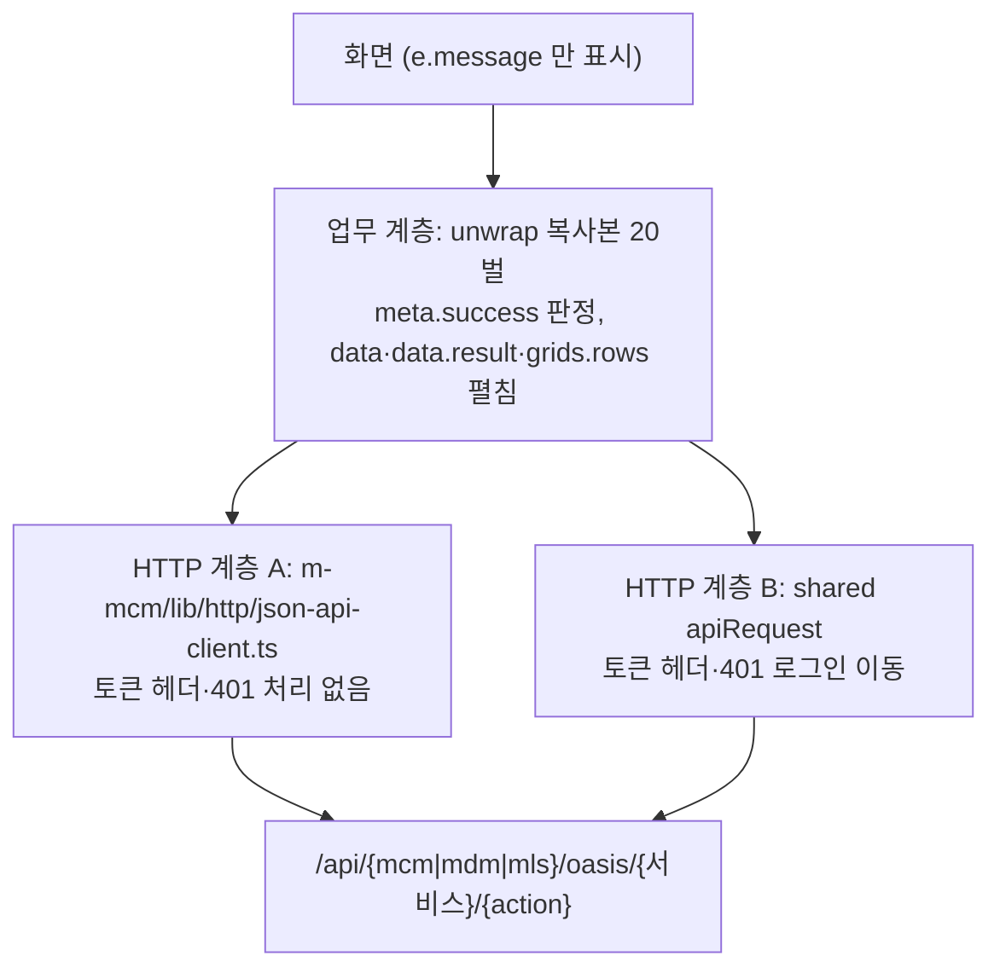

# m-mcm 화면의 OASIS 호출 복사본 20개를 공통 계층으로 옮기는 일

작성일 2026-10-04. 읽는 사람은 개발 책임자이고, 다음 단계 작업을 할지 판단하는 근거로 쓴다. 코드 기준은 `dev` 의 `af572b93` 이며, 아래 수치와 경로는 그 코드에서 다시 확인했다. 공통 계층 이름과 시그니처는 c3 레인(`refactor/frontend`)의 현재 설계안이고 아직 머지 전이므로 바뀔 수 있다.

## 1. 요약

- m-mcm 에는 OASIS 응답 봉투(`CactusEnvelope`)를 풀어 주는 같은 로직이 파일 20곳에 복사되어 있고, 함수 이름과 오류 처리가 조금씩 다르다.
- 복사본 때문에 오류 문구 통일(선택 C)이 m-mcm 에는 닿지 않고, `ObjectPickerModal` 은 서버 거부를 알아채지 못해 조용히 빈 목록을 보여 준다.
- 표준 가이드(`§7-A-2`)와 화면 예제가 이 함수를 복사하라고 안내하고 있어서, 손대지 않으면 새 화면과 새 고객사 프로젝트마다 복사본이 늘어난다.
- 호출 경로가 모듈마다 다른 것(`/api/mcm`·`/api/mdm`·`/api/mls`)은 의도된 설계이므로 바꾸지 않고, 공통 계층이 호출부에게 `basePath` 를 필수로 받게 하는 것을 조건으로 삼는다.
- 추천은 1~3단계(응답 해석 로직만 공통 계층에 위임)를 동작 보존 리팩토링으로 진행하고, 4단계(HTTP 계층 통일)는 토큰·401 동작이 바뀌므로 별도로 결정하는 것이다.

## 2. 현재 구조

호출 한 번은 두 겹을 지난다. 아래 계층은 HTTP 오류를 `Error` 로 바꾸고, 위 계층은 HTTP 200 이지만 `meta.success=false` 인 업무 거부를 `Error` 로 바꾼다. 두 계층은 서로 다른 실패를 잡으므로 중복이 아니다.

복사본 20개의 분포는 다음과 같다. 각 복사본은 `grids.{key}.rows` 를 결과에 합치고(m-mdm 공통본과 다른 점), 문구는 `meta.message?.trim() || "요청이 거부되었습니다."` 한 줄이다. 오류 코드(`meta.code`)와 `errors[]` 는 어느 복사본도 읽지 않는다.

| 묶음 | 파일 | 클라이언트 | 특징 |
|---|---|---|---|
| 같은 모양 10개 | `cma/masterCodeMng`, `cme/masterCodeMngList`, `csa/` 의 `commMenuMng`·`commObjMng`·`commPermMng`·`commRoleGrpMng`·`commRoleMng`·`commSyncMng`·`commUserMng`·`commUserRoleCopy` 의 `api.ts` | json-api-client | `unwrapPayload<T>`, 요청 meta 에 `userId:"admin"` 하드코딩 |
| 위젯 관리 3개 | `csa/commWidgetMng/api.ts`, `layout-api.ts`, `csa/screenUsageStat/api.ts` | json-api-client | `Record` 반환, `layout-api.ts` 는 서비스 이름(`objId`)이 호출마다 바뀜 |
| 홈 2개 | `home/api.ts`(`/api/mls/oasis/noticeBoard`), `home/widget-defs.ts` | `api.ts` 는 shared, `widget-defs.ts` 는 json-api-client | 경로가 mls 인 것은 의도된 설계 |
| 위젯 종류 4개 | `widget-types/_ext/api.ts`, `_query/api.ts`, `chat/chat-model.ts`, `memo/memo-model.ts` | json-api-client | unwrap 이 export 되어 시험이 쓰고, chat·memo 는 자체 오류 클래스를 던짐 |
| 캐시 관리 1개 | `csa/mdmCacheMng/api.ts`(`/api/mdm/oasis/metaFeed`) | shared | `trim` 이 없는 한 줄 변형 |

이 20개 밖에 `access-management/ObjectPickerModal.tsx` 가 있다. 이 파일은 같은 호출을 하면서 unwrap 없이 `res.grids.ds_main.rows` 를 직접 읽는다.

## 3. 왜 필요한가

1. **같은 로직이 20벌이고 이름이 제각각이다.** 본체 약 20줄이 20곳에 있어 합치면 400줄 안팎이다. 함수 이름도 `unwrapPayload`, `unwrap`, `unwrapResult`, `unwrapChat`, `unwrapMemo` 로 갈린다. 규칙을 한 번 고치면 20곳을 모두 찾아 고쳐야 한다. 근거는 2절 표의 파일들이다.
2. **오류 처리가 서로 맞지 않는다.** 던지는 오류가 일반 `Error`, `ChatServiceError`(`widget-types/chat/chat-model.ts`), `MemoServiceError`(`widget-types/memo/memo-model.ts`) 세 가지이고, `mdmCacheMng` 만 `trim` 을 하지 않으며, `null` 필터는 `commWidgetMng/api.ts` 와 `memo-model.ts` 에만 있다. 화면 코드는 오류 코드를 읽지 않고 `e.message` 만 쓰므로(chat·memo 는 클래스 판정) 차이는 겉으로 드러나지 않지만, 정책을 바꿀 때 작업량이 늘어난다.
3. **조용히 실패하는 화면이 있다.** `access-management/ObjectPickerModal.tsx` 는 `meta.success` 를 검사하지 않고 `.catch(() => setRows([]))` 로 오류를 삼킨다. 서버가 요청을 거부해도 사용자는 "대상 없음" 으로 보게 된다. 공통 해석 함수를 쓰면 이 문제를 구조적으로 막을 수 있다.
4. **오류 문구 선택 C 를 m-mcm 에 넓히려면 공통 계층이 필요하다.** 선택 C 는 "기본 문구 + 필드 코드를 화면 항목명으로 바꾼 상세" 형식이다. 이번 리팩토링에서는 m-mdm·m-mls 에만 적용된다. m-mcm 은 20곳이 각자 문구를 만들고 `errors[]` 를 아예 읽지 않으므로, 공통 계층 없이 적용하려면 20곳을 개별로 고쳐야 한다. 위임이 끝나면 한 곳의 설정 변경으로 m-mcm 전체에 같은 형식을 적용할 수 있다.
5. **새 화면을 만들수록 복사본이 늘어난다.** `docs/guide/FrontEnd/standard-v2/frontend-standard/02-state-error-api-body.md` 의 `§7-A-2` 가 `unwrapPayload` 본문을 그대로 실어 복사를 안내하고, `.claude/skills/mantine-aggrid-ui/references/examples/` 의 `grid-edit`·`list-detail`·`master-detail` 예제 `api.ts` 도 `CactusEnvelope` 를 각자 정의한다. `commWidgetMng/api.ts` 와 `_ext/api.ts` 머리 주석에는 "`screenUsageStat/api.ts` 와 같은 규칙" 이라고 적혀 있어 새 화면이 기존 화면의 복사본을 다시 복사해 만들어졌음을 알 수 있다. 이 저장소는 표준 템플릿이라 새 고객사 프로젝트로 복제되므로, 복사본과 안내문이 함께 퍼진다.

## 4. 하지 않으면 생기는 일

- m-mdm·m-mls 와 m-mcm 의 오류 문구 형식이 계속 다르고, 한 화면 체계 안에서 같은 서버 오류가 모듈에 따라 다르게 보인다.
- 오류 처리 정책을 바꿀 때마다 20곳을 수작업으로 고쳐야 하고, 빠뜨린 곳은 눈에 띄지 않는다.
- `ObjectPickerModal` 같은 조용한 실패가 새 화면에서도 반복될 수 있다.
- 가이드와 예제를 고치지 않는 한 신규 화면은 복사본을 계속 추가한다.

## 5. 공통화할 때 지켜야 할 조건과 위험

| # | 조건·위험 | 대응 |
|---|---|---|
| 1 | **모듈별 `basePath` 는 의도된 설계이므로 보존해야 한다.** UI 를 모듈별로 다른 서버에 나눠 배치할 수 있도록 일부러 `/api/mcm`·`/api/mdm`·`/api/mls` 로 나눴다. 공통 함수가 한 모듈 경로를 기본값으로 가지면 이 설계가 조용히 깨진다. | 공통 계층은 `basePath` 를 호출부가 필수 인자로 명시하게 하고 기본 경로를 두지 않는다. 변환 직후 파일별 최종 URL 을 시험 또는 grep 으로 변환 전과 대조한다. 대표 대상은 `mdmCacheMng`(mdm), `home/api.ts`(mls), `layout-api.ts`(서비스 이름 가변), `_query/api.ts`·`chat`(한 파일에 서비스 2개)이다. |
| 2 | **채팅·메모의 자체 오류 클래스.** `chatErrorMessage`·`memoErrorMessage` 가 `instanceof ChatServiceError`·`MemoServiceError` 로 서버 문구와 기본 문구를 가른다. 클래스를 바꾸면 모든 오류가 기본 문구로 가려진다. | 공통 계층이 오류 생성 훅(현재 설계안의 `errorFactory`)을 지원하면 클래스를 그대로 유지하고, 아니면 판정 대상을 공통 오류 타입 판별 함수로 바꾸고 `chat.test.ts`·`memo.test.ts` 도 함께 고친다. |
| 3 | **`null` 필터 차이.** 서버는 `null` 과 "키 없음" 을 다르게 해석한다(`memo-model.ts` 가 제목을 `""` 로 보내는 이유). 필터를 일괄 적용하면 의미 있던 `null` 이 사라진다. | 필터는 옵션으로 두고 기본을 끈다. 지금 필터를 쓰는 `commWidgetMng/api.ts`·`memo-model.ts` 만 켠다. |
| 4 | **HTTP 계층을 교체하면 동작이 새로 켜진다.** json-api-client 는 토큰 헤더와 401 이동이 없고, shared `apiRequest` 는 두 가지를 모두 한다. 또 HTTP 오류 문구(상태별 한국어 기본 문구)도 달라진다. | 1~3단계는 HTTP 호출을 그대로 두고 응답 해석만 위임한다. 교체는 4단계에서 별도로 결정한다. |
| 5 | **m-mcm vitest 의 shared 런타임 import 제약.** `commWidgetMng/api.ts`, `chat/api.ts`, `memo/api.ts`, `_ext/api.ts`, `_query/api.ts`, `home/widget-defs.ts` 의 머리 주석이 "shared dist 없이 시험한다" 며 런타임 import 를 금지한다. `vitest.config.mts` 에는 `@/` 별칭만 있고 `@dk-oasis/*` 별칭은 없다. | 1단계 첫 파일로 시범 전환해 방법을 정한다. 후보는 시험 전에 shared 를 빌드하는 것, 시험에서 `vi.mock` 으로 대체하는 것(`tests/csa/mdmCacheMng/api.test.ts` 가 이미 이 방식), 별칭을 shared 소스로 두는 것이다. |
| 6 | **`userId:"admin"` 하드코딩.** 같은 모양 10개의 요청 meta 에 들어 있고, 나머지 복사본은 `menuId` 만 보내 서버가 사용자를 채운다. | 공통 계층이 meta 를 만들더라도 이번에는 현재 값을 그대로 보낸다. 제거는 서버 영향 확인 뒤 별도로 결정한다(7절). |
| 7 | **export 된 unwrap 을 쓰는 시험.** `home/api.ts`(`unwrap`), `_ext`(`unwrapPayload`), `_query`(`unwrapResult`), `chat`(`unwrapChat`), `memo`(`unwrapMemo`) 가 export 되고, `_ext`·`_query`·`chat`·`memo` 의 `*.test.ts` 4개가 "요청이 거부되었습니다." 문구를 고정한다. | export 이름과 시그니처를 유지한 채 본문만 공통 함수 호출로 바꾼다. 문구를 고정한 시험이 그대로 통과하는지가 동작 보존의 기준이다. |
| 8 | **기타.** `mdmCacheMng` 의 `trim` 차이, `ObjectPickerModal` 을 고치면 조용한 빈 목록이 오류 표시로 바뀌는 동작 변화, 공통 오류 클래스가 shared 의 서로 다른 진입점에 중복 포함되면 `instanceof` 가 깨지는 문제(c3 가 `isOasisCallError` 판별 함수로 대응하는 안을 검토 중)가 있다. | 앞의 둘은 각각 단계 3과 별도 결정 항목으로 두고, 마지막은 m-mcm 이 `@dk-oasis/shared/http` 에서만 import 하게 하여 피한다. |

## 6. 진행 방안

각 단계는 `README.md` 의 규율대로 「특성 시험 → 변경 → 같은 시험 통과 → 리뷰」 순서로 하고, 동작이 바뀌는 변경은 리팩토링 커밋과 섞지 않는다. 오류 문구를 선택 C 로 바꾸는 일은 어느 단계에서도 동작 변화이므로 별도 `fix` 커밋으로 둔다(7절 결정).

| 단계 | 범위 | 동작 변화 | 확인 방법 | 규모 |
|---|---|---|---|---|
| 0. 선행 | c3 의 공통 계층이 dev 에 머지되고 이름이 확정되기를 기다린다. 시범 파일 하나로 위험 5(vitest)를 먼저 풀어 본다. | 없음 | 시범 파일의 시험이 shared 를 포함해 통과 | 소 |
| 1. 같은 복사본 13개 위임 | 같은 모양 10개와 위젯 관리 3개(`commWidgetMng/api.ts`, `layout-api.ts`, `screenUsageStat/api.ts`). 각 파일의 `unwrapPayload` 본문을 공통 `unwrapOasis`(응답 grids 포함, 기본 문구 한 줄) 호출로 바꾼다. 경로와 HTTP 클라이언트는 그대로 둔다. | 없음 | 파일별 최종 URL 과 요청 본문을 변환 전후로 대조하고, 같은 입력 봉투에 대한 출력이 같은지 표본 특성 시험으로 고정한다. | 파일 13개, 약 250줄 삭제와 약 40줄 추가 |
| 2. export 형 4개 | `home/api.ts`, `home/widget-defs.ts`, `widget-types/_ext/api.ts`, `widget-types/_query/api.ts`. export 이름은 유지하고 본문만 위임한다(`widget-defs.ts` 의 `unwrap` 은 export 되지 않는다). | 없음 | 기존 시험(`_ext`·`_query` 의 `api.test.ts`)과 문구 시험이 수정 없이 통과. `home/api.ts` 가 `/api/mls/oasis` 인 점을 URL 대조로 확인 | 파일 4개 + 시험 확인 |
| 3. 채팅·메모·캐시 관리 | `chat/chat-model.ts`, `memo/memo-model.ts`, `csa/mdmCacheMng/api.ts`. 오류 클래스는 위험 2 의 방식으로 유지하거나 판별 함수로 교체하고, `mdmCacheMng` 은 `trim` 차이를 허용하는지 확인한다. | 클래스 유지 시 없음, `mdmCacheMng` 은 앞뒤 공백이 있는 메시지에서만 차이 | `chat.test.ts`·`memo.test.ts` 와 `tests/csa/mdmCacheMng/api.test.ts` 통과, 서버 문구와 기본 문구가 구분되어 표시되는지 확인 | 파일 3개 + 시험 3개 안팎 |
| 4. HTTP 계층 통일 | json-api-client 를 shared `apiRequest` 로 교체하거나 json-api-client 를 유지한다. 대상은 json-api-client 를 쓰는 19개 파일과 `ObjectPickerModal` 이다. | 있음: 토큰 헤더, 401 로그인 이동, HTTP 오류 문구 | 별도 결정 뒤, 로그인 만료·권한 없음·서버 오류 3경우를 화면에서 비교(브라우저 확인은 조정 세션에 요청) | 파일 약 20개 + vitest 설정 |

`ObjectPickerModal` 은 1~3단계에 넣지 않고 7절 결정 뒤에 처리한다. 오류 문구 선택 C 의 m-mcm 적용은 1~3단계가 끝난 뒤 공통 계층의 문구 설정을 켜는 한 번의 변경이 되도록 계획하고, 필드 코드를 항목명으로 바꾸는 사전은 m-mdm·m-mls 쪽 설계에 맞춘다.

## 7. 결정이 필요한 것

1. **1~3단계를 이번 리팩토링 기간에 진행할지**, 아니면 c3 의 m-mdm·m-mls 이전이 dev 에 머지된 뒤로 미룰지.
2. **4단계(HTTP 계층 통일)를 할지.** 하면 m-mcm 에 토큰 헤더와 401 로그인 이동이 새로 생기고, 하지 않으면 m-mcm 안에 HTTP 계층이 계속 둘이다(`cmb`·`cmz`·`cma` 일부 repository 와 `home/widget-store.ts` 는 이미 shared `apiRequest` 를 쓴다).
3. **`ObjectPickerModal` 의 오류 노출.** 거부를 오류 메시지로 보여 줄지(추천), 지금처럼 빈 목록으로 둘지. 바꾸면 사용자에게 보이는 동작이 달라진다.
4. **`userId:"admin"` 하드코딩.** 이번에는 그대로 두고, 제거해도 서버가 인증 정보로 채우는지를 따로 확인한 뒤 지울지.
5. **오류 문구 선택 C 를 m-mcm 에 적용하는 시점.** 위임 직후에 켤지, 서버 응답의 `errors[]` 유무와 화면의 줄바꿈 표시를 확인한 뒤 켤지.
   - 2026-10-04 추가 확인: 지금 OASIS 경로는 `errors[]` 를 응답에 싣지 않는다. serviceTask 의 `BusinessException` 은 oasis-core `CoreServiceStarter.start` 의 `catch(Exception)` 에서 `SYSTEM_ERROR` + message 로 바뀌고, `CactusResponseConverter.convertError` 는 `meta.code`·`meta.message` 만 싣는다(근거: `docs/mdm/tasks/TSK-04-04/design.md` F12). 그래서 cactus 층에서 `errors[]` 를 싣는 보강을 a8 레인(항목 8)이 맡았다. 이 보강이 dev 에 들어오기 전에는 선택 C 를 켜도 기본 문구 한 줄만 보인다.
   - shared `ErrorModal` 은 본문 `
` 에 줄바꿈 규칙이 없어 상세가 한 줄로 합쳐진다. `white-space: pre-line` 추가는 shared 모습 변경이라 사용자 승인 대상이다.
6. **가이드와 예제의 갱신.** `§7-A-2` 와 `mantine-aggrid-ui` 예제 `api.ts` 3개를 공통 계층 사용법으로 바꿀지. 바꾸지 않으면 3절 5번의 복사 증가가 계속된다. 이 문서 작업에서는 수정하지 않았다.

## 8. 근거 자료

- 대조표(m-mcm 20개, json-api-client 조사, 위험 10가지): `/private/tmp/claude-501/-Users-jji-project-dmes-standard/301f7853-5deb-4f1a-9f6f-b2fda153d5f2/scratchpad/r2-mcm-table.md`
- m-mdm·m-mls 대조표와 공통 계층 계약 제안: 같은 폴더의 `r2-mdm-mls-table.md`
- 레인 구성과 규칙: `docs/refactor-2026-10/README.md`
- HTTP 계층: `src/frontend/m-mcm/lib/http/json-api-client.ts`, `src/frontend/shared/src/http/index.ts`
- 기존 m-mdm 공통본(현재 dev, 아직 shared 로 옮기기 전): `src/frontend/m-mdm/src/dme/oasis-call.ts`
- 복사본 20개: 2절 표의 파일들(`src/frontend/m-mcm/page-components/**/api.ts`, `widget-types/**`)
- 조용한 실패: `src/frontend/m-mcm/page-components/access-management/ObjectPickerModal.tsx`
- 시험 설정과 시험: `src/frontend/m-mcm/vitest.config.mts`, `widget-types/{_ext,_query,chat,memo}` 의 `*.test.ts`, `tests/csa/mdmCacheMng/api.test.ts`
- 복사를 안내하는 문서: `docs/guide/FrontEnd/standard-v2/frontend-standard/02-state-error-api-body.md` 의 `§7-A-2`, `.claude/skills/mantine-aggrid-ui/references/examples/*/api.ts`
