# 룰 엔진 직접 실행 검증과 성능 프로파일 (2026-10-05)

- 질문: "룰 엔진에 대해 직접 실행해 검증이 다 됐나? 또 성능 프로파일을 분석해 달라."
- 기준 커밋: dev `6709ce7e`
- 진행 방식: 조정 세션 하나가 레인 두 개(검증 `rule-verify`, 프로파일 `rule-profile`)에 나눠 맡겼다. 두 레인 모두 Opus/high 로 돌았다. 시험과 측정은 별도 워크트리에서 했고, 실서버 확인은 메인 체크아웃에서 이미 떠 있던 서버를 그대로 썼다. 서버 재기동, 저장소 수정, 공용 DB 쓰기는 하지 않았다.
- 레인 원본 보고서와 증거: `~/.coord/rule-engine-2026-10-05/lanes/verify/report.md`, `~/.coord/rule-engine-2026-10-05/lanes/profile/report.md` (저장소 밖. `profile/p3/hdr.txt` 에는 로컬 클라이언트 키가 있으니 공유할 때 주의한다)

---

## 1. 요약

| 질문 | 답 |
|---|---|
| 직접 실행 검증이 다 됐나 | **다 되지 않았다.** 엔진 시험은 모두 통과했다. mdm 서버의 값 테스트 경로(룰 단건, 룰 세트 traceSet, 도메인 검증)는 실서버에서 직접 돌려 확인했다. 하지만 업무 저장 경로의 엔진 검증은 입구까지만 확인했고, 룰 세트 저장 검증(`evaluateSet`)은 실서비스에서 부르는 곳이 없다. |
| 엔진은 어디서 시간을 쓰나 | 판정 1회(약 215µs, C2)의 **약 75%** 가 식을 하나 평가할 때마다 가상 스레드로 넘기고 돌려받는 비용이다. 식 계산 자체는 10% 정도다. |
| 실서버 요청은 어디서 시간을 쓰나 | 판정 요청 1건(평균 38ms)에서 엔진 몫은 **1~4%** 다. 대부분은 mdm 앱이 컬럼 사전을 변수마다 따로 조회하는 비용과, 조회할 때마다 Hibernate 가 자동 flush 로 더티 검사를 하는 비용이다. |
| 무엇부터 고치면 좋나 | 단건 응답 시간은 앱 쪽(컬럼 사전 한 번에 읽기)이 먼저다(−35~−55% 추정). 엔진 쪽(순수 식 직접 평가)은 −65~−75% 지만, 룰 세트 저장 검증이나 일괄 판정이 생겨야 체감된다. |

---

## 2. 직접 실행 검증

### 2.1 판정 기준

- **직접 실행 확인**: 이번에 실행 중 서버나 gradle 실행에서 그 코드 경로를 실제로 타는 결과를 관찰했다.
- **시험으로만**: 단위 시험만 있다.
- **미확인**: 시험도 관찰도 없다.

실행 중 서버는 다음과 같다. 서버가 뜬 뒤 dev 에 들어온 커밋은 모두 서버 기동 전 시각이어서, 검증한 코드와 서버 코드가 같다고 보았다.

| 서버 | 포트 | 기동 | 이번 검증 사용 |
|---|---|---|---|
| mls | 8092 | 08:47 | 저장 검증(noticeMgmt) |
| mdm | 8096 | 09:09 | 룰·룰 세트·도메인 값 테스트, 실서버 프로파일 |
| mcm·포털 | 8100·5100 | 08:47 | 쓰지 않음 |

### 2.2 한눈에 보기

초록은 직접 실행 확인, 노랑은 일부만 확인, 빨강은 시험으로만 검증된 곳이다.

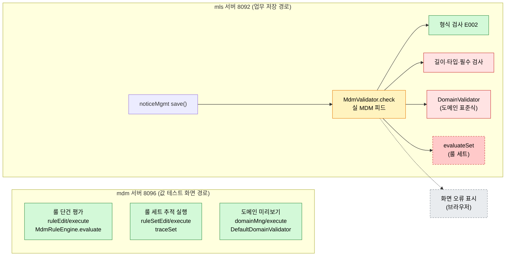

- 점선 빨강 `evaluateSet` 은 업무 코드가 아무 룰 세트도 넘기지 않아서, 실서비스에서 한 번도 불리지 않는다.
- 회색 화면 표시는 이번에 브라우저를 쓰지 않아 확인하지 않았다.

### 2.3 시험 실행 결과 (V1)

| 대상 | 명령 요지 | 통과 | 실패 | 건너뜀 |
|---|---|---|---|---|
| maru-mdm-engine 전체 | `gradlew -p maru-mdm-engine test` | 1,628 | 0 | 1 |
| cactus-core `com.dongkuk.dmes.cactus.mdm.*` | `gradlew -p cactus-core :test --tests …` | 297 | 0 | 0 |
| mls noticeMgmt 저장 검증(참고) | `NoticeMgmtMdmSaveTest`·`NoticeMgmtMdmRealValidatorTest` | 11 | 0 | 0 |

- 건너뛴 1건은 `RuleSetPrepareBenchTest` 다. `MDM_BENCH` 환경변수가 있을 때만 돈다(이 벤치는 6장 프로파일에서 따로 돌렸다).
- mls 시험 두 개는 실제 MDM 데이터로 검증했다고 보기 어렵다.
  - `NoticeMgmtMdmSaveTest` 는 `MdmValidator` 를 Mockito 가짜로 바꾼다. `save()` 가 검증기를 부르는지만 본다.
  - `NoticeMgmtMdmRealValidatorTest` 는 진짜 엔진을 쓰지만, TITLE 칸 하나만 아는 가짜 MDM 피드를 쓴다(클래스 주석 :38, 피드 :56-70).

### 2.4 항목별 판정

| # | 항목 | 판정 | 근거 요지 |
|---|---|---|---|
| 1 | 엔진 단위 시험 | 직접 실행 확인 | 1,628 통과, 실패 0 |
| 2 | cactus MdmValidator 시험 | 직접 실행 확인 | 297 통과, 실패 0 |
| 3 | 룰 단건 평가 (mdm 값 테스트) | 직접 실행 확인 | 저장된 케이스 69/69 통과 |
| 4 | 룰 세트 traceSet (mdm 값 테스트) | 직접 실행 확인 | LS_A3, BR2_FLOW_CHECK |
| 5 | 룰 세트 evaluateSet (운영 경로) | **시험으로만** | 실서비스 호출자 없음 |
| 6 | 도메인 검증기 (mdm 도메인 미리보기) | 직접 실행 확인 | 통과·표준식 위반 모두 관찰 |
| 7 | 저장 검증 입구 (noticeMgmt, 실 MDM 피드) | 직접 실행 확인 | 형식 오류 E002 3건 |
| 8 | 저장 검증 안의 도메인 위반 판정 | **시험으로만** | TITLE 에 걸 거리가 없음 |
| 9 | 저장 검증 안의 길이·타입·필수 검사 | **시험으로만** | 업무 수작업 검증과 DB 제약에 가려짐 |
| 10 | RealValidatorTest 의 실 피드 대체 | 시험으로만 (실 피드 미확인) | 가짜 TITLE 피드 |
| 11 | 화면 오류 표시 | **미확인** | 브라우저를 쓰지 않음 |

각 항목의 상세는 다음과 같다.

**3. 룰 단건 평가**
- 요청: `POST /oasis/ruleEdit/execute`
- 경로: `RuleEditService.java:123` → `RuleValueTestService.run:103` → `new MdmRuleEngine` → `RuleCaseJudge.java:74 engine.evaluate`

| 룰 | 결과 | 케이스 |
|---|---|---|
| QLTY_GRD_JDG | QLTY_GRD A, PRC_FCT 1.05 | 3/3 |
| BASE_SPD_LKP | BASE_SPD 90, COL 4 | 63/63 |
| PROD_WGT_CALC | PROD_WGT 25434 | 3/3 |

- 이 경로에는 저장·수정 호출이 없다(코드에서 확인, 서비스 주석도 "원장에 쓰지 않는다").

**4. 룰 세트 traceSet**
- 요청: `POST /oasis/ruleSetEdit/execute`
- 경로: `RuleSetEditService.simulate:540` → `RuleSetRunner.Session.trace:139` → `engine.traceSet` (`RuleSetRunner.java:169`)
- LS_A3: 노드 5개, BASE_SPD·EXC_SPD·LINE_SPD 모두 80. 케이스 1 통과, 케이스 2·3 은 기대값이 비어 판정하지 못했다.
- BR2_FLOW_CHECK: 노드 6개, QLTY_GRD B, PRC_FCT 0.98, 케이스 1/1 통과.
- 사용 중(INUSE) 세트 9개 가운데 의미 있는 입력으로 돌린 세트는 2개다.

**5. evaluateSet 은 실서비스 호출자가 없다**

`evaluateSet` 과 `traceSet` 은 다른 메서드다(`RuleEngine.java:28` 대 `:34·:41`). 4번 결과를 이 항목의 근거로 쓰지 않았다. main 소스에서 `evaluateSet` 을 부르는 곳은 두 곳뿐이다.

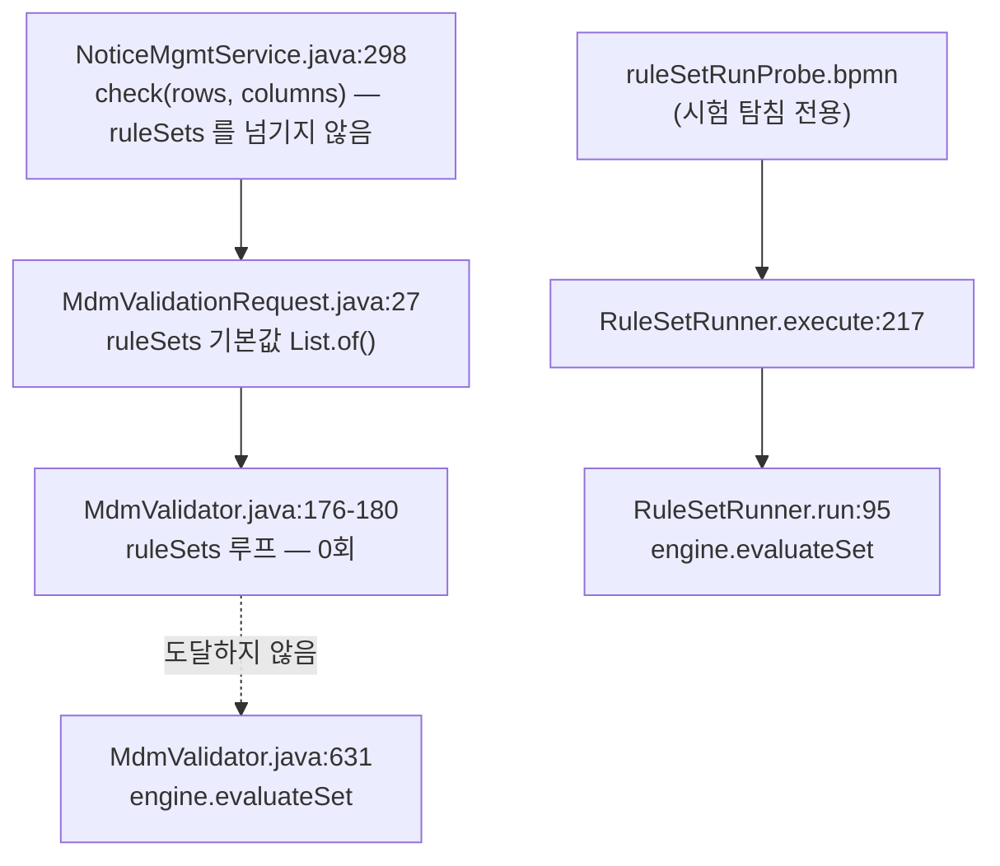

- 실서버도 같은 사실을 보여 준다. mls 의 `mdmMeta/status` 응답에서 캐시된 RULE 은 0건, RULE_SET 은 0건이다.
- 그래서 판정은 "evaluateSet 은 실서비스 호출자 없음, 시험으로만 검증"이다. 시험 근거는 `RuleSetEvaluationTest`, `RuleSetFlowEvaluationTest`, `MdmValidatorTest:417·446·472` 다.

**6. 도메인 검증기**
- 요청: `POST /oasis/domainMng/execute` → `DomainTestCaseRunner.java:162-163` 에서 `new DefaultDomainValidator(...).validate`

| 도메인 | 통과한 값 | 실패한 값 |
|---|---|---|
| PH | `7.0` | `15`, `-1` (표준식 위반) |
| IP | `10.0.0.1` | `abc` |
| CUST_CD | `0123456789` | `12AB` |

- 실패 문구는 엔진 문구("유효 표준식이 거짓이다: …")가 그대로 나왔다.
- 한계: 이 API 는 요청에 담긴 표준식으로 초안 도메인을 만들어 판정한다. "엔진 클래스가 실서버에서 돌았다"는 맞지만, "저장된 도메인 정의를 서버가 스스로 읽어 판정했다"는 확인하지 않았다.

**7~9. 업무 저장 검증 (noticeMgmt)**

저장 검증은 아래 순서로 칸을 검사한다. 이번 실서버 관찰은 첫 번째 갈래에서 끝났다.

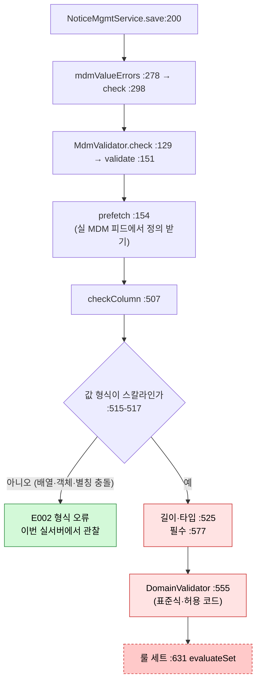

- 위반 요청: C 행 3개(TITLE 배열, TITLE 과 `title` 별칭 충돌, TITLE 객체)를 보냈다. TITLE 칸 E002 오류 3건이 rowKey 가 채워진 채로 왔다. rowKey 가 채워졌다는 것은 MdmValidator 가 만든 오류라는 뜻이다. 캡션 "제목"도 실 MDM 피드에서 왔다.
- 그 뒤 갈래를 실서버에서 볼 수 없는 이유는 TITLE 칸의 메타와 DB 제약 때문이다.

| 구분 | TITLE 의 값 | 결과 |
|---|---|---|
| MDM 메타 | STRING 1000, 필수 아님, 도메인 183 TEXT, 표준식·비즈니스 룰·허용 코드 없음 | 도메인 위반과 필수 위반이 날 수 없다 |
| 업무 수작업 검증 | 200자 제한 (`validateRow :397~`) | MDM 길이(1000)보다 먼저 걸린다. `withoutShadowedMdmErrors :315` 가 겹치는 MDM 오류를 지운다 |
| DB | `VARCHAR(200) NOT NULL` (mls `V2__create_notice.sql:14`) | MDM 보다 엄격하다 |

- 공용 DB 쓰기는 0건이었다. 모든 위반 행에서 NOTICE_STATUS 를 빼서 수작업 오류가 반드시 나게 했고, 그래서 insert 까지 가지 않았다. 저장 전후 조회 결과가 모두 6건이고 최대 번호도 `NT202610040001` 로 같았다.

### 2.5 응답의 meta.code 가 S001 이다 (알려진 프레임워크 관례)

설계(스펙 2026-10-03 C9)는 저장 검증 실패를 `BusinessException(INVALID_VALUE, …)` 로 던진다고 정했다. 실서버 응답은 HTTP 200 에 `meta.success=false`, `meta.code=S001`, `errors[]` 가 함께 왔다. `S001` 은 성공 코드가 아니라 `ErrorCode.INTERNAL_ERROR`(서버 내부 오류) 코드다. (레인 보고와 이 문서 첫 판은 S001 을 성공 코드로 잘못 적었다.)

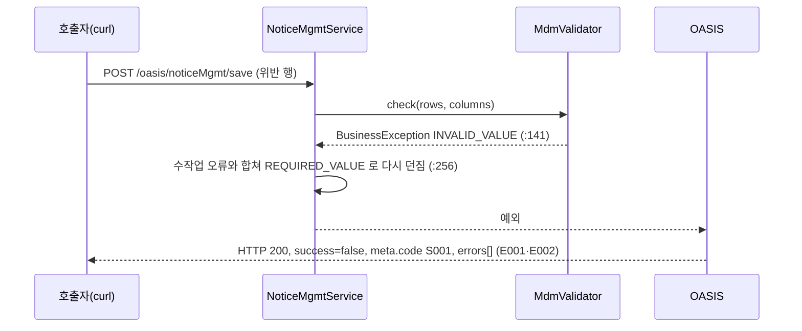

- 원인: BPMN serviceTask 안에서 던진 예외는 OASIS 가 SYSTEM_ERROR 로 바꾼다. `CactusResponseConverter.convertError`(:97-101)는 원인 사슬에 `ResponseCodeAware` 가 없으면 `S001`(UserException 만 `E001`)을 쓴다. `BusinessException` 은 `ResponseCodeAware` 가 아니라서 E001·E002 대신 S001 이 된다. 이것은 TSK-04-04 design F12 에 적힌 기존 관례이며, 이번 저장 검증만의 문제가 아니다. HTTP 200 도 OASIS 응답의 공통 관례다.
- 영향: 실패 여부(`meta.success=false`)와 칸 오류(`errors[].code` E001·E002, field, rowKey)는 맞게 온다. 화면은 이 둘을 읽으므로 동작에는 지장이 없다. 다만 `meta.code` 로 오류 종류를 가르는 곳(모니터링·로그 집계·연동 시스템)이 있다면 사용자 입력 오류가 서버 내부 오류로 분류된다.
- 바로잡는 방법(제안): `BusinessException` 이 자기 `ErrorCode` 를 `ResponseCodeAware` 로 알려 주게 하면 `meta.code` 가 E001·E002 가 된다. cactus-core 공통 동작이 바뀌므로 S001 을 기대하는 기존 시험·화면이 있는지 먼저 본다.

### 2.6 남은 빈칸

| 우선 | 할 일 | 필요한 것 |
|---|---|---|
| 높음 | 저장 경로에서 도메인 위반, 길이·타입·필수 검사를 실서버로 관찰 | **시연용 칸**: DB 제약·수작업 검증보다 엄격하지 않고, 표준식·허용 코드·필수 중 하나가 있는 칸. 후보는 PH·CUST_CD 처럼 표준식이 있는 도메인을 쓰는 칸, 또는 NOTICE_STATUS 를 허용 코드 도메인에 묶는 방법. MDM 메타와 업무 코드를 바꾸므로 사용자 결정이 필요하다 |
| 높음 | evaluateSet 을 실서비스에서 처음 실행 | ruleSets 를 넘기는 첫 업무 save 와, mls 캐시에 RULE_SET 이 1건 이상 올라온 것 확인 |
| 중간 | 흐름이 비어 있는 사용 중 세트(LS_A3·PKG_WGT·QG_A1 등)에서 evaluateSet 과 traceSet 결과가 같은지 | 같은 입력으로 두 결과의 finalValues 를 비교하는 시험 |
| 중간 | 2.5 의 응답 모양 | 스펙·프론트·실제 응답 대조 |
| 낮음 | RealValidatorTest 가 실 피드 모양을 쓰게 | 실 `/mdmMeta/columns` 응답을 고정 자료로 저장 |
| 낮음 | LS_A3 케이스 2·3 기대값 채우기 | — |

---

## 3. 성능 프로파일: 측정 설계

### 3.1 무엇을 쟀나

| 측정 | 대상 | 시각 | 방법 |
|---|---|---|---|
| P1 벤치 | `RuleSetPrepareBenchTest` (1,000행 × 세트 N=1·5·20, 룰 9개·노드 17개 흐름) | 09:52~09:58 | 시험 JVM 에 JFR(`settings=profile`)을 붙여 두 번 실행 (c1·c2) |
| P3-a 넘김 대조 | 식 1회 평가의 세 경로 | 10:30 | 같은 JVM 안에서 번갈아 측정, JFR 없음 |
| P3-b 실서버 | mdm 8096 `ruleSetEdit/execute` 382건 | 10:30~10:31 | `jcmd JFR.start duration=70s` |

- 측정할 때마다 다른 레인의 무거운 작업을 멈추게 했고, `heavy.sh --exclusive` 로 실행했다. load 는 1.0~2.5 사이였다.
- 이 PC(팬 없는 MacBook Air M5)는 같은 설정을 반복해도 2배까지 흔들린다. 그래서 절대 시간보다 같은 JVM 안의 비율과 순위로 판단했다.
- 빌드 파일은 고치지 않았다. JFR 은 gradle init script 로 시험 JVM 에만 넣었다.

### 3.2 벤치의 세 경로

| 경로 | 뜻 | 운영에서 해당하는 경우 |
|---|---|---|
| A 기억 적중 | 같은 세트 정의 객체가 다시 와서, 세트 판정 준비 결과를 재사용한다 | 오래 사는 엔진에 같은 정의가 계속 오는 경로(cactus MdmValidator 형) |
| B 기억 놓침 | 준비를 매번 새로 한다 | 정의 객체가 매번 새로 만들어지는 경로 |
| C 준비만 | 준비 단계만 따로 잰다 | — |

### 3.3 C1 과 C2: 왜 두 번 쟀나

- gradle 시험 관례는 `-XX:TieredStopAtLevel=1` 이라 C1 컴파일러만 쓴다. 10-04 P5 측정도 이 조건이었다.
- 로컬 mdm 서버도 C1 만 쓴다. Spring Boot gradle 플러그인 4.0.6 의 `bootRun` 이 `optimizedLaunch` 기본값으로 이 옵션을 붙이기 때문이다(`be-run.sh:678` 이 `:api:bootRun` 으로 띄움). 저장소 설정에는 이 옵션을 끄는 줄이 없다.
- 운영은 WildFly 배포라 C2 를 쓸 가능성이 높다(운영 JVM 옵션은 저장소에 없어 추정이다).
- 그래서 c1 은 P5 와 대조하는 데, c2 는 운영 핫스팟을 판단하는 데 썼다.

---

## 4. 성능 프로파일: 벤치 결과

### 4.1 판정 1회 시간

중앙값, µs/호출. N=1·5·20 의 값이 거의 같아 N=1 을 대표로 그렸다.

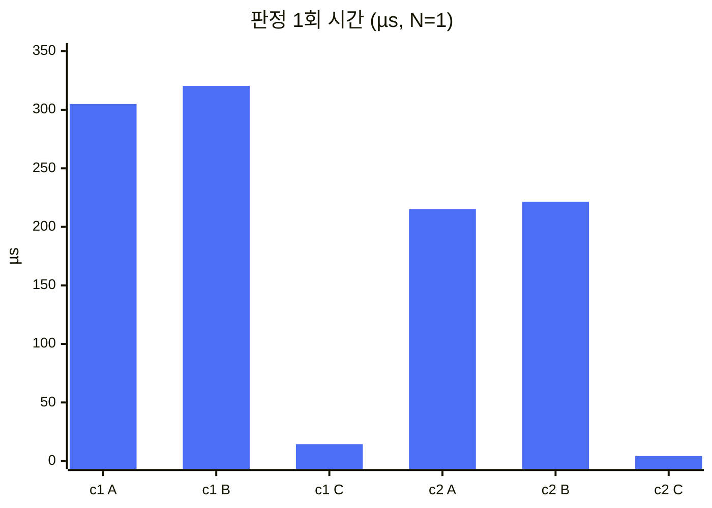

| 컴파일러 | N | A | B | C | B−A |
|---|---|---|---|---|---|
| c1 | 1 | 304.9 | 320.4 | 14.4 | 17.5 |
| c1 | 5 | 302.7 | 320.1 | 14.2 | 16.9 |
| c1 | 20 | 304.2 | 319.8 | 14.1 | 16.4 |
| c2 | 1 | 215.0 | 221.4 | 4.2 | 6.4 |
| c2 | 5 | 215.5 | 220.7 | 4.0 | 4.8 |
| c2 | 20 | 215.2 | 221.7 | 3.9 | 6.6 |

읽는 법:
- c1 값은 10-04 P5(A 293~297, B−A 15~19)와 비슷하다. 측정 환경이 그때와 같다는 근거다.
- C1 에서 C2 로 가면 순수 Java 인 준비(C)는 3.6배 빨라지는데, 판정 전체(A)는 1.4배만 빨라진다. **판정 시간의 큰 몫이 컴파일러와 무관한 곳(커널·스레드 전환)에 있다**는 첫 신호다.
- 준비 결과 재사용 효과(B−A)는 C2 에서 판정의 약 2% 다. P5 가 C1 으로 잰 4~5% 보다 작다.

### 4.2 식마다 가상 스레드로 넘기는 구조

`MdmEvaluator.evaluate` 는 식 하나를 평가할 때마다 가상 스레드에 작업을 제출하고 결과를 기다린다(`MdmEvaluator.java:135-155`).

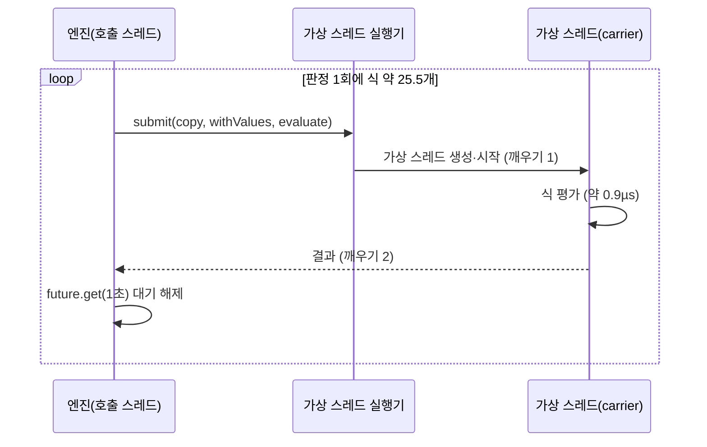

- 이유: EvalEx 에는 범용 평가 제한 시간이 없다(정규식만 있다). 그래서 설계(TSK-03-02 design.md:30·:588)가 "가상 스레드에서 돌리고 1초 뒤 기다림을 끊는다"로 정했다. 코드 주석 `MdmEvaluator.java:38-40` 도 같다.
- 실제 보호 범위: 같은 주석이 밝히듯, 인터럽트를 보지 않고 CPU 만 쓰는 폭주 계산은 이 방식으로도 멈추지 않는다. 호출자만 1초 뒤 풀려나고, 그 작업은 끝까지 돈다. 실제로 끊기는 것은 DB 조회처럼 기다리는 함수(MASTER·MASTER_AT·업무 함수)뿐이다.
- 정규식 폭주 차단은 이 넘김과 별개다. `STR_MATCHES` 의 100ms 제한(`MdmExpressionConfig.java:28-29`)은 EvalEx 가 `nanoTime` 으로 직접 검사하므로, 호출 스레드에서 평가해도 그대로 지켜진다.
- 근거 신호: 식 1회마다 문맥 전환이 2회(c1 1.99, c2 2.01) 일어났고, 커널 시간이 식당 3.4~3.8µs 로 컴파일러와 무관했다.

### 4.3 넘김 비용을 직접 잰 결과 (P3-a)

식 하나를 세 경로로 같은 JVM 안에서 번갈아 쟀다. 식 모양 10개, 16키 행 1,000개, 블록당 2,000회, 30회 중앙값이다.

| 경로 | 뜻 |
|---|---|
| A 지금 | `MdmEvaluator.evaluate` (가상 스레드로 넘김) |
| D 직접 | 같은 일을 호출 스레드에서 바로 실행 |
| H 빈 넘김 | 빈 작업 `() -> 1` 을 같은 방식으로 넘기기만 함 |

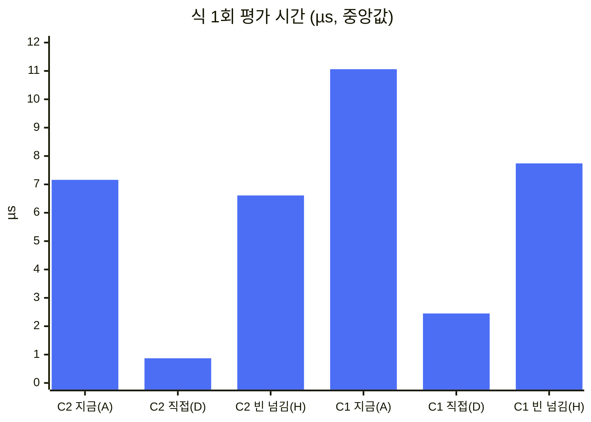

| 컴파일러 | A | D | H | A−D | 식 평가 중 넘김 몫 (A−D)/A | A/D |
|---|---|---|---|---|---|---|
| C2 | 7.16 | 0.87 | 6.61 | 6.27 | **88%** | 8.3배 |
| C1 | 11.06 | 2.45 | 7.74 | 8.58 | **78%** | 4.5배 |

- 빈 넘김 H 가 A−D 와 거의 같다(C2 105%, C1 90%). 그러니까 A 와 D 의 차이는 거의 전부 넘김 자체다.
- C1 에서 C2 로 갈 때 D 는 2.8배 빨라지지만 H 는 1.17배만 빨라진다. 넘김 비용은 컴파일러로 줄일 수 없다.

### 4.4 판정 1회 시간 분해 (C2, 벤치 A 215µs)

판정 1회의 식 평가 횟수는 실측 25.55회다. 이 값을 곱해 판정 1회 시간을 나누면 다음과 같다.

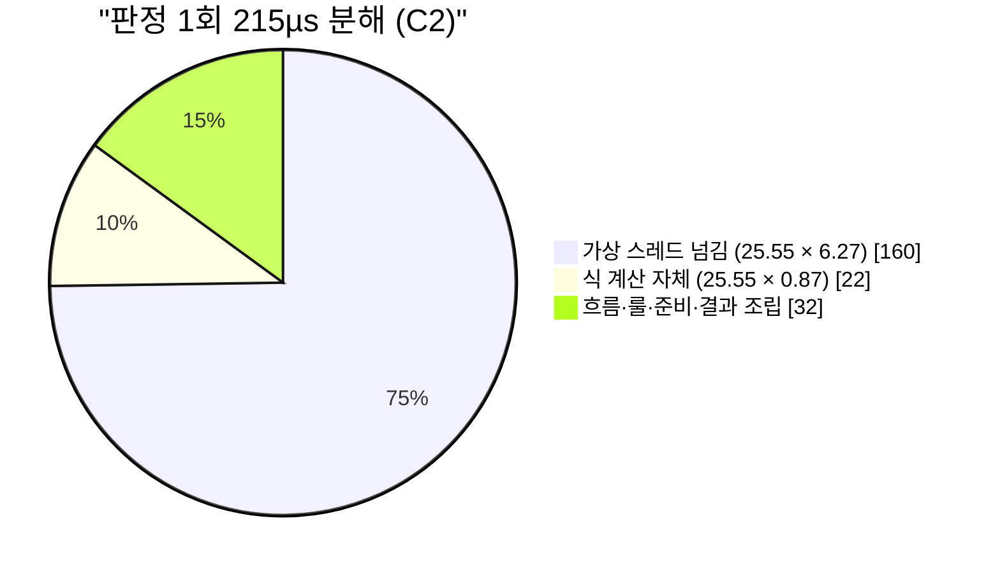

| 몫 | C2 | C1 |
|---|---|---|
| 넘김 25.55×(A−D) | 160µs (75%) | 219µs (72%) |
| 식 계산 25.55×D | 22µs (10%) | 63µs (21%) |
| 식 밖 나머지 | 약 32µs (15%) | 약 22µs (7%) |
| 벤치 A | 215µs | 305µs |

- 분모(벤치 A)는 JFR 을 붙인 다른 실행에서 잰 값이라, 환산 몫은 ±5%p 로 읽는다.

### 4.5 넘김 밖의 핫스팟

JFR 표본은 가상 스레드 표본을 많이 잃는다(JDK 21·macOS). 그래서 아래 순위는 c2 호출 스레드 표본 안에서만 쓴다. 넘김 다음 순위의 개선 후보를 고르는 근거다.

| 순위 | 프레임 | 하는 일 | 위치 |
|---|---|---|---|
| 1 | 식마다 가상 스레드 생성·제출·park/unpark | 넘김 (4.3~4.4절) | `MdmEvaluator.java:59, 135-142` |
| 2 | `FlowKeys.check` → `walk` | 호출마다 필요한 키 집합을 HashSet 으로 다시 계산 | `MdmRuleEngine.java:241`, `FlowKeys.java:128-241` |
| 3 | `RuleEvaluator.resultNames·columns·slots` | 매번 정렬 2회와 Slot 생성 | `RuleEvaluator.java:529-568` |
| 4 | `Run.evaluate` 의 `new LinkedHashMap<>(ctx)` | 룰마다 ctx 전체 복사 | `RuleEvaluator.java:109` |
| 5 | `withValues` → 대소문자 무시 TreeMap 에 값 넣기 | 평가마다 변수 15.6개를 넣지만 읽는 것은 1.8개 | `MdmEvaluator.java:137` |
| 6 | 나눗셈 `BigDecimal.divide(mc68)` | 68자리로 나눈 뒤 0을 한 자리씩 지움 | `MdmExpressionConfig.java:21` |

할당은 판정 1회에 약 152KB(식 1회에 약 6KB)다. GC 정지는 전체의 0.28% 라 무시해도 된다.

---

## 5. 성능 프로파일: 실서버 결과

### 5.1 요청 1건

- mdm 8096 `POST /oasis/ruleSetEdit/execute` 382건이 모두 HTTP 200 이었다. 판정만 하고 쓰지 않는 경로다.
- 평균 38.3ms, 중앙값 42.5ms, p90 45.6ms, 최대 75.7ms 였다.
- 흐름별로는 룰 8개 흐름이 평균 43.1ms, 룰 1개 흐름이 평균 23.8ms 였다. 차이를 룰 수로 나누면 **룰 하나에 약 2.8ms** 다. 이것은 엔진이 룰 하나에 쓰는 시간(약 34µs)의 약 80배다.
- 요청 시간은 기다림이 아니라 요청 스레드의 CPU(요청 1건에 약 33ms)였다.

### 5.2 요청 스레드 CPU 분해

호출 스레드 표본 88개 기준(±10%p).

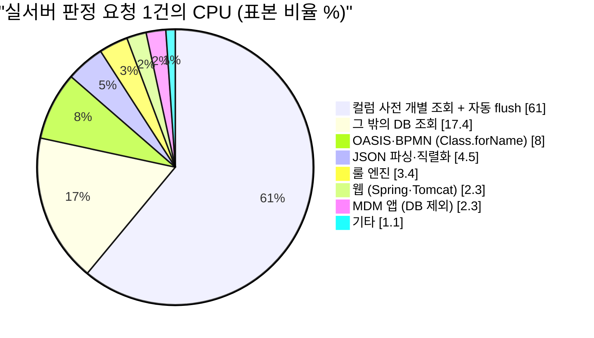

| 영역 | 표본 비율 | 요청 1건 CPU 추정 |
|---|---|---|
| DB 합계 | 78.4% | 약 26ms |
| └ 컬럼 사전 개별 조회 (`RuleVarTypeResolver$Scope.column:250`) | 61% | 약 20ms |
| OASIS·BPMN | 8.0% | 약 2.6ms |
| JSON | 4.5% | 약 1.5ms |
| 룰 엔진 (넘김·EvalEx 포함) | 1~4% | 약 0.5~1.5ms |
| 웹, MDM 앱, 기타 | 5.7% | 약 2ms |

### 5.3 느린 사슬

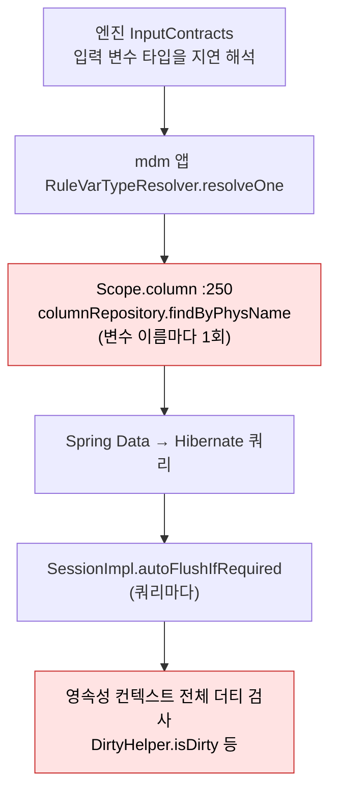

- 사슬의 위쪽에 엔진이 있지만, 비용은 mdm 앱의 타입 해석기에서 난다. 벤치는 메모리 조회기를 써서 이 비용을 보지 못한다.
- 컬럼 사전을 한 번에 읽는 `Scope.preloadColumns` 는 이미 있다. 하지만 `StoredRuleDefinitions.java:64` 한 곳에서만 부른다. 실서버 판정 경로(`StoredDefinitionLookup.java:217-218`)는 이것을 부르지 않아서 변수마다 조회가 나간다.
- 조회가 왜 자동 flush 를 일으키는지(어느 트랜잭션 경계에서 FlushMode AUTO 가 되는지)는 아직 확인하지 않았다.

### 5.4 벤치와 실서버의 차이

| 항목 | 벤치 | 실서버 |
|---|---|---|
| 정의 조회 | 메모리 (호출당 약 0.3µs) | DB 에서 헤더·버전·변수·행을 읽고 변수마다 컬럼 사전 조회 (요청 CPU 의 60~70%) |
| 흐름 | 재사용(A) 또는 매번 파싱(B) | 저장 전 흐름을 매 요청 파싱 |
| 실행 | evaluateSet (추적 없음) | traceSet (추적 켬, 응답 약 7KB) |
| 컴파일러 | C1·C2 | C1 전용 |
| DB | 없음 | 같은 프로세스 SQLite (운영의 네트워크 왕복 없음) |
| 엔진 몫 | 판정 시간 전부 | 요청의 1~4% |

---

## 6. 개선 후보

### 6.1 엔진 (벤치 c2 A 215µs 기준)

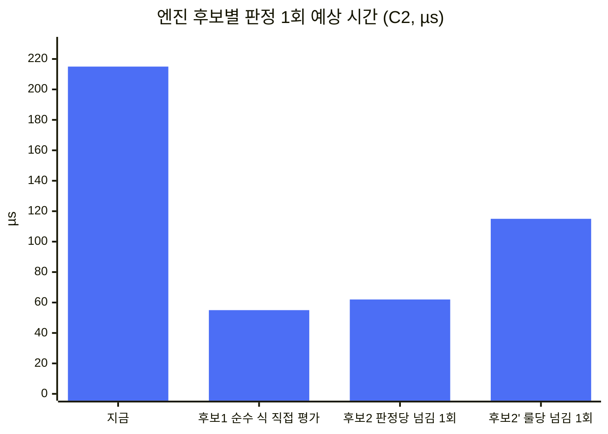

| 순위 | 후보 | 대상 | 예상 효과 | 동작 보존 위험 |
|---|---|---|---|---|
| 1 | 순수 식(DB 조회·업무 함수 없음)은 호출 스레드에서 직접 평가 | `MdmEvaluator.java:130-155` | −65~−75% (215 → 약 55µs) | 순수 식의 1초 제한 시간이 사라진다. 인터럽트 의미가 바뀐다 |
| 2 | 판정 1회를 가상 스레드 하나에서 통째로 실행 | `MdmRuleEngine.java:81-90` | −65~−72% (215 → 약 62µs) | 제한 시간 단위가 "식 1개 1초"에서 "판정 1회"로 바뀐다. 오류 위치 표시가 달라질 수 있다 |
| 3 | `withValues` 에 식이 쓰는 변수만 넣기 | `MdmEvaluator.java:137` | −3~−8% | 상수와 같은 이름의 키 오류가 그 이름을 쓰는 식에서만 남는다 |
| 4 | 나눗셈 빠른 길 | `MdmExpressionConfig.java:21` | −2~−8% (신뢰 낮음) | 결과 스케일 차이 |
| 5~10 | FlowKeys 사전 계산, Run 생성 캐시, ctx 복사 줄이기 등 | 각 파일 | 각 −0.2~−1.5% | 낮음~중간 |

- 후보 1과 2의 효과 차이는 넘김 1회(A 의 약 3%)라 측정 흔들림 안이다. 그래서 둘 중 하나는 효과가 아니라 동작 보존 위험으로 고른다.
- 아랫단(−65%)은 환산 흔들림과, 리눅스에서는 넘김 비용이 더 작을 가능성을 반영했다(이번 측정은 macOS 만).
- 효과는 세트에서 순수 식이 차지하는 비율에 비례한다. 벤치와 샘플 룰은 모두 순수 식이다.

넘김을 줄이면서 보호를 지키는 대안을 정리하면 다음과 같다.

| 대안 | 내용 | 판정 1회의 넘김 | 지켜지는 보호 | 위험 |
|---|---|---|---|---|
| A | 판정 1회를 통째로 한 번만 넘김 | 25.5회 → 1회 | 호출자 해방, 조회 끊기, 정규식 제한 | 제한 시간 단위·문구 변화, 시간 초과 때 중간 결과 처리, 엔진 밖 호출자는 진입점별 적용 |
| B | 순수 식은 직접 평가, 나머지는 지금처럼 | 순수 식 비율만큼 감소 | 조회·업무 함수 식은 그대로, 정규식 제한 | 순수 식 1초 제한 상실(기본 함수는 유한), 인터럽트 의미 변화, 예외 변환을 같은 `translate` 로 보내야 함 |
| C | 넘기지 않고 마감 시각을 검사 | 0회 | 정규식 제한, 조회 함수 안 검사 | EvalEx 내부 루프는 끊지 못함, 모든 함수를 감싸야 함 |
| D | B + A | 0~1회 | A·B 와 같음 | A·B 의 위험, 범위는 조회 식이 있는 판정으로 좁아짐 |

권고 순서는 **B → 필요하면 D** 다. 어느 대안이든 `MdmEvaluatorTest` 의 제한 시간·인터럽트·예외 변환 시험, 엔진 전체 시험, C2 로 돌린 벤치 짝 측정으로 확인한다.

### 6.2 mdm 앱 (실서버 요청 38ms 기준)

| 순위 | 후보 | 대상 | 예상 효과 | 위험 |
|---|---|---|---|---|
| 앱-1 | 저장 정의를 조회할 때 컬럼 사전을 한 번에 미리 읽기(`Scope.preloadColumns` 호출) | `StoredDefinitionLookup.java:124-126, 217-218` | 요청 −35~−55% (신뢰 낮음~중간). 운영 DB 는 왕복이 줄어드는 만큼 더 크다 | 낮음. 다른 읽기 경로가 이미 쓰는 방식이다 |
| 앱-2 | 읽기 전용 경로의 자동 flush 끄기(readOnly 트랜잭션, FlushMode MANUAL·COMMIT) | `RuleSetEditService.simulate` 근처, `RuleSetRunner.Session`, `RuleVarTypeResolver.Scope` | 단독 −25~−45%, 앱-1 뒤에는 −5~−10% | 중간. `@Transactional` 은 OASIS 파라미터 바인딩을 깨므로 TransactionTemplate 이나 쿼리 힌트로 해야 한다. 쓰기 트랜잭션 경로(I6)는 제외 |

### 6.3 무엇부터 할까

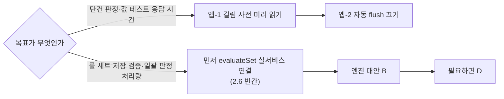

- 지금은 evaluateSet 을 실서비스에서 부르지 않으므로, 엔진 개선의 이득은 아직 사용자가 느낄 곳이 없다.
- 단건 응답은 앱-1 이 가장 크고 위험도 낮다.

---

## 7. 측정 관례에 대한 정정

| 항목 | 지금까지 | 정정 |
|---|---|---|
| 엔진 성능 판정 조건 | gradle 시험 관례대로 C1 | **C2 로 잰다.** C1 은 Java 코드 몫을 키워 보이게 한다(A 305 대 215µs, C 는 3.6배 차이) |
| 10-04 P5 준비 기억 효과 | 4.2~5.5% (C1) | **C2 기준 약 2%**. 판정은 "개선(작음)" 그대로, 크기만 고친다 (`docs/refactor-2026-10/perf-mdm-backend.md` 반영은 결정 대기) |
| 로컬 서버 응답 시간 | 운영과 비슷하다고 봄 | 로컬 bootRun 은 C1 전용이다. 운영 조건으로 재려면 측정용으로만 `bootRun { optimizedLaunch = false }` 를 주거나 `java -jar` 로 띄운다 |

---

## 8. 결정이 필요한 것

1. 저장 경로 시연용 칸을 만들지 (MDM 메타·업무 코드 변경)
2. ruleSets 를 넘기는 첫 업무 save 를 둘지 (evaluateSet 의 첫 실서비스 호출)
3. 업무 오류의 `meta.code` 가 S001(서버 내부 오류)로 나가는 프레임워크 관례를 E001·E002 로 바로잡을지 (2.5)
4. 성능 개선 착수 여부와 순서 (6.3)
5. `perf-mdm-backend.md` 의 P5 수치를 C2 기준으로 정정할지, 엔진 성능은 C2 로 잰다는 관례를 가이드에 둘지

---

## 9. 한계

- **JFR 표본**: JDK 21·macOS 에서 가상 스레드 표본 손실이 크다(c2 벤치 가상 스레드 표본 18개). 그래서 넘김 몫은 표본이 아니라 4.3절 대조 측정으로 판정했다.
- **실서버 표본**: 88개뿐이고 스택이 64단에서 잘렸다(95.5%). 영역 비율은 ±10%p 로 읽는다. 앱-1·앱-2 의 원인은 표본 사슬과 코드를 대조해 정했고, 요청당 SQL 수와 flush 수는 직접 세지 않았다.
- **조건**: macOS, 로컬 C1 서버, 같은 프로세스 SQLite, 추적을 켠 traceSet 경로, 흐름 2종에서 쟀다. 운영(리눅스, C2, 네트워크 DB, 추적 없는 evaluateSet, 넓은 레코드)에서는 앱 쪽 몫이 더 커지고 넘김 비용은 작아질 수 있다.
- **측정 범위**: 넘김 대조는 식 단위다. evaluateSet 전체를 직접 평가 모드로 바꿔 돌린 A/B 비교는 아직 하지 않았다.
- **검증 범위**: 화면(브라우저) 표시는 확인하지 않았다. 도메인 미리보기는 요청에 담긴 표준식으로 판정해서, 서버가 저장된 정의를 스스로 읽는 경로는 확인하지 않았다.

---

## 10. 산출물 (저장소 밖)

| 폴더 | 내용 |
|---|---|
| `~/.coord/rule-engine-2026-10-05/` | 조정 상태(`state.json`), 사건 기록(`events.jsonl`), 레인 착수 지시(`lanes/*/brief.md`) |
| `lanes/verify/` | 판정 보고서 `report.md`, 증거 `artifacts/`(시험 로그, 요청·응답 JSON, `evidence.md`) |
| `lanes/profile/` | 보고서 `report.md`, JFR(`out/c1/bench-c1.jfr`, `out/c2/bench-c2.jfr`, `p3/mdm-p3.jfr`), 집계 코드(`Agg.java`, `p3/AggServer.java`), 넘김 대조 코드(`check/src/.../HandoffBench.java`), 실행 스크립트 |

재실행 방법: dev `6709ce7e`(또는 비교할 커밋)의 `src/backend/maru-mdm-engine` 에서 `../gradlew testClasses` 로 클래스를 만든 뒤, `lanes/profile/run-p3.sh` 의 클래스 경로를 그 `build/classes/java` 로 바꿔 돌린다. 벤치는 `MDM_BENCH=1 ../gradlew -I profile-init.gradle test --rerun --tests '*RuleSetPrepareBenchTest'` 로 돌린다.

---

## 11. 결정 (2026-10-05)

- 성능 개선은 진행하지 않는다. 룰 실행(판정 1회)이 약 0.2ms 라서, 업무 저장 때 사용자가 느끼는 지연이 없다.
- 다시 볼 조건: 수천 행을 한 번에 저장하면서 룰 세트를 여러 개 거는 일괄 처리가 생길 때. 그때 6.1 의 엔진 대안 B 부터 본다.
- 검증 빈칸(2.5 응답 모양, 2.6 시연용 칸)은 성능과 별개로 결정 대기다.
